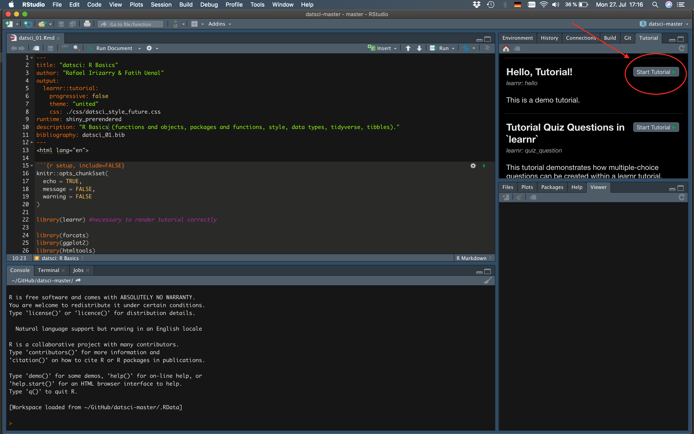

<div style="float: right"></div>

# datsci: Introduction to Data Science with R 

***
> **NOTES**: This package is incomplete but under active development. Check back here for updates/new tutorials. Loading the tutorials on your personal computer for the first time can take a few minutes.

***

### Welcome to the interactive Data Science Introduction package: `datsci`! 

The demand for skilled data science practitioners in industry, academia, and government is rapidly growing. The Harvard Business Review has called the Data Science Profession [“The sexiest Job of the 21st Century”](https://hbr.org/2012/10/data-scientist-the-sexiest-job-of-the-21st-century). 

This interactive course introduces concepts and skills that can help you tackle real-world data analysis challenges. The course covers concepts such as inference, probability, regression, and machine learning and helps you develop an essential skill set that includes  programming, data wrangling with dplyr, data visualization with ggplot2, file organization with Unix/Linux, version control with git and GitHub, and reproducible document preparation with .

The course is spread over 8 sequential modules (datsci_01 - datsci_08):  Basics, Data Visualization, Probability, Inference and Modeling, Productivity Tools, Data Wrangling, Linear Regression, and Machine Learning. Each module has several sections meant to be presented as one lecture and includes dozens of exercises, comprehension checks distributed across sections. 


* **datsci_00**: Introduction to Data Science Course: Course structure, syllabus, grading, and workflow.
* **datsci_01**:   Basics: Build a foundation in  and learn how to wrangle, analyze, and visualize data.
* **datsci_02**: Data Visualization: Learn basic data visualization principles and how to apply them using ggplot2.
* **datsci_03**: Probability: Learn probability theory -- essential for a data scientist -- using a case study on the financial crisis of 2007-2008.
* **datsci_04**: Inference and Modeling: Learn inference and modeling, two of the most widely used statistical tools in data analysis.
* **datsci_05**: Productivity Tools: Keep your projects organized and produce reproducible reports using GitHub, git, Unix/Linux, and .
* **datsci_06**: Wrangling: Learn to process and convert raw data into formats needed for analysis.
* **datsci_07**: Linear Regression: Learn how to use  to implement linear regression, one of the most common statistical modeling approaches in data science.
* **datsci_08**: Machine Learning: Build a movie recommendation system and learn the science behind one of the most popular and successful data science techniques.


In each module, we use motivating case studies. In each case study, we try to realistically mimic a data scientist’s experience. For each of the concepts covered, we start by asking specific questions and answer these through data analysis. We learn the concepts as a means to answer the questions. Examples of the case studies included in the book are: Trends in World Health and Economics, US Crime Rates, The Financial Crisis of 2007-2008, Election Forecasting, Building a Baseball Team (inspired by Moneyball), and Movie Recommendation Systems. Throughout the course, we will be using the R software environment. You will learn , statistical concepts, and data analysis techniques simultaneously. We believe that you can better retain R knowledge when you learn how to solve a specific problem.

The `datsci` package is based on the textbook [Introduction to Data Science](https://rafalab.github.io/dsbook/) by Prof Rafael Irizarry and follows the structure of the associated edX course *HarvardX Professional Certificate in Data Science*. Here, we provide an augmented version of these materials as an interactive learning course created with the [learnr](https://rstudio.github.io/learnr/). The  `datsci` package blends together the textbook materials with assessments, comprehension checks and complementary courses available from external sources such as DataCamp, allowing you to practice and apply your skills on real-world datasets. Together, these resources form a step-by-step syllabus which will allow you to teach yourself R in an interactive and fun way! The `datsci` package is free and offered to support tutors and students who want to learn Data Science with  using the textbook [Introduction to Data Science](https://rafalab.github.io/dsbook/).


### Installing  and 

### Installing 

If you want to install  to work on your own computer, you can download it freely from the [Comprehensive R Archive Network (CRAN)](https://cran.r-project.org/). Note that CRAN makes several versions of  available:  versions for multiple operating systems and releases older than the current one. You want to read the CRAN instructions to assure you download the correct version. If you need further help, you can try the following resources:

- [Installing  on Windows](https://github.com/genomicsclass/windows#installing-r)

- [Installing  on Mac](http://youtu.be/Icawuhf0Yqo)

- [Installing  on Ubuntu](https://cran.r-project.org/bin/linux/ubuntu/README)

### Installing 

 is an integrated development environment (IDE). We highly recommend installing and using  to edit and test your code. You can install  through the [RStudio website](https://www.rstudio.com/products/rstudio/download/). Their [cheatsheet](https://www.rstudio.com/wp-content/uploads/2016/01/rstudio-IDE-cheatsheet.pdf) is a great resource.  You need to install  first.


### Installing `datsci`

To use `datsci` you first need to install  and  and familiarise yourself with ,  as described above. Once you have installed  and  you can install `datsci`. The package is in development so you have to install it from github. To install the package execute (in ):

```
if(!require(remotes)){
  install.packages('remotes')
}

remotes::install_github("FUenal/datsci")
```

If you are trying to install on a networked computer the install might fail (it's to do install.packages not liking UNC paths, which I'm not even going to pretend to understand). The solution is to specify the location of your  library at the point of install. Most networks will map network locations to a drive name (for example, at my own University, users accounts are on the 'N' drive). Find the location of your  library (e.g., `N:/Documents/R/win-library/3.5`), possibly executing `.libPaths()` to help you, and specify this location using the `lib` argument:

```
remotes::install_github("FUenal/datsci"), lib = "N:/Documents/R/win-library/3.5")
```

### Running a tutorial

In  Version 1.3 onwards there is a tutorial pane. Having executed

```
library(datsci)
```

A list of tutorials appears in this pane. Scroll through them and click on the  button to run the tutorial:



**Loading the tutorials on your personal computer for the first time can take a few minutes.**

Alternatively, to run a particular tutorial from the console execute:

```
library(datsci)
learnr::run_tutorial("name_of_tutorial", package = "datsci")
```

and replace "name of tutorial" with the name of the tutorial you want to run. For example, to run tutorial 2 execute:

```
learnr::run_tutorial("datsci_02", package = "datsci")
```

The name of each tutorial is in bold in the list above. Once the command to run the tutorial is executed it will spring to life in a web browser.

### Suggested workflow

The course is created such that each module builds on the previous ones. Thus, we recommend you work your way through the entire series. If you already possess a beginners or intermediate level of  programming, you will quickly work through the first three modules and can use them as a refresher for your existing skills. To get the best learning effect, we recommend that you run the analyses from the modules in a separate file (for example a RMarkdown file) and take notes while doing so. This approach will enable you to take notes and replicate the coding examples yourself.  

### Datasets

See the book or data descriptions for more details. This is a list of available datasets within the package. Raw CSV files are available from the book's website.

* **HistData**: Galton’s data on the heights of parents and their children from his historic research on heredity. For details execute `?HistData`.
* **murders**: Data that contains demographic infos across US States. For details execute `?murders`.


### Acknowledgement

I am extremely grateful to [Prof Rafael Irizarry](http://rafalab.github.io/pages/about.html) for his support and encouragement to create this interactive tutorial which is based on his freely available textbook [Introduction to Data Science](https://rafalab.github.io/dsbook/). The textbook has been developed as the basis for the associated edX Course Series *HarvardX Professional Certificate in Data Science* and this tutorial follows the structure of this online course. I'm further very grateful to [Andy Field](https://profiles.sussex.ac.uk/p9846-andy-field) for his generous permission to use his `discovr` package as a basis for the development of this tutorial. Thanks to his amazing `discovr` package I also indirectly benefited from the work of [Allison Horst](https://www.allisonhorst.com/) and her very informative blog post on [styling learnr tutorials with CSS](https://education.rstudio.com/blog/2020/05/learnr-for-remote/) as well as her CSS template file which I adapted here. 

***
> **NOTES**: This interactive tutorial contains materials from the textbook [Introduction to Data Science](https://rafalab.github.io/dsbook/) by [Prof Rafael Irizarry](http://rafalab.github.io/) and follows the structure of the associated edX course *HarvardX Professional Certificate in Data Science*. The textbook is licensed under the [Creative Commons Attribution-NonCommercial-ShareAlike 4.0 International (CC BY-NC-SA 4.0)](https://creativecommons.org/licenses/by-nc-sa/4.0/). The content of this package will be slightly modified and thus deviate from the original textbook materials (datasets and excersises).

***

