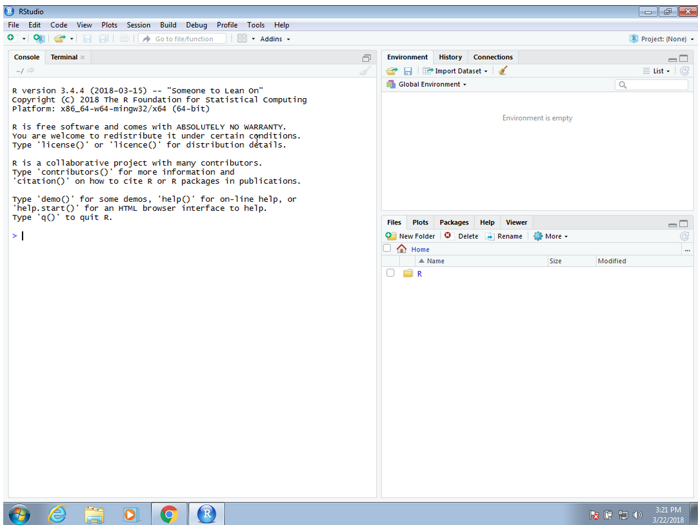
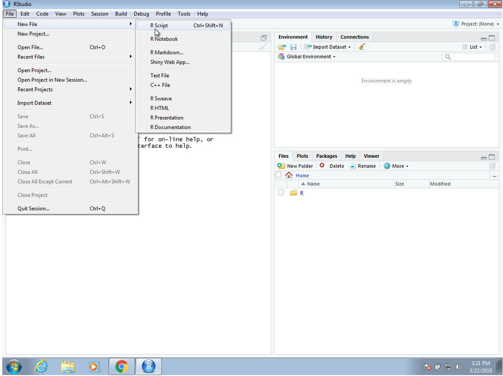
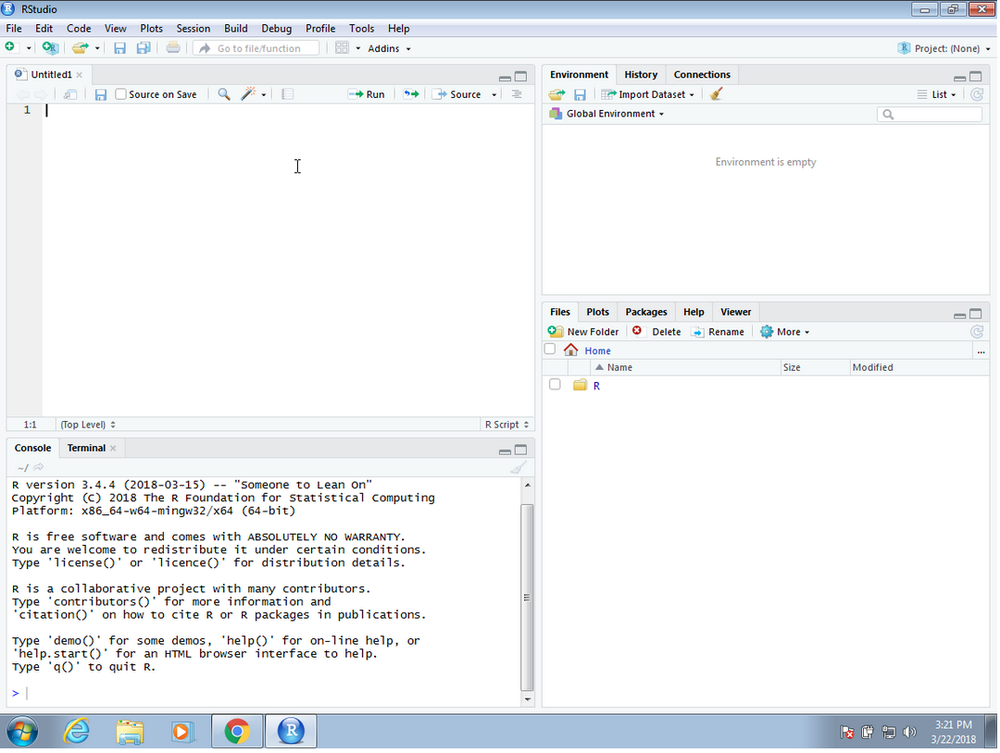
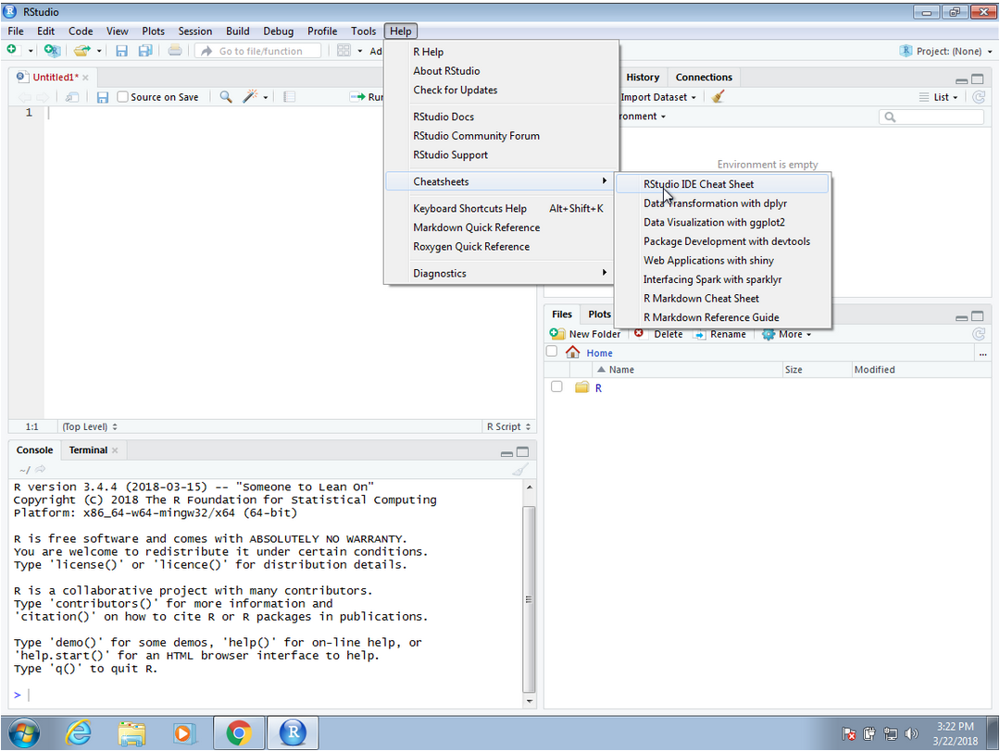
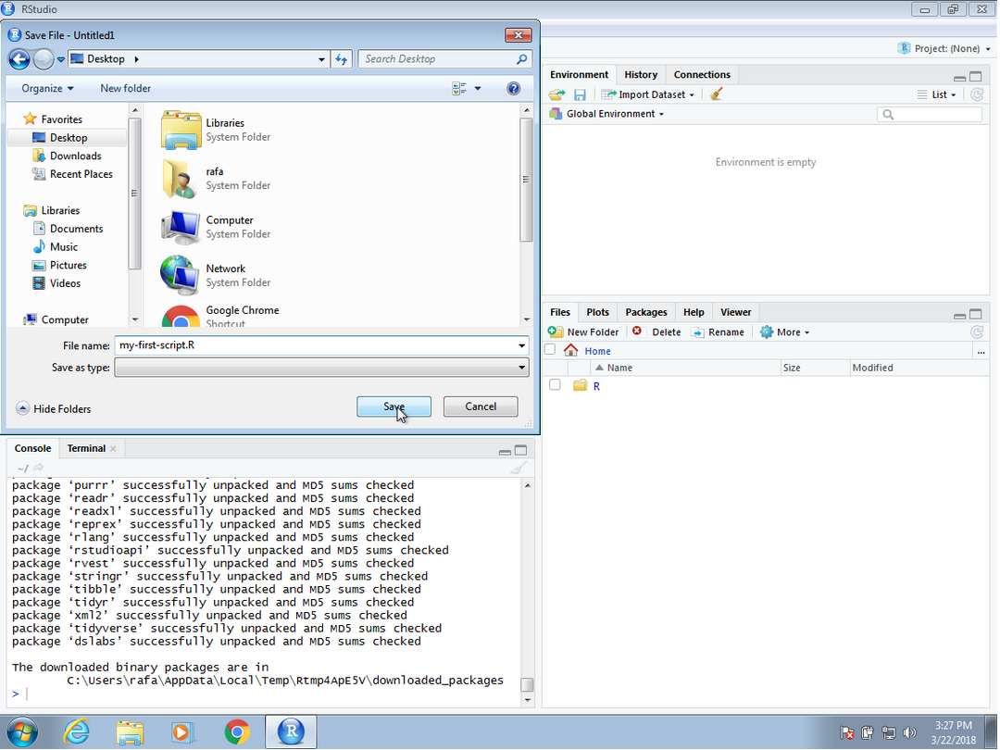
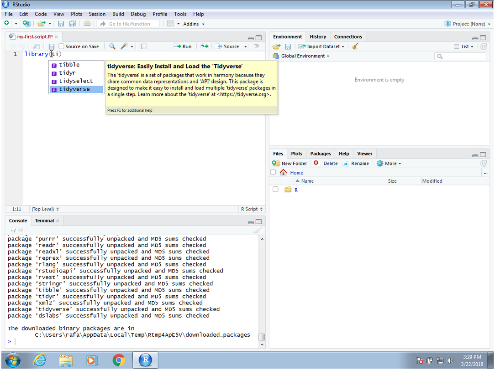
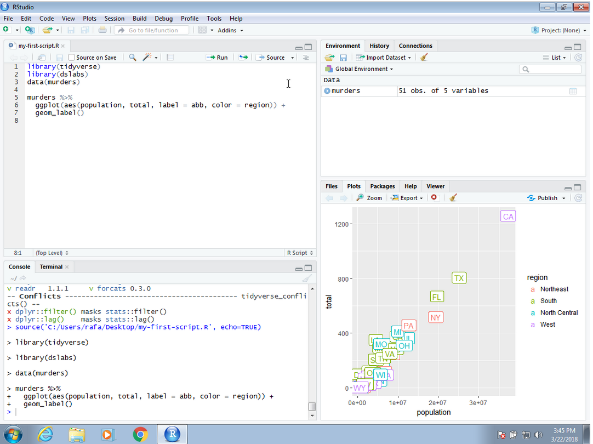
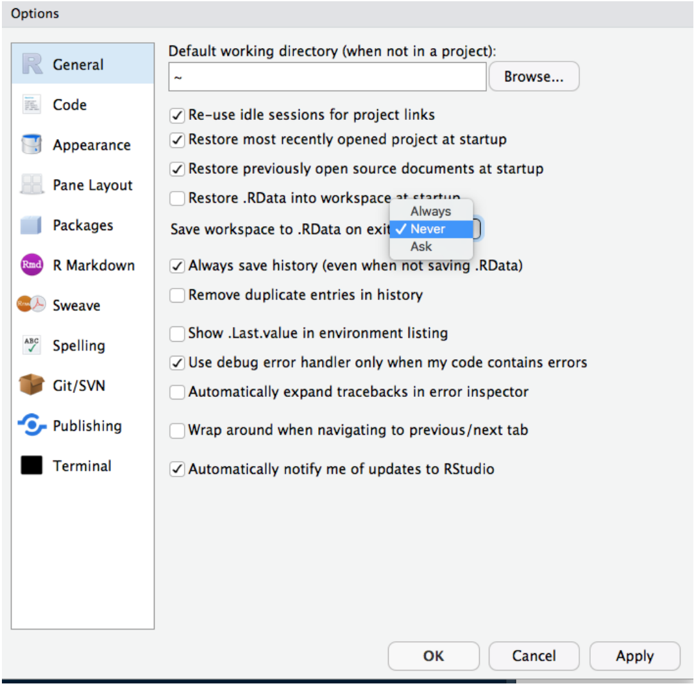

<html lang="en">

```{r setup, include=FALSE}
knitr::opts_chunk$set(
	echo = TRUE,
	message = FALSE,
	warning = FALSE
)

library(learnr) #necessary to render tutorial correctly

library(forcats)
library(ggplot2)
library(htmltools)
library(kableExtra)
library(lubridate)
library(magrittr)
library(tibble)


source("./www/discovr_helpers.R")
```

# datsci: Introduction

## Introduction

<div class="infobox">
  **Usage:** This tutorial accompanies [Introduction to Data Science](https://rafalab.github.io/dsbook/) by [Prof Rafael Irizarry](http://rafalab.github.io/pages/about.html). It contains material from the textbook which is offered under a [Creative Commons Attribution-NonCommercial-ShareAlike 4.0 International CC BY-NC-SA 4.0](https://creativecommons.org/licenses/by-nc-sa/4.0/). You can use this tutorial for teaching and non-profit activities under the specified licence terms.
  
</div>

### Introduction to the `datsci` Data Science Course

Hi, welcome to the **datsci** course. The demand for skilled data science practitioners in industry, academia, and government is rapidly growing. This tutorial introduces concepts and skills that can help you tackle real-world data analysis challenges. It covers concepts from probability, statistical inference, linear regression, and machine learning. It also helps you develop skills such as `r rproj()` programming, data wrangling with **dplyr**, data visualization with ggplot2, algorithm building with **caret**, file organization with UNIX/Linux shell, version control with Git and GitHub, and reproducible document preparation with **knitr** and R markdown. The book is divided into six parts: `r rproj()` Basics, **Data Visualization, Data Wrangling, Statistics with `r rproj()`, Machine Learning**, and **Productivity Tools**. Each part has several modules meant to be presented as one lecture and includes dozens of exercises distributed across modules.

### Case Studies

Throughout the book, we use motivating case studies. In each case study, we try to realistically mimic a data scientist’s experience. For each of the concepts covered, we start by asking specific questions and answer these through data analysis. We learn the concepts as a means to answer the questions. Examples of the case studies included in the tutorial are:

| Case Study | Concept | 
| ---- | ---| --- |
| US murder rates by state |  R Basics |
| Student heights | Statistical Summaries |
| Trends in world health and economics | Data Visualization | 
| The impact of vaccines on infectious disease rates | Data Visualization | 
| The financial crisis of 2007-2008 | Probability |
| Election forecasting | Statistical Inference |  
| Reported student heights | Data Wrangling | 
| Money Ball: Building a baseball team | Linear Regression |
| MNIST: Image processing hand-written digits | Machine Learning |
| Movie recommendation systems | Machine Learning | 

### Who will find this tutorial useful?

This tutorial is meant to be an interactive version of the textbook for a first course in Data Science. No previous knowledge of R is necessary, although some experience with programming may be helpful. The statistical concepts used to answer the case study questions are only briefly introduced, so a Probability and Statistics textbook is highly recommended for in-depth understanding of these concepts. If you read and understand all the modules and complete all the exercises, you will be well-positioned to perform basic data analysis tasks and you will be prepared to learn the more advanced concepts and skills needed to become an expert.

### What does this tutorial cover?

We start by going over the **basics of** `r rproj()` and the **tidyverse**. You learn `r rproj()` throughout this tutorial, but in the first part we go over the building blocks needed to keep learning.

The growing availability of informative datasets and software tools has led to increased reliance on **data visualizations** in many fields. In the second part we demonstrate how to use **ggplot2** to generate graphs and describe important data visualization principles.

In the third and fourth part we demonstrate the importance of statistics in data analysis by answering case study questions using **probability and inference** with `r rproj()`.

In the fifth part, we provide a brief introduction to the **productivity tools** we use on a day-to-day basis in data science projects. These are R Studio, UNIX/Linux shell, Git and GitHub, and **knitr** and R Markdown.

The sixth part uses several examples to familiarize the reader with **data wrangling**. Among the specific skills we learn are web scraping, using regular expressions, and joining and reshaping data tables. We do this using **tidyverse** tools.

In the seventh part, we provide a brief introduction to the ** regression** we use on a day-to-day basis in data science projects.

In the eights part we present several challenges that lead us to introduce **machine learning**. We learn to use the **caret** package to build prediction algorithms including K-nearest neighbors and random forests.

In the final part, we present a **Capstone Project** in which you will put to use all the concepts and techniques you have learned on your own Data Science Project!

### What is not covered by this tutorial?

This tutorial focuses on the data analysis aspects of data science. We therefore do not cover aspects related to data management or engineering. Although `r rproj()` programming is an essential part of this tutorial, we do not teach more advanced computer science topics such as data structures, optimization, and algorithm theory. Similarly, we do not cover topics such as web services, interactive graphics, parallel computing, and data streaming processing. The statistical concepts are presented mainly as tools to solve problems and in-depth theoretical descriptions are not included in this tutorial.

## Getting started with R and RStudio [(1)]{.alt}

### 1.1 Why `r rproj()`

R is not a programming language like C or Java. It was not created by software engineers for software development. Instead, it was developed by statisticians as an interactive environment for data analysis. You can read the full history in the paper A Brief History of S5. The interactivity is an indispensable feature in data science because, as you will soon learn, the ability to quickly explore data is a necessity for success in this field. However, like in other programming languages, you can save your work as scripts that can be easily executed at any moment. These scripts serve as a record of the analysis you performed, a key feature that facilitates reproducible work. If you are an expert programmer, you should not expect `r rproj()` to follow the conventions you are used to since you will be disappointed. If you are patient, you will come to appreciate the unequal power of `r rproj()` when it comes to data analysis and, specifically, data visualization.

Other attractive features of R are:

1. R is free and open source^[https://opensource.org/history].
2. It runs on all major platforms: Windows, Mac Os, UNIX/Linux.
3. Scripts and data objects can be shared seamlessly across platforms.
4. There is a large, growing, and active community of R users and, as a result, there are numerous resources for learning and asking questions^[https://stats.stackexchange.com/questions/138/free-resources-for-learning-r] ^[https://www.r-project.org/help.html] ^[https://stackoverflow.com/documentation/r/topics]. 
5. It is easy for others to contribute add-ons which enables developers to share software implementations of new data science methodologies. This gives R users early access to the latest methods and to tools which are developed for a wide variety of disciplines, including ecology, molecular biology, social sciences, and geography, just to name a few examples. 

### 1.2 The `r rproj()` console

Interactive data analysis usually occurs on the **R console** that executes commands as you type them. There are several ways to gain access to an R console. One way is to simply start R on your computer. The console looks something like this:

<figure>

<figcaption>Figure 1: R Console Display.</figcaption>
</figure> 


As a quick example, try using the console to calculate a 15% tip on a meal that cost $19.71:

```{r met_datar_2-setup}
0.15 * 19.71 
```

```{r met_datar_2, exercise=TRUE}
0.15 * 19.71 
```

Note that in this book, grey boxes are used to show R code typed into the R console. The symbol `#>` is used to denote what the R console outputs.

### 1.3 Scripts

One of the great advantages of R over point-and-click analysis software is that you can save your work as scripts. You can edit and save these scripts using a text editor. The material in this book was developed using the interactive *integrated development environment* (IDE) RStudio^[https://www.rstudio.com/]. RStudio includes an editor with many R specific features, a console to execute your code, and other useful panes, including one to show figures.

<figure>

<figcaption>Figure 1: R Studio.</figcaption>
</figure> 

Most web-based R consoles also provide a pane to edit scripts, but not all permit you to save the scripts for later use.

All the R scripts used to generate this book can be found on GitHub^[https://github.com/rafalab/dsbook].

### 1.4 RStudio {#rstudio}

RStudio will be our launching pad for data science projects. It not only provides an editor for us to create and edit our scripts but also provides many other useful tools. In this section, we go over some of the basics.

### 1.4.1 The panes

When you start RStudio for the first time, you will see three panes. The left pane shows the R console. On the right, the top pane includes tabs such as  *Environment* and *History*, while the bottom pane shows five tabs: *File*, *Plots*, *Packages*, *Help*, and *Viewer* (these tabs may change in new versions). You can click on each tab to move across the different features.

<figure>

</figure> 

To start a new script, you can click on File, then New File, then R Script.

<figure>

</figure> 

This starts a new pane on the left and it is here where you can start writing your script.

<figure>

</figure> 

### 1.4.2 Key bindings

Many tasks we perform with the mouse can be achieved with a combination of key strokes instead. These keyboard versions for performing tasks are referred to as *key bindings*. For example, we just showed how to use the mouse to start a new script, but you can also use a key binding: Ctrl+Shift+N on Windows and command+shift+N on the Mac. 

Although in this tutorial we often show how to use the mouse, **we highly recommend that you memorize key bindings for the operations you use most**. RStudio provides a useful cheat sheet with the most widely used commands. You can get it from RStudio directly:

<figure>

</figure> 

You might want to keep this handy so you can look up key-bindings when you find yourself performing repetitive point-and-clicking.

### 1.4.3 Running commands while editing scripts

There are many editors specifically made for coding. These are useful because color and indentation are automatically added to make code more readable. RStudio is one of these editors, and it was specifically developed for R. One of the main advantages provided by RStudio over other editors is that we can test our code easily as we edit our scripts. Below we show an example.

Let's start by opening a new script as we did before. A next step is to give the script a name. We can do this through the editor by saving the current new unnamed script. To do this, click on the save icon or use the key binding Ctrl+S on Windows and command+S on the Mac.  

When you ask for the document to be saved for the first time, RStudio will prompt you for a name. A good convention is to use a descriptive name, with lower case letters, no spaces, only hyphens to separate words, and then followed by the suffix *.R*. We will call this script *my-first-script.R*.

<figure>

</figure> 

Now we are ready to start editing our first script. The first lines of code in an R script are dedicated to loading the libraries we will use. Another useful RStudio feature is that once we type `library()` it starts auto-completing with libraries that we have installed. Note what happens when we type `library(ti)`:

<figure>

</figure> 

Another feature you may have noticed is that when you type `library(` the second parenthesis is automatically added. This will help you avoid one of the most common errors in coding: forgetting to close a parenthesis.

Now we can continue to write code. As an example, we will make a graph showing murder totals versus population totals by state. Once you are done writing the code needed to make this plot, you can try it out by *executing* the code. To do this, click on the *Run* button on the upper right side of the editing pane. You can also use the key binding: Ctrl+Shift+Enter on Windows or command+shift+return on the Mac.

Once you run the code, you will see it appear in the R console and, in this case, the generated plot appears in the plots console. Note that the plot console has a useful interface that permits you to click back and forward across different plots, zoom in to the plot, or save the plots as files.

<figure>

</figure> 

To run one line at a time instead of the entire script, you can use Control-Enter on Windows and command-return on the Mac.

### 1.4.4 Changing global options

You can change the look and functionality of RStudio quite a bit. 

To change the global options you click on *Tools* then *Global Options....*

As an example we show how to make a change that we *highly recommend*. This is to change the *Save workspace to .RData on exit* to *Never* and uncheck the *Restore .RData into workspace at start*. By default, when you exit R saves all the objects you have created into a file called .RData. This is done so that when you restart the session in the same folder, it will load these objects. We find that this causes confusion especially when we share code with colleagues and assume they have this .RData file. To change these options, make your *General* settings look like this:

<figure>

</figure> 

### 1.5 Installing R packages

The functionality provided by a fresh install of R is only a small fraction of what is possible. In fact, we refer to what you get after your first install as *base R*. The extra functionality comes from add-ons available from developers. There are currently hundreds of these available from CRAN and many others shared via other repositories such as GitHub. However, because not everybody needs all available functionality, R instead makes different components available via _packages_. R makes it very easy to install packages from within R. For example, to install the __dslabs__ package, which we use to share datasets and code related to this book, you would type:

```{r,eval=FALSE}
install.packages("dslabs")
```

In RStudio, you can navigate to the _Tools_ tab and select install packages. We can then load the package into our R sessions using the `library` function:

```{r}
library(dslabs)
```

As you go through this book, you will see that we load packages without installing them. This is because once you install a package, it remains installed and only needs to be loaded with `library`. The package remains loaded until we quit the R session. If you try to load a package and get an error, it probably means you need to
install it first. 

We can install more than one package at once by feeding a character vector to this function:

```{r, eval=FALSE, echo=TRUE}
install.packages(c("tidyverse", "dslabs"))
```

Note that installing __tidyverse__ actually installs several packages. This commonly occurs when a package has *dependencies*, or uses functions from other packages. When you load a package using `library`, you also load its dependencies.

Once packages are installed, you can load them into R and you do not need to install them again, unless you install a fresh version of R. Remember packages are installed in R not RStudio.

It is helpful to keep a list of all the packages you need for your work in a script because if you need to perform a fresh install of R, you can re-install all your packages by simply running a script.

You can see all the packages you have installed using the following function:

```{r, eval=FALSE, echo=TRUE}
installed.packages()
```


```{r, include=FALSE}
knitr::opts_chunk$set(out.width = NULL, out.extra = NULL)
```

### 1.6 Workflow

* The tutorials are self-contained (you practice code in code boxes). However, so you get practice at working in `r rstudio()` I strongly recommend that you create an `r rproj()` markdown file within an `r rstudio()` project and practice everything you do in the tutorial in the `r rproj()` markdown file, make notes on things that confused you or that you want to remember, and save it. Within this markdown file you will need to load the relevant packages and data. 
