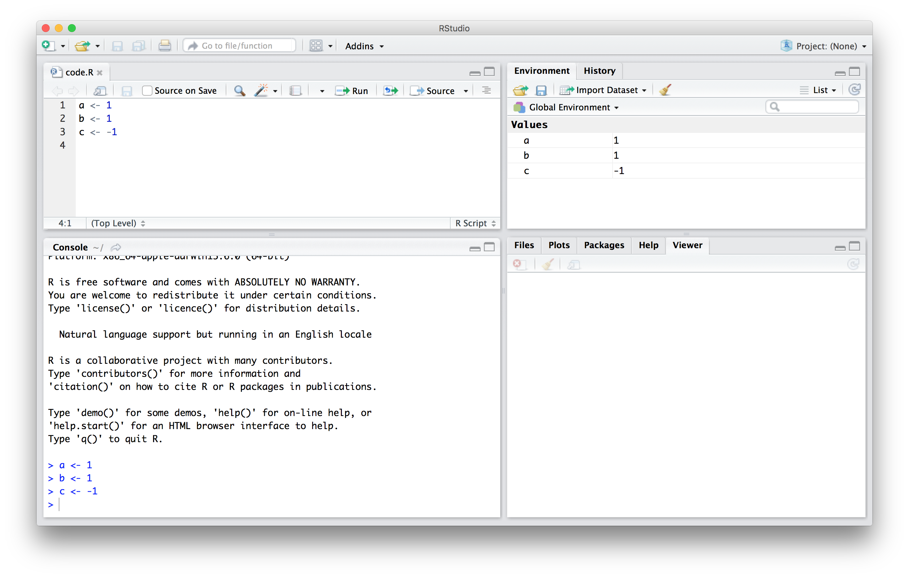

<html lang="en">

```{r setup, include=FALSE}
knitr::opts_chunk$set(
	echo = TRUE,
	message = FALSE,
	warning = FALSE
)

library(learnr) #necessary to render tutorial correctly

library(forcats)
library(ggplot2)
library(htmltools)
library(kableExtra)
library(lubridate)
library(magrittr)
library(tibble)


source("./www/datsci_helpers.R")
```

# datsci_01: `r rproj()` Basics

## Introduction and Welcome!

<div class="infobox">
  
  
  **Usage:** This tutorial accompanies the textbook [Introduction to Data Science](https://rafalab.github.io/dsbook/) by [Prof Rafael Irizarry](http://rafalab.github.io/pages/about.html). It contains material from the textbook which is offered under a [Attribution-NonCommercial-ShareAlike 4.0 International (CC BY-NC-SA 4.0)](https://creativecommons.org/licenses/by-nc-sa/4.0/). 
  
</div>

### Welcome to the `datsci` Data Science Course

We're excited to have you join us in this *Data Science: `r rproj()` Basics* course, which is designed to teach you the basics of analyzing, visualizing, and working with data using `r rproj()`.

This is the first course in the Introduction to Data Science tutorial, a series of courses that prepare you to do data analysis in `r rproj()`, from simple computations to machine learning.

This course assumes you are comfortable with basic math, algebra and logical operations. You do not need to have coding experience as you will have ample opportunities in this course to practice your coding skills. In fact, for all assignments in `r rproj()` that allow you to program directly in a browser-based interface. You will not need to download any additional software other than `r rproj()` and RStudio and the `datsci` package.

Using a combination of a guided introductions and more independent in-depth exploration, you will get to practice your new `r rproj()` skills on real-life applications.

### In this course, you will:

- Learn to read, extract, and create datasets in `r rproj()`
- Learn to perform a variety of operations on datasets using `r rproj()`
- Learn to write your own functions/sub-routines in `r rproj()`

### Course overview

**Section 1:** `r rproj()` Basics, Functions, Data types

- You will get started with `r rproj()`, learn about its functions and data types. 

**Section 2:** Vectors, Sorting

- You will learn to operate on vectors and advanced functions such as sorting. 

**Section 3:** Indexing, Data Manipulation, Plots

- You will learn to wrangle and visualize data.

**Section 4:** Programming Basics

- You will learn to use general programming features like ‘if-else’, and ‘for loop’ commands, and write your own functions to perform various operations on datasets.

--- 

### Meet the Course Instructor

<div class="infobox">
  

**Fatih Uenal** is currenlty a Visitng Postdoctoral Researcher at the University of Cambridge, Department of Psychology, where he conducts research on the psychology of anthropocentrism and social and ecological dominance. Prior to his current position, he has worked as a postdoc at [Harvard University](https://scholar.harvard.edu/fatih-uenal/home). Together with [Prof Rafael Irizarry](http://rafalab.github.io/pages/about.html) he programmed this interactive tutorial based on the the textbook [*Introduction to Data Science*](https://rafalab.github.io/dsbook/). This interactive tutorial is developed using the `learnr` package. It has a general social scientists audience in mind and is suited for undergrad and graduate levels of study. 

Webpage: https://scholar.harvard.edu/fatih-uenal/home

</div>

---

### Essential Course Information

#### **Course Objectives**

“Data science” is a catch-all term used to describe the practice of working with and analyzing messy data sources to draw meaningful conclusions using techniques developed by computer scientists and computational statisticians. The purpose of this course is to give students who are training as quantitative social scientists a broad introduction to this skillset via the statistical programming language, `r rproj()`. You will learn how to conduct many statistical analyses such as univariate statistics (e.g., ANOVA, correlation, regression) in `r rproj()` that you may have already done in SPSS, Excel, or another such program. Additionally, we will build on this foundation to explore new skillsets uncommon in the social sciences, such as natural language processing, automated data curation, and machine learning. 

At the end of this course you will be able to:

- To answer research questions in Social Sciences (e.g., Psychology) with data

- Understand the basics of research designs in Social Sciences, and how they relate to data-analysis strategies

- Develop an intuitive, practical, and conceptual understanding of strategies for asking and answering questions with data

- To use `r rproj()`, a free and open-source statistics software program.

- Develop a basic understanding of frequently used Data Science Techniques.

- Practice your newly acquired skills with interesting, interactive, and fun projects.

**NOTE**: The schedule and procedures described in this syllabus are subject to change depending on specific needs and requirements. You will always be notified of changes on the homepage (see “last update”).


#### **Course Structure**

This is the first module in a series of a 8 week-intensive course.  and I suggest that you devote approx 10 hours a week to learning `r rproj()`, or if you are teaching graduate students, I’d recommend adopting the schedule below, which is designed for an intense but doable semester-long course, one module per week.  It is intended to take the average graduate student roughly 10 hours per week to complete all required tasks.However, some number of students will find programming to be more challenging and may take up to 15 hours per week.  Some will breeze through the material in 5.

#### **Grading**

Each Monday, lessons will be assigned from datacamp.com. Some of these lessons will be complete DataCamp courses, and others will be specific modules of courses. This will all be managed by assigning content to your (free) DataCamp account. The amount of content assigned will vary between one and two courses of content. DataCamp considers a course to be roughly 4 hours of lessons, which includes practice time. Realistically, the time you need will depend upon how intuitive you find `r rproj()` to be. For students already familiar with other programming languages and those with previous `r rproj()` experience, “8 hours” of courses is realistically closer to 2 hours; for complete novices that also find the material difficult, 8 hours is a realistic estimate. It is strongly recommended that you stretch out DataCamp lessons across the assignment period, for example, allocating 1 hour each day. You will gain the most by treating this as a foreign language immersion course by using R every day, including for your own research.
Remember that you can always go to the **Slack Group** for help. 

#### **Passing Rate**

The passing rate is 70%. 

---

### Pre-Course Survey

--Insert Survey Link here--

*If you cannot see the survey above, click this link to access it in a new window.*

---

### Installing `r rproj()` and R Studio

#### **Installing R**

If you want to install `r rproj()` to work on your own computer, you can download it freely from the [Comprehensive R Archive Network (CRAN)](https://cran.r-project.org/). Note that CRAN makes several versions of `r rproj()` available:  versions for multiple operating systems and releases older than the current one. You want to read the CRAN instructions to assure you download the correct version. If you need further help, you can try the following resources:

- [Installing `r rproj()` on Windows](https://github.com/genomicsclass/windows#installing-r)
- [Installing `r rproj()` on Mac](http://youtu.be/Icawuhf0Yqo)
- [Installing `r rproj()` on Ubuntu](https://cran.r-project.org/bin/linux/ubuntu/README)

#### **Installing RStudio**

RStudio is an integrated development environment (IDE). We highly recommend installing and using RStudio to edit and test your code. You can install RStudio through the [RStudio website](https://www.rstudio.com/products/rstudio/download/). Their [cheatsheet](https://www.rstudio.com/wp-content/uploads/2016/01/rstudio-IDE-cheatsheet.pdf) is a great resource.  You need to install `r rproj()` first.

---

## Section 1: R Basics, Functions, Data types 

Section 1 introduces you to `r rproj()` Basics, Functions and Datatypes.

In Section 1, you will learn to:

- Appreciate the rationale for data analysis using `r rproj()`
- Define objects and perform basic arithmetic and logical operations
- Use pre-defined functions to perform operations on objects
- Distinguish between various data types

There are 2 assignments that use the DataCamp platform for you to practice your coding skills.

We encourage you to use `r rproj()` to interactively test out your answers and further your learning.

---

### Section 1: R Basics

<div class="infobox">
  
**Textbook link** The contents are discussed within the [textbook section on the R basics - 2. Objects](https://rafalab.github.io/dsbook/r-basics.html). 
  
</div>

--- 

In this course, we will be using the R software environment for all our analysis. You will learn R and data analysis techniques simultaneously. To follow along you will therefore need access to R. We also recommend the use of an _integrated development environment_ (IDE), such as RStudio, to save your work. 
Note that it is common for a course or workshop to offer access to an R environment and an IDE through your web browser, as done by [RStudio cloud](https://rstudio.cloud). If you have access to such a resource, you don't need to install R and RStudio. However, if you intend on becoming an advanced data analyst, we highly recommend [installing these tools on your computer](https://rafalab.github.io/dsbook/installing-r-rstudio.html). 
Both R and RStudio are free and available online. 


###  1.1 Case study: US Gun Murders

Imagine you live in Europe and are offered a job in a US company with many locations across all states. It is a great job, but news with headlines such as [**US Gun Homicide Rate Higher Than Other Developed Countries**](http://abcnews.go.com/blogs/headlines/2012/12/us-gun-ownership-homicide-rate-higher-than-other-developed-countries/) have you worried. Charts like this may concern you even more:


<center>
  
  
<figure>

</figure> 


</center>


<!--(Source:
[Ma’ayan Rosenzweigh/ABC News](https://abcnews.go.com/blogs/headlines/2012/12/us-gun-ownership-homicide-rate-higher-than-other-developed-countries/), Data from UNODC Homicide Statistics) -->

---

Or even worse, this version from [everytown.org](https://everytownresearch.org):


<center>
  
  
<figure>

</figure> 


</center>

<!--(Source  [everytown.org](https://everytownresearch.org))-->

---

But then you remember that the US is a large and diverse country with 50 very different states as well as the District of Columbia (DC). 


<center>

```{r us-murders-by-state-map, message=FALSE, echo=FALSE}
library(tidyverse)
library(dslabs)

fifty_states <- map_data("state")
data(murders) 
murders %>% mutate(murder_rate = total/population*10^5,
                  state = tolower(state), 
                  colors= factor(ceiling(pmin(murder_rate, 9)))) %>%
  ggplot(aes(map_id = state)) + 
  geom_map(aes(fill = colors), color = "black", map = fifty_states) + 
  expand_limits(x = fifty_states$long, y = fifty_states$lat) +
  coord_map() +
  scale_x_continuous(breaks = NULL) + 
  scale_y_continuous(breaks = NULL) +
  labs(x = "", y = "") +
  theme(panel.background = element_blank()) + 
  scale_fill_brewer(guide=FALSE) +
  theme_minimal()
rm(fifty_states)
```

</center>

California, for example, has a larger population than Canada, and 20 US states have populations larger than that of Norway. In some respects, the variability across states in the US is akin to the variability across countries in Europe. Furthermore, although not included in the charts above, the murder rates in Lithuania, Ukraine, and Russia are higher than 4 per 100,000. So perhaps the news reports that worried you are too superficial. You have options of where to live and want to determine the safety of each particular state. We will gain some insights by examining data related to gun homicides in the US during 2010 using R. 

Before we get started with our example, we need to cover logistics as well as some of the very basic building blocks that are required to gain more advanced R skills. Be aware that the usefulness of some of these building blocks may not be immediately obvious, but later in the book you will appreciate having mastered these skills.

--- 

### 1.2 The very basics

Before we get started with the motivating dataset, we need to cover the very basics of R.

---

### 1.2.1 Objects

Suppose a high school student asks us for help solving several quadratic equations of the form $ax^2+bx+c = 0$. The quadratic formula gives us the solutions:

$$
\frac{-b - \sqrt{b^2 - 4ac}}{2a}\,\, \mbox{ and } \frac{-b + \sqrt{b^2 - 4ac}}{2a}
$$
which of course change depending on the values of $a$, $b$, and $c$. One advantage of programming languages is that we can define variables and write expressions with these variables, similar to how we do so in math, but obtain a numeric solution. We will write out general code for the quadratic equation below, but if we are asked to solve $x^2 + x -1 = 0$, then we define:

```{r}
a <- 1
b <- 1
c <- -1
```

which stores the values for later use. We use `<-` to assign values to the variables. 

We can also assign values using `=` instead of `<-`, but we recommend against using `=` to avoid confusion.

Copy and paste the code above into your console to define the three variables. Note that R does not print anything when we make this assignment. This means the objects were defined successfully. Had you made a mistake, you would have received an error message. 

To see the value stored in a variable, we simply ask R to evaluate `a` and it shows the stored value:

```{r}
a
```

A more explicit way to ask R to show us the value stored in `a` is using `print` like this:

```{r}
print(a)
```

We use the term _object_ to describe stuff that is stored in R. Variables are examples, but objects can also be more complicated entities such as functions, which are described later.

--- 

### 1.2.2 The workspace

As we define objects in the console, we are actually changing the _workspace_. You can see all the variables saved in your workspace by typing:

```{r}
ls()
```

In RStudio, the _Environment_ tab shows the values:


<center>
  
  
<figure>

</figure> 


</center>


We should see  `a`, `b`, and `c`. If you try to recover the value of a variable that is not in your workspace, you receive an error. For example, if you type `x` you will receive the following message: `Error: object 'x' not found`.

Now since these values are saved in variables, to obtain a solution to our equation, we use the quadratic formula:  

```{r}
(-b + sqrt(b^2 - 4*a*c) ) / ( 2*a )
(-b - sqrt(b^2 - 4*a*c) ) / ( 2*a )
```

---

### 1.2.3 Functions

Once you define variables, the data analysis process can usually be described as a series of _functions_ applied to the data. R includes several predefined functions and most of the analysis pipelines we construct make extensive use of these. 

We already used the `install.packages`, `library`, and `ls` functions. We also used the function `sqrt` to solve the quadratic equation above. There are many more prebuilt functions and even more can be added through packages. These functions do not appear in the workspace because you did not define them, but they are available for immediate use.

In general, we need to use parentheses to evaluate a function. If you type `ls`, the function is not evaluated and instead R shows you the code that defines the function. If you type `ls()` the function is evaluated and, as seen above, we see objects in the workspace.

Unlike `ls`, most functions require one or more _arguments_. Below is an example of how we assign an object to the argument of the function `log`. Remember that we earlier defined `a` to be 1:

```{r}
log(8)
log(a) 
```

You can find out what the function expects and what it does by reviewing the very useful manuals included in R. You can get help by using the `help` function like this:

```{r, eval=FALSE}
help("log")
```

For most functions, we can also use this shorthand:

```{r, eval=FALSE}
?log
```

The help page will show you what arguments the function is expecting. For example, `log` needs `x` and `base` to run. However, some arguments are required and others are optional. You can determine which arguments are optional by noting in the help document that a default value is assigned with `=`. Defining these is optional. For example, the base of the function `log` defaults to `base = exp(1)` making `log` the natural log by default. 

If you want a quick look at the arguments without opening the help system, you can type:

```{r}
args(log)
```

You can change the default values by simply assigning another object:

```{r}
log(8, base = 2)
```

Note that we have not been specifying the argument `x` as such:
```{r}
log(x = 8, base = 2)
```

The above code works, but we can save ourselves some typing: if no argument name is used, R assumes you are entering arguments in the order shown in the help file or by `args`. So by not using the names, it assumes the arguments are `x` followed by `base`:

```{r}
log(8,2)
```

If using the arguments' names, then we can include them in whatever order we want:

```{r}
log(base = 2, x = 8)
```

To specify arguments, we must use `=`, and cannot use `<-`.

There are some exceptions to the rule that functions need the parentheses to be evaluated. Among these, the most commonly used are the arithmetic and relational operators. For example:

```{r}
2 ^ 3
```

You can see the arithmetic operators by typing:

```{r, eval = TRUE}
help("+") 
```

or 

```{r, eval = TRUE}
?"+"
```

and the relational operators by typing: 

```{r, eval = TRUE}
help(">") 
```

or 

```{r}
?">"
```

---

### 1.2.4 Other prebuilt objects

There are several datasets that are included for users to practice and test out functions. You can see all the available datasets by typing:

```{r}
data()
```

This shows you the object name for these datasets. These datasets are objects that can be used by simply typing the name. For example, if you type:

```{r, eval=FALSE}
co2
```
R will show you Mauna Loa atmospheric CO2 concentration data.

Other prebuilt objects are mathematical quantities, such as the constant $\pi$ and $\infty$:
 
```{r}
pi
Inf+1
```

---

### 1.2.5 Variable names

We have used the letters `a`, `b`, and `c` as variable names, but variable names can be almost anything. Some basic rules in R are that variable names have to start with a letter, can't contain spaces, and should not be variables that are predefined in R. For example, don't name one of your variables `install.packages` by typing something like 
`install.packages <- 2`.

A nice convention to follow is to use meaningful words that describe what is stored, use only lower case, and use underscores as a substitute for spaces. For the quadratic equations, we could use something like this:

```{r}
solution_1 <- (-b + sqrt(b^2 - 4*a*c)) / (2*a)
solution_2 <- (-b - sqrt(b^2 - 4*a*c)) / (2*a)
```

For more advice, we highly recommend studying [Hadley Wickham's style guide](http://adv-r.had.co.nz/Style.html).

---

### 1.2.6 Saving your workspace

Values remain in the workspace until you end your session or erase them with the function `rm`. But workspaces also can be saved for later use. In fact, when you quit R, the program asks you if you want to save your workspace. If you do save it, the next time you start R, the program will restore the workspace. 

We actually recommend against saving the workspace this way because, as you start working on different projects, it will become harder to keep track of what is saved. Instead, we recommend you assign the workspace a specific name. You can do this by using the function `save` or `save.image`. To load, use the function `load`. When saving a workspace, we recommend the suffix `rda` or `RData`. In RStudio, you can also do this by navigating to the _Session_ tab and choosing _Save Workspace as_. You can later load it using the _Load Workspace_ options in the same tab.
You can read the help pages on  `save`, `save.image`, and  `load` to learn more. 

---

### 1.2.7 Motivating scripts

To solve another equation such as $3x^2 + 2x -1$, we can copy and paste the code above and then redefine the variables and recompute the solution:

```{r, eval=FALSE}
a <- 3
b <- 2
c <- -1
(-b + sqrt(b^2 - 4*a*c)) / (2*a)
(-b - sqrt(b^2 - 4*a*c)) / (2*a)
```

By creating and saving a script with the code above, we would not need to retype everything each time and, instead, simply change the variable names. Try writing the script above into an editor and notice how easy it is to change the variables and receive an answer.

---

### 1.2.8 Commenting your code 

If a line of R code starts with the symbol `#`, it is not evaluated. We can use this to write reminders of why we wrote particular code. For example, in the script above we could add:


```{r, eval=FALSE}
## Code to compute solution to quadratic equation of the form ax^2 + bx + c
## define the variables
a <- 3 
b <- 2
c <- -1

## now compute the solution
(-b + sqrt(b^2 - 4*a*c)) / (2*a)
(-b - sqrt(b^2 - 4*a*c)) / (2*a)
```

--- 

### Assessment 1

Insert assessment `r rproj()` Basics here

### 1.4 Data Types

Variables in R can be of different types. For example, we need to distinguish numbers from character strings and tables from simple lists of numbers. The function `class` helps us determine what type of object we have:

```{r}
a <- 2
class(a)
```

To work efficiently in R, it is important to learn the different types of variables and what we can do with these.

--- 

### 1.4.1 Data frames 

Up to now, the variables we have defined are just one number. This is not very useful for storing data. The most common way of storing a dataset in R is in a _data frame_. Conceptually, we can think of a data frame as a table with rows representing observations and the different variables reported for each observation defining the columns. Data frames are particularly useful for datasets because we can combine different data types into one object. 

A large proportion of data analysis challenges start with data stored in a data frame. For example, we stored the data for our motivating example in a data frame. You can access this dataset by loading the __dslabs__ library and loading the `murders` dataset using the `data` function:

```{r}
library(dslabs)
data(murders)
```

To see that this is in fact a data frame, we type:

```{r}
class(murders)
```

--- 

### 1.4.2 Examining an object

The function `str` is useful for finding out more about the structure of an object:

```{r, echo=FALSE}
# change str to make sure it stays within margins
str <- function(x) utils::str(x, strict.width = 'wrap')
```

```{r}
str(murders)
```

```{r, echo=FALSE}
# remove str we defiend
rm(str)
```

This tells us much more about the object. We see that the table has 51 rows (50 states plus DC) and five variables. We can show the first six lines using the function `head`:

```{r}
head(murders)
```

In this dataset, each state is considered an observation and five variables are reported for each state.

Before we go any further in answering our original question about different states, let's learn more about the components of this object.

--- 

### 1.4.3 The accessor: `$`

For our analysis, we will need to access the different variables represented by columns included in this data frame. To do this, we use the accessor operator `$` in the following way:

```{r}
murders$population
```

But how did we know to use `population`? Previously, by applying the function `str` to the object `murders`, we revealed the names for each of the five variables stored in this table. We can quickly access the variable names using:

```{r}
names(murders)
```

It is important to know that the order of the entries in `murders$population` preserves the order of the rows in our data table. This will later permit us to manipulate one variable based on the results of another. For example, we will be able to order the state names by the number of murders.

**Tip**: R comes with a very nice auto-complete functionality that saves us the trouble of typing out all the names. Try typing `murders$p` then hitting the _tab_ key on your keyboard. This functionality and many other useful auto-complete features are available when working in RStudio.

--- 

### 1.4.4 Vectors: numerics, characters, and logical

The object `murders$population` is not one number but several. We call these types of objects _vectors_. A single number is technically a vector of length 1, but in general we use the term vectors to refer to objects with several entries. The function `length` tells you how many entries are in the vector:

```{r}
pop <- murders$population
length(pop)
```

This particular vector is _numeric_ since population sizes are numbers:

```{r}
class(pop)
```
In a numeric vector, every entry must be a number. 

To store character strings, vectors can also be of class _character_. For example, the state names are characters:

```{r}
class(murders$state)
```

As with numeric vectors, all entries in a character vector need to be a character.

Another important type of vectors are _logical vectors_. These must be either `TRUE` or `FALSE`. 

```{r}
z <- 3 == 2
z
class(z)
```

Here the `==` is a relational operator asking if 3 is equal to 2. In R, if you just use one `=`, you actually assign a variable, but if you use two `==` you test for equality. 

You can see the other _relational operators_ by typing:

```{r, eval=FALSE}
?Comparison
```

In future sections, you will see how useful relational operators can be.

We discuss more important features of vectors after the next set of exercises.


**Advanced**: Mathematically, the values in `pop` are integers and there is an integer class in R. However, by default, numbers are assigned class numeric even when they are round integers. For example, `class(1)` returns numeric. You can turn them into class integer with the `as.integer()` function or by adding an `L` like this: `1L`. Note the class by typing: `class(1L)`

--- 

### 1.4.5 Factors 

In the `murders` dataset, we might expect the region to also be a character vector. However, it is not:

```{r}
class(murders$region)
```

It is a _factor_. Factors are useful for storing categorical data. We can see that there are only 4 regions by using the `levels` function:


```{r}
levels(murders$region)
```

In the background, R stores these _levels_ as integers and keeps a map to keep track of the labels. This is more memory efficient than storing all the characters. 

Note that the levels have an order that is different from the order of appearance in the factor object. The default in R is for the levels to follow alphabetical order. However, often we want the levels to follow a different order. You can specify an order through the `levels` argument when creating the factor with the `factor` function. For example, in the murders dataset regions are ordered from east to west.  The function `reorder` lets us change the order of the levels of a factor variable based on a summary computed on a numeric vector. We will demonstrate this with a simple example, and will see more advanced ones in the Data Visualization part of the book. 


Suppose we want the levels of the region by the total number of murders rather than alphabetical order. If there are values associated with each level, we can use the `reorder` and specify a data summary to determine the order. The following code takes the sum of the total murders in each region, and reorders the factor following these sums.

```{r}
region <- murders$region
value <- murders$total
region <- reorder(region, value, FUN = sum)
levels(region)
```

The new order is in agreement with the fact that the Northeast has the least murders and the South has the most.

**Warning**: Factors can be a source of confusion since sometimes they behave like characters and sometimes they do not. As a result, confusing factors and characters are a common source of bugs.  

--- 

### 1.4.6 Lists

Data frames are a special case of _lists_. We will cover lists in more detail later, but know that they are useful because you can store any combination of different types. Below is an example of a list we created for you:


```{r, echo=FALSE}
record <- list(name = "John Doe",
             student_id = 1234,
             grades = c(95, 82, 91, 97, 93),
             final_grade = "A")
```

```{r}
record
class(record)
```

As with data frames, you can extract the components of a list with the accessor `$`. In fact, data frames are a type of list.

```{r}
record$student_id
```

We can also use double square brackets (`[[`) like this:

```{r}
record[["student_id"]]
```

You should get used to the fact that in R, there are often several ways to do the same thing, such as accessing entries.

You might also encounter lists without variable names.

```{r, echo=FALSE}
record2 <- list("John Doe",
             1234)
```

```{r}
record2
```

If a list does not have names, you cannot extract the elements with `$`, but you can still use the brackets method and instead of providing the variable name, you provide the list index, like this:

```{r}
record2[[1]]
```


We won't be using lists until later, but you might encounter one in your own exploration of R. For this reason, we show you some basics here. 

--- 

### 1.4.7 Matrices 

Matrices are another type of object that are common in R. Matrices are similar to data frames in that they are two-dimensional: they have rows and columns. However, like numeric, character and logical vectors, entries in matrices have to be all the same type. For this reason data frames are much more useful for storing data, since we can have characters, factors, and numbers in them. 

Yet matrices have a major advantage over data frames: we can perform matrix algebra operations, a powerful type of mathematical technique. We do not describe these operations in this book, but much of what happens in the background when you perform a data analysis involves matrices. We cover matrices in more detail in Chapter \@ref(matrix-algebra) but describe them briefly here since some of the functions we will learn return matrices. 

We can define a matrix using the `matrix` function. We need to specify the number of rows and columns.

```{r}
mat <- matrix(1:12, 4, 3)
mat
```

You can access specific entries in a matrix using square brackets (`[`). If you want the second row, third column, you use:

```{r}
mat[2, 3]
```

If you want the entire second row, you leave the column spot empty:

```{r}
mat[2, ]
```

Notice that this returns a vector, not a matrix.

Similarly, if you want the entire third column, you leave the row spot empty:

```{r}
mat[, 3]
```

This is also a vector, not a matrix.

You can access more than one column or more than one row if you like. This will give you a new matrix.

```{r}
mat[, 2:3]
```

You can subset both rows and columns:

```{r}
mat[1:2, 2:3]
```

We can convert matrices into data frames using the function `as.data.frame`:

```{r}
as.data.frame(mat)
```

You can also use single square brackets (`[`) to access rows and columns of a data frame:

```{r}
data("murders")
murders[25, 1]
murders[2:3, ]
```

--- 

### Assessment 2

Insert assessment `r rproj()` Basics here

## Section 2: Vectors, Sorting 

Section 2 introduces you to vectors and functions such as sorting.

In Section 2.1, you will: 

- Create numeric and character vectors. 
- Name the columns of a vector. 
- Generate numeric sequences. 
- Access specific elements or parts of a vector.
- Coerce data into different data types as needed. 

In Section 2.2, you will: 

- Sort vectors in ascending and descending order. 
- Extract the indices of the sorted elements from the original vector. 
- Find the maximum and minimum elements, as well as their indices, in a vector. 
- Rank the elements of a vector in increasing order. 

In Section 2.3, you will: 

- Perform arithmetic between a vector and a single number.
- Perform arithmetic between two vectors of same length. 

There are 3 assignments for you to practice your coding skills.

We encourage you to use `r rproj()` to interactively test out your answers and further your learning.

--- 

### Section 2.1: Create Vectors

<div class="infobox">
  
  **Textbook link** The contents are discussed within the [textbook section on the R basics - 2.6 Vectors](https://rafalab.github.io/dsbook/r-basics.html#vectors).
  
</div>

### 2.1 Vectors

In R, the most basic objects available to store data are _vectors_. As we have seen, complex datasets can usually be broken down into components that are vectors. For example, in a data frame, each column is a vector. Here we learn more about this important class.

### 2.1.1 Creating vectors

We can create vectors using the function `c`, which stands for _concatenate_. We use `c` to concatenate entries in the following way:

```{r}
codes <- c(380, 124, 818)
codes
```

We can also create character vectors. We use the quotes to denote that the entries are characters rather than variable names.

```{r}
country <- c("italy", "canada", "egypt")
```

In R you can also use single quotes:

```{r}
country <- c('italy', 'canada', 'egypt')
```

But be careful not to confuse the single quote ' with the _back quote_ `. 

By now you should know that if you type:

```{r, eval=FALSE}
country <- c(italy, canada, egypt)
```
you receive an error because the variables `italy`, `canada`, and `egypt` are not defined. If we do not use the quotes, R looks for variables with those names and returns an error.

In R, the most basic objects available to store data are _vectors_. As we have seen, complex datasets can usually be broken down into components that are vectors. For example, in a data frame, each column is a vector. Here we learn more about this important class.

--- 

### 2.1.2 Names

Sometimes it is useful to name the entries of a vector. For example, when defining a vector of country codes, we can use the names to connect the two:

```{r}
codes <- c(italy = 380, canada = 124, egypt = 818)
codes
```

The object `codes` continues to be a numeric vector:
```{r}
class(codes)
```

but with names:
```{r}
names(codes)
```

If the use of strings without quotes looks confusing, know that you can use the quotes as well:

```{r}
codes <- c("italy" = 380, "canada" = 124, "egypt" = 818)
codes
```

There is no difference between this function call and the previous one. This is one of the many ways in which R is quirky compared to other languages.

We can also assign names using the `names` functions:

```{r}
codes <- c(380, 124, 818)
country <- c("italy","canada","egypt")
names(codes) <- country
codes
```

--- 

### 2.1.3 Sequences

Another useful function for creating vectors generates sequences:

```{r}
seq(1, 10)
```

The first argument defines the start, and the second defines the end which is included. The default is to go up in increments of 1, but a third argument lets us tell it how much to jump by:

```{r}
seq(1, 10, 2)
```

If we want consecutive integers, we can use the following shorthand:

```{r}
1:10
```

When we use these functions, R produces integers, not numerics, because they are typically used to index something:

```{r}
class(1:10)
```

However, if we create a sequence including non-integers, the class changes:

```{r}
class(seq(1, 10, 0.5))
```

--- 

### 2.1.4 Subsetting

We use square brackets to access specific elements of a vector. For the vector `codes` we defined above, we can access the second element using:
```{r}
codes[2]
```

You can get more than one entry by using a multi-entry vector as an index:
```{r}
codes[c(1,3)]
```

The sequences defined above are particularly useful if we want to access, say, the first two elements:

```{r}
codes[1:2]
```

If the elements have names, we can also access the entries using these names. Below are two examples.

```{r}
codes["canada"]
codes[c("egypt","italy")]
```

### 2.2 Vector Coercion

In general, _coercion_ is an attempt by R to be flexible with data types. When an entry does not match the expected, some of the prebuilt R functions try to guess what was meant before throwing an error. This can also lead to confusion. Failing to understand _coercion_ can drive programmers crazy when attempting to code in R since it behaves quite differently from most other languages in this regard. Let's learn about it with some examples.

We said that vectors must be all of the same type. So if we try to combine, say, numbers and characters, you might expect an error:

```{r}
x <- c(1, "canada", 3)
```

But we don't get one, not even a warning! What happened? Look at `x` and its class:

```{r}
x
class(x)
```

R _coerced_ the data into characters. It guessed that because you put a character string in the vector, you meant the 1 and 3 to actually be character strings `"1"` and "`3`". The fact that not even a warning is issued is an example of how coercion can cause many unnoticed errors in R. 

R also offers functions to change from one type to another. For example, you can turn numbers into characters with:

```{r}
x <- 1:5
y <- as.character(x)
y
```

You can turn it back with `as.numeric`:

```{r}
as.numeric(y)
```
 
This function is actually quite useful since datasets that include numbers as character strings are common. 

### 2.2.1 Not availables (NA)

When a function tries to coerce one type to another and encounters an impossible case, it usually gives us a warning and turns the entry into a special value called an `NA` for "not available".  For example:

```{r}
x <- c("1", "b", "3")
as.numeric(x)
```

R does not have any guesses for what number you want when you type `b`, so it does not try.

As a data scientist you will encounter the `NA`s often as they are generally used for missing data, a common problem in real-world datasets.

### Assessment 3

Insert assessment `r rproj()` Basics here

--- 

### Section 2.2: Sorting

Now that we have mastered some basic R knowledge, let's try to gain some insights into the safety of different states in the context of gun murders. 

---

### 2.3.1 `sort` 

Say we want to rank the states from least to most gun murders. The function `sort` sorts a vector in increasing order. We can therefore see the largest number of gun murders by typing:

```{r}
library(dslabs)
data(murders)
sort(murders$total)
```

However, this does not give us information about which states have which murder totals. For example, we don't know which state had `r max(murders$total)`.

---

### 2.3.2 `order`

The function `order` is closer to what we want. It takes a vector as input and returns the vector of indexes that sorts the input vector. This may sound confusing so let's look at a simple example. We can create a vector and sort it:

```{r}
x <- c(31, 4, 15, 92, 65)
sort(x)
```

Rather than sort the input vector, the function `order` returns the index that sorts input vector:

```{r}
index <- order(x)
x[index]
```

This is the same output as that returned by `sort(x)`. If we look at this index, we see why it works:
```{r}
x
order(x)
```

The second entry of `x` is the smallest, so `order(x)` starts with `2`. The next smallest is the third entry, so the second entry is `3` and so on. 

How does this help us order the states by murders? First, remember that the entries of vectors you access with `$` follow the same order as the rows in the table. For example, these two vectors containing state names and abbreviations, respectively, are matched by their order:

```{r}
murders$state[1:6]
murders$abb[1:6]
```

This means we can order the state names by their total murders. We first obtain the index that orders the vectors according to murder totals and then index the state names vector:

```{r}
ind <- order(murders$total) 
murders$abb[ind] 
```

According to the above, California had the most murders.

---

### 2.3.3 `max` and `which.max`

If we are only interested in the entry with the largest value, we can use `max` for the value:

```{r}
max(murders$total)
```

and `which.max` for the index of the largest value:

```{r}
i_max <- which.max(murders$total)
murders$state[i_max]
```

For the minimum, we can use `min` and `which.min` in the same way.

Does this mean California is the most dangerous state? In an upcoming section, we argue that we should be considering rates instead of totals. Before doing that, we introduce one last order-related function: `rank`.

---

### 2.3.4 `rank`

Although not as frequently used as `order` and `sort`, the function `rank` is also related to order and can be useful.
For any given vector it returns a vector with the rank of the first entry, second entry, etc., of the input vector. Here is a simple example:

```{r}
x <- c(31, 4, 15, 92, 65)
rank(x)
```

To summarize, let's look at the results of the three functions we have introduced:

```{r, echo=FALSE}
tmp <- data.frame(original=x, sort=sort(x), order=order(x), rank=rank(x))
if(knitr::is_html_output()){
  knitr::kable(tmp, "html") %>%
    kableExtra::kable_styling(bootstrap_options = "striped", full_width = FALSE)
} else{
  knitr::kable(tmp, "latex", booktabs = TRUE) %>%
    kableExtra::kable_styling(font_size = 8)
}
```

---

### 2.3.5 Beware of recycling

Another common source of unnoticed errors in R is the use of _recycling_. We saw that vectors are added elementwise. So if the vectors don't match in length, it is natural to assume that we should get an error. But we don't. Notice what happens:

```{r, warning=TRUE}
x <- c(1,2,3)
y <- c(10, 20, 30, 40, 50, 60, 70)
x+y
```
We do get a warning, but no error. For the output, R has recycled the numbers in `x`. Notice the last digit of numbers in the output. 
 
---
    
### Assessment 4

Insert assessment `r rproj()` Basics here

---

### Section 2.4: Vector Arithmetic


California had the most murders, but does this mean it is the most dangerous state? What if it just has many more people than any other state? We can quickly confirm that California indeed has the largest population:

```{r}
library(dslabs)
data("murders")
murders$state[which.max(murders$population)]
```

with over `r floor(max(murders$population)/10^6)` million inhabitants. It is therefore unfair to compare the totals if we are interested in learning how safe the state is. What we really should be computing is the murders per capita. The reports we describe in the motivating section used murders per 100,000 as the unit. To compute this quantity, the powerful vector arithmetic capabilities of R come in handy.

--- 

### 2.4.1 Rescaling a vector

In R, arithmetic operations on vectors occur _element-wise_. For a quick example, suppose we have height in inches:

```{r}
inches <- c(69, 62, 66, 70, 70, 73, 67, 73, 67, 70)
```
and want to convert to centimeters. Notice what happens when we multiply `inches` by 2.54:

```{r}
inches * 2.54
```
 
In the line above, we multiplied each element by 2.54.  Similarly, if for each entry we want to compute how many inches taller or shorter than 69 inches, the average height for males, we can subtract it from every entry like this:

```{r}
inches - 69
```

--- 

### 2.4.2 Two vectors

If we have two vectors of the same length, and we sum them in R, they will be added entry by entry as follows:

$$
\begin{pmatrix}
a\\
b\\
c\\
d
\end{pmatrix}
+
\begin{pmatrix}
e\\
f\\
g\\
h
\end{pmatrix}
=
\begin{pmatrix}
a +e\\
b + f\\
c + g\\
d + h
\end{pmatrix}
$$

The same holds for other mathematical operations, such as `-`, `*` and `/`.

This implies that to compute the murder rates we can simply type:

```{r}
murder_rate <- murders$total / murders$population * 100000
```

Once we do this, we notice that California is no longer near the top of the list. In fact, we can use what we have learned to order the states by murder rate:

```{r}
murders$abb[order(murder_rate)]
```


### Assessment 5

Insert assessment `r rproj()` Basics here

## Section 3: Indexing, Data Manipulation, Plots

Section 3 introduces to the `r rproj()`  commands and techniques that help you wrangle, analyze, and visualize data.

In Section 3.1, you will:

- Subset a vector based on properties of another vector. 
- Use multiple logical operators to index vectors.
- Extract the indices of vector elements satisfying one or more logical conditions. 
- Extract the indices of vector elements matching with another vector.
- Determine which elements in one vector are present in another vector. 

In Section 3.2, you will:

- Wrangle data tables using the functions in ‘dplyr’ package. 
- Modify a data table by adding or changing columns. 
- Subset rows in a data table.
- Subset columns in a data table. 
- Perform a series of operations using the pipe operator. 
- Create data frames. 

In Section 3.3, you will:

- Plot data in scatter plots, box plots and histograms. 

There are 3 assignments for you to practice your coding skills.

We encourage you to use `r rproj()` to interactively test out your answers and further your learning.

---

### Section 3.1: Vector Operations

<div class="infobox">
  
  **Textbook link** The contents are discussed within the [textbook section on the R basics - 2.13 Indexing](https://rafalab.github.io/dsbook/r-basics.html#indexing).
  
</div>

---
### 3.1 Indexing

R provides a powerful and convenient way of indexing vectors. We can, for example, subset a vector based on properties of another vector. In this section, we continue working with our US murders example, which we can load like this:

```{r}
library(dslabs)
data("murders")
```

--- 

### 3.1.1 Subsetting with logicals

We have now calculated the murder rate using:

```{r}
murder_rate <- murders$total / murders$population * 100000 
```

Imagine you are moving from Italy where, according to an ABC news report, the murder rate is only 0.71 per 100,000. You would prefer to move to a state with a similar murder rate. Another powerful feature of R is that we can use logicals to index vectors. If we compare a vector to a single number, it actually performs the test for each entry. The following is an example related to the question above:

```{r}
ind <- murder_rate < 0.71
```

If we instead want to know if a value is less or equal, we can use:

```{r}
ind <- murder_rate <= 0.71
```

Note that we get back a logical vector with `TRUE` for each entry smaller than or equal to 0.71. To see which states these are, we can leverage the fact that vectors can be indexed with logicals.

```{r}
murders$state[ind]
```

In order to count how many are TRUE, the function `sum` returns the sum of the entries of a vector and logical vectors get _coerced_ to numeric with `TRUE` coded as 1 and `FALSE` as 0. Thus we can count the states using:

```{r}
sum(ind)
```

--- 

### 3.1.2 Logical operators

Suppose we like the mountains and we want to move to a safe state in the western region of the country. We want the murder rate to be at most 1. In this case, we want two different things to be true. Here we can use the logical operator _and_, which in R is represented with `&`. This operation results in `TRUE` only when both logicals are `TRUE`. To see this, consider this example:

```{r}
TRUE & TRUE
TRUE & FALSE
FALSE & FALSE
```

For our example, we can form two logicals:

```{r}
west <- murders$region == "West"
safe <- murder_rate <= 1
```

and we can use the `&`  to get a vector of logicals that tells us which states satisfy both conditions:

```{r}
ind <- safe & west
murders$state[ind]
```

--- 

### 3.1.3 `which`

Suppose we want to look up California's murder rate. For this type of operation, it is convenient to convert vectors of logicals into indexes instead of keeping long vectors of logicals. The function `which` tells us which entries of a logical vector are TRUE. So we can type:

```{r}
ind <- which(murders$state == "California")
murder_rate[ind]
```

---

### 3.1.4 `match`

If instead of just one state we want to find out the murder rates for several states, say New York, Florida, and Texas, we can use the function `match`. This function tells us which indexes of a second vector match each of the entries of a first vector:

```{r}
ind <- match(c("New York", "Florida", "Texas"), murders$state)
ind
```

Now we can look at the murder rates:

```{r}
murder_rate[ind]
```

--- 

### 3.1.5 `%in%`

If rather than an index we want a logical that tells us whether or not each element of a first vector is in a second, we can use the function `%in%`. Let's imagine you are not sure if Boston, Dakota, and Washington are states. You can find out like this:

```{r}
c("Boston", "Dakota", "Washington") %in% murders$state
```

Note that we will be using `%in%` often throughout the book.

**Advanced**: There is a connection between `match` and `%in%` through `which`. To see this, notice that the following two lines produce the same index (although in different order): 

```{r}
match(c("New York", "Florida", "Texas"), murders$state)
which(murders$state%in%c("New York", "Florida", "Texas"))
```

### Assessment 6

Insert assessment `r rproj()` Basics here

---

### Section 3.2: Basic Data Wrangling 

<div class="infobox">
  
  **Textbook link** The contents are discussed within the [textbook section - 4. The Tidyverse](https://rafalab.github.io/dsbook/tidyverse.html#tidy-data).
  
</div>

--- 

### 3.2.1 The tidyverse

Up to now we have been manipulating vectors by reordering and subsetting them through indexing. However, once we start more advanced analyses, the preferred unit for data storage is not the vector but the data frame.  In this chapter we learn to work directly with data frames, which greatly facilitate the organization of information. We will be using data frames for the majority of this book. We will focus on a specific data format referred to as _tidy_ and on specific collection of packages that are particularly helpful for working with _tidy_ data referred to as the _tidyverse_.

We can load all the tidyverse packages at once by installing and loading the __tidyverse__ package:

```{r, message=FALSE, warning=FALSE}
library(tidyverse)
```

We will learn how to implement the tidyverse approach throughout the book, but before delving into the details, in this course we introduce some of the most widely used tidyverse functionality, starting with the __dplyr__ package for manipulating data frames and the __purrr__ package for working with functions. Note that the tidyverse also includes a graphing package, __ggplot2__, which we introduce later in the module on **ggplot2** in the Data Visualization part of the tutorial; the __readr__ package discussed in tutorial on importing-data; and many others. In this module, we first introduce the concept of _tidy data_ and then demonstrate how we use the tidyverse to work with data frames in this format. 

---

### 3.2.2 Tidy data

We say that a data table is in  _tidy_ format if each row represents one observation and columns represent the different variables available for each of these observations. The `murders` dataset is an example of a tidy data frame.

```{r, echo=FALSE}
library(dslabs)
data(murders)
head(murders)
```

Each row represent a state with each of the five columns providing a different variable related to these states: name, abbreviation, region, population, and total murders.

To see how the same information can be provided in different formats, consider the following example:

```{r, echo=FALSE}
library(dslabs)
data("gapminder")
tidy_data <- gapminder %>% 
  filter(country %in% c("South Korea", "Germany") & !is.na(fertility)) %>%
  select(country, year, fertility)
head(tidy_data, 6)
```

This tidy dataset provides fertility rates for two countries across the years. This is a tidy dataset because each row presents one observation with the three variables being country, year, and fertility rate. However, this dataset originally came in another format and was reshaped for the __dslabs__ package. Originally, the data was in the following format:


```{r, echo=FALSE, message=FALSE}
path <- system.file("extdata", package="dslabs")
filename <- file.path(path, "fertility-two-countries-example.csv")
wide_data <- read_csv(filename)
select(wide_data, country, `1960`:`1962`) %>% as.data.frame
```

The same information is provided, but there are two important differences in the format: 1) each row includes several observations and 2) one of the variables, year, is stored in the header. For the tidyverse packages to be optimally used, data need to be reshaped into `tidy` format, which you will learn to do in the Data Wrangling part of the book. Until then, we will use example datasets that are already in tidy format.

Although not immediately obvious, as you go through the book you will start to appreciate the advantages of working in a framework in which functions use tidy formats for both inputs and outputs. You will see how this permits the data analyst to focus on more important aspects of the analysis rather than the format of the data. 

--- 

### 3.2.3 Manipulating data frames

The __dplyr__ package from the __tidyverse__ introduces functions that perform some of the most common operations when working with data frames and uses names for these functions that are relatively easy to remember. For instance, to change the data table by adding a new column, we use `mutate`.  To filter the data table to a subset of rows, we use `filter`. Finally, to subset the data by selecting specific columns, we use `select`.

### 3.2.3.1 Adding a column with `mutate`

We want all the necessary information for our analysis to be included in the data table. So the first task is to add the murder rates to our murders data frame.  The function `mutate`  takes the data frame as a first argument and the name and values of the variable as a second argument using the convention `name = values`. So, to add murder rates, we use:
 
```{r, message=FALSE}
library(dslabs)
data("murders")
murders <- mutate(murders, rate = total / population * 100000)
```

Notice that here we used `total` and `population` inside the function, which are objects that are **not** defined in our workspace. But why don't we get an error?

This is one of __dplyr__'s main features. Functions in this package, such as `mutate`, know to look for variables in the data frame provided in the first argument. In the call to mutate above, `total` will have the values in `murders$total`. This approach makes the code much more readable. 

We can see that the new column is added:

```{r}
head(murders)
```

Although we have overwritten the original `murders` object, this does not change the object that loaded with `data(murders)`. If we load the `murders` data again, the original will overwrite our mutated version.

--- 

### 3.2.3.2 Subsetting with `filter`

Now suppose that we want to filter the data table to only show the entries for which the murder rate is lower than 0.71. To do this we use the `filter` function, which takes the data table as the first argument and then the conditional statement as the second. Like `mutate`, we can use the unquoted variable names from `murders` inside the function and it will know we mean the columns and not objects in the workspace.

```{r}
filter(murders, rate <= 0.71)
```

---

### 3.2.3.4 Selecting columns with `select`

Although our data table only has six columns, some data tables include hundreds. If we want to view just a few, we can use the __dplyr__ `select` function. In the code below we select three columns, assign this to a new object and then filter the new object: 

```{r}
new_table <- select(murders, state, region, rate)
filter(new_table, rate <= 0.71)
```

In the call to `select`, the first argument `murders` is an object, but `state`, `region`, and `rate` are variable names. 

--- 

### 3.2.4 The pipe: `%>%`

With __dplyr__ we can perform a series of operations, for example `select` and then `filter`, by sending the results of one function to another using what is called the _pipe operator_: `%>%`. Some details are included below. 

We wrote code above to show three variables (state, region, rate) for states that have murder rates below 0.71. To do this, we defined the intermediate object `new_table`. In __dplyr__ we can write code that looks more like a description of what we want to do without intermediate objects: 

$$ \mbox{original data }
\rightarrow \mbox{ select }
\rightarrow \mbox{ filter } $$


For such an operation, we can use the pipe `%>%`. The code looks like this:

```{r}
murders %>% select(state, region, rate) %>% filter(rate <= 0.71)
```

This line of code is equivalent to the two lines of code above. What is going on here? 

In general, the pipe _sends_ the result of the left side of the pipe to be the first argument of the function on the right side of the pipe. Here is a very simple example:

```{r}
16 %>% sqrt()
```
We can continue to pipe values along:

```{r}
16 %>% sqrt() %>% log2()
```
The above statement is equivalent to `log2(sqrt(16))`.

Remember that the pipe sends values to the first argument, so we can define other arguments as if the first argument is already defined:

```{r}
16 %>% sqrt() %>% log(base = 2)
```

Therefore, when using the pipe with data frames and __dplyr__, we no longer need to specify the required first argument since the __dplyr__ functions we have described all take the data as the first argument. In the code we wrote:

```{r, eval=FALSE}
murders %>% select(state, region, rate) %>% filter(rate <= 0.71)
```
`murders` is the first argument of the `select` function, and the new data frame (formerly `new_table`) is the first argument of the `filter` function.

Note that the pipe works well with functions where the first argument is the input data. Functions in __tidyverse__ packages like __dplyr__ have this format and can be used easily with the pipe.

---

### Assessment 7

Insert assessment `r rproj()` Basics here

---

### Section 3.3: Basic Plots

<div class="infobox">
  
  **Textbook link** The contents are discussed within the [textbook section on the R basics - 2.15 Basic Plots](https://rafalab.github.io/dsbook/r-basics.html#basic-plots).
  
</div>

--- 

In the section on **ggplot2**  we describe an add-on package that provides a powerful approach to producing plots in R. We then have an entire part on Data Visualization in which we provide many examples. Here we briefly describe some of the functions that are available in a basic R installation.

### 3.3.1 `plot`

The `plot` function can be used to make scatterplots. Here is a plot of total murders versus population.

```{r eval=FALSE}
x <- murders$population / 10^6
y <- murders$total
plot(x, y)
```


```{r first-plot, out.width="60%", echo=FALSE}
rafalib::mypar()
x <- murders$population / 10^6
y <- murders$total
plot(x, y)
```

For a quick plot that avoids accessing variables twice, we can use the `with` function:

```{r, eval=FALSE}
with(murders, plot(population, total))
```

The function `with` lets us use the `murders` column names in the `plot` function. It also works with any data frames and any function.

### 3.3.2 `hist`

We will describe histograms as they relate to distributions in the Data Visualization part of the book. Here we will simply note that histograms are a powerful graphical summary of a list of numbers that gives you a general overview of the types of values you have. We can make a histogram of our murder rates by simply typing:

```{r eval=FALSE}
x <- with(murders, total / population * 100000)
hist(x)
```

```{r r-base-hist, out.width="60%",echo=FALSE}
rafalib::mypar()
x <- with(murders, total / population * 100000)
hist(x)
```

We can see that there is a wide range of values with most of them between 2 and 3 and one very extreme case with a murder rate of more than 15:

```{r}
murders$state[which.max(x)]
```

### 3.3.3 `boxplot`

Boxplots will also be described in the Data Visualization part of the book.  They provide a more terse summary than histograms, but they are easier to stack with other boxplots. For example, here we can use them to compare the different regions:

```{r eval=FALSE}
murders$rate <- with(murders, total / population * 100000)
boxplot(rate~region, data = murders)
```

```{r r-base-boxplot, out.width="60%", echo=FALSE}
rafalib::mypar()
murders$rate <- with(murders, total / population * 100000)
boxplot(rate~region, data = murders)
```

We can see that the South has higher murder rates than the other three regions.

### 3.3.4 `image`

The image function displays the values in a matrix using color. Here is a quick example:

```{r eval=FALSE}
x <- matrix(1:120, 12, 10)
image(x)
```

```{r image-first-example, fig.height=4, fig.width=4, echo=FALSE, out.width="50%"}
rafalib::mypar()
x <- matrix(1:120, 12, 10)
image(x)
```

---

### Assessment 8

Insert assessment `r rproj()` Basics here

---

## Section 4: Programming Basics

Section 4 introduces you to general programming features like 'if-else', and 'for loop' commands so that you can write your own functions to perform various operations on datasets.

In Section 4.1, you will:

- Understand some of the programming capabilities of `r rproj()`. 

In Section 4.2, you will:

- Use basic conditional expressions to perform different operations. 
- Check if any or all elements of a logical vector are TRUE. 

In Section 4.3, you will:

- Define and call functions to perform various operations.
- Pass arguments to functions, and return variables/objects from functions.

In Section 4.4, you will:

- Use ‘for’ loop to perform repeated operations. 
- Articulate in-built functions of `r rproj()` that you could try for yourself. 

There is one assignment for you to practice your coding skills.

We encourage you to use `r rproj()` to interactively test out your answers and further your learning.

---

### Section 4.1: Introduction to Programming in R
<div class="infobox">
  
  **Textbook link** The contents are discussed within the [textbook section - 3. Programming basics](https://rafalab.github.io/dsbook/programming-basics.html).
  
</div>

---

We teach R because it greatly facilitates data analysis, the main topic of this book. By coding in R, we can efficiently perform exploratory data analysis, build data analysis pipelines, and prepare data visualization to communicate results. However, R is not just a data analysis environment but a programming language. Advanced R programmers can develop complex packages and even improve R itself, but we do not cover advanced programming in this book. Nonetheless, in this section, we introduce three key programming concepts: conditional expressions, for-loops, and functions. These are not just key building blocks for advanced programming, but are sometimes useful during data analysis. We also note that there are several functions that are widely used to program in R but that we will not cover in this book. These include `split`, `cut`, `do.call`, and `Reduce`, as well as the __data.table__ package. These are worth learning if you plan to become an expert R programmer.

### Section 4.2: Basic Conditionals

Conditional expressions are one of the basic features of programming. They are used for what is called _flow control_. The most common conditional expression is the if-else statement. In R, we can actually perform quite a bit of data analysis without conditionals. However, they do come up occasionally, and you will need them once you start writing your own functions and packages.

Here is a very simple example showing the general structure of an if-else statement. The basic idea is to print the reciprocal of `a` unless `a` is 0:

```{r}
a <- 0

if(a!=0){
  print(1/a)
} else{
  print("No reciprocal for 0.")
}
```


Let's look at one more example using the US murders data frame:

```{r}
library(dslabs)
data(murders)
murder_rate <- murders$total / murders$population*100000
```


Here is a very simple example that tells us which states, if any, have a murder rate lower than 0.5 per 100,000. The `if` statement protects us from the case in which no state satisfies the condition.

```{r}
ind <- which.min(murder_rate)

if(murder_rate[ind] < 0.5){
  print(murders$state[ind]) 
} else{
  print("No state has murder rate that low")
}
```

If we try it again with a rate of 0.25, we get a different answer:

```{r}
if(murder_rate[ind] < 0.25){
  print(murders$state[ind]) 
} else{
  print("No state has a murder rate that low.")
}
```


A related function that is very useful is `ifelse`. This function takes three arguments: a logical and two possible answers. If the logical is `TRUE`, the value in the second argument is returned and if `FALSE`, the value in the third argument is returned. Here is an example:

```{r}
a <- 0
ifelse(a > 0, 1/a, NA)
```

The function is particularly useful because it works on vectors. It examines each entry of the logical vector and returns elements from the vector provided in the second argument, if the entry is `TRUE`, or elements from the vector provided in the third argument, if the entry is `FALSE`.

```{r}
a <- c(0, 1, 2, -4, 5)
result <- ifelse(a > 0, 1/a, NA)
```

This table helps us see what happened:
```{r, echo=FALSE}
tmp <- data.frame(a = a, is_a_positive = a > 0, answer1 = 1/a, answer2 = NA, result = result)
if(knitr::is_html_output()){
  knitr::kable(tmp, "html") %>%
    kableExtra::kable_styling(bootstrap_options = "striped", full_width = FALSE)
} else{
  knitr::kable(tmp, "latex", booktabs = TRUE) %>%
    kableExtra::kable_styling(font_size = 8)
}
```

Here is an example of how this function can be readily used to replace all the missing values in a vector with zeros:

```{r}
data(na_example)
no_nas <- ifelse(is.na(na_example), 0, na_example) 
sum(is.na(no_nas))
```

Two other useful functions are `any` and `all`. The `any` function takes a vector of logicals and returns `TRUE` if any of the entries is `TRUE`. The `all` function takes a vector of logicals and returns `TRUE` if all of the entries are `TRUE`. Here is an example:

```{r}
z <- c(TRUE, TRUE, FALSE)
any(z)
all(z)
```

### Section 4.3: Basic Functions

As you become more experienced, you will find yourself needing to perform the same operations over and over. A simple example is computing averages. We can compute the average of a vector `x` using the `sum` and `length` functions: `sum(x)/length(x)`. Because we do this repeatedly, it is much more efficient to write a function that performs this operation. This particular operation is so common that someone already wrote the `mean` function and it is included in base R. However, you will encounter situations in which the function does not already exist, so R permits you to write your own. A simple version of a function that computes the average can be defined like this:

```{r}
avg <- function(x){
  s <- sum(x)
  n <- length(x)
  s/n
}
```

Now `avg` is a function that computes the mean:

```{r}
x <- 1:100
identical(mean(x), avg(x))
```

Notice that variables defined inside a function are not saved in the workspace. So while we use `s` and `n` when we call `avg`, the values are created and changed only during the call. Here is an illustrative example:

```{r}
s <- 3
avg(1:10)
s
```

Note how `s` is still `r s` after we call `avg`.


In general, functions are objects, so we assign them to variable names with `<-`. The function `function` tells R you are about to define a function. The general form of a function definition looks like this:

```{r, eval=FALSE}
my_function <- function(VARIABLE_NAME){
  perform operations on VARIABLE_NAME and calculate VALUE
  VALUE
}
```

The functions you define can have multiple arguments as well as default values. For example, we can define a function that computes either the arithmetic or geometric average depending on a user defined variable like this:

```{r}
avg <- function(x, arithmetic = TRUE){
  n <- length(x)
  ifelse(arithmetic, sum(x)/n, prod(x)^(1/n))
}
```

We will learn more about how to create functions through experience as we face more complex tasks.

---

### Section 4.4: For Loops


The formula for the sum of the series $1+2+\dots+n$  is  $n(n+1)/2$. What if we weren't sure that was the right function? How could we check? Using what we learned about functions we can create one that computes the $S_n$:

```{r}
compute_s_n <- function(n){
  x <- 1:n
  sum(x)
}
```

How can we compute $S_n$ for various values of $n$, say $n=1,\dots,25$? Do we write 25 lines of code calling `compute_s_n`? No, that is what for-loops are for in programming. In this case, we are performing exactly the same task over and over, and the only thing that is changing is the value of $n$. For-loops let us define the range that our variable takes (in our example $n=1,\dots,10$), then change the value and evaluate expression as you _loop_. 

Perhaps the simplest example of a for-loop is this useless piece of code:
```{r}
for(i in 1:5){
  print(i)
}
```

Here is the for-loop we would write for our $S_n$ example:

```{r}
m <- 25
s_n <- vector(length = m) # create an empty vector
for(n in 1:m){
  s_n[n] <- compute_s_n(n)
}
```
In each iteration $n=1$, $n=2$, etc..., we compute $S_n$ and store it in the $n$th entry of `s_n`.

Now we can create a plot to search for a pattern:

```{r eval=FALSE}
n <- 1:m
plot(n, s_n)
```

```{r sum-of-consecutive-squares, out.width="50%", echo=FALSE}
rafalib::mypar()
n <- 1:m
plot(n, s_n)
```


If you noticed that it appears to be a quadratic, you are on the right track because the formula is $n(n+1)/2$.

---

### 4.4 Other Functions

Although for-loops are an important concept to understand, in R we rarely use them. As you learn more R, you will realize that _vectorization_ is preferred over for-loops since it results in shorter and clearer code. We already saw examples in the Vector Arithmetic section. A _vectorized_ function is a function that will apply the same operation on each of the vectors.

```{r}
x <- 1:10
sqrt(x)
y <- 1:10
x*y
```

To make this calculation, there is no need for for-loops. However, not all functions work this way. For instance, the function we just wrote, `compute_s_n`, does not work element-wise since it is expecting a scalar. This piece of code does not run the function on each entry of `n`:

```{r, eval=FALSE}
n <- 1:25
compute_s_n(n)
```

_Functionals_ are functions that help us apply the same function to each entry in a vector, matrix, data frame, or list. Here we cover the functional that operates on numeric, logical, and character vectors: `sapply`.

The function `sapply` permits us to perform element-wise operations on any function. Here is how it works:

```{r}
x <- 1:10
sapply(x, sqrt)
```

Each element of `x` is passed on to the function `sqrt` and the result is returned. These results are concatenated. In this case, the result is a vector of the same length as the original `x`. This implies that the for-loop above can be written as follows:

```{r s_n-v-n-sapply, eval=FALSE}
n <- 1:25
s_n <- sapply(n, compute_s_n)
```

Other functionals are `apply`, `lapply`, `tapply`, `mapply`, `vapply`, and `replicate`. We mostly use `sapply`, `apply`, and `replicate` in this book, but we recommend familiarizing yourselves with the others as they can be very useful.

---

### Assessment 9

Insert assessment `r rproj()` Basics here


## Acknowledgement

I am extremely grateful to [Prof Rafael Irizarry](http://rafalab.github.io/pages/about.html) for his support and encouragement to create this interactive tutorial which is based on his freely available textbook [Introduction to Data Science](https://rafalab.github.io/dsbook/). The textbook has been developed as the basis for the associated edX Course Series *HarvardX Professional Certificate in Data Science* and this tutorial follows the structure of this online course. I'm further very grateful to [Andy Field](https://profiles.sussex.ac.uk/p9846-andy-field) for his generous permission to use his `discovr` package as a basis for the development of this tutorial. Thanks to his amazing `discovr` package I also indirectly benefited from the work of [Allison Horst](https://www.allisonhorst.com/) and her very informative blog post on [styling learnr tutorials with CSS](https://education.rstudio.com/blog/2020/05/learnr-for-remote/) as well as her CSS template file which I adapted here. 


