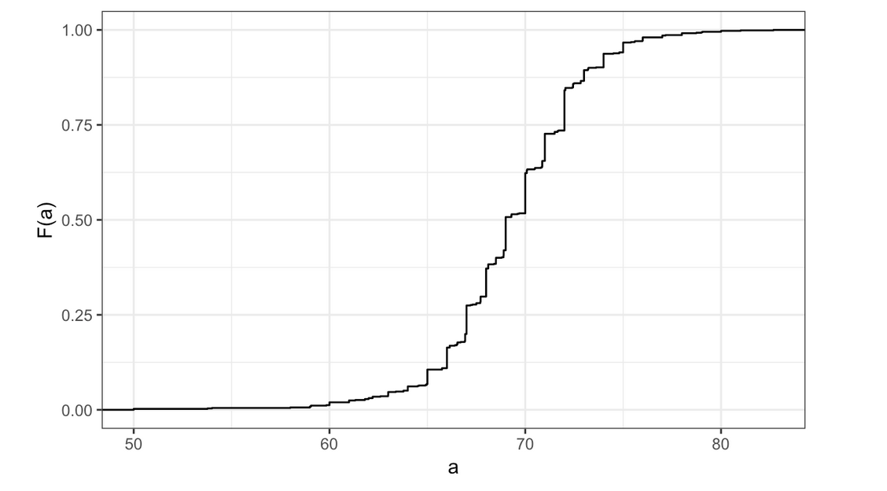
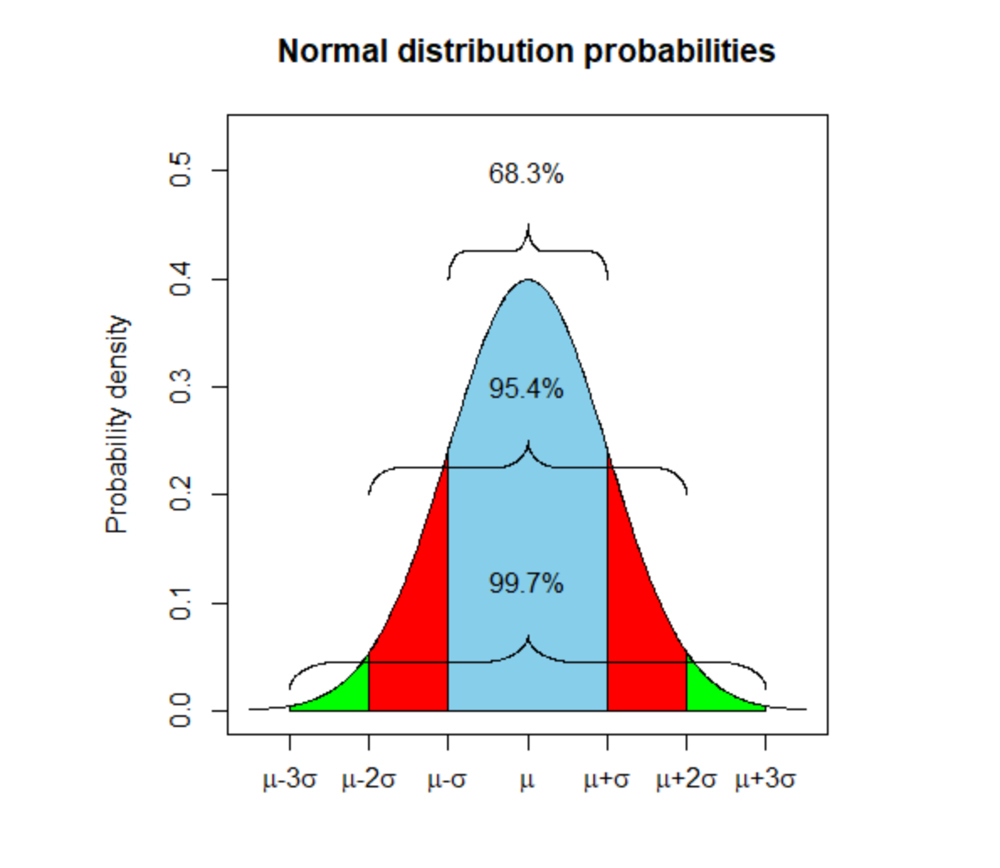
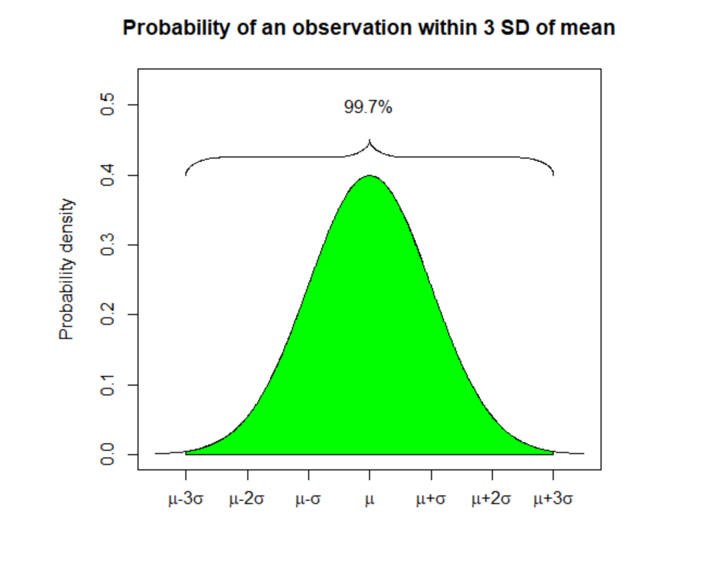

<html lang="en">

```{r setup, include=FALSE}
knitr::opts_chunk$set(
	echo = TRUE,
	message = FALSE,
	warning = FALSE
)

library(learnr) #necessary to render tutorial correctly

library(forcats)
library(ggplot2)
library(htmltools)
library(kableExtra)
library(lubridate)
library(magrittr)
library(tibble)


source("./www/discovr_helpers.R")
```

# datsci_02: Data Visualization

## Introduction and Welcome!

<div class="infobox">
  
  **Usage:** This tutorial accompanies [Introduction to Data Science](https://rafalab.github.io/dsbook/) by [Prof Rafael Irizarry](http://rafalab.github.io/pages/about.html). It contains material from the textbook which is offered under a [CC BY-NC-SA 4.0](https://creativecommons.org/licenses/by-nc-sa/4.0/). 
  
</div>

### Welcome to the Data Science: Visualization Course!

We're excited to have you join us in this course, which is designed to teach you data visualization techniques to communicate data-driven findings.

This is the second in a series of courses in the Introduction to Data Science program. The courses in the program are designed to prepare you to do data analysis in `r rproj()`, from simple computations to machine learning. If you need a refresher of some basic `r rproj()`, check out *Data Science: R Basics*, the first course in this series.

This course assumes you are comfortable with basic math, algebra, and logical operations. We have partnered with DataCamp for some assignments in `r rproj()` that allow you to program directly in a browser-based interface. You will further have access to additional exercises to be completed on your local installation of `r rproj()`.

Using a combination of a guided introduction through short video lectures and more independent in-depth exploration, you will get to practice your new `r rproj()` skills on real-life applications.

The growing availability of informative datasets and software tools has led to increased reliance on data visualizations across many industries, academia, and government. Data visualization provides a powerful way to communicate data-driven findings, motivate analyses, or detect flaws. In this course, you will learn the basics of data visualization and exploratory data analysis. We will use three motivating examples and ggplot2, a data visualization package for the statistical programming language `r rproj()`, to code. To learn the very basics, we will start with a somewhat artificial example: heights reported by students. Then we will explore two case studies related to world health and economics and another in infectious disease trends in the United States. It is also important to note that mistakes, biases, systematic errors, and other unexpected problems often lead to data that should be handled with care. The fact that it can be difficult or impossible to notice an error just from the reported results makes data visualization particularly important. This course will explore how failure to discover these problems often leads to flawed analyses and false discoveries.

### In this course, you will learn:

- Data visualization principles to better communicate data-driven findings
- How to use **ggplot2** to create custom plots
- The weaknesses of several widely used plots and why you should avoid them

### Course overview

Section 1: Introduction to Data Visualization and Distributions

- You will get started with data visualization and distributions in `r rproj()`.

Section 2: Introduction to ggplot2

- You will learn how to use the **ggplot2** package to create plots. 

Section 3: Summarizing with dplyr

- You will learn how to summarize data using the **dplyr** package.

Section 4: Gapminder

- You will see examples of **ggplot2** and **dplyr** in action with the Gapminder dataset.

Section 5: Data Visualization Principles

- You will learn general principles to guide you in developing effective data visualizations.

## Meet the Course Instructor

<div class="infobox">
  
  
**Rafael Irizarry** is a Professor of Biostatistics and Computational Biology at the Dana-Farber Cancer Institute and a Professor of Biostatistics at Harvard Chan School of Public Health. He has been analyzing data, from sound signals to genomic measurements, for over 20 years.

Professor Irizarry teaches a popular Data Science course at Harvard and has developed several online courses on data analysis that are offered by HarvardX. These online courses, divided into the Data Analysis for the Life Sciences series and Genomics Data Analysis series, have been completed by thousands of students and much of the material is included in a book with a freely available online version.

Webpage: http://rafalab.github.io 

</div>


## Essential Course Information

### Course Syllabus

The course syllabus contains a more comprehensive version of the information below - but if you don't read the syllabus, please read this!

### Course Structure

This is a self-paced course. You can work on it with your own timeline in mind. However, we suggest that you work on a section per week, and it will take you 2 - 4 hours per week. 

Check the course home page for important dates. If you are interested in pursuing a Verified Certificate, you will need to upgrade before the date listed on the home page and finish all assignments before course close.

### Grading

Assignments in the course allow you to practice your coding skills using the DataCamp platform. R is a flexible programming language designed partly for readability and ease of programming.

HarvardX has partnered with a platform called DataCamp to create programming assignments that you can do online. There is no need to install anything on your computer. You will be given a set of code to modify and run in your browser. You can take as many attempts as you need. When your code works correctly, you will be awarded points. You can also request hints, which will help you out, but hints decrease your point total. Remember that you can always go to the Discussion Board for help that doesn't cost points.

### Passing Rate

The passing rate is 70%. You must sign up for a Verified Certificate and earn a grade of 70% of higher in order to obtain a certificate for this course.

## Pre-Course Survey

Insert Survey Link here

*If you cannot see the survey above, click this link to access it in a new window.*

## Section 1 Overview

Section 1 introduces you to Data Visualization and Distributions.

In Section 1, you will learn to:

- understand the importance of data visualization for communicating data-driven findings.
- be able to use distributions to summarize data.
- be able to use the average and the standard deviation to understand the normal distribution.
- be able to assess how well a normal distribution fits the data using a quantile-quantile plot.
- be able to interpret data from a boxplot.

There are 5 assignments that use the DataCamp platform for you to practice your coding skills.

We encourage you to use `r rproj()` to interactively test out your answers and further your learning.

## 1.1 Introduction to Data Visualization


### Textbook link

The content is discussed within the [textbook section - 6. Introduction to data visualization](https://rafalab.github.io/dsbook/introduction-to-data-visualization.html).

### Key Points

- Plots of data easily communicate information that is difficult to extract from tables of raw values.
- Data visualization is a key component of exploratory data analysis (EDA), in which the properties of data are explored through visualization and summarization techniques.
- Data visualization can help discover biases, systematic errors, mistakes and other unexpected problems in data before those data are incorporated into potentially flawed analysis.
- This course covers the basics of data visualization and EDA in R using the ggplot2 package and motivating examples from world health, economics and infectious disease.

### Code

```{r, eval = FALSE}
library(dslabs)
data(murders)
head(murders)
```

## Introduction to Distributions


### Textbook link

The content is discussed within the [textbook section - 8. Visualizing data distributions](https://rafalab.github.io/dsbook/distributions.html).

### Key Points

- The most basic statistical summary of a list of objects is its distribution.
- We will learn ways to visualize and analyze distributions in the upcoming videos.
- In some cases, data can be summarized by a two-number summary: the average and standard deviation. We will learn to use data visualization to determine when that is appropriate.

## Data Types


### Textbook link

The content is discussed within the [textbook section - 8.1 Variable types](https://rafalab.github.io/dsbook/distributions.html#variable-types).

### Key Points

- Categorical data are variables that are defined by a small number of groups.
    - Ordinal categorical data have an inherent order to the categories (mild/medium/hot, for example).
    - Non-ordinal categorical data have no order to the categories.
- Numerical data take a variety of numeric values.
    - Continuous variables can take any value.
    - Discrete variables are limited to sets of specific values.

## 1.1 Assessment: Data Types

Insert assessment here

## 1.2 Describe Heights to ET


### Textbook link

The content is discussed within the 
- [textbook case study of describing student heights](https://rafalab.github.io/dsbook/distributions.html#case-study-describing-student-heights)

- [textbook section on the distribution function](https://rafalab.github.io/dsbook/distributions.html#distribution-function)

- [textbook section on the cumulative distribution function](https://rafalab.github.io/dsbook/distributions.html#cdf-intro)

- [textbook section on histograms](https://rafalab.github.io/dsbook/distributions.html#histograms)

### Key points

- A distribution is a function or description that shows the possible values of a variable and how often those values occur.
- For categorical variables, the distribution describes the proportions of each category.
- A *frequency table* is the simplest way to show a categorical distribution. Use `prop.table()` to convert a table of counts to a frequency table. Barplots display the distribution of categorical variables and are a way to visualize the information in frequency tables.
- For continuous numerical data, reporting the frequency of each unique entry is not an effective summary as many or most values are unique. Instead, a distribution function is required.
- The *cumulative distribution function (CDF)* is a function that reports the proportion of data below a value 𝑎 for all values of 𝑎: 𝐹(𝑎)=Pr(𝑥≤𝑎).
- The proportion of observations between any two values 𝑎 and 𝑏 can be computed from the CDF as 𝐹(𝑏)−𝐹(𝑎).
- A *histogram* divides data into non-overlapping bins of the same size and plots the counts of number of values that fall in that interval.

### Code

```{r, eval = FALSE}
# load the dataset
library(dslabs)
data(heights)

# make a table of category proportions
prop.table(table(heights$sex))
```

## Cumulative Distribution Function

Every continuous distribution has a cumulative distribution function (CDF). The CDF defines the proportion of the data below a given value 𝑎 for all values of 𝑎:
    
<center>
     
𝐹(𝑎)=Pr(𝑥≤𝑎)
    
</center>
      
Any continuous dataset has a CDF, not only normal distributions. For example, the male heights data we used in the previous section has this CDF:
  
<center>
  
<figure>

</figure> 

</center>
  
This plot of the CDF for male heights has height values "a" on the x-axis and the proportion of students with heights of that value or lower on the y-axis.

As defined above, this plot of the CDF for male heights has height values 𝑎 on the x-axis and the proportion of students with heights of that value or lower (𝐹(𝑎)) on the y-axis.

The CDF is essential for calculating probabilities related to continuous data. In a continuous dataset, the probability of a specific exact value is not informative because most entries are unique. For example, in the student heights data, only one individual reported a height of 68.8976377952726 inches, but many students rounded similar heights to 69 inches. If we computed exact value probabilities, we would find that being exactly 69 inches is much more likely than being a non-integer exact height, which does not match our understanding that height is continuous. We can instead use the CDF to obtain a useful summary, such as the probability that a student is between 68.5 and 69.5 inches. 

For datasets that are not normal, the CDF can be calculated manually by defining a function to compute the probability above. This function can then be applied to a range of values across the range of the dataset to calculate a CDF. Given a dataset my_data, the CDF can be calculated and plotted like this:


```{r, eval = FALSE}
a <- seq(min(my_data), max(my_data), length = 100)    # define range of values spanning the dataset
cdf_function <- function(x) {    # computes prob. for a single value
    mean(my_data <= x)
}
cdf_values <- sapply(a, cdf_function)
plot(a, cdf_values)
```

The CDF defines that proportion of data below a cutoff 𝑎. To define the proportion of values above 𝑎, we compute:
   
<center>
    
1−𝐹(𝑎)

</center>
    
To define the proportion of values between 𝑎 and 𝑏, we compute:

<center>
      
𝐹(𝑏)−𝐹(𝑎)

</center>
    
Note that the CDF can help compute probabilities. The probability of observing a randomly chosen value between 𝑎 and 𝑏 is equal to the proportion of values between 𝑎 and 𝑏, which we compute with the CDF.

## 1.2 Smooth Density Plots


### Textbook link

The content is discussed within the [textbook section - 8.6 Smoothed density](https://rafalab.github.io/dsbook/distributions.html#smoothed-density).

### Key points

- *Smooth density plots* can be thought of as histograms where the bin width is extremely or infinitely small. The smoothing function makes estimates of the true continuous trend of the data given the available sample of data points.
- The degree of smoothness can be controlled by an argument in the plotting function. (We will learn functions for plotting later.)
- While the histogram is an assumption-free summary, the smooth density plot is shaped by assumptions and choices you make as a data analyst.
- The y-axis is scaled so that the area under the density curve sums to 1. This means that interpreting values on the y-axis is not straightforward. To determine the proportion of data in between two values, compute the area under the smooth density curve in the region between those values.
- An advantage of smooth densities over histograms is that densities are easier to compare visually.

### A further note on histograms

Note that the choice of binwidth has a determinative effect on shape. There is no "correct" choice for binwidth, and you can sometimes gain insights into the data by experimenting with binwidths.

## 1.2 Assessment: Distributions

Insert assessment here

## 1.2 Normal Distribution


### Textbook link

The content is discussed within the [textbook section - 8.8 The normal distribution](https://rafalab.github.io/dsbook/distributions.html#normal-distribution).

### Correction Video

At 3:27 and 3:50, the audio gives incorrect values for the average and standard deviation. The code on screen and the transcript are correct.

### Key points

- The normal distribution:
    - Is centered around one value, the *mean*
    - Is symmetric around the mean
    - Is defined completely by its mean (𝜇) and standard deviation ( 𝜎 )
    - Always has the same proportion of observations within a given distance of the mean (for example, 95% within 2 𝜎)
- The standard deviation is the average distance between a value and the mean value.
- Calculate the mean using the `mean()` function.
- Calculate the standard deviation using the `sd()` function or manually. 
- Standard units describe how many standard deviations a value is away from the mean. The z-score, or number of standard deviations an observation 𝑥 is away from the mean 𝜇:

<center>
  
<figure>

</figure> 

</center>

- Compute standard units with the `scale()` function.
- **Important**: to calculate the proportion of values that meet a certain condition, use the `mean()` function on a logical vector. Because `TRUE` is converted to 1 and `FALSE` is converted to 0, taking the mean of this vector yields the proportion of `TRUE`.


### Equation for the normal distribution

The normal distribution is mathematically defined by the following formula for any mean 𝜇 and standard deviation 𝜎:
   
<center>
   
<figure>

</figure> 
  
</center>
  
### Code

```{r, eval = FALSE}
# define x as vector of male heights
library(tidyverse)
library(dslabs)
data(heights)
index <- heights$sex=="Male"
x <- heights$height[index]

# calculate the mean and standard deviation manually
average <- sum(x)/length(x)
SD <- sqrt(sum((x - average)^2)/length(x))

# built-in mean and sd functions - note that the audio and printed values disagree
average <- mean(x)
SD <- sd(x)
c(average = average, SD = SD)

# calculate standard units
z <- scale(x)

# calculate proportion of values within 2 SD of mean
mean(abs(z) < 2)
```

### Note about the **sd** function

The built-in R function `sd()` calculates the standard deviation, but it divides by `length(x)-1` instead of `length(x)`. When the length of the list is large, this difference is negligible and you can use the built-in `sd()` function. Otherwise, you should compute 𝜎 by hand. For this course series, assume that you should use the `sd()` function unless you are told not to do so.

## 1.2 Normal Distribution: Standard Units and Z-scores

### Standard units

For data that are approximately normal, *standard units* describe the number of standard deviations an observation is from the mean. Standard units are denoted by the variable 𝑧 and are also known as *z-scores*.

For any value 𝑥 from a normal distribution with mean 𝜇 and standard deviation 𝜎, the value in standard units is:

<center>
  
<figure>

</figure> 

</center>

Standard units are useful for many reasons. Note that the formula for the normal distribution is simplified by substituting 𝑧 in the exponent:

<center>
   
<figure>

</figure> 
  
</center>

When 𝑧=0, the normal distribution is at a maximum, the mean 𝜇. The function is defined to be symmetric around 𝑧=0.

The normal distribution of z-scores is called the *standard normal distribution* and is defined by 𝜇=0 and 𝜎=1.

Z-scores are useful to quickly evaluate whether an observation is average or extreme. Z-scores near 0 are average. Z-scores above 2 or below -2 are significantly above or below the mean, and z-scores above 3 or below -3 are extremely rare. 

We will learn more about benchmark z-score values and their corresponding probabilities below.

### Code: Converting to standard units

The `scale` function converts a vector of approximately normally distributed values into z-scores.

```{r, eval = FALSE}
z <- scale(x)
```

You can compute the proportion of observations that are within 2 standard deviations of the mean like this:

```{r, eval = FALSE}
mean(abs(z) < 2)
```

### The 68-95-99.7 Rule

The normal distribution is associated with the 68-95-99.7 rule. This rule describes the probability of observing events within a certain number of standard deviations of the mean. 

<center>
   
<figure>

</figure> 
  
</center>

The probability distribution function for the normal distribution is defined such that:

- About 68% of observations will be within one standard deviation of the mean (𝜇±𝜎). In standard units, this is equivalent to a z-score of ∣𝑧∣≤1.

<center>
   
<figure>

</figure> 
  
</center>

- About 95% of observations will be within two standard deviations of the mean (𝜇±2𝜎). In standard units, this is equivalent to a z-score of ∣𝑧∣≤2.

<center>
   
<figure>

</figure> 
  
</center>

- About 99.7% of observations will be within three standard deviations of the mean (𝜇±3𝜎). In standard units, this is equivalent to a z-score of ∣𝑧∣≤3.

<center>
   
<figure>

</figure> 
  
</center>

- We will learn how to compute these exact probabilities in a later section, as well as probabilities for other intervals.

## 1.2 The Normal CDF and pnorm


### Textbook link

The content is discussed within the [textbook section - 13 Probability](https://rafalab.github.io/dsbook/probability.html#theoretical-distribution).

### Key points

- The normal distribution has a mathematically defined CDF which can be computed in R with the function `pnorm()`.
- `pnorm(a, avg, s)` gives the value of the cumulative distribution function 𝐹(𝑎) for the normal distribution defined by average `avg` and standard deviation `s`.
- We say that a random quantity is normally distributed with average avg and standard deviation s if the approximation `pnorm(a, avg, s)` holds for all values of a.
- If we are willing to use the normal approximation for height, we can estimate the distribution simply from the mean and standard deviation of our values.
- If we treat the height data as discrete rather than categorical, we see that the data are not very useful because integer values are more common than expected due to rounding. This is called *discretization*.
- With rounded data, the normal approximation is particularly useful when computing probabilities of intervals of length 1 that include exactly one integer.

### Code: Using **pnorm** to calculate probabilities

Given male heights x:

```{r, eval = FALSE}
library(tidyverse)
library(dslabs)
data(heights)
x <- heights %>% filter(sex=="Male") %>% pull(height)
```

We can estimate the probability that a male is taller than 70.5 inches with:

```{r, eval = FALSE}
1 - pnorm(70.5, mean(x), sd(x))
```

### Code: Discretization and the normal approximation

```{r, eval = FALSE}
# plot distribution of exact heights in data
plot(prop.table(table(x)), xlab = "a = Height in inches", ylab = "Pr(x = a)")

# probabilities in actual data over length 1 ranges containing an integer
mean(x <= 68.5) - mean(x <= 67.5)
mean(x <= 69.5) - mean(x <= 68.5)
mean(x <= 70.5) - mean(x <= 69.5)

# probabilities in normal approximation match well
pnorm(68.5, mean(x), sd(x)) - pnorm(67.5, mean(x), sd(x))
pnorm(69.5, mean(x), sd(x)) - pnorm(68.5, mean(x), sd(x))
pnorm(70.5, mean(x), sd(x)) - pnorm(69.5, mean(x), sd(x))

# probabilities in actual data over other ranges don't match normal approx as well
mean(x <= 70.9) - mean(x <= 70.1)
pnorm(70.9, mean(x), sd(x)) - pnorm(70.1, mean(x), sd(x))
```

## 1.2 Assessment: Normal distribution

Insert assessment here

## 1.3 Definition of quantiles

### Definition of quantiles

*Quantiles* are cutoff points that divide a dataset into intervals with set probabilities. The 𝑞th quantile is the value at which 𝑞% of the observations are equal to or less than that value.

### Using the **quantile** function

Given a dataset data and desired quantile `q`, you can find the `q`th quantile of `data` with:

```{r, eval = FALSE}
quantile(data,q)
```

### Percentiles

*Percentiles* are the quantiles that divide a dataset into 100 intervals each with 1% probability. You can determine all percentiles of a dataset `data` like this:

```{r, eval = FALSE}
p <- seq(0.01, 0.99, 0.01)
quantile(data, p)
```

### Quartiles

*Quartiles* divide a dataset into 4 parts each with 25% probability. They are equal to the 25th, 50th and 75th percentiles. The 25th percentile is also known as the *1st quartile*, the 50th percentile is also known as the *median*, and the 75th percentile is also known as the *3rd quartile*.

The `summary()` function returns the minimum, quartiles and maximum of a vector.

### Examples

Load the heights dataset from the **dslabs** package:

```{r, eval = FALSE}
library(dslabs)
data(heights)
```

Use `summary()` on the heights$height variable to find the quartiles:

```{r, eval = FALSE}
summary(heights$height)
```

Find the percentiles of heights$height:

```{r, eval = FALSE}
p <- seq(0.01, 0.99, 0.01)
percentiles <- quantile(heights$height, p)
```

Confirm that the 25th and 75th percentiles match the 1st and 3rd quartiles. Note that `quantile()` returns a named vector. You can access the 25th and 75th percentiles like this (adapt the code for other percentile values):

```{r, eval = FALSE}
percentiles[names(percentiles) == "25%"]
percentiles[names(percentiles) == "75%"]
```

## 1.3 Finding quantiles with qnorm

### Definition of qnorm

The `qnorm()` function gives the theoretical value of a quantile with probability `p` of observing a value equal to or less than that quantile value given a normal distribution with mean `mu` and standard deviation `sigma`:

```{r, eval = FALSE}
qnorm(p, mu, sigma)
```

By default, `mu=0` and `sigma=1`. Therefore, calling `qnorm()` with no arguments gives quantiles for the standard normal distribution.

```{r, eval = FALSE}
qnorm(p)
```

Recall that quantiles are defined such that `p` is the probability of a random observation less than or equal to the quantile.

### Relation to pnorm

The `pnorm()` function gives the probability that a value from a standard normal distribution will be less than or equal to a z-score value z. Consider:

`pnorm(-1.96)` ≈ 0.025

The result of `pnorm()` is the quantile. Note that:

`qnorm(0.025)` ≈ −1.96

`qnorm()` and `pnorm()` are inverse functions:

`pnorm(qnorm(0.025))` = 0.025

### Theoretical quantiles

You can use `qnorm()` to determine the *theoretical quantiles* of a dataset: that is, the theoretical value of quantiles assuming that a dataset follows a normal distribution. Run the `qnorm()` function with the desired probabilities p, mean mu and standard deviation sigma. 

Suppose male heights follow a normal distribution with a mean of 69 inches and standard deviation of 3 inches. The theoretical quantiles are:

```{r, eval = FALSE}
p <- seq(0.01, 0.99, 0.01)
theoretical_quantiles <- qnorm(p, 69, 3)
```

Theoretical quantiles can be compared to sample quantiles determined with the quantile function in order to evaluate whether the sample follows a normal distribution.

## 1.3 Quantile-Quantile Plots


### Textbook link

The content is discussed within the [textbook section - 8.10 Quantile-quantile plots](https://rafalab.github.io/dsbook/distributions.html#quantile-quantile-plots).

### Key points

- Quantile-quantile plots, or QQ-plots, are used to check whether distributions are well-approximated by a normal distribution.
- Given a proportion *p*, the quantile *q* is the value such that the proportion of values in the data below *q* is *p*.
- In a QQ-plot, the sample quantiles in the observed data are compared to the theoretical quantiles expected from the normal distribution. If the data are well-approximated by the normal distribution, then the points on the QQ-plot will fall near the identity line (sample = theoretical).
- Calculate sample quantiles (observed quantiles) using the `quantile()` function.
- Calculate theoretical quantiles with the `qnorm()` function. `qnorm()` will calculate quantiles for the standard normal distribution (μ = 0,σ = 1) by default, but it can calculate quantiles for any normal distribution given `mean()` and `sd()` arguments. We will learn more about `qnorm()` in the probability course.
- Note that we will learn alternate ways to make QQ-plots with less code later in the series.

### Code

```{r, eval = FALSE}
# define x and z
library(tidyverse)
library(dslabs)
data(heights)
index <- heights$sex=="Male"
x <- heights$height[index]
z <- scale(x)

# proportion of data below 69.5
mean(x <= 69.5)

# calculate observed and theoretical quantiles
p <- seq(0.05, 0.95, 0.05)
observed_quantiles <- quantile(x, p)
theoretical_quantiles <- qnorm(p, mean = mean(x), sd = sd(x))

# make QQ-plot
plot(theoretical_quantiles, observed_quantiles)
abline(0,1)

# make QQ-plot with scaled values
observed_quantiles <- quantile(z, p)
theoretical_quantiles <- qnorm(p)
plot(theoretical_quantiles, observed_quantiles)
abline(0,1)
```

## 1.3 Percentiles


### Textbook link

The content is discussed within the [textbook section - 8.11 Percentiles](https://rafalab.github.io/dsbook/distributions.html#percentiles).

### Key points

- *Percentiles* are the quantiles obtained when defining 𝑝 as 0.01,0.02,...,0.99. They summarize the values at which a certain percent of the observations are equal to or less than that value.
- The 50th percentile is also known as the *median*.
- The *quartiles* are the 25th, 50th and 75th percentiles.

## 1.3 Boxplots


### Textbook link

The content is discussed within the [textbook section - 8.12 Boxplots](https://rafalab.github.io/dsbook/distributions.html#boxplots).

### Key points

- When data do not follow a normal distribution and cannot be succinctly summarized by only the mean and standard deviation, an alternative is to report a five-number summary: range (ignoring outliers) and the quartiles (25th, 50th, 75th percentile).
- In a *boxplot*, the box is defined by the 25th and 75th percentiles and the median is a horizontal line through the box. The whiskers show the range excluding outliers, and outliers are plotted separately as individual points.
- The *interquartile* range is the distance between the 25th and 75th percentiles.
- Boxplots are particularly useful when comparing multiple distributions.
- We discuss outliers in a later video.

## 1.3 Assessment: Quantiles, percentiles, and boxplots

Insert assessment here

## 1.4 Distribution of Female Heights


### Textbook link

The content is discussed within the [textbook section - 8.14 Case study: describing student heights (continued)](https://rafalab.github.io/dsbook/distributions.html#student-height-cont).

### Key points

- If a distribution is not normal, it cannot be summarized with only the mean and standard deviation. Provide a histogram, smooth density or boxplot instead.
- A plot can force us to see unexpected results that make us question the quality or implications of our data.

## 1.4 Assessment: Robust Summaries with Outliers

Insert assessment here

## Section 2 Overview

In Section 2, you will learn how to create data visualizations in `r rproj()` using the **ggplot2** package.

After completing Section 2, you will:

- be able to use ggplot2 to create data visualizations in `r rproj()`.
- be able to explain what the data component of a graph is.
- be able to identify the geometry component of a graph and know when to use which type of geometry.
- be able to explain what the aesthetic mapping component of a graph is.
- be able to understand the scale component of a graph and select an appropriate scale component to use.

There is 1 assignment that uses the DataCamp platform for you to practice your coding skills.

Note that it can be hard to memorize all of the functions and arguments used by **ggplot2**, so we recommend that you have a [cheat sheet](https://rstudio.com/wp-content/uploads/2015/03/ggplot2-cheatsheet.pdf) handy to help you remember the necessary commands.

We encourage you to use `r rproj()` to interactively test out your answers and further your learning.

## 2. ggplot2


### Textbook link and ggplot2 cheatsheet

The content is discussed within the [textbook section - Chapter 7 ggplot2](https://rafalab.github.io/dsbook/ggplot2.html).

We recommend you keep a copy of the [ggplot2 cheat sheet](https://rstudio.com/wp-content/uploads/2015/03/ggplot2-cheatsheet.pdf) handy.

### Key points and notes

- Throughout the series, we will create plots with the **ggplot2** package. **ggplot2** is part of the **tidyverse** suite of packages, which you can load with `library(tidyverse)`.
- Note that you can also load **ggplot2** alone using the command `library(ggplot2)`, instead of loading the entire **tidyverse**.
- **ggplot2** uses a *grammar of graphics* to break plots into building blocks that have intuitive syntax, making it easy to create relatively complex and aesthetically pleasing plots with relatively simple and readable code.
- **ggplot2** is designed to work exclusively with tidy data (rows are observations and columns are variables).

## 2.1 Graph Components


### Textbook link 

The content is discussed within the [textbook section - 7.1 The components of a graph](https://rafalab.github.io/dsbook/ggplot2.html#the-components-of-a-graph).


### Key points 

- Plots in **ggplot2** consist of 3 main components:
    - Data: The dataset being summarized
    - Geometry: The type of plot (scatterplot, boxplot, barplot, histogram, qqplot, smooth density, etc.)
    - Aesthetic mapping: Variables mapped to visual cues, such as x-axis and y-axis values and color
- There are additional components:
    - Scale
    - Labels, Title, Legend
    - Theme/Style

### Code

```{r, eval = FALSE}
library(dslabs)
data(murders)
```

## 2.1 Creating a New Plot


### Textbook link 

The content is discussed within the [textbook section - 7.2 **ggplot** objects](https://rafalab.github.io/dsbook/ggplot2.html#ggplot-objects).


### Key points 

- You can associate a dataset x with a ggplot object with any of the 3 commands:
    - `ggplot(data = x)`
    - `ggplot(x)`
    - `%>% ggplot()`
- You can assign a ggplot object to a variable. If the object is not assigned to a variable, it will automatically be displayed.
- You can display a ggplot object assigned to a variable by printing that variable.

### Code

```{r, eval = FALSE}
library(tidyverse)
library(dslabs)
data(murders)

ggplot(data = murders)

murders %>% ggplot()

p <- ggplot(data = murders)
class(p)
print(p)    # this is equivalent to simply typing p
p
```

## 2.2 Layers


### Textbook link 

This video corresponds to the following: 

- [textbook section - 7.3 Geometries](https://rafalab.github.io/dsbook/ggplot2.html#geometries).
- [textbook section - 7.4 Aesthetic mappings](https://rafalab.github.io/dsbook/ggplot2.html#aesthetic-mappings)
- [textbook section - 7.5 Layers](https://rafalab.github.io/dsbook/ggplot2.html#layers)

### Key points 

- In **ggplot2**, graphs are created by adding *layers* to the ggplot object:
  DATA %>% ggplot() + LAYER_1 + LAYER_2 + ... + LAYER_N
- The *geometry layer* defines the plot type and takes the format geom_X where X is the plot type.
- *Aesthetic mappings* describe how properties of the data connect with features of the graph (axis position, color, size, etc.) Define aesthetic mappings with the aes() function.
- `aes()` uses variable names from the object component (for example, total rather than ``murders$total``).
- `geom_point()` creates a scatterplot and requires x and y aesthetic mappings. 
- `geom_text()` and `geom_label()` add text to a scatterplot and require x, y, and label aesthetic mappings.
- To determine which aesthetic mappings are required for a geometry, read the help file for that geometry.
- You can add layers with different aesthetic mappings to the same graph.

### Code: Adding layers to a plot

```{r, eval = FALSE}
library(tidyverse)
library(dslabs)
data(murders)

murders %>% ggplot() +
    geom_point(aes(x = population/10^6, y = total))
    
# add points layer to predefined ggplot object
p <- ggplot(data = murders)
p + geom_point(aes(population/10^6, total))

# add text layer to scatterplot
p + geom_point(aes(population/10^6, total)) +
    geom_text(aes(population/10^6, total, label = abb))
```

### Code: Example of `aes` behavior

```{r, eval = FALSE}
# no error from this call
p_test <- p + geom_text(aes(population/10^6, total, label = abb))

# error - "abb" is not a globally defined variable and cannot be found outside of aes
p_test <- p + geom_text(aes(population/10^6, total), label = abb)
```

## 2.2 Tinkering


### Textbook link 

This video corresponds to the following: 

- [textbook section - 7.5.1 Tinkering with arguments](https://rafalab.github.io/dsbook/ggplot2.html#tinkering-with-arguments).
- [textbook section - 7.6 Global versus local aesthetic mappings](https://rafalab.github.io/dsbook/ggplot2.html#global-versus-local-aesthetic-mappings)


### Key points 

- You can modify arguments to geometry functions other than `aes()` and the data. Additional arguments can be found in the documentation for each geometry.
- These arguments are not aesthetic mappings: they affect all data points the same way.
- Global *aesthetic mappings* apply to all geometries and can be defined when you initially call `ggplot()`. All the geometries added as layers will default to this mapping. Local aesthetic mappings add additional information or override the default mappings.


### Code

```{r, eval = FALSE}
# change the size of the points
p + geom_point(aes(population/10^6, total), size = 3) +
    geom_text(aes(population/10^6, total, label = abb))
    
# move text labels slightly to the right
p + geom_point(aes(population/10^6, total), size = 3) +
    geom_text(aes(population/10^6, total, label = abb), nudge_x = 1)
    
# simplify code by adding global aesthetic
p <- murders %>% ggplot(aes(population/10^6, total, label = abb))
p + geom_point(size = 3) +
    geom_text(nudge_x = 1.5)
    
# local aesthetics override global aesthetics
p + geom_point(size = 3) +
    geom_text(aes(x = 10, y = 800, label = "Hello there!"))
```

## 2.2 Scales, Labels, and Colors


### Textbook link 

This video corresponds to the following: 

- [textbook section - 7.7 Scales](https://rafalab.github.io/dsbook/ggplot2.html#scales).
- [textbook section - 7.8 Labels and titles](https://rafalab.github.io/dsbook/ggplot2.html#labels-and-titles)
- [textbook section - 7.9 Categories as colors](https://rafalab.github.io/dsbook/ggplot2.html#categories-as-colors)
- [textbook section - 7.10 Annotation, shapes, and adjustments](https://rafalab.github.io/dsbook/ggplot2.html#annotation-shapes-and-adjustments)

### Key points 

- Convert the x-axis to log scale with `scale_x_continuous(trans = "log10")` or `scale_x_log10()`. Similar functions exist for the y-axis.
- Add axis titles with `xlab()` and `ylab()` functions. Add a plot title with the `ggtitle()` function.
- Add a color mapping that colors points by a variable by defining the `col` argument within `aes()`. To color all points the same way, define `col` outside of `aes()`.
- Add a line with the `geom_abline()` geometry. `geom_abline()` takes arguments "slope" (default = 1) and intercept (default = 0). Change the color with `col` or `color` and line type with `lty`.
- Placing the line layer after the point layer will overlay the line on top of the points. To overlay points on the line, place the line layer before the point layer.
- There are many additional ways to tweak your graph that can be found in the **ggplot2** documentation, cheat sheet, or on the internet. For example, you can change the legend title with `scale_color_discrete()`.

### Code: Log-scale the x- and y-axis

```{r, eval = TRUE}
# define p
library(tidyverse)
library(dslabs)
data(murders)
p <- murders %>% ggplot(aes(population/10^6, total, label = abb))

# log base 10 scale the x-axis and y-axis
p + geom_point(size = 3) +
    geom_text(nudge_x = 0.05) +
    scale_x_continuous(trans = "log10") +
    scale_y_continuous(trans = "log10")
    
# efficient log scaling of the axes
p + geom_point(size = 3) +
    geom_text(nudge_x = 0.075) +
    scale_x_log10() +
    scale_y_log10()
```

### Code: Add labels and title

```{r, eval = TRUE}
p + geom_point(size = 3) +
    geom_text(nudge_x = 0.075) +
    scale_x_log10() +
    scale_y_log10() +
    xlab("Population in millions (log scale)") +
    ylab("Total number of murders (log scale)") +
    ggtitle("US Gun Murders in 2010")
```

### Code: Change color of the points

```{r, eval = TRUE}
# redefine p to be everything except the points layer
p <- murders %>%
    ggplot(aes(population/10^6, total, label = abb)) +
    geom_text(nudge_x = 0.075) +
    scale_x_log10() +
    scale_y_log10() +
    xlab("Population in millions (log scale)") +
    ylab("Total number of murders (log scale)") +
    ggtitle("US Gun Murders in 2010")
    
# make all points blue
p + geom_point(size = 3, color = "blue")

# color points by region
p + geom_point(aes(col = region), size = 3)
```

### Code: Add a line with average murder rate

```{r, eval = TRUE}
r <- murders %>%
    summarize(rate = sum(total) / sum(population) * 10^6) %>%
    pull(rate)
    
# basic line with average murder rate for the country
p + geom_point(aes(col = region), size = 3) +
    geom_abline(intercept = log10(r))    # slope is default of 1
    
# change line to dashed and dark grey, line under points
p + 
    geom_abline(intercept = log10(r), lty = 2, color = "darkgrey") +
    geom_point(aes(col = region), size = 3)
```

### Code: Change legend title

```{r, eval = TRUE}
p <- p + scale_color_discrete(name = "Region")    # capitalize legend title
```

## 2.2 Add-on Packages


### Textbook link 

This video corresponds to the following: 

- [textbook section - 7.11 Add-on packages](https://rafalab.github.io/dsbook/ggplot2.html#add-on-packages).
- [textbook section - 7.12 Putting it all together](https://rafalab.github.io/dsbook/ggplot2.html#putting-it-all-together)

### Key points 

- The style of a ggplot graph can be changed using the `theme()` function.
- The **ggthemes** package adds additional themes.
- The **ggrepel** package includes a geometry that repels text labels, ensuring they do not overlap with each other: `geom_text_repel()`.

### Code: Adding themes

```{r, eval = TRUE}
# define p
library(dslabs)
ds_theme_set()

# themes from ggthemes
library(ggthemes)
p + theme_economist()    # style of the Economist magazine
p + theme_fivethirtyeight()    # style of the FiveThirtyEight website
```

### Code: Putting it all together to assemble the plot

```{r, eval = TRUE}
# load libraries
library(tidyverse)
library(ggrepel)
library(ggthemes)
library(dslabs)
data(murders)

# define the intercept
r <- murders %>%
    summarize(rate = sum(total) / sum(population) * 10^6) %>%
    .$rate
    
# make the plot, combining all elements
murders %>%
    ggplot(aes(population/10^6, total, label = abb)) +
    geom_abline(intercept = log10(r), lty = 2, color = "darkgrey") +
    geom_point(aes(col = region), size = 3) +
    geom_text_repel() +
    scale_x_log10() +
    scale_y_log10() +
    xlab("Population in millions (log scale)") +
    ylab("Total number of murders (log scale)") +
    ggtitle("US Gun Murders in 2010") +
    scale_color_discrete(name = "Region") +
    theme_economist()
```

## 2.2 Other Examples


### Textbook link 

This video corresponds to the following: 

- [textbook section - 8.16.2 Histograms](https://rafalab.github.io/dsbook/distributions.html#histograms-1).
- [textbook section - 8.16.3 Density plots](https://rafalab.github.io/dsbook/distributions.html#density-plots)
- [textbook section - 8.16.5 QQ-plots](https://rafalab.github.io/dsbook/distributions.html#qq-plots)
- [textbook section - 7.14 Grids of plots](https://rafalab.github.io/dsbook/ggplot2.html#grids-of-plots)

### Key points 

- `geom_histogram()` creates a histogram. Use the binwidth argument to change the width of bins, the `fill` argument to change the bar fill color, and the `col` argument to change bar outline color.
- `geom_density()` creates smooth density plots. Change the fill color of the plot with the `fill` argument.
- `geom_qq()` creates a quantile-quantile plot. This geometry requires the sample argument. By default, the data are compared to a standard normal distribution with a mean of 0 and standard deviation of 1. This can be changed with the `dparams` argument, or the sample data can be scaled.
- Plots can be arranged adjacent to each other using the `grid.arrange()` function from the **gridExtra** package. First, create the plots and save them to objects (p1, p2, ...). Then pass the plot objects to `grid.arrange().`


### Code: Histograms in ggplot2

```{r, eval = FALSE}
# load heights data
library(tidyverse)
library(dslabs)
data(heights)

# define p
p <- heights %>%
    filter(sex == "Male") %>%
    ggplot(aes(x = height))
    
# basic histograms
p + geom_histogram()
p + geom_histogram(binwidth = 1)

# histogram with blue fill, black outline, labels and title
p + geom_histogram(binwidth = 1, fill = "blue", col = "black") +
    xlab("Male heights in inches") +
    ggtitle("Histogram")
```

### Code: Smooth density plots in ggplot2

```{r, eval = FALSE}
p + geom_density()
p + geom_density(fill = "blue")
```

### Code: Quantile-quantile plots in ggplot2

```{r, eval = FALSE}
# basic QQ-plot
p <- heights %>% filter(sex == "Male") %>%
    ggplot(aes(sample = height))
p + geom_qq()

# QQ-plot against a normal distribution with same mean/sd as data
params <- heights %>%
    filter(sex == "Male") %>%
    summarize(mean = mean(height), sd = sd(height))
    p + geom_qq(dparams = params) +
    geom_abline()
    
# QQ-plot of scaled data against the standard normal distribution
heights %>%
    ggplot(aes(sample = scale(height))) +
    geom_qq() +
    geom_abline()
```

### Code: Grids of plots with the gridExtra package

```{r, eval = FALSE}
# define plots p1, p2, p3
p <- heights %>% filter(sex == "Male") %>% ggplot(aes(x = height))
p1 <- p + geom_histogram(binwidth = 1, fill = "blue", col = "black")
p2 <- p + geom_histogram(binwidth = 2, fill = "blue", col = "black")
p3 <- p + geom_histogram(binwidth = 3, fill = "blue", col = "black")

# arrange plots next to each other in 1 row, 3 columns
library(gridExtra)
grid.arrange(p1, p2, p3, ncol = 3)
```

## 2.2 Assessment: Introduction to ggplot2

Insert assessment here

## Section 3 Overview

Section 3 introduces you to summarizing with **dplyr**.

After completing Section 3, you will:

- understand the importance of summarizing data in exploratory data analysis.
- be able to use the `summarize()` verb in **dplyr** to facilitate summarizing data.
- be able to use the `group_by()` verb in **dplyr** to facilitate summarizing data.
- be able to access values using the dot placeholder.
- be able to use `arrange()` to examine data after sorting.

There is 1 assignments that use the DataCamp platform for you to practice your coding skills.

We encourage you to use `r rproj()` to interactively test out your answers and further your learning.

## 3. dplyr


### Textbook link 

This video corresponds to the [textbook section - 4.7 Summarizing data](https://rafalab.github.io/dsbook/tidyverse.html#summarizing-data).

### Key points 

- `summarize()` from the **dplyr/tidyverse** package computes summary statistics from the data frame. It returns a data frame whose column names are defined within the function call.
- `summarize()` can compute any summary function that operates on vectors and returns a single value, but it cannot operate on functions that return multiple values.
- Like most **dplyr** functions, `summarize()` is aware of variable names within data frames and can use them directly.

### Code

```{r, eval = FALSE}
library(tidyverse)
library(dslabs)
data(heights)

# compute average and standard deviation for males
s <- heights %>%
    filter(sex == "Male") %>%
    summarize(average = mean(height), standard_deviation = sd(height))
    
# access average and standard deviation from summary table
s$average
s$standard_deviation

# compute median, min and max
heights %>%
    filter(sex == "Male") %>%
    summarize(median = median(height),
              minimum = min(height),
              maximum = max(height))
# alternative way to get min, median, max in base R
quantile(heights$height, c(0, 0.5, 1))

# generates an error: summarize can only take functions that return a single value
heights %>%
    filter(sex == "Male") %>%
    summarize(range = quantile(height, c(0, 0.5, 1)))
```

## 3.1 The Dot Placeholder


### Textbook link 

This video corresponds to the [textbook section - 4.11 The dot operator](https://rafalab.github.io/dsbook/tidyverse.html#the-dot-operator)

Note that a common replacement for the dot operator is the `pull` function. Here is the [textbook section on the pull function - 4.7.2 pull](https://rafalab.github.io/dsbook/tidyverse.html#pull)

### Key points 

- The dot operator allows you to access values stored in data that is being piped in using the `%>%` character. The dot is a placeholder for the data being passed in through the pipe.
- The dot operator allows dplyr functions to return single vectors or numbers instead of only data frames.
- `us_murder_rate %>%` `.$rate` is equivalent to `us_murder_rate$rate`.
- Note that an equivalent way to extract a single column using the pipe is `us_murder_rate %>% pull(rate)`. The `pull()` function will be used in later course material.

### Code

```{r, eval = FALSE}
library(tidyverse)
library(dslabs)
data(murders)

murders <- murders %>% mutate(murder_rate = total/population*100000)
summarize(murders, mean(murder_rate))

# calculate US murder rate, generating a data frame
us_murder_rate <- murders %>%
    summarize(rate = sum(total) / sum(population) * 100000)
    us_murder_rate

# extract the numeric US murder rate with the dot operator
us_murder_rate %>% .$rate

# calculate and extract the murder rate with one pipe
us_murder_rate <- murders %>%
    summarize(rate = sum(total) / sum(population) * 100000) %>%
    .$rate
```

## 3.1 Group By


### Textbook link 

This video corresponds to the [textbook section - 4.7.3 Group then summarize with group_by](https://rafalab.github.io/dsbook/tidyverse.html#group-by)

### Key points 

- The `group_by()` function from **dplyr** converts a data frame to a grouped data frame, creating groups using one or more variables.
- `summarize()` and some other **dplyr** functions will behave differently on grouped data frames.
- Using `summarize()` on a grouped data frame computes the summary statistics for each of the separate groups.


### Code

```{r, eval = FALSE}
# libraries and data
library(tidyverse)
library(dslabs)
data(heights)
data(murders)

# compute separate average and standard deviation for male/female heights
heights %>%
    group_by(sex) %>%
    summarize(average = mean(height), standard_deviation = sd(height))

# compute median murder rate in 4 regions of country
murders <- murders %>%
    mutate(murder_rate = total/population * 100000)
murders %>%
    group_by(region) %>%
    summarize(median_rate = median(murder_rate))
```

## 3.1 Sorting Data Tables


### Textbook link 

This video corresponds to the [textbook section - 4.8 Sorting data frames](https://rafalab.github.io/dsbook/tidyverse.html#sorting-data-frames)

### Key points 

- The `arrange()` function from **dplyr** sorts a data frame by a given column.
- By default, `arrange()` sorts in ascending order (lowest to highest). To instead sort in descending order, use the function `desc()` inside of `arrange()`.
- You can `arrange()` by multiple levels: within equivalent values of the first level, observations are sorted by the second level, and so on.
- The `top_n()` function shows the top results ranked by a given variable, but the results are not ordered. You can combine `top_n()` with `arrange()` to return the top results in order.

### Code

```{r, eval = FALSE}
# libraries and data
library(tidyverse)
library(dslabs)
data(murders)

# set up murders object
murders <- murders %>%
    mutate(murder_rate = total/population * 100000)
    
# arrange by population column, smallest to largest
murders %>% arrange(population) %>% head()

# arrange by murder rate, smallest to largest
murders %>% arrange(murder_rate) %>% head()

# arrange by murder rate in descending order
murders %>% arrange(desc(murder_rate)) %>% head()

# arrange by region alphabetically, then by murder rate within each region
murders %>% arrange(region, murder_rate) %>% head()

# show the top 10 states with highest murder rate, not ordered by rate
murders %>% top_n(10, murder_rate)

# show the top 10 states with highest murder rate, ordered by rate
murders %>% arrange(desc(murder_rate)) %>% top_n(10)
```

## 3.1 Assessment: Summarizing with dplyr

Insert assessment here

## Section 4 Overview

In Section 4, you will look at a case study involving data from the Gapminder Foundation about trends in world health and economics.

After completing Section 4, you will:

- understand how Hans Rosling and the [Gapminder Foundation](https://www.gapminder.org/) use effective data visualization to convey data-based trends.
- be able to apply the **ggplot2** techniques from the previous section to answer questions using data.
- understand how fixed scales across plots can ease comparisons.
- be able to modify graphs to improve data visualization.

There is 1 assignments that use the DataCamp platform for you to practice your coding skills.

We encourage you to use `r rproj()` to interactively test out your answers and further your learning.

## 4.1 Case Study: Trends in World Health and Economics


### Textbook link 

This video corresponds to the [textbook section - 9.1 Case study: new insights on poverty](https://rafalab.github.io/dsbook/gapminder.html#case-study-new-insights-on-poverty)

### More about Gapminder
The original Gapminder TED talks are available and we encourage you to watch them.

- [The Best Stats You've Ever Seen](https://www.ted.com/talks/hans_rosling_the_best_stats_you_ve_ever_seen?language=en)
- [New Insights on Poverty](https://www.ted.com/talks/hans_rosling_new_insights_on_poverty?language=en)

You can also find more information and raw data (in addition to what we analyze in class) at [https://www.gapminder.org/](https://www.gapminder.org/).

### Key points 

- Data visualization can be used to dispel common myths and educate the public and contradict sensationalist or outdated claims and stories.
- We will use real data to answer the following questions about world health and economics:
    - Is it still fair to consider the world as divided into the West and the developing world?
    - Has income inequality across countries worsened over the last 40 years?

## 4.1 Gapminder Dataset


### Textbook link 

This video corresponds to the [textbook section - 9.1 Case study: new insights on poverty](https://rafalab.github.io/dsbook/gapminder.html#case-study-new-insights-on-poverty)

### Key points 

- A selection of world health and economics statistics from the Gapminder project can be found in the **dslabs** package as `data(gapminder)`.
- Most people have misconceptions about world health and economics, which can be addressed by considering real data.

### Code

```{r, eval = FALSE}
# load and inspect gapminder data
library(dslabs)
data(gapminder)
head(gapminder)

# compare infant mortality in Sri Lanka and Turkey
gapminder %>%
    filter(year == 2015 & country %in% c("Sri Lanka", "Turkey")) %>%
    select(country, infant_mortality)
```

## 4.1 Life Expectancy and Fertility Rates


### Textbook link 

This video corresponds to the [textbook section - 9.2 Scatterplots](https://rafalab.github.io/dsbook/gapminder.html#scatterplots)

### Key points 

- A prevalent worldview is that the world is divided into two groups of countries:
    - Western world: high life expectancy, low fertility rate
    - Developing world: lower life expectancy, higher fertility rate
- Gapminder data can be used to evaluate the validity of this view.
- A scatterplot of life expectancy versus fertility rate in 1962 suggests that this viewpoint was grounded in reality 50 years ago. Is it still the case today?

### Code

```{r, eval = FALSE}
# basic scatterplot of life expectancy versus fertility
ds_theme_set()    # set plot theme
filter(gapminder, year == 1962) %>%
    ggplot(aes(fertility, life_expectancy)) +
    geom_point()
    
# add color as continent
filter(gapminder, year == 1962) %>%
    ggplot(aes(fertility, life_expectancy, color = continent)) +
    geom_point()
```

## 4.2 Faceting


### Textbook link 

This video corresponds to the [textbook section - 9.3 Faceting](https://rafalab.github.io/dsbook/gapminder.html#faceting)

### Key points 

- Faceting makes multiple side-by-side plots stratified by some variable. This is a way to ease comparisons.
- The `facet_grid()` function allows faceting by up to two variables, with rows faceted by one variable and columns faceted by the other variable. To facet by only one variable, use the dot operator as the other variable.
- The `facet_wrap()` function facets by one variable and automatically wraps the series of plots so they have readable dimensions.
- Faceting keeps the axes fixed across all plots, easing comparisons between plots.
- The data suggest that the developing versus Western world view no longer makes sense in 2012.

### Code

```{r, eval = FALSE}
# facet by continent and year
filter(gapminder, year %in% c(1962, 2012)) %>%
    ggplot(aes(fertility, life_expectancy, col = continent)) +
    geom_point() +
    facet_grid(continent ~ year)

# facet by year only
filter(gapminder, year %in% c(1962, 2012)) %>%
    ggplot(aes(fertility, life_expectancy, col = continent)) +
    geom_point() +
    facet_grid(. ~ year)

# facet by year, plots wrapped onto multiple rows
years <- c(1962, 1980, 1990, 2000, 2012)
continents <- c("Europe", "Asia")
gapminder %>%
    filter(year %in% years & continent %in% continents) %>%
    ggplot(aes(fertility, life_expectancy, col = continent)) +
    geom_point() +
    facet_wrap(~year)
```

## 4.2 Time Series Plots


### Textbook link 

This video corresponds to the [textbook section - 9.4 Time series plots](https://rafalab.github.io/dsbook/gapminder.html#time-series-plots)

### Key points 

- Time series plots have time on the x-axis and a variable of interest on the y-axis.
- The `geom_line()` geometry connects adjacent data points to form a continuous line. A line plot is appropriate when points are regularly spaced, densely packed and from a single data series.
- You can plot multiple lines on the same graph. Remember to group or color by a variable so that the lines are plotted independently.
- Labeling is usually preferred over legends. However, legends are easier to make and appear by default. Add a label with `geom_text()`, specifying the coordinates where the label should appear on the graph.


### Code: Single time series

```{r, eval = FALSE}
# scatterplot of US fertility by year
gapminder %>%
    filter(country == "United States") %>%
    ggplot(aes(year, fertility)) +
    geom_point()

# line plot of US fertility by year
gapminder %>%
    filter(country == "United States") %>%
    ggplot(aes(year, fertility)) +
    geom_line()
```

### Code: Multiple time series

```{r, eval = FALSE}
# line plot fertility time series for two countries- only one line (incorrect)
countries <- c("South Korea", "Germany")
gapminder %>% filter(country %in% countries) %>%
    ggplot(aes(year, fertility)) +
    geom_line()
    
# line plot fertility time series for two countries - one line per country
gapminder %>% filter(country %in% countries) %>%
    ggplot(aes(year, fertility, group = country)) +
    geom_line()

# fertility time series for two countries - lines colored by country
gapminder %>% filter(country %in% countries) %>%
    ggplot(aes(year, fertility, col = country)) +
    geom_line()
```

### Code: Adding text labels to a plot

```{r, eval = FALSE}
# life expectancy time series - lines colored by country and labeled, no legend
labels <- data.frame(country = countries, x = c(1975, 1965), y = c(60, 72))
gapminder %>% filter(country %in% countries) %>%
    ggplot(aes(year, life_expectancy, col = country)) +
    geom_line() +
    geom_text(data = labels, aes(x, y, label = country), size = 5) +
    theme(legend.position = "none")
```

## 4.2 Transformations


### Textbook link 

This video corresponds to the following:

- [textbook section - 9.5 Data transformations](https://rafalab.github.io/dsbook/gapminder.html#data-transformations) 

- [textbook section - 9.6 Visualizing multimodal distributions](https://rafalab.github.io/dsbook/gapminder.html#visualizing-multimodal-distributions)

### Key points 

- We use GDP data to compute income in US dollars per day, adjusted for inflation.
- Log transformations convert multiplicative changes into additive changes.
- Common transformations are the log base 2 transformation and the log base 10 transformation. The choice of base depends on the range of the data. The natural log is not recommended for visualization because it is difficult to interpret.
- The mode of a distribution is the value with the highest frequency. The mode of a normal distribution is the average. A distribution can have multiple local modes.
- There are two ways to use log transformations in plots: transform the data before plotting or transform the axes of the plot. Log scales have the advantage of showing the original values as axis labels, while log transformed values ease interpretation of intermediate values between labels.
- Scale the x-axis using `scale_x_continuous()` or `scale_x_log10()` layers in **ggplot2**. Similar functions exist for the y-axis.
- In 1970, income distribution is bimodal, consistent with the dichotomous Western versus developing worldview.

### Code

```{r, eval = FALSE}
# add dollars per day variable
gapminder <- gapminder %>%
    mutate(dollars_per_day = gdp/population/365)

# histogram of dollars per day
past_year <- 1970
gapminder %>%
    filter(year == past_year & !is.na(gdp)) %>%
    ggplot(aes(dollars_per_day)) +
    geom_histogram(binwidth = 1, color = "black")

# repeat histogram with log2 scaled data
gapminder %>%
    filter(year == past_year & !is.na(gdp)) %>%
    ggplot(aes(log2(dollars_per_day))) +
    geom_histogram(binwidth = 1, color = "black")
    
# repeat histogram with log2 scaled x-axis
gapminder %>%
    filter(year == past_year & !is.na(gdp)) %>%
    ggplot(aes(dollars_per_day)) +
    geom_histogram(binwidth = 1, color = "black") +
    scale_x_continuous(trans = "log2")
```

## 4.2 Stratify and Boxplot


### Textbook link 

This video corresponds to the [textbook section - 9.7 Comparing multiple distributions with boxplots and ridge plots](https://rafalab.github.io/dsbook/gapminder.html#comparing-multiple-distributions-with-boxplots-and-ridge-plots). 
Note that many boxplots from the video are instead dot plots in the textbook and that a different boxplot is constructed in the textbook. Also read that section to see an example of grouping factors with the `case_when` function.

### Key points 

- Make boxplots stratified by a categorical variable using the `geom_boxplot()` geometry.
- Rotate axis labels by changing the theme through `element_text()`. You can change the angle and justification of the text labels.
- Consider ordering your factors by a meaningful value with the `reorder()` function, which changes the order of factor levels based on a related numeric vector. This is a way to ease comparisons.
- Show the data by adding data points to the boxplot with a `geom_point()` layer. This adds information beyond the five-number summary to your plot, but too many data points it can obfuscate your message.

### Code: Boxplot of GDP by region

```{r, eval = FALSE}
# add dollars per day variable
gapminder <- gapminder %>%
    mutate(dollars_per_day = gdp/population/365)
    
# number of regions
length(levels(gapminder$region))

# boxplot of GDP by region in 1970
past_year <- 1970
p <- gapminder %>%
    filter(year == past_year & !is.na(gdp)) %>%
    ggplot(aes(region, dollars_per_day))
p + geom_boxplot()

# rotate names on x-axis
p + geom_boxplot() +
    theme(axis.text.x = element_text(angle = 90, hjust = 1))
```

### Code: The reorder function

```{r, eval = FALSE}
# by default, factor order is alphabetical
fac <- factor(c("Asia", "Asia", "West", "West", "West"))
levels(fac)

# reorder factor by the category means
value <- c(10, 11, 12, 6, 4)
fac <- reorder(fac, value, FUN = mean)
levels(fac)
```

### Code: Enhanced boxplot ordered by median income, scaled, and showing data

```{r, eval = FALSE}
# reorder by median income and color by continent
p <- gapminder %>%
    filter(year == past_year & !is.na(gdp)) %>%
    mutate(region = reorder(region, dollars_per_day, FUN = median)) %>%    # reorder
    ggplot(aes(region, dollars_per_day, fill = continent)) +    # color by continent
    geom_boxplot() +
    theme(axis.text.x = element_text(angle = 90, hjust = 1)) +
    xlab("")
p

# log2 scale y-axis
p + scale_y_continuous(trans = "log2")

# add data points
p + scale_y_continuous(trans = "log2") + geom_point(show.legend = FALSE)
```

## 4.2 Comparing Distributions


### Textbook link 

This video corresponds to the [textbook section - 9.7.3 Example: 1970 versus 2010 income distributions](https://rafalab.github.io/dsbook/gapminder.html#example-1970-versus-2010-income-distributions). Note that the boxplots are slightly different: the group variable in those plots was defined in section 10.7.1.

### Key points 

- Use `intersect()` to find the overlap between two vectors.
- To make boxplots where grouped variables are adjacaent, color the boxplot by a factor instead of faceting by that factor. This is a way to ease comparisons.
- The data suggest that the income gap between rich and poor countries has narrowed, not expanded.

### Code: Histogram of income in West versus developing world, 1970 and 2010

```{r, eval = FALSE}
# add dollars per day variable and define past year
gapminder <- gapminder %>%
    mutate(dollars_per_day = gdp/population/365)
past_year <- 1970

# define Western countries
west <- c("Western Europe", "Northern Europe", "Southern Europe", "Northern America", "Australia and New Zealand")

# facet by West vs devloping
gapminder %>%
    filter(year == past_year & !is.na(gdp)) %>%
    mutate(group = ifelse(region %in% west, "West", "Developing")) %>%
    ggplot(aes(dollars_per_day)) +
    geom_histogram(binwidth = 1, color = "black") +
    scale_x_continuous(trans = "log2") +
    facet_grid(. ~ group)

# facet by West/developing and year
present_year <- 2010
gapminder %>%
    filter(year %in% c(past_year, present_year) & !is.na(gdp)) %>%
    mutate(group = ifelse(region %in% west, "West", "Developing")) %>%
    ggplot(aes(dollars_per_day)) +
    geom_histogram(binwidth = 1, color = "black") +
    scale_x_continuous(trans = "log2") +
    facet_grid(year ~ group)
```

### Code: Income distribution of West versus developing world, only countries with data 

```{r, eval = FALSE}
# define countries that have data available in both years
country_list_1 <- gapminder %>%
    filter(year == past_year & !is.na(dollars_per_day)) %>% .$country
    country_list_2 <- gapminder %>%
    filter(year == present_year & !is.na(dollars_per_day)) %>% .$country
    country_list <- intersect(country_list_1, country_list_2)

# make histogram including only countries with data available in both years
gapminder %>%
    filter(year %in% c(past_year, present_year) & country %in% country_list) %>%    # keep only selected countries
    mutate(group = ifelse(region %in% west, "West", "Developing")) %>%
    ggplot(aes(dollars_per_day)) +
    geom_histogram(binwidth = 1, color = "black") +
    scale_x_continuous(trans = "log2") +
    facet_grid(year ~ group)
```

### Code: Boxplots of income in West versus developing world, 1970 and 2010

```{r, eval = FALSE}
p <- gapminder %>%
    filter(year %in% c(past_year, present_year) & country %in% country_list) %>%
    mutate(region = reorder(region, dollars_per_day, FUN = median)) %>%
    ggplot() +
    theme(axis.text.x = element_text(angle = 90, hjust = 1)) +
    xlab("") + scale_y_continuous(trans = "log2")
    
 p + geom_boxplot(aes(region, dollars_per_day, fill = continent)) +
     facet_grid(year ~ .)
 
 # arrange matching boxplots next to each other, colored by year
 p + geom_boxplot(aes(region, dollars_per_day, fill = factor(year)))
```

## 4.2 Density Plots


### Textbook link 

This video corresponds to the following sections:

- [the end of the textbook section - 9.7.3 Example: 1970 versus 2010 income distributions](https://rafalab.github.io/dsbook/gapminder.html#example-1970-versus-2010-income-distributions). 
- [textbook section - 9.7.4 Accessing computed variables](https://rafalab.github.io/dsbook/gapminder.html#accessing-computed-variables)
- [textbook section - 9.7.5 Weighted densities](https://rafalab.github.io/dsbook/gapminder.html#weighted-densities)

### Key points 

- Change the y-axis of density plots to variable counts using `..count..` as the y argument.
- The `case_when()` function defines a factor whose levels are defined by a variety of logical operations to group data.
- Plot stacked density plots using `position="stack"`.
- Define a weight aesthetic mapping to change the relative weights of density plots - for example, this allows weighting of plots by population rather than number of countries.


### Code: Faceted smooth density plots

```{r, eval = FALSE}
# see the code below the previous video for variable definitions

# smooth density plots - area under each curve adds to 1
gapminder %>%
    filter(year == past_year & country %in% country_list) %>%
    mutate(group = ifelse(region %in% west, "West", "Developing")) %>% group_by(group) %>%
    summarize(n = n()) %>% knitr::kable()

# smooth density plots - variable counts on y-axis
p <- gapminder %>%
    filter(year == past_year & country %in% country_list) %>%
    mutate(group = ifelse(region %in% west, "West", "Developing")) %>%
    ggplot(aes(dollars_per_day, y = ..count.., fill = group)) +
    scale_x_continuous(trans = "log2")
p + geom_density(alpha = 0.2, bw = 0.75) + facet_grid(year ~ .)
```

### Code: Add new region groups with case_when

```{r, eval = FALSE}
# define countries that have data available in both years
# add group as a factor, grouping regions
gapminder <- gapminder %>%
    mutate(group = case_when(
            .$region %in% west ~ "West",
            .$region %in% c("Eastern Asia", "South-Eastern Asia") ~ "East Asia",
            .$region %in% c("Caribbean", "Central America", "South America") ~ "Latin America",
            .$continent == "Africa" & .$region != "Northern Africa" ~ "Sub-Saharan Africa",
            TRUE ~ "Others"))

# reorder factor levels
gapminder <- gapminder %>%
    mutate(group = factor(group, levels = c("Others", "Latin America", "East Asia", "Sub-Saharan Africa", "West")))
```

### Code: Stacked density plot

```{r, eval = FALSE}
# note you must redefine p with the new gapminder object first
p <- gapminder %>%
  filter(year %in% c(past_year, present_year) & country %in% country_list) %>%
    ggplot(aes(dollars_per_day, fill = group)) +
    scale_x_continuous(trans = "log2")

# stacked density plot
p + geom_density(alpha = 0.2, bw = 0.75, position = "stack") +
    facet_grid(year ~ .)
```

### Code: Weighted stacked density plot

```{r, eval = FALSE}
# weighted stacked density plot
gapminder %>%
    filter(year %in% c(past_year, present_year) & country %in% country_list) %>%
    group_by(year) %>%
    mutate(weight = population/sum(population*2)) %>%
    ungroup() %>%
    ggplot(aes(dollars_per_day, fill = group, weight = weight)) +
    scale_x_continuous(trans = "log2") +
    geom_density(alpha = 0.2, bw = 0.75, position = "stack") + facet_grid(year ~ .)
```

## 4.2 Ecological Fallacy


### Textbook link 

This video corresponds to the [textbook section - 9.8 The ecological fallacy and importance of showing the data](https://rafalab.github.io/dsbook/gapminder.html#the-ecological-fallacy-and-importance-of-showing-the-data). 


### Key points 

- The `breaks` argument allows us to set the location of the axis labels and tick marks.
- The *logistic* or *logit transformation* is defined as:

<center>
  
<figure>

</figure> 

</center>

- ... or the log of odds. This scale is useful for highlighting differences near 0 or near 1 and converts fold changes into constant increases.

- The *ecological fallacy* is assuming that conclusions made from the average of a group apply to all members of that group.

### Code

```{r, eval = FALSE}
# define gapminder
library(tidyverse)
library(dslabs)
data(gapminder)

# add additional cases
gapminder <- gapminder %>%
    mutate(group = case_when(
        .$region %in% west ~ "The West",
        .$region %in% "Northern Africa" ~ "Northern Africa",
        .$region %in% c("Eastern Asia", "South-Eastern Asia") ~ "East Asia",
        .$region == "Southern Asia" ~ "Southern Asia",
        .$region %in% c("Central America", "South America", "Caribbean") ~ "Latin America",
        .$continent == "Africa" & .$region != "Northern Africa" ~ "Sub-Saharan Africa",
        .$region %in% c("Melanesia", "Micronesia", "Polynesia") ~ "Pacific Islands"))

# define a data frame with group average income and average infant survival rate
surv_income <- gapminder %>%
    filter(year %in% present_year & !is.na(gdp) & !is.na(infant_mortality) & !is.na(group)) %>%
    group_by(group) %>%
    summarize(income = sum(gdp)/sum(population)/365,
                        infant_survival_rate = 1 - sum(infant_mortality/1000*population)/sum(population))
surv_income %>% arrange(income)

# plot infant survival versus income, with transformed axes
surv_income %>% ggplot(aes(income, infant_survival_rate, label = group, color = group)) +
    scale_x_continuous(trans = "log2", limit = c(0.25, 150)) +
    scale_y_continuous(trans = "logit", limit = c(0.875, .9981),
                                       breaks = c(.85, .90, .95, .99, .995, .998)) +
    geom_label(size = 3, show.legend = FALSE) 
```

## 4.2 Assessment: Exploring the Gapminder Dataset

Insert assessment here

## Section 5 Overview

Section 5 covers some general principles that can serve as guides for effective data visualization.

After completing Section 5, you will:

- understand basic principles of effective data visualization.
- understand the importance of keeping your goal in mind when deciding on a visualization approach.
- understand principles for encoding data, including position, aligned lengths, angles, area, brightness, and color hue.
- know when to include the number zero in visualizations.
- be able to use techniques to ease comparisons, such as using common axes, putting visual cues to be compared adjacent to one another, and using color effectively.

There are 3 assignments that use the DataCamp platform for you to practice your coding skills. There is also 1 additioinal assignment for students enrolled in the University course to allow you to practice exploratory data analysis.

We encourage you to use `r rproj()` to interactively test out your answers and further your learning.

## 5.1 Introduction to Data Visualization Principles


### Textbook link 

This video corresponds to the [textbook section - 10 Data visualization principles](https://rafalab.github.io/dsbook/data-visualization-principles.html). 

### Key points 

- We aim to provide some general guidelines for effective data visualization.
- We show examples of plot styles to avoid, discuss how to improve them, and use these examples to explain research-based principles for effective visualization.
- When choosing a visualization approach, keep your goal and audience in mind.

## 5.1 Encoding Data Using Visual Cues


### Textbook link 

This video corresponds to the [textbook section - 10.1 Encoding data using visual cues](https://rafalab.github.io/dsbook/data-visualization-principles.html#encoding-data-using-visual-cues). 

You can learn more about barplots in [the textbook section - 8.16.1 Barplots](https://rafalab.github.io/dsbook/distributions.html#barplots).

### Key points 

- Visual cues for encoding data include position, length, angle, area, brightness and color hue.
- Position and length are the preferred way to display quantities, followed by angles, which are preferred over area. Brightness and color are even harder to quantify but can sometimes be useful.
- Pie charts represent visual cues as both angles and area, while donut charts use only area. Humans are not good at visually quantifying angles and are even worse at quantifying area. Therefore pie and donut charts should be avoided - use a bar plot instead. If you must make a pie chart, include percentages as labels.
- Bar plots represent visual cues as position and length. Humans are good at visually quantifying linear measures, making bar plots a strong alternative to pie or donut charts.

## 5.1 Know When to Include Zero


### Textbook link 

This video corresponds to the [textbook section - 10.2 Know when to include 0](https://rafalab.github.io/dsbook/data-visualization-principles.html#know-when-to-include-0). 

### Key points 

- When using bar plots, always start at 0. It is deceptive not to start at 0 because bar plots imply length is proportional to the quantity displayed. Cutting off the y-axis can make differences look bigger than they actually are.
- When using position rather than length, it is not necessary to include 0 (scatterplot, dot plot, boxplot).

## 5.1 Do Not Distort Quantities


### Textbook link 

This video corresponds to the [textbook section - 10.3 Do not distort quantities](https://rafalab.github.io/dsbook/data-visualization-principles.html#do-not-distort-quantities). 

### Key points 

- Make sure your visualizations encode the correct quantities.
- For example, if you are using a plot that relies on circle area, make sure the area (rather than the radius) is proportional to the quantity.

## 5.1 Order by a Meaningful Value


### Textbook link 

This video corresponds to the [textbook section - 10.4 Order categories by a meaningful value](https://rafalab.github.io/dsbook/data-visualization-principles.html#order-categories-by-a-meaningful-value). 

### Key points 

- It is easiest to visually extract information from a plot when categories are ordered by a meaningful value. The exact value on which to order will depend on your data and the message you wish to convey with your plot.
- The default ordering for categories is alphabetical if the categories are strings or by factor level if factors. However, we rarely want alphabetical order.

## 5.1 Assessment: Data Visualization Principles, Part 1

Insert assessment here

## 5.2 Show the Data


### Textbook link 

This video corresponds to the [textbook section - 10.5 Show the data](https://rafalab.github.io/dsbook/data-visualization-principles.html#show-the-data-1). 


### Key points 

- A dynamite plot - a bar graph of group averages with error bars denoting standard errors - provides almost no information about a distribution.
- By showing the data, you provide viewers extra information about distributions.
- Jitter is adding a small random shift to each point in order to minimize the number of overlapping points. To add jitter, use the `geom_jitter()` geometry instead of `geom_point()`. (See example below.)
- Alpha blending is making points somewhat transparent, helping visualize the density of overlapping points. Add an `alpha` argument to the geometry.

### Code

```{r, eval = FALSE}
# dot plot showing the data
heights %>% ggplot(aes(sex, height)) + geom_point()

# jittered, alpha blended point plot
heights %>% ggplot(aes(sex, height)) + geom_jitter(width = 0.1, alpha = 0.2)
```

## 5.2 Ease Comparisons: Use Common Axes


### Textbook link 

This video corresponds to the [textbook section - 10.6 Ease comparisons and 10.6.1 Use common axes](https://rafalab.github.io/dsbook/data-visualization-principles.html#ease-comparisons). 


### Key points 

- Ease comparisons by keeping axes the same when comparing data across multiple plots.
- Align plots vertically to see horizontal changes. Align plots horizontally to see vertical changes.
- Bar plots are useful for showing one number but not useful for showing distributions.

## 5.2 Consider Transformations


### Textbook link 

This video corresponds to the [textbook section - 10.6.3 Consider transformations](https://rafalab.github.io/dsbook/data-visualization-principles.html#consider-transformations). 

### Key points 

- Use transformations when warranted to ease visual interpretation.
- The log transformation is useful for data with multiplicative changes. The logistic transformation is useful for fold changes in odds. The square root transformation is useful for count data.
- We learned how to apply transformations earlier in the course.

## 5.2 Ease Comparisons: Compared Visual Cues Should Be Adjacent


### Textbook link 

This video corresponds to the following: 

- [textbook section - 10.6.4 Visual cues to be compared should be adjacent](https://rafalab.github.io/dsbook/data-visualization-principles.html#visual-cues-to-be-compared-should-be-adjacent). 
- [textbook section - 10.6.5 Use color](https://rafalab.github.io/dsbook/data-visualization-principles.html#use-color) 
- [textbook section - 10.7 Think of the color blind](https://rafalab.github.io/dsbook/data-visualization-principles.html#think-of-the-color-blind)

### Key points 

- When two groups are to be compared, it is optimal to place them adjacent in the plot.
- Use color to encode groups to be compared.
- Consider using a color blind friendly palette like the one in this video.

### Code

```{r, eval = FALSE}
color_blind_friendly_cols <- c("#999999", "#E69F00", "#56B4E9", "#009E73", "#F0E442", "#0072B2", "#D55E00", "#CC79A7")

p1 <- data.frame(x = 1:8, y = 1:8, col = as.character(1:8)) %>%
    ggplot(aes(x, y, color = col)) +
    geom_point(size = 5)
p1 + scale_color_manual(values = color_blind_friendly_cols)
```

## 5.2 Assessment: Data Visualization Principles, Part 2

Insert assessment here

## 5.3 Slope Charts


### Textbook link 

This video corresponds to the [textbook section - 10.8 Plots for two variables](https://rafalab.github.io/dsbook/data-visualization-principles.html#plots-for-two-variables). 

### Key points 

-  Consider using a slope chart or Bland-Altman plot when comparing one variable at two different time points, especially for a small number of observations.
- Slope charts use angle to encode change. Use `geom_line()` to create slope charts. It is useful when comparing a small number of observations.
- The Bland-Altman plot (Tukey mean difference plot, MA plot) graphs the difference between conditions on the y-axis and the mean between conditions on the x-axis. It is more appropriate for large numbers of observations than slope charts.

### Code: Slope chart

```{r, eval = FALSE}
library(tidyverse)
library(dslabs)
data(gapminder)

west <- c("Western Europe", "Northern Europe", "Southern Europe", "Northern America", "Australia and New Zealand")

dat <- gapminder %>%
    filter(year %in% c(2010, 2015) & region %in% west & !is.na(life_expectancy) & population > 10^7)

dat %>%
    mutate(location = ifelse(year == 2010, 1, 2),
           location = ifelse(year == 2015 & country %in% c("United Kingdom", "Portugal"),
                             location + 0.22, location),
           hjust = ifelse(year == 2010, 1, 0)) %>%
    mutate(year = as.factor(year)) %>%
    ggplot(aes(year, life_expectancy, group = country)) +
    geom_line(aes(color = country), show.legend = FALSE) +
    geom_text(aes(x = location, label = country, hjust = hjust), show.legend = FALSE) +
    xlab("") +
    ylab("Life Expectancy") 
```

### Code: Bland-Altman plot

```{r, eval = FALSE}
library(ggrepel)
dat %>%
    mutate(year = paste0("life_expectancy_", year)) %>%
    select(country, year, life_expectancy) %>% spread(year, life_expectancy) %>%
    mutate(average = (life_expectancy_2015 + life_expectancy_2010)/2,
                difference = life_expectancy_2015 - life_expectancy_2010) %>%
    ggplot(aes(average, difference, label = country)) +
    geom_point() +
    geom_text_repel() +
    geom_abline(lty = 2) +
    xlab("Average of 2010 and 2015") +
    ylab("Difference between 2015 and 2010")
```

## 5.3 Encoding a Third Variable


### Textbook link 

This video corresponds to the [textbook section - 10.9 Encoding a third variable](https://rafalab.github.io/dsbook/data-visualization-principles.html#encoding-a-third-variable). 

### Key points 

- Encode a categorical third variable on a scatterplot using color hue or shape. Use the `shape` argument to control shape.
- Encode a continuous third variable on a using color intensity or size.

## 5.3 Case Study: Vaccines


### Textbook link 

This video corresponds to the [textbook section - 10.14 Case study: vaccines and infectious diseases](https://rafalab.github.io/dsbook/data-visualization-principles.html#vaccines). 
Information on color palettes can be found in the [textbook section - 10.9 Encoding a third variable](https://rafalab.github.io/dsbook/data-visualization-principles.html#encoding-a-third-variable)

### Key points 

- Vaccines save millions of lives, but misinformation has led some to question the safety of vaccines. The data support vaccines as safe and effective. We visualize data about measles incidence in order to demonstrate the impact of vaccination programs on disease rate.
- The **RColorBrewer** package offers several color palettes. Sequential color palettes are best suited for data that span from high to low. Diverging color palettes are best suited for data that are centered and diverge towards high or low values.
- The `geom_tile()` geometry creates a grid of colored tiles.
- Position and length are stronger cues than color for numeric values, but color can be appropriate sometimes.

### Code: Tile plot of measles rate by year and state

```{r, eval = FALSE}
# import data and inspect
library(tidyverse)
library(dslabs)
data(us_contagious_diseases)
str(us_contagious_diseases)

# assign dat to the per 10,000 rate of measles, removing Alaska and Hawaii and adjusting for weeks reporting
the_disease <- "Measles"
dat <- us_contagious_diseases %>%
    filter(!state %in% c("Hawaii", "Alaska") & disease == the_disease) %>%
    mutate(rate = count / population * 10000 * 52/weeks_reporting) %>%
    mutate(state = reorder(state, rate))

# plot disease rates per year in California
dat %>% filter(state == "California" & !is.na(rate)) %>%
    ggplot(aes(year, rate)) +
    geom_line() +
    ylab("Cases per 10,000") +
    geom_vline(xintercept=1963, col = "blue")

# tile plot of disease rate by state and year
dat %>% ggplot(aes(year, state, fill=rate)) +
    geom_tile(color = "grey50") +
    scale_x_continuous(expand = c(0,0)) +
    scale_fill_gradientn(colors = RColorBrewer::brewer.pal(9, "Reds"), trans = "sqrt") +
    geom_vline(xintercept = 1963, col = "blue") +
    theme_minimal() + theme(panel.grid = element_blank()) +
    ggtitle(the_disease) +
    ylab("") +
    xlab("")
```

### Code: Line plot of measles rate by year and state

```{r, eval = FALSE}
# compute US average measles rate by year
avg <- us_contagious_diseases %>%
    filter(disease == the_disease) %>% group_by(year) %>%
    summarize(us_rate = sum(count, na.rm = TRUE)/sum(population, na.rm = TRUE)*10000)

# make line plot of measles rate by year by state
dat %>%
    filter(!is.na(rate)) %>%
    ggplot() +
    geom_line(aes(year, rate, group = state), color = "grey50", 
        show.legend = FALSE, alpha = 0.2, size = 1) +
    geom_line(mapping = aes(year, us_rate), data = avg, size = 1, col = "black") +
    scale_y_continuous(trans = "sqrt", breaks = c(5, 25, 125, 300)) +
    ggtitle("Cases per 10,000 by state") +
    xlab("") +
    ylab("") +
    geom_text(data = data.frame(x = 1955, y = 50),
        mapping = aes(x, y, label = "US average"), color = "black") +
    geom_vline(xintercept = 1963, col = "blue")
```

## 5.3 Avoid Pseudo and Gratuitous 3D Plots


### Textbook link 

This video corresponds to the [textbook section - 10.10 Avoid pseudo-three-dimensional plots](https://rafalab.github.io/dsbook/data-visualization-principles.html#avoid-pseudo-three-dimensional-plots). 

### Key points 

In general, pseudo-3D plots and gratuitous 3D plots only add confusion. Use regular 2D plots instead.

## 5.3 Avoid Too Many Significant Digits


### Textbook link 

This video corresponds to the [textbook section - 10.11 Avoid too many significant digits](https://rafalab.github.io/dsbook/data-visualization-principles.html#avoid-too-many-significant-digits). 

### Key points 

- In tables, avoid using too many significant digits. Too many digits can distract from the meaning of your data.
- Reduce the number of significant digits globally by setting an option. For example, `options(digits = 3)` will cause all future computations that session to have 3 significant digits.
- Reduce the number of digits locally using `round()` or `signif()`.

## 5.3 Assessment: Data Visualization Principles, Part 3

Insert assessment here

## Assessment: Titanic Survival

Insert assessment here (Titanic Survival Exercises)

## Assessment: Properties of Stars

Insert assessment here (Properties of Stars Exercises)

## Assessment Part 1: Climate Change Exercises

Insert assessment here (Climate Change Exercises: Questions 1-7)

## Assessment Part 2: Climate Change Exercises

Insert assessment here (Climate Change Exercises: Questions 8-12)
