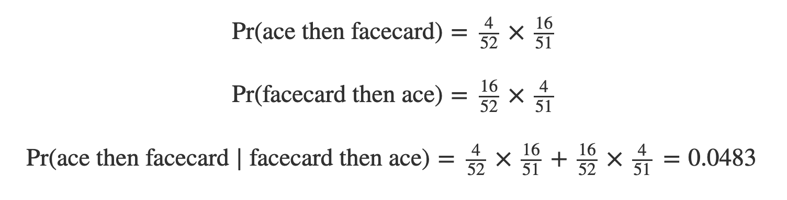

<html lang="en">

```{r setup, include=FALSE}
knitr::opts_chunk$set(
	echo = TRUE,
	message = FALSE,
	warning = FALSE
)

library(learnr) #necessary to render tutorial correctly

library(forcats)
library(ggplot2)
library(htmltools)
library(kableExtra)
library(lubridate)
library(magrittr)
library(tibble)


source("./www/datsci_helpers.R")
```

# datsci_03: Probability

## Introduction and Welcome!

<div class="infobox">
   
  
  **Usage:** This tutorial accompanies the textbook [Introduction to Data Science](https://rafalab.github.io/dsbook/) by [Prof Rafael Irizarry](http://rafalab.github.io/pages/about.html). It contains material from the textbook which is offered under a [Attribution-NonCommercial-ShareAlike 4.0 International (CC BY-NC-SA 4.0)](https://creativecommons.org/licenses/by-nc-sa/4.0/). 

</div>

### Welcome to *Data Science: Probability*!

Welcome to the *Data Science: Probability* (`datsci_03`) module. It is designed to teach you the basics of probability theory, which is the mathematical foundation of statistical inference.

### Course Overview

This is the third (`datsci_03`) in a series of courses in the Introduction to Data Science program. The courses in the program are designed to prepare you to do data analysis in `r rproj()`, from simple computations to machine learning. The courses are designed to be taken in order. A prerequisite for this course is courses 1 and 2 of the series or equivalent knowledge of basic R coding and data visualization. If you need to learn or refresh some basic `r rproj()`, check out *Data Science: `r rproj()` Basics* (datsci_01), the first course in this series.

The textbook for the Data Science course series is [freely available online](https://rafalab.github.io/dsbook/). This course corresponds to the Probability section of textbook, starting [here](https://rafalab.github.io/dsbook/probability.html).

This course assumes you are comfortable with basic math, algebra, and logical operations. We have some assignments in `r rproj()` that allow you to program directly in a browser-based interface. You will further have access to additional exercises to be completed on your local installation of `r rproj()`.

Using a combination of a guided introduction lectures and more independent in-depth exploration, you will get to practice your new `r rproj()` skills on real-life applications.

Probability theory is the mathematical foundation of statistical inference which is indispensable for analyzing data affected by chance, and thus essential for data scientists. In this course, you will learn important concepts in probability theory. The motivation for this course is the circumstances surrounding the financial crisis of 2007-2008. Part of what caused this financial crisis was that the risk of certain securities sold by financial institutions was underestimated. To begin to understand this very complicated event, we need to understand the basics of probability. We will introduce important concepts such as random variables, independence, Monte Carlo simulations, expected values, standard errors, and the Central Limit Theorem. These statistical concepts are fundamental to conducting statistical tests on data and understanding whether the data you are analyzing are likely occurring due to an experimental method or to chance. Statistical inference, covered in the next course in this program (`datsci_04`), builds upon probability theory.

### In this course, you will learn:

- Important concepts in probability theory including random variables and independence

- How to perform a Monte Carlo simulation

- The meaning of expected values and standard errors and how to compute them in `r rproj()`

- The importance of the Central Limit Theorem 

### Course overview

**Section 1:** Discrete Probability

- You will learn about basic principles of probability related to categorical data using card games as examples.

**Section 2:** Continuous Probability

- You will learn about basic principles of probability related to numeric and continuous data.

**Section 3:** Random Variables, Sampling Models, and The Central Limit Theorem 

- You will learn about random variables (numeric outcomes resulting from random processes), how to model data generation procedures as draws from an urn, and the Central Limit Theorem, which applies to large sample sizes.

**Section 4:** The Big Short 

- You will learn how interest rates are determined and how some bad assumptions led to the financial crisis of 2007-2008.

### Course Instructor

<div class="infobox">
  

**Fatih Uenal** is currently a Visitng Postdoctoral Researcher at the University of Cambridge, Department of Psychology, where he conducts research on the psychology of anthropocentrism and social and ecological dominance. Prior to his current position, he has worked as a postdoc at [Harvard University](https://scholar.harvard.edu/fatih-uenal/home). Together with [Prof Rafael Irizarry](http://rafalab.github.io/pages/about.html) he programmed this interactive tutorial based on the the textbook [*Introduction to Data Science*](https://rafalab.github.io/dsbook/). This interactive tutorial is developed using the `learnr` package. It has a general social scientists audience in mind and is suited for undergraduate and graduate levels of study. 

Webpage: https://scholar.harvard.edu/fatih-uenal/home

</div>

---

### Essential Course Information

#### **Course Objectives**

In this course, the third part of Introduction to Data Science (`datsci_03`), you will learn foundational concepts in probability theory. The motivation for this course is the circumstances surrounding the financial crisis of 2007-2008. Part of what caused this financial crisis was that the risk of some securities sold by financial institutions was underestimated. To begin to understand this very complicated event, we need to understand the basics of probability. 
We will introduce important concepts such as random variables, independence, Monte Carlo simulations, expected values, standard errors, and the Central Limit Theorem. These statistical concepts are fundamental to conducting statistical tests on data and understanding whether the data you are analyzing is likely occurring due to an experimental method or to chance. 
Probability theory is the mathematical foundation of statistical inference, which is indispensable for analyzing data affected by chance, and thus essential for data scientists.


At the end of this course you will have learned:

- Important concepts in probability theory including random variables and independence 

- How to perform a Monte Carlo simulation 

- The meaning of expected values and standard errors and how to compute them in `r rproj()`


**NOTE**: The schedule and procedures described in this syllabus are subject to change depending on specific needs and requirements. You will always be notified of changes on the homepage (see “last update”).


#### **Course Structure**

This is the third module in a series of a 8 week-intensive course. I suggest that you devote approx 10 hours a week to learning `r rproj()`, or if you are teaching graduate students, I’d recommend adopting the schedule below, which is designed for an intense but doable semester-long course, one module per week.  It is intended to take the average graduate student roughly 10 hours per week to complete all required tasks.However, some number of students will find programming to be more challenging and may take up to 15 hours per week.  Some will breeze through the material in 5.

#### **Grading**

Each Monday, lessons will be assigned from datacamp.com. Some of these lessons will be complete DataCamp courses, and others will be specific modules of courses. This will all be managed by assigning content to your (free) DataCamp account. The amount of content assigned will vary between one and two courses of content. DataCamp considers a course to be roughly 4 hours of lessons, which includes practice time. Realistically, the time you need will depend upon how intuitive you find `r rproj()` to be. For students already familiar with other programming languages and those with previous `r rproj()` experience, “8 hours” of courses is realistically closer to 2 hours; for complete novices that also find the material difficult, 8 hours is a realistic estimate. It is strongly recommended that you stretch out DataCamp lessons across the assignment period, for example, allocating 1 hour each day. You will gain the most by treating this as a foreign language immersion course by using R every day, including for your own research.
Remember that you can always go to the **Slack Group** for help. 

#### **Passing Rate**

The passing rate is 70%. 

### Pre-Course Survey

Insert Survey Link here

*If you cannot see the survey above, click this link to access it in a new window.*

### Installing `r rproj()` and R Studio

#### **Installing R**

To install `r rproj()` on your own computer, you can download it freely from the [Comprehensive R Archive Network (CRAN)](https://cran.r-project.org/). CRAN offers several versions of `r rproj()` available:  versions for multiple operating systems and releases older than the current one. **Important Note: For the `datsci` package, you will need to download R Version 4.0.2 or higher.** You want to read the CRAN instructions to assure you download the correct version. If you need further help, you can try the following resources:

- [Installing `r rproj()` on Windows](https://www.r-bloggers.com/2013/03/download-and-install-r-in-windows/)
- [Installing `r rproj()` on Mac](https://www.youtube.com/watch?v=uxuuWXU-7UQ)
- [Installing `r rproj()` on Ubuntu](https://www.youtube.com/watch?v=Nxl7HDUyw0I)

#### **Installing RStudio**

RStudio is an integrated development environment (IDE). We recommend installing and using RStudio to edit and test your code. Before installing RStudio, you need to install `r rproj()` first. Afterwards, you can download and install RStudio via the [RStudio website](https://www.rstudio.com/products/rstudio/download/). Their [cheatsheet](https://www.rstudio.com/wp-content/uploads/2016/01/rstudio-IDE-cheatsheet.pdf) gives a helpful overview of RStudio. 

- [Installing RStudio on Windows](https://www.youtube.com/watch?v=gx7A7C_wdyE)
- [Installing RStudio on Mac](https://www.youtube.com/watch?v=EmZqlcKkJMM)
- [Installing RStudio on Ubuntu](https://www.youtube.com/watch?v=dv_P9BnrZPA&feature=emb_logo)

---

## Introduction to Probability

In games of chance, probability has a very intuitive definition. For instance, we know what it means that the chance of a pair of dice coming up seven is 1 in 6. However, this is not the case in other contexts. Today probability theory is being used much more broadly with the word _probability_ commonly used in everyday language. Google's auto-complete of "What are the chances of" give us: "having twins", "rain today", "getting struck by lightning", and "getting cancer". One of the goals of this part of the course is to help us understand how probability is useful to understand and describe real-world events when performing data analysis.

Because knowing how to compute probabilities gives you an edge in games of chance, throughout history many smart individuals, including famous mathematicians such as Cardano, Fermat, and Pascal, spent time and energy thinking through the math of these games. As a result, Probability Theory was born. Probability continues to be highly useful in modern games of chance. For example, in poker, we can compute the probability of winning a hand based on the cards on the table. Also, casinos rely on probability theory to develop games that almost certainly guarantee a profit. 

Probability theory is useful in many other contexts and, in particular, in areas that depend on data affected by chance in some way. All of the other sectionss in this part build upon probability theory. Knowledge of probability is therefore indispensable for data science.


## Section 1: Discrete Probability

Section 1 introduces you to Discrete Probability. Section 1 is divided into three parts:

1\. Introduction to Discrete Probability

2\. Combinations and Permutations

3\. Addition Rule and Monty Hall

After completing Section 1, you will be able to:

- apply basic probability theory to categorical data.

- perform a Monte Carlo simulation to approximate the results of repeating an experiment over and over, including simulating the outcomes in the Monty Hall problem.

- distinguish between: sampling with and without replacement, events that are and are not independent, and combinations and permutations.

- apply the multiplication and addition rules, as appropriate, to calculate the probably of multiple events occurring.

- use `sapply()` instead of a for loop to perform element-wise operations on a function.

There are 3 assignments for you to practice your coding skills. There are also some quick probability calculations for you to perform as well, and there is a longer set of problems at the end of section 1.

This section corresponds to [the following section of the course textbook](https://rafalab.github.io/dsbook/probability.html#discrete-probability).

We encourage you to use `r rproj()` to interactively test out your answers and further your learning.

---

### 1.1 Discrete Probability

<div class="infobox">
  
**Textbook link** The contents are discussed within the [textbook section on the R basics - 13.1 Discrete probability](https://rafalab.github.io/dsbook/probability.html#discrete-probability).
  
</div>

--- 

We start by covering some basic principles related to categorical data. The subset of probability is referred to as _discrete probability_. It will help us understand the probability theory we will later introduce for numeric and continuous data, which is much more common in data science applications. Discrete probability is more useful in card games and therefore we use these as examples.

### Relative frequency

The word probability is used in everyday language. Answering questions about probability is often hard, if not impossible. Here we discuss a mathematical definition of _probability_ that does permit us to give precise answers to certain questions. 

For example, if I have [2 red beads and 3 blue beads inside an urn](https://en.wikipedia.org/wiki/Urn_problem) (most probability books use this archaic term, so we do too) and I pick one at random, what is the probability of picking a red one? Our intuition tells us that the answer is 2/5 or 40%. A precise definition can be given by noting that there are five possible outcomes of which two satisfy the condition necessary for the event "pick a red bead". Since each of the five outcomes has the same chance of occurring, we conclude that the probability is .4 for red and .6 for blue. 

A more tangible way to think about the probability of an event is as the proportion of times the event occurs when we repeat the experiment an infinite number of times, independently, and under the same conditions. 

### Notation

We use the notation $\mbox{Pr}(A)$ to denote the probability of event $A$ happening. We use the very general term _event_ to refer to things that can happen when something occurs by chance. In our previous example, the event was "picking a red bead". In a political poll in which we call 100 likely voters at random, an example of an event is "calling 48 Democrats and 52 Republicans".

In data science applications, we will often deal with continuous variables. These events will often be things like "is this person taller than 6 feet". In this case, we write events in a more mathematical form: $X \geq 6$. We will see more of these examples later. Here we focus on categorical data.


---

<div class="infobox">
   
  
**Key points:** 

---

- The *probability of an event* is the proportion of times the event occurs when we repeat the experiment independently under the same conditions.

$$\mbox{Pr}(A) = \mbox{probability of event A}$$ 

- An *event* is defined as an outcome that can occur when when something happens by chance.

- We can determine probabilities related to discrete variables (picking a red bead, choosing 48 Democrats and 52 Republicans from 100 likely voters) and continuous variables (height over 6 feet).


</div>

---

### 1.1 Monte Carlo Simulations


Computers provide a way to actually perform the simple random experiment described above: pick a bead at random from a bag that contains three blue beads and two red ones. Random number generators permit us to mimic the process of picking at random. 

An example is the `sample` function in R. We demonstrate its use in the code below.  First, we use the function `rep` to generate the urn:

```{r}
beads <- rep(c("red", "blue"), times = c(2,3))
beads
```

and then use `sample` to pick a bead at random:

```{r}
sample(beads, 1)
```

This line of code produces one random outcome. We want to repeat this experiment an infinite number of times, but it is impossible to repeat forever. Instead, we repeat the experiment a large enough number of times to make the results practically equivalent to repeating forever. **This is an example of a _Monte Carlo_ simulation**. 

Much of what mathematical and theoretical statisticians study, which we do not cover in this course, relates to providing rigorous definitions of "practically equivalent" as well as studying how close a large number of experiments gets us to what happens in the limit. Later in this section, we provide a practical approach to deciding what is "large enough".

To perform our first Monte Carlo simulation, we use the `replicate` function, which permits us to repeat the same task any number of times. Here, we repeat the random event $B =$ 10,000 times:

```{r}
B <- 10000
events <- replicate(B, sample(beads, 1))
```

We can now see if our definition actually is in agreement with this Monte Carlo simulation approximation. We can use `table` to see the distribution:

```{r}
tab <- table(events)
tab
```

and `prop.table` gives us the proportions:

```{r}
prop.table(tab)
```

The numbers above are the estimated probabilities provided by this Monte Carlo simulation. Statistical theory, not covered here, tells us that as $B$ gets larger, the estimates get closer to 3/5=.6 and 2/5=.4. 

Although this is a simple and not very useful example, we will use Monte Carlo simulations to estimate probabilities in cases in which it is harder to compute the exact ones. Before delving into more complex examples, we use simple ones to demonstrate the computing tools available in R.

### With and without replacement 

The function `sample` has an argument that permits us to pick more than one element from the urn. However, by default, this selection occurs _without replacement_: after a bead is selected, it is not put back in the bag. Notice what happens when we ask to randomly select five beads:

```{r}
sample(beads, 5)
sample(beads, 5)
sample(beads, 5)
```

This results in rearrangements that always have three blue and two red beads. If we ask that six beads be selected, we get an error:

```{r, eval=FALSE}
sample(beads, 6)
```

*Error in sample.int(length(x), size, replace, prob) : cannot take a sample larger than the population when 'replace = FALSE*

However, the `sample` function can be used directly, without the use of `replicate`, to repeat the same experiment of picking 1 out of the 5 beads, continually, under the same conditions. To do this, we sample _with replacement_: return the bead back to the urn after selecting it. 
We can tell `sample` to do this by changing the `replace` argument, which defaults to `FALSE`, to `replace = TRUE`:

```{r}
events <- sample(beads, B, replace = TRUE)
prop.table(table(events))
```

Not surprisingly, we get results very similar to those previously obtained with `replicate`.


---

<div class="infobox">
   
  
**Key points:** 

---

- Monte Carlo simulations model the probability of different outcomes by repeating a random process a large enough number of times that the results are similar to what would be observed if the process were repeated forever.

- The `sample()` function draws random outcomes from a set of options.

- The `replicate()` function repeats lines of code a set number of times. It is used with `sample()` and similar functions to run Monte Carlo simulations.


</div>

---

### Setting the Random Seed

#### **The `set.seed()` function**

Before we continue, we will briefly explain the following important line of code:
```{r, eval = FALSE}
set.seed(1986) 
```

Throughout this course, we use random number generators. This implies that many of the results presented can actually change by chance, which then suggests that a frozen version of the book may show a different result than what you obtain when you try to code as shown in the book. This is actually fine since the results are random and change from time to time. However, if you want to to ensure that results are exactly the same every time you run them, you can set `r rproj()`’s random number generation seed to a specific number. Above we set it to 1986. We want to avoid using the same seed every time. A popular way to pick the seed is the year - month - day. For example, we picked 1986 on December 20, 2018:  2018 − 12 − 20 = 1986.

You can learn more about setting the seed by looking at the documentation:
```{r, eval = FALSE}
?set.seed
```

#### **Important note on seeds in R 3.5 and R 3.6**

`r rproj()` was recently updated to version 3.6 in early 2019. In this update, the default method for setting the seed changed. This means that exercises, textbook excerpts and other code you encounter online may yield a different result based on your version of `r rproj()`.

If you are running `r rproj()` 3.6, you can revert to the original seed setting behavior by adding the argument sample.kind="Rounding". For example:
```{r, eval = FALSE}
set.seed(1)
set.seed(1, sample.kind="Rounding")    # will make R 3.6 generate a seed as in R 3.5
```

Using the `sample.kind="Rounding"` argument will generate a message:

`non-uniform 'Rounding' sampler used`

This is not a warning or a cause for alarm - it is a confirmation that `r rproj()` is using the alternate seed generation method, and you should expect to receive this message in your console.

**If you use `r rproj()` 3.6, you should always use the second form of `set.seed()` in this course series (outside of DataCamp assignments).** Failure to do so may result in an otherwise correct answer being rejected by the grader. In most cases where a seed is required, you will be reminded of this fact.


### Probability Distributions


If we know the relative frequency of the different categories, defining a distribution for categorical outcomes is relatively straightforward. We simply assign a probability to each category. In cases that can be thought of as beads in an urn, for each bead type, their proportion defines the distribution. 

If we are randomly calling likely voters from a population that is 44% Democrat, 44% Republican, 10% undecided, and 2% Green Party, these proportions define the probability for each group. The probability distribution is:


| | | |
|-------------------------|---|----|
|Pr(picking a Republican)|=|0.44   |
|Pr(picking a Democrat)|=|0.44|
|Pr(picking an undecided)|=|0.10|
|Pr(picking a Green)|=|0.02|
  

---

<div class="infobox">
   
  
**Key points:** 

---

- The probability distribution for a variable describes the probability of observing each possible outcome.

- For discrete categorical variables, the probability distribution is defined by the proportions for each group.


</div>

---

### Independence

We say two events are independent if the outcome of one does not affect the other. The classic example is coin tosses. Every time we toss a fair coin, the probability of seeing heads is 1/2 regardless of what previous tosses have revealed. The same is true when we pick beads from an urn with replacement. In the example above, the probability of red is 0.40 regardless of previous draws. 

Many examples of events that are not independent come from card games. When we deal the first card, the probability of getting a King is 1/13 since there are thirteen possibilities: Ace, Deuce, Three, $\dots$, Ten, Jack, Queen, King, and Ace. Now if we deal a King for the first card, and don't replace it into the deck, the probabilities of a second card being a King is less because there are only three Kings left: the probability is 3 out of 51. These events are therefore **not independent**: the first outcome affected the next one.

To see an extreme case of non-independent events, consider our example of drawing five beads at random **without** replacement:

```{r, echo=FALSE}
set.seed(1)
```

```{r}
x <- sample(beads, 5)
```

If you have to guess the color of the first bead, you will predict blue since blue has a 60% chance. But if I show you the result of the last four outcomes:

```{r}
x[2:5]
```

would you still guess blue? Of course not. Now you know that the probability of red is 1 since the only bead left is red. The events are not independent, so the probabilities change.


### Conditional probabilities

When events are not independent, _conditional probabilities_ are useful. We already saw an example of a conditional probability: we computed the probability that a second dealt card is a King given that the first was a King. In probability, we use the following notation:

$$
\mbox{Pr}(\mbox{Card 2 is a king} \mid \mbox{Card 1 is a king}) = 3/51
$$

We use the $\mid$ as shorthand for "given that" or "conditional on". 

When two events, say $A$ and $B$, are independent, we have:

$$
\mbox{Pr}(A \mid B) = \mbox{Pr}(A) 
$$

This is the mathematical way of saying: the fact that $B$ happened does not affect the probability of $A$ happening. In fact, this can be considered the mathematical definition of independence.

### Addition and multiplication rules

#### **Multiplication rule**

If we want to know the probability of two events, say $A$ and $B$, occurring, we can use the multiplication rule:

$$ 
\mbox{Pr}(A \mbox{ and } B) = \mbox{Pr}(A)\mbox{Pr}(B \mid A)
$$
Let's use Blackjack as an example. In Blackjack, you are assigned two random cards. After you see what you have, you can ask for more. The goal is to get closer to 21 than the dealer, without going over. Face cards are worth 10 points and Aces are worth 11 or 1 (you choose).

So, in a Blackjack game, to calculate the chances of getting a 21 by drawing an Ace and then a face card, we compute the probability of the first being an Ace and multiply by the probability of drawing a face card or a 10 given that the first was an Ace: $1/13 \times 16/51 \approx 0.025$

The multiplication rule also applies to more than two events. We can use induction to expand for more events:

$$ 
\mbox{Pr}(A \mbox{ and } B \mbox{ and } C) = \mbox{Pr}(A)\mbox{Pr}(B \mid A)\mbox{Pr}(C \mid A \mbox{ and } B)
$$

### Multiplication rule under independence

When we have independent events, then the multiplication rule becomes simpler:

$$ 
\mbox{Pr}(A \mbox{ and } B \mbox{ and } C) = \mbox{Pr}(A)\mbox{Pr}(B)\mbox{Pr}(C)
$$

But we have to be very careful before using this since assuming independence can result in very different and incorrect probability calculations when we don't actually have independence.

As an example, imagine a court case in which the suspect was described as having a mustache and a beard. The defendant has a mustache and a beard and the prosecution brings in an "expert" to testify that 1/10 men have beards and 1/5 have mustaches, so using the multiplication rule we conclude that only $1/10 \times 1/5$ or 0.02 have both. 

But to multiply like this we need to assume independence! Say the conditional probability of a man having a mustache conditional on him having a beard is .95. So the correct calculation probability is much higher: $1/10 \times 95/100 = 0.095$.

The multiplication rule also gives us a general formula for computing conditional probabilities:


$$ 
\mbox{Pr}(B \mid A) = \frac{\mbox{Pr}(A \mbox{ and } B)}{ \mbox{Pr}(A)}
$$

To illustrate how we use these formulas and concepts in practice, we will use several examples related to card games.


---

<div class="infobox">
   
  
**Key points:** 

---

- *Conditional probabilities* compute the probability that an event occurs given information about dependent events. For example, the probability of drawing a second king given that the first draw is a king is:

$$
\mbox{Pr}(\mbox{Card 2 is a king} \mid \mbox{Card 1 is a king}) = 3/51
$$

- If two events $A$ and $B$ are independent, $\mbox{Pr}(A \mid B) = \mbox{Pr}(A)$.

- To determine the probability of multiple events occurring, we use the *multiplication rule*.


</div>

---


### 1.1 Assessment: Introduction to Discrete Probability

Insert assessment here

### 1.1 DataCamp Assessment: Introduction to Discrete Probability

Insert assessment here

### 1.2 Combinations and Permutations


In our very first example, we imagined an urn with five beads. As a reminder, to compute the probability distribution of one draw, we simply listed out all the possibilities. There were 5 and so then, for each event, we counted how many of these possibilities were associated with the event. The resulting probability of choosing a blue bead is 3/5 because out of the five possible outcomes, three were blue.

For more complicated cases, the computations are not as straightforward. For instance, what is the probability that if I draw five cards without replacement, I get all cards of the same suit, what is known as a "flush" in poker? In a discrete probability course you learn theory on how to make these computations. Here we focus on how to use R code to compute the answers.

First, let's construct a deck of cards. For this, we will use the `expand.grid` and `paste` functions. We use `paste` to create strings by joining smaller strings. To do this, we take the number and suit of a card and create the card name like this:

```{r}
number <- "Three"
suit <- "Hearts"
paste(number, suit)
```

`paste` also works on pairs of vectors performing the operation element-wise:

```{r}
paste(letters[1:5], as.character(1:5))
```

The function `expand.grid` gives us all the combinations of entries of two vectors. For example, if you have blue and black pants and white, grey, and plaid shirts, all your combinations are:

```{r}
expand.grid(pants = c("blue", "black"), shirt = c("white", "grey", "plaid"))
```

Here is how we generate a deck of cards:
```{r}
suits <- c("Diamonds", "Clubs", "Hearts", "Spades")
numbers <- c("Ace", "Deuce", "Three", "Four", "Five", "Six", "Seven", 
             "Eight", "Nine", "Ten", "Jack", "Queen", "King")
deck <- expand.grid(number=numbers, suit=suits)
deck <- paste(deck$number, deck$suit)
```

With the deck constructed, we can double check that the probability of a King in the first card is 1/13 by computing the proportion of possible outcomes that satisfy our condition:

```{r}
kings <- paste("King", suits)
mean(deck %in% kings)
```

Now, how about the conditional probability of the second card being a King given that the first was a King? Earlier, we deduced that if one King is already out of the deck and there are 51 left, then this probability is 3/51. Let's confirm by listing out all possible outcomes. 

To do this, we can use the `permutations` function from the __gtools__ package. For any list of size `n`, this function computes all the different combinations we can get when we select `r` items. Here are all the ways we can choose two numbers from a list consisting of `1,2,3`:

```{r, message=FALSE, warning=FALSE}
library(gtools)
permutations(3, 2)
```

Notice that the order matters here: 3,1 is different than 1,3. Also, note that (1,1), (2,2), and (3,3) do not appear because once we pick a number, it can't appear again.

Optionally, we can add a vector. If you want to see five random seven digit phone numbers out of all possible phone numbers (without repeats), you can type:

```{r}
all_phone_numbers <- permutations(10, 7, v = 0:9)
n <- nrow(all_phone_numbers)
index <- sample(n, 5)
all_phone_numbers[index,]
```

Instead of using the numbers 1 through 10, the default, it uses what we provided through `v`: the digits 0 through 9.

To compute all possible ways we can choose two cards when the order matters, we type:
```{r}
hands <- permutations(52, 2, v = deck)
```

This is a matrix with two columns and `r nrow(hands)` rows. With a matrix we can get the first and second cards like this:

```{r}
first_card <- hands[,1]
second_card <- hands[,2]
```

Now the cases for which the first hand was a King can be computed like this:

```{r}
kings <- paste("King", suits)
sum(first_card %in% kings)
```

To get the conditional probability, we compute what fraction of these have a King in the second card:

```{r}
sum(first_card%in%kings & second_card%in%kings) / sum(first_card%in%kings)
```

which is exactly 3/51, as we had already deduced. Notice that the code above is equivalent to:

```{r}
mean(first_card%in%kings & second_card%in%kings) / mean(first_card%in%kings)
```

which uses `mean` instead of `sum` and is an R version of: 

$$
\frac{\mbox{Pr}(A \mbox{ and } B)}{ \mbox{Pr}(A)}
$$


How about if the order doesn't matter? For example, in Blackjack if you get an Ace and a face card in the first draw, it is called a _Natural 21_ and you win automatically. If we wanted to compute the probability of this happening, we would enumerate the _combinations_, not the permutations, since the order does not matter. 

```{r}
combinations(3,2)
```

In the second line, the outcome does not include (2,1) because  (1,2) already was enumerated. The same applies to (3,1) and (3,2).

So to compute the probability of a _Natural 21_ in Blackjack, we can do this:

```{r}
aces <- paste("Ace", suits)

facecard <- c("King", "Queen", "Jack", "Ten")
facecard <- expand.grid(number = facecard, suit = suits)
facecard <- paste(facecard$number, facecard$suit)

hands <- combinations(52, 2, v = deck)
mean(hands[,1] %in% aces & hands[,2] %in% facecard)
```

In the last line, we assume the Ace comes first. This is only because we know the way `combination` enumerates possibilities and it will list this case first. But to be safe, we could have written this and produced the same answer:

```{r}
mean((hands[,1] %in% aces & hands[,2] %in% facecard) |
       (hands[,2] %in% aces & hands[,1] %in% facecard))
```


### Monte Carlo example 

Instead of using `combinations` to deduce the exact probability of a Natural 21, we can use a Monte Carlo to estimate this probability. In this case, we draw two cards over and over and keep track of how many 21s we get. We can use the function sample to draw two cards without replacements:

```{r}
hand <- sample(deck, 2)
hand
```

And then check if one card is an Ace and the other a face card or a 10. Going forward, we include 10 when we say _face card_. Now we need to check both possibilities:

```{r}
(hands[1] %in% aces & hands[2] %in% facecard) | 
  (hands[2] %in% aces & hands[1] %in% facecard)
```

If we repeat this 10,000 times, we get a very good approximation of the probability of a Natural 21.

Let's start by writing a function that draws a hand and returns TRUE if we get a 21. The function does not need any arguments because it uses objects defined in the global environment.
```{r}
blackjack <- function(){
   hand <- sample(deck, 2)
  (hand[1] %in% aces & hand[2] %in% facecard) | 
    (hand[2] %in% aces & hand[1] %in% facecard)
}
```

Here we do have to check both possibilities: Ace first or Ace second because we are not using the `combinations` function. The function returns `TRUE` if we get a 21 and `FALSE` otherwise:

```{r}
blackjack()
```

Now we can play this game, say, 10,000 times:

```{r}
B <- 10000
results <- replicate(B, blackjack())
mean(results)
```

---

<div class="infobox">
   
  
**Key points:** 

---

- `paste()` joins two strings and inserts a space in between.

- `expand.grid()` gives the combinations of 2 vectors or lists.

- `permutations(n,r)` from the **gtools** package lists the different ways that r items can be selected from a set of n options when order matters.

- `combinations(n,r)` from the **gtools** package lists the different ways that r items can be selected from a set of n options when order does not matter.


</div>

---

### The Birthday Problem

In this section, we describe two discrete probability popular examples: the Monty Hall problem and the birthday problem. We use R to help illustrate the mathematical concepts.

---

Suppose you are in a classroom with 50 people. If we assume this is a randomly selected group of 50 people, what is the chance that at least two people have the same birthday? Although it is somewhat advanced, we can deduce this mathematically. We will do this later. Here we use a Monte Carlo simulation. For simplicity, we assume nobody was born on February 29. This actually doesn't change the answer much. 

First, note that birthdays can be represented as numbers between 1 and 365, so a sample of 50 birthdays can be obtained like this:

```{r,echo=FALSE}
set.seed(1)
```

```{r}
n <- 50
bdays <- sample(1:365, n, replace = TRUE)
```

To check if in this particular set of 50 people we have at least two with the same birthday, we can use the function `duplicated`, which returns `TRUE` whenever an element of a vector is a duplicate. Here is an example:

```{r}
duplicated(c(1,2,3,1,4,3,5))
```

The second time 1 and 3 appear, we get a `TRUE`. So to check if two birthdays were the same, we simply use the `any` and `duplicated` functions like this:

```{r}
any(duplicated(bdays))
```

In this case, we see that it did happen. At least two people had the same birthday.

To estimate the probability of a shared birthday in the group, we repeat this experiment by sampling sets of 50 birthdays over and over:

```{r birthday-problem}
B <- 10000
same_birthday <- function(n){
  bdays <- sample(1:365, n, replace=TRUE)
  any(duplicated(bdays))
}
results <- replicate(B, same_birthday(50))
mean(results)
```

Were you expecting the probability to be this high?

People tend to underestimate these probabilities. To get an intuition as to why it is so high, think about what happens when the group size is close to 365. At this stage, we run out of days and the probability is one. 


---

<div class="infobox">
   
  
**Key points:** 

---

- `duplicated()` takes a vector and returns a vector of the same length with TRUE for any elements that have appeared previously in that vector.

- We can compute the probability of shared birthdays in a group of people by modeling birthdays as random draws from the numbers 1 through 365.
We can then use this sampling model of birthdays to run a Monte Carlo simulation to estimate the probability of shared birthdays.


</div>

---


### sapply


Say we want to use this knowledge to bet with friends about two people having the same birthday in a group of people. When are the chances larger than 50%? Larger than 75%? 

Let's create a look-up table. We can quickly create a function to compute this for any group size:

```{r}
compute_prob <- function(n, B=10000){
  results <- replicate(B, same_birthday(n))
  mean(results)
}
```


Using the function `sapply`, we can perform element-wise operations on any function:

```{r}
n <- seq(1,60)
prob <- sapply(n, compute_prob)
```

We can now make a plot of the estimated probabilities of two people having the same birthday in a group of size $n$:

```{r birthday-problem-mc-probabilities, warning=FALSE, message=FALSE}
library(tidyverse)
prob <- sapply(n, compute_prob)
qplot(n, prob)
```

Now let's compute the exact probabilities rather than use Monte Carlo approximations. Not only do we get the exact answer using math, but the computations are much faster since we don't have to generate experiments.  


To make the math simpler, instead of computing the probability of it happening, we will compute the probability of it not happening. For this, we use the multiplication rule.

Let's start with the first person. The probability that person 1 has a unique birthday is 1. The probability that person 2 has a unique birthday, given that person 1 already took one, is 364/365. Then, given that the first two people have unique birthdays, person 3 is left with 363 days to choose from. We continue this way and find the chances of all 50 people having a unique birthday is:

$$
1 \times \frac{364}{365}\times\frac{363}{365} \dots \frac{365-n + 1}{365}
$$

We can write a function that does this for any number:

```{r birthday-problem-exact-probabilities}
exact_prob <- function(n){
  prob_unique <- seq(365,365-n+1)/365 
  1 - prod( prob_unique)
}
eprob <- sapply(n, exact_prob)
qplot(n, prob) + geom_line(aes(n, eprob), col = "red")
```

This plot shows that the Monte Carlo simulation provided a very good estimate of the exact probability. Had it not been possible to compute the exact probabilities, we would have still been able to accurately estimate the probabilities.


---

<div class="infobox">
   
  
**Key points:** 

---

- Some functions automatically apply element-wise to vectors, such as `sqrt()` and *.
However, other functions do not operate element-wise by default. This includes functions we define ourselves.

- The function `sapply(x, f)` allows any other function f to be applied element-wise to the vector x.


</div>

---


### How Many Monte Carlo Experiments are Enough?

The theory described here requires repeating experiments over and over forever. In practice we can't do this. 
In the examples above, we used $B=10,000$ Monte Carlo experiments and it turned out that this provided accurate estimates. The larger this number, the more accurate the estimate becomes until the approximaton is so good that your computer can't tell the difference. But in more complex calculations, 10,000 may not be nearly enough. Also, for some calculations, 10,000 experiments might not be computationally feasible. In practice, we won't know what the answer is, so we won't know if our Monte Carlo estimate is accurate. We know that the larger $B$, the better the approximation. But how big do we need it to be? This is actually a challenging question and answering it often requires advanced theoretical statistics training. 

One practical approach we will describe here is to check for the stability of the estimate. The following is an example with the birthday problem for a group of 25 people. 

```{r monte-carlo-convergence}
B <- 10^seq(1, 5, len = 100)
compute_prob <- function(B, n=25){
  same_day <- replicate(B, same_birthday(n))
  mean(same_day)
}
prob <- sapply(B, compute_prob)
qplot(log10(B), prob, geom = "line")
```

In this plot, we can see that the values start to stabilize (that is, they vary less than .01) around 1000. Note that the exact probability, which we know in this case, is `r eprob[25]`. 


---

<div class="infobox">
   
  
**Key points:** 

---

- The larger the number of Monte Carlo replicates **𝐵**, the more accurate the estimate.

- Determining the appropriate size for **𝐵** can require advanced statistics.

- One practical approach is to try many sizes for **𝐵** and look for sizes that provide stable estimates.

</div>

---


### 1.2 DataCamp Assessment: Combinations and Permutations

Insert assessment here


### The Addition Rule

The addition rule tells us that:

$$
\mbox{Pr}(A \mbox{ or } B) = \mbox{Pr}(A) + \mbox{Pr}(B) - \mbox{Pr}(A \mbox{ and } B)
$$

This rule is intuitive: think of a Venn diagram. If we simply add the probabilities, we count the intersection twice so we need to substract one instance.

<center>
  
```{r venn-diagram-addition-rule, fig.height=7.5, fig.width=7.5, echo=FALSE, warning=FALSE, message=FALSE, out.width="50%"}
library(VennDiagram)
rafalib::mypar()
grid.newpage()
tmp <- draw.pairwise.venn(22, 20, 11, category = c("A", "B"), 
                   lty = rep("blank", 2), 
                   fill = c("light blue", "pink"), 
                   alpha = rep(0.5, 2),  
                   cat.dist = rep(0.025, 2), cex=0, cat.cex = rep(2.5,2))
```

</center>
  
#### **Example: The addition rule for a natural 21 in blackjack**

We apply the addition rule where **𝐴** = drawing an ace then a facecard and **𝐵** = drawing a facecard then an ace. Note that in this case, both events A and B cannot happen at the same time, so Pr(**𝐴** and **𝐵**) = 0.


<center>
  
  
<figure>

</figure> 


</center>


### The Monty Hall Problem


In the 1970s, there was a game show called "Let's Make a Deal" and Monty Hall was the host. At some point in the game, contestants were asked to pick one of three doors. Behind one door there was a prize. The other doors had a goat behind them to show the contestant they had lost. After the contestant picked a door, before revealing whether the chosen door contained a prize, Monty Hall would open one of the two remaining doors and show the contestant there was no prize behind that door. Then he would ask "Do you want to switch doors?" What would you do?

We can use probability to show that if you stick with the original door choice, your chances of winning a prize remain 1 in 3. However, if you switch to the other door, your chances of winning double to 2 in 3! This seems counterintuitive. Many people incorrectly think both chances are 1 in 2 since you are choosing between 2 options. You can watch a detailed mathematical explanation on [Khan Academy](https://www.khanacademy.org/math/precalculus/prob-comb/dependent-events-precalc/v/monty-hall-problem) or read one on [Wikipedia](https://en.wikipedia.org/wiki/Monty_Hall_problem). Below we use a Monte Carlo simulation to see which strategy is better. Note that this code is written longer than it should be for pedagogical purposes. 

Let's start with the stick strategy:

```{r}
B <- 10000
monty_hall <- function(strategy){
  doors <- as.character(1:3)
  prize <- sample(c("car", "goat", "goat"))
  prize_door <- doors[prize == "car"]
  my_pick  <- sample(doors, 1)
  show <- sample(doors[!doors %in% c(my_pick, prize_door)],1)
  stick <- my_pick
  stick == prize_door
  switch <- doors[!doors%in%c(my_pick, show)]
  choice <- ifelse(strategy == "stick", stick, switch)
  choice == prize_door
}
stick <- replicate(B, monty_hall("stick"))
mean(stick)
switch <- replicate(B, monty_hall("switch"))
mean(switch)
```

As we write the code, we note that the lines starting with `my_pick` and `show` have no influence on the last logical operation when we stick to our original choice anyway. From this we should realize that the chance is 1 in 3, what we began with. When we switch, 
the Monte Carlo estimate confirms the 2/3 calculation. This helps us gain some insight by showing that we are removing a door, `show`, that is definitely not a winner from our choices. We also see that unless we get it right when we first pick, you win: 1 - 1/3 = 2/3. 


---

<div class="infobox">
   
  
**Key points:** 

---

- Monte Carlo simulations can be used to simulate random outcomes, which makes them useful when exploring ambiguous or less intuitive problems like the Monty Hall problem.

- In the Monty Hall problem, contestants choose one of three doors that may contain a prize. Then, one of the doors that was not chosen by the contestant and does not contain a prize is revealed. The contestant can then choose whether to stick with the original choice or switch to the remaining unopened door.

- Although it may seem intuitively like the contestant has a 1 in 2 chance of winning regardless of whether they stick or switch, Monte Carlo simulations demonstrate that the actual probability of winning is 1 in 3 with the stick strategy and 2 in 3 with the switch strategy.

</div>

---


### 1.3 DataCamp Assessment: The Addition Rule and Monty Hall

Insert assessment here


### Introduction

The following assessments allow you to practice the probability and coding skills you've learned in Section 1: Discrete Probability. You will likely find it useful to try out code to answer the problems using `r rproj()` on your own machine.

You will benefit from using the following libraries:

```{r, eval = FALSE}
library(gtools)
library(tidyverse)
```

### 1.4 Question 1

Insert assessment here


### 1.4 Question 2

Insert assessment here


### 1.4 Questions 3 and 4 part 1

Insert assessment here


### 1.4 Questions 5 and 6 part 2

Insert assessment here


## Section 2: Continuous Probability

Section 2 introduces you to Continuous Probability.

After completing Section 2, you will:

- understand the differences between calculating probabilities for discrete and continuous data.

- be able to use cumulative distribution functions to assign probabilities to intervals when dealing with continuous data.

- be able to use `r rproj()` to generate normally distributed outcomes for use in Monte Carlo simulations.

- know some of the useful theoretical continuous distributions in addition to the normal distribution, such as the student-t, chi-squared, exponential, gamma, beta, and beta-binomial distributions.

There is 1 assignment that uses the DataCamp platform for you to practice your coding skills as well as a set of questions at the end of section 3.

---

### Continuous Probability

In a previous [section - 8.4 Cumulative distribution functions](https://rafalab.github.io/dsbook/distributions.html#cdf-intro), we explained why when summarizing a list of numeric values, such as heights, it is not useful to construct a distribution that defines a proportion to each possible outcome. For example, if we measure every single person in a very large population of size $n$ with extremely high precision, since no two people are exactly the same height, we need to assign the proportion $1/n$ to each observed value and attain no useful summary at all. Similarly, when defining probability distributions, it is not useful to assign a very small probability to every single height.

Just as when using distributions to summarize numeric data, it is much more practical to define a function that operates on intervals rather than single values. The standard way of doing this is using the _cumulative distribution function_ (CDF).

We described empirical cumulative distribution function (eCDF) in the textbook [(Section - 8.4 Cumulative distribution functions)](https://rafalab.github.io/dsbook/distributions.html#cdf-intro) as a basic summary of a list of numeric values. As an example, we earlier defined the height distribution for adult male students. Here, we define the vector $x$ to contain these heights:

```{r,  message=FALSE, warning=FALSE}
library(tidyverse)
library(dslabs)
data(heights)
x <- heights %>% filter(sex=="Male") %>% pull(height)
```

We defined the empirical distribution function as:

```{r}
F <- function(a) mean(x<=a)
```

which, for any value `a`, gives the proportion of values in the list `x` that are smaller or equal than `a`. 

Keep in mind that we have not yet introduced probability in the context of CDFs. Let's do this by asking the following: if I pick one of the male students at random, what is the chance that he is taller than 70.5 inches? Because every student has the same chance of being picked, the answer to this is equivalent to the proportion of students that are taller than 70.5 inches. Using the CDF we obtain an answer by typing:

```{r}
1 - F(70)
```

Once a CDF is defined, we can use this to compute the probability of any subset. For instance, the probability of a student being between height `a` and height `b` is:

```{r, eval=FALSE}
F(b)-F(a)
```

Because we can compute the probability for any possible event this way, the cumulative probability function defines the probability distribution for picking a height at random from our vector of heights `x`. 


---

<div class="infobox">
   
  
**Key points:** 

---

- The *cumulative distribution function* (CDF) is a distribution function for continuous data $x$ that reports the proportion of the data below $a$ for all values of $a$:

$$F(a)=\mbox{Pr}(x \leq a)$$

- The CDF is the *probability distribution function* for continuous variables. For example, to determine the probability that a male student is taller than 70.5 inches given a vector of male heights 𝑥, we can use the CDF:

$$\mbox{Pr}(x > 70.5) = 1 - \mbox{Pr}(x \leq 70.5) = 1 - F(70.5)$$

- The probability that an observation is in between two values $a$, $b$ is $F(b)-F(a)$.

</div>

---


### Theoretical Continuous Distribution


In the Data Visualization Module (datsci_02) we introduced the normal distribution as a useful approximation to many naturally occurring distributions, including that of height. The cumulative distribution for the normal distribution is defined by a mathematical formula which in R can be obtained with the function `pnorm`. We say that a random quantity is normally distributed with average `m` and standard deviation `s` if its probability distribution is defined by:

```{r, eval=FALSE}
F(a) = pnorm(a, m, s)
```

This is useful because if we are willing to use the normal approximation for, say, height, we don't need the entire dataset to answer questions such as: what is the probability that a randomly selected student is taller then 70 inches? We just need the average height and standard deviation:

```{r}
m <- mean(x)
s <- sd(x)
1 - pnorm(70.5, m, s)
```

#### **Theoretical distributions as approximations**

The normal distribution is derived mathematically: we do not need data to define it. For practicing data scientists, almost everything we do involves data. Data is always, technically speaking, discrete. For example, we could consider our height data categorical with each specific height a unique category. The probability distribution is defined by the proportion of students reporting each height. Here is a plot of that probability distribution:

```{r plot-of-height-frequencies, echo=FALSE}
rafalib::mypar()
plot(prop.table(table(x)), xlab = "a = Height in inches", ylab = "Pr(X = a)")
```

While most students rounded up their heights to the nearest inch, others reported values with more precision. One student reported his height to be 69.6850393700787, which is 177 centimeters. The probability assigned to this height is `r 1/length(x)` or 1 in `r length(x)`. The probability for 70 inches is much higher at `r mean(x==70)`, but does it really make sense to think of the probability of being exactly 70 inches as being different than 69.6850393700787? Clearly it is much more useful for data analytic purposes to treat this outcome as a continuous numeric variable, keeping in mind that very few people, or perhaps none, are exactly 70 inches, and that the reason we get more values at 70 is because people round to the nearest inch. 

With continuous distributions, the probability of a singular value is not even defined. For example, it does not make sense to ask what is the probability that a normally distributed value is 70. Instead, we define probabilities for intervals. We thus could ask what is the probability that someone is between 69.5 and 70.5.

In cases like height, in which the data is rounded, the normal approximation is particularly useful if we deal with intervals that include exactly one round number. For example, the normal distribution is useful for approximating the proportion of students reporting values in intervals like the following three:

```{r}
mean(x <= 68.5) - mean(x <= 67.5)
mean(x <= 69.5) - mean(x <= 68.5)
mean(x <= 70.5) - mean(x <= 69.5)
```

Note how close we get with the normal approximation:

```{r}
pnorm(68.5, m, s) - pnorm(67.5, m, s) 
pnorm(69.5, m, s) - pnorm(68.5, m, s) 
pnorm(70.5, m, s) - pnorm(69.5, m, s) 
```

However, the approximation is not as useful for other intervals. For instance, notice how the approximation breaks down when we try to estimate:

```{r}
mean(x <= 70.9) - mean(x<=70.1)
```

with

```{r}
pnorm(70.9, m, s) - pnorm(70.1, m, s)
```

In general, we call this situation _discretization_. Although the true height distribution is continuous, the reported heights tend to be more common at discrete values, in this case, due to rounding. As long as we are aware of how to deal with this reality, the normal approximation can still be a very useful tool.


---

<div class="infobox">
   
  
**Key points:** 

---

- `pnorm(a, avg, s)` gives the value of the cumulative distribution function $F(a)$ for the normal distribution defined by average `avg` and standard deviation s.

- We say that a random quantity is normally distributed with average avg and standard deviation s if the approximation `pnorm(a, avg, s)` holds for all values of a.
    
- If we are willing to use the normal approximation for height, we can estimate the distribution simply from the mean and standard deviation of our values.

- If we treat the height data as discrete rather than categorical, we see that the data are not very useful because integer values are more common than expected due to rounding. This is called *discretization*.

- With rounded data, the normal approximation is particularly useful when computing probabilities of intervals of length 1 that include exactly one integer.

</div>

---


### 2.1 Probability Density


For categorical distributions, we can define the probability of a category. For example, a roll of a die, let's call it $X$, can be 1,2,3,4,5 or 6. The probability of 4 is defined as:

$$
\mbox{Pr}(X=4) = 1/6
$$

The CDF can then easily be defined:
$$
F(4) = \mbox{Pr}(X\leq 4) =  \mbox{Pr}(X = 4) +  \mbox{Pr}(X = 3) +  \mbox{Pr}(X = 2) +  \mbox{Pr}(X = 1) 
$$

Although for continuous distributions the probability of a single value $\mbox{Pr}(X=x)$ is not defined, there is a theoretical definition that has a similar interpretation. The probability density at $x$ is defined as the function $f(a)$ such that:

$$
F(a) = \mbox{Pr}(X\leq a) = \int_{-\infty}^a f(x)\, dx
$$

For those that know calculus, remember that the integral is related to a sum: it is the sum of bars with widths approximating 0. If you don't know calculus, you can think of $f(x)$ as a curve for which the area under that curve up to the value $a$, gives you the probability $\mbox{Pr}(X\leq a)$. 

For example, to use the normal approximation to estimate the probability of someone being taller than 76 inches, we use:


```{r}
1 - pnorm(76, m, s)
```

which mathematically is the grey area below:

```{r intergrals, echo=FALSE}
dat <- tibble(x = seq(-4, 4, length=100) * s + m,
              y = dnorm(x, m, s))

dat_ribbon <- filter(dat, x >= 2 * s + m)

ggplot(dat, aes(x, y)) +
  geom_line() +
  geom_ribbon(aes(ymin = 0, ymax = y), data = dat_ribbon)
```

The curve you see is the probability density for the normal distribution. In R, we get this using the function `dnorm`. 

Although it may not be immediately obvious why knowing about probability densities is useful, understanding this concept will be essential to those wanting to fit models to data for which predefined functions are not available.

---

<div class="infobox">
   
  
**Key points:** 

---

- The probability of a single value is not defined for a continuous distribution.

- The quantity with the most similar interpretation to the probability of a single value is the probability density function $f(x)$.

- The probability density $f(x)$ is defined such that the integral of $f(x)$ over a range gives the CDF of that range.

$$
F(a) = \mbox{Pr}(X\leq a) = \int_{-\infty}^a f(x)\, dx
$$

- In `r rproj()`, the probability density function for the normal distribution is given by `dnorm()`. We will see uses of `dnorm()` in the future.

- Note that `dnorm()` gives the density function and `pnorm()` gives the distribution function, which is the integral of the density function.

</div>


### 2.1 Monte Carlo Simulations


R provides functions to generate normally distributed outcomes. Specifically, the `rnorm` function takes three arguments: size, average (defaults to 0), and standard deviation (defaults to 1) and produces random numbers. Here is an example of how we could generate data that looks like our reported heights:

```{r}
n <- length(x)
m <- mean(x)
s <- sd(x)
simulated_heights <- rnorm(n, m, s)
```

Not surprisingly, the distribution looks normal:

```{r simulated-heights, echo=FALSE}
data.frame(simulated_heights = simulated_heights) %>%
  ggplot(aes(simulated_heights)) + 
  geom_histogram(color="black", binwidth = 1) 
```

This is one of the most useful functions in R as it will permit us to generate data that mimics natural events and answers questions related to what could happen by chance by running Monte Carlo simulations.

If, for example, we pick 800 males at random, what is the distribution of the tallest person? How rare is a seven footer in a group of 800 males? The following Monte Carlo simulation helps us answer that question:

```{r}
B <- 10000
tallest <- replicate(B, {
  simulated_data <- rnorm(800, m, s)
  max(simulated_data)
})
```

Having a seven footer is quite rare:

```{r}
mean(tallest >= 7*12)
```

Here is the resulting distribution:

```{r simulated-tallest-height, echo=FALSE}
data.frame(tallest = tallest) %>% ggplot(aes(tallest)) + 
  geom_histogram(color="black", binwidth = 1) 
```

Note that it does not look normal.

---

<div class="infobox">
   
  
**Key points:** 

---

- `rnorm(n, avg, s)` generates n random numbers from the normal distribution with average avg and standard deviation s.
    
-  By generating random numbers from the normal distribution, we can simulate height data with similar properties to our dataset. Here we generate simulated height data using the normal distribution.

</div>


### 2.1 Other Continuous Distributions


We introduced the normal distribution in the data visualization module (datsci_02; [textbook section - 8.8 The normal distribution](https://rafalab.github.io/dsbook/distributions.html#normal-distribution)) and used it as an example above.
The normal distribution is not the only useful theoretical distribution.  Other continuous distributions that we may encounter are the student-t, Chi-square, exponential, gamma, beta, and beta-binomial. R provides functions to compute the density, the quantiles, the cumulative distribution functions and to generate Monte Carlo simulations. R uses a convention that lets us remember the names, namely using the letters `d`, `q`, `p`, and `r` in front of a shorthand for the distribution. We have already seen the functions `dnorm`, `pnorm`, and `rnorm` for the normal distribution. The functions `qnorm` gives us the quantiles. We can therefore draw a distribution like this:

```{r normal-density, eval=FALSE}
x <- seq(-4, 4, length.out = 100)
qplot(x, f, geom = "line", data = data.frame(x, f = dnorm(x)))
```

For the student-t, described later in [textbook section - 16.10 The t-distribution](https://rafalab.github.io/dsbook/models.html#t-dist), the shorthand `t` is used so the functions are `dt` for the density, `qt` for the quantiles, `pt` for the cumulative distribution function, and `rt` for Monte Carlo simulation.

---

<div class="infobox">
   
  
**Key points:** 

---

- You may encounter other continuous distributions (Student t, chi-squared, exponential, gamma, beta, etc.).

- R provides functions for density (d), quantile (q), probability distribution (p) and random number generation (r) for many of these distributions.

- Each distribution has a matching abbreviation (for example, `norm()` or `t()`) that is paired with the related function abbreviations (**d, p, q, r**) to create appropriate functions.

- For example, use `rt()` to generate random numbers for a Monte Carlo simulation using the Student t distribution.

</div>


### 2.1 DataCamp Assessment: Continuous Probability

Insert assessment here

### 2.2 Assessment part 1

Insert assessment here

### 2.2 Assessment part 2

Insert assessment here


## Section 3: Random Variables, Sampling Models, and The Central Limit Theorem 

Section 3 introduces you to Random Variables, Sampling Models, and the Central Limit Theorem.

Section 3 is divided into two parts:

1\. Random Variables and Sampling Models


2\. The Central Limit Theorem.


After completing Section 3, you will:

- understand what random variables are, how to generate them, and the correct mathematical notation to use with them.

- be able to use sampling models to estimate characteristics of a larger population.

- be able to explain the difference between a distribution and a probability distribution.

- understand the Central Limit Theorem and the law of large numbers.

There are 2 assignments that use the DataCamp platform for you to practice your coding skills as well as a set of questions at the end of section 3.

This section corresponds to [the following section of the course textbook](https://rafalab.github.io/dsbook/random-variables.html).

We encourage you to use `r rproj()` to interactively test out your answers and further your learning.

---

### 3.1 Random Variables


Random variables are numeric outcomes resulting from random processes. We can easily generate random variables using some of the simple examples we have shown. For example, define `X` to be 1 if a bead is blue and red otherwise:

```{r,echo=FALSE, message=FALSE, warning=FALSE}
library(tidyverse)
dslabs::ds_theme_set()
set.seed(1)
```

```{r}
beads <- rep( c("red", "blue"), times = c(2,3))
X <- ifelse(sample(beads, 1) == "blue", 1, 0)
```

Here `X` is a random variable: every time we select a new bead the outcome changes randomly.  See below:

```{r}
ifelse(sample(beads, 1) == "blue", 1, 0)
ifelse(sample(beads, 1) == "blue", 1, 0)
ifelse(sample(beads, 1) == "blue", 1, 0)
```

Sometimes it's 1 and sometimes it's 0.

In data science, we often deal with data that is affected by chance in some way: the data comes from a random sample, the data is affected by measurement error, or the data measures some outcome that is random in nature. Being able to quantify the uncertainty introduced by randomness is one of the most important jobs of a data analyst. Statistical inference offers a framework, as well as several practical tools, for doing this. The first step is to learn how to mathematically describe random variables. 

In this section, we introduce random variables and their properties starting with their application to games of chance. We then describe some of the events surrounding the [financial crisis of 2007-2008](https://en.wikipedia.org/w/index.php?title=Financial_crisis_of_2007%E2%80%932008) using probability theory. This [financial crisis was in part caused by underestimating the risk of certain securities](https://en.wikipedia.org/w/index.php?title=Security_(finance)) sold by financial institutions. Specifically, the risks of mortgage-backed securities (MBS) and collateralized debt obligations (CDO) were grossly underestimated. These assets were sold at prices that assumed most homeowners would make their monthly payments, and the probability of this not occurring was calculated as being low. A combination of factors resulted in many more defaults than were expected, which led to a price crash of these securities. As a consequence, banks lost so much money that they needed government bailouts to avoid closing down completely.

---

<div class="infobox">
   
  
**Key points:** 

---

- Random variables are numeric outcomes resulting from random processes.

- Statistical inference offers a framework for quantifying uncertainty due to randomness.

</div>


### 3.1 Sampling Models


Many data generation procedures, those that produce the data we study, can be modeled quite well as draws from an urn. For instance, we can model the process of polling likely voters as drawing 0s (Republicans) and 1s (Democrats) from an urn containing the 0 and 1 code for all likely voters. In epidemiological studies, we often assume that the subjects in our study are a random sample from the population of interest. The data related to a specific outcome can be modeled as a random sample from an urn containing the outcome for the entire population of interest. Similarly, in experimental research, we often assume that the individual organisms we are studying, for example worms, flies, or mice, are a random sample from a larger population. Randomized experiments can also be modeled by draws from an urn given the way individuals are assigned into groups: when getting assigned, you draw your group at random. Sampling models are therefore ubiquitous in data science. Casino games offer a plethora of examples of real-world situations in which sampling models are used to answer specific questions. We will therefore start with such examples.

Suppose a very small casino hires you to consult on whether they should set up roulette wheels. To keep the example simple, we will assume that 1,000 people will play and that the only game you can play on the roulette wheel is to bet on red or black. The casino wants you to predict how much money they will make or lose. They want a range of values and, in particular, they want to know what's the chance of losing money. If this probability is too high, they will pass on installing roulette wheels.

We are going to define a random variable $S$ that will represent the casino's total winnings. Let's start by constructing the urn. A roulette wheel has 18 red pockets, 18 black pockets and 2 green ones. So playing a color in one game of roulette is equivalent to drawing from this urn: 

```{r}
color <- rep(c("Black", "Red", "Green"), c(18, 18, 2))
```

The 1,000 outcomes from 1,000 people playing are independent draws from this urn. If red comes up, the gambler wins and the casino loses a dollar, so we draw a -\$1. Otherwise, the casino wins a dollar and we draw a \$1. To construct our random variable $S$, we can use this code:

```{r}
n <- 1000
X <- sample(ifelse(color == "Red", -1, 1),  n, replace = TRUE)
X[1:10]
```

Because we know the proportions of 1s and -1s, we can generate the draws with one line of code, without defining `color`:

```{r}
X <- sample(c(-1,1), n, replace = TRUE, prob=c(9/19, 10/19))
```

We call this a **sampling model** since we are modeling the random behavior of roulette with the sampling of draws from an urn. The total winnings $S$ is simply the sum of these 1,000 independent draws:

```{r}
X <- sample(c(-1,1), n, replace = TRUE, prob=c(9/19, 10/19))
S <- sum(X)
S
```


### The probability distribution of a random variable

If you run the code above, you see that $S$ changes every time. This is, of course, because $S$ is a **random variable**. The probability distribution of a random variable tells us the probability of the observed value falling at any given interval. So, for example, if we want to know the probability that we lose money, we are asking the probability that $S$ is in the interval $S<0$. 

Note that if we can define a cumulative distribution function $F(a) = \mbox{Pr}(S\leq a)$, then we will be able to answer any question related to the probability of events defined by our random variable $S$, including the event $S<0$. We call this $F$ the random variable's _distribution function_. 

We can estimate the distribution function for the random variable $S$ by using a Monte Carlo simulation to generate many realizations of the random variable. With this code, we run the experiment of having 1,000 people play roulette, over and over, specifically $B = 10,000$ times:

```{r}
n <- 1000
B <- 10000
roulette_winnings <- function(n){
  X <- sample(c(-1,1), n, replace = TRUE, prob=c(9/19, 10/19))
  sum(X)
}
S <- replicate(B, roulette_winnings(n))
```

Now we can ask the following: in our simulations, how often did we get sums less than or equal to `a`?

```{r, eval=FALSE}
mean(S <= a)
```

This will be a very good approximation of $F(a)$ and we can easily answer the casino's question: how likely is it that we will lose money? We can see it is quite low:


```{r}
mean(S<0)
```


We can visualize the distribution of $S$ by creating a histogram showing the probability $F(b)-F(a)$ for several intervals $(a,b]$: 

```{r normal-approximates-distribution, echo=FALSE}
s <- seq(min(S), max(S), length = 100)
normal_density <- data.frame(s = s, f=dnorm(s, mean(S), sd(S)))
data.frame(S=S) %>% ggplot(aes(S, ..density..)) +
  geom_histogram(color = "black", binwidth = 10)  +
  ylab("Probability") + 
  geom_line(data = normal_density, mapping=aes(s,f), color="blue")
```

We see that the distribution appears to be approximately normal. A qq-plot will confirm that the normal approximation is close to a perfect approximation for this distribution. If, in fact, the distribution is normal, then all we need to define the distribution is the average and the standard deviation. Because we have the original values from which the distribution is created, we can easily compute these with `mean(S)` and `sd(S)`. The blue curve you see added to the histogram above is a normal density with this average and standard deviation. 

This average and this standard deviation have special names. They are referred to as the _expected value_ and _standard error_ of the random variable $S$. We will say more about these in the next section. 

Statistical theory provides a way to derive the distribution of random variables defined as independent random draws from an urn. Specifically, in our example above, we can show that $(S+n)/2$ follows a binomial distribution. We therefore do not need to run for Monte Carlo simulations to know the probability distribution of $S$. We did this for illustrative purposes. 

We can use the function `dbinom` and `pbinom` to compute the probabilities exactly. For example, to compute $\mbox{Pr}(S < 0)$ we note that:

$$\mbox{Pr}(S < 0) = \mbox{Pr}((S+n)/2 < (0+n)/2)$$

and we can use the `pbinom` to compute $$\mbox{Pr}(S \leq 0)$$

```{r}
n <- 1000
pbinom(n/2, size = n, prob = 10/19)
```

Because this is a discrete probability function, to get $\mbox{Pr}(S < 0)$ rather than $\mbox{Pr}(S \leq 0)$, we write:

```{r}
pbinom(n/2-1, size = n, prob = 10/19)
```

For the details of the binomial distribution, you can consult any basic probability book or even [Wikipedia](https://en.wikipedia.org/w/index.php?title=Binomial_distribution).

Here we do not cover these details. Instead, we will discuss an incredibly useful approximation provided by mathematical theory that applies generally to sums and averages of draws from any urn: the Central Limit Theorem (CLT).

---

<div class="infobox">
   
  
**Key points:** 

---

- A sampling model models the random behavior of a process as the sampling of draws from an urn.
    
- The **probability distribution of a random variable** is the probability of the observed value falling in any given interval.

- We can define a CDF 𝐹(𝑎) = Pr(𝑆  ≤ 𝑎) to answer questions related to the probability of S being in any interval.

- The average of many draws of a random variable is called its **expected value**.
    
- The standard deviation of many draws of a random variable is called its **standard error**.
 

</div>


### 3.1 Distributions versus Probability Distributions


Before we continue, let's make an important distinction and connection between the distribution of a list of numbers and a probability distribution. In the visualization section, we described how any list of numbers $x_1,\dots,x_n$ has a distribution. The definition is quite straightforward. We define $F(a)$ as the function that tells us what proportion of the list is less than or equal to $a$. Because they are useful summaries when the distribution is approximately normal, we define the average and standard deviation. These are defined with a straightforward operation of the vector containing the list of numbers `x`:

```{r, eval=FALSE}
m <- sum(x)/length(x)
s <- sqrt(sum((x - m)^2) / length(x))
```

A random variable $X$ has a distribution function. To define this, we do not need a list of numbers. It is a theoretical concept. In this case, we define the distribution as the $F(a)$ that answers the question: what is the probability that $X$ is less than or equal to $a$? There is no list of numbers. 

However, if $X$ is defined by drawing from an urn with numbers in it, then there is a list: the list of numbers inside the urn. In this case, the distribution of that list is the probability distribution of $X$ and the average and standard deviation of that list are the expected value and standard error of the random variable. 

Another way to think about it that does not involve an urn is to run a Monte Carlo simulation and generate a very large list of outcomes of $X$. These outcomes are a list of numbers. The distribution of this list will be a very good approximation of the probability distribution of $X$. The longer the list, the better the approximation. The average and standard deviation of this list will approximate the expected value and standard error of the random variable.


---

<div class="infobox">
   
  
**Key points:** 

---

- A random variable 𝑋 has a probability distribution function 𝐹(𝑎) that defines Pr(𝑋 ≤ 𝑎) over all values of 𝑎.

- Any list of numbers has a distribution. The probability distribution function of a random variable is defined mathematically and does not depend on a list of numbers.

- The results of a Monte Carlo simulation with a large enough number of observations will approximate the probability distribution of 𝑋.

- If a random variable is defined as draws from an urn:

    - The probability distribution function of the random variable is defined as the distribution of the list of values in the urn.
    - The expected value of the random variable is the average of values in the urn.
    - The standard error of one draw of the random variable is the standard deviation of the values of the urn.


</div>


### 3.1 Notation for Random Variables


In statistical textbooks, upper case letters are used to denote random variables and we follow this convention here. Lower case letters are used for observed values. You will see some notation that includes both. For example, you will see events defined as $X \leq x$. Here $X$ is a random variable, making it a random event, and $x$ is an arbitrary value and not random. So, for example, $X$ might represent the number on a die roll and $x$ will represent an actual value we see 1, 2, 3, 4, 5, or 6. So in this case, the probability of $X=x$ is 1/6 regardless of the observed value $x$. This notation is a bit strange because, when we ask questions about probability, $X$ is not an observed quantity. Instead, it's a random quantity that we will see in the future. We can talk about what we expect it to be, what values are probable, but not what it is. But once we have data, we do see a realization of $X$. So data scientists talk of what could have been after we see what actually happened. 

---

<div class="infobox">
   
  
**Key points:** 

---

- Capital letters denote random variables (𝑋) and lowercase letters denote observed values (𝑥).

- In the notation Pr(𝑋 = 𝑥), we are asking how frequently the random variable 𝑋 is equal to the value 𝑥. For example, if 𝑥 = 6, this statement becomes Pr(𝑋 = 6).


</div>

---

### 3.1 Central Limit Theorem


The Central Limit Theorem (CLT) tells us that when the number of draws, also called the _sample size_, is large, the probability distribution of the sum of the independent draws is approximately normal. Because sampling models are used for so many data generation processes, the CLT is considered one of the most important mathematical insights in history.

Previously, we discussed that if we know that the distribution of a list of numbers is approximated by the normal distribution, all we need to describe the list are the average and standard deviation. We also know that the same applies to probability distributions. If a random variable has a probability distribution that is approximated with the normal distribution, then all we need to describe the probability distribution are the average and standard deviation, referred to as the expected value and standard error.


We have described sampling models for draws. We will now go over the mathematical theory that lets us approximate the probability distributions for the sum of draws. Once we do this, we will be able to help the casino predict how much money they will make. The same approach we use for the sum of draws will be useful for describing the distribution of averages and proportion which we will need to understand how polls work.

The first important concept to learn is the _expected value_. 
In statistics books, it is common to use letter $\mbox{E}$ like this:

$$\mbox{E}[X]$$ 

to denote the expected value of the random variable $X$.

A random variable will vary around its expected value in a way that if you take the average of many, many draws, the average of the draws will approximate the expected value, getting closer and closer the more draws you take.

Theoretical statistics provides techniques that facilitate the calculation of expected values in different circumstances. For example, a useful formula tells us that the *expected value of a random variable defined by one draw is the average of the numbers in the urn*. In the urn used to model betting on red in roulette, we have 20 one dollars and 18 negative one dollars. The expected value is thus:

$$
\mbox{E}[X] = (20 + -18)/38
$$

which is about 5 cents. It is a bit counterintuitive to say that $X$ varies around 0.05, when the only values it takes is 1 and -1. One way to make sense of the expected value in this context is by realizing that if we play the game over and over, the casino wins, on average, 5 cents per game. A Monte Carlo simulation confirms this:

```{r}
B <- 10^6
x <- sample(c(-1,1), B, replace = TRUE, prob=c(9/19, 10/19))
mean(x)
```

In general, if the urn has two possible outcomes, say $a$ and $b$, with proportions $p$ and $1-p$ respectively, the average is: 

$$\mbox{E}[X] = ap + b(1-p)$$ 

To see this, notice that if there are $n$ beads in the urn, then we have $np$ $a$s and $n(1-p)$ $b$s and because the average is the sum, $n\times a \times p + n\times b \times (1-p)$, divided by the total $n$, we get that the average is $ap + b(1-p)$.

Now the reason we define the expected value is because this mathematical definition turns out to be useful for approximating the probability distributions of sum, which then is useful for describing the distribution of averages and proportions. The first useful fact is that the *expected value of the sum of the draws* is:

$$
\mbox{}\mbox{number of draws } \times \mbox{ average of the numbers in the urn}
$$

So if 1,000 people play roulette, the casino expects to win, on average, about 1,000 $\times$ \$0.05  = \$50.  But this is an expected value. How different can one observation be from the expected value? The casino really needs to know this. What is the range of possibilities? If negative numbers are too likely, they will not install roulette wheels. Statistical theory once again answers this question. The _standard error_  (SE) gives us an idea of the size of the variation around the expected value. In statistics books, it's common to use: 

$$\mbox{SE}[X]$$ 

to denote the standard error of a random variable.

**If our draws are independent**, then the *standard error of the sum* is given by the equation:

$$
\sqrt{\mbox{number of draws }} \times \mbox{ standard deviation of the numbers in the urn}
$$

Using the definition of standard deviation, we can derive, with a bit of math, that if an urn contains two values $a$ and $b$ with proportions $p$ and $(1-p)$, respectively, the standard deviation is: 

$$\mid b - a \mid \sqrt{p(1-p)}.$$

So in our roulette example, the standard deviation of the values inside the urn is: $\mid 1 - (-1) \mid \sqrt{10/19 \times 9/19}$ or:


```{r}
2 * sqrt(90)/19
```

The standard error tells us the typical difference between a random variable and its expectation. Since one draw is obviously the sum of just one draw, we can use the formula above to calculate that the random variable defined by one draw has an expected value of 0.05 and a standard error of about 1. This makes sense since we either get 1 or -1, with 1 slightly favored over -1.

Using the formula above, the sum of 1,000 people playing has standard error of about \$32:

```{r}
n <- 1000
sqrt(n) * 2 * sqrt(90)/19
```

As a result, when 1,000 people bet on red, the casino is expected to win \$50 with a standard error of \$32. It therefore seems like a safe bet. But we still haven't answered the question: how likely is it to lose money? Here the CLT will help.

**Advanced note**: Before continuing we should point out that exact probability calculations for the casino winnings can be performed with the binomial distribution. However, here we focus on the CLT, which can be generally applied to sums of random variables in a way that the binomial distribution can't.

---

We previously ran this Monte Carlo simulation:

```{r}
n <- 1000
B <- 10000
roulette_winnings <- function(n){
  X <- sample(c(-1,1), n, replace = TRUE, prob=c(9/19, 10/19))
  sum(X)
}
S <- replicate(B, roulette_winnings(n))
```

The Central Limit Theorem (CLT) tells us that the sum $S$ is approximated by a normal distribution. 
Using the formulas above, we know that the expected value and standard error are:

```{r}
n * (20-18)/38 
sqrt(n) * 2 * sqrt(90)/19 
```

The theoretical values above match those obtained with the Monte Carlo simulation:

```{r}
mean(S)
sd(S)
```

Using the CLT, we can skip the Monte Carlo simulation and instead compute the probability of the casino losing money using this approximation:

```{r}
mu <- n * (20-18)/38
se <-  sqrt(n) * 2 * sqrt(90)/19 
pnorm(0, mu, se)
```

which is also in very good agreement with our Monte Carlo result:

```{r}
mean(S < 0)
```


---

<div class="infobox">
   
  
**Key points:** 

---

- The Central Limit Theorem (CLT) says that the distribution of the sum of a random variable is approximated by a normal distribution.

- The expected value of a random variable, $E[X]= \mu$, is the average of the values in the urn. This represents the expectation of one draw. 

- The standard error of one draw of a random variable is the standard deviation of the values in the urn.
    
- The expected value of the sum of draws is the number of draws times the expected value of the random variable. 

- The standard error of the sum of independent draws of a random variable is the square root of the number of draws times the standard deviation of the urn. 


</div>

---


### 3.1 DataCamp Assessment: Random Variables and Sampling Models


Insert assessment here


### 3.2 Averages and Proportions


There are several useful mathematical results that we used above and often employ when working with data. We list them below.

1\. The expected value of the sum of random variables is the sum of each random variable's expected value. We can write it like this:

$$ 
\mbox{E}[X_1+X_2+\dots+X_n] =  \mbox{E}[X_1] + \mbox{E}[X_2]+\dots+\mbox{E}[X_n]
$$

If the $X$ are independent draws from the urn, then they all have the same expected value. Let's call it $\mu$ and thus:

$$ 
\mbox{E}[X_1+X_2+\dots+X_n]=  n\mu
$$

which is another way of writing the result we show above for the sum of draws.

2\. The expected value of a non-random constant times a random variable is the non-random constant times the expected value of a random variable. This is easier to explain with symbols:

$$
\mbox{E}[aX] =  a\times\mbox{E}[X]
$$

To see why this is intuitive, consider change of units. If we change the units of a random variable, say from dollars to cents, the expectation should change in the same way. A consequence of the above two facts is that the expected value of the average of independent draws from the same urn is the expected value of the urn, call it $\mu$ again:

$$
\mbox{E}[(X_1+X_2+\dots+X_n) / n]=   \mbox{E}[X_1+X_2+\dots+X_n] / n = n\mu/n = \mu 
$$


3\. The square of the standard error of the sum of **independent** random variables is the sum of the square of the standard error of each random variable. This one is easier to understand in math form:

$$ 
\mbox{SE}[X_1+X_2+\dots+X_n] = \sqrt{\mbox{SE}[X_1]^2 + \mbox{SE}[X_2]^2+\dots+\mbox{SE}[X_n]^2  }
$$

The square of the standard error is referred to as the _variance_ in statistical textbooks. Note that this particular property is not as intuitive as the previous three and more in depth explanations can be found in statistics textbooks.
 
4\. The standard error of a non-random constant times a random variable is the non-random constant times the random variable's standard error. As with the expectation:
$$
\mbox{SE}[aX] =  a \times \mbox{SE}[X]
$$

To see why this is intuitive, again think of units. 

A consequence of 3 and 4 is that the standard error of the average of independent draws from the same urn is the standard deviation of the urn divided by the square root of $n$ (the number of draws), call it $\sigma$:

$$
\begin{aligned}
\mbox{SE}[(X_1+X_2+\dots+X_n) / n] &=   \mbox{SE}[X_1+X_2+\dots+X_n]/n \\
&= \sqrt{\mbox{SE}[X_1]^2+\mbox{SE}[X_2]^2+\dots+\mbox{SE}[X_n]^2}/n \\
&= \sqrt{\sigma^2+\sigma^2+\dots+\sigma^2}/n\\
&= \sqrt{n\sigma^2}/n\\
&= \sigma / \sqrt{n}    
\end{aligned}
$$  
  
    
5\. If $X$ is a normally distributed random variable, then if $a$ and $b$ are non-random constants, $aX + b$ is also a normally distributed random variable. All we are doing is changing the units of the random variable by multiplying by $a$, then shifting the center by $b$. 


Note that statistical textbooks use the Greek letters $\mu$ and $\sigma$ to denote the expected value and standard error, respectively. This is because $\mu$ is the Greek letter for $m$, the first letter of _mean_, which is another term used for expected value. Similarly, $\sigma$ is the Greek letter for $s$, the first letter of standard error. 


---

<div class="infobox">
   
  
**Key points:** 

---


**Random variable times a constant**

- The *expected value of a random variable multiplied by a constant* is that constant times its original expected value:


$$
\mbox{E}[aX] =  a\mu
$$

- The *standard error of a random variable multiplied by a constant* is that constant times its original standard error:


$$
\mbox{SE}[aX] =  a\sigma
$$

**Average of multiple draws of a random variable**

  - The *expected value of the average of multiple draws from an urn* is the expected value of the urn (𝜇).

  - The *standard deviation of the average of multiple draws* from an urn is the standard deviation of the urn divided by the square root of the number of draws ($𝜎/\sqrt{n}$).

**The sum of multiple draws of a random variable**

  - The *expected value of the sum of 𝑛 draws of a random variable* is 𝑛 times its original expected value:


$$
\mbox{E}[nX] =  n\mu
$$

  - The *standard error of the sum of 𝑛 draws of random variable* is 𝑛√ times its original standard error:

$$
\mbox{SE}[nX] =  \sqrt{n\sigma}
$$

**The sum of multiple different random variables**

  - The *expected value of the sum of different random variables* is the sum of the individual expected values for each random variable:

$$ 
\mbox{E}[X_1+X_2+\dots+X_n] = \mu_1 + \mu_2 + \dots + \mu_n  
$$

  - The *standard error of the sum of different random variables* is the square root of the sum of squares of the individual standard errors:

$$ 
\mbox{SE}[X_1+X_2+\dots+X_n] = \sqrt{\sigma_1^2 + \sigma_2^2 + \dots +\sigma_n^2} 
$$

**Transformation of random variables**

  - If 𝑋 is a normally distributed random variable and 𝑎 and 𝑏 are non-random constants, then 𝑎𝑋+𝑏 is also a normally distributed random variable.


</div>


### 3.2 Law of Large Numbers


An important implication of the final result is that the standard error of the average becomes smaller and smaller as $n$ grows larger. When $n$ is very large, then the standard error is practically 0 and the average of the draws converges to the average of the urn. This is known in statistical textbooks as the law of large numbers or the law of averages.


#### **Misinterpreting law of averages**

The law of averages is sometimes misinterpreted. For example, if you toss a coin 5 times and see a head each time, you might hear someone argue that the next toss is probably a tail because of the law of averages: on average we should see 50\% heads and 50\% tails. A similar argument would be to say that red "is due" on the roulette wheel after seeing black come up five times in a row. These events are independent so the chance of a coin landing heads is 50\% regardless of the previous 5. This is also the case for the roulette outcome. The law of averages applies only when the number of draws is very large and not in small samples. After a million tosses, you will definitely see about 50\% heads regardless of the outcome of the first five tosses. 

Another funny misuse of the law of averages is in sports when TV sportscasters predict a player is about to succeed because they have failed a few times in a row.


---

<div class="infobox">
   
  
**Key points:** 

---

- The law of large numbers states that as 𝑛 increases, the standard error of the average of a random variable decreases. In other words, when 𝑛 is large, the average of the draws converges to the average of the urn.

- The law of large numbers is also known as the law of averages.

- The law of averages only applies when 𝑛 is very large and events are independent. It is often misused to make predictions about an event being "due" because it has happened less frequently than expected in a small sample size.


</div>

---


### 3.2 How Large is Large in CLT?


The CLT works when the number of draws is large. But large is a relative term. In many circumstances as few as 30 draws is enough to make the CLT useful. In some specific instances, as few as 10 is enough. However, these should not be considered general rules. Note, for example, that when the probability of success is very small, we need much larger sample sizes. 

By way of illustration, let's consider the lottery. In the lottery, the chances of winning are less than 1 in a million. Thousands of people play so the number of draws is very large. Yet the number of winners, the sum of the draws, range between 0 and 4. This sum is certainly not well approximated by a normal distribution, so the CLT does not apply, even with the very large sample size. This is generally true when the probability of a success is very low. In these cases, the Poisson distribution is more appropriate. 

You can examine the properties of the Poisson distribution using `dpois` and `ppois`. You can generate random variables following this distribution with `rpois`. However, we do not cover the theory here. You can learn about the Poisson distribution in any probability textbook and even [Wikipedia](https://en.wikipedia.org/w/index.php?title=Poisson_distribution)


---

<div class="infobox">
   
  
**Key points:** 

---


- The sample size required for the Central Limit Theorem and Law of Large Numbers to apply differs based on the probability of success.

  - If the probability of success is high, then relatively few observations are needed.

  - As the probability of success decreases, more observations are needed.

- If the probability of success is extremely low, such as winning a lottery, then the Central Limit Theorem may not apply even with extremely large sample sizes. The normal distribution is not a good approximation in these cases, and other distributions such as the Poisson distribution (not discussed in these courses) may be more appropriate.


</div>

---

### 3.2 DataCamp Assessment: The Central Limit Theorem

Insert assessment here

### 3.3 Assessment: Questions 1 and 2: SAT testing

Insert assessment here

### 3.3 Assessment: Question 3: Betting on Roulette

Insert assessment here

## Section 4: The Big Short

Section 4 introduces you to the Big Short.

After completing Section 4, you will:

  - understand the relationship between sampling models and interest rates as determined by banks.
  - understand how interest rates can be set to minimize the chances of the bank losing money.
  - understand how inappropriate assumptions of independence contributed to the financial meltdown of 2007.

There is 1 assignment that uses the DataCamp platform for you to practice your coding skills. For in-class students, there is an additional assignment with exercises on insurance that will comprehensively assess what you've learned throughout the course.

This section corresponds to [the following section of the course textbook](https://rafalab.github.io/dsbook/random-variables.html#case-study-the-big-short).

We encourage you to use `r rproj()` to interactively test out your answers and further your learning.

---
---

### 4.1 The Big Short: Interest Rates Explained


#### **Interest rates explained with chance model**

More complex versions of the sampling models we have discussed are also used by banks to decide interest rates. Suppose you run a small bank that has a history of identifying potential homeowners that can be trusted to make payments. In fact, historically, in a given year, only 2% of your customers default, meaning that they don't pay back the money that you lent them. However, you are aware that if you simply loan money to everybody without interest, you will end up losing money due to this 2%. Although you know 2% of your clients will probably default, you don't know which ones. Yet by charging everybody just a bit extra in interest, you can make up the losses incurred due to that 2% and also cover your operating costs. You can also make a profit, but if you set the interest rates too high, your clients will go to another bank. We use all these facts and some probability theory to decide what interest rate you should charge.  

Suppose your bank will give out 1,000 loans for \$180,000 this year. Also, after adding up all costs, suppose your bank loses \$200,000 per foreclosure. For simplicity, we assume this includes all operational costs. A sampling model for this scenario can be coded like this:

```{r}
n <- 1000
loss_per_foreclosure <- -200000
p <- 0.02 
defaults <- sample( c(0,1), n, prob=c(1-p, p), replace = TRUE)
sum(defaults * loss_per_foreclosure)
```

Note that the total loss defined by the final sum is a random variable. Every time you run the above code, you get a different answer.  We can easily construct a Monte Carlo simulation to get an idea of the distribution of this random variable.

```{r}
B <- 10000
losses <- replicate(B, {
    defaults <- sample( c(0,1), n, prob=c(1-p, p), replace = TRUE) 
  sum(defaults * loss_per_foreclosure)
})
```

<!--
Here is the distribution of this random variable:
```{r losses-distribution, message=FALSE, warning=FALSE, echo=FALSE}
library(tidyverse)
data.frame(losses_in_millions = losses/10^6) %>% ggplot(aes(losses_in_millions)) + geom_histogram(binwidth = 0.6, col="black")
```
-->

We don't really need a Monte Carlo simulation though. Using what we have learned, the CLT tells us that because our losses are a sum of independent draws, its distribution is approximately normal with expected value and standard errors given by:
 
```{r}
n*(p*loss_per_foreclosure + (1-p)*0)
sqrt(n)*abs(loss_per_foreclosure)*sqrt(p*(1-p))
```

We can now set an interest rate to guarantee that, on average, we break even. Basically, we need to add a quantity $x$ to each loan, which in this case are represented by draws, so that the expected value is 0. If we define $l$ to be the loss per foreclosure, we need:

$$
lp  + x(1-p) = 0
$$

which implies $x$ is 

```{r}
- loss_per_foreclosure*p/(1-p)
```

or an interest rate of `r - p*loss_per_foreclosure/(1-p) / 180000`.

However, we still have a problem. Although this interest rate guarantees that on average we break even, there is a 50\% chance that we lose money. If our bank loses money, we have to close it down. We therefore need to pick an interest rate that makes it unlikely for this to happen. At the same time, if the interest rate is too high, our clients will go to another bank so we must be willing to take some risks. So let's say that we want our chances of losing money to be 1 in 100, what does the $x$ quantity need to be now? This one is a bit harder. We want the sum $S$ to have:

$$\mbox{Pr}(S<0) = 0.01$$

We know that $S$ is approximately normal. The expected value of $S$ is 

$$\mbox{E}[S] = \{ lp + x(1-p)\}n$$ 

with $n$ the number of draws, which in this case represents loans. The standard error is 

$$\mbox{SD}[S] = |x-l| \sqrt{np(1-p)}.$$ 

Because $x$ is positive and $l$ negative $|x-l|=x-l$. Note that these are just an application of the formulas shown earlier, but using more compact symbols. 

Now we are going to use a mathematical "trick" that is very common in statistics. We add and subtract the same quantities to both sides of the event $S<0$ so that the probability does not change and we end up with a standard normal random variable on the left, which will then permit us to write down an equation with only $x$ as an unknown. This "trick" is as follows:

If $\mbox{Pr}(S<0) = 0.01$ then 
$$
\mbox{Pr}\left(\frac{S - \mbox{E}[S]}{\mbox{SE}[S]} < \frac{ - \mbox{E}[S]}{\mbox{SE}[S]}\right)
$$
And remember $\mbox{E}[S]$ and $\mbox{SE}[S]$ are the expected value and standard error of $S$, respectively. All we did above was add and divide by the same quantity on both sides.  We did this because now the term on the left is a standard normal random variable, which we will rename $Z$. 
Now we fill in the blanks with the actual formula for expected value and standard error:

$$
\mbox{Pr}\left(Z <  \frac{- \{ lp + x(1-p)\}n}{(x-l) \sqrt{np(1-p)}}\right) = 0.01
$$

It may look complicated, but remember that $l$, $p$ and $n$ are all known amounts, so eventually we will replace them with numbers. 

Now because the Z is a normal random with expected value 0 and standard error 1, it means that the quantity on the right side of the < sign must be equal to:

```{r}
qnorm(0.01)
```

for the equation to hold true. Remember that $z=$`qnorm(0.01)` gives us the value of $z$ for which: 

$$
\mbox{Pr}(Z \leq z) = 0.01
$$

So this means that the right side of the complicated equation must be $z$=`qnorm(0.01)`.

$$
\frac{- \{ lp + x(1-p)\}n} {(x-l) \sqrt{n p (1-p)}} = z
$$

The trick works because we end up with an expression containing $x$ that we know has to be equal to a known quantity $z$. Solving for $x$ is now simply algebra:

$$ x = - l \frac{ np  - z \sqrt{np(1-p)}}{n(1-p) + z \sqrt{np(1-p)}}$$

which is:
```{r}
l <- loss_per_foreclosure
z <- qnorm(0.01)
x <- -l*( n*p - z*sqrt(n*p*(1-p)))/ ( n*(1-p) + z*sqrt(n*p*(1-p)))
x
```

Our interest rate now goes up to `r x/180000`. This is still a very competitive interest rate. By choosing this interest rate, we now have an expected profit per loan of:

```{r}
loss_per_foreclosure*p + x*(1-p)
```

which is a total expected profit of about:

```{r}
n*(loss_per_foreclosure*p + x*(1-p)) 
```

dollars!

We can run a Monte Carlo simulation to double check our theoretical approximations:

```{r, cache=TRUE}
B <- 100000
profit <- replicate(B, {
    draws <- sample( c(x, loss_per_foreclosure), n, 
                        prob=c(1-p, p), replace = TRUE) 
    sum(draws)
})
mean(profit)
mean(profit<0)
```

---

<div class="infobox">
   
  
**Key points:** 

---


- Interest rates for loans are set using the probability of loan defaults to calculate a rate that minimizes the probability of losing money.

- We can define the outcome of loans as a random variable. We can also define the sum of outcomes of many loans as a random variable.

- The Central Limit Theorem can be applied to fit a normal distribution to the sum of profits over many loans. We can use properties of the normal distribution to calculate the interest rate needed to ensure a certain probability of losing money for a given probability of default.


</div>

---

### 4.1 The Big Short


One of your employees points out that since the bank is making `r prettyNum(round(loss_per_foreclosure*p + x*(1-p)), big.mark=",")` dollars per loan, the bank should give out more loans! Why just $n$? You explain that finding those $n$ clients was hard. You need a group that is predictable and that keeps the chances of defaults low. He then points out that even if the probability of default is higher, as long as our expected value is positive, you can minimize your chances of losses by increasing $n$ and relying on the law of large numbers.

He claims that even if the default rate is twice as high, say 4%, if we set the rate just a bit higher than this value:
```{r}
p <- 0.04
r <- (- loss_per_foreclosure*p/(1-p)) / 180000
r
```

we will profit. At 5%, we are guaranteed a positive expected value of: 

```{r}
r <- 0.05
x <- r*180000
loss_per_foreclosure*p + x * (1-p)
```

and can minimize our chances of losing money by simply increasing $n$ since:

$$
\mbox{Pr}(S < 0) = 
\mbox{Pr}\left(Z < - \frac{\mbox{E}[S]}{\mbox{SE}[S]}\right)
$$
with $Z$ a standard normal random variable as shown earlier. If we define $\mu$ and $\sigma$ to be the expected value and standard deviation of the urn, respectively (that is of a single loan), using the formulas above we have: $\mbox{E}[S]= n\mu$ and  $\mbox{SE}[S]= \sqrt{n}\sigma$. So if we define $z$=`qnorm(0.01)`, we have: 
$$
 - \frac{n\mu}{\sqrt{n}\sigma} = - \frac{\sqrt{n}\mu}{\sigma} = z
$$
which implies that if we let:

$$
n \geq z^2 \sigma^2 / \mu^2
$$
we are guaranteed to have a probability of less than 0.01. The implication is that, as long as $\mu$ is positive, we can find an $n$ that minimizes the probability of a loss. This is a form of the law of large numbers: when $n$ is large, our average earnings per loan converges to the expected earning $\mu$.


With $x$ fixed, now we can ask what $n$ do we need for the probability to be 0.01? In our example, if we give out:

```{r}
z <- qnorm(0.01)
n <- ceiling((z^2*(x-l)^2*p*(1-p))/(l*p + x*(1-p))^2)
n
```

loans, the probability of losing is about 0.01 and we are expected to earn a total of 

```{r}
n*(loss_per_foreclosure*p + x * (1-p))
```

dollars! We can confirm this with a Monte Carlo simulation:


```{r}
p <- 0.04
x <- 0.05*180000
profit <- replicate(B, {
    draws <- sample( c(x, loss_per_foreclosure), n, 
                        prob=c(1-p, p), replace = TRUE) 
    sum(draws)
})
mean(profit)
```

This seems like a no brainer. As a result, your colleague decides to leave your bank and start his own high-risk mortgage company. A few months later, your colleague's bank has gone bankrupt. A book is written and eventually a movie is made relating the mistake your friend, and many others, made. What happened? 

Your colleague's scheme was mainly based on this mathematical formula:
$$
    \mbox{SE}[(X_1+X_2+\dots+X_n) / n] = \sigma / \sqrt{n}    
$$

By making $n$ large, we minimize the standard error of our per-loan profit. However, for this rule to hold, the $X$s must be independent draws: one person defaulting must be independent of others defaulting. Note that in the case of averaging the **same** event over and over, an extreme example of events that are not independent, we get a standard error that is $\sqrt{n}$ times bigger:
$$
    \mbox{SE}[(X_1+X_1+\dots+X_1) / n] =  \mbox{SE}[n X_1  / n] = \sigma > \sigma / \sqrt{n} 
$$

To construct a more realistic simulation than the original one your colleague ran, let's assume there is a global event that affects everybody with high-risk mortgages and changes their probability. We will assume that with 50-50 chance, all the probabilities go up or down slightly to somewhere between 0.03 and 0.05. But it happens to everybody at once, not just one person. These draws are no longer independent.

```{r}
p <- 0.04
x <- 0.05*180000
profit <- replicate(B, {
    new_p <- 0.04 + sample(seq(-0.01, 0.01, length = 100), 1)
    draws <- sample( c(x, loss_per_foreclosure), n, 
                        prob=c(1-new_p, new_p), replace = TRUE) 
    sum(draws)
})
```

Note that our expected profit is still large:

```{r}
mean(profit)
```

However, the probability of the bank having negative earnings shoots up to:

```{r}
mean(profit<0)
```

Even scarier is that the probability of losing more than 10 million dollars is:

```{r}
mean(profit < -10000000)
```

To understand how this happens look at the distribution:

```{r profit-distribution}
data.frame(profit_in_millions=profit/10^6) %>% 
  ggplot(aes(profit_in_millions)) + 
  geom_histogram(color="black", binwidth = 5)
```

The theory completely breaks down and the random variable has much more variability than expected. The financial meltdown of 2007 was due, among other things, to financial "experts" assuming independence when there was none.


---

<div class="infobox">
   
  
**Key points:** 

---


- The Central Limit Theorem states that the sum of independent draws of a random variable follows a normal distribution. However, when the draws are not independent, this assumption does not hold.

- If an event changes the probability of default for all borrowers, then the probability of the bank losing money changes.

- Monte Carlo simulations can be used to model the effects of unknown changes in the probability of default.


</div>

---


### 4.1 DataCamp Assessment: The Big Short

Insert assessment here


## Acknowledgement

I am extremely grateful to [Prof Rafael Irizarry](http://rafalab.github.io/pages/about.html) for his support and encouragement to create this interactive tutorial which is based on his freely available textbook [Introduction to Data Science](https://rafalab.github.io/dsbook/). The textbook has been developed as the basis for the associated edX Course Series *HarvardX Professional Certificate in Data Science* and this tutorial follows the structure of this online course. I'm further very grateful to [Andy Field](https://profiles.sussex.ac.uk/p9846-andy-field) for his generous permission to use his `discovr` package as a basis for the development of this tutorial. Thanks to his amazing `discovr` package I also indirectly benefited from the work of [Allison Horst](https://www.allisonhorst.com/) and her very informative blog post on [styling learnr tutorials with CSS](https://education.rstudio.com/blog/2020/05/learnr-for-remote/) as well as her CSS template file which I adapted here. 


