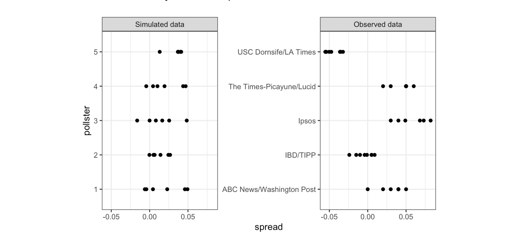

<html lang="en">

```{r setup, include=FALSE}
knitr::opts_chunk$set(
	echo = TRUE,
	message = FALSE,
	warning = FALSE
)

library(learnr) #necessary to render tutorial correctly

library(forcats)
library(ggplot2)
library(htmltools)
library(kableExtra)
library(lubridate)
library(magrittr)
library(tibble)


source("./www/datsci_helpers.R")
```

```{r, echo=FALSE}
img_path <- "./images/"
```

# datsci_04: Inference and Modeling

## Introduction and Welcome!

<div class="infobox">
  
  
  **Usage:** This tutorial accompanies the textbook [Introduction to Data Science](https://rafalab.github.io/dsbook/) by [Prof Rafael Irizarry](http://rafalab.github.io/pages/about.html). It contains material from the textbook which is offered under a [Attribution-NonCommercial-ShareAlike 4.0 International (CC BY-NC-SA 4.0)](https://creativecommons.org/licenses/by-nc-sa/4.0/). 
 
</div>

### Welcome to *Data Science: Inference and Modeling*!

We're excited to have you join us in this course, which is designed to teach you inference and modeling, two of the most widely used statistical tools in data analysis.

### Course Overview
This is the fourth in a series of courses in the Introduction to Data Science program. The courses in the program are designed to prepare you to do data analysis in `r rproj()`, from simple computations to machine learning. The courses are designed to be taken in order. A prerequisite for this course is courses 1 and 2 of the series or equivalent knowledge of basic `r rproj()` coding and data visualization. We recommend that you complete the first three courses in the series (*Data Science: `r rproj()` Basics* (datsci_01), *Data Science: Visualization* (datsci_02), and *Data Science: Probability* (datsci_03)) before taking this course.

The textbook for the Data Science course series is [freely available online](https://rafalab.github.io/dsbook/). This course corresponds to the Probability section of textbook, starting here.

This course assumes you are comfortable with basic math, algebra, and logical operations. We have some assignments in `r rproj()` that allow you to program directly in a browser-based interface. You will further have access to additional exercises to be completed on your local installation of `r rproj()`.

For in-class students enrolled in my University course, we  partnered with DataCamp for some assignments in R that allow you to program directly in a browser-based interface. There are also some assignments that require a local installation of `r rproj()`. If you are not in-class, you will need to obtain a subscription to DataCamp.

Using a combination of a guided introduction lectures and more independent in-depth exploration, you will get to practice your new `r rproj()` skills on real-life applications.

Statistical inference and modeling are indispensable for analyzing data affected by chance, and thus essential for data scientists. In this course, you will learn these key concepts through a motivating case study on election forecasting.

This course will show you how inference and modeling can be applied to develop the statistical approaches that make polls an effective tool and we'll show you how to do this using R. You will learn concepts necessary to define estimates and margins of errors and learn how you can use these to make predictions relatively well and also provide an estimate of the precision of your forecast.

Once you learn this you will be able to understand two concepts that are ubiquitous in data science: confidence intervals and p-values. 

Finally, to understand statements about the probability of a candidate winning, you will learn about Bayesian modeling. At the end of the course, we will put it all together to recreate a simplified version of an election forecast model and apply it to the 2016 US presidential election.

This course builds upon probability theory, covered in the previous course in this series (*datsci_03*).

The class notes for this course series can be found in Professor Irizarry's [freely available Introduction to Data Science book](https://rafalab.github.io/dsbook/). The textbook is also freely available in PDF format on [Leanpub](https://leanpub.com/datasciencebook).

This course corresponds to the textbook chapters [Statistical Inference](https://rafalab.github.io/dsbook/inference.html) and [Statistical Models](https://rafalab.github.io/dsbook/models.html).

### In this course, you will learn:

- The concepts necessary to define estimates and margins of errors of populations, parameters, estimates, and standard errors in order to make predictions about data
- How to use models to aggregate data from different sources
- The very basics of Bayesian statistics and predictive modeling

### Course overview

**Section 1:** Parameters and Estimates

- You will learn how to estimate population parameters.

**Section 2:** The Central Limit Theorem in Practice

- You will apply the central limit theorem to assess how close a sample estimate is to the population parameter of interest.

**Section 3:** Confidence Intervals and p-Values

- You will learn how to calculate confidence intervals and learn about the relationship between confidence intervals and p-values.

**Section 4:** Statistical Models

- You will learn about statistical models in the context of election forecasting.

**Section 5:** Bayesian Statistics

- You will learn about Bayesian statistics through looking at examples from rare disease diagnosis and baseball.

**Section 6:** Election Forecasting

- You will learn about election forecasting, building on what you've learned in the previous sections about statistical modeling and Bayesian statistics.

**Section 7:** Association Tests

- You will learn how to use association and chi-squared tests to perform inference for binary, categorical, and ordinal data through an example looking at research funding rates.


### Course Instructor

<div class="infobox">
  

**Fatih Uenal** is currenlty a Visitng Postdoctoral Researcher at the University of Cambridge, Department of Psychology, where he conducts research on the psychology of anthropocentrism and social and ecological dominance. Prior to his current position, he has worked as a postdoc at [Harvard University](https://scholar.harvard.edu/fatih-uenal/home). Together with [Prof Rafael Irizarry](http://rafalab.github.io/pages/about.html) he programmed this interactive tutorial based on the the textbook [*Introduction to Data Science*](https://rafalab.github.io/dsbook/). This interactive tutorial is developed using the `learnr` package. It has a general social scientists audience in mind and is suited for undergrad and graduate levels of study. 

Webpage: https://scholar.harvard.edu/fatih-uenal/home

</div>

---

### Essential Course Information

#### **Course Objectives**

“Data science” is a catch-all term used to describe the practice of working with and analyzing messy data sources to draw meaningful conclusions using techniques developed by computer scientists and computational statisticians. The purpose of this course is to give students who are training as quantitative social scientists a broad introduction to this skillset via the statistical programming language, `r rproj()`. You will learn how to conduct many statistical analyses such as univariate statistics (e.g., correlation, regression) in `r rproj()` that you may have already done in SPSS, Excel, or another such program. Additionally, we will build on this foundation to explore new skillsets uncommon in the social sciences, such as natural language processing, and machine learning. 

At the end of this course you will be able to:

- To answer research questions in Social Sciences (e.g., Psychology) with data

- Understand the basics of research designs in Social Sciences, and how they relate to data-analysis strategies

- Develop an intuitive, practical, and conceptual understanding of strategies for asking and answering questions with data

- To use `r rproj()`, a free and open-source statistics software program.

- Develop a basic understanding of frequently used Data Science Techniques.

- Practice your newly acquired skills with interesting, interactive, and fun projects.

**NOTE**: The schedule and procedures described in this syllabus are subject to change depending on specific needs and requirements. You will always be notified of changes on the homepage (see “last update”).


#### **Course Structure**

This is the first module in a series of a 8 week-intensive course.  and I suggest that you devote approx 10 hours a week to learning `r rproj()`, or if you are teaching graduate students, I’d recommend adopting the schedule below, which is designed for an intense but doable semester-long course, one module per week.  It is intended to take the average graduate student roughly 10 hours per week to complete all required tasks.However, some number of students will find programming to be more challenging and may take up to 15 hours per week.  Some will breeze through the material in 5.

#### **Grading**

Each Monday, lessons will be assigned from datacamp.com. Some of these lessons will be complete DataCamp courses, and others will be specific modules of courses. This will all be managed by assigning content to your (free) DataCamp account. The amount of content assigned will vary between one and two courses of content. DataCamp considers a course to be roughly 4 hours of lessons, which includes practice time. Realistically, the time you need will depend upon how intuitive you find `r rproj()` to be. For students already familiar with other programming languages and those with previous `r rproj()` experience, “8 hours” of courses is realistically closer to 2 hours; for complete novices that also find the material difficult, 8 hours is a realistic estimate. It is strongly recommended that you stretch out DataCamp lessons across the assignment period, for example, allocating 1 hour each day. You will gain the most by treating this as a foreign language immersion course by using R every day, including for your own research.
Remember that you can always go to the **Slack Group** for help. 

#### **Passing Rate**

The passing rate is 70%. 

### Installing `r rproj()` and R Studio

#### **Installing R**

If you want to install `r rproj()` to work on your own computer, you can download it freely from the [Comprehensive R Archive Network (CRAN)](https://cran.r-project.org/). Note that CRAN makes several versions of `r rproj()` available:  versions for multiple operating systems and releases older than the current one. You want to read the CRAN instructions to assure you download the correct version. If you need further help, you can try the following resources:

- [Installing `r rproj()` on Windows](https://github.com/genomicsclass/windows#installing-r)
- [Installing `r rproj()` on Mac](http://youtu.be/Icawuhf0Yqo)
- [Installing `r rproj()` on Ubuntu](https://cran.r-project.org/bin/linux/ubuntu/README)

#### **Installing RStudio**

RStudio is an integrated development environment (IDE). We highly recommend installing and using RStudio to edit and test your code. You can install RStudio through the [RStudio website](https://www.rstudio.com/products/rstudio/download/). Their [cheatsheet](https://www.rstudio.com/wp-content/uploads/2016/01/rstudio-IDE-cheatsheet.pdf) is a great resource.  You need to install `r rproj()` first.

### Pre-Course Survey

Insert Survey Link here

*If you cannot see the survey above, click this link to access it in a new window.*

## Introduction to Inference

<div class="infobox">
  
**Textbook link** The contents are discussed within the [textbook section - 15 Statistical Inference](https://rafalab.github.io/dsbook/inference.html).
  
</div>

--- 

In this module we will describe, in some detail, how poll aggregators such as FiveThirtyEight use data to predict election outcomes. To understand how they do this, we first need to learn the basics of _Statistical Inference_, the part of statistics that helps distinguish patterns arising from signal from those arising from chance. Statistical inference is a broad topic and here we go over the very basics using polls as a motivating example. To describe the concepts, we complement the mathematical formulas with Monte Carlo simulations and R code.   

### Polls

Opinion polling has been conducted since the 19th century. The general goal is to describe the opinions held by a specific population on a given set of topics. In recent times, these polls have been pervasive during presidential elections. Polls are useful when interviewing every member of a particular population is logistically impossible. The general strategy is to interview a smaller group, chosen at random, and then infer the opinions of the entire population from the opinions of the smaller group. Statistical theory is used to justify the process. This theory is referred to as  _inference_ and it is the main topic of this section.

Perhaps the best known opinion polls are those conducted to determine which candidate is preferred by voters in a given election. Political strategists make extensive use of polls to decide, among other things, how to invest resources. For example, they may want to know in which geographical locations to focus their "get out the vote" efforts. 

Elections are a particularly interesting case of opinion polls because the actual opinion of the entire population is revealed on election day. Of course, it costs millions of dollars to run an actual election which makes polling a cost effective strategy for those that want to forecast the results. 

Although typically the results of these polls are kept private, similar polls are conducted by news organizations because results tend to be of interest to the general public and made public. We will eventually be looking at such data.

Real [Clear Politics](http://www.realclearpolitics.com) is an example of a news aggregator that organizes and publishes poll results. For example, they present the following poll results reporting estimates of the popular vote for the [2016 presidential election](http://www.realclearpolitics.com/epolls/2016/president/us/general_election_trump_vs_clinton-5491.html):

```{r, echo=FALSE, message=FALSE, warning=FALSE}
#knitr::include_graphics(file.path(img_path,"rcp-polls.png"))
url <- "https://www.realclearpolitics.com/epolls/2016/president/us/general_election_trump_vs_clinton-5491.html"
library(rvest)
library(tidyverse)
tab <- read_html(url) %>% html_node("table") %>% html_table()
tab <- tab %>% mutate(Poll = stringr::str_remove(Poll, "\\/.*")) %>%
  mutate(Poll = case_when(
    Poll == "BloombergBloomberg" ~ "Bloomberg",
    Poll == "FOX NewsFOX News" ~ "FOX News",
    Poll == "MonmouthMonmouth"  ~ "Monmouth",  
    Poll == "CBS NewsCBS News" ~ "CBS News",
    TRUE ~ Poll))
names(tab) <- stringr::str_remove_all(names(tab), "\\s(.*)")    
if(knitr::is_html_output()){
  knitr::kable(tab, "html") %>%
    kableExtra::kable_styling(bootstrap_options = "striped", full_width = FALSE)
} else{
  knitr::kable(tab, "latex", booktabs = TRUE) %>%
    kableExtra::kable_styling(font_size = 8)
}
```

<!-- (Source: [Real Clear Politics](https://www.realclearpolitics.com/epolls/2016/president/us/general_election_trump_vs_clinton-5491.html)) -->

Although in the United States the popular vote does not determine the result of the presidential election, we will use it as an illustrative and simple example of how well polls work. Forecasting the election is a more complex process since it involves combining results from 50 states and DC and we describe it in the textbook [(Section - 16.8 Case study: election forecasting)](https://rafalab.github.io/dsbook/models.html#election-forecasting).

Let's make some observations about the table above. First, note that different polls, all taken days before the election, report a different _spread_:  the estimated difference between support for the two candidates. Notice also that the reported spreads hover around what ended up being the actual result: Clinton won the popular vote by 2.1%. We also see a column titled **MoE** which stands for _margin of error_. 

In this section, we will show how the probability concepts we learned in the previous section can be applied to develop the statistical approaches that make polls an effective tool. We will learn the statistical concepts necessary to define _estimates_ and _margins of errors_, and show how we can use these to forecast final results relatively well and also provide an estimate of the precision of our forecast. Once we learn this, we will be able to understand two concepts that are ubiquitous in data science: _confidence intervals_ and _p-values_. Finally, to understand probabilistic statements about the probability of a candidate winning, we will have to learn about Bayesian modeling. In the final sections, we put it all together to recreate the simplified version of the FiveThirtyEight model and apply it to the 2016 election. 

We start by connecting probability theory to the task of using polls to learn about a population.


#### **Course overview**

In this course, we will learn:

- *statistical inference*, the process of deducing characteristics of a population using data from a random sample

- the statistical concepts necessary to define *estimates* and *margins of errors*

- how to *forecast future results* and estimate the precision of our forecast

- how to calculate and interpret *confidence intervals* and *p-values*


---

<div class="infobox">
   
  
**Key points:** 

---

- Information gathered from a small random sample can be used to infer characteristics of the entire population.
    
- Opinion polls are useful when asking everyone in the population is impossible.

- A common use for opinion polls is determining voter preferences in political elections for the purposes of forecasting election results.
    
- The spread of a poll is the estimated difference between support two candidates or options.


</div>


## Section 1: Parameters and Estimates

Section 1 introduces you to parameters and estimates.

After completing Section 1, you will be able to:

- Understand how to use a sampling model to perform a poll.

- Explain the terms **population, parameter**, and **sample** as they relate to statistical inference.

- Use a sample to estimate the population proportion from the sample average.

- Calculate the expected value and standard error of the sample average. 

There is 1 assignments for you to practice your coding skills. 

We encourage you to use `r rproj()` to interactively test out your answers and further your learning.


### 1. Sampling Model Parameters and Estimates


To help us understand the connection between polls and what we have learned, let's construct a similar situation to the one pollsters face. To mimic the challenge real pollsters face in terms of competing with other pollsters for media attention, we will use an urn full of beads to represent  voters and pretend we are competing for a \$25 dollar prize. The challenge is to guess the spread between the proportion of blue and red beads in this urn (in this case, a pickle jar):


```{r, echo=FALSE, out.width=300}
#, out.width="1.5in"}
knitr::include_graphics(file.path(img_path, "urn.jpg"))
```

Before making a prediction, you can take a sample (with replacement) from the urn. To mimic the fact that running polls is expensive, it costs you \$0.10 per each bead you sample. Therefore, if your sample size is 250, and you win, you will break even since you will pay \$25 to collect your \$25 prize. Your entry into the competition can be an interval. If the interval you submit contains the true proportion, you get half what you paid and pass to the second phase of the competition. In the second phase, the entry with the smallest interval is selected as the winner. 

The __dslabs__ package includes a function that shows a random draw from this urn:

```{r, eval=FALSE}
library(tidyverse)
library(dslabs)
take_poll(25)
```

```{r first-simulated-poll, message=FALSE, warning=FALSE, echo=FALSE}
set.seed(1)
library(tidyverse)
library(dslabs)
rafalib::mypar()
take_poll(25)
```

Think about how you would construct your interval based on the data shown above. 

We have just described a simple sampling model for opinion polls. The beads inside the urn represent the individuals that will vote on election day. Those that will vote for the Republican candidate are represented with red beads and the Democrats with the blue beads. For simplicity, assume there are no other colors. That is, that there are just two parties: Republican and Democratic. 

### Populations, samples, parameters, and estimates

We want to predict the proportion of blue beads in the urn. Let's call this quantity $p$, which then tells us the proportion of red beads $1-p$, and the spread $p - (1-p)$, which simplifies to $2p - 1$. 

In statistical textbooks, the beads in the urn are called the _population_. The proportion of blue beads in the population $p$  is called a _parameter_. The 25 beads we see in the previous plot are called a _sample_. The task of statistical inference is to predict the parameter $p$ using the observed data in the sample. 

Can we do this with the 25 observations above? It is certainly informative. For example, given that we see 13 red and 12 blue beads, it is unlikely that $p$ > .9 or $p$ < .1. But are we ready to predict with certainty that there are more red beads than blue in the jar?  

We want to construct an estimate of $p$ using only the information we observe. An estimate should be thought of as a summary of the observed data that we think is informative about the parameter of interest. It seems intuitive to think that the proportion of blue beads in the sample $0.48$ must be at least related to the actual proportion $p$. But do we simply predict $p$ to be 0.48? First, remember that the sample proportion is a random variable. If we run the command `take_poll(25)` four times, we get a different answer each time, since the sample proportion is a random variable. 


```{r four-simulated-polls, echo=FALSE}
par(mfrow=c(2,2), mar = c(3, 1, 3, 0), mgp = c(1.5, 0.5, 0)) 
take_poll(25); take_poll(25); take_poll(25); take_poll(25)
```

 
Note that in the four random samples shown above, the sample proportions range from 0.44 to 0.60. By describing the distribution of this random variable, we will be able to gain insights into how good this estimate is and how we can make it better.


---

<div class="infobox">
   
  
**Key points:** 

---

- The task of statistical inference is to estimate an unknown population parameter using observed data from a sample.

- In a sampling model, the collection of elements in the urn is called the *population.*

- A *parameter* is a number that summarizes data for an entire population.

- A *sample* is observed data from a subset of the population.

- An *estimate* is a summary of the observed data about a parameter that we believe is informative. It is a data-driven guess of the population parameter.

- We want to predict the proportion of the blue beads in the urn, the parameter 𝑝. The proportion of red beads in the urn is 1 − 𝑝 and the spread is 2𝑝 − 1.

- The sample proportion is a random variable. Sampling gives random results drawn from the population distribution.


</div>


### The Sample Average


Conducting an opinion poll is being modeled as taking a random sample from an urn. We are proposing the use of the proportion of blue beads in our sample as an _estimate_ of the parameter $p$. Once we have this estimate, we can easily report an estimate for the spread $2p-1$, but for simplicity we will illustrate the concepts for estimating $p$. We will use our knowledge of probability to defend our use of the sample proportion and quantify how close we think it is from the population proportion $p$.

We start by defining the random variable $X$ as: $X=1$ if we pick a blue bead at random and $X=0$ if it is red. This implies that the population is a list of 0s and 1s. If we sample $N$ beads, then the average of the draws $X_1, \dots, X_N$ is equivalent to the proportion of blue beads in our sample. This is because adding the $X$s is equivalent to counting the blue beads and dividing this count by the total $N$ is equivalent to computing a proportion. We use the symbol $\bar{X}$ to represent this average. In general, in statistics textbooks a bar on top of a symbol means the average. The theory we just learned about the sum of draws becomes useful because the average is a sum of draws multiplied by the constant $1/N$:

$$\bar{X} = 1/N \times \sum_{i=1}^N X_i$$

For simplicity, let's assume that the draws are independent: after we see each sampled bead, we return it to the urn. In this case, what do we know about the distribution of the sum of draws? First, we know that the expected value of the sum of draws is $N$ times the average of the values in the urn. We know that the average of the 0s and 1s in the urn must be $p$, the proportion of blue beads.

Here we encounter an important difference with what we did in the Probability section: we don't know what is in the urn. We know there are blue and red beads, but we don't know how many of each. This is what we want to find out: we are trying to **estimate** $p$. 

### Parameters

Just like we use variables to define unknowns in systems of equations, in statistical inference we define _parameters_ to define unknown parts of our models. In the urn model which we are using to mimic an opinion poll, we do not know the proportion of blue beads in the urn. We define the parameters $p$ to represent this quantity. $p$ is the average of the urn because if we take the average of the 1s (blue) and 0s (red), we get the proportion of blue beads. Since our main goal is figuring out what is $p$, we are going to _estimate this parameter_. 

The ideas presented here on how we estimate parameters, and provide insights into how good these estimates are, extrapolate to many data science tasks. For example, we may want to determine the difference in health improvement between patients receiving treatment and a control group. We may ask, what are the health effects of smoking on a population? What are the differences in racial groups of fatal shootings by police? What is the rate of change in life expectancy in the US during the last 10 years? All these questions can be framed as a task of estimating a parameter from a sample.


---

<div class="infobox">
   
  
**Key points:** 

---

- Many common data science tasks can be framed as estimating a parameter from a sample.

- We illustrate statistical inference by walking through the process to estimate 𝑝. From the estimate of 𝑝, we can easily calculate an estimate of the spread, 2𝑝−1.

- Consider the random variable 𝑋 that is 1 if a blue bead is chosen and 0 if a red bead is chosen. The proportion of blue beads in 𝑁 draws is the average of the draws 𝑋1,...,𝑋𝑁.

$$\bar{X} = \frac{X_1 + X_2 + \dots + X_N}{N}$$
</div>


### Polling versus Forecasting

Before we continue, let's make an important clarification related to the practical problem of forecasting the election. If a poll is conducted four months before the election, it is estimating the $p$ for that moment and not for election day. The $p$ for election night might be different since people's opinions fluctuate through time. The polls provided the night before the election tend to be the most accurate since opinions don't change that much in a day. However, forecasters try to build tools that model how opinions vary across time and try to predict the election night results taking into consideration the fact that opinions fluctuate. We will describe some approaches for doing this in a later section. 


### Properties of Our Estimate

To understand how good our estimate is, we will describe the statistical properties of the random variable defined above: the sample proportion $\bar{X}$. Remember that $\bar{X}$ is the sum of independent draws so the rules we covered in the probability section apply.

Using what we have learned, the expected value of the sum $N\bar{X}$ is $N \times$ the average of the urn, $p$. So dividing by the non-random constant $N$ gives us that the expected value of the average $\bar{X}$ is $p$. We can write it using our mathematical notation:

$$
\mbox{E}(\bar{X}) = p
$$

We can also use what we learned to figure out the standard error: the standard error of the sum is $\sqrt{N} \times$ the standard deviation of the urn. Can we compute the standard error of the urn? We learned a formula that tells us that it is $(1-0) \sqrt{p (1-p)}$ = $\sqrt{p (1-p)}$. Because we are dividing the sum by $N$, we arrive at the following formula for the standard error of the average:

$$
\mbox{SE}(\bar{X}) = \sqrt{p(1-p)/N}
$$

This result reveals the power of polls. The expected value of the sample proportion $\bar{X}$ is the parameter of interest $p$ and we can make the standard error as small as we want by increasing $N$. The law of large numbers tells us that with a large enough poll, our estimate converges to $p$.

If we take a large enough poll to make our standard error about 1%, we will be quite certain about who will win. But how large does the poll have to be for the standard error to be this small? 

One problem is that we do not know $p$, so we can't compute the standard error. However, for illustrative purposes, let's assume that $p=0.51$ and make a plot of the standard error versus the sample size $N$: 

```{r standard-error-versus-sample-size, echo=FALSE, message=FALSE, warning=FALSE}
p <- 0.51
N <- 10^seq(1,5, len=100)
data.frame(N=N, SE = sqrt(p*(1-p)/N)) %>% ggplot(aes(N, SE)) + geom_line() + scale_x_continuous(breaks = c(10,100,1000,10000), trans = "log10")
```

From the plot we see that we would need a poll of over 10,000 people to get the standard error that low. We rarely see polls of this size due in part to costs. From the Real Clear Politics table, we learn that the sample sizes in opinion polls range from 500-3,500 people. For a sample size of 1,000 and $p=0.51$, the standard error is:
```{r}
sqrt(p*(1-p))/sqrt(1000)
```

or 1.5 percentage points. So even with large polls, for close elections, $\bar{X}$ can lead us astray if we don't realize it is a random variable. Nonetheless, we can actually say more about how close we get the $p$ and we do that in the textbook [(Section - 15.4 Central Limit Theorem in practice)](https://rafalab.github.io/dsbook/inference.html#clt).


---

<div class="infobox">
   
  
**Key points:** 

---

- When interpreting values of $\bar{X}$, it is important to remember that $\bar{X}$ is a random variable with an expected value and standard error that represents the sample proportion of positive events.

- The expected value of $\bar{X}$ is the parameter of interest 𝑝. This follows from the fact that $\bar{X}$ is the sum of independent draws of a random variable times a constant 1/𝑁.

$$E(\bar{X}) = p$$

- As the number of draws 𝑁 increases, the standard error of our estimate $\bar{X}$ decreases. The standard error of the average of $\bar{X}$ over 𝑁 draws is:

$$
SE(\bar{X}) =  \sqrt{p(1-p)/N}
$$

  - In theory, we can get more accurate estimates of 𝑝 by increasing 𝑁. In practice, there are limits on the size of 𝑁 due to costs, as well as other factors we discuss later.
    
  - We can also use other random variable equations to determine the expected value of the sum of draws E(𝑆) and standard error of the sum of draws SE(𝑆).

$$E(S) = Np$$

$$
SE(S) =  \sqrt{Np(1-p)}
$$

</div>


### 1.1 Assessment: Parameters and Estimates

Insert assessment here


## Section 2: The Central Limit Theorem in Practice

In Section 2, you will look at the Central Limit Theorem in practice.

After completing Section 2, you will be able to:

- Use the Central Limit Theorem to calculate the probability that a sample estimate $\bar{X}$ is close to the population proportion 𝑝.

- Run a Monte Carlo simulation to corroborate theoretical results built using probability theory.

- Estimate the spread based on estimates of $\bar{X}$ and $\hat{\mbox{SE}}(\bar{X})$.

- Understand why bias can mean that larger sample sizes aren't necessarily better.


There is 1 assignment for you to practice your coding skills.

We encourage you to use `r rproj()` to interactively test out your answers and further your learning.


### 2. The Central Limit Theorem in Practice


The CLT tells us that the distribution function for a sum of draws is approximately normal. We also learned that dividing a normally distributed random variable by a constant is also a normally distributed variable. This implies that the distribution of $\bar{X}$ is approximately normal. 

In summary, we have that $\bar{X}$ has an approximately normal distribution with expected value $p$ and standard error $\sqrt{p(1-p)/N}$. 

Now how does this help us? Suppose we want to know what is the probability that we are within 1% from $p$. We are basically asking what is

$$
\mbox{Pr}(| \bar{X} - p| \leq .01)
$$
which is the same as:

$$
\mbox{Pr}(\bar{X}\leq p + .01) - \mbox{Pr}(\bar{X} \leq p - .01)
$$

Can we answer this question?  We can use the mathematical trick we learned in the previous section. Subtract the expected value and divide by the standard error to get a standard normal random variable, call it $Z$, on the left. Since $p$ is the expected value and $\mbox{SE}(\bar{X}) = \sqrt{p(1-p)/N}$ is the standard error we get:

$$
\mbox{Pr}\left(Z \leq \frac{ \,.01} {\mbox{SE}(\bar{X})} \right) -
\mbox{Pr}\left(Z \leq - \frac{ \,.01} {\mbox{SE}(\bar{X})} \right) 
$$

One problem we have is that since we don't know $p$, we don't know $\mbox{SE}(\bar{X})$. But it turns out that the CLT still works if we estimate the standard error by using $\bar{X}$ in place of $p$. We say that we _plug-in_ the estimate. Our estimate of the standard error is therefore:

$$
\hat{\mbox{SE}}(\bar{X})=\sqrt{\bar{X}(1-\bar{X})/N}
$$
In statistics textbooks, we use a little hat to denote estimates. The estimate can be constructed using the observed data and $N$. 

Now we continue with our calculation, but dividing by $\hat{\mbox{SE}}(\bar{X})=\sqrt{\bar{X}(1-\bar{X})/N})$ instead. In our first sample we had 12 blue and 13 red so $\bar{X} = 0.48$ and our estimate of standard error is: 

```{r}
x_hat <- 0.48
se <- sqrt(x_hat*(1-x_hat)/25)
se
```

And now we can answer the question of the probability of being close to $p$. The answer is:

```{r}
pnorm(0.01/se) - pnorm(-0.01/se)
```

Therefore, there is a small chance that we will be close.


---

<div class="infobox">
   
  
**Key points:** 

---


- Because $\bar{X}$ is the sum of random draws divided by a constant, the distribution of $\bar{X}$ is approximately normal.

- We can convert $\bar{X}$ to a standard normal random variable 𝑍: 
$$
𝑍 = \frac{\bar{X}−E(\bar{X})}{SE(\bar{X})}
$$

- The probability that $\bar{X}$ is within .01 of the actual value of 𝑝 is:
$$
\mbox{Pr}\left(Z \leq \, .01/\,\sqrt{p(1-p)}  / N \right) -
\mbox{Pr}\left(Z \leq \, -.01/\,\sqrt{p(1-p)}  / N \right) 
$$

- The Central Limit Theorem (CLT) still works if $\bar{X}$ is used in place of 𝑝. This is called a plug-in estimate. Hats over values denote estimates. Therefore:

$$
\hat{\mbox{SE}}(\bar{X})=\sqrt{\bar{X}(1-\bar{X})/N}
$$

- Using the CLT, the probability that $\bar{X}$ is within .01 of the actual value of 𝑝 is:

$$
\mbox{Pr}\left(Z \leq \, .01/\,\sqrt{\bar{X}(1-\bar{X})}  / N \right) -
\mbox{Pr}\left(Z \leq \, -.01/\,\sqrt{\bar{X}(1-\bar{X})}  / N \right) 
$$

</div>


### 2. Margin of Error

A poll of only $N=25$ people is not really very useful, at least not for a close election. 

Earlier we mentioned the _margin of error_. Now we can define it because it is simply two times the standard error, which we can now estimate. In our case it is:

```{r}
1.96*se
```

Why do we multiply by 1.96? Because if you ask what is the probability that we are within 1.96 standard errors from $p$, we get:

$$
\mbox{Pr}\left(Z \leq \, 1.96\,\mbox{SE}(\bar{X})  / \mbox{SE}(\bar{X}) \right) -
\mbox{Pr}\left(Z \leq - 1.96\, \mbox{SE}(\bar{X}) / \mbox{SE}(\bar{X}) \right) 
$$
which is:

$$
\mbox{Pr}\left(Z \leq 1.96 \right) -
\mbox{Pr}\left(Z \leq - 1.96\right) 
$$

which we know is about 95\%:

```{r}
pnorm(1.96)-pnorm(-1.96)
```

Hence, there is a 95% probability that $\bar{X}$ will be within $1.96\times \hat{SE}(\bar{X})$, in our case within about `r round(1.96*se, 2)`, of $p$. Note that 95% is somewhat of an arbitrary choice and sometimes other percentages are used, but it is the most commonly used value to define margin of error. We often round 1.96 up to 2 for simplicity of presentation.

In summary, the CLT tells us that our poll based on a sample size of $25$ is not very useful. We don't really learn much when the margin of error is this large. All we can really say is that the popular vote will not be won by a large margin. This is why pollsters tend to use larger sample sizes. 

From the table above, we see that typical sample sizes range from 700 to 3500. To see how this gives us a much more practical result, notice that if we had obtained a $\bar{X}$ = 0.48 with a sample size of 2,000, our standard error $\hat{\mbox{SE}}(\bar{X})$ would have been `r n<-2000;se<-sqrt(0.48*(1-0.48)/n);se`. So our result is an estimate of `48`% with a margin of error of `r round(2*se*100)`%. In this case, the result is much more informative and would make us think that there are more red balls than blue. Keep in mind, however, that this is hypothetical. We did not take a poll of 2,000 since we don't want to ruin the competition.


---

<div class="infobox">
   
  
**Key points:** 

---


- The *margin of error* is defined as 2 times the standard error of the estimate $\bar{X}$.

- There is about a 95% chance that $\bar{X}$ will be within two standard errors of the actual parameter 𝑝.


</div>


### 2. A Monte Carlo Simulation for the CLT

Suppose we want to use a Monte Carlo simulation to corroborate the tools we have built using probability theory. To create the simulation, we would write code like this:

```{r, eval=FALSE}
B <- 10000
N <- 1000
x_hat <- replicate(B, {
  x <- sample(c(0,1), size = N, replace = TRUE, prob = c(1-p, p))
  mean(x)
})
```

The problem is, of course, we don't know `p`. We could construct an urn like the one pictured above and run an analog (without a computer) simulation. It would take a long time, but you could take 10,000 samples, count the beads and keep track of the proportions of blue. We can use the function `take_poll(n=1000)` instead of drawing from an actual urn, but it would still take time to count the beads and enter the results.

One thing we therefore do to corroborate theoretical results is to pick one or several values of `p` and run the simulations.  Let's set `p=0.45`.  We can then simulate a poll:

```{r}
p <- 0.45
N <- 1000

x <- sample(c(0,1), size = N, replace = TRUE, prob = c(1-p, p))
x_hat <- mean(x)
```

In this particular sample, our estimate is `x_hat`. We can use that code to do a Monte Carlo simulation:

```{r}
B <- 10000
x_hat <- replicate(B, {
  x <- sample(c(0,1), size = N, replace = TRUE, prob = c(1-p, p))
  mean(x)
})
```

To review, the theory tells us that $\bar{X}$ is approximately normally distributed, has expected value $p=$ `r p` and standard error $\sqrt{p(1-p)/N}$ = `r sqrt(p*(1-p)/N)`. The simulation confirms this:

```{r}
mean(x_hat)
sd(x_hat)
```

A histogram and qq-plot confirm that the normal approximation is accurate as well:

```{r normal-approximation-for-polls, echo=FALSE, warning=FALSE, message=FALSE, out.width="100%", fig.height=3}
library(tidyverse)
library(gridExtra)
p1 <- data.frame(x_hat=x_hat) %>% 
  ggplot(aes(x_hat)) + 
  geom_histogram(binwidth = 0.005, color="black")
p2 <-  data.frame(x_hat=x_hat) %>% 
  ggplot(aes(sample=x_hat)) + 
  stat_qq(dparams = list(mean=mean(x_hat), sd=sd(x_hat))) +
  geom_abline() + 
  ylab("x_hat") + 
  xlab("Theoretical normal")
grid.arrange(p1,p2, nrow=1)
```

Of course, in real life we would never be able to run such an experiment because we don't know $p$. But we could run it for various values of $p$ and $N$ and see that the theory does indeed work well for most values. You can easily do this by re-running the code above after changing `p` and `N`.


---

<div class="infobox">
   
  
**Key points:** 

---


- We can run Monte Carlo simulations to compare with theoretical results assuming a value of 𝑝.

- In practice, 𝑝 is unknown. We can corroborate theoretical results by running Monte Carlo simulations with one or several values of 𝑝.
    
- One practical choice for 𝑝 when modeling is $\bar{X}$, the observed value of $\bar{X}$  in a sample.


</div>


### 2. The Spread


The competition is to predict the spread, not the proportion $p$. However, because we are assuming there are only two parties, we know that the spread is $p - (1-p) = 2p - 1$.  As a result, everything we have done can easily be adapted to an estimate of $2p - 1$. Once we have our estimate $\bar{X}$ and $\hat{\mbox{SE}}(\bar{X})$, we estimate the spread with $2\bar{X} - 1$ and, since we are multiplying by 2, the standard error is $2\hat{\mbox{SE}}(\bar{X})$. Note that subtracting 1 does not add any variability so it does not affect the standard error. 

For our 25 item sample above, our estimate $p$ is `.48` with margin of error `.20` and our estimate of the spread is `0.04` with margin of error `.40`. Again, not a very useful sample size. However, the point is that once we have an estimate and standard error for $p$, we have it for the spread $2p-1$.


### 2. Bias: Why Not Run a Very Large Poll?


For realistic values of $p$, say from 0.35 to 0.65, if we run a very large poll with 100,000 people, theory tells us that we would predict the election perfectly since the largest possible margin of error is around 0.3\%:

```{r standard-error-versus-p, echo=FALSE}
N <- 100000
p <- seq(0.35, 0.65, length = 100)
SE <- sapply(p, function(x) 2*sqrt(x*(1-x)/N))
qplot(p, SE, geom = "line")
``` 

One reason is that running such a poll is very expensive. Another possibly more important reason is that theory has its limitations. Polling is much more complicated than picking beads from an urn. Some people might lie to pollsters and others might not have phones. But perhaps the most important way an actual poll differs from an urn model is that we actually don't know for sure who is in our population and who is not. How do we know who is going to vote? Are we reaching all possible voters? Hence, even if our margin of error is very small, it might not be exactly right that our expected value is $p$. We call this bias. Historically, we observe that polls are indeed biased, although not by that much. The typical bias appears to be about 1-2%. This makes election forecasting a bit more interesting and we will talk about how to model this in a later section.


---

<div class="infobox">
   
  
**Key points:** 

---

- An extremely large poll would theoretically be able to predict election results almost perfectly.

- These sample sizes are not practical. In addition to cost concerns, polling doesn't reach everyone in the population (eventual voters) with equal probability, and it also may include data from outside our population (people who will not end up voting).

- These systematic errors in polling are called bias. We will learn more about bias in the future.


</div>


### 2.1 Assessment: Introduction to Inference

Insert assessment here


## Section 3: Confidence Intervals and p-Values


In Section 3, you will look at confidence intervals and p-values.

After completing Section 3, you will be able to:

- Calculate confidence intervals of difference sizes around an estimate.

- Understand that a confidence interval is a random interval with the given probability of falling on top of the parameter.

- Explain the concept of "power" as it relates to inference.

- Understand the relationship between p-values and confidence intervals and explain why reporting confidence intervals is often preferable.

There is 1 assignment for you to practice your coding skills.

We encourage you to use `r rproj()` to interactively test out your answers and further your learning.


### 3. Confidence Intervals


Confidence intervals are a very useful concept widely employed by data analysts. A version of these that are commonly seen come from the `ggplot` geometry `geom_smooth`. Here is an example using a temperature dataset available in R:

```{r first-confidence-intervals-example, warning=FALSE, message=FALSE, echo=FALSE}
library(tidyverse)
data("nhtemp")
data.frame(year = as.numeric(time(nhtemp)), temperature=as.numeric(nhtemp)) %>%
  ggplot(aes(year, temperature)) + 
  geom_point() + 
  geom_smooth() + 
  ggtitle("Average Yearly Temperatures in New Haven")
```


In the Machine Learning part we will learn how the curve is formed, but for now consider the shaded area around the curve. This is created using the concept of confidence intervals.

In our earlier competition, you were asked to give an interval. If the interval you submitted includes the $p$, you get half the money you spent on your "poll" back and pass to the next stage of the competition. One way to pass to the second round is to report a very large interval. For example, the interval $[0,1]$ is guaranteed to include $p$. However, with an interval this big, we have no chance of winning the competition. Similarly, if you are an election forecaster and predict the spread will be between -100% and 100%, you will be ridiculed for stating the obvious. Even a smaller interval, such as saying the spread will be between -10 and 10%, will not be considered serious. 

On the other hand, the smaller the interval we report, the smaller our chances are of winning the prize. Likewise, a bold pollster that reports very small intervals and misses the mark most of the time will not be considered a good pollster. We want to be somewhere in between.

We can use the statistical theory we have learned to compute the probability of any given interval including $p$.  If we are asked to create an interval with, say, a 95\% chance of including $p$, we can do that as well. These are called 95\% confidence intervals.

When a pollster reports an estimate and a margin of error, they are, in a way, reporting a 95\% confidence interval. Let's show how this works mathematically. 

We want to know the probability that the interval $[\bar{X} - 2\hat{\mbox{SE}}(\bar{X}), \bar{X} + 2\hat{\mbox{SE}}(\bar{X})]$ contains the true proportion $p$. First, consider that the start and end of these intervals are random variables: every time we take a sample, they change. To illustrate this, run the Monte Carlo simulation above twice. We use the same parameters as above:

```{r}
p <- 0.45
N <- 1000
```

And notice that the interval here:

```{r}
x <- sample(c(0, 1), size = N, replace = TRUE, prob = c(1-p, p))
x_hat <- mean(x)
se_hat <- sqrt(x_hat * (1 - x_hat) / N)
c(x_hat - 1.96 * se_hat, x_hat + 1.96 * se_hat)
```

is different from this one:

```{r}
x <- sample(c(0,1), size=N, replace=TRUE, prob=c(1-p, p))
x_hat <- mean(x)
se_hat <- sqrt(x_hat * (1 - x_hat) / N)
c(x_hat - 1.96 * se_hat, x_hat + 1.96 * se_hat)
```

Keep sampling and creating intervals and you will see the random variation.

To determine the probability that the interval includes $p$, we need to compute this:
$$
\mbox{Pr}\left(\bar{X} - 1.96\hat{\mbox{SE}}(\bar{X}) \leq p \leq \bar{X} + 1.96\hat{\mbox{SE}}(\bar{X})\right)
$$

By subtracting and dividing the same quantities in all parts of the equation, we
get that the above is equivalent to:
 
$$
\mbox{Pr}\left(-1.96 \leq \frac{\bar{X}- p}{\hat{\mbox{SE}}(\bar{X})} \leq  1.96\right)
$$

 
The term in the middle is an approximately normal random variable with expected value 0 and standard error 1, which we have been denoting with $Z$, so we have:

$$
\mbox{Pr}\left(-1.96 \leq Z \leq  1.96\right)
$$

which we can quickly compute using :

```{r}
pnorm(1.96) - pnorm(-1.96)
```

proving that we have a 95\% probability. 

If we want to have a larger probability, say 99\%, we need to multiply by whatever `z` satisfies the following:


$$
\mbox{Pr}\left(-z \leq Z \leq  z\right) = 0.99
$$

Using:

```{r}
z <- qnorm(0.995)
z
```

will achieve this because by definition `pnorm(qnorm(0.995))` is 0.995 and by symmetry `pnorm(1-qnorm(0.995))` is 1 - 0.995.  As a consequence, we have that:


```{r}
pnorm(z) - pnorm(-z)
```

is `0.995 - 0.005 = 0.99`. We can use this approach for any proportion $p$: we set `z = qnorm(1 - (1 - p)/2)` because $1 - (1 - p)/2 + (1 - p)/2 = p$. 

So, for example, for $p=0.95$, $1 - (1-p)/2 = 0.975$  and we get the 1.96 we have been using:

```{r}
qnorm(0.975)
```


---

<div class="infobox">
   
  
**Key points:** 

---


- We can use statistical theory to compute the probability that a given interval contains the true parameter 𝑝.

- 95% confidence intervals are intervals constructed to have a 95% chance of including 𝑝. The margin of error is approximately a 95% confidence interval.

- The start and end of these confidence intervals are random variables.

- To calculate any size confidence interval, we need to calculate the value 𝑧 for which
$\mbox{Pr}\left(-z \leq Z \leq  z\right)$ equals the desired confidence. For example, a 99% confidence interval requires calculating 𝑧 for $$\mbox{Pr}\left(-z \leq Z \leq  z\right) = 0.99$$.

- For a confidence interval of size 𝑞, we solve for $𝑧= 1−\frac{1−𝑞}{2}$.

- To determine a 95% confidence interval, use `z <- qnorm(0.975)`. This value is slightly smaller than 2 times the standard error.


</div>


### 3. A Monte Carlo Simulation for Confidence Intervals


We can run a Monte Carlo simulation to confirm that, in fact, a 95\% confidence interval includes $p$ 95\% of the time.

```{r, echo=FALSE}
set.seed(1)
```

```{r}
N <- 1000
B <- 10000
inside <- replicate(B, {
  x <- sample(c(0,1), size = N, replace = TRUE, prob = c(1-p, p))
  x_hat <- mean(x)
  se_hat <- sqrt(x_hat * (1 - x_hat) / N)
  between(p, x_hat - 1.96 * se_hat, x_hat + 1.96 * se_hat)
})
mean(inside)
```


The following plot shows the first 100 confidence intervals. In this case, we created the simulation so the black line denotes the parameter we are trying to estimate:

```{r confidence-interval-coverage, message=FALSE, echo=FALSE, fig.height=6}
set.seed(1)
tab <- replicate(100, {
  x <- sample(c(0,1), size = N, replace = TRUE, prob = c(1-p, p))
  x_hat <- mean(x)
  se_hat <- sqrt(x_hat * (1 - x_hat) / N)
  hit <- between(p, x_hat - 1.96 * se_hat, x_hat + 1.96 * se_hat)
  c(x_hat, x_hat - 1.96 * se_hat, x_hat + 2 * se_hat, hit)
})

tab <- data.frame(poll=1:ncol(tab), t(tab))
names(tab)<-c("poll", "estimate", "low", "high", "hit")
tab <- mutate(tab, p_inside = ifelse(hit, "Yes", "No") )
ggplot(tab, aes(poll, estimate, ymin=low, ymax=high, col = p_inside)) + 
  geom_point()+
  geom_errorbar() + 
  coord_flip() + 
  geom_hline(yintercept = p)
```


---

<div class="infobox">
   
  
**Key points:** 

---


- We can run a Monte Carlo simulation to confirm that a 95% confidence interval contains the true value of 𝑝 95% of the time.

- A plot of confidence intervals from this simulation demonstrates that most intervals include 𝑝, but roughly 5% of intervals miss the true value of 𝑝.


</div>


### 3. The Correct Language


When using the theory we described above, it is important to remember that it is the intervals that are random, not $p$. In the plot above, we can see the random intervals moving around and $p$, represented with the vertical line, staying in the same place. The proportion of blue in the urn $p$ is not. So the 95\% relates to the probability that this random interval falls on top of $p$. Saying the $p$ has a 95\% chance of being between this and that is technically an incorrect statement because $p$ is not random. 


---

<div class="infobox">
   
  
**Key points:** 

---


- The 95% confidence intervals are random, but 𝑝 is not random.

- 95% refers to the probability that the random interval falls on top of 𝑝.

- It is technically incorrect to state that 𝑝 has a 95% chance of being in between two values because that implies 𝑝 is random.


</div>


### 3. Power


Pollsters are not successful at providing correct confidence intervals, but rather at predicting who will win. When we took a 25 bead sample size, the confidence interval for the spread:

```{r}
N <- 25
x_hat <- 0.48
(2 * x_hat - 1) + c(-1.96, 1.96) * 2 * sqrt(x_hat * (1 - x_hat) / N)
```

includes 0. If this were a poll and we were forced to make a declaration, we would have to say it was a "toss-up". 

A problem with our poll results is that given the sample size and the value of $p$, we would have to sacrifice on the probability of an incorrect call to create an interval that does not include 0. 

This does not mean that the election is close. It only means that we have a small sample size. In statistical textbooks this is called lack of _power_. In the context of polls, _power_ is the probability of detecting spreads different from 0.  

By increasing our sample size, we lower our standard error and therefore have a much better chance of detecting the direction of the spread.


---

<div class="infobox">
   
  
**Key points:** 

---


- If we are trying to predict the result of an election, then a confidence interval that includes a spread of 0 (a tie) is not helpful.

- A confidence interval that includes a spread of 0 does not imply a close election, it means the sample size is too small.

- Power is the probability of detecting an effect when there is a true effect to find. Power increases as sample size increases, because larger sample size means smaller standard error.


</div>


### p-Values


p-values are ubiquitous in the scientific literature. They are related to confidence intervals so we introduce the concept here. 

Let's consider the blue and red beads. Suppose that rather than wanting an estimate of the spread or the proportion of blue, I am interested only in the question: are there more blue beads or red beads? I want to know if the spread $2p-1 > 0$. 

Say we take a random sample of $N=100$ and we observe $52$ blue beads, which gives us $2\bar{X}-1=0.04$. This seems to be pointing to the existence of more blue than red beads since 0.04 is larger than 0. However, as data scientists we need to be skeptical. We know there is chance involved in this process and we could get a 52 even when the actual spread is 0.
We call the assumption that the spread is $2p-1=0$ a _null hypothesis_. The null hypothesis is the skeptic's hypothesis. We have observed a random variable $2*\bar{X}-1 = 0.04$ and the p-value is the answer to the question: how likely is it to see a value this large, when the null hypothesis is true? So we write:

$$\mbox{Pr}(\mid \bar{X} - 0.5 \mid > 0.02 ) $$

assuming the $2p-1=0$ or $p=0.5$. Under the null hypothesis we know that:

$$
\sqrt{N}\frac{\bar{X} - 0.5}{\sqrt{0.5(1-0.5)}}
$$

is standard normal. We therefore can compute the probability above, which is the p-value.

$$\mbox{Pr}\left(\sqrt{N}\frac{\mid \bar{X} - 0.5\mid}{\sqrt{0.5(1-0.5)}} > \sqrt{N} \frac{0.02}{ \sqrt{0.5(1-0.5)}}\right)$$


```{r}
N <- 100
z <- sqrt(N)*0.02/0.5
1 - (pnorm(z) - pnorm(-z))
```

In this case, there is actually a large chance of seeing 52 or larger under the null hypothesis. 

Keep in mind that there is a close connection between p-values and confidence intervals. If a 95% confidence interval of the spread does not include 0, we know that the p-value must be smaller than 0.05. 

To learn more about p-values, you can consult any statistics textbook. However, in general, we prefer reporting confidence intervals over p-values since it gives us an idea of the size of the estimate. If we just report the p-value we provide no information about the significance of the finding in the context of the problem.


---

<div class="infobox">
   
  
**Key points:** 

---


- The null hypothesis is the hypothesis that there is no effect. In this case, the null hypothesis is that the spread is 0, or 𝑝 = 0.5.

- The p-value is the probability of detecting an effect of a certain size or larger when the null hypothesis is true.

- We can convert the probability of seeing an observed value under the null hypothesis into a standard normal random variable. We compute the value of 𝑧 that corresponds to the observed result, and then use that 𝑧 to compute the p-value.

- If a 95% confidence interval does not include our observed value, then the p-value must be smaller than 0.05.

- It is preferable to report confidence intervals instead of p-values, as confidence intervals give information about the size of the estimate and p-values do not.


</div>


### Assessment 3.1: Confidence Intervals and p-Values

Insert assessment here


## Section 4: Statistical Models

In Section 4, you will look at statistical models in the context of election polling and forecasting.

After completing Section 4, you will be able to:


- Understand how aggregating data from different sources, as poll aggregators do for poll data, can improve the precision of a prediction.

- Understand how to fit a multilevel model to the data to forecast, for example, election results.

- Explain why a simple aggregation of data is insufficient to combine results because of factors such as pollster bias.

- Use a data-driven model to account for additional types of sampling variability such as pollster-to-pollster variability.


There is 1 assignment for you to practice your coding skills.

We encourage you to use `r rproj()` to interactively test out your answers and further your learning.


### Poll Aggregators

<div class="infobox">
  
**Textbook link** The contents are discussed within the [textbook section -16. Statistical models](https://rafalab.github.io/dsbook/models.html) and the [textbook section - 16.1 Poll aggregators](https://rafalab.github.io/dsbook/models.html#poll-aggregators).
  
</div>

--- 


>>"All models are wrong, but some are useful." --George E. P. Box

The day before the 2008 presidential election, Nate Silver's FiveThirtyEight stated that "Barack Obama appears poised for a decisive electoral victory". They went further and predicted that Obama would win the election with 349 electoral votes to 189, and the popular vote by a margin of 6.1%. FiveThirtyEight also attached a probabilistic statement to their prediction claiming that Obama had a 91% chance of winning the election. The predictions were quite accurate since, in the final results, Obama won the electoral college 365 to 173 and the popular vote by a 7.2% difference. Their performance in the 2008 election brought FiveThirtyEight to the attention of political pundits and TV personalities. Four years later, the week before the 2012 presidential election, FiveThirtyEight's Nate Silver was giving Obama a 90% chance of winning despite many of the experts thinking the final results would be closer. [Political commentator Joe Scarborough said during his show](https://www.youtube.com/watch?v=TbKkjm-gheY):

>>Anybody that thinks that this race is anything but a toss-up right now is such an ideologue ... they're jokes.

To which Nate Silver responded via Twitter:

>> If you think it's a toss-up, let's bet. If Obama wins, you donate $1,000 to the American Red Cross. If Romney wins, I do. Deal?

In 2016, Silver was not as certain and gave Hillary Clinton only a 71% of winning. In contrast, most other forecasters were almost certain she would win. She lost. But 71% is still more than 50%, so was Mr. Silver wrong? And what does probability mean in this context anyway? Are dice being tossed somewhere? 

In this section we will demonstrate how _poll aggregators_, such as FiveThirtyEight, collected and combined data reported by different experts to produce improved predictions. We will introduce ideas behind the _statistical models_, also known as _probability models_, that were used by poll aggregators to improve election forecasts beyond the power of individual polls. In this section, we motivate the models, building on the statistical inference concepts we learned in the textbook [(Section - 15 Statistical inference)](https://rafalab.github.io/dsbook/inference.html#inference).  We start with relatively simple models, realizing that the actual data science exercise of forecasting elections involves rather complex ones, which we introduce towards the end of the section in the textbook [(Section - 16.8 Case study: election forecasting)](https://rafalab.github.io/dsbook/models.html#election-forecasting).

```{r, echo=FALSE, message=FALSE}
set.seed(2)
img_path <- "./images/"
```

 
As we described earlier, a few weeks before the 2012 election Nate Silver was giving Obama a 90% chance of winning. How was Mr. Silver so confident? We will use a Monte Carlo simulation to illustrate the insight Mr. Silver had and others missed. To do this, we generate results for 12 polls taken the week before the election. We mimic sample sizes from actual polls and construct and report 95\% confidence intervals for each of the 12 polls. We save the results from this simulation in a data frame and add a poll ID column.


```{r, message=FALSE, warning=FALSE}
library(tidyverse)
library(dslabs)
d <- 0.039
Ns <- c(1298, 533, 1342, 897, 774, 254, 812, 324, 1291, 1056, 2172, 516)
p <- (d + 1) / 2

polls <- map_df(Ns, function(N) {
  x <- sample(c(0,1), size=N, replace=TRUE, prob=c(1-p, p))
  x_hat <- mean(x)
  se_hat <- sqrt(x_hat * (1 - x_hat) / N)
  list(estimate = 2 * x_hat - 1, 
    low = 2*(x_hat - 1.96*se_hat) - 1, 
    high = 2*(x_hat + 1.96*se_hat) - 1,
    sample_size = N)
}) %>% mutate(poll = seq_along(Ns))

```

Here is a visualization showing the intervals the pollsters would have reported for the difference between Obama and Romney:

```{r simulated-polls, message=FALSE, echo=FALSE}
ggplot(polls, aes(poll, estimate, ymin=low, ymax=high)) + 
  geom_hline(yintercept = 0) + 
  geom_point(col="#00B6EB")+
  geom_errorbar(col="#00B6EB") + 
  coord_flip() +
  scale_x_continuous(breaks=c(1,ncol(polls))) +
  scale_y_continuous(limits = c(-0.17, 0.17)) +
  geom_hline(yintercept = 2*p-1, lty=2) 
```

Not surprisingly, all 12 polls report confidence intervals that include the election night result (dashed line). However, all 12 polls also include 0 (solid black line) as well. Therefore, if asked individually for a prediction, the pollsters would have to say: it's a toss-up. Below we describe a key insight they are missing.
 
Poll aggregators, such as Nate Silver, realized that by combining the results of different polls you could greatly improve precision. By doing this, we are effectively conducting a poll with a huge sample size. We can therefore report a smaller 95\% confidence interval and a more precise prediction. 

Although as aggregators we do not have access to the raw poll data, we can use mathematics to reconstruct what we would have obtained had we made one large poll with:

```{r}
sum(polls$sample_size)
```

participants. Basically, we construct an estimate of the spread, let's call it $d$, with a weighted average in the following way:

```{r}
d_hat <- polls %>% 
  summarize(avg = sum(estimate*sample_size) / sum(sample_size)) %>% 
  pull(avg)
```

Once we have an estimate of $d$, we can construct an estimate for the proportion voting for Obama, which we can then use to estimate the standard error. Once we do this, we see that our margin of error is `r p_hat <- (1+d_hat)/2; moe <- 2*1.96*sqrt(p_hat*(1-p_hat)/sum(polls$sample_size)); moe`. 

Thus, we can predict that the spread will be `r round(d_hat*100,1)` plus or minus `r round(moe*100 ,1)`, which not only includes the actual result we eventually observed on election night, but is quite far from including 0. Once we combine the 12 polls, we become quite certain that Obama will win the popular vote.

```{r confidence-coverage-2008-election, echo=FALSE}
p_hat <- (1+d_hat)/2
moe <- 2*1.96*sqrt(p_hat*(1-p_hat)/sum(polls$sample_size))
new_row <- tibble(d_hat, d_hat-moe, d_hat+moe, sum(polls$sample_size),13)
names(new_row) <- names(polls)
polls2 <- bind_rows(polls, new_row)
polls2$poll<-as.character(polls2$poll);
polls2$poll[13] <- "Avg"
polls2$col <- as.character(c(rep(2,12),1))
ggplot(polls2, aes(poll, estimate, ymin=low, ymax=high, color=col)) + 
  geom_hline(yintercept = 0) + 
  geom_point(show.legend = FALSE)+
  geom_errorbar(show.legend = FALSE) + 
  coord_flip() +
  scale_y_continuous(limits = c(-0.17, 0.17)) +
  geom_hline(yintercept = 2*p-1, lty=2) 
```

Of course, this was just a simulation to illustrate the idea. The actual data science exercise of forecasting elections is much more complicated and it involves modeling. Below we explain how pollsters fit multilevel models to the data and use this to forecast election results. In the 2008 and 2012 US presidential elections, Nate Silver used this approach to make an almost perfect prediction and silence the pundits.


---

<div class="infobox">
   
  
**Key points:** 

---


- Poll aggregators combine the results of many polls to simulate polls with a large sample size and therefore generate more precise estimates than individual polls.

- Polls can be simulated with a Monte Carlo simulation and used to construct an estimate of the spread and confidence intervals.

- The actual data science exercise of forecasting elections involves more complex statistical modeling, but these underlying ideas still apply.


</div>


### Pollsters and Multilevel Models

Since the 2008 elections, other organizations have started their own election forecasting group that, like Nate Silver's, aggregates polling data and uses statistical models to make predictions. In 2016, forecasters underestimated Trump's chances of winning greatly. The day before the election the [_New York Times_ reported](https://www.nytimes.com/interactive/2016/upshot/presidential-polls-forecast.html) the following probabilities for Hillary Clinton winning the presidency:


```{r, echo=FALSE, out.width="100%"}
#knitr::include_graphics(file.path(img_path, "pollster-2016-predictions.png"))
tmp <- data.frame(NYT = "  85%", `538` = "  71%", HuffPost = "  98%", PW = "  89%", PEC = " >99%", DK = "  92%", Cook = " Lean Dem", Roth = " Lean Dem", check.names = FALSE, row.names = "Win Prob")
if(knitr::is_html_output()){
  knitr::kable(tmp, "html") %>%
    kableExtra::kable_styling(bootstrap_options = "striped", full_width = FALSE)
} else{
  knitr::kable(tmp, "latex", booktabs = TRUE) %>%
    kableExtra::kable_styling(font_size = 8)
}
```

<!--(Source: [New York Times](https://www.nytimes.com/interactive/2016/upshot/presidential-polls-forecast.html))-->

For example, the Princeton Election Consortium (PEC) gave Trump less than 1% chance of winning, while the Huffington Post gave him a 2% chance. In contrast, FiveThirtyEight had Trump's probability of winning at 29%, higher than tossing two coins and getting two heads. In fact, four days before the election FiveThirtyEight published an article titled [_Trump Is Just A Normal Polling Error Behind Clinton_](https://fivethirtyeight.com/features/trump-is-just-a-normal-polling-error-behind-clinton/). 
By understanding statistical models and how these forecasters use them, we will start to understand how this happened.

Although not nearly as interesting as predicting the electoral college, for illustrative purposes we will start by looking at predictions for the popular vote. [FiveThirtyEight predicted a 3.6% advantage for Clinton](https://projects.fivethirtyeight.com/2016-election-forecast/), included the actual result of 2.1% (48.2% to 46.1%) in their interval, and was much more confident about Clinton winning the election, giving her an 81.4% chance. Their prediction was summarized with a chart like this: 


```{r fivethirtyeight-densities, echo=FALSE, out.width="80%", fig.height=2}
## knitr::include_graphics(file.path(img_path, "popular-vote-538.png"))

my_dgamma <- function(x, mean = 1, sd = 1){
  shape = mean^2/sd^2
  scale = sd^2 / mean
  dgamma(x, shape = shape, scale = scale)
}

my_qgamma <- function(mean = 1, sd = 1){
  shape = mean^2/sd^2
  scale = sd^2 / mean
  qgamma(c(0.1,0.9), shape = shape, scale = scale)
}

tmp <- tibble(candidate = c("Clinton", "Trump", "Johnson"), avg = c(48.5, 44.9, 5.0), avg_txt = c("48.5%", "44.9%", "5.0%"), sd = rep(2, 3), m = my_dgamma(avg, avg, sd)) %>%
  mutate(candidate = reorder(candidate, -avg))

xx <- seq(0, 75, len = 300)
tmp_2 <- map_df(1:3, function(i){
  tibble(candidate = tmp$candidate[i],
         avg = tmp$avg[i],
         sd = tmp$sd[i],
         x = xx,
         y = my_dgamma(xx, tmp$avg[i], tmp$sd[i]))
})

tmp_3 <- map_df(1:3, function(i){
  qq <- my_qgamma(tmp$avg[i], tmp$sd[i])
  xx <- seq(qq[1], qq[2], len = 200)
  tibble(candidate = tmp$candidate[i],
         avg = tmp$avg[i],
         sd = tmp$sd[i],
         x = xx,
         y = my_dgamma(xx, tmp$avg[i], tmp$sd[i]))
})
         
tmp_2 %>% 
  ggplot(aes(x, ymax = y, ymin = 0)) +
  geom_ribbon(fill = "grey") + 
  facet_grid(candidate~., switch="y") +
  scale_x_continuous(breaks = seq(0, 75, 25), position = "top",
                     label= paste0(seq(0, 75, 25), "%")) +
  geom_abline(intercept = 0, slope = 0) +
  xlab("") + ylab("") + 
  theme_minimal() + 
  theme(panel.grid.major.y = element_blank(), 
        panel.grid.minor.y = element_blank(),
        axis.title.y=element_blank(),
        axis.text.y=element_blank(),
        axis.ticks.y=element_blank(),
        strip.text.y = element_text(angle = 180, size = 11, vjust = 0.2)) + 
  geom_ribbon(data = tmp_3, mapping = aes(x = x, ymax = y, ymin = 0, fill = candidate), inherit.aes = FALSE, show.legend = FALSE) +
  scale_fill_manual(values = c("#3cace4", "#fc5c34", "#fccc2c")) +
  geom_point(data = tmp, mapping = aes(x = avg, y = m), inherit.aes = FALSE) + 
  geom_text(data = tmp, mapping = aes(x = avg, y = m, label = avg_txt), inherit.aes = FALSE, hjust = 0, nudge_x = 1) 
  
  
```

The colored areas represent values with an 80% chance of including the actual result, according to the FiveThirtyEight model.
<!--(Source: [FiveThirtyEight](https://projects.fivethirtyeight.com/2016-election-forecast/))-->

We introduce actual data from the 2016 US presidential election to show how models are motivated and built to produce these predictions. To understand the "81.4% chance" statement we need to describe Bayesian statistics, which we do in the textbook [(Section - 16.4 Bayesian statistics)](https://rafalab.github.io/dsbook/models.html#bayesian-statistics) and the Book [(Section - 16.5 Bayes theorem simulation)](https://rafalab.github.io/dsbook/models.html#bayes-theorem-simulation). 


---

<div class="infobox">
   
  
**Key points:** 

---


- Different poll aggregators generate different models of election results from the same poll data. This is because they use different statistical models.

- We will use actual polling data about the popular vote from the 2016 US presidential election to learn the principles of statistical modeling.


</div>


### Poll Data and Pollster Bias


We use public polling data organized by FiveThirtyEight for the 2016 presidential election. The data is included as part of the __dslabs__ package:

```{r}
data(polls_us_election_2016)
```

The table includes results for national polls, as well as state polls, taken during the year prior to the election. For this first example, we will filter the data to include national polls conducted during the week before the election. We also remove polls that FiveThirtyEight has determined not to be reliable and graded with a "B" or less. Some polls have not been graded and we include those:

```{r}
polls <- polls_us_election_2016 %>% 
  filter(state == "U.S." & enddate >= "2016-10-31" &
           (grade %in% c("A+","A","A-","B+") | is.na(grade)))
```

We add a spread estimate:

```{r}
polls <- polls %>% 
  mutate(spread = rawpoll_clinton/100 - rawpoll_trump/100)
```

For this example, we will assume that there are only two parties and call $p$ the proportion voting for Clinton and $1-p$ the proportion voting for Trump. We are interested in the spread $2p-1$. Let's call the spread $d$ (for difference). 


We have `r nrow(polls)` estimates of the spread. The theory we learned tells us that these estimates are a random variable with a probability distribution that is approximately normal. The expected value is the election night spread $d$ and the standard error is $2\sqrt{p (1 - p) / N}$. Assuming the urn model we described earlier is a good one, we can use this information to construct a confidence interval based on the aggregated data. The estimated spread is:

```{r}
d_hat <- polls %>% 
  summarize(d_hat = sum(spread * samplesize) / sum(samplesize)) %>% 
  pull(d_hat)
```

and the standard error is:

```{r}
p_hat <- (d_hat+1)/2 
moe <- 1.96 * 2 * sqrt(p_hat * (1 - p_hat) / sum(polls$samplesize))
moe
```

So we report a spread of `r round(d_hat*100,2)`\% with a margin of error of `r round(moe*100,2)`\%. On election night, we discover that the actual percentage was 2.1\%, which is outside a 95\% confidence interval. What happened? 

A histogram of the reported spreads shows a problem:
```{r polls-2016-spread-histogram}
polls %>%
  ggplot(aes(spread)) +
  geom_histogram(color="black", binwidth = .01)
```

The data does not appear to be normally distributed and the standard error appears to be larger than `r moe`. The theory is not quite working here.

#### **Pollster bias**

Notice that various pollsters are involved and some are taking several polls a week:

```{r}
polls %>% group_by(pollster) %>% summarize(n())
```

Let's visualize the data for the pollsters that are regularly polling:

```{r pollster-bias, echo=FALSE}
polls %>% group_by(pollster) %>% 
  filter(n() >= 6) %>%
  ggplot(aes(pollster, spread)) + 
  geom_point() +
  coord_flip()
```

This plot reveals an unexpected result. First, consider that the standard error predicted by theory for each poll:

```{r}
polls %>% group_by(pollster) %>% 
  filter(n() >= 6) %>%
  summarize(se = 2 * sqrt(p_hat * (1-p_hat) / median(samplesize)))
```

is between 0.018 and 0.033, which agrees with the within poll variation we see. However, there appears to be differences _across the polls_. Note, for example, how the USC Dornsife/LA Times pollster is predicting a 4%\ win for Trump, while Ipsos is predicting a win larger than 5\% for Clinton. The theory we learned says nothing about different pollsters producing polls with different expected values. All the polls should have the same expected value. FiveThirtyEight refers to these differences as "house effects". We also call them _pollster bias_. 

In the following section, rather than use the urn model theory, we are instead going to develop a data-driven model. 


---

<div class="infobox">
   
  
**Key points:** 

---


- We analyze real 2016 US polling data organized by FiveThirtyEight. We start by using reliable national polls taken within the week before the election to generate an urn model.

- Consider 𝑝 the proportion voting for Clinton and 1 −𝑝 the proportion voting for Trump. We are interested in the spread 𝑑 = 2𝑝 − 1.

- Poll results are a random normal variable with expected value of the spread 𝑑 and standard error
$2\sqrt{p (1 - p) / N}$

- Our initial estimate of the spread did not include the actual spread. Part of the reason is that different pollsters have different numbers of polls in our dataset, and each pollster has a bias.

- Pollster bias reflects the fact that repeated polls by a given pollster have an expected value different from the actual spread and different from other pollsters. Each pollster has a different bias.

- The urn model does not account for pollster bias. We will develop a more flexible data-driven model that can account for effects like bias.


</div>


### Data-Driven Models


For each pollster, let's collect their last reported result before the election:

```{r}
one_poll_per_pollster <- polls %>% group_by(pollster) %>% 
  filter(enddate == max(enddate)) %>%
  ungroup()
```

Here is a histogram of the data for these `r nrow(one_poll_per_pollster)` pollsters:
 
```{r pollster-bias-histogram}
qplot(spread, data = one_poll_per_pollster, binwidth = 0.01)
```

In the previous section, we saw that using the urn model theory to combine these results might not be appropriate due to the pollster effect. Instead, we will model this spread data directly.

The new model can also be thought of as an urn model, although the connection is not as direct. Rather than 0s (Republicans) and 1s (Democrats), our urn now contains poll results from all possible pollsters. We _assume_ that the expected value of our urn is the actual spread $d=2p-1$. 

Because instead of 0s and 1s, our urn contains continuous numbers between -1 and 1, the standard deviation of the urn is no longer $\sqrt{p(1-p)}$. Rather than voter sampling variability, the standard error now includes the pollster-to-pollster variability. Our new urn also includes the sampling variability from the polling. Regardless, this standard deviation is now an unknown parameter. In statistics textbooks, the Greek symbol $\sigma$ is used to represent this parameter. 

In summary, we have two unknown parameters: the expected value $d$ and the standard deviation $\sigma$.

Our task is to estimate $d$. Because we model the observed values $X_1,\dots X_N$ as a random sample from the urn, the CLT might still work in this situation because it is an average of independent random variables. For a large enough sample size $N$, the probability distribution of the sample average $\bar{X}$ is approximately normal with expected value $\mu$ and standard error $\sigma/\sqrt{N}$. If we are willing to consider $N=15$ large enough, we can use this to construct confidence intervals. 

A problem is that we don't know $\sigma$. But theory tells us that we can estimate the urn model $\sigma$ with the _sample standard deviation_ defined as
$s = \sqrt{ \sum_{i=1}^N (X_i - \bar{X})^2 / (N-1)}$.

Unlike for the population standard deviation definition, we now divide by $N-1$. This makes $s$ a better estimate of $\sigma$. There is a mathematical explanation for this, which is explained in most statistics textbooks, but we don't cover it here.

The `sd` function in R computes the sample standard deviation:

```{r}
sd(one_poll_per_pollster$spread)
```

We are now ready to form a new confidence interval based on our new data-driven model:

```{r}
results <- one_poll_per_pollster %>% 
  summarize(avg = mean(spread), 
            se = sd(spread) / sqrt(length(spread))) %>% 
  mutate(start = avg - 1.96 * se, 
         end = avg + 1.96 * se) 
round(results * 100, 1)
```

Our confidence interval is wider now since it incorporates the pollster variability. It does include the election night result of 2.1%. Also, note that it was small enough not to include 0, which means we were confident Clinton would win the popular vote.

Are we now ready to declare a probability of Clinton winning the popular vote? Not yet. In our model $d$ is a fixed parameter so we can't talk about probabilities. To provide probabilities, we will need to learn about Bayesian statistics.


---

<div class="infobox">
   
  
**Key points:** 

---


- Instead of using an urn model where each poll is a random draw from the same distribution of voters, we instead define a model using an urn that contains poll results from all possible pollsters.

- We assume the expected value of this model is the actual spread $d = 2p - 1$.

- Our new standard error 𝜎 now factors in pollster-to-pollster variability. It can no longer be calculated from 𝑝 or 𝑑 and is an unknown parameter.

- The central limit theorem still works to estimate the sample average of many polls $X_1,\dots X_N$ because the average of the sum of many random variables is a normally distributed random variable with expected value 𝑑 and standard error $\sigma/\sqrt{N}$.

- We can estimate the unobserved 𝜎 as the sample standard deviation, which is calculated with the sd function.


</div>


### 4.1 Assessment: Statistical Models

Insert assessment here


## Section 5: Bayesian Statistics

In Section 5, you will learn about Bayesian statistics through looking at examples from rare disease diagnosis and baseball.

After completing Section 5, you will be able to:


- Apply Bayes' theorem to calculate the probability of A given B.

- Understand how to use hierarchical models to make better predictions by considering multiple levels of variability.

- Compute a posterior probability using an empirical Bayesian approach.

- Calculate a 95% credible interval from a posterior probability.


There are 2 assignments for you to practice your coding skills, and one for you to apply Bayesian statistics in a real-world context.

We encourage you to use `r rproj()` to interactively test out your answers and further your learning.


### Bayesian Statistics


What does it mean when an election forecaster tells us that a given candidate has a 90% chance of winning? In the context of the urn model, this would be equivalent to stating that the probability $p>0.5$ is 90%. However, as we discussed earlier, in the urn model $p$ is a fixed parameter and it does not make sense to talk about probability. With Bayesian statistics, we model $p$ as random variable and thus a statement such as "90% chance of winning" is consistent with the approach.

Forecasters also use models to describe variability at different levels. For example, sampling variability, pollster to pollster variability, day to day variability, and election to election variability. One of the most successful approaches used for this are hierarchical models, which can be explained in the context of Bayesian statistics.

In this section we briefly describe Bayesian statistics. For an in-depth treatment of this topic we recommend one of the following textbooks:

* Berger JO (1985). Statistical Decision Theory and Bayesian Analysis, 2nd edition. Springer-Verlag. 

* Lee PM (1989). Bayesian Statistics: An Introduction. Oxford. 


---

<div class="infobox">
   
  
**Key points:** 

---


- In the urn model, it does not make sense to talk about the probability of 𝑝 being greater than a certain value because 𝑝 is a fixed value.

- With Bayesian statistics, we assume that 𝑝 is in fact random, which allows us to calculate probabilities related to 𝑝.

- *Hierarchical models* describe variability at different levels and incorporate all these levels into a model for estimating 𝑝.


</div>


### Bayes' Theorem


We start by describing Bayes theorem. We do this using a hypothetical cystic fibrosis test as an example. 
Suppose a test for cystic fibrosis has an accuracy of 99%. We will use the following notation:

$$
\mbox{Prob}(+ \mid D=1)=0.99, \mbox{Prob}(- \mid D=0)=0.99 
$$

with $+$ meaning a positive test and $D$ representing if you actually have the disease (1) or not (0).

Suppose we select a random person and they test positive. What is the probability that they have the disease?  We write this as $\mbox{Prob}(D=1 \mid +)?$ The cystic fibrosis rate is 1 in 3,900 which implies that  $\mbox{Prob}(D=1)=0.00025$. To answer this question, we will use Bayes theorem, which in general tells us that:

$$
\mbox{Pr}(A \mid B)  =  \frac{\mbox{Pr}(B \mid A)\mbox{Pr}(A)}{\mbox{Pr}(B)} 
$$

This equation applied to our problem becomes:

$$
\begin{aligned}
\mbox{Pr}(D=1 \mid +) & =  \frac{ P(+ \mid D=1) \cdot P(D=1)} {\mbox{Pr}(+)} \\
& =  \frac{\mbox{Pr}(+ \mid D=1)\cdot P(D=1)} {\mbox{Pr}(+ \mid D=1) \cdot P(D=1) + \mbox{Pr}(+ \mid D=0) \mbox{Pr}( D=0)} 
\end{aligned}
$$

Plugging in the numbers we get:

$$
\frac{0.99 \cdot 0.00025}{0.99 \cdot 0.00025 + 0.01 \cdot (.99975)}  =  0.02 
$$

This says that despite the test having 0.99 accuracy, the probability of having the disease given a positive test is only 0.02. This may appear counter-intuitive to some, but the reason this is the case is because we have to factor in the very rare probability that a person, chosen at random, has the disease. To illustrate this, we run a Monte Carlo simulation.

#### **Bayes theorem simulation**

The following simulation is meant to help you visualize Bayes theorem. We start by randomly selecting 100,000 people from a population in which the disease in question has a 1 in 4,000 prevalence.

```{r, echo=FALSE}
set.seed(3)
```

```{r}
prev <- 0.00025
N <- 100000
outcome <- sample(c("Disease","Healthy"), N, replace = TRUE, 
                  prob = c(prev, 1 - prev))
```

Note that there are very few people with the disease:

```{r}
N_D <- sum(outcome == "Disease")
N_D
N_H <- sum(outcome == "Healthy")
N_H
```

Also, there are many without the disease, which makes it more probable that we will see some false positives given that the test is not perfect. Now each person gets the test, which is correct 99% of the time:

```{r}
accuracy <- 0.99
test <- vector("character", N)
test[outcome == "Disease"]  <- sample(c("+", "-"), N_D, replace = TRUE, 
                                    prob = c(accuracy, 1 - accuracy))
test[outcome == "Healthy"]  <- sample(c("-", "+"), N_H, replace = TRUE, 
                                    prob = c(accuracy, 1 - accuracy))
```

Because there are so many more controls than cases, even with a low false positive rate we get more controls than cases in the group that tested positive:


```{r}
table(outcome, test)
```

From this table, we see that the proportion of positive tests that have the disease is `r sum(test=="+" & outcome=="Disease")` out of `r sum(test=="+")`. We can run this over and over again to see that, in fact, the probability converges to about 0.022.


---

<div class="infobox">
   
  
**Key points:** 

---


- Bayes' Theorem states that the probability of event A happening given event B is equal to the probability of both A and B divided by the probability of event B:

$$
\mbox{Pr}(A \mid B)  =  \frac{\mbox{Pr}(B \mid A)\mbox{Pr}(A)}{\mbox{Pr}(B)} 
$$

- Bayes' Theorem shows that a test for a very rare disease will have a high percentage of false positives even if the accuracy of the test is high.


</div>


### Bayes in Practice


José Iglesias is a professional baseball player. In April 2013, when he was starting his career, he was performing rather well:


|Month|At Bat| Hits| AVG |
|-----|------|-----|-----|
|April|20|9|.450|

The batting average (`AVG`) statistic is one way of measuring success. Roughly speaking, it tells us the success rate when batting. An `AVG` of .450 means José has been successful 45% of the times he has batted (`At Bats`) which is rather high, historically speaking. Keep in mind that no one has finished a season with an `AVG` of .400 or more since Ted Williams did it in 1941! To illustrate the way hierarchical models are powerful, we will try to predict José's batting average at the end of the season. Note that in a typical season, players have about 500 at bats.

With the techniques we have learned up to now, referred to as _frequentist techniques_, the best we can do is provide a confidence interval. We can think of outcomes from hitting as a binomial with a success rate of $p$. So if the success rate is indeed .450, the standard error of just 20 at bats is:

$$
\sqrt{\frac{.450 (1-.450)}{20}}=.111
$$

This means that our confidence interval is $.450 - .222$ to $.450 + .222$ or $.228$ to $.672$.

This prediction has two problems. First, it is very large, so not very useful. Second, it is centered at .450, which implies that our best guess is that this new player will break Ted Williams' record. 

If you follow baseball, this last statement will seem wrong and this is because you are implicitly using a hierarchical model that factors in information from years of following baseball. Here we show how we can quantify this intuition.

First, let's explore the distribution of batting averages for all players with more than 500 at bats during the previous three seasons:

```{r batting-averages-histogram, echo=FALSE, out.width="100%", fig.height=3, message=FALSE, warning=FALSE}
library(tidyverse)
library(Lahman)
filter(Batting, yearID %in% 2010:2012) %>% 
  mutate(AVG = H/AB) %>% 
  filter(AB > 500) %>% 
  ggplot(aes(AVG)) +
  geom_histogram(color="black", binwidth = .01) +
  facet_wrap( ~ yearID)
```

The average player had an `AVG` of .275 and the standard deviation of the population of players was 0.027. So we can see already that .450 would be quite an anomaly since it is over six standard deviations away from the mean. 

So is José lucky or is he the best batter seen in the last 50 years? Perhaps it's a combination of both luck and talent. But how much of each? If we become convinced that he is lucky, we should trade him to a team that trusts the .450 observation and is maybe overestimating his potential.


---

<div class="infobox">
   
  
**Key points:** 

---


- The techniques we have used up until now are referred to as *frequentist statistics* as they consider only the frequency of outcomes in a dataset and do not include any outside information. Frequentist statistics allow us to compute confidence intervals and p-values.

- Frequentist statistics can have problems when sample sizes are small and when the data are extreme compared to historical results.

- *Bayesian statistics* allows prior knowledge to modify observed results, which alters our conclusions about event probabilities.


</div>


### The Hierarchical Model


The hierarchical model provides a mathematical description of how we came to see the observation of .450. First, we pick a player at random with an intrinsic ability summarized by, for example, $p$. Then we see 20 random outcomes with success probability $p$.

We use a model to represent two levels of variability in our data. First, each player is assigned a natural ability to hit. We will use the symbol $p$ to represent this ability. You can think of $p$ as the batting average you would converge to if this particular player batted over and over again. 

Based on the plots we showed earlier, we assume that $p$ has a normal distribution. With expected value .270 and standard error 0.027. 

Now the second level of variability has to do with luck when batting. Regardless of how good the player is, sometimes you have bad luck and sometimes you have good luck. At each at bat, this player has a probability of success $p$. If we add up these successes and failures, then the CLT tells us that the observed average, call it $Y$, has a normal distribution with expected value $p$ and standard error $\sqrt{p(1-p)/N}$ with $N$ the number of at bats.

Statistical textbooks will write the model like this:
$$
\begin{aligned}
p &\sim N(\mu, \tau^2) \\
Y \mid p &\sim N(p, \sigma^2) 
\end{aligned}
$$
Here the $\sim$ symbol tells us the random variable on the left of the symbol follows the distribution on the right and $N(a,b^2)$ represents the normal distribution with mean $a$ and standard deviation $b$. The $\mid$ is read as _conditioned on_, and it means that we are treating the random variable to the right of the symbol as known. We refer to the model as hierarchical because we need to know $p$, the first level, in order to model $Y$, the second level. In our example the first level describes randomness in assigning talent to a player and the second describes randomness in this particular player's performance once we have fixed the talent parameter. In a Bayesian framework, the first level is called a _prior distribution_ and the second the _sampling distribution_. The data analysis we have conducted here suggests that we set $\mu = .270$, $\tau = 0.027$, and $\sigma^2 = p(1-p)/N$.

Now, let's use this model for José's data. Suppose we want to predict his innate ability in the form of his _true_ batting average $p$. This would be the hierarchical model for our data:

$$
\begin{aligned}
p &\sim N(.275, .027^2) \\
Y \mid p &\sim N(p, .111^2) 
\end{aligned}
$$

We now are ready to compute a posterior distribution to summarize our prediction of $p$. The continuous version of Bayes' rule can be used here to derive the _posterior probability function_, which is the distribution of $p$ assuming we observe $Y=y$. In our case, we can show that when we fix $Y=y$, $p$ follows a normal distribution with expected value:

$$
\begin{aligned}
\mbox{E}(p \mid Y=y) &= B \mu + (1-B) y\\
&= \mu + (1-B)(y-\mu)\\
\mbox{with } B &= \frac{\sigma^2}{\sigma^2+\tau^2}
\end{aligned}
$$

This is a weighted average of the population average $\mu$ and the observed data $y$. The weight depends on the SD of the population $\tau$ and the SD of our observed data $\sigma$. This weighted average is sometimes referred to as _shrinking_ because it _shrinks_ estimates towards a prior mean. In the case of José Iglesias, we have:

$$
\begin{aligned}
\mbox{E}(p \mid Y=.450) &= B \times .275 + (1 - B) \times .450 \\
&= .275 + (1 - B)(.450 - .275) \\
B &=\frac{.111^2}{.111^2 + .027^2} = 0.944\\
\mbox{E}(p \mid Y=450) &\approx .285
\end{aligned}
$$

We do not show the derivation here, but the standard error can be shown to be:

$$
\mbox{SE}(p\mid y)^2 = \frac{1}{1/\sigma^2+1/\tau^2}
= \frac{1}{1/.111^2 + 1/.027^2} = 0.00069
$$
and the standard deviation is therefore $0.026$. So we started with a frequentist 95% confidence interval that ignored data from other players and summarized just José's data: .450 $\pm$ 0.220. Then we used a Bayesian approach that incorporated data from other players and other years to obtain a posterior probability. This is actually referred to as an empirical Bayes approach because we used data to construct the prior. From the posterior, we can report what is called a 95% _credible interval_ by reporting a region, centered at the mean, with a 95% chance of occurring. In our case, this turns out to be: .285 $\pm$ 0.052.

The Bayesian credible interval suggests that if another team is impressed by the .450 observation, we should consider trading José as we are predicting he will be just slightly above average. Interestingly, the Red Sox traded José to the Detroit Tigers in July. Here are the José Iglesias batting averages for the next five months: 

|Month|At Bat| Hits| AVG |
|-----|------|-----|-----|
|April|20|9|.450|
|May|26|11|.423|
|June|86|34|.395|
|July|83|17|.205|
|August|85|25|.294|
|September|50|10|.200|
|Total w/o April|330|97|.293|

Although both intervals included the final batting average, the Bayesian credible interval provided a much more precise prediction. In particular, it predicted that he would not be as good during the remainder of the season.


---

<div class="infobox">
   
  
**Key points:** 

---

- Hierarchical models use multiple levels of variability to model results. They are hierarchical because values in the lower levels of the model are computed using values from higher levels of the model.

- We model baseball player batting average using a hierarchical model with two levels of variability:
            
  - $p \sim N(\mu, \tau)$ describes player-to-player variability in natural ability to hit, which has a mean 𝜇 and standard deviation 𝜏.
  
  - $Y \mid p \sim N(p, \sigma)$ describes a player's observed batting average given their ability 𝑝, which has a mean 𝑝 and standard deviation $𝜎=\sqrt{p(1-p)/N}$. This represents variability due to luck.
  - In Bayesian hierarchical models, the first level is called the prior distribution and the second level is called the sampling distribution.

- The posterior distribution allows us to compute the probability distribution of 𝑝 given that we have observed data 𝑌.
    
- By the continuous version of Bayes' rule, the expected value of the posterior distribution 𝑝 given 𝑌=𝑦 is a weighted average between the prior mean 𝜇 and the observed data 𝑌:

$$
\mbox{E}(p \mid Y) = B \mu + (1-B)Y$$ where $$B=\frac{\sigma^2}{\sigma^2+\tau^2}
$$


- The standard error of the posterior distribution $\mbox{SE}(p \mid y^2)$ is $\frac{1}{1/\sigma^2+1/\tau^2}$. Note that you will need to take the square root of both sides to solve for the standard error.

- This Bayesian approach is also known as shrinking. When 𝜎 is large, 𝐵 is close to 1 and our prediction of 𝑝 shrinks towards the mean ($\mu$). When 𝜎 is small, 𝐵 is close to 0 and our prediction of 𝑝 is more weighted towards the observed data 𝑌.


</div>


### 5.1 Assessment: Bayesian Statistics

Insert assessment here


## Section 6: Election Forecasting

In Section 6, you will learn about election forecasting, building on what you've learned in the previous sections about statistical modeling and Bayesian statistics.

After completing Section 6, you will be able to:


- Understand how pollsters use hierarchical models to forecast the results of elections.

- Incorporate multiple sources of variability into a mathematical model to make predictions.

- Construct confidence intervals that better model deviations such as those seen in election data using the t-distribution.


There are 2 assignments for you to practice your coding skills.

We encourage you to use `r rproj()` to interactively test out your answers and further your learning.


### Election Forecasting


In a previous section, we generated these data tables:
```{r, message=FALSE, warning=FALSE}
library(tidyverse)
library(dslabs)
polls <- polls_us_election_2016 %>% 
  filter(state == "U.S." & enddate >= "2016-10-31" &
           (grade %in% c("A+","A","A-","B+") | is.na(grade))) %>% 
  mutate(spread = rawpoll_clinton/100 - rawpoll_trump/100)

one_poll_per_pollster <- polls %>% group_by(pollster) %>% 
  filter(enddate == max(enddate)) %>%
  ungroup()

results <- one_poll_per_pollster %>% 
  summarize(avg = mean(spread), se = sd(spread)/sqrt(length(spread))) %>% 
  mutate(start = avg - 1.96*se, end = avg + 1.96*se) 
```

Below, we will use these for our forecasting.

### Bayesian approach 

Pollsters tend to make probabilistic statements about the results of the election. For example, "The chance that Obama wins the electoral college is 91%" is a probabilistic statement about a parameter which in previous sections we have denoted with $d$. We showed that for the 2016 election, FiveThirtyEight gave Clinton an 81.4% chance of winning the popular vote. To do this, they used the Bayesian approach we described. 

We assume a hierarchical model similar to what we did to predict the performance of a baseball player. Statistical textbooks will write the model like this:

$$
\begin{aligned}
d &\sim N(\mu, \tau^2) \mbox{ describes our best guess had we not seen any polling data}\\
\bar{X} \mid d &\sim N(d, \sigma^2) \mbox{ describes randomness due to sampling and the  pollster effect}
\end{aligned}
$$

For our best guess, we note that before any poll data is available, we can use data sources other than polling data. A popular approach is to use what pollsters call _fundamentals_, which are based on properties about the current economy that historically appear to have an effect in favor or against the incumbent party. We won't use these here. Instead, we will use $\mu = 0$, which is interpreted as a model that simply does not provide any information on who will win. For the standard deviation, we will use recent historical data that shows the winner of the popular vote has an average spread of about 3.5%. Therefore, we set $\tau = 0.035$.

Now we can use the formulas for the posterior distribution for the parameter $d$: the probability of $d>0$ given the observed poll data:

```{r}
mu <- 0
tau <- 0.035
sigma <- results$se
Y <- results$avg
B <- sigma^2 / (sigma^2 + tau^2)

posterior_mean <- B*mu + (1-B)*Y
posterior_se <- sqrt( 1/ (1/sigma^2 + 1/tau^2))

posterior_mean
posterior_se
```

To make a probability statement, we use the fact that the posterior distribution is also normal. And we have a credible interval of: 

```{r}
posterior_mean + c(-1.96, 1.96)*posterior_se
```

The posterior probability $\mbox{Pr}(d>0 \mid \bar{X})$ can be computed like this: 

```{r}
1 - pnorm(0, posterior_mean, posterior_se)
```

This says we are 100\% sure Clinton will win the popular vote, which seems too overconfident. Also, it is not in agreement with FiveThirtyEight's 81.4%. What explains this difference?

#### **The general bias** 

After elections are over, one can look at the difference between pollster predictions and actual result. An important observation that our model does not take into account is that it is common to see a general bias that affects many pollsters in the same way making the observed data correlated. There is no good explanation for this, but we do observe it in historical data: in one election, the average of polls favors Democrats by 2%, then in the following election they favor Republicans by 1%, then in the next election there is no bias, then in the following one Republicans are favored by 3%, and so on. In 2016, the polls were biased in favor of the Democrats by 1-2%. 

Although we know this bias term affects our polls, we have no way of knowing what this bias is until election night. So we can't correct our polls accordingly. What we can do is include a term in our model that accounts for this variability.


---

<div class="infobox">
   
  
**Key points:** 

---

- In our model:

  - The spread $d \sim N(\mu, \tau^2)$ describes our best guess in the absence of polling data. We set 𝜇 = 0 and 𝜏 = 0.035 using historical data.
  
  - The average of observed data $\bar{X} \mid d \sim N(d, \sigma^2)$ describes randomness due to sampling and the pollster effect.
    
- Because the posterior distribution is normal, we can report a 95% credible interval that has a 95% chance of overlapping the parameter using $E(p∣Y)$ and $SE(p∣Y)$.
    
- Given an estimate of $E(p∣Y)$ and $SE(p∣Y)$, we can use pnorm to compute the probability that 𝑑 > 0.

- It is common to see a general bias that affects all pollsters in the same way. This bias cannot be predicted or measured before the election. We will include a term in later models to account for this variability.


</div>


### Mathematical Representations of Models


Suppose we are collecting data from one pollster and we assume there is no general bias. The pollster collects several polls with a sample size of $N$, so we observe several measurements of the spread $X_1, \dots, X_J$. The theory tells us that these random variables have expected value $d$ and standard error $2 \sqrt{p(1-p)/N}$. Let's start by using the following model to describe the observed variability:

$$
X_j = d + \varepsilon_j.
$$
We use the index $j$ to represent the different polls and we define $\varepsilon_j$ to be a random variable that explains the poll-to-poll variability introduced by sampling error. To do this, we assume its average is 0 and standard error is $2 \sqrt{p(1-p)/N}$. If $d$ is 2.1 and the sample size for these polls is 2,000, we can simulate $J=6$ data points from this model like this:

```{r}
set.seed(3)
J <- 6
N <- 2000
d <- .021
p <- (d + 1)/2
X <- d + rnorm(J, 0, 2 * sqrt(p * (1 - p) / N))
```

Now suppose we have $J=6$ data points from $I=5$ different pollsters. To represent this we now need two indexes, one for pollster and one for the polls each pollster takes. We use $X_{ij}$ with $i$ representing the pollster and $j$ representing the $j$-th poll from that pollster. If we apply the same model, we write:


$$
X_{i,j} = d + \varepsilon_{i,j}
$$

To simulate data, we now have to loop through the pollsters:

```{r}
I <- 5
J <- 6
N <- 2000
X <- sapply(1:I, function(i){
  d + rnorm(J, 0, 2 * sqrt(p * (1 - p) / N))
})
```

The simulated data does not really seem to capture the features of the actual data:

  <center>
   
   
  <figure>
  
  </figure> 
  
  
  </center>

The model above does not account for pollster-to-pollster variability. To fix this, we add a new term for the pollster effect. We will use $h_i$ to represent the house effect of the $i$-th pollster. The model is now augmented to: 

$$
X_{i,j} = d + h_i + \varepsilon_{i,j}
$$

To simulate data from a specific pollster, we now need to draw an $h_i$ and then add the $\varepsilon$s. Here is how we would do it for one specific pollster. We assume $\sigma_h$ is 0.025:

```{r}
I <- 5
J <- 6
N <- 2000
d <- .021
p <- (d + 1) / 2
h <- rnorm(I, 0, 0.025)
X <- sapply(1:I, function(i){
  d + h[i] + rnorm(J, 0, 2 * sqrt(p * (1 - p) / N))
})
```

The simulated data now looks more like the actual data:

```{r simulated-pollster-data, fig.height=3.78, fig.width=3, out.width="35%", echo=FALSE}
data.frame(Spread = as.vector(X) , Pollster = as.factor(rep(1:I, each=J))) %>%
  ggplot(aes(Pollster, Spread)) +
  geom_point() +
  scale_y_continuous(limit = c(-0.056, 0.092)) +
  coord_flip()
```

Note that $h_i$ is common to all the observed spreads from a specific pollster. Different pollsters have a different $h_i$, which explains why we can see the groups of points shift up and down from pollster to pollster.

Now, in the model above, we assume the average house effect is 0. We think that for every pollster biased in favor of our party, there is another one in favor of the other and assume the standard deviation is $\sigma_h$. But historically we see that every election has a general bias affecting all polls. 
We can observe this with the 2016 data, but if we collect historical data, we see that the average of polls misses by more than models like the one above predict. To see this, we would take the average of polls for each election year and compare it to the actual value. If we did this, we would see a difference with a standard deviation of between 2-3%. To incorporate this into the model, we can add another term to account for this variability:
$$
X_{i,j} = d + b + h_i + \varepsilon_{i,j}.
$$

Here $b$ is a random variable that accounts for the election-to-election variability. This random variable changes from election to election, but for any given election, it is the same for all pollsters and polls within on election. This is why it does not have indexes. This implies that all the random variables $X_{i,j}$ for an election year are correlated since they all have $b$ in common.

One way to interpret $b$ is as the difference between the average of all polls from all pollsters and the actual result of the election. Because we don't know the actual result until after the election, we can't estimate $b$ until after the election. However, we can estimate $b$ from previous elections and study the distribution of these values. Based on this approach we assume that, across election years, $b$ has expected value 0 and the standard error is about $\sigma_b = 0.025$. 

An implication of adding this term to the model is that the standard deviation for $X_{i,j}$ is actually higher than what we earlier called $\sigma$, which combines the pollster variability and the sample in variability, and was estimated with:

```{r}
sd(one_poll_per_pollster$spread)
```

This estimate does not include the variability introduced by $b$. Note that because

$$
\bar{X} = d + b + \frac{1}{N}\sum_{i=1}^N X_i,
$$

the standard deviation of $\bar{X}$ is:

$$
\sqrt{\sigma^2/N + \sigma_b^2}.
$$
Since the same $b$ is in every measurement, the average does not reduce the variability introduced by the $b$ term. This is an important point: it does not matter how many polls you take, this bias does not get reduced.

If we redo the Bayesian calculation taking this variability into account, we get a result much closer to FiveThirtyEight's:

```{r}
mu <- 0
tau <- 0.035
sigma <- sqrt(results$se^2 + .025^2)
Y <- results$avg
B <- sigma^2 / (sigma^2 + tau^2)

posterior_mean <- B*mu + (1-B)*Y
posterior_se <- sqrt( 1/ (1/sigma^2 + 1/tau^2))

1 - pnorm(0, posterior_mean, posterior_se)
```


---

<div class="infobox">
   
  
**Key points:** 

---


- If we collect several polls with measured spreads  $X_1, \dots, X_J$ with a sample size of 𝑁, these random variables have expected value 𝑑 and standard error $2 \sqrt{p(1-p)/N}$.
    
- We represent each measurement as $$X_{i,j} = d + b + h_i + \varepsilon_{i,j}$$ where:
            
  - The index 𝑖 represents the different pollsters
  - The index 𝑗 represents the different polls
  - $X_{i,j}$ is the 𝑗th poll by the 𝑖th pollster 
  - 𝑑 is the actual spread of the election
  - 𝑏 is the general bias affecting all pollsters
  - ℎ𝑖 represents the house effect for the 𝑖th pollster
  - $\varepsilon_{i,j}$ represents the random error associated with the 𝑖,𝑗th poll.

- The sample average is now $\bar{X} = d + b + \frac{1}{N}\sum_{i=1}^N X_i$ with standard deviation $\sqrt{\sigma^2/N + \sigma_b^2}$.

- The standard error of the general bias 𝜎𝑏 does not get reduced by averaging multiple polls, which increases the variability of our final estimate.


</div>


### Predicting the Electoral College


Up to now we have focused on the popular vote. But in the United States, elections are not decided by the popular vote but rather by what is known as the electoral college. Each state gets a number of electoral votes that depends, in a somewhat complex way, on the population size of the state. Here are the top 5 states ranked by electoral votes in 2016.

```{r}
results_us_election_2016 %>% top_n(5, electoral_votes)
```

With some minor exceptions we don't discuss, the electoral votes are won all or nothing. For example, if you win California by just 1 vote, you still get all 55 of its electoral votes. This means that by winning a few big states by a large margin, but losing many small states by small margins, you can win the popular vote and yet lose the electoral college. This happened in 1876, 1888, 2000, and 2016. The idea behind this is to avoid a few large states having the power to dominate the presidential election. Nonetheless, many people in the US consider the electoral college unfair and would like to see it abolished. 

We are now ready to predict the electoral college result for 2016. We start by aggregating results from a poll taken during the last week before the election. We use the `str_detect`, a function we introduce later in the textbook [(Section - 24 String processing)](https://rafalab.github.io/dsbook/string-processing.html), to remove polls that are not for entire states. 

```{r}
results <- polls_us_election_2016 %>%
  filter(state!="U.S." & 
           !str_detect(state, "CD") & 
           enddate >="2016-10-31" & 
           (grade %in% c("A+","A","A-","B+") | is.na(grade))) %>%
  mutate(spread = rawpoll_clinton/100 - rawpoll_trump/100) %>%
  group_by(state) %>%
  summarize(avg = mean(spread), sd = sd(spread), n = n()) %>%
  mutate(state = as.character(state))
```

Here are the five closest races according to the polls:

```{r}
results %>% arrange(abs(avg))
```

We now introduce the command `left_join` that will let us easily add the number of electoral votes for each state from the dataset `us_electoral_votes_2016`. We will describe this function in detail in the Wrangling section. Here, we simply say that the function combines the two datasets so that the information from the second argument is added to the information in the first:

```{r}
results <- left_join(results, results_us_election_2016, by = "state")
```

Notice that some states have no polls because the winner is pretty much known:

```{r}
results_us_election_2016 %>% filter(!state %in% results$state) %>% 
  pull(state)
```

No polls were conducted in DC, Rhode Island, Alaska, and Wyoming because Democrats are  sure to win in the first two and Republicans in the last two.

Because we can't estimate the standard deviation for states with just one poll, we will estimate it as the median of the standard deviations estimated for states with more than one poll:

```{r}
results <- results %>%
  mutate(sd = ifelse(is.na(sd), median(results$sd, na.rm = TRUE), sd))
```

To make probabilistic arguments, we will use a Monte Carlo simulation. For each state, we apply the Bayesian approach to generate an election day $d$. We could construct the priors for each state based on recent history. However, to keep it simple, we assign a prior to each state that assumes we know nothing about what will happen. Since from election year to election year the results from a specific state don't change that much, we will assign a standard deviation of 2% or $\tau=0.02$. For now, we will assume, incorrectly, that the poll results from each state are independent. The code for the Bayesian calculation under these assumptions looks like this:

```{r, echo=FALSE}
mu <- 0
tau <- 0.02
results %>% mutate(sigma = sd/sqrt(n), 
                   B = sigma^2 / (sigma^2 + tau^2),
                   posterior_mean = B * mu + (1 - B) * avg,
                   posterior_se = sqrt(1/ (1/sigma^2 + 1/tau^2)))
```

The estimates based on posterior do move the estimates towards 0, although the states with many polls are influenced less. This is expected as the more poll data we collect, the more we trust those results:

```{r posterior-versus-original-estimates, echo=FALSE}
results %>% mutate(sigma = sd / sqrt(n), 
                   B = sigma^2 / (sigma^2 + tau^2),
                   posterior_mean = B * mu + (1 - B) * avg,
                   posterior_se = sqrt(1/ (1/sigma^2 + 1/tau^2))) %>%
  ggplot(aes(avg, posterior_mean, size = n)) + geom_point() + 
  geom_abline(slope = 1, intercept = 0)
```

Now we repeat this 10,000 times and generate an outcome from the posterior. In each iteration, we keep track of the total number of electoral votes for Clinton. Remember that Trump gets 270 minus the votes for Clinton. Also note that the reason we add 7 in the code is to account for Rhode Island and D.C.:

```{r, cache=TRUE}
B <- 10000
mu <- 0
tau <- 0.02
clinton_EV <- replicate(B, {
  results %>% mutate(sigma = sd/sqrt(n), 
                   B = sigma^2 / (sigma^2 + tau^2),
                   posterior_mean = B * mu + (1 - B) * avg,
                   posterior_se = sqrt(1 / (1/sigma^2 + 1/tau^2)),
                   result = rnorm(length(posterior_mean), 
                                  posterior_mean, posterior_se),
                   clinton = ifelse(result > 0, electoral_votes, 0)) %>% 
    summarize(clinton = sum(clinton)) %>% 
    pull(clinton) + 7
})

mean(clinton_EV > 269)
```

This model gives Clinton over 99% chance of winning. 
<!--Here is a histogram of the Monte Carlo outcomes:

```{r election-forecast-posterior-no-bias, echo=FALSE}
data.frame(clinton_EV) %>% 
  ggplot(aes(clinton_EV)) + 
  geom_histogram(binwidth = 1) +
  geom_vline(xintercept = 269)
```
-->
A similar prediction was made by the Princeton Election Consortium. We now know it was quite off. What happened?

The model above ignores the general bias and assumes the results from different states are independent. After the election, we realized that the general bias in 2016 was not that big: it was between 1 and 2%. But because the election was close in several big states and these states had a large number of polls, pollsters that ignored the general bias greatly underestimated the standard error. Using the notation we introduce, they assumed the standard error was $\sqrt{\sigma^2/N}$ which with large N is quite smaller than the more accurate estimate 
$\sqrt{\sigma^2/N + \sigma_b^2}$. FiveThirtyEight, which models the general bias in a rather sophisticated way, reported a closer result. We can simulate the results now with a bias term. For the state level, the general bias can be larger so we set it at $\sigma_b = 0.03$:


```{r  election-forecast-posterior-with-bias, , cache=TRUE}
tau <- 0.02
bias_sd <- 0.03
clinton_EV_2 <- replicate(1000, {
  results %>% mutate(sigma = sqrt(sd^2/n  + bias_sd^2),  
                   B = sigma^2 / (sigma^2 + tau^2),
                   posterior_mean = B*mu + (1-B)*avg,
                   posterior_se = sqrt( 1/ (1/sigma^2 + 1/tau^2)),
                   result = rnorm(length(posterior_mean), 
                                  posterior_mean, posterior_se),
                   clinton = ifelse(result>0, electoral_votes, 0)) %>% 
    summarize(clinton = sum(clinton) + 7) %>% 
    pull(clinton)
})
mean(clinton_EV_2 > 269)
```

This gives us a much more sensible estimate. Looking at the outcomes of the simulation, we see how the bias term adds variability to the final results.

```{r comparison-forecast-with-and-without-bias, echo=FALSE}
data.frame(no_bias=clinton_EV, with_bias=clinton_EV_2) %>% gather(approach, result) %>%
  ggplot(aes(result)) + 
  geom_histogram(binwidth = 1) +
  geom_vline(xintercept = 269) +
  facet_grid(approach~., scales="free")
```


FiveThirtyEight includes many other features we do not include here.  One is that they model variability with distributions that have high probabilities for extreme events compared to the normal. One way we could do this is by changing the distribution used in the simulation from a normal distribution to a t-distribution. FiveThirtyEight predicted a probability of 71%.


---

<div class="infobox">
   
  
**Key points:** 

---


- In the US election, each state has a certain number of votes that are won all-or-nothing based on the popular vote result in that state (with minor exceptions not discussed here).

- We use the `left_join()` function to combine the number of electoral votes with our poll results.

- For each state, we apply a Bayesian approach to generate an Election Day 𝑑. We keep our prior simple by assuming an expected value of 0 and a standard deviation based on recent history of 0.02.

- We can run a Monte Carlo simulation that for each iteration simulates poll results in each state using that state's average and standard deviation, awards electoral votes for each state to Clinton if the spread is greater than 0, then compares the number of electoral votes won to the number of votes required to win the election (over 269).

- If we run a Monte Carlo simulation for the electoral college without accounting for general bias, we overestimate Clinton's chances of winning at over 99%.

- If we include a general bias term, the estimated probability of Clinton winning decreases significantly.


</div>


### Forecasting


Forecasters like to make predictions well before the election. The predictions are adapted as new polls come out. However, an important question forecasters must ask is: how informative are polls taken several weeks before the election about the actual election? Here we study the variability of poll results across time.


To make sure the variability we observe is not due to pollster effects, let's study data from one pollster:

```{r poplular-vote-time-trend}
one_pollster <- polls_us_election_2016 %>% 
  filter(pollster == "Ipsos" & state == "U.S.") %>% 
  mutate(spread = rawpoll_clinton/100 - rawpoll_trump/100)
```

Since there is no pollster effect, then perhaps the theoretical standard error matches the data-derived standard deviation. We compute both here:

```{r}
se <- one_pollster %>% 
  summarize(empirical = sd(spread), 
            theoretical = 2 * sqrt(mean(spread) * (1 - mean(spread)) /
                                     min(samplesize)))
se
```

But the empirical standard deviation is higher than the highest possible theoretical estimate. Furthermore, the spread data does not look normal as the theory would predict:

```{r time-trend-variability, echo=FALSE}
qplot(spread, geom = "histogram", binwidth = 0.01, data = one_pollster, color = I("black"))
```

The models we have described include pollster-to-pollster variability and sampling error. But this plot is for one pollster and the variability we see is certainly not explained by sampling error. Where is the extra variability coming from? The following plots make a strong case that it comes from time fluctuations not accounted for by the theory that assumes $p$ is fixed:


```{r time-trend-estimate, echo=FALSE}
one_pollster %>% ggplot(aes(enddate, spread)) + 
  geom_point() + 
  geom_smooth(method = "loess", span = 0.1)
```

Some of the peaks and valleys we see coincide with events such as the party conventions, which tend to give the candidate a boost. We can see the peaks and valleys are consistent across several pollsters:

```{r time-trend-estimate-several-pollsters, echo=FALSE}
polls_us_election_2016 %>%
  filter(state == "U.S.") %>%
  group_by(pollster) %>%
  filter(n()>=10) %>%
  ungroup() %>%
  mutate(spread = rawpoll_clinton/100 - rawpoll_trump/100) %>%
  ggplot(aes(enddate, spread)) + 
  geom_smooth(method = "loess", span = 0.1) + 
  geom_point(aes(color=pollster), show.legend = FALSE, alpha=0.6) 
```

This implies that, if we are going to forecast, our model must include a term to accounts for the time effect. We need to write a model including a bias term for time:

$$
Y_{i,j,t} = d + b + h_j + b_t + \varepsilon_{i,j,t}
$$

The standard deviation of $b_t$ would depend on $t$ since the closer we get to election day, the closer to 0 this bias term should be. 

Pollsters also try to estimate trends from these data and incorporate these into their predictions. We can model the time trend with a function $f(t)$ and rewrite the model like this:
The blue lines in the plots above: 


$$
Y_{i,j,t} = d + b + h_j + b_t + f(t) + \varepsilon_{i,jt,}
$$

We usually see the estimated $f(t)$ not for the difference, but for the actual percentages for each candidate like this:

```{r trend-estimate-for-all-pollsters, warning=FALSE, message=FALSE, echo=FALSE}
polls_us_election_2016 %>%
  filter(state == "U.S." & enddate>="2016-07-01") %>%
  select(enddate, pollster, rawpoll_clinton, rawpoll_trump) %>%
  rename(Clinton = rawpoll_clinton, Trump = rawpoll_trump) %>%
  gather(candidate, percentage, -enddate, -pollster) %>% 
  mutate(candidate = factor(candidate, levels = c("Trump","Clinton")))%>%
  group_by(pollster) %>%
  filter(n()>=10) %>%
  ungroup() %>%
  ggplot(aes(enddate, percentage, color = candidate)) +  
  geom_point(show.legend = FALSE, alpha=0.4)  + 
  geom_smooth(method = "loess", span = 0.15) +
  scale_y_continuous(limits = c(30,50))
```

Once a model like the one above is selected, we can use historical and present data to estimate all the necessary parameters to make predictions. There is a variety of methods for estimating trends $f(t)$ which we discuss in the Machine Learning part.


---

<div class="infobox">
   
  
**Key points:** 

---


- In poll results, 𝑝 is not fixed over time. Variability within a single pollster comes from time variation.

- In order to forecast, our model must include a bias term 𝑏𝑡 to model the time effect.

-Pollsters also try to estimate  $f(t)$, the trend of 𝑝 given time 𝑡 using a model like:

$$
Y_{i,j,t} = d + b + h_j + b_t + f(t) + \varepsilon_{i,jt,}
$$

- Once we decide on a model, we can use historical data and current data to estimate the necessary parameters to make predictions.


</div>


### 6.1 Assessment: Election Forecasting

Insert assessment here


### The t-Distribution


```{r, echo=FALSE, warning=FALSE, message=FALSE}
library(tidyverse)
library(dslabs)
data("polls_us_election_2016")
ds_theme_set()
polls <- polls_us_election_2016 %>% 
  filter(state == "U.S." & enddate >= "2016-10-31" &
           (grade %in% c("A+","A","A-","B+") | is.na(grade))) %>% 
  mutate(spread = rawpoll_clinton/100 - rawpoll_trump/100)

one_poll_per_pollster <- polls %>% group_by(pollster) %>% 
  filter(enddate == max(enddate)) %>%
  ungroup()
```

Above we made use of the CLT with a sample size of 15. Because we are estimating a second parameters $\sigma$, further variability is introduced into our confidence interval which results in intervals that are too small. For very large sample sizes this extra variability is negligible, but, in general, for values smaller than 30 we need to be cautious about using the CLT. 

However, if the data in the urn is known to follow a normal distribution, then we actually have mathematical theory that tells us how much bigger we need to make the intervals to account for the estimation of $\sigma$. Using this theory, we can construct confidence intervals for any $N$. But again, this works only if **the data in the urn is known to follow a normal distribution**. So for the 0, 1 data of our previous urn model, this theory definitely does not apply.

The statistic on which confidence intervals for $d$ are based is

$$
Z = \frac{\bar{X} - d}{\sigma/\sqrt{N}}
$$

CLT tells us that Z is approximately normally distributed with expected value 0 and standard error 1. But in practice we don't know $\sigma$ so we use:

$$
Z = \frac{\bar{X} - d}{s/\sqrt{N}}
$$


By substituting $\sigma$ with $s$ we introduce some variability. The theory tells us that $Z$ follows a t-distribution with $N-1$ _degrees of freedom_. The degrees of freedom is a parameter that controls the variability via fatter tails:

```{r t-distribution-examples, echo=FALSE}
x <- seq(-5,5, len=100)
data.frame(x=x, Normal = dnorm(x, 0, 1), t_03 = dt(x,3), t_05 = dt(x,5), t_15=dt(x,15)) %>% gather(distribution, f, -x) %>% ggplot(aes(x,f, color = distribution)) + geom_line() +ylab("f(x)")
```

If we are willing to assume the pollster effect data is normally distributed, based on the sample data $X_1, \dots, X_N$,  

```{r poll-spread-qq}
one_poll_per_pollster %>%
  ggplot(aes(sample=spread)) + stat_qq()
```

then $Z$ follows a t-distribution with $N-1$ degrees of freedom. So perhaps a better confidence interval for $d$ is:


```{r}
z <- qt(0.975,  nrow(one_poll_per_pollster)-1)
one_poll_per_pollster %>% 
  summarize(avg = mean(spread), moe = z*sd(spread)/sqrt(length(spread))) %>% 
  mutate(start = avg - moe, end = avg + moe) 
```

A bit larger than the one using normal is 

```{r}
qt(0.975, 14)
```

is bigger than

```{r}
qnorm(0.975)
```

The t-distribution can also be used to model errors in bigger deviations that are more likely than with the normal distribution, as seen in the densities we previously saw. Fivethirtyeight uses the t-distribution to generate errors that better model the deviations we see in election data. For example, in Wisconsin the average of six polls was 7% in favor of Clinton with a standard deviation of 1%, but Trump won by 0.7%. Even after taking into account the overall bias, this 7.7% residual is more in line with t-distributed data than the normal distribution.

```{r}
data("polls_us_election_2016")
polls_us_election_2016 %>%
  filter(state =="Wisconsin" &
           enddate >="2016-10-31" & 
           (grade %in% c("A+","A","A-","B+") | is.na(grade))) %>%
  mutate(spread = rawpoll_clinton/100 - rawpoll_trump/100) %>%
  mutate(state = as.character(state)) %>%
  left_join(results_us_election_2016, by = "state") %>%
  mutate(actual = clinton/100 - trump/100) %>%
  summarize(actual = first(actual), avg = mean(spread), 
            sd = sd(spread), n = n()) %>%
  select(actual, avg, sd, n)
```


---

<div class="infobox">
   
  
**Key points:** 

---


- In models where we must estimate two parameters, $p$ and $\sigma$, the Central Limit Theorem can result in overconfident confidence intervals for sample sizes smaller than approximately 30.
  
- If the population data are known to follow a normal distribution, theory tells us how much larger to make confidence intervals to account for estimation of $\sigma$.
  
- Given $s$ as an estimate of 𝜎, then $Z = \frac{\bar{X} - d}{s/\sqrt{N}}$ follows a t-distribution with $N-1$ degrees of freedom.
  
- Degrees of freedom determine the weight of the tails of the distribution. Small values of degrees of freedom lead to increased probabilities of extreme values.
  
- We can determine confidence intervals using the t-distribution instead of the normal distribution by calculating the desired quantile with the function `qt()`.


</div>


### 6.2 Assessment: The t-Distribution

Insert assessment here


## Section 7: Association Tests

In Section 7, you will learn how to use association and chi-squared tests to perform inference for binary, categorical, and ordinal data through an example looking at research funding rates.

After completing Section 7, you will be able to:

- Use association and chi-squared tests to perform inference on binary, categorical, and ordinal data.

- Calculate an odds ratio to get an idea of the magnitude of an observed effect.


There is 1 assignment for you to practice your coding skills.

We encourage you to use `r rproj()` to interactively test out your answers and further your learning.


### Association Tests


```{r, echo=FALSE}
set.seed(1984)
```

The statistical tests we have studied up to now leave out a substantial portion of data types. Specifically, we have not discussed inference for binary, categorical, and ordinal data. To give a very specific example, consider the following case study.


A [2014 PNAS paper](http://www.pnas.org/content/112/40/12349.abstract) analyzed success rates from funding agencies in the Netherlands and concluded that their:

> results reveal gender bias favoring male applicants over female applicants in the prioritization of their "quality of researcher" (but not "quality of proposal") evaluations and success rates, as well as in the language use in instructional and evaluation materials.

The main evidence for this conclusion comes down to a comparison of the percentages. Table S1 in the paper includes the information we need. Here are the three columns showing the overall outcomes:

```{r, message=FALSE, warning=FALSE}
library(tidyverse)
library(dslabs)
data("research_funding_rates")
research_funding_rates %>% select(discipline, applications_total, 
                                  success_rates_total) %>% head()
```

We have these values for each gender:
```{r}
names(research_funding_rates)
```

We can compute the totals that were successful and the totals that were not as follows:

```{r}
totals <- research_funding_rates %>% 
  select(-discipline) %>% 
  summarize_all(sum) %>%
  summarize(yes_men = awards_men, 
            no_men = applications_men - awards_men, 
            yes_women = awards_women, 
            no_women = applications_women - awards_women) 
```

So we see that a larger percent of men than women received awards:

```{r}
totals %>% summarize(percent_men = yes_men/(yes_men+no_men),
                     percent_women = yes_women/(yes_women+no_women))
```

But could this be due just to random variability? 
Here we learn how to perform inference for this type of data.


#### **Lady Tasting Tea**


[R.A. Fisher](https://en.wikipedia.org/wiki/Ronald_Fisher) was one of the first to formalize hypothesis testing. The "Lady Tasting Tea" is one of the most famous examples. 

The story is as follows: an acquaintance of Fisher's claimed that she could tell if milk was added before or after tea was poured. Fisher was skeptical. He designed an experiment to test this claim. He gave her four pairs of cups of tea: one with milk poured first, the other after. The order was randomized. The null hypothesis here is that she is guessing. Fisher derived the distribution for the number of correct picks on the assumption that the choices were random and independent.

As an example, suppose she picked 3 out of 4 correctly. Do we believe she has a special ability? The basic question we ask is: if the tester is actually guessing, what are the chances that she gets 3 or more correct? Just as we have done before, we can compute a probability under the null hypothesis that she is guessing 4 of each. Under this null hypothesis, we can think of this particular example as picking 4 balls out of an urn with 4 blue (correct answer) and 4 red (incorrect answer) balls. Remember, she knows that there are four before tea and four after.

Under the null hypothesis that she is simply guessing, each ball
has the same chance of being picked. We can then use combinations to
figure out each probability. The probability of picking 3 is
${4 \choose 3} {4 \choose 1} / {8 \choose 4} = 16/70$. The probability of
picking all 4 correct is
${4 \choose 4} {4 \choose 0}/{8 \choose 4}= 1/70$.
Thus, the chance of observing a 3 or something more extreme,
under the null hypothesis, is $\approx 0.24$. This is the p-value. The
procedure that produced this p-value is called _Fisher's exact test_ and
it uses the *hypergeometric distribution*. 

#### **Two-by-two tables**

The data from the experiment is usually summarized by a table like this:

```{r}
tab <- matrix(c(3,1,1,3),2,2)
rownames(tab)<-c("Poured Before","Poured After")
colnames(tab)<-c("Guessed before","Guessed after")
tab
```

These are referred to as a two-by-two table. For each of the four combinations one can get with a pair of binary variables, they show the observed counts for each occurrence.

The function `fisher.test` performs the inference calculations above:

```{r}
fisher.test(tab, alternative="greater")$p.value
```


---

<div class="infobox">
   
  
**Key points:** 

---


- We learn how to determine the probability that an observation is due to random variability given categorical, binary or ordinal data.

- Fisher's exact test determines the p-value as the probability of observing an outcome as extreme or more extreme than the observed outcome given the null distribution.

- Data from a binary experiment are often summarized in *two-by-two tables*.

- The p-value can be calculated from a two-by-two table using Fisher's exact test with the function `fisher.test()`.


</div>


### Chi-Squared Tests


Notice that, in a way, our funding rates example is similar to the Lady Tasting Tea. However, in the Lady Tasting Tea example, the number of blue and red beads is experimentally fixed and the number of answers given for each category is also fixed. This is because Fisher made sure there were four cups with milk poured before tea and four cups with milk poured after and the lady knew this, so the answers would also have to include four befores and four afters. If this is the case, the sum of the rows and the sum of the columns are fixed. This defines constraints on the possible ways we can fill the two
by two table and also permits us to use the hypergeometric
distribution. In general, this is not the case. Nonetheless, there is
another approach, the Chi-squared test, which is described below. 


Imagine we have `r prettyNum(totals, ,big.mark=",")` applicants, some are men and some are women and some get funded, whereas others don't. We saw that the success rates for men and woman were:

```{r}
totals %>% summarize(percent_men = yes_men/(yes_men+no_men),
                     percent_women = yes_women/(yes_women+no_women))
```

respectively. Would we see this again if we randomly assign funding at the overall rate:

```{r}
rate <- totals %>%
  summarize(percent_total = 
              (yes_men + yes_women)/
              (yes_men + no_men +yes_women + no_women)) %>%
  pull(percent_total)
rate
```

The Chi-square test answers this question. The first step is to create the two-by-two data table:

```{r}
two_by_two <- data.frame(awarded = c("no", "yes"), 
                     men = c(totals$no_men, totals$yes_men),
                     women = c(totals$no_women, totals$yes_women))
two_by_two
```

The general idea of the Chi-square test is to compare this two-by-two table to what you expect to see, which would be:

```{r}
data.frame(awarded = c("no", "yes"), 
       men = (totals$no_men + totals$yes_men) * c(1 - rate, rate),
       women = (totals$no_women + totals$yes_women) * c(1 - rate, rate))
```

We can see that more men than expected and fewer women than expected received funding. However, under the null hypothesis these observations are random variables. The Chi-square test tells us how likely it is to see
a deviation this large or larger. This test uses an asymptotic result, similar to the CLT, related to the sums of independent binary outcomes. 
The R function `chisq.test` takes a two-by-two table and returns the results from the test:

```{r}
chisq_test <- two_by_two %>% select(-awarded) %>% chisq.test()
```

We see that the p-value is 0.0509:

```{r}
chisq_test$p.value
```

---

### The odds ratio 

An informative summary statistic associated with two-by-two tables is the odds ratio. Define the two variables as $X = 1$ if you are a male and 0 otherwise, and $Y=1$ if you are funded and 0 otherwise. The odds of getting funded if you are a man is defined:

$$\mbox{Pr}(Y=1 \mid X=1) / \mbox{Pr}(Y=0 \mid X=1)$$

and can be computed like this:
```{r}
odds_men <- with(two_by_two, (men[2]/sum(men)) / (men[1]/sum(men)))
odds_men
```

And the odds of being funded if you are a woman is:


$$\mbox{Pr}(Y=1 \mid X=0) / \mbox{Pr}(Y=0 \mid X=0)$$


and can be computed like this:
```{r}
odds_women <- with(two_by_two, (women[2]/sum(women)) / (women[1]/sum(women)))
odds_women
```

The odds ratio is the ratio for these two odds: how many times larger are the odds for men than for women?

```{r}
odds_men / odds_women
```

We often see two-by-two tables written out as 

```{r, echo=FALSE}
mat <- cbind(c(" a "," c "), c(" b "," d "))
colnames(mat) <- c("Men","Women")
rownames(mat) <- c("Awarded", "Not Awarded")
if(knitr::is_html_output()){
  knitr::kable(mat, "html", align = "c") %>%
    kableExtra::kable_styling(bootstrap_options = "striped", full_width = FALSE)
} else{
  knitr::kable(mat, "latex", booktabs = TRUE, align = "c") %>%
    kableExtra::kable_styling(font_size = 8)
}
```

In this case, the odds ratio is $\frac{a/c}{b/d}$
which is equivalent to $(ad) / (bc)$

---

### Confidence intervals for the odds ratio

Computing confidence intervals for the odds ratio is not mathematically straightforward. Unlike other statistics, for which we can derive useful approximations of their distributions, the odds ratio is not only a
ratio, but a ratio of ratios. Therefore, there is no simple way of
using, for example, the CLT. 
  
However, statistical theory tells us that when all four entries of the two-by-two table are large enough, then the log of the odds ratio is approximately normal with standard error 

$$
\sqrt{1/a + 1/b + 1/c + 1/d} 
$$

This implies that a 95% confidence interval for the log odds ratio can be formed by:

$$
\log\left(\frac{ad}{bc}\right) \pm 1.96 \sqrt{1/a + 1/b + 1/c + 1/d} 
$$

By exponentiating these two numbers we can construct a confidence interval of the odds ratio. 

Using R we can compute this confidence interval as follows:
```{r}
log_or <- log(odds_men / odds_women)
se <- two_by_two %>% select(-awarded) %>%
  summarize(se = sqrt(sum(1/men) + sum(1/women))) %>%
  pull(se)
ci <- log_or + c(-1,1) * qnorm(0.975) * se
```

If we want to convert it back to the odds ratio scale, we can exponentiate:

```{r}
exp(ci)
```

Note that 1 is not included in the confidence interval which must mean that the p-value is smaller than 0.05. We can confirm this using:

```{r}
2*(1 - pnorm(log_or, 0, se))
```

This is a slightly different p-value than that with the Chi-square test. This is because we are using a different asymptotic approximation to the null distribution. To learn more about inference and asymptotic theory for odds ratio, consult the _Generalized Linear Models_ book by McCullagh and Nelder.

---

### Small count correction

Note that the log odds ratio is not defined if any of the cells of the two-by-two table is 0. This is because if $a$, $b$, $c$, or $d$ is 0, the $\log(\frac{ad}{bc})$ is either the log of 0 or has a 0 in the denominator. For this situation, it is common practice to avoid 0s by adding 0.5 to each cell. This is referred to as the _Haldane–Anscombe correction_ and has been shown, both in practice and theory, to work well.

---

### Large samples, small p-values

As mentioned earlier, reporting only p-values is not an appropriate
way to report the results of data analysis. In scientific journals, for example, 
some studies seem to overemphasize p-values. Some of these studies have large sample sizes
and report impressively small p-values.  Yet when one looks closely at
the results, we realize odds ratios are quite modest: barely bigger
than 1. In this case the difference may not be *practically significant* or *scientifically significant*.

Note that the relationship between odds ratio and p-value is not one-to-one. It depends on the sample size. So a very small p-value does not necessarily mean a very large odds ratio.
Notice what happens to the p-value if we multiply our two-by-two table by 10, which does not change the odds ratio:

```{r}
two_by_two %>% select(-awarded) %>%
  mutate(men = men*10, women = women*10) %>%
  chisq.test() %>% .$p.value
```


---

<div class="infobox">
   
  
**Key points:** 

---


- If the sums of the rows and the sums of the columns in the two-by-two table are fixed, then the hypergeometric distribution and  Fisher's exact test can be used. Otherwise, we must use the chi-squared test.

- The *chi-squared test* compares the observed two-by-two table to the two-by-two table expected by the null hypothesis and asks how likely it is that we see a deviation as large as observed or larger by chance.

- The function `chisq.test()` takes a two-by-two table and returns the p-value from the chi-squared test.

- The *odds ratio* states how many times larger the odds of an outcome are for one group relative to another group.

- A small p-value does not imply a large odds ratio. If a finding has a small p-value but also a small odds ratio, it may not be a practically significant or scientifically significant finding. 

- Because the odds ratio is a ratio of ratios, there is no simple way to use the Central Limit Theorem to compute confidence intervals. There are advanced methods for computing confidence intervals for odds ratios that we do not discuss here.


</div>


### 7.1 Assessment: Association and Chi-Squared Tests

Insert assessment here


### 7.2 Final Project - Part 1


### 7.2 Final Project - Part 2

Insert assessment here


### 7.2 Final Project - Part 3

Insert assessment here


## Acknowledgement

I am extremely grateful to [Prof Rafael Irizarry](http://rafalab.github.io/pages/about.html) for his support and encouragement to create this interactive tutorial which is based on his freely available textbook [Introduction to Data Science](https://rafalab.github.io/dsbook/). The textbook has been developed as the basis for the associated edX Course Series *HarvardX Professional Certificate in Data Science* and this tutorial follows the structure of this online course. I'm further very grateful to [Andy Field](https://profiles.sussex.ac.uk/p9846-andy-field) for his generous permission to use his `discovr` package as a basis for the development of this tutorial. Thanks to his amazing `discovr` package I also indirectly benefited from the work of [Allison Horst](https://www.allisonhorst.com/) and her very informative blog post on [styling learnr tutorials with CSS](https://education.rstudio.com/blog/2020/05/learnr-for-remote/) as well as her CSS template file which I adapted here. 


