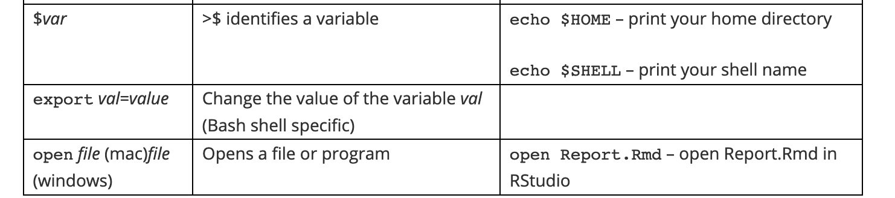

<html lang="en">

```{r setup, include=FALSE}
knitr::opts_chunk$set(
	echo = TRUE,
	message = FALSE,
	warning = FALSE
)

library(learnr) #necessary to render tutorial correctly

library(forcats)
library(ggplot2)
library(htmltools)
library(kableExtra)
library(lubridate)
library(magrittr)
library(tibble)


source("./www/datsci_helpers.R")
```

# datsci_05: Productivity Tools

## Welcome!

<div class="infobox">
  
  **Usage:** This tutorial accompanies [Introduction to Data Science](https://rafalab.github.io/dsbook/) by [Prof Rafael Irizarry](http://rafalab.github.io/pages/about.html). It contains material from the textbook which is offered under a [CC BY-NC-SA 4.0](https://creativecommons.org/licenses/by-nc-sa/4.0/). 
  
</div>

### Welcome to *Data Science: Productivity Tools*!

 We're excited to have you join us in this course, which is designed to teach you the basics of analyzing, visualizing, and working with data using `r rproj()`.

This is the **fifth** in a series of courses in the Introduction to Data Science program, a series of courses that prepare you to do data analysis in `r rproj()`, from simple computations to machine learning. The courses are designed to be taken in order. 

Although this course has no formal prerequisites, we assume you have taken the preceding 4 courses in the series or have equivalent content knowledge. If you are new to the series, we suggest you begin with *Data Science: `r rproj()` Basics* (datsci_01).

Using a combination of guided introduction through short video lectures and comprehension tests, you will learn tools and techniques with which you should be equipped to excel as a data scientist.

### In this course, you will learn:

- How to leverage the many useful features provided by RStudio
- How to use Unix/Linux to manage your file system
- How to start a repository on GitHub
- How to perform version control with git

### Course overview

**Section 1:** Installing Software

- You will learn how to install `r rproj()`, RStudio, git (and git bash for Windows users), create a GitHub account, create a GitHub repository, and connect RStudio to your GitHub account.

**Section 2:** Unix

- You will learn the basics of managing your filesystem from the terminal with Unix commands such as mv and rm. 

**Section 3:** Reproducible Reports

- You will learn to create data science reports using R Markdown and the knitr package.

**Section 4:** Git and GitHub

- You will learn to use git and GitHub from the command line to clone and create repositories.

**Section 5:** Advanced Unix 

- You will learn other Unix commands, including arguments, getting help, pipes, and wildcards that are helpful in data science.


## Introduction to Productivity Tools


### Textbook link

The content is discussed within the [textbook section - 35 Introduction to productivity tools](https://rafalab.github.io/dsbook/introduction-to-productivity-tools.html).

### General Guiding Principles:

- Be systematic when organizing your filesystem

- Automize when possible

- Minimize the use of the mouse

### What we will learn:

- Unix shell

- Git and GitHub

- R markdown

## Meet the Course Instructor

<div class="infobox">
  
  
**Rafael Irizarry** is a Professor of Biostatistics and Computational Biology at the Dana-Farber Cancer Institute and a Professor of Biostatistics at Harvard Chan School of Public Health. He has been analyzing data, from sound signals to genomic measurements, for over 20 years.

Professor Irizarry teaches a popular Data Science course at Harvard and has developed several online courses on data analysis that are offered by HarvardX. These online courses, divided into the Data Analysis for the Life Sciences series and Genomics Data Analysis series, have been completed by thousands of students and much of the material is included in a book with a [freely available online version](https://leanpub.com/dataanalysisforthelifesciences).

Webpage: http://rafalab.github.io 

</div>


## Essential Course Information

### Course Syllabus

The course syllabus contains a more comprehensive version of the information below - but if you don't read the syllabus, please read this!

### Course Structure

This is a self-paced course. You can work on it with your own timeline in mind. However, we suggest that you work on a section per week, and it will take you 2 - 4 hours per week. 

Check the course home page for important dates. If you are interested in pursuing a Verified Certificate, you will need to upgrade before the date listed on the home page and finish all assignments before course close.

### Grading

Assignments in the course allow you to practice your coding skills using the DataCamp platform. R is a flexible programming language designed partly for readability and ease of programming.

HarvardX has partnered with a platform called DataCamp to create programming assignments that you can do online. There is no need to install anything on your computer. You will be given a set of code to modify and run in your browser. You can take as many attempts as you need. When your code works correctly, you will be awarded points. You can also request hints, which will help you out, but hints decrease your point total. Remember that you can always go to the Discussion Board for help that doesn't cost points.

### Passing Rate

The passing rate is 70%. You must sign up for a Verified Certificate and earn a grade of 70% of higher in order to obtain a certificate for this course.

## Pre-Course Survey

Insert Survey Link here

*If you cannot see the survey above, click this link to access it in a new window.*

## Section 1 Overview

The Installing Software section walks you through the steps to download and install `r rproj()`, RStudio, git (and git bash on Windows machines), create a GitHub account, and connect RStudio to GitHub.

There is a graded comprehension check at the end of the section.

## Installing Software


### Textbook link

The content is discussed within the [textbook section - 35 Introduction to productivity tools](https://rafalab.github.io/dsbook/introduction-to-productivity-tools.html).

### Key Points

- R: the programming language we use to analyze data

- RStudio: the integrated desktop environment we use to edit, organize, and test R scripts

- Git (and Git Bash for Windows): version control system

## Installing R


### Textbook link

The content is discussed within the [textbook section - 36.1 Installing R](https://rafalab.github.io/dsbook/installing-r-rstudio.html#installing-r).

### Key Points

- You need to install R before using RStudio, which is an interactive desktop environment.

- Select base subdirectory in CRAN and click download.

- Select all default choices in the installation process.

- We recommend selecting English for language to help you better follow the course.

- One can try using the R console, but for productivity purposes, we can switch to RStudio.

### Download R from CRAN

You can find the latest version of R for your operating system at the [CRAN website](https://cran.r-project.org/).

## Installing R Studio


### Textbook link

The content is discussed within the [textbook section - 36.2 Installing RStudio](https://rafalab.github.io/dsbook/installing-r-rstudio.html#installing-rstudio).

### Key Points

- You can download the latest version of RStudio at the [RStudio website](https://rstudio.com/products/rstudio/download/).

- The free desktop version is more than enough for this course.

- Make sure to choose the version for your own operating system.

- Choose "Yes" for all defaults in the installation process.

## Using RStudio for the First Time


### Textbook link

The content is discussed within the [textbook section - 1 Getting started with R and RStudio](https://rafalab.github.io/dsbook/getting-started.html). 

### Key Points

- In Windows, search for Rstudio in "Start"

- In Mac, choose Rstudio from applications, or use Command+Space to use spotlight search to avoid using the mouse

- To start a new script: file > new file > Rscript (or using key bindings: Ctrl+Shift+N on Windows, and Command+Shift+N on Mac)

- Key bindings from Rstudio cheatsheet can be located with Help > cheatsheet > Rstudio IDE cheatsheet

## Installing Packages


### Textbook link

The content is discussed within the [textbook section - 1.5 Installing R packages](https://rafalab.github.io/dsbook/getting-started.html#installing-r-packages).

### Key Points

- We will be using **tidyverse** and **dslabs** packages for this course, which do not come preinstalled in base R.

- Install packages from `r rproj()` console: `install.packages("pkg_name")`

- Install packages from Rstudio interface: Tools > install packages (allow autocomplete)

- Once installed, we can use `library("pkg_name")` to load a package each time we want to use it

- Check the packages you have installed

- Good practice: make a script to install all the packages you need for a fresh `r rproj()`


### Code

```{r, eval = FALSE}
install.packages("dslabs")  # to install a single package
install.packages(c("tidyverse", "dslabs")） # to install two packages at the same time
installed.packages() # to see the list of all installed packages
```


## Running Commands While Editing Scripts


### Textbook link

The content is discussed within the [textbook section - 1.4 RStudio](https://rafalab.github.io/dsbook/getting-started.html#rstudio). 

### Key Points

- RStudio has many useful features as an `r rproj()` editor, including the ability to test code easily as we write scripts and several autocomplete features.

- Keyboard shortcuts:

  - Save a script: Ctrl+S on Windows and Command+S on Mac
  
  - Run an entire script:  Ctrl+Shift+Enter on Windows Command+Shift+Return on Mac, or click "Source" on the editor pane
  
  - Run a single line of script: Ctrl+Enter on Windows and Command+Return on Mac while the cursor is pointing to that line, or select the chunk and click "run"
  
  - Open a new script: Ctrl+Shift+N on Windows and Command+Shift+N on Mac

### Code

```{r, eval = FALSE}
library(tidyverse)
```

## Keeping Organized with RStudio Projects


### Textbook link

The content is discussed within the [textbook section - 40.1 RStudio projects](https://rafalab.github.io/dsbook/reproducible-projects-with-rstudio-and-r-markdown.html#rstudio-projects). 

### Key Points

- RStudio provides a way to keep all the components of a data analysis project organized into one folder and to keep track of information about this project.

- To start a project, click on File > New Project > New repository > New project > decide the location of files and give a name to the project, e.g. "my-first-project". This will then generate a Rproj file called my-first-project.Rproj in the folder associated with the project, from which you can double click to start where you last left off.

- The project name will appear in the upper left corner or the upper right corner, depending on your operating system. When you start an RStudio session with no project, it will display "Project: (None)".

## Installing Git Introduction


### Key Points

- Git is a version control system, tracking changes and coordinating the editing of code.

- GitHub is a hosting system for code, which can help with your career profile.

- Git is most effectively used with Unix, but it can also interface with RStudio.

## Installing Git 


There are *two* videos about installing Git. You should watch the one that is appropriate for your machine.

- If you have a **Windows machine**, you will need to install **Git and Git Bash**. The **first video** walks you through this process.

- If you have a **Mac**, you will only need to install Git (which may already be installed on your system). The **second video** walks you through this process.

### Installing Git and Git Bash on Windows


### Installing Git and Git Bash on Windows


### Textbook link

The content is discussed within the [textbook section - 37.2 Installing Git on the Mac](https://rafalab.github.io/dsbook/accessing-the-terminal-and-installing-git.html#installing-git-on-the-mac) and [textbook section - 37.3 Installing Git and Git Bash on Windows](https://rafalab.github.io/dsbook/accessing-the-terminal-and-installing-git.html#installing-git-and-git-bash-on-windows). 


### Install on Windows

- Download Git bash from [https://git-scm.com/](https://git-scm.com/).

- When asked to choose the default editor for Git, we recommend choosing nano if you do not already know VIM.

- The "git and optional Unix tools from Windows" option will allow you to learn Unix from Rstudio, however, it might interfere with the Windows command line.

- The "git and optional Unix tools from Windows" option will allow you to learn Unix from Rstudio, however, it might interfere with the Windows command line.

### Install on Mac

- Open the terminal, either from the utility folder or using Cmd+space, and check if you already have Git installed by typing git --version in the command line.

- If you already have Git installed, you will be shown the version number after executing the above. If you do not have Git installed already, you will be prompted to do so.

## GitHub


### Textbook link

The content is discussed within the [textbook section - 39.2 GitHub accounts](https://rafalab.github.io/dsbook/git.html#github-accounts). 

### Key Points

- Sign up for a GitHub account, with a name that is professional, short, and easy to remember

- Connect to RStudio: global options > Git/SVM, enter the path to git executables

- To avoid typing our GitHub password every time, we create a SSH/RSA key automatically through RStudio with the *create RSA key* button.

## GitHub Repositories


### Textbook link

The content is discussed within the [textbook section - 39.3 GitHub repositories](https://rafalab.github.io/dsbook/git.html#github-repos). 

### Key Points

To create a new GitHub repository and link it to an RStudio project, follow 2 steps:

- Step 1: Initialize a new repo on GitHub by clicking repository > new > choose a descriptive name.

- Step 2: Connect to RStudio (next video).

## RStudio, Git, and GitHub


### Textbook link

The content is discussed within the [textbook section - 39.4 Overview of Git](https://rafalab.github.io/dsbook/git.html#git-overview). 

### Key Points

- In terminal: configure git 

git config --global user.name "Your Name"
git config --global user.email "your@email.com"

- In RStudio, create project > Version control > Git

- Git pane: status symbols and color

- Git actions: 

  - 1. **pull**: pull changes from remote repo (if you are in collaboration with others)
  
  - 2. **add**: stage files for commit; click on stage box under git pane
  
  - 3. **commit**: commit to the local repo; click on "commit" button under git pane; add a commit message
  
  - 4. **push**: push to the remote repo on Github

- .gitignore file: details check [https://git-scm.com/docs/gitignore](https://git-scm.com/docs/gitignore)

## 1.1 Comprehension Check: Installing Software

Insert assessment here

## Section 2 Overview

The Unix section discusses the basics of managing your filesystem from the terminal with Unix commands such as `mv` and `rm`. 

There is a two-part graded comprehension check at the end of the section. Part 2 is only available to in-class students.

Below, you will find a summary of Unix commands that will be covered in this section and the Advanced Unix section. The examples here and in videos refer to this hypothetical file system. You can download a copy of the image.

<figure>

</figure> 

### Useful Unix Commands

<figure>

</figure> 

<figure>

</figure> 

<figure>

</figure> 

#### Absolute path vs. relative path

A full path specifies the location of a file from the root directory. It is independent of your present directory, and must begin with either a “/” or a “~”. In this example, the full path to our “project-1” file is: 

    /home/projects/project-1

A relative path is the path relative to your present working directory. If our present working directory is the “projects” folder, then the relative path to our “project-1” file is simply: 

    project-1

#### Path shortcuts

One period “.” is your current working directory

Two periods “..” is the parent directory (up one from your present working directory) 

A tilde   “~” is your home directory.

#### More path examples

1. Your current working directory is ~/projects and you want to move to the figs directory in the project-1 folder

  - Solution 2: cd ~/projects/project-1/figs (absolute)
  
  - Solution 2:  cd project-1/figs (relative)

2. Your current working directory is ~/projects and you want to move to the reports folder in the docs directory

  - Solution 1: cd ~/dos/reports (absolute)
  
  - Solution 2: cd ../docs/reports (relative)

3. Your current working directory is ~/projects/project-1/figs and you want to move to the project-2 folder in the projects directory.

  - Solution 1: cd ~/projects/project-2 (absolute)
  - Solution 2: cd ../../project-2 (relative)

## Organizing with Unix


### Textbook link

The content is discussed within the [textbook section - 38. Organizing with Unix](https://rafalab.github.io/dsbook/unix.html). 

As noted in the video, you can learn more about Unix from a number of other resources:

[Codecademy](https://www.codecademy.com/learn/learn-the-command-line)

[Quora list of Linux reference books](https://www.quora.com/Which-are-the-best-Unix-Linux-reference-books)

## The Terminal


### Textbook link

The content is discussed within the [textbook section - 38.2 The terminal](https://rafalab.github.io/dsbook/unix.html#the-terminal). 

### Key Points

- The terminal helps to organize files in the system.

- On Mac, use utilities > terminal.

- On windows, use Git bash program.

- Use the keyboard to navigate the command line


### Code

```{r, eval = FALSE}
echo "hello world"
```

## The Filesystem


### Textbook link

The content is discussed within the [textbook section - 38.3 The filesystem](https://rafalab.github.io/dsbook/unix.html#filesystem). 

### Key Points

- We refer to all the files, folders, and programs (executables) on your computer as the **filesystem**.
    
- Your filesystem is organized as a series of nested folders each containing files, folders, and executables. (see the visualization in the textbook)
   
- In Unix, folders are referred to as directories and directories that are inside other directories are often referred to as subdirectories. 
    
- The home directory is where all your stuff is kept. There is a hierarchical nature to the file system.

- **Note for Windows Users**: The typical `r rproj()` installation will make your *Documents* directory your home directory in `r rproj()`. This will likely be different from your home directory in Git Bash. Generally, when we discuss home directories, we refer to the Unix home directory which for Windows, in this book, is the Git Bash Unix directory.

## Working Directory


### Textbook link

The content is discussed within the [textbook section - 38.3.3 Working directory](https://rafalab.github.io/dsbook/unix.html#working-directory). 

### Key Points

- The working directory is the current location.

- Each terminal window has a working directory associated with it.

- The "pwd" command will display your working directory. The "/" symbol separates directories, while the first "/" at the beginning of the path stands for the root directory. When a path starts with "/", it is a "full path", which finds the current directory from the root directory. "Relative path" will be introduced soon.

- "~" means the home directory.

## Unix Commands


### Textbook link

The content is discussed within the [textbook section - 38.4 Unix commands](https://rafalab.github.io/dsbook/unix.html#unix-commands). 

### Key Points

- navigate the file system with commands introduced in this video.

- Auto-complete paths, commands and file names with the "Tab" key.


### Code

    ls #list dir content
    mkdir folder_name #create directory called "folder_name"
    rmdir folder_name  #remove an empty directory as long as it is empty
    rm -r folder_name  #remove dir that is not empty, "r" stands for recursive
    cd: change dir
    ../ # two dots represents parent dir
    . # single dot represents current workingdir 
    cd ~/projects # concatenate with forward slashes
    cd ../.. # change to two parent layer beyond
    cd -  # whatever dir you were before
    cd  # return to the home dir

## mv and rm: Moving and Removing Files


### Textbook link

The content is discussed within the [textbook section - 38.6 More Unix commands](https://rafalab.github.io/dsbook/unix.html#more-unix-commands). 

### Key Points

- The mv command moves files.

- **[warning]** mv will not ask you to confirm the move, and it could potentially overwrite a file.

- The rm command removes files.

- **[warning]** rm is permanent, which is different than throwing a folder in the trash


### Code

    mv path-to-file path-to-destination-directory    
    rm filename-1 filename-2 filename-3

## less: Looking at a File


### Textbook link

The content is discussed within the [textbook section - 38.6.4 less: looking at a file](https://rafalab.github.io/dsbook/unix.html#less-looking-at-a-file). 

### Key Points

- less allows you to quickly look at the content of a file

- Use q to exit the less page

- use the arrows to navigate in the less page

### Code

    less cv.tex

## Preparing for a Data Science Project


### Textbook link

The content is discussed within the [textbook section - 38.7 Preparing for a data science project](https://rafalab.github.io/dsbook/unix.html#prep-project). 

### Key Points

- Ideally, files (code, data, output) should be structured and self-contained

- In a project, we prefer using relative paths (path relative to the default working directory) instead of the full path so that code can run smoothly on other individual's computers.

- It is good practice to write a README.txt file to introduce the file structure to facilitate collaboration and for your future reference.


### Code

    ########### In terminal ###########
    cd ~    # move to home directory
    mkdir projects    # make a new directory called projects
    cd projects    # move to ~/projects directory
    mkdir murders    # make new directory called murders inside of projects
    cd murders    # move to ~/projects/murders/
    mkdir data rda    # make two new directories, one is data the other is rda folder
    ls    # to check if we indeed have one data folder and one rda folder
    pwd    # check the current working directory
    mkdir figs    # make a directory called figs to store figures

    ########## In RStudio ########
    # pick existing directory as new project
    getwd()    # to confirm current working directory
    save()    # save into .rda file, .RData is also fine but less preferred
    ggsave("figs/barplot.png")    # save a plot generated by ggplot2 to a dir called "figs"


## 2 Comprehension Check Part 1: Basic Unix

Insert assessment here

## 2 Comprehension Check Part 2 

Insert assessment here

## Section 3 Overview

The Reproducible Reports section guides you through how to create data science reports using R Markdown and the knitr package.

There is a graded comprehension check at the end of the section.

We will use this [example GitHub repository](https://github.com/rairizarry/murders) throughout.

## Reproducible Reports with R Markdown


### Textbook link

The content is discussed within the [textbook section - 40. Reproducible projects with RStudio and R markdown](https://rafalab.github.io/dsbook/reproducible-projects-with-rstudio-and-r-markdown.html). 

### Key Points

- The final output is usually a report, textual descriptions and figures, and tables.
    
- The aim is to generate a reproducible report in R markdown and knitr.
    
- Features of Rmarkdown: code and text can be combined to the same document and figures and tables are automatically added to the file.


## R Markdown


### Textbook link

The content is discussed within the [textbook section - 40.2 R markdown](https://rafalab.github.io/dsbook/reproducible-projects-with-rstudio-and-r-markdown.html#r-markdown). 

### Useful links

You can learn more about R Markdown at [markdowntutorial.com](markdowntutorial.com)

The [code for the sample report](https://raw.githubusercontent.com/rairizarry/murders/master/report.Rmd) is available.

### Key Points

- R Markdown is a format for *literate programming* documents. Literate programming weaves instructions, documentation and detailed comments in between machine executable code, producing a document that describes the program that is best for human understanding.


- Start an R markdown document by clicking on File > New File > the R Markdown

- The output could be HTML, PDF, or Microsoft Word, which can be changed in the header output, e.g. pdf_document / html_document/p>


### Code

<figure>

</figure> 


## knitr


### Textbook link

The content is discussed within the [textbook section - 40.2.4 knitR](https://rafalab.github.io/dsbook/reproducible-projects-with-rstudio-and-r-markdown.html#knitr). 

The [code for the example report](https://raw.githubusercontent.com/rairizarry/murders/master/report.Rmd) is available.

It also may be useful to explore the [RMarkdown website](https://rmarkdown.rstudio.com/) and the [knitr website](https://yihui.org/knitr/).

### Key Points

- The **knitr** package is used to compile R markdown documents.

- The first time you click the "knit" button on the editor pane a pop-up window will prompt you to install packages, but after that is completed, the button will automatically knit your document.

- github_document gives a .md file, which will give the best presentation on GitHub

### Code

    output: html_document 
    output: pdf_document 
    output: word_document
    output: github_document

## 3 Comprehension Check: Reproducible Reports

Insert assessment here

## Section 4 Overview

In this section on Git and GitHub, you will learn to clone and create version-controlled GitHub repositories using the command line. 

There is a graded comprehension check at the end of the section.

## Git and GitHub

Note: There is an error in the code in the video at 0:10. Use the code below the video instead.


### Textbook link

The content is discussed within the [textbook section - 39.1 Why use Git and GitHub?](https://rafalab.github.io/dsbook/git.html#why-use-git-and-github). 

### Additional Git and GitHub resources:

- [Codecademy](https://www.codecademy.com/learn/learn-git)

- [GitHub Guides](https://guides.github.com/activities/hello-world/)

- [Try Git tutorial](https://try.github.io/)

- [Happy Git and GitHub for the useR](https://happygitwithr.com/)

### Key Points

- Next, we will learn how to use Git and GitHub in the command line.

- Reasons to use Git and GitHub:

  - Version-control: Permits us to keep track of changes we made to code, to revert back to previous versions of files, to test ideas using new branches and decide if we want to merge to the original.
        
  - Collaboration: On a centralized repo, multiple people may make changes to the code and keep versions synced. A pull request allows anyone to suggest changes to your code.
    
  - Sharing code

- To effectively permit version control and collaboration, files move across four different areas: Working Directory, Staging Area, Local Repository, and Upstream Repository.

- Start your Git journey with either cloning an existing repo, or initializing a new one.

## Using Git at the Command Line


### Textbook link

The content is discussed within the [textbook section - 39.4 Overview of Git](https://rafalab.github.io/dsbook/git.html#git-overview). 


### Resources link

Explore the [repository discussed in the video](https://github.com/rairizarry/murders).


### Key Points

Recap: there are four stages: working directory, staging area, local repository, and upstream repository
    
Clone an existing upstream repository (copy repo url from clone button, and type "git clone <url>"), and all three local stages are the same as upstream remote.

The working directory is the same as the working directory in Rstudio. When we edit files we only change the files in this place.

    git status: tells how the files in the working directory are related to the files in other stages

edits in the staging area are not tracked by the version control system by default - we add a file to the staging area by git add command
    
    git commit: to commit files from the staging area to local repository, we need to add a message stating what we are doing by git commit -m "something"

    git log: keeps track of all the changes we have made to the local repository

    git push: allows moving from the local repository to upstream repository, only if you have the permission (e.g. if it is yours)

    git fetch: update local repository to  be like the upstream repository, from upstream to local

    git merge: make the updated local sync with the working directory and staging area

To change everything in one shot (from upstream to working dir), use git pull (equivalent to combining git fetch + git merge)


### Code

    pwd
    mkdir git-example
    cd git-example
    git clone https://github.com/rairizarry/murders.git
    cd murders
    ls
    git status
    echo "test" >> new-file.txt
    echo "temporary" >> tmp.txt
    git add new-file.txt
    git status
    git commit -m "adding a new file" 
    git status
    echo "adding a second line" >> new-file.txt
    git commit -m "minor change to new-file" new-file.txt
    git status
    git add
    git log new-file.txt
    git push
    git fetch
    git merge

## Creating a GitHub Repository


### Textbook link

The content is discussed within the [textbook section - 39.5 Initializing a Git directory](https://rafalab.github.io/dsbook/git.html#init). 


### Key Points

- Recap: two ways to get started, one is cloning an existing repository, the other is initializing our own

- Create our own project on our computer (independent of Git) on our own machine

- Create an upstream repo on Github, copy repo's url

- Make a local git repository: On the local machine, in the project directory, use git init. 
- Now git starts tracking everything in the local repo.

- Now we need to start moving files into our local repo and connect local repo to the upstream remote by  git remote add origin <url>

- **Note:** The first time you push to a new repository, you may also need to use these git push options: git push --set-upstream origin master. If you need to run these arguments but forget to do so, you will get an error with a reminder.


### Code

    cd ~/projects/murders
    git init
    git add README.txt
    git commit -m "First commit. Adding README.txt file just to get started"
    git remote add origin "https://github.com/rairizarry/murders.git"
    git push    # you may need to add these arguments the first time: --set-upstream origin master

## 4. Comprehension Check: Git and GitHub

Insert assessment here

## Section 5 Overview

In Section 5, you will learn additional useful Unix commands, including arguments, getting help, pipes, and wildcards that are all helpful in data science.

There is a two-part graded comprehension check at the end of the section

## Advanced Unix: Arguments


### Textbook link

The content is discussed within the [textbook section -  38.8.1 Arguments](https://rafalab.github.io/dsbook/unix.html#arguments). 


### Key Points

- Arguments typically are defined using a dash (-) or two dashes (--) followed by a letter of a word.

- r: recursive. For example, rm -r <directory-name>: remove all files, subdirectories, files in subdirectories, subdirectories in subdirectories, etc.

- Combine arguments: rm -rf directory-name
    
- ls -a: Shows all files in the directories including hidden files (e.g. .git file when initializing using git init) (a for all).

- ls -l: Returns more information about the files (i.e. l for long).

- ls -t: Shows files in chronological order.

- ls -r: Reverses the order of how files are shown.

- ls -lart: Shows more information for all files in reverse chronological order.

## Advanced Unix: Getting Help and Pipes


### Textbook link

The content is discussed within the [textbook section - 38.8.2 Getting help](https://rafalab.github.io/dsbook/unix.html#getting-help) and [textbook section - 38.8.3 Pipes](https://rafalab.github.io/dsbook/unix.html#pipes).


### Key Points

- **Getting Help:** Use man + command name to get help (e.g. man ls). Note that it is not available for Git Bash. For Git Bash, you can use command -- help (e.g. ls --help).

- **Pipes:** Pipes the results of a command to the command after the pipe. Similar to the pipe %>% in R. For example, man ls | less (and its equivalent in Git Bash: ls --help | less). Also useful when listing files with many files (e.g ls -lart | less).


## Advanced Unix: Wild cards


### Textbook link

The content is discussed within the [textbook section - 38.8.4 Wild cards](https://rafalab.github.io/dsbook/unix.html#wild-cards) in Unix.

### Key Points

- ( * ) means any number of any combination of characters. Specifically, to list all html files: ls * .html and to remove all html files in a directory: rm *.html.

- ? means any single character. For example, to erase all files in the  form file-001.html with the numbers going from 1 to 999: rm file-???.html.

- Combined wild cards: rm file-001.* to remove all files of the name file-001 regardless of suffix.

- **Warning: Combining rm with the * wild card can be dangerous. There are combinations of these commands that will erase your entire file system without asking you for confirmation. Make sure you understand how it works before using this wild card with the rm command.**

## Advanced Unix: Environment Variables and Shells


### Textbook link

The content is discussed within the [textbook section - 38.8.5 Environment variables](https://rafalab.github.io/dsbook/unix.html#environment-variables) and [textbook section - 38.8.6 Shells](https://rafalab.github.io/dsbook/unix.html#shells). 

### Key Points

- In Unix, variables are distinguished from other entities by adding a $ in front. For example, the home directory is stored in $HOME.
    
- See home directory: echo $HOME

- See them all: env   

- See what shell is being used: echo $SHELL (most common shell is bash)

- Change environmental variables: (Don’t actually run this command though!) export PATH = /usr/bin/

## Advanced Unix: Executables, Permissions, and File Types


### Textbook link

The content is discussed within the [textbook section - 38.8.7 Executables](https://rafalab.github.io/dsbook/unix.html#executables) and [textbook section - 38.8.8 Permissions and file types](https://rafalab.github.io/dsbook/unix.html#permissions-and-file-types). 


### Key Points

-  In Unix, all programs are files. They are called executables. So, ls, mv, and git are all files.

- To find where these program files are, use which. For example, which git would return /usr/bin/git.

- Type ls /usr/bin to see several executable files. There are other directories that hold program files (e.g. Application directory for Mac or Program Files directory in Windows).

- Type echo $PATH to see a list of directories separated by ":".

- Type the full path to run the user-created executables (e.g ./my-ls).

- Regular file -, directory d, executable x. 

- This string also indicates the permission of the file: is it readable? writable? executable? Can other users on the system read the file? Can other users on the system edit the file? Can other users execute if the file is executable?

## Advanced Unix: Commands You Should Learn


### Textbook link

The content is discussed within the [textbook section - 38.8.9 Commands you should learn](https://rafalab.github.io/dsbook/unix.html#commands-you-should-learn). 


### Key Points

Be aware of common commands and know what they do.

    open/start - On the mac open filename tries to figure out the right application of the filename and open it with that application. This is a very useful command. On Git Bash, you can try start filename. Try opening an R or Rmd file with open or start: it should open with RStudio.

    nano - A bare-bones text editor.

    ln - create a symbolic link. We do not recommend its use, but you should be familiar with it.

    tar - archive files and subdirectories of a directory into one file.

    ssh - connect to another computer.

    grep - search for patterns in a file.

    awk/sed - These are two very powerful commands that permit you to find specific strings in files and change them.

## 5 Comprehension Check Part 1: Advanced Unix

Insert assessment here

## 5 Comprehension Check Part 2 

Insert assessment here


