<html lang="en">

```{r setup, include=FALSE}
knitr::opts_chunk$set(
	echo = TRUE,
	message = FALSE,
	warning = FALSE
)

library(learnr) #necessary to render tutorial correctly

library(forcats)
library(ggplot2)
library(htmltools)
library(kableExtra)
library(lubridate)
library(magrittr)
library(tibble)


source("./www/datsci_helpers.R")
```

# datsci_05: Productivity Tools

## Introduction and Welcome!

<div class="infobox">
  
  
  **Usage:** This tutorial accompanies the textbook [Introduction to Data Science](https://rafalab.github.io/dsbook/) by [Prof Rafael Irizarry](http://rafalab.github.io/pages/about.html). It contains material from the textbook which is offered under a [Attribution-NonCommercial-ShareAlike 4.0 International (CC BY-NC-SA 4.0)](https://creativecommons.org/licenses/by-nc-sa/4.0/). 

</div>

### Welcome to *Data Science: Productivity Tools*!

We're excited to have you join us in this course, which is designed to teach you the basics of analyzing, visualizing, and working with data using `r rproj()`.

This is the **fifth** in a series of courses in the Introduction to Data Science program, a series of courses that prepare you to do data analysis in `r rproj()`, from simple computations to machine learning. The courses are designed to be taken in order. 

Although this course has no formal prerequisites, we assume you have taken the preceding 4 courses in the series or have equivalent content knowledge. If you are new to the series, we suggest you begin with *Data Science: `r rproj()` Basics* (datsci_01).

Using a combination of guided introduction lectures and comprehension tests, you will learn tools and techniques with which you should be equipped to excel as a data scientist.

### In this course, you will learn:

- How to leverage the many useful features provided by RStudio

- How to use Unix/Linux to manage your file system

- How to start a repository on GitHub

- How to perform version control with git

### Course overview

**Section 1:** Installing Software

- You will learn how to install `r rproj()`, RStudio, git (and git bash for Windows users), create a GitHub account, create a GitHub repository, and connect RStudio to your GitHub account.

**Section 2:** Unix

- You will learn the basics of managing your filesystem from the terminal with Unix commands such as mv and rm. 

**Section 3:** Reproducible Reports

- You will learn to create data science reports using R Markdown and the knitr package.

**Section 4:** Git and GitHub

- You will learn to use git and GitHub from the command line to clone and create repositories.

**Section 5:** Advanced Unix 

- You will learn other Unix commands, including arguments, getting help, pipes, and wildcards that are helpful in data science.


### Course Instructor

<div class="infobox">
  

**Fatih Uenal** is currenlty a Visitng Postdoctoral Researcher at the University of Cambridge, Department of Psychology, where he conducts research on the psychology of anthropocentrism and social and ecological dominance. Prior to his current position, he has worked as a postdoc at [Harvard University](https://scholar.harvard.edu/fatih-uenal/home). Together with [Prof Rafael Irizarry](http://rafalab.github.io/pages/about.html) he programmed this interactive tutorial based on the the textbook [*Introduction to Data Science*](https://rafalab.github.io/dsbook/). This interactive tutorial is developed using the `learnr` package. It has a general social scientists audience in mind and is suited for undergrad and graduate levels of study. 

Webpage: https://scholar.harvard.edu/fatih-uenal/home

</div>

---

### Essential Course Information

#### **Course Objectives**

“Data science” is a catch-all term used to describe the practice of working with and analyzing messy data sources to draw meaningful conclusions using techniques developed by computer scientists and computational statisticians. The purpose of this course is to give students who are training as quantitative social scientists a broad introduction to this skillset via the statistical programming language, `r rproj()`. You will learn how to conduct many statistical analyses such as univariate statistics (e.g., correlation, regression) in `r rproj()` that you may have already done in SPSS, Excel, or another such program. Additionally, we will build on this foundation to explore new skillsets uncommon in the social sciences, such as natural language processing, and machine learning. 

At the end of this course you will be able to:

- To answer research questions in Social Sciences (e.g., Psychology) with data

- Understand the basics of research designs in Social Sciences, and how they relate to data-analysis strategies

- Develop an intuitive, practical, and conceptual understanding of strategies for asking and answering questions with data

- To use `r rproj()`, a free and open-source statistics software program.

- Develop a basic understanding of frequently used Data Science Techniques.

- Practice your newly acquired skills with interesting, interactive, and fun projects.

**NOTE**: The schedule and procedures described in this syllabus are subject to change depending on specific needs and requirements. You will always be notified of changes on the homepage (see “last update”).


#### **Course Structure**

This is the first module in a series of a 8 week-intensive course.  and I suggest that you devote approx 10 hours a week to learning `r rproj()`, or if you are teaching graduate students, I’d recommend adopting the schedule below, which is designed for an intense but doable semester-long course, one module per week.  It is intended to take the average graduate student roughly 10 hours per week to complete all required tasks.However, some number of students will find programming to be more challenging and may take up to 15 hours per week.  Some will breeze through the material in 5.

#### **Grading**

Each Monday, lessons will be assigned from datacamp.com. Some of these lessons will be complete DataCamp courses, and others will be specific modules of courses. This will all be managed by assigning content to your (free) DataCamp account. The amount of content assigned will vary between one and two courses of content. DataCamp considers a course to be roughly 4 hours of lessons, which includes practice time. Realistically, the time you need will depend upon how intuitive you find `r rproj()` to be. For students already familiar with other programming languages and those with previous `r rproj()` experience, “8 hours” of courses is realistically closer to 2 hours; for complete novices that also find the material difficult, 8 hours is a realistic estimate. It is strongly recommended that you stretch out DataCamp lessons across the assignment period, for example, allocating 1 hour each day. You will gain the most by treating this as a foreign language immersion course by using R every day, including for your own research.
Remember that you can always go to the **Slack Group** for help. 

#### **Passing Rate**

The passing rate is 70%. 

### Pre-Course Survey

Insert Survey Link here

*If you cannot see the survey above, click this link to access it in a new window.*

## Introduction to Productivity Tools

<div class="infobox">
  
**Textbook link** The content is discussed within the [textbook section - 35 Introduction to productivity tools](https://rafalab.github.io/dsbook/introduction-to-productivity-tools.html).
  
</div>

--- 

Generally speaking, we do not recommend using point-and-click approaches for data analysis. Instead, we recommend scripting languages, such as R, since they are more flexible and greatly facilitate reproducibility. Similarly, we recommend against the use of point-and-click approaches to organizing files and document preparation. In this section, we demonstrate alternative approaches. Specifically, we will learn to use freely available tools that, although at first may seem cumbersome and non-intuitive, will eventually make you a much more efficient and productive data scientist. 

Three general guiding principles that motivate what we learn here are 1) be systematic when organizing your filesystem, 2) automate when possible, and 3) minimize the use of the mouse. As you become more proficient at coding, you will find that 1) you want to minimize the time you spend remembering what you called a file or where you put it, 2) if you find yourself repeating the same task over and over, there is probably a way to automate, and 3) anytime your fingers leave the keyboard, it results in loss of productivity. 

A data analysis project is not always a dataset and a script. A typical data analysis challenge may involve several parts, each involving several data files, including files containing the scripts we use to analyze data. Keeping all this organized can be challenging. We will learn to use the _Unix shell_ as a tool for managing files and directories on your computer system. Using Unix will permit you to use the keyboard, rather than the mouse, when creating folders, moving from directory to directory, and renaming, deleting, or moving files. We also provide specific suggestions on how to keep the filesystem organized.

The data analysis process is also iterative and adaptive. As a result, we are constantly editing our scripts and reports. In this section, we introduce you to the version control system _Git_, which is a powerful tool for keeping track of these changes. We also introduce you to [GitHub](http://github.com), a service that permits you to host and share your code. We will demonstrate how you can use this service to facilitate collaborations. **Keep in mind that another positive benefit of using GitHub is that you can easily showcase your work to potential employers**.

Finally, we learn to write reports in R markdown, which permits you to incorporate text and code into a single document. We will demonstrate how, using the `knitr` package, we can write reproducible and aesthetically pleasing reports by running the analysis and generating the report simultaneously. 

We will put all this together using the powerful integrated desktop environment [RStudio](https://www.rstudio.com/). Throughout the section we will be building up an example on US gun murders. The final project, which includes several files and folders, can be seen here: [https://github.com/rairizarry/murders](https://github.com/rairizarry/murders). Note that one of the files in that project is the final report: [https://github.com/rairizarry/murders/blob/master/report.md](https://github.com/rairizarry/murders/blob/master/report.md).


<div class="infobox">
   
  
**Key points:** 

---

**General Guiding Principles:**

- Be systematic when organizing your filesystem

- Automize when possible

- Minimize the use of the mouse

**What we will learn:**

- Unix shell

- Git and GitHub

- R markdown


</div>


## Section 1: Installing Software

The Installing Software section walks you through the steps to download and install `r rproj()`, RStudio, git (and git bash on Windows machines), create a GitHub account, and connect RStudio to GitHub.

In this section you will learn:

- R: the programming language we use to analyze data

- RStudio: the integrated desktop environment we use to edit, organize, and test R scripts

- Git (and Git Bash for Windows): version control system

There is a graded comprehension check at the end of the section.

### Installing Software


<div class="infobox">
  
**Textbook link** The content is discussed within the [textbook section - 35 Introduction to productivity tools]https://rafalab.github.io/dsbook/introduction-to-productivity-tools.html).
  
</div>

--- 

The instructions below include screen shots from the installation process in which we used the Chrome browser which, although not necessary, you can freely download and install from [here](https://www.google.com/chrome/).


### Installing R


```{r, include=FALSE}
if(knitr::is_html_output()){
  knitr::opts_chunk$set(out.width = "500px", 
                        out.extra='style="display: block; margin-left: auto; margin-right: auto; background-color: #000; padding:3px;"')
} else{
  knitr::opts_chunk$set(out.width = "4in")
}
```


RStudio is an interactive desktop environment, but it is not R, nor does it include R when you download and install it. Therefore, to use RStudio, we first need to install R.

1\. You can download R from the [Comprehensive R Archive Network (CRAN)](https://cran.r-project.org/). Search for CRAN on your browser:

```{r, echo=FALSE}
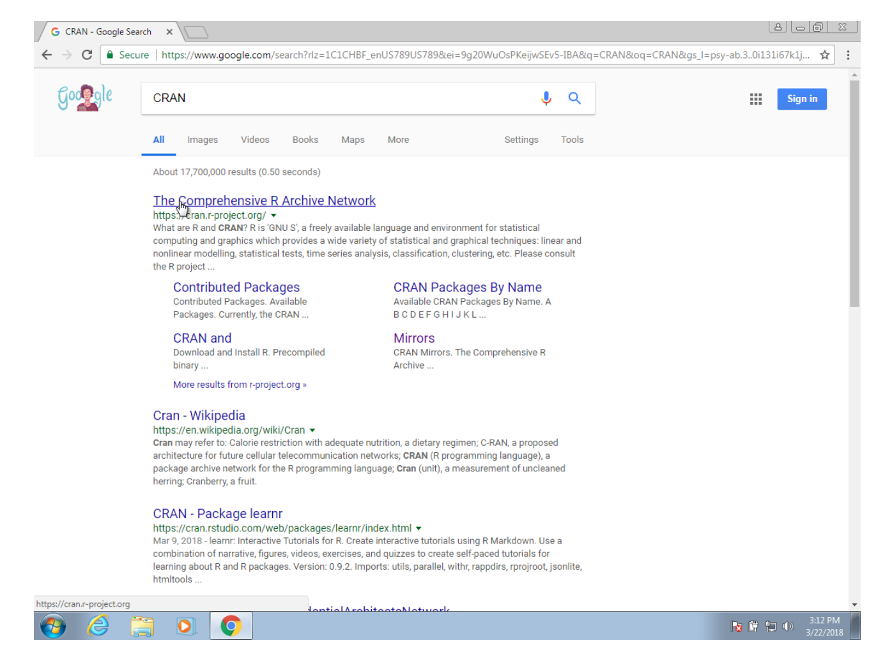
```

2\. Once on the CRAN page, select the version for your operating system: Linux, Mac OS X, or Windows. 

```{r, echo=FALSE}
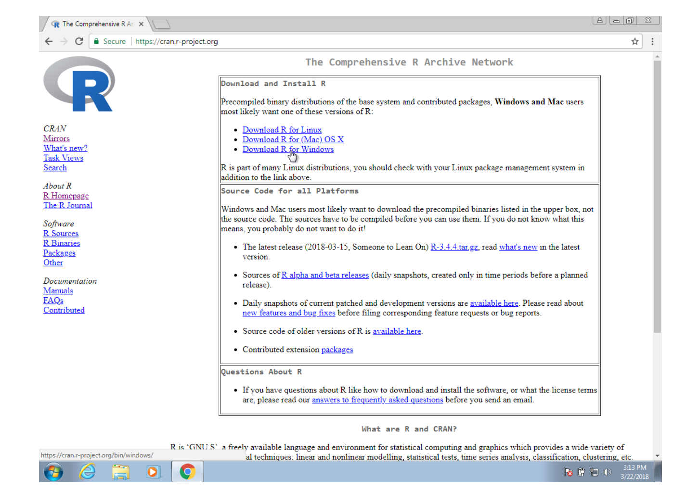
```

Here we show screenshots for Windows, but the process is similar for the other platforms. When they differ, we will also show screenshots for Mac OS X.

3\. Once at the CRAN download page, you will have several choices. You want to install the _base_ subdirectory. This installs the basic packages you need to get started. We will later learn how to install other needed packages from within R, rather than from this webpage.

```{r, echo=FALSE}
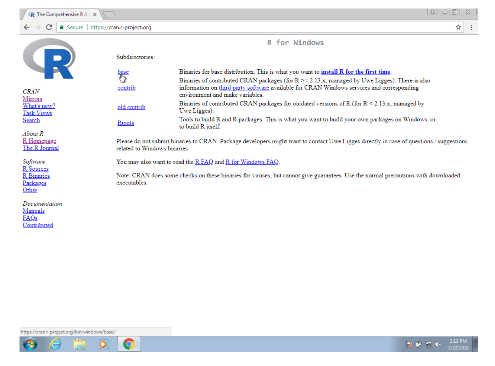
```

4\. Click on the link for the latest version to start the download.

```{r, echo=FALSE}
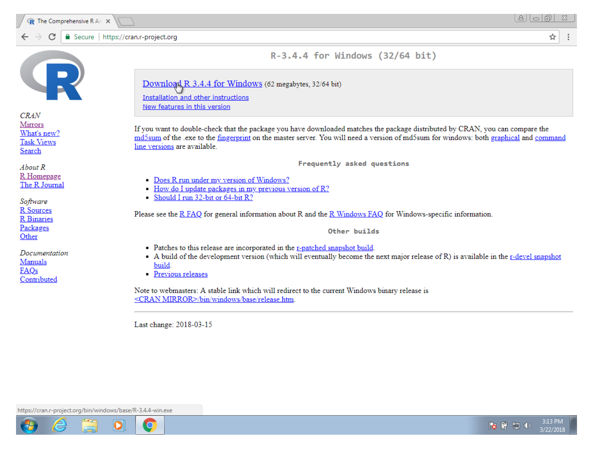
```

5\. If you are using Chrome, at the bottom of your browser you should see a tab that shows you the progress of the download. Once the installer file downloads, you can click on that tab to start the installation process. Other browsers may be different, so you will have to find where they store downloaded files and click on them to get the process started.

```{r, echo=FALSE}
knitr::include_graphics("./images/install_R_5.png")
```

If using Safari on a Mac, you can access the download through the download button.

```{r, echo=FALSE}
knitr::include_graphics("./images/install_R_6.png")
```

6\. You can now click through different choices to finish the installation. We recommend you select all the default choices.

```{r, echo=FALSE}
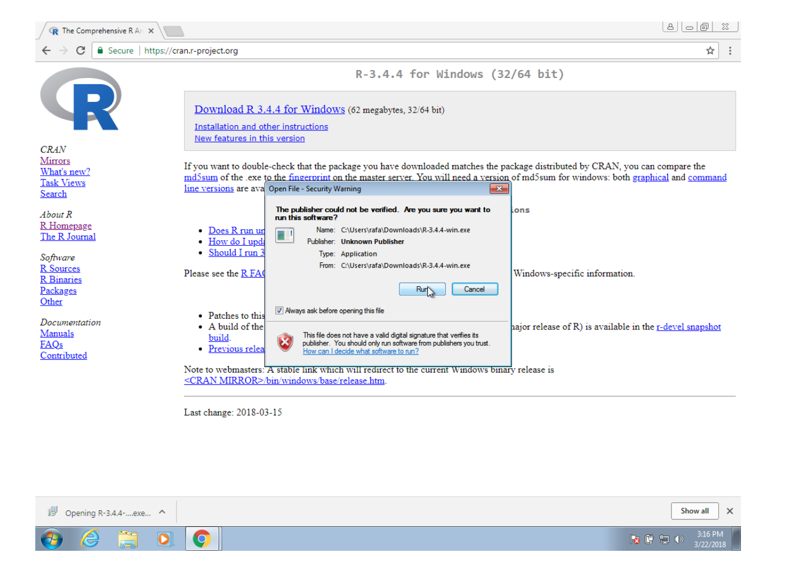
```

Select the default even when you get an ominous warning.

```{r, echo=FALSE}
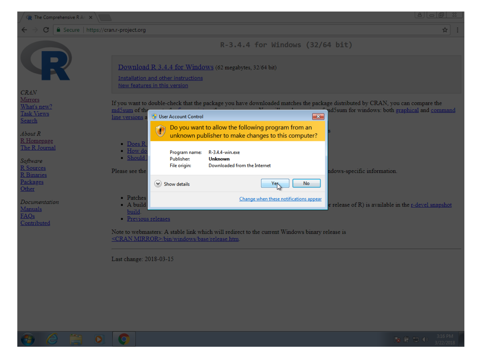
```

When selecting the language, consider that it will be easier to follow this book if you select English.

```{r, echo=FALSE}
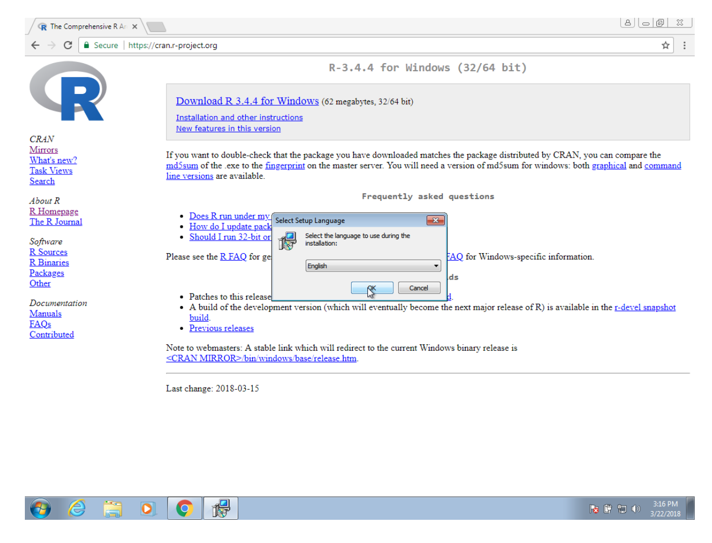
```

Continue to select all the defaults:

```{r, echo=FALSE}
knitr::include_graphics("./images/install_R_10.png")
```
```{r, echo=FALSE}
knitr::include_graphics("./images/install_R_11.png")
```
```{r, echo=FALSE}
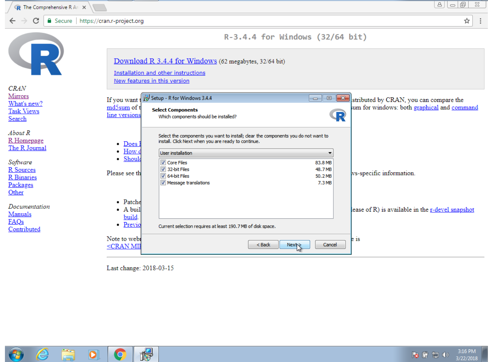
```
```{r, echo=FALSE}
knitr::include_graphics("./images/install_R_13.png")
```
```{r, echo=FALSE}
knitr::include_graphics("./images/install_R_14.png")
```
```{r, echo=FALSE}
knitr::include_graphics("./images/install_R_15.png")
```
```{r, echo=FALSE}
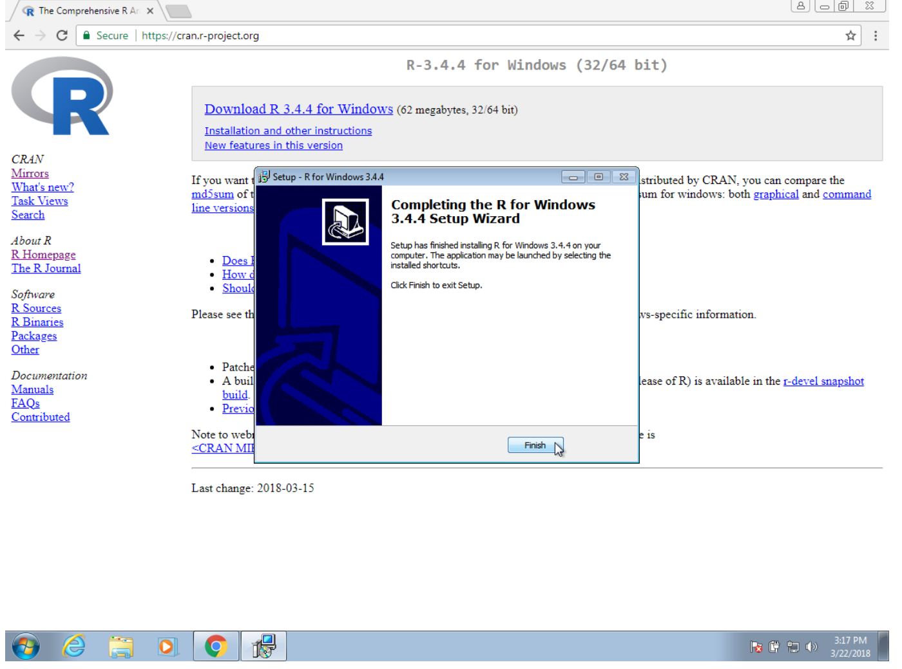
```

On the Mac it looks different, but you are also accepting the defaults:

```{r, echo=FALSE}
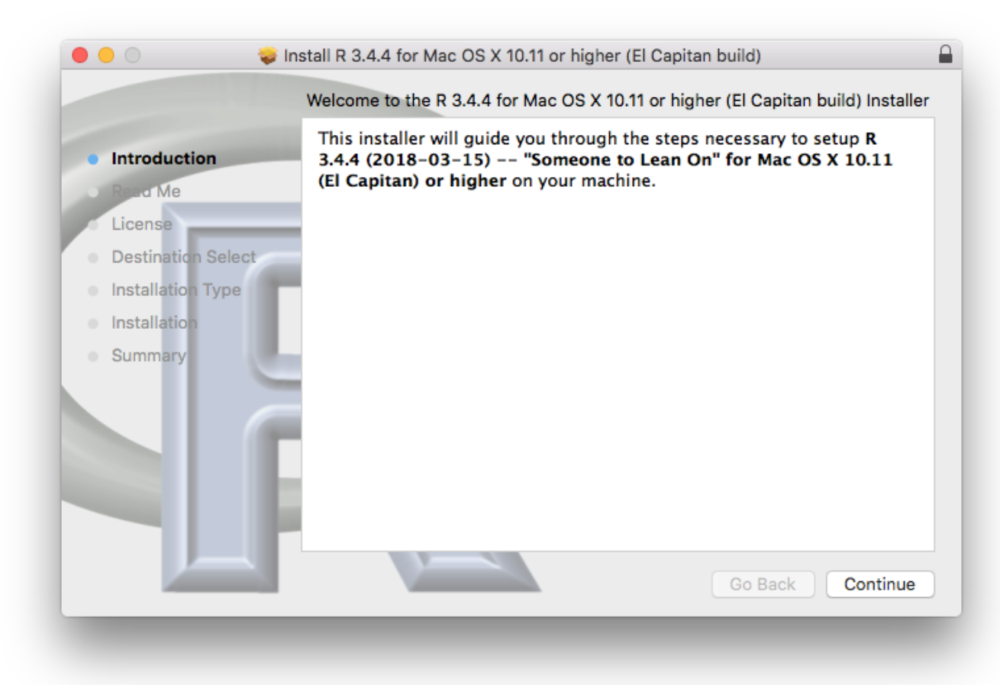
```
```{r, echo=FALSE}
knitr::include_graphics("./images/install_R_18.png")
```
```{r, echo=FALSE}
knitr::include_graphics("./images/install_R_19.png")
```
```{r, echo=FALSE}
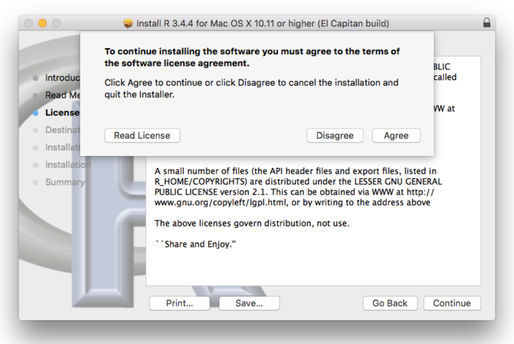
```
```{r, echo=FALSE}
knitr::include_graphics("./images/install_R_21.png")
```
```{r, echo=FALSE}
knitr::include_graphics("./images/install_R_22.png")
```
```{r, echo=FALSE}
knitr::include_graphics("./images/install_R_23.png")
```
```{r, echo=FALSE}
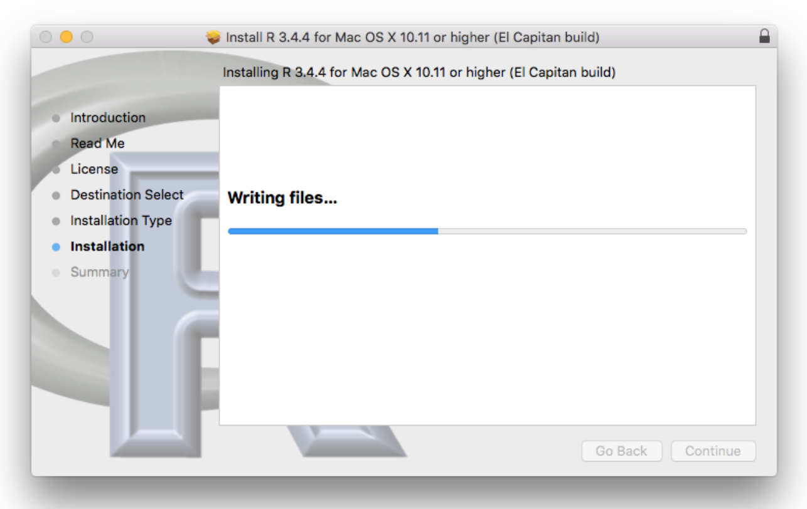
```
```{r, echo=FALSE}
knitr::include_graphics("./images/install_R_25.png")
```

Congratulations! You have installed R. 

#### **Download R from CRAN**

You can find the latest version of R for your operating system at the [CRAN website](https://cran.r-project.org/).


<div class="infobox">
   
  
**Key points:** 

---


- You need to install R before using RStudio, which is an interactive desktop environment.

- Select base subdirectory in CRAN and click download.

- Select all default choices in the installation process.

- We recommend selecting English for language to help you better follow the course.

- One can try using the R console, but for productivity purposes, we can switch to RStudio.


</div>


### Installing R Studio


<div class="infobox">
  
**Textbook link** The content is discussed within the [textbook section - 36.2 Installing RStudio](https://rafalab.github.io/dsbook/installing-r-rstudio.html#installing-rstudio).
  
</div>


1\. You can start by searching for RStudio on your browser:

```{r, echo=FALSE}
knitr::include_graphics("./images/install_RStudio_1.png")
```

2\. You should find the RStudio website as shown above. Once there, click on _Download RStudio_.

```{r, echo=FALSE}
knitr::include_graphics("./images/install_RStudio_2.png")
```

3\. This will give you several options. For what we do in this course, it is more than enough to use the free Desktop version:

```{r, echo=FALSE}
knitr::include_graphics("./images/install_RStudio_3.png")
```

4\. Once you select this option, it will take you to a page in which the operating system options are provided. Click the link showing your operating system.

```{r, echo=FALSE}
knitr::include_graphics("./images/install_RStudio_4.png")
```

5\. Once the installation file is downloaded, click on the downloaded file to start the installation process:

```{r, echo=FALSE}
knitr::include_graphics("./images/install_RStudio_6.png")
```

6\. We recommend clicking yes on all the defaults.

```{r, echo=FALSE}
knitr::include_graphics("./images/install_RStudio_7.png")
```

```{r, echo=FALSE}
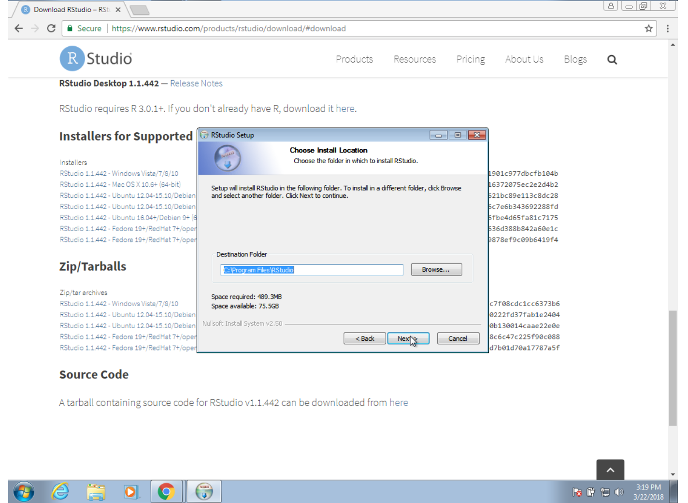
```

```{r, echo=FALSE}
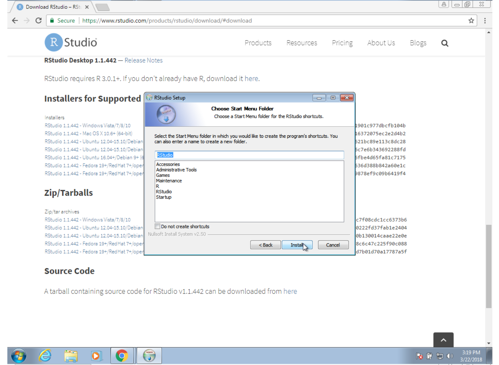
```

```{r, echo=FALSE}
knitr::include_graphics("./images/install_RStudio_10.png")
```

```{r, echo=FALSE}
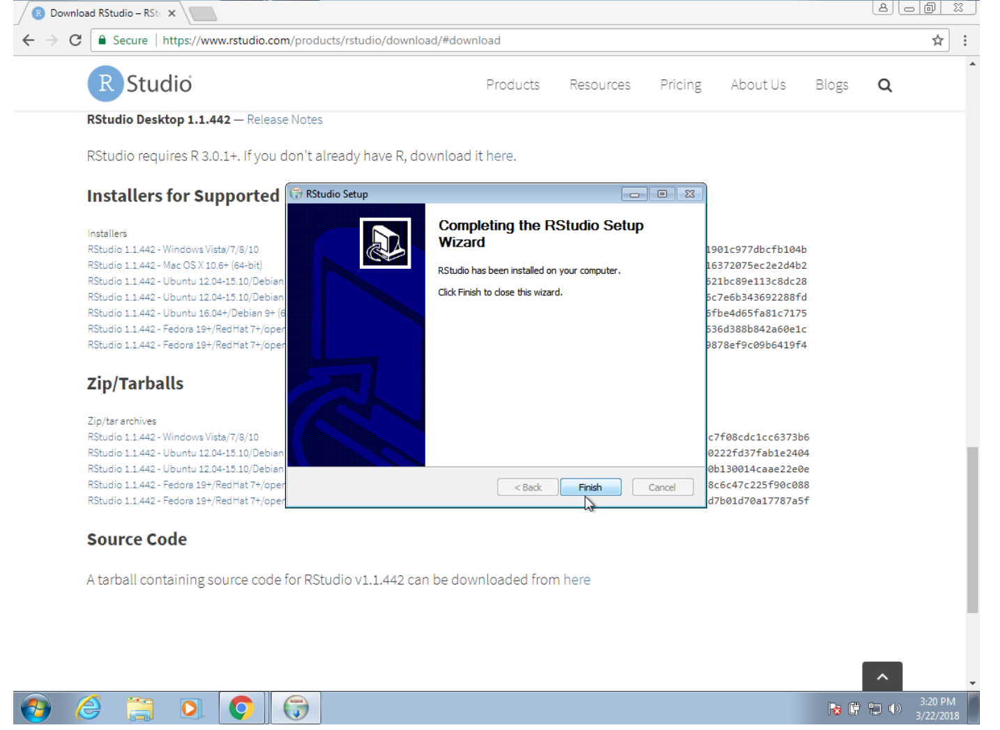
```

On the Mac, there are fewer clicks. You basically drag and drop the RStudio icon into the Applications folder icon here:

```{r, echo=FALSE}
knitr::include_graphics("./images/install_RStudio_12.png")
```

Congratulations! You have installed RStudio. You can now get started as you do on any other program in your computer. 
On Windows, you can open RStudio from the _Start_ menu. If RStudio does not appear, you can search for it:

```{r, echo=FALSE}
knitr::include_graphics("./images/install_RStudio_13.png")
```

On the Mac, it will be in the Applications folder:

```{r, echo=FALSE}
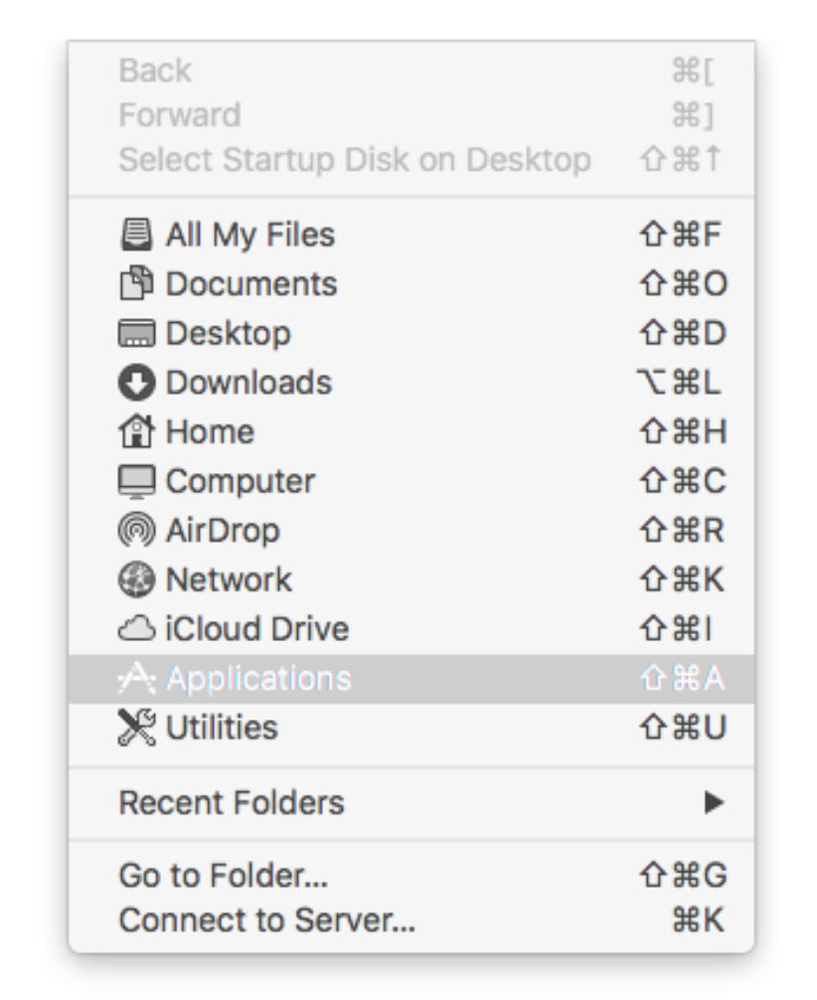
```

```{r, echo=FALSE}
knitr::include_graphics("./images/install_RStudio_15.png")
```

**Pro tip for the Mac**: To avoid using the mouse to open RStudio, hit command+spacebar to open _Spotlight Search_ and type RStudio into that search bar, then hit enter.

```{r, include=FALSE}
knitr::opts_chunk$set(out.width = NULL, out.extra = NULL)
```


<div class="infobox">
   
  
**Key points:** 

---


- You can download the latest version of RStudio at the [RStudio website](https://rstudio.com/products/rstudio/download/).

- The free desktop version is more than enough for this course.

- Make sure to choose the version for your own operating system.

- Choose "Yes" for all defaults in the installation process.


</div>


### Using RStudio for the First Time


<div class="infobox">
  
**Textbook link** The content is discussed within the [textbook section - 1 Getting started with R and RStudio](https://rafalab.github.io/dsbook/getting-started.html). 
  
</div>


RStudio will be our launching pad for data science projects. It not only provides an editor for us to create and edit our scripts but also provides many other useful tools. In this section, we go over some of the basics.

#### **The panes**

When you start RStudio for the first time, you will see three panes. The left pane shows the R console. On the right, the top pane includes tabs such as  _Environment_ and _History_, while the bottom pane shows five tabs: _File_, _Plots_, _Packages_, _Help_, and _Viewer_ (these tabs may change in new versions). You can click on each tab to move across the different features. 

```{r, echo=FALSE}
knitr::include_graphics("./images/install_RStudio_16.png")
```

To start a new script, you can click on File, then New File, then R Script. 

```{r, echo=FALSE}
knitr::include_graphics("./images/install_RStudio_17.png")
```

This starts a new pane on the left and it is here where you can start writing your script. 

```{r, echo=FALSE}
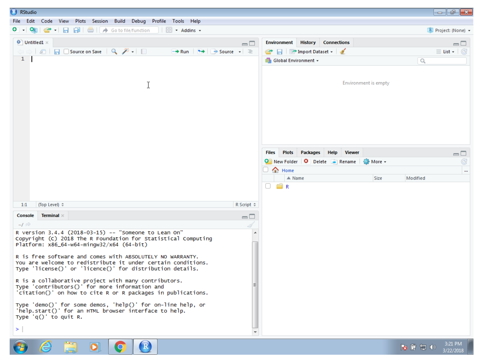
```

#### **Key bindings**

Many tasks we perform with the mouse can be achieved with a combination of key strokes instead. These keyboard versions for performing tasks are referred to as _key bindings_. For example, we just showed how to use the mouse to start a new script, but you can also use a key binding: Ctrl+Shift+N on Windows and command+shift+N on the Mac. 

Although in this tutorial we often show how to use the mouse, **we highly recommend that you memorize key bindings for the operations you use most**. RStudio provides a useful cheat sheet with the most widely used commands. You can get it from RStudio directly:

```{r, echo=FALSE}
knitr::include_graphics("./images/install_RStudio_19.png")
```

You might want to keep this handy so you can look up key-bindings when you find yourself performing repetitive point-and-clicking.


<div class="infobox">
   
  
**Key points:** 

---


- In Windows, search for Rstudio in "Start"

- In Mac, choose Rstudio from applications, or use Command+Space to use spotlight search to avoid using the mouse

- To start a new script: file > new file > Rscript (or using key bindings: Ctrl+Shift+N on Windows, and Command+Shift+N on Mac)

- Key bindings from Rstudio cheatsheet can be located with Help > cheatsheet > Rstudio IDE cheatsheet


</div>


### Installing R Packages


<div class="infobox">
  
**Textbook link** The content is discussed within the [textbook section - 1.5 Installing R packages](https://rafalab.github.io/dsbook/getting-started.html#installing-r-packages).
  
</div>

---

The functionality provided by a fresh install of R is only a small fraction of what is possible. In fact, we refer to what you get after your first install as _base R_. The extra functionality comes from add-ons available from developers. There are currently hundreds of these available from CRAN and many others shared via other repositories such as GitHub. However, because not everybody needs all available functionality, R instead makes different components available via _packages_. R makes it very easy to install packages from within R. For example, to install the __dslabs__ package, which we use to share datasets and code related to this course, you would type:

```{r,eval=FALSE}
install.packages("dslabs")
```

In RStudio, you can navigate to the _Tools_ tab and select install packages. We can then load the package into our R sessions using the `library` function:

```{r}
library(dslabs)
```

As you go through this course, you will see that we load packages without installing them. This is because once you install a package, it remains installed and only needs to be loaded with `library`. The package remains loaded until we quit the R session. If you try to load a package and get an error, it probably means you need to
install it first. 

We can install more than one package at once by feeding a character vector to this function:

```{r, eval=FALSE, echo=TRUE}
install.packages(c("tidyverse", "dslabs"))
```

Note that installing __tidyverse__ actually installs several packages. This commonly occurs when a package has *dependencies*, or uses functions from other packages. When you load a package using `library`, you also load its dependencies.

Once packages are installed, you can load them into R and you do not need to install them again, unless you install a fresh version of R. Remember packages are installed in R not RStudio.

It is helpful to keep a list of all the packages you need for your work in a script because if you need to perform a fresh install of R, you can re-install all your packages by simply running a script.

You can see all the packages you have installed using the following function:

```{r, eval=FALSE, echo=TRUE}
installed.packages()
```


```{r, include=FALSE}
knitr::opts_chunk$set(out.width = NULL, out.extra = NULL)
```


<div class="infobox">
   
  
**Key points:** 

---


- We will be using **tidyverse** and **dslabs** packages for this course, which do not come preinstalled in base R.

- Install packages from `r rproj()` console: `install.packages("pkg_name")`

- Install packages from Rstudio interface: Tools > install packages (allow autocomplete)

- Once installed, we can use `library("pkg_name")` to load a package each time we want to use it

- Check the packages you have installed

- Good practice: make a script to install all the packages you need for a fresh `r rproj()`


</div>


### Running Commands While Editing Scripts


<div class="infobox">
  
**Textbook link** The content is discussed within the [textbook section - 1.4 RStudio](https://rafalab.github.io/dsbook/getting-started.html#rstudio). 
  
</div>

---

There are many editors specifically made for coding. These are useful because color and indentation are automatically added to make code more readable. RStudio is one of these editors, and it was specifically developed for R. One of the main advantages provided by RStudio over other editors is that we can test our code easily as we edit our scripts. Below we show an example.

Let's start by opening a new script as we did before. A next step is to give the script a name. We can do this through the editor by saving the current new unnamed script. To do this, click on the save icon or use the key binding Ctrl+S on Windows and command+S on the Mac.  

When you ask for the document to be saved for the first time, RStudio will prompt you for a name. A good convention is to use a descriptive name, with lower case letters, no spaces, only hyphens to separate words, and then followed by the suffix _.R_. We will call this script _my-first-script.R_.

```{r, echo=FALSE}
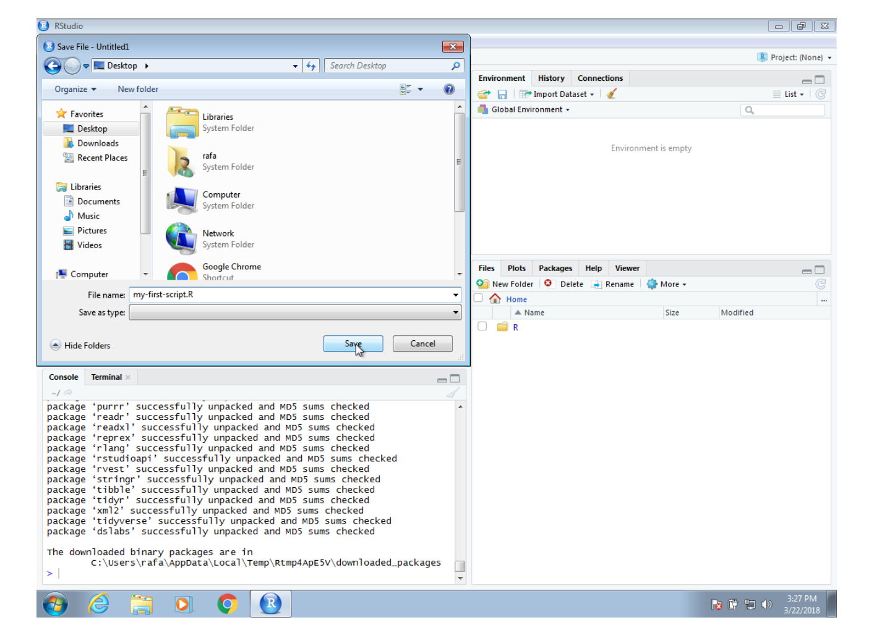
```

Now we are ready to start editing our first script. The first lines of code in an R script are dedicated to loading the libraries we will use. Another useful RStudio feature is that once we type `library()` it starts auto-completing with libraries that we have installed. Note what happens when we type `library(ti)`:

```{r, echo=FALSE}
knitr::include_graphics("./images/install_RStudio_21.png")
```

Another feature you may have noticed is that when you type `library(` the second parenthesis is automatically added. This will help you avoid one of the most common errors in coding: forgetting to close a parenthesis.

Now we can continue to write code. As an example, we will make a graph showing murder totals versus population totals by state. Once you are done writing the code needed to make this plot, you can try it out by _executing_ the code. To do this, click on the _Run_ button on the upper right side of the editing pane. You can also use the key binding: Ctrl+Shift+Enter on Windows or command+shift+return on the Mac.

Once you run the code, you will see it appear in the R console and, in this case, the generated plot appears in the plots console. Note that the plot console has a useful interface that permits you to click back and forward across different plots, zoom in to the plot, or save the plots as files.

```{r, echo=FALSE}
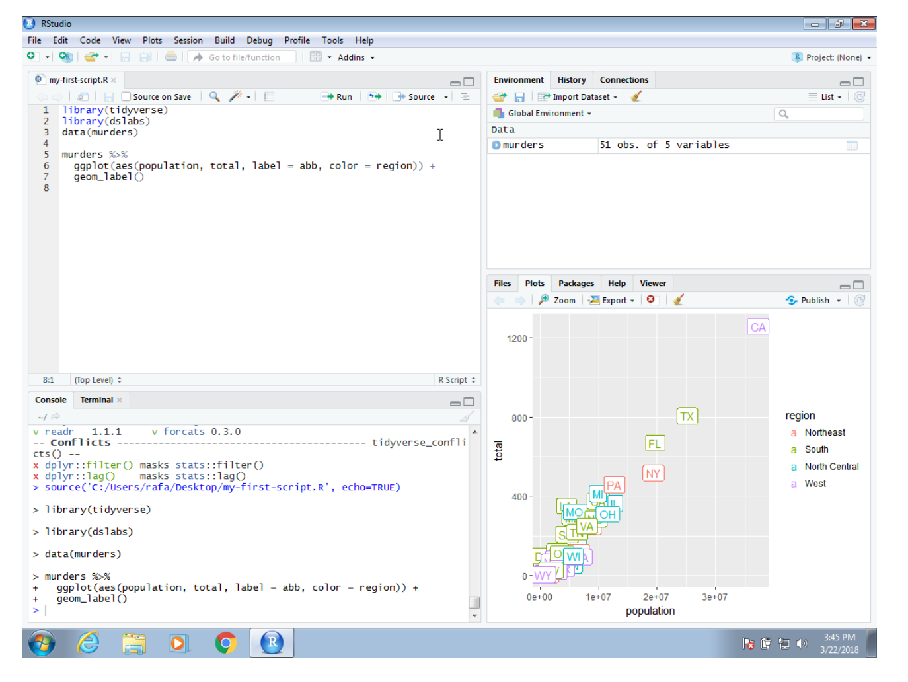
```


To run one line at a time instead of the entire script, you can use Control-Enter on Windows and command-return on the Mac.


<div class="infobox">
   
  
**Key points:** 

---


- RStudio has many useful features as an `r rproj()` editor, including the ability to test code easily as we write scripts and several autocomplete features.

- Keyboard shortcuts:

  - Save a script: Ctrl+S on Windows and Command+S on Mac
  
  - Run an entire script:  Ctrl+Shift+Enter on Windows Command+Shift+Return on Mac, or click "Source" on the editor pane
  
  - Run a single line of script: Ctrl+Enter on Windows and Command+Return on Mac while the cursor is pointing to that line, or select the chunk and click "run"
  
  - Open a new script: Ctrl+Shift+N on Windows and Command+Shift+N on Mac


</div>


### Keeping Organized with RStudio Projects

```{r, include=FALSE}
if(knitr::is_html_output()){
  knitr::opts_chunk$set(out.width = "500px", 
                        out.extra='style="display: block; margin-left: auto; margin-right: auto; background-color: #000; padding:3px;"')
} else{
  knitr::opts_chunk$set(out.width = "45%")
}
```

<div class="infobox">
  
**Textbook link** The content is discussed within the [textbook section - 40.1 RStudio projects](https://rafalab.github.io/dsbook/reproducible-projects-with-rstudio-and-r-markdown.html#rstudio-projects). 
  
</div>

---


The final product of a data analysis project is often a report. Many scientific publications can be thought of as a final report of a data analysis. The same is true for news articles based on data, an analysis report for your company, or lecture notes for a class on how to analyze data. The reports are often on paper or in a PDF that includes a textual description of the findings along with some figures and tables resulting from the analysis. 

Imagine that after you finish the analysis and the report, you are told that you were given the wrong dataset, you are sent a new one and you are asked to run the same analysis with this new dataset. Or what if you realize that a mistake was made and need to re-examine the code, fix the error, and re-run the analysis? Or imagine that someone you are training wants to see the code and be able to reproduce the results to learn about your approach? 

Situations like the ones just described are actually quite common for a data scientist. Here, we describe how you can keep your data science projects organized with RStudio so that re-running an analysis is straight-forward. We then demonstrate how to generate reproducible reports with R markdown and the __knitR__ package in a way that will greatly help with recreating reports with minimal work. This is possible due to the fact that R markdown documents permit code and textual descriptions to be combined into the same document, and the figures and tables produced by the code are automatically added to the document. 

### RStudio projects

RStudio provides a way to keep all the components of a data analysis project organized into one folder and to keep track of information about this project, such as the Git status of files, in one file. In the textbook [(Section - 39.6 Using Git and GitHub in RStudio)](https://rafalab.github.io/dsbook/git.html#rstudio-git) we demonstrate how RStudio facilitates the use of Git and GitHub through RStudio projects. In this section we quickly demonstrate how to start a new a project and some recommendations on how to keep these organized. RStudio projects also permit you to have several RStudio sessions open and keep track of which is which.

To start a project, click on _File_ and then _New Project_. Often we have already created a folder to save the work, as we did in the textbook [(Section - 38.7 Preparing for a data science project)](https://rafalab.github.io/dsbook/unix.html#prep-project) and we select _Existing Directory_. Here we show an example in which we have not yet created a folder and select the _New Directory_ option. 

```{r, echo=FALSE}
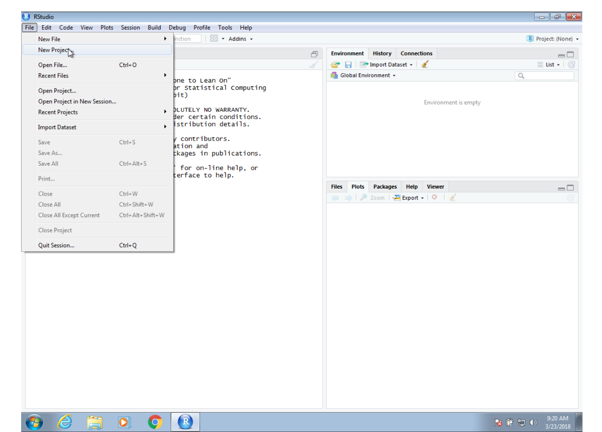
```

```{r, echo=FALSE}
knitr::include_graphics("./images/install_RStudio_24.png")
```

Then, for a data analysis project, you usually select the  _New Project_ option:

```{r, echo=FALSE}
knitr::include_graphics("./images/install_RStudio_25.png")
```

Now you will have to decide on the location of the folder that will be associated with your project, as well as the name of the folder. When choosing a folder name, just like with file names, make sure it is a meaningful name that will help you remember what the project is about. As with files, we recommend using lower case letters, no spaces, and hyphens to separate words. We will call the folder for this project _my-first-project_. This will then generate a _Rproj_ file called _my-first-project.Rproj_ in the folder associated with the project. We will see how this is useful a few lines below.

```{r, echo=FALSE}
knitr::include_graphics("./images/install_RStudio_26.png")
```

You will be given options on where this folder should be on your filesystem. In this example, we will place it in our home folder, but this is generally not good practice. As we described in the textbook [(Section - 38.7 Preparing for a data science project)](https://rafalab.github.io/dsbook/unix.html#prep-project) in the Unix section, you want to organize your filesystem following a hierarchical approach and with a folder called _projects_ where you keep a folder for each project.

```{r, echo=FALSE}
knitr::include_graphics("./images/install_RStudio_27.png") 
```

When you start using RStudio with a project, you will see the project name in the upper right corner. This will remind you what project this particular RStudio session belongs to. When you open an RStudio session with no project, it will say _Project: (None)_. 

When working on a project, all files will be saved and searched for in the folder associated with the project. Below, we show an example of a script that we wrote and saved with the name _code.R_. Because we used a meaningful name for the project, we can be a bit less informative when we name the files. Although we do not do it here, you can have several scripts open at once. You simply need to click _File_, then _New File_ and pick the type of file you want to edit.


```{r, echo=FALSE}
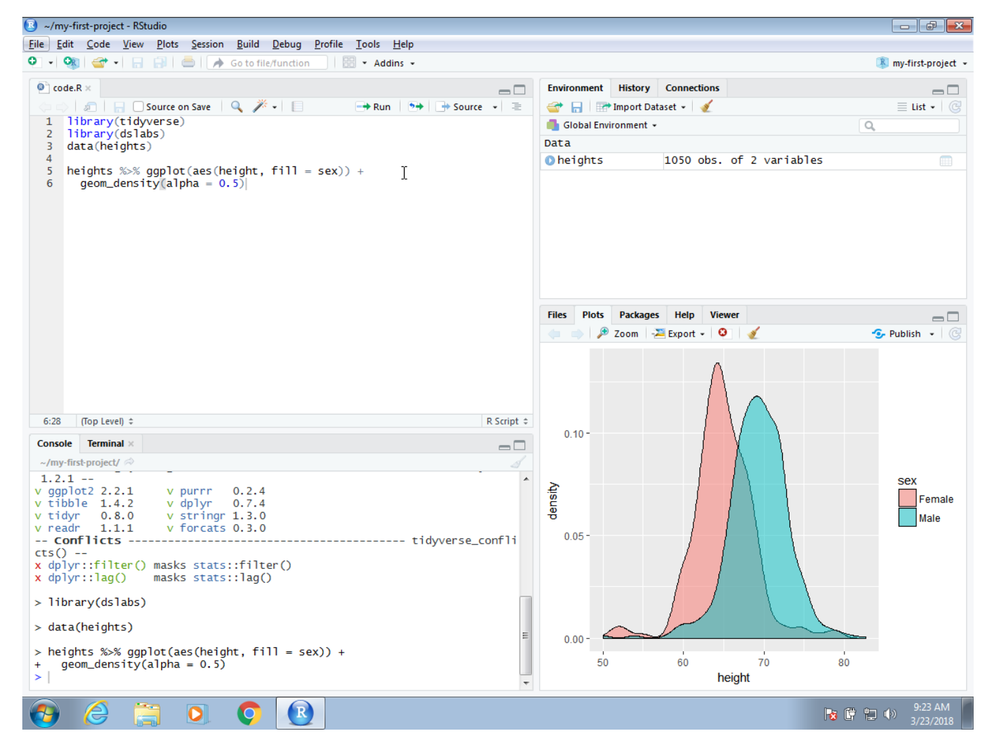 
```

One of the main advantages of using Projects is that after closing RStudio, if we wish to continue where we left off on the project, we simply double click or open the file saved when we first created the RStudio project. In this case, the file is called _my-first-project.Rproj_. If we open this file, RStudio will start up and open the scripts we were editing.


```{r, echo=FALSE}
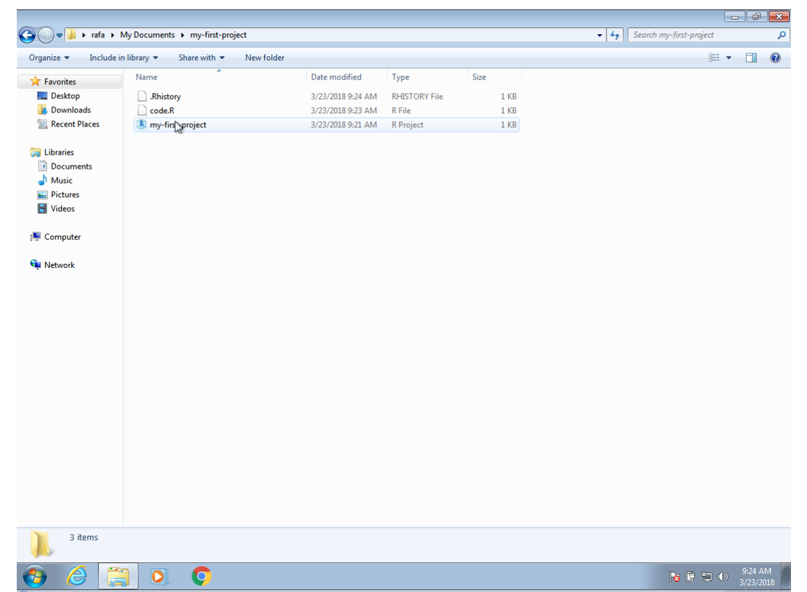
```

```{r, echo=FALSE}
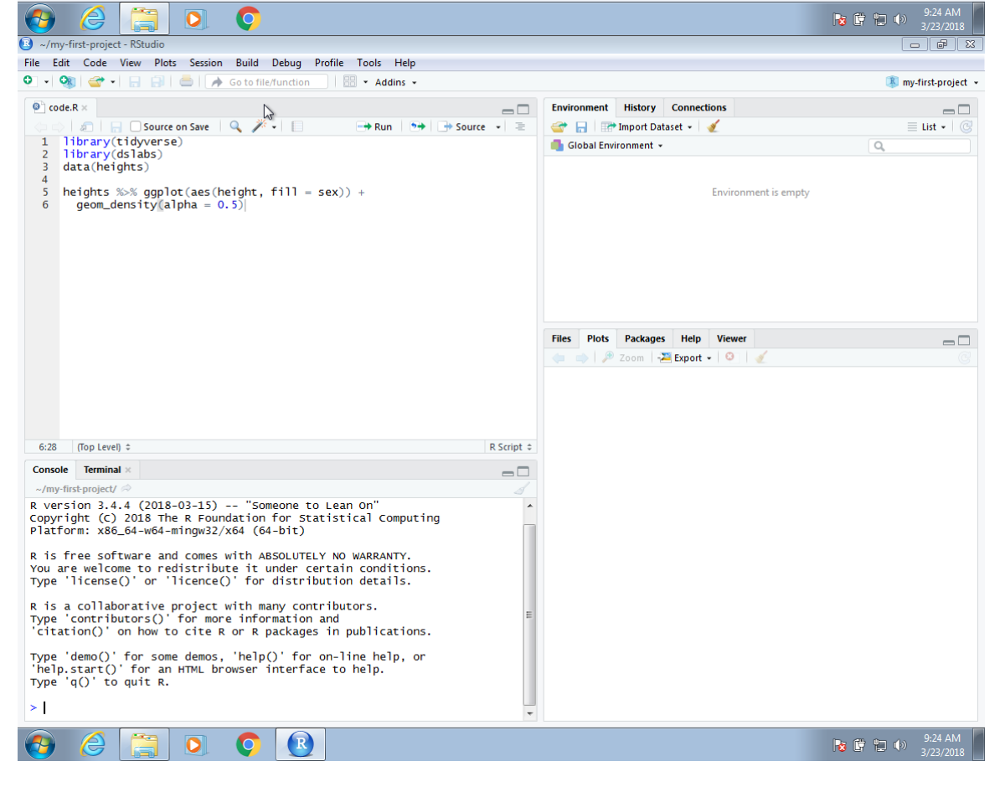
```

Another advantage is that if you click on two or more different Rproj files,  you start new RStudio and R sessions for each. 


<div class="infobox">
   
  
**Key points:** 

---


- RStudio provides a way to keep all the components of a data analysis project organized into one folder and to keep track of information about this project.

- To start a project, click on File > New Project > New repository > New project > decide the location of files and give a name to the project, e.g. "my-first-project". This will then generate a Rproj file called my-first-project.Rproj in the folder associated with the project, from which you can double click to start where you last left off.

- The project name will appear in the upper left corner or the upper right corner, depending on your operating system. When you start an RStudio session with no project, it will display "Project: (None)".


</div>


### Installing Git Introduction

```{r, include=FALSE}
if(knitr::is_html_output()){
  knitr::opts_chunk$set(out.width = "500px", 
                        out.extra='style="display: block; margin-left: auto; margin-right: auto; background-color: #000; padding:3px;"')
} else{
  knitr::opts_chunk$set(out.width = "45%")
}
```

<div class="infobox">
  
**Textbook link** The content is discussed within the [textbook section - 37.2 Installing Git on the Mac](https://rafalab.github.io/dsbook/accessing-the-terminal-and-installing-git.html#installing-git-on-the-mac) and [textbook section - 37.3 Installing Git and Git Bash on Windows](https://rafalab.github.io/dsbook/accessing-the-terminal-and-installing-git.html#installing-git-and-git-bash-on-windows). 
  
</div>

---

Another great advantage of RStudio projects is that one can share them with collaborators or the public through GitHub. To do this, we will need a piece of software named Git as well as access to a Unix terminal. The installation process for Git is quite different for Mac and Windows. We include both here. Git is what we refer to as a version control system. These are useful for tracking changes to files as well as coordinating the editing of code by multiple collaborators. We will later learn how to use GitHub, which is a hosting system for code. You need Git to interact with GitHub. Having your code, and more generally, data-science projects on GitHub is, among other things, a way to show employers what you can do. Git is most effectively used using Unix, although one can also use it through RStudio. In a following section, we describe Unix in more detail.


### Installing Git 

There are *two* subsections below explaining the installation of Git. You should follow the one that is appropriate for your machine.

- If you have a **Windows machine**, you will need to install **Git and Git Bash**. The **first section** walks you through this process.

- If you have a **Mac**, you will only need to install Git (which may already be installed on your system). The **second section** walks you through this process.

### Installing Git and Git Bash on Windows

**Warning: The instructions in this subsection are not for Mac users.**

There are several pieces of software that will permit you to perform Unix commands on Windows. We will be using Git Bash as it interfaces with RStudio and it is automatically installed when we install Git for Windows.

1\. Start by searching for _Git for Windows_ on your browser and clicking on the link from _git-scm.com_.

```{r, echo=FALSE}
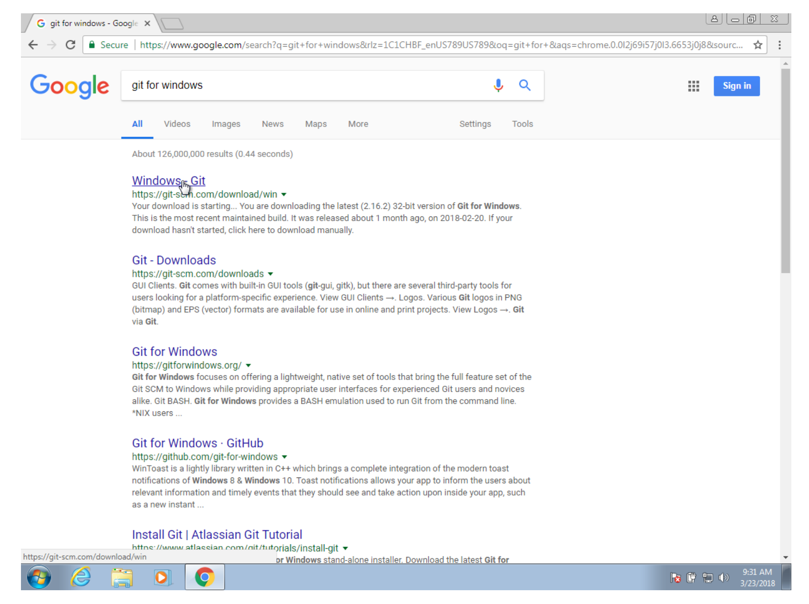
```

2\. This will take you to the _Download Git_ page from which you can download the _most recent maintained build_:

```{r, echo=FALSE}
knitr::include_graphics("./images/install_git_2.png")
```

3\. You can then accept to run the installer and agree to the license:

```{r, echo=FALSE}
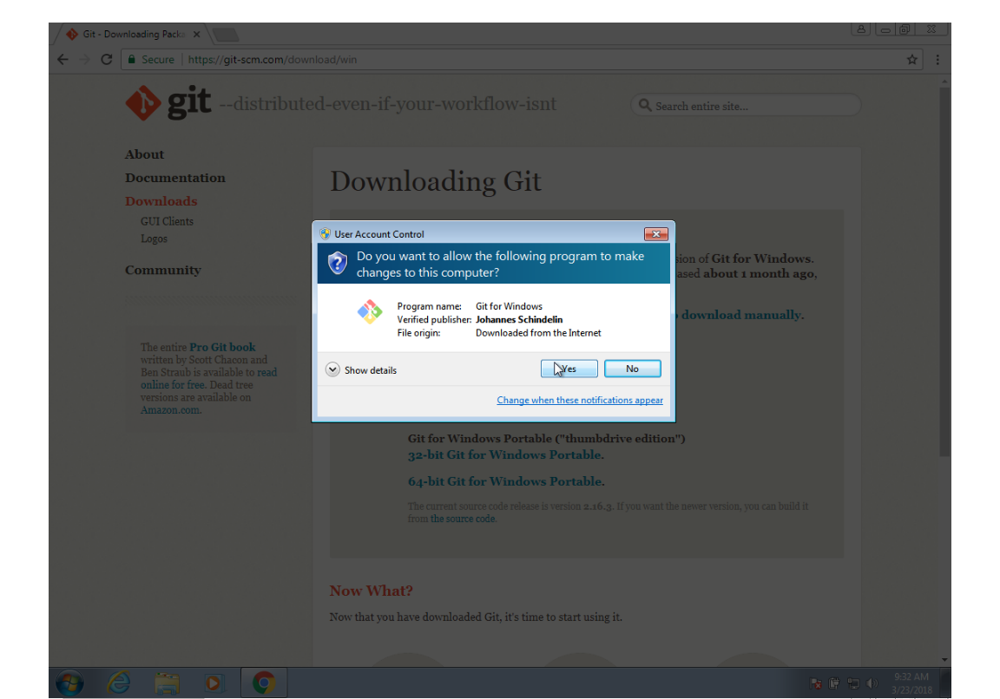
```

```{r, echo=FALSE}
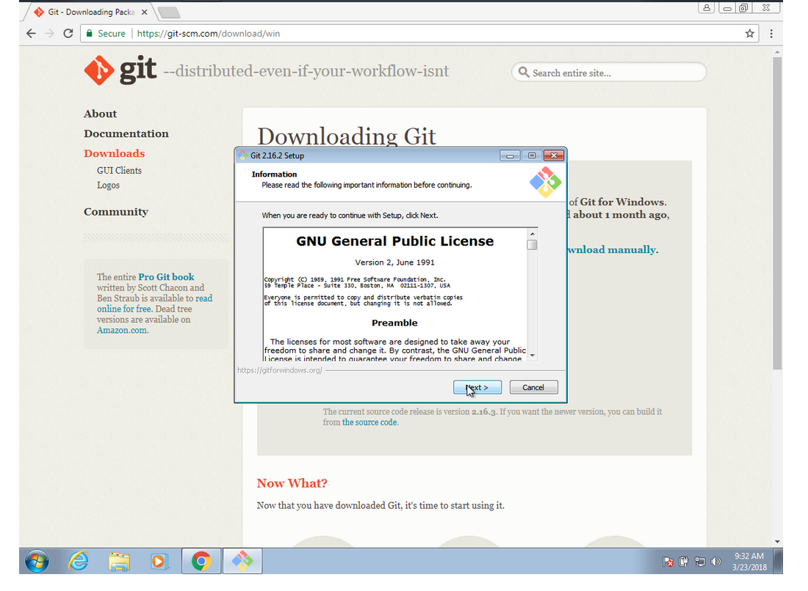
```


4\. In one of the installation steps, you will be asked to pick the default editor for Git. Unless you are already a _vi_ or _vim_ user, we recommend against selecting _vim_ which might be the default. If you do not recognize an editor you are familiar with among the options given, we recommend that you select _nano_ as your default editor for Git since it is the easiest to learn:

```{r, echo=FALSE}
knitr::include_graphics("./images/install_git_5.png")
```

5\. The next installation decision is actually an **important one**. This installation process installs Git Bash. We recommend that you select _Git and optional Unix tools from the Windows Command Prompt_ as this will permit you to learn Unix from within RStudio. However, if you do this, **some commands that run on your Windows command line will stop working**. If you do not use your Windows command line, then this should not be a problem. Also, most, if not all, of these Windows command lines have a Unix equivalent that you will be able to use now. 

```{r, echo=FALSE}
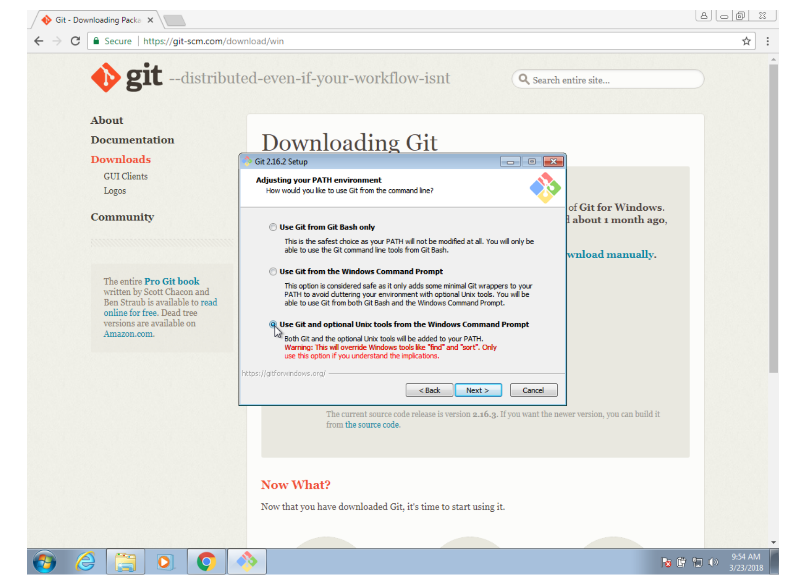
```

6\. You can now continue selecting the default options.

```{r, echo=FALSE}
knitr::include_graphics("./images/install_git_7.png")
```

```{r, echo=FALSE}
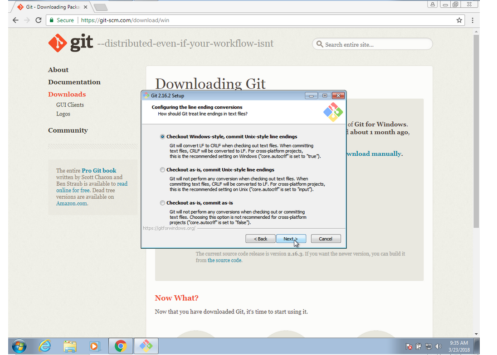
```

```{r, echo=FALSE}
knitr::include_graphics("./images/install_git_9.png")
```

```{r, echo=FALSE}
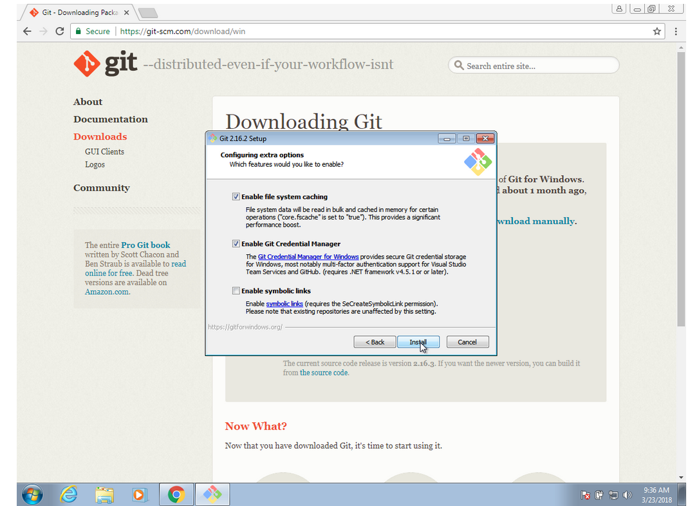
```

```{r, echo=FALSE}
knitr::include_graphics("./images/install_git_11.png")
```

You have now installed Git on Windows.

### Install on Windows

- Download Git bash from [https://git-scm.com/](https://git-scm.com/).

- When asked to choose the default editor for Git, we recommend choosing nano if you do not already know VIM.

- The "git and optional Unix tools from Windows" option will allow you to learn Unix from Rstudio, however, it might interfere with the Windows command line.

- The "git and optional Unix tools from Windows" option will allow you to learn Unix from Rstudio, however, it might interfere with the Windows command line.

### Installing Git on Mac

**Warning: The instructions in this subsection are not for Windows users.**

1\. Start by opening a terminal as described in the previous section.

2\. Once you start the terminal, you will see a console like this:

```{r, echo=FALSE}
knitr::include_graphics("./images/install_git_12.png")
```

3\. You might have Git installed already. One way to check is by asking for the version by typing:

```{bash, eval=FALSE, echo=TRUE}
git --version
```
    
If you get a version number back, it is already installed. If not, you will get the following message:
    
```{r, echo=FALSE}
knitr::include_graphics("./images/install_git_13.png")
```

and you will be asked if you want to install it. You should click _Install_:

```{r, echo=FALSE}
knitr::include_graphics("./images/install_git_14.png")
```

4\. This will take you through the installation process:

```{r, echo=FALSE}
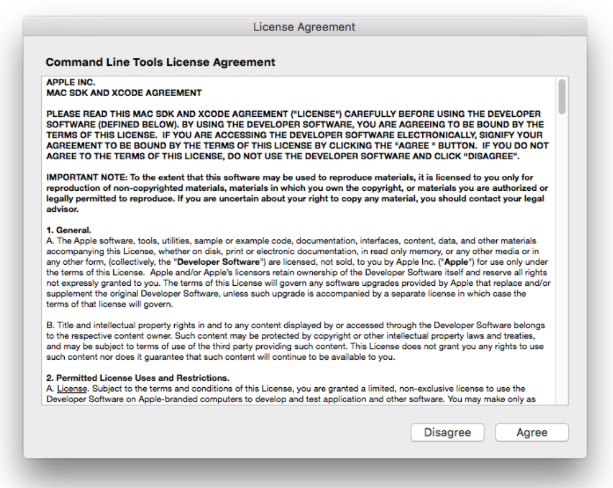
```

```{r, echo=FALSE}
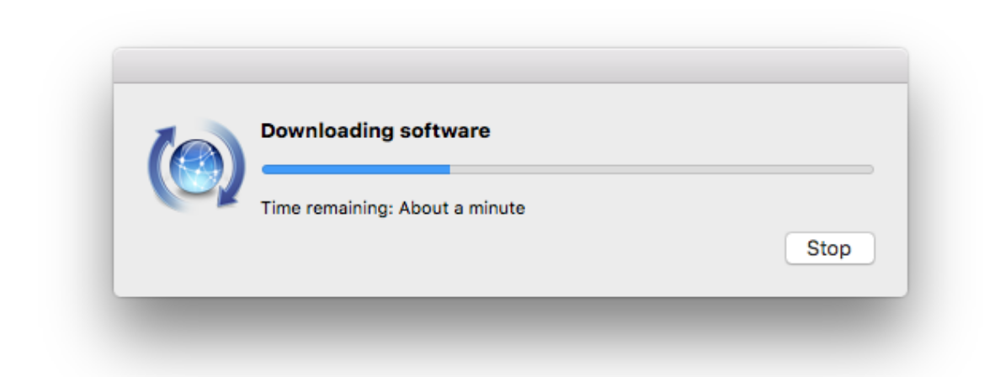
```

```{r, echo=FALSE}
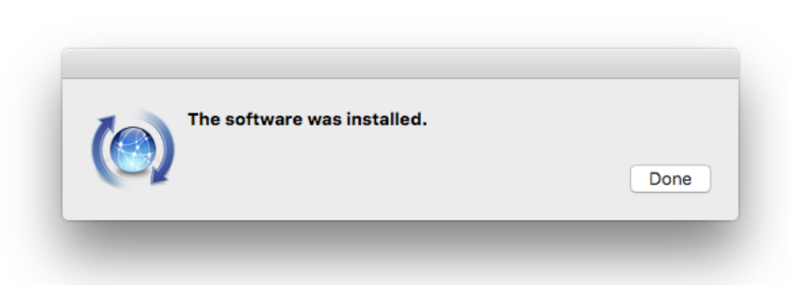
```

5\. Once installed, you can check for the version again and it should show you something like this:

```{r, echo=FALSE}
knitr::include_graphics("./images/install_git_18.png")
```

Congratulations. You have installed Git on your Mac.


#### **Install on Mac**

- Open the terminal, either from the utility folder or using Cmd+space, and check if you already have Git installed by typing git --version in the command line.

- If you already have Git installed, you will be shown the version number after executing the above. If you do not have Git installed already, you will be prompted to do so.


<div class="infobox">
   
  
**Key points:** 

---


- Git is a version control system, tracking changes and coordinating the editing of code.

- GitHub is a hosting system for code, which can help with your career profile.

- Git is most effectively used with Unix, but it can also interface with RStudio.


</div>


### GitHub
```{r, include=FALSE}
if(knitr::is_html_output()){
  knitr::opts_chunk$set(out.width = "500px", 
                        out.extra='style="display: block; margin-left: auto; margin-right: auto; background-color: #000; padding:3px;"')
} else{
  knitr::opts_chunk$set(out.width = "50%")
}
```

<div class="infobox">
  
**Textbook link** The content is discussed within the [textbook section - 39 Git and Github](https://rafalab.github.io/dsbook/git.html). 
  
</div>


Here we provide some details on Git and GitHub. However, we are only scratching the surface. To learn more about this topic, we highly recommend the following resources:

* Codeacademy: [https://www.codecademy.com/learn/learn-git](https://www.codecademy.com/learn/learn-git)
* GitHub Guides: [https://guides.github.com/activities/hello-world/](https://guides.github.com/activities/hello-world/)
* Try Git tutorial: [https://try.github.io/levels/1/challenges/1](https://try.github.io/levels/1/challenges/1)
* Happy Git and GitHub for the useR: [http://happygitwithr.com/](http://happygitwithr.com/)


### Why use Git and GitHub?

There are three main reasons to use Git and GitHub.

1\. Sharing: Even if we do not take advantage of the advanced and powerful version control functionality, we can still use Git and GitHub to share our code.

2\. Collaborating: Once you set up a central repo, you can have multiple people make changes to code and keep versions synched. GitHub provides a free service for centralized repos. GitHub also has a special utility, called a _pull request_, that can be used by anybody to suggest changes to your code. You can easily either accept or deny the request.

3\. Version control: The version control capabilities of Git permit us to keep track of changes we make to our code. We can also revert back to previous versions of files. Git also permits us to create _branches_ in which we can test out ideas, then decide if we _merge_ the new branch with the original.

Here we focus on the sharing aspects of Git and GitHub and refer the reader to the links above to learn more about this powerful tool.

### GitHub accounts

After installing [git](https://rafalab.github.io/dsbook/accessing-the-terminal-and-installing-git.html), the first step is to get a GitHub account. Basic GitHub accounts are free. To do this, go to [GitHub](github.com) where you will see a box in which you can sign up. 

You want to pick a name carefully. It should be short, easy to remember and to spell, somehow related to your name, and professional. This last one is important since you might be sending potential employers a link to your GitHub account. In the example below, I am sacrificing on the ease of spelling to incorporate my name. Your initials and last name are usually a good choice. If you have a very common name, then this may have to be taken into account. A simple solution would be to add numbers or spell out part of your name. 

The account I use for my research, _rafalab_, is the same one I use for [my webpage](http://rafalab.org) and [Twitter](http://twitter.com/rafalab), which makes it easy to remember for those that follow my work. 

Once you have a GitHub account, you are ready to connect Git and RStudio to this account. 

A first step is to let Git know who we are. This will make it easier to connect with GitHub. We start by opening a terminal window in RStudio (remember you can get one through _Tools_ in the menu bar). Now we use the `git config` command to tell Git who we are. We will type the following two commands in our terminal window:

```{bash, eval=FALSE, echo=TRUE}
git config --global user.name "Your Name"
git config --global user.mail "your@email.com"
```

You need to use the email account that you used to open your GitHub account. The RStudio session should look something like this:

```{r, echo=FALSE}
knitr::include_graphics("./images/git_1.png")
```

You start by going to the _Global Options_, selecting _Git/SVN_, and then you enter a path for the Git executable we just installed.

```{r, echo=FALSE}
knitr::include_graphics("./images/git_2.png")
```

On the Windows default installation, this will be _C:/Program File/Git/bin/git.exe_, but you should find it by browsing your system as this can change from system to system. Now to avoid entering our GitHub password every time we try to access our repository, we will create what is called an _SSH RSA Key_. RStudio can do this for us automatically if we click on the _Create RSA Key_ button:

```{r, echo=FALSE}
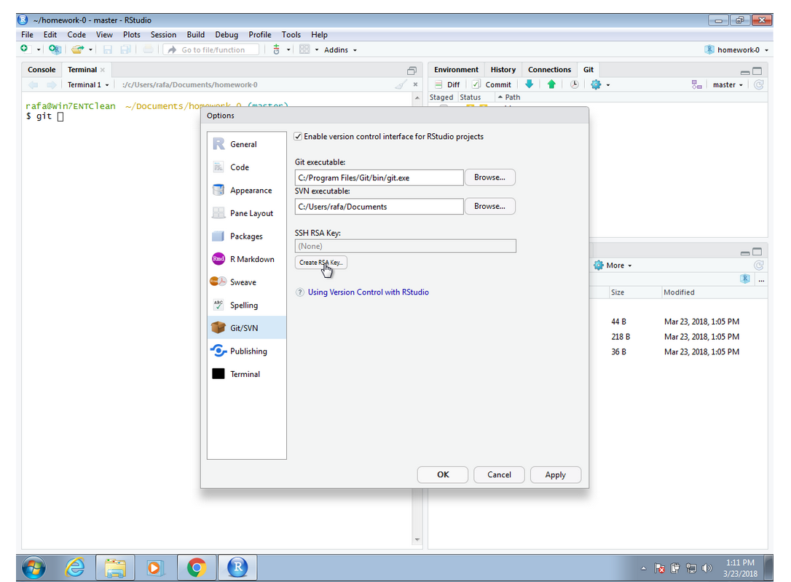
```

```{r, echo=FALSE}
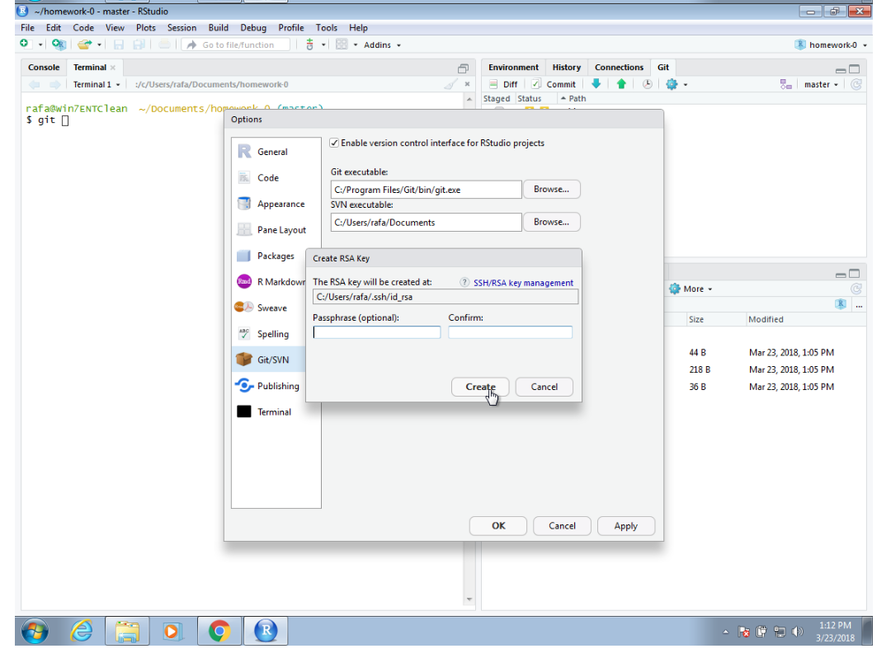
```
You can follow the default instructions as shown below: 

```{r, echo=FALSE}
knitr::include_graphics("./images/git_5.png")
```

```{r, echo=FALSE}
knitr::include_graphics("./images/git_6.png")
```

Git, RStudio and GitHub should now be able to connect and we are ready to create a first GitHub code repository.


<div class="infobox">
   
  
**Key points:** 

---


- Sign up for a GitHub account, with a name that is professional, short, and easy to remember

- Connect to RStudio: global options > Git/SVM, enter the path to git executables

- To avoid typing our GitHub password every time, we create a SSH/RSA key automatically through RStudio with the *create RSA key* button.


</div>


### GitHub Repositories


<div class="infobox">
  
**Textbook link** The content is discussed within the [textbook section - 39.3 GitHub repositories](https://rafalab.github.io/dsbook/git.html#github-repos). 
  
</div>


You are now ready to create a GitHub repository (repo). The general idea is that you will have at least two copies of your code: one on your computer and one on GitHub. If you add collaborators to this project, then each will have a copy on their computer. The GitHub copy is usually considered the _master_ copy that each collaborator syncs to. Git will help you keep all the different copies synced.

As mentioned, one of the advantages of keeping code on a GitHub repository is that you can easily share it with potential employers interested in seeing examples of your work. Because many data science companies use version control systems, like Git, to collaborate on projects, they might also be impressed that you already know at least the basics.

The first step in creating a repo for your code is to initialize on GitHub. Because you already created an account, you will have a page on GitHub with the URL `http://github.com/username`.

To create a repo, first log in to your account by clicking the _Sign In_ button on [https://github.com](http://github.com). You might already be signed in, in which case the _Sign In_ button will not show up.

If signing in, you will have to enter your username and password. We recommend you set up your browser to remember this to avoid typing it in each time.

Once on your account, you can click on _Repositories_ and then click on _New_ to create a new repo:


```{r, echo=FALSE}
knitr::include_graphics("./images/git_7.png")
```

```{r,  echo=FALSE}
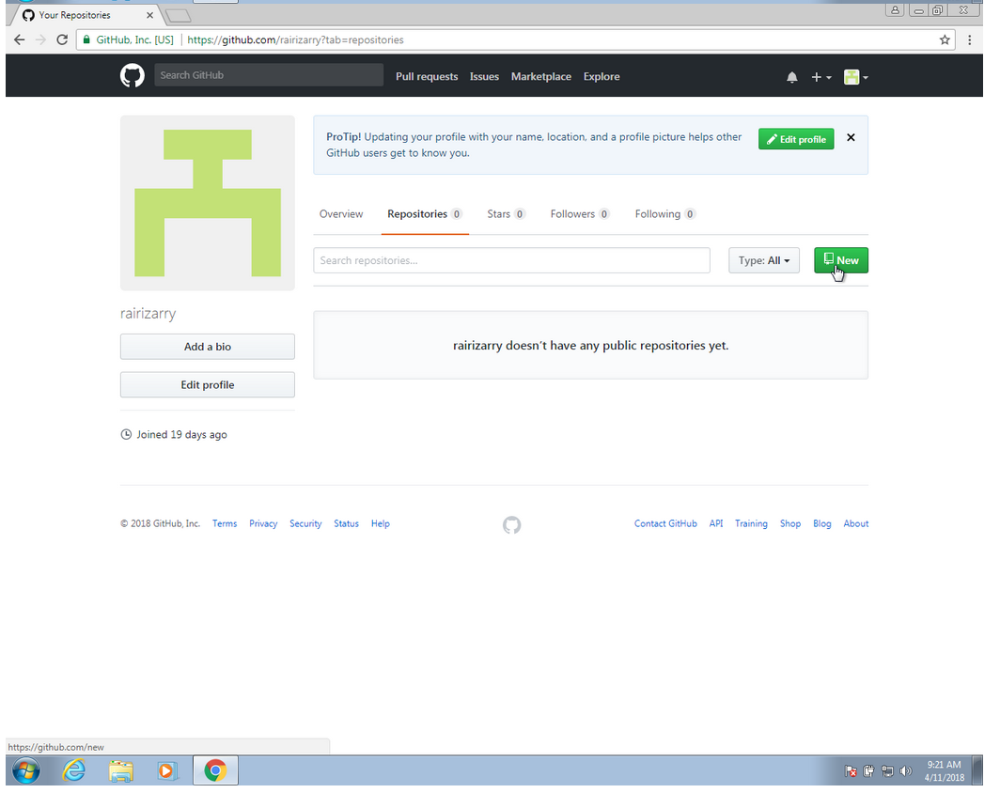
```

You will then want to choose a good descriptive name for the project. In the future, you might have dozens of repos so keep that in mind when choosing a name. Here we will use `homework-0`. We recommend you make the repo public. If you want to keep it private, you will have to pay a monthly charge.


```{r, echo=FALSE}
knitr::include_graphics("./images/git_9.png")
```

You now have your first repo on GitHub. The next step will be to _clone it_ on your computer and start editing and syncing using Git. 

To do this, it is convenient to copy the link provided by GitHub specifically to connect to this repo, using Git as shown below. We will later need to copy and paste this so make sure to remember this step.

```{r, echo=FALSE}
knitr::include_graphics("./images/git_10.png")
```


<div class="infobox">
   
  
**Key points:** 

---


To create a new GitHub repository and link it to an RStudio project, follow 2 steps:

- Step 1: Initialize a new repo on GitHub by clicking repository > new > choose a descriptive name.

- Step 2: Connect to RStudio (next section).


</div>


### RStudio, Git, and GitHub


<div class="infobox">
  
**Textbook link** The content is discussed within the [textbook section - 39.4 Overview of Git](https://rafalab.github.io/dsbook/git.html#git-overview).  
  
</div>


While command line Git is a powerful and flexible tool, it can be somewhat daunting when we are getting started. RStudio provides a graphical interface that facilitates the use of Git in the context of a data analysis project. We describe how to use this RStudio feature to do this here.

Now we are ready to start an RStudio project that uses version control and stores the code on a GitHub repo. To do this, we start a project but, instead of _New Directory_, we will select _Version Control_ and then we will select _Git_ as our version control system:

```{r, echo=FALSE}
knitr::include_graphics("./images/git_11.png")
```

```{r, echo=FALSE}
knitr::include_graphics("./images/git_12.png")
```

The repository URL is the link you used to clone. In the previous the textbook [(Section - 39.3 GitHub repositories)](https://rafalab.github.io/dsbook/git.html#github-repos), we used `https://github.com/username/homework-0.git` as an example. In the project directory name, you need to put the name of the folder that was generated, which in our example will be the name of the repo `homework-0`. This will create a folder called `homework-0` on your local system. Once you do this, the project is created and it is aware of the connection to a GitHub repo. You will see on the top right corner the name and type of project as well as a new tab on the upper right pane titled _Git_. 


```{r, echo=FALSE}
knitr::include_graphics("./images/git_13.png")
```

```{r, echo=FALSE}
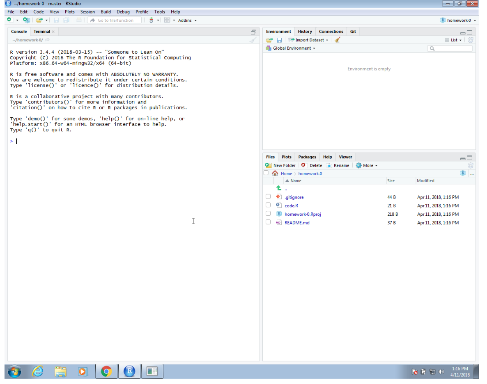
```

If you select this tab, it will show you the files on your project with some icons that give you information about these files and their relationship to the repo. In the example below, we already added a file to the folder, called _code.R_ which you can see in the editing pane.

```{r, echo=FALSE}
knitr::include_graphics("./images/git_15.png")
```

We now need to pay attention to the Git pane. It is important to know that **your local files and the GitHub repo will not be synced automatically**.  As described in the textbook [(Section -  39 Git and GitHub)](https://rafalab.github.io/dsbook/git.html#git-overview), you have to sync using git push when you are ready. We show you can do this through RStudio rather than the terminal below. 

Before we start working on a collaborative project, usually the first thing we do is _pull_ in the changes from the remote repo, in our case the one on GitHub. However, for the example shown here, since we are starting with an empty repo and we are the only ones making changes, we don't need to start by pulling.

In RStudio, the status of the file as it relates to the remote and local repos are represented in the status symbols with colors. A yellow square means that Git knows nothing about this file. To sync with the GitHub repo, we need to _add_ the file, then _commit_ the change to our local Git repo, then _push_ the change to the GitHub repo. Right now, the file is just on our computer. To add the file using RStudio, we click the _Stage_ box. You will see that the status icon now changes to a green A. 


```{r, echo=FALSE}
knitr::include_graphics("./images/git_16.png")
```

Note: we are only adding the _code.R_ file. We don't necessarily need to add all the files in our local repo to the GitHub repo, only the ones we want to keep track of or the ones we want to share. If our work is producing files of a certain type that we do not want to keep track of, we can add the suffix that defines these files to the .gitignore file. More details on using .gitignore are included here: [https://git-scm.com/docs/gitignore](https://git-scm.com/docs/gitignore). These files will stop appearing in your RStudio Git pane. For the example shown here, we will only be adding _code.R_. But, in general, for an RStudio project, we recommend adding both the .gitignore and .Rproj files.

Now we are ready to commit the file to our local repo. In RStudio, we can use the _Commit_ button. This will open a new dialog window. With Git, whenever we commit a change, we are required to enter a comment describing the changes being _committed_. 

```{r, echo=FALSE}
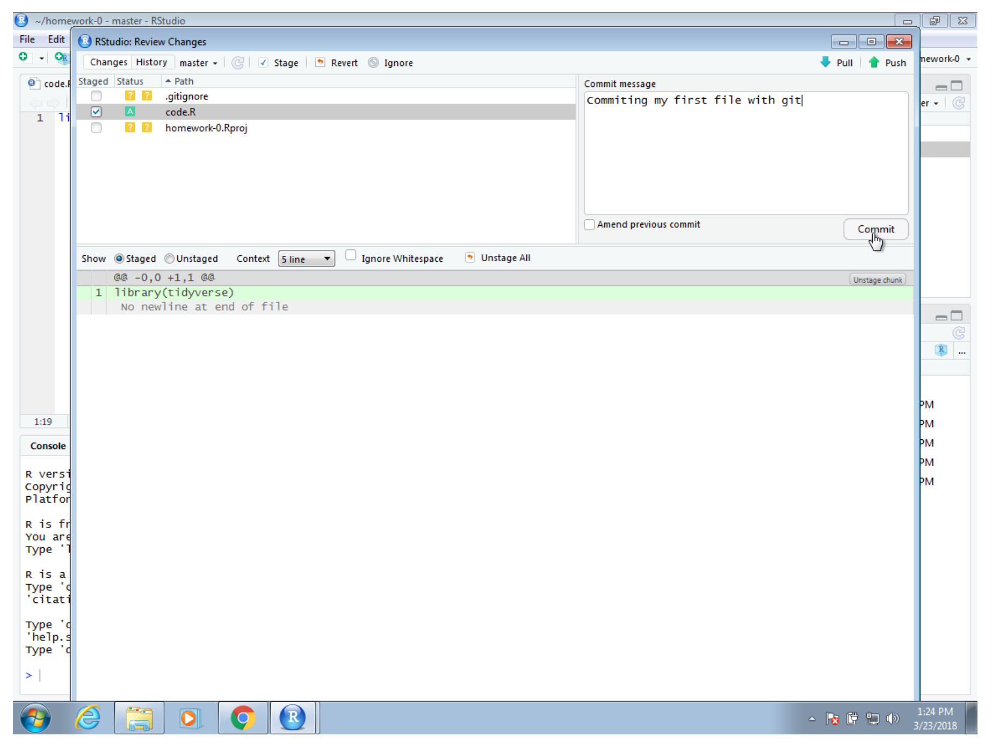
```

In this case, we will simply describe that we are adding a new script. In this dialog box, RStudio also gives you a summary of what you are changing to the GitHub repo. In this case, because it is a new file, the entire file is highlighted as green, which highlights the changes.

Once we hit the commit button, we should see a message from Git with a summary of the changes that were committed. Now we are ready to _push_ these changes to the GitHub repo. We can do this by clicking on the _Push_ button on the top right corner:

```{r, echo=FALSE}
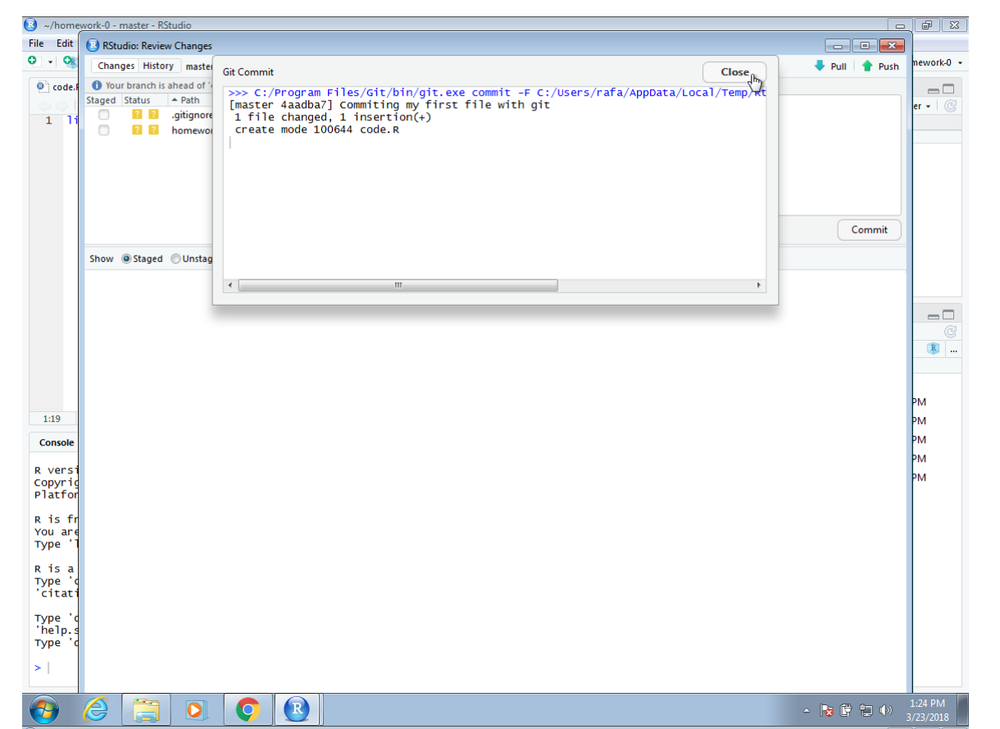
```

```{r, echo=FALSE}
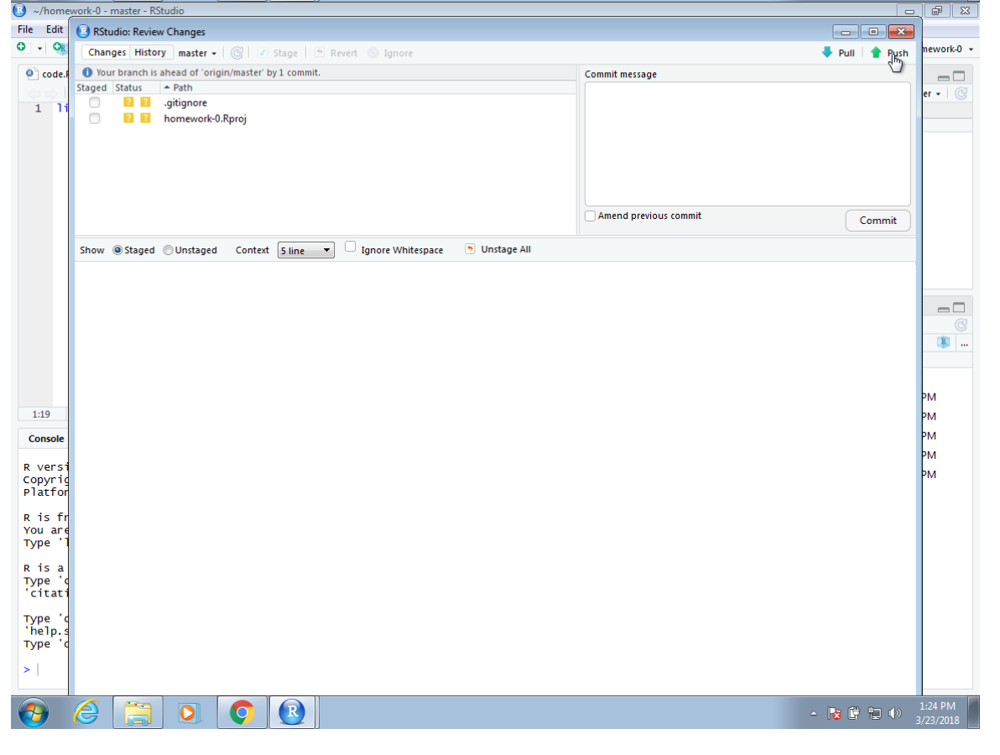
```

We now see a message from Git letting us know that the push has succeeded.
In the pop-up window we no longer see the `code.R` file. This is because no new changes have been performed since we last pushed. We can exit this pop-up window now and continue working on our code.


```{r, echo=FALSE}
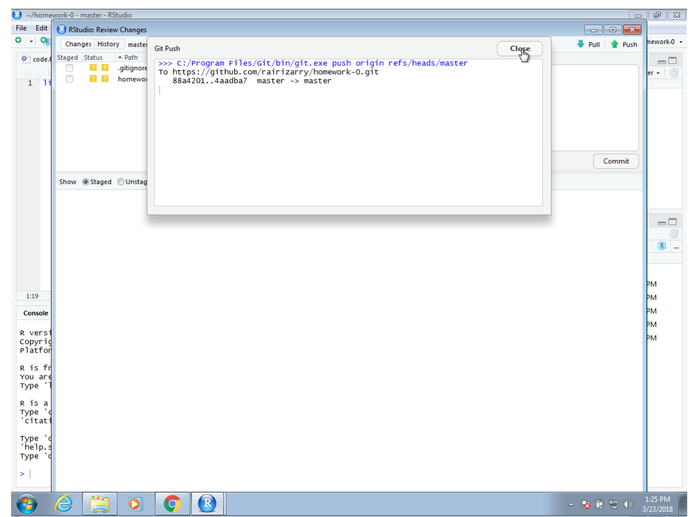
```

```{r, echo=FALSE}
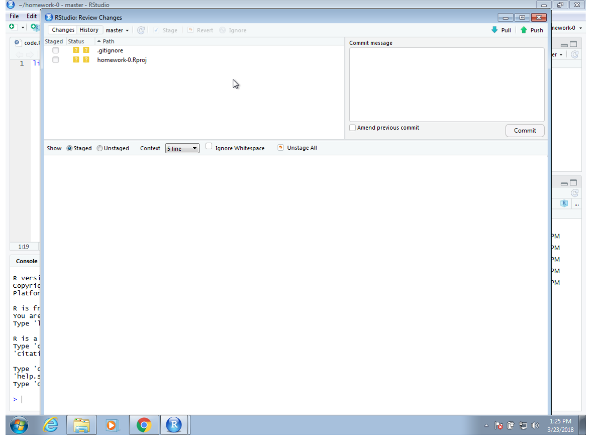
```

If we now visit our repo on the web, we will see that it matches our local copy. 

```{r, echo=FALSE}
knitr::include_graphics("./images/git_22.png")
```

Congratulations, you have successfully shared code on a GitHub repository!

```{r, include=FALSE}
knitr::opts_chunk$set(out.width = NULL, out.extra = NULL)
```


<div class="infobox">
   
  
**Key points:** 

---


- In terminal: configure git 

git config --global user.name "Your Name"
git config --global user.email "your@email.com"

- In RStudio, create project > Version control > Git

- Git pane: status symbols and color

- Git actions: 

  - 1\. **pull**: pull changes from remote repo (if you are in collaboration with others)
  
  - 2\. **add**: stage files for commit; click on stage box under git pane
  
  - 3\. **commit**: commit to the local repo; click on "commit" button under git pane; add a commit message
  
  - 4\. **push**: push to the remote repo on Github

- .gitignore file: details check [https://git-scm.com/docs/gitignore](https://git-scm.com/docs/gitignore)


</div>


### 1.1 Comprehension Check: Installing Software

Insert assessment here

---

## Section 2: Unix
```{r, include=FALSE}
if(knitr::is_html_output()){
  knitr::opts_chunk$set(out.width = "700px", 
                        out.extra='style="display: block; margin-left: auto; margin-right: auto; background-color: #000; padding:3px;"')
} else{
  knitr::opts_chunk$set(out.width = "50%")
}
```
The Unix section discusses the basics of managing your filesystem from the terminal with Unix commands such as `mv` and `rm`. 

There is a two-part graded comprehension check at the end of the section. Part 2 is only available to in-class students.

Below, you will find a summary of Unix commands that will be covered in this section and the Advanced Unix section. The examples here refer to this hypothetical file system. You can download a copy of the image.

<figure>

</figure> 

### Useful Unix Commands

```{r, echo=FALSE}
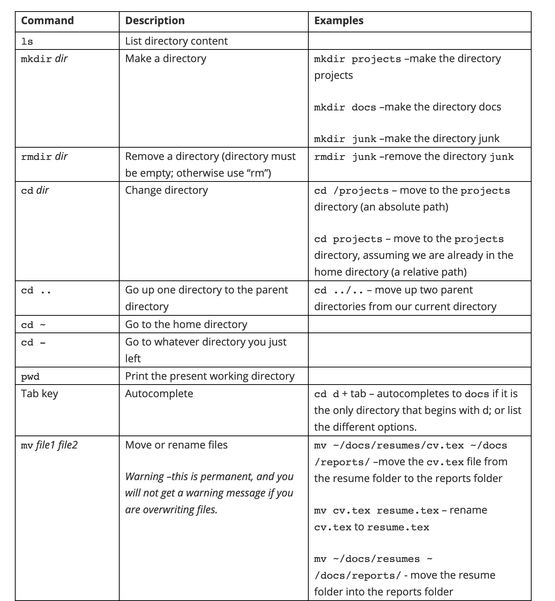
```

```{r, echo=FALSE}
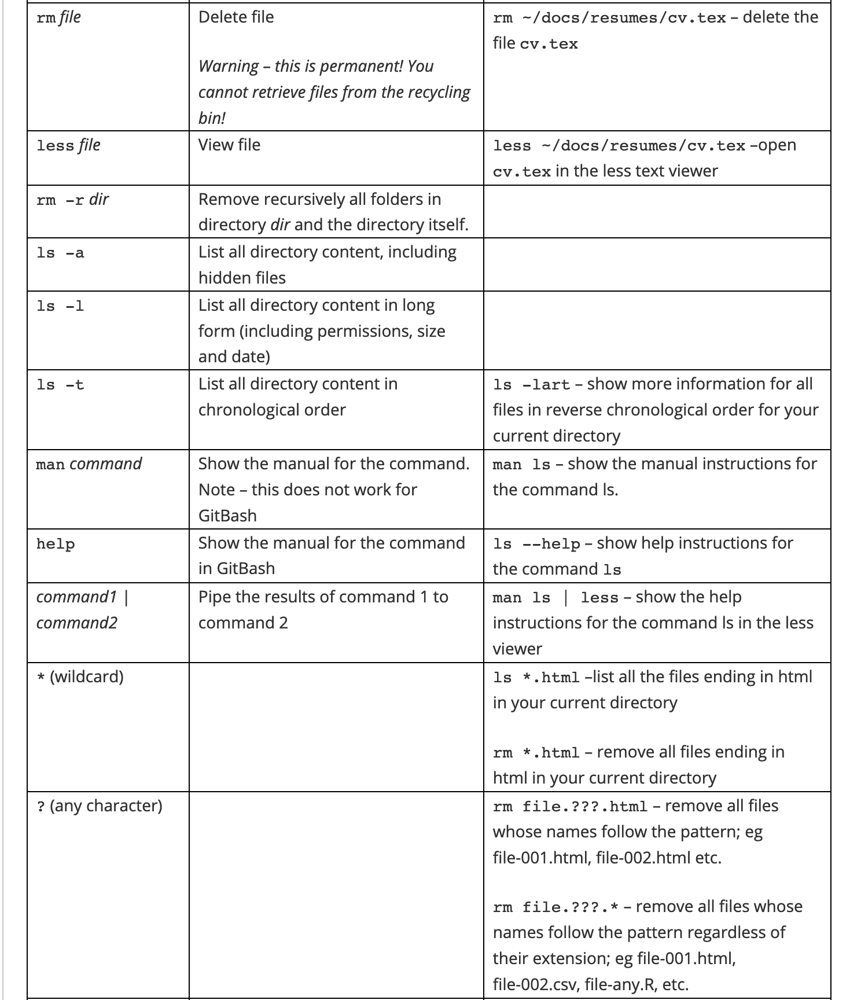
```

```{r, echo=FALSE}
knitr::include_graphics("./images/pic4.png")
```


#### **Absolute path vs. relative path**

A full path specifies the location of a file from the root directory. It is independent of your present directory, and must begin with either a “/” or a “~”. In this example, the full path to our “project-1” file is: 

    /home/projects/project-1

A relative path is the path relative to your present working directory. If our present working directory is the “projects” folder, then the relative path to our “project-1” file is simply: 

    project-1

#### **Path shortcuts**

One period “.” is your current working directory

Two periods “..” is the parent directory (up one from your present working directory) 

A tilde   “~” is your home directory.

#### **More path examples**

1\. Your current working directory is ~/projects and you want to move to the figs directory in the project-1 folder

  - Solution 2: cd ~/projects/project-1/figs (absolute)
  
  - Solution 2:  cd project-1/figs (relative)

2\. Your current working directory is ~/projects and you want to move to the reports folder in the docs directory

  - Solution 1: cd ~/dos/reports (absolute)
  
  - Solution 2: cd ../docs/reports (relative)

3\. Your current working directory is ~/projects/project-1/figs and you want to move to the project-2 folder in the projects directory.

  - Solution 1: cd ~/projects/project-2 (absolute)
  - Solution 2: cd ../../project-2 (relative)


### Organizing with Unix


<div class="infobox">
  
**Textbook link** The content is discussed within the [textbook section - 38. Organizing with Unix](https://rafalab.github.io/dsbook/unix.html).   
  
</div>

Unix is the operating system of choice in data science. We will introduce you to the Unix way of thinking using an example: how to keep a data analysis project organized. We will learn some of the most commonly used commands along the way. However, we won't go into the details here. We highly encourage you to learn more, especially when you find yourself using the mouse too much or performing a repetitive task often. In those cases, there is probably a more efficient way to do it in Unix. Here are some basic courses to get you started:

* [https://www.codecademy.com/learn/learn-the-command-line](https://www.codecademy.com/learn/learn-the-command-line)
* [https://www.edx.org/course/introduction-linux-linuxfoundationx-lfs101x-1](https://www.edx.org/course/introduction-linux-linuxfoundationx-lfs101x-1)
* [https://www.coursera.org/learn/unix](https://www.coursera.org/learn/unix)

There are many [reference books](https://www.quora.com/Which-are-the-best-Unix-Linux-reference-books) as well. [Bite Size Linux](https://gumroad.com/l/bite-size-linux) and [Bite Size Command Line](https://jvns.ca/blog/2018/08/05/new-zine--bite-size-command-line/) are two particularly clear, succinct, and complete examples.

When searching for Unix resources, keep in mind that other terms used to describe what we will learn here are _Linux_, _the shell_ and _the command line_. Basically, what we are learning is a series of commands and a way of thinking that facilitates the organization of files without using the mouse. 

To serve as motivation, we are going to start constructing a directory using Unix tools and RStudio. 

### Naming convention

Before you start organizing projects with Unix you want to pick a name convention that you will use to systematically name your files and directories. This will help you find files and know what is in them.

In general you want to name your files in a way that is related to their contents and specifies how they relate to other files. [The Smithsonian Data Management Best Practices](https://library.si.edu/sites/default/files/tutorial/pdf/filenamingorganizing20180227.pdf) has "five precepts of file naming and organization" and they are:

>> * Have a distinctive, human-readable name that gives an indication of the content.
>> * Follow a consistent pattern that is machine-friendly.
>> * Organize files into directories (when necessary) that follow a consistent pattern.
>> * Avoid repetition of semantic elements among file and directory names.
>> * Have a file extension that matches the file format (no changing extensions!)

For specific recommendations we highly recommend you follow [The Tidyverse Style Guide](https://style.tidyverse.org/).

#### **Resources**
You can learn more about Unix from a number of other resources:

[Codecademy](https://www.codecademy.com/learn/learn-the-command-line)

[Quora list of Linux reference books](https://www.quora.com/Which-are-the-best-Unix-Linux-reference-books)


### The Terminal


<div class="infobox">
  
**Textbook link** The content is discussed within the [textbook section - 38.2 The terminal](https://rafalab.github.io/dsbook/unix.html#the-terminal).  
  
</div>


Instead of clicking, dragging, and dropping to organize our files and folders, we will be typing Unix commands into the terminal. The way we do this is similar to how we type commands into the R console, but instead of generating plots and statistical summaries, we will be organizing files on our system. 

You will need access to a [terminal](https://rafalab.github.io/dsbook/accessing-the-terminal-and-installing-git.html)
Once you have a terminal open, you can start typing commands. You should see a blinking cursor at the spot where what you type will show up. This position is called the _command line_. Once you type something and hit enter on Windows or return on the Mac, Unix will try to execute this command. If you want to try out an example, type this command into your command line:


```{bash, eval=FALSE}
echo "hello world"
```

The command `echo` is similar to `cat` in R. Executing this line should print out `hello world`, then return back to the command line. 

Notice that you can't use the mouse to move around in the terminal. You have to use the keyboard. To go back to a command you previously typed, you can use the up arrow.

Note that above we included a chunk of code showing Unix commands in the same way we have previously shown R commands. We will make sure to distinguish when the command is meant for R and when it is meant for Unix.


<div class="infobox">
   
  
**Key points:** 

---


- The terminal helps to organize files in the system.

- On Mac, use utilities > terminal.

- On windows, use Git bash program.

- Use the keyboard to navigate the command line


</div>


### The Filesystem


<div class="infobox">
  
**Textbook link** The content is discussed within the [textbook section - 38.3 The filesystem](https://rafalab.github.io/dsbook/unix.html#filesystem).  
  
</div>


We refer to all the files, folders, and programs on your computer as _the filesystem_.  Keep in mind that folders and programs are also files, but this is a technicality we rarely think about and ignore in this course. We will focus on files and folders for now and discuss programs, or _executables_, in a later section.

#### **Directories and subdirectories**

The first concept you need to grasp to become a Unix user is how your filesystem is organized. You should think of it as a series of nested folders, each containing files, folders, and executables.

Here is a visual representation of the structure we are describing:


```{r, echo=FALSE}
knitr::include_graphics("./images/filesystem.png")
```


In Unix, we refer to folders as _directories_. Directories that are inside other directories are often referred to as _subdirectories_. So, for example, in the figure above, the directory _docs_ has two subdirectories: _reports_ and _resumes_, and _docs_ is a subdirectory of _home_.

### The home directory 

The _home_ directory is where all your stuff is kept, as opposed to the system files that come with your computer, which are kept elsewhere. In the figure above, the directory called _home_ represents your home directory, but that is rarely the name used. On your system, the name of your home directory is likely the same as your username on that system. Below are an example on Windows and Mac showing a home directory, in this case, named _rafa_:

```{r, echo=FALSE}
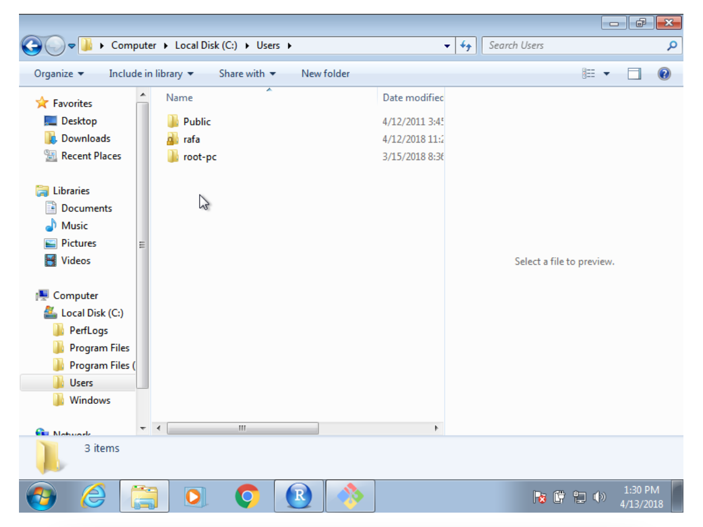
```

```{r, echo=FALSE}
knitr::include_graphics("./images/unix2.png")
```

Now, look back at the figure showing a filesystem. Suppose you are using a point-and-click system and you want to remove the file _cv.tex_. Imagine that on your screen you can see the _home_ directory. To erase this file, you would double click on the _home_ directory, then _docs_, then  _resumes_, and then drag _cv.tex_ to the trash. Here you are experiencing the hierarchical nature of the system: _cv.tex_ is a file inside the _resumes_ directory, which is a subdirectory inside the _docs_ directory, which is a subdirectory of the _home_ directory. 

Now suppose you can't see your home directory on your screen. You would somehow need to make it appear on your screen. One way to do this is to navigate from what is called the _root_ directory all the way to your home directory. Any filesystem will have what is called a _root_ directory, which is the directory that contains all directories. The _home_ directory shown in the figure above will usually be two or more levels from the root. On Windows, you will have a structure like this:

```{r, echo=FALSE}
knitr::include_graphics("./images/windows-filesystem-from-root.png")
```

while on the Mac, it will be like this:

```{r, echo=FALSE}
knitr::include_graphics("./images/mac-filesystem-from-root.png")
```


<div class="infobox">
   
  
**Key points:** 

---


- We refer to all the files, folders, and programs (executables) on your computer as the **filesystem**.
    
- Your filesystem is organized as a series of nested folders each containing files, folders, and executables. (see the visualization in the textbook)
   
- In Unix, folders are referred to as directories and directories that are inside other directories are often referred to as subdirectories. 
    
- The home directory is where all your stuff is kept. There is a hierarchical nature to the file system.

- **Note for Windows Users**: The typical `r rproj()` installation will make your *Documents* directory your home directory in `r rproj()`. This will likely be different from your home directory in Git Bash. Generally, when we discuss home directories, we refer to the Unix home directory which for Windows, in this book, is the Git Bash Unix directory.


</div>


### Working Directory


<div class="infobox">
  
**Textbook link** The content is discussed within the [textbook section - 38.3.3 Working directory](https://rafalab.github.io/dsbook/unix.html#working-directory).  
  
</div>


The concept of a _current location_ is part of the point-and-click experience: at any given moment we are _in a folder_ and see the content of that folder. As you search for a file, as we did above, you are experiencing the concept of a current location: once you double click on a directory, you change locations and are now _in that folder_, as opposed to the folder you were in before.

In Unix, we don't have the same visual cues, but the concept of a _current location_ is indispensable. We refer to this as the _working directory_. Each terminal window you have open has a working directory associated with it.

How do we know what is our working directory? To answer this, we learn our first Unix command: `pwd`, which stands for _print working directory_.  This command returns the working directory.

Open a terminal and type:

```{bash, eval=FALSE}
pwd
```

We do not show the result of running this command because it will be quite different on your system compared to others. If you open a terminal and type `pwd` as your first command, you should see something like `/Users/yourusername` on a Mac or something like `/c/Users/yourusername` on Windows. The character string returned by calling `pwd` represents your working directory. When we first open a terminal, it will start in our home directory so in this case the working directory is the home directory.

Notice that the forward slashes `/` in the strings above separate directories. So, for example, the location `/c/Users/rafa` implies that our working directory is called `rafa` and it is a subdirectory of `Users`, which is a subdirectory of `c`, which is a subdirectory of the root directory. The root directory is therefore represented by just a forward slash: `/`.

#### **Paths**

We refer to the string returned by `pwd` as the _full path_ of the working directory. The name comes from the fact that this string spells out the _path_ you need to follow to get to the directory in question from the root directory. Every directory has a full path. Later, we will learn about _relative paths_, which tell us how to get to a directory from the working directory.

In Unix, we use the shorthand `~` as a nickname for your home directory. So, for example, if `docs` is  a directory in your home directory, the full path for _docs_ can be written like this `~/docs`. 

Most terminals will show the path to your working directory right on the command line. If you are using default settings and open a terminal on the Mac, you will see that right at the command line you have something like `computername:~ username` with `~` representing your working directory, which in this example is the home directory `~`. The same is true for the Git Bash terminal where you will see something like `username@computername MINGW64 ~`, with the working directory at the end. When we change directories, we will see this change on both Macs and Windows.


<div class="infobox">
   
  
**Key points:** 

---


- The working directory is the current location.

- Each terminal window has a working directory associated with it.

- The "pwd" command will display your working directory. The "/" symbol separates directories, while the first "/" at the beginning of the path stands for the root directory. When a path starts with "/", it is a "full path", which finds the current directory from the root directory. "Relative path" will be introduced soon.

- "~" means the home directory.


</div>


### Unix Commands


<div class="infobox">
  
**Textbook link** The content is discussed within the [textbook section - 38.4 Unix commands](https://rafalab.github.io/dsbook/unix.html#unix-commands). 
  
</div>


We will now learn a series of Unix commands that will permit us to prepare a directory for a data science project. We also provide examples of commands that, if you type into your terminal, will return an error. This is because we are assuming the filesystem in the earlier diagram. Your filesystem is different. In the next section, we will provide examples that you can type in. 

### `ls`: Listing directory content

In a point-and-click system, we know what is in a directory because we see it. In the terminal, we do not see the icons. Instead, we use the command `ls` to list the directory content. 

To see the content of your home directory, open a terminal and type:

```{bash, eval=FALSE}
ls
```

We will see more examples soon.

### `mkdir` and `rmdir`: make and remove a directory

When we are preparing for a data science project, we will need to create directories. In Unix, we can do this with the command `mkdir`, which stands for _make directory_. 

Because you will soon be working on several projects, we highly recommend creating a directory called _projects_ in your home directory. 

You can try this particular example on your system. Open a terminal and type:

```{bash, eval=FALSE}
mkdir projects
```

If you do this correctly, nothing will happen: no news is good news. If the directory already exists, you will get an error message and the existing directory will remain untouched.

To confirm that you created these directories, you can list the directories:

```{bash, eval=FALSE}
ls
```
You should see the directories we just created listed. Perhaps you can also see many other directories that come pre-installed on your computer.

For illustrative purposes, let's make a few more directories. You can list more than one directory name like this:

```{bash, eval=FALSE}
mkdir docs teaching
```

You can check to see if the three directories were created:

```{bash, eval=FALSE}
ls
```

If you made a mistake and need to remove the directory, you can use the command `rmdir` to remove it. 


```{bash, eval=FALSE}
mkdir junk
rmdir junk
```

This will remove the directory as long as it is empty. If it is not empty, you will get an error message and the directory will remain untouched. To remove directories that are not empty, we will learn about the command `rm` later.

### `cd`: navigating the filesystem by changing directories

Next we want to create directories inside directories that we have already created. We also want to avoid pointing and clicking our way through the filesystem. We explain how to do this in Unix, using the command line. 

Suppose we open a terminal and our working directory is our home directory. We want to change our working directory to `projects`. We do this using the `cd` command, which stands for _change directory_:

```{bash, eval=FALSE}
cd projects
```

To check that the working directory changed, we can use a command we previously learned to see our location:
```{bash, eval=FALSE}
pwd
```

Our working directory should now be `~/projects`. Note that on your computer the home directory `~` will be spelled out to something like `/c/Users/yourusername`). 

**Important Pro Tip**: In Unix you can auto-complete by hitting tab. This means that we can type `cd d` then hit tab. Unix will either auto-complete if `docs` is the only directory/file starting with `d` or show you the options. Try it out! Using Unix without auto-complete will make it unbearable. 

When using `cd`, we can either type a full path, which will start with `/` or `~`, or a _relative path_. In the example above, in which we typed `cd projects`, we used a relative path. **If the path you type does not start with `/` or `~`, Unix will assume you are typing a relative path, meaning that it will look for the directory in your current working directory**. So something like this will give you an error:

```{bash, eval=FALSE}
cd Users
```

because there is no `Users` directory in your working directory.

Now suppose we want to move back to the directory in which `projects` is a subdirectory, referred to as the _parent directory_. We could use the full path of the parent directory, but Unix provides a shortcut for this: the parent directory of the working directory is represented with two dots: `..`, so to move back we simply type:

```{bash, eval=FALSE}
cd ..
```

You should now be back in your home directory which you can confirm using `pwd`. 

Because we can use full paths with `cd`, the following command:
```{bash, eval=FALSE}
cd ~
```

will always take us back to the home directory, no matter where we are in the filesystem. 

The working directory also has a nickname, which is a single `.`, so if you type

```{bash, eval=FALSE}
cd .
```

you will not move. Although this particular use of `.` is not useful, this nickname does come in handy sometimes. The reasons are not relevant for this section, but you should still be aware of this fact.

In summary, we have learned that when using `cd` we either stay put, move to a new directory using the desired directory name, or move back to the parent directory using `..`.

When typing directory names, we can concatenate directories with the forward-slashes. So if we want a command that takes us to the `projects` directory no matter where we are in the filesystem, we can type:

```{bash, eval=FALSE}
cd ~/projects
```

which is equivalent to writing the entire path out. For example, in Windows we would write something like

```{bash, eval=FALSE}
cd /c/Users/yourusername/projects
```

The last two commands are equivalent and in both cases we are typing the full path.


When typing out the path of the directory we want, either full or relative, we can concatenate directories with the forward-slashes. We already saw that we can move to the `projects` directory regardless of where we are by typing the full path like this:  

```{bash, eval=FALSE}
cd ~/projects
```


We can also concatenate directory names for relative paths. For instance, if we want to move back to the parent directory of the parent directory of the working directory, we can type:

```{bash, eval=FALSE}
cd ../..
```

Here are a couple of final tips related to the  `cd` command. First, you can go back to whatever directory you just left by typing:

```{bash, eval=FALSE}
cd -
```

This can be useful if you type a very long path and then realize you want to go back to where you were, and that too has a very long path.

Second, if you just type: 

```{bash, eval=FALSE}
cd
```

you will be returned to your home directory.


### Some examples

Let's explore some examples of using `cd`. To help visualize, we will show the graphical representation of our filesystem vertically:

```{r, echo=FALSE}
knitr::include_graphics("./images/filesystem-vertical.png")
```
Suppose our working directory is `~/projects` and we want to move to `figs` in `project-1`.

Here it is convenient to use relative paths:

```{bash, eval=FALSE}
cd project-1/figs
```

Now suppose our working directory is `~/projects` and we want to move to `reports` in `docs`, how can we do this?

One way is to use relative paths:

```{bash, eval=FALSE}
cd ../docs/reports
```

Another is to use the full path:

```{bash, eval=FALSE}
cd ~/docs/reports
```

If you are trying this out on your system, remember to use auto-complete.

Let's examine one more example. Suppose we are in `~/projects/project-1/figs` and want to change to `~/projects/project-2`. Again, there are two ways.

With relative paths:

```{bash, eval=FALSE}
cd ../../proejct-2
```

and with full paths:

```{bash, eval=FALSE}
cd ~/projects/project-2
```


<div class="infobox">
   
  
**Key points:** 

---


- navigate the file system with commands introduced in this section.

- Auto-complete paths, commands and file names with the "Tab" key.

**Code**

    ls #list dir content
    mkdir folder_name #create directory called "folder_name"
    rmdir folder_name  #remove an empty directory as long as it is empty
    rm -r folder_name  #remove dir that is not empty, "r" stands for recursive
    cd: change dir
    ../ # two dots represents parent dir
    . # single dot represents current workingdir 
    cd ~/projects # concatenate with forward slashes
    cd ../.. # change to two parent layer beyond
    cd -  # whatever dir you were before
    cd  # return to the home dir
    
</div>


### mv and rm: Moving and Removing Files


<div class="infobox">
  
**Textbook link** The content is discussed within the [textbook section - 38.6 More Unix commands](https://rafalab.github.io/dsbook/unix.html#more-unix-commands).  
  
</div>


#### **`mv`: moving files**

In a point-and-click system, we move files from one directory to another by dragging and dropping. In Unix, we use the `mv` command. 

**Warning**: `mv` will not ask "are you sure?" if your move results in overwriting a file.  

Now that you know how to use full and relative paths, using `mv` is relatively straightforward. The general form is:

```{bash, eval=FALSE}
mv path-to-file path-to-destination-directory
```

For example, if we want to move the file `cv.tex` from `resumes` to `reports`, you could use the full paths like this:

```{bash, eval=FALSE}
mv ~/docs/resumes/cv.tex ~/docs/reports/
```

You can also use relative paths. So you could do this:

```{bash, eval=FALSE}
cd ~/docs/resumes
mv cv.tex ../reports/
```

or this:

```{bash, eval=FALSE}
cd ~/docs/reports/
mv ../resumes/cv.tex ./
```

Notice that in the last one we used the working directory shortcut `.` to give a relative path as the destination directory.

We can also use `mv` to change the name of a file. To do this, instead of the second argument being the destination directory, it also includes a filename. So, for example, to change the name from `cv.tex` to `resume.tex`, we simply type:

```{bash, eval=FALSE}
cd ~/docs/resumes
mv cv.tex resume.tex
```

We can also combine the move and a rename. For example:


```{bash, eval=FALSE}
cd ~/docs/resumes
mv cv.tex ../reports/resume.tex
```

And we can move entire directories. To move the `resumes` directory into `reports`, we do as follows:


```{bash, eval=FALSE}
mv ~/docs/resumes ~/docs/reports/
```

It is important to add the last `/` to make it clear you do not want to rename the `resumes` directory to `reports`, but rather move it into the `reports` directory.

#### **`cp`: copying files**

The command `cp` behaves similar to `mv` except instead of moving, we copy the file, meaning that the original file stays untouched.

So in all the `mv` examples above, you can switch `mv` to `cp` and they will copy instead of move with one exception: we can't copy entire directories without learning about arguments, which we do later.

#### **`rm`: removing files**

In point-and-click systems, we remove files by dragging and dropping them into the trash or using a special click on the mouse. In Unix, we use the `rm` command. 
**Warning**: Unlike throwing files into the trash, `rm` is permanent. Be careful!

The general way it works is as follows:
```{bash, eval=FALSE}
rm filename
```

You can actually list files as well like this:

```{bash, eval=FALSE}
rm filename-1 filename-2 filename-3
```

You can use full or relative paths. To remove directories, you will have to learn about arguments, which we do later.
 


<div class="infobox">
   
  
**Key points:** 

---


- The mv command moves files.

- **[warning]** mv will not ask you to confirm the move, and it could potentially overwrite a file.

- The rm command removes files.

- **[warning]** rm is permanent, which is different than throwing a folder in the trash

**Code**

    mv path-to-file path-to-destination-directory    
    rm filename-1 filename-2 filename-3
    
</div>


### less: Looking at a File


<div class="infobox">
  
**Textbook link** The content is discussed within the [textbook section - 38.6.4 less: looking at a file](https://rafalab.github.io/dsbook/unix.html#less-looking-at-a-file). 
  
</div>

Often you want to quickly look at the content of a file. If this file is a text file, the quickest way to do is by using the command `less`. To look a the file `cv.tex`, you do this:  

```{bash, eval=FALSE}
cd ~/docs/resumes
less cv.tex 
```

To exit the viewer, you type `q`. If the files are long, you can use the arrow keys to move up and down. There are many other keyboard commands you can use within `less` to, for example, search or jump pages. You will learn more about this in a later section. If you are wondering why the command is called `less`, it is because the original was called `more`, as in "show me more of this file". The second version was called `less` because of the saying "less is more".


<div class="infobox">
   
  
**Key points:** 

---


- less allows you to quickly look at the content of a file

- Use q to exit the less page

- use the arrows to navigate in the less page


**Code**

    less cv.tex
    
</div>


### Preparing for a Data Science Project


<div class="infobox">
  
**Textbook link** The content is discussed within the [textbook section - 38.7 Preparing for a data science project](https://rafalab.github.io/dsbook/unix.html#prep-project). 
  
</div>


We are now ready to prepare a directory for a project. We will use the [US murders project](https://github.com/rairizarry/murders) as an example. 

You should start by creating a directory where you will keep all your projects. We recommend a directory called _projects_ in your home directory. To do this you would type:

```{bash, eval=FALSE}
cd ~
mkdir projects
```

Our project relates to gun violence murders so we will call the directory for our project `murders`. It will be a subdirectory in our projects directories. In the `murders` directory, we will create two subdirectories to hold the raw data and intermediate data. We will call these `data` and `rda`, respectively. 

Open a terminal and make sure you are in the home directory:

```{bash, eval=FALSE}
cd ~
```

Now run the following commands to create the directory structure we want. At the end, we use `ls` and `pwd` to confirm we have generated the correct directories in the correct working directory:

```{bash, eval=FALSE}
cd projects
mkdir murders
cd murders
mkdir data rdas 
ls
pwd
```

Note that the full path of our `murders` dataset is `~/projects/murders`. 

So if we open a new terminal and want to navigate into that directory we type:

```{bash, eval=FALSE}
cd projects/murders
```

### Create directories in Unix

In the previous Section we demonstrated how to use Unix to prepare for a data science project using an example. Here we continue this example and show how to use RStudio. We have already created the following directories using Unix:

```{bash, eval=FALSE}
cd ~
cd projects
mkdir murders
cd murders
mkdir data rdas 
```


#### **Create an RStudio project**

In the next section we will use this directory to create an RStudio project. In RStudio we go to _File_ and then _New Project..._ and when given the options we pick _Existing Directory_. We then write the full path of the `murders` directory created above.

```{r, echo=FALSE}
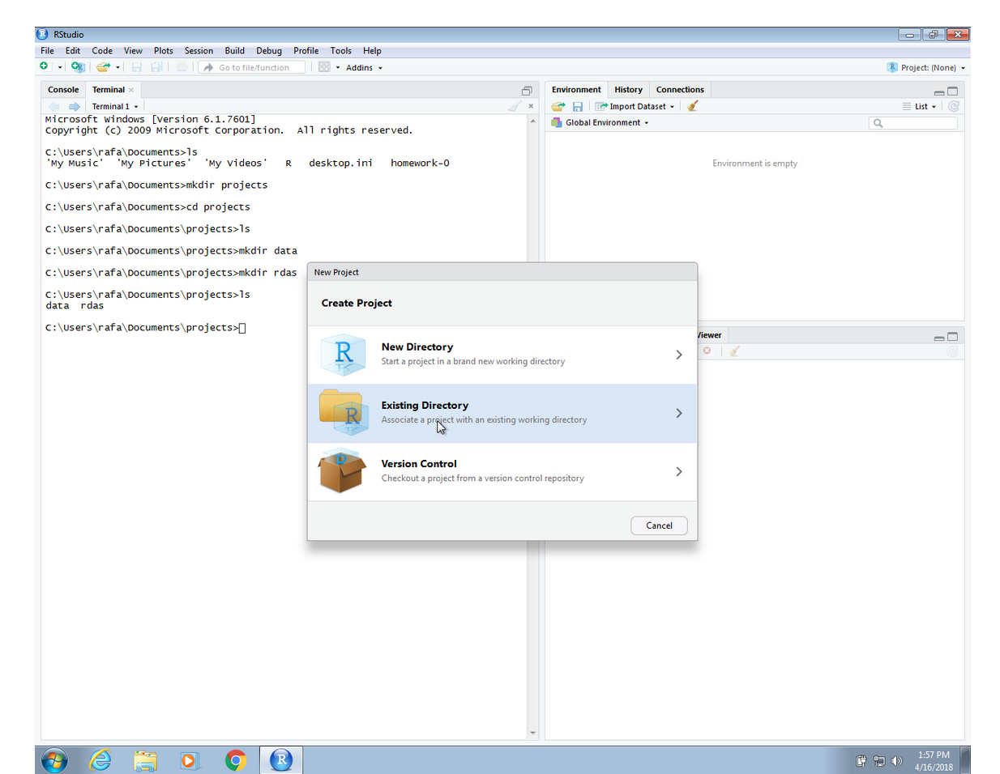
```

```{r, echo=FALSE}
knitr::include_graphics("./images/RStudioProj_2.png")
```


Once you do this, you will see the `rdas` and `data` directories you created in the RStudio _Files_ tab.

```{r, echo=FALSE}
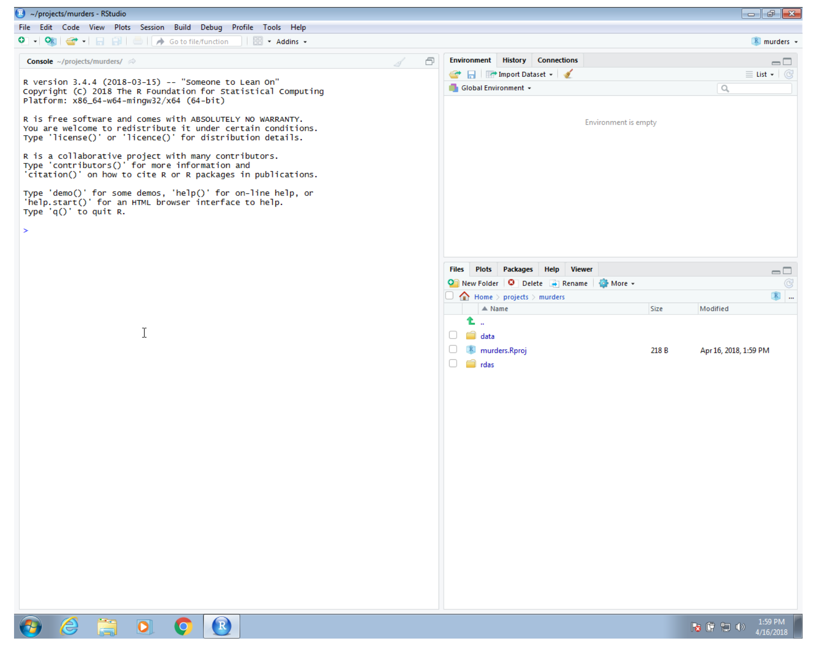
```

Keep in mind that when we are in this project, our default working directory will be `~/projects/murders`. You can confirm this by typing `getwd()` into your R session. This is important because it will help us organize the code when we need to write file paths. 
**Pro tip: always use relative paths in code for data science projects. These should be relative to the default working directory.** The problem with using full paths is that your code is unlikely to work on filesystems other than yours since the directory structures will be different. This includes using the home directory `~` as part of your path.


### Edit some R scripts

Let's now write a script that downloads a file into the data directory. We will call this file `download-data.R`. 

The content of this file will be:

```{r, eval=FALSE}
url <- "https://raw.githubusercontent.com/rafalab/dslabs/master/inst/
extdata/murders.csv"
dest_file <- "data/murders.csv"
download.file(url, destfile = dest_file)
```

Notice that we are using the relative path `data/murders.csv`. 

Run this code in R and you will see that a file is added to the `data` directory. 

Now we are ready to write a script to read this data and prepare a table that we can use for analysis. Call the file `wrangle-data.R`. The content of this file will be:

```{r, eval=FALSE}
library(tidyverse)
murders <- read_csv("data/murders.csv")
murders <-murders %>% mutate(region = factor(region),
                             rate = total / population * 10^5)
save(murders, file = "rdas/murders.rda")
```

Again note that we use relative paths exclusively. 

In this file, we introduce an R command we have not seen: `save`. The `save` command in R saves objects into what is called an _rda file_: _rda_ is short for R data. We recommend using the `.rda` suffix on files saving R objects. You will see that `.RData` is also used. 

If you run this code above, the processed data object will be saved in a file in the `rda` directory. Although not the case here, this approach is often practical because generating the data object we use for final analyses and plots can be a complex and time-consuming process. So we run this process once and save the file. But we still want to be able to generate the entire analysis from the raw data.

Now we are ready to write the analysis file. Let's call it `analysis.R`. The content should be the following:

```{r, eval=FALSE}
library(tidyverse)
load("rdas/murders.rda")

murders %>% mutate(abb = reorder(abb, rate)) %>%
  ggplot(aes(abb, rate)) +
  geom_bar(width = 0.5, stat = "identity", color = "black") +
  coord_flip()
```

If you run this analysis, you will see that it generates a plot. 

### Create some more directories using Unix

Now suppose we want to save the generated plot for use in a report or presentation. We can do this with the __ggplot__ command `ggsave`. But where do we put the graph? We should be systematically organized so we will save plots to a directory called `figs`. Start by creating a directory by typing the following in the terminal:


```{bash, eval=FALSE}
mkdir figs
```

and then you can add the line: 

```{r, eval=FALSE}
ggsave("figs/barplot.png")
```

to your R script. If you run the script now, a png file will be saved into the `figs` directory. If we wanted to copy that file to some other directory where we are developing a presentation, we can avoid using the mouse by using the `cp` command in our terminal.

### Add a README file

You now have a self-contained analysis in one directory. One final recommendation is to create a `README.txt` file describing what each of these files does for the benefit of others reading your code, including your future self. This would not be a script but just some notes. One of the options provided when opening a new file in RStudio is a text file. You can save something like this into the text file:

```
We analyze US gun murder data collected by the FBI.

download-data.R - Downloads csv file to data directory

wrangle-data.R - Creates a derived dataset and saves as R object in rdas
directory

analysis.R - A plot is generated and saved in the figs directory.
```


<div class="infobox">
   
  
**Key points:** 

---


- Ideally, files (code, data, output) should be structured and self-contained

- In a project, we prefer using relative paths (path relative to the default working directory) instead of the full path so that code can run smoothly on other individual's computers.

- It is good practice to write a README.txt file to introduce the file structure to facilitate collaboration and for your future reference.


**Code**

    ########### In terminal ###########
    cd ~    # move to home directory
    mkdir projects    # make a new directory called projects
    cd projects    # move to ~/projects directory
    mkdir murders    # make new directory called murders inside of projects
    cd murders    # move to ~/projects/murders/
    mkdir data rda    # make two new directories, one is data the other is rda folder
    ls    # to check if we indeed have one data folder and one rda folder
    pwd    # check the current working directory
    mkdir figs    # make a directory called figs to store figures

    ########## In RStudio ########
    # pick existing directory as new project
    getwd()    # to confirm current working directory
    save()    # save into .rda file, .RData is also fine but less preferred
    ggsave("figs/barplot.png")    # save a plot generated by ggplot2 to a dir called "figs"
    
</div>


### 2 Comprehension Check Part 1: Basic Unix

Insert assessment here


### 2 Comprehension Check Part 2 

Insert assessment here


## Section 3: Reproducible Reports

The Reproducible Reports section guides you through how to create data science reports using R Markdown and the knitr package.

There is a graded comprehension check at the end of the section.

We will use this [example GitHub repository](https://github.com/rairizarry/murders) throughout.


### Reproducible Reports with R Markdown


<div class="infobox">
  
**Textbook link** The content is discussed within the [textbook section - 40. Reproducible projects with RStudio and R markdown](https://rafalab.github.io/dsbook/reproducible-projects-with-rstudio-and-r-markdown.html). 
  
</div>


The final product of a data analysis project is often a report. Many scientific publications can be thought of as a final report of a data analysis. The same is true for news articles based on data, an analysis report for your company, or lecture notes for a class on how to analyze data. The reports are often on paper or in a PDF that includes a textual description of the findings along with some figures and tables resulting from the analysis. 

Imagine that after you finish the analysis and the report, you are told that you were given the wrong dataset, you are sent a new one and you are asked to run the same analysis with this new dataset. Or what if you realize that a mistake was made and need to re-examine the code, fix the error, and re-run the analysis? Or imagine that someone you are training wants to see the code and be able to reproduce the results to learn about your approach? 

Situations like the ones just described are actually quite common for a data scientist. Here, we describe how you can keep your data science projects organized with RStudio so that re-running an analysis is straight-forward. We then demonstrate how to generate reproducible reports with R markdown and the __knitR__ package in a way that will greatly help with recreating reports with minimal work. This is possible due to the fact that R markdown documents permit code and textual descriptions to be combined into the same document, and the figures and tables produced by the code are automatically added to the document. 


<div class="infobox">
   
  
**Key points:** 

---


- The final output is usually a report, textual descriptions and figures, and tables.
    
- The aim is to generate a reproducible report in R markdown and knitr.
    
- Features of Rmarkdown: code and text can be combined to the same document and figures and tables are automatically added to the file.

    
</div>


### R Markdown


<div class="infobox">
  
**Textbook link** The content is discussed within the [textbook section - 40.2 R markdown](https://rafalab.github.io/dsbook/reproducible-projects-with-rstudio-and-r-markdown.html#r-markdown). 
  
</div>


R markdown is a format for _literate programming_ documents. It is based on _markdown_, a markup language that is widely used to generate html pages. You can learn more about markdown here: [https://www.markdowntutorial.com/](https://www.markdowntutorial.com/). Literate programming weaves instructions, documentation, and detailed comments in between machine executable code, producing a document that describes the program that is best for human understanding (Knuth 1984). Unlike a word processor, such as Microsoft Word, where what you see is what you get, with R markdown, you need to _compile_ the document into the final report. The R markdown document looks different than the final product. This seems like a disadvantage at first, but it is not because, for example, instead of producing plots and inserting them one by one into the word processing document, the plots are automatically added. 

In RStudio, you can start an R markdown document by clicking on _File_, _New File_, the _R Markdown_. You will then be asked to enter a title and author for your document. We are going to prepare a report on gun murders so we will give it an appropriate name. You can also decide what format you would like the final report to be in: HTML, PDF, or Microsoft Word. Later, we can easily change this, but here we select html as it is the preferred format for debugging purposes:


```{r, echo=FALSE}
knitr::include_graphics("./images/RMarkdown_1.png")
```

```{r, echo=FALSE}
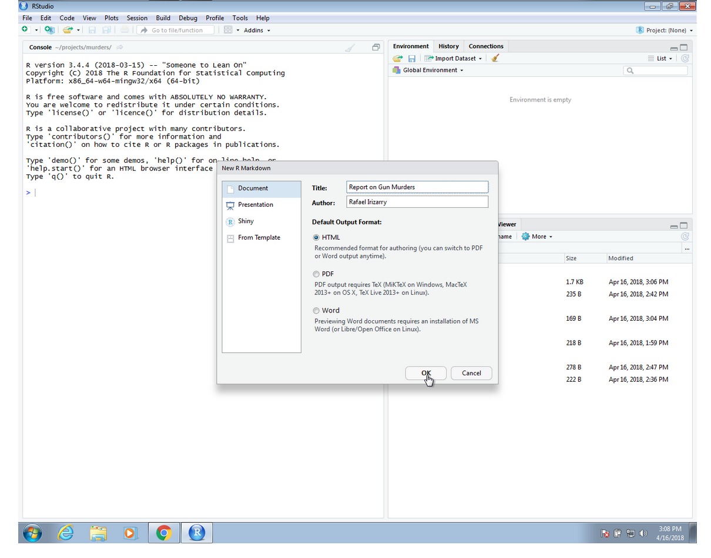
```

This will generate a template file:

```{r, echo=FALSE}
knitr::include_graphics("./images/RMarkdown_3.png")
```

As a convention, we use the `Rmd` suffix for these files.

Once you gain experience with R Markdown, you will be able to do this without the template and can simply start from a blank template.

In the template, you will see several things to note.


### The header

At the top you see:


<figure>
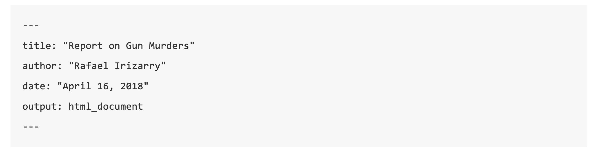
</figure> 


The things between the `---` is the header. We actually don't need a header, but it is often useful. You can define many other things in the header than what is included in the template. We don't discuss those here, but much information is available online. The one parameter that we will highlight is `output`. By changing this to, say, `pdf_document`, we can control the type of output that is produced when we compile. 

### R code chunks

In various places in the document, we see something like this:

<figure>

</figure> 

These are the code chunks. When you compile the document, the R code inside the chunk, in this case `summary(pressure)`, will be evaluated and the result included in that position in the final document. 

To add your own R chunks, you can type the characters above quickly with the key binding command-option-I on the Mac and Ctrl-Alt-I on Windows.

This applies to plots as well; the plot will be placed in that position. We can write something like this:

<figure>

</figure> 

By default, the code will show up as well. To avoid having the code show up, you can use an argument. To avoid this, you can use the argument `echo=FALSE`. For example:

<figure>
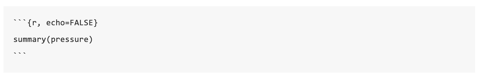
</figure> 


We recommend getting into the habit of adding a label to the R code chunks. This will be very useful when debugging, among other situations. You do this by adding a descriptive word like this:


<figure>

</figure> 


#### **Useful links**

You can learn more about R Markdown at [markdowntutorial.com](markdowntutorial.com)

The [code for the sample report](https://raw.githubusercontent.com/rairizarry/murders/master/report.Rmd) is available.


<div class="infobox">
   
  
**Key points:** 

---


- R Markdown is a format for *literate programming* documents. Literate programming weaves instructions, documentation and detailed comments in between machine executable code, producing a document that describes the program that is best for human understanding.


- Start an R markdown document by clicking on File > New File > the R Markdown

- The output could be HTML, PDF, or Microsoft Word, which can be changed in the header output, e.g. pdf_document / html_document/p>

    
</div>


### knitr


<div class="infobox">
  
**Textbook link** The content is discussed within the [textbook section - 40.2.4 knitR](https://rafalab.github.io/dsbook/reproducible-projects-with-rstudio-and-r-markdown.html#knitr). 
  
</div>


We use the __knitR__ package to compile R markdown documents. The specific function used to compile is the `knit` function, which takes a filename as input.  RStudio provides a button that makes it easier to compile the document. For the screenshot below, we have edited the document so that a report on gun murders is produced. You can see the file here: [https://raw.githubusercontent.com/rairizarry/murders/master/report.Rmd](https://raw.githubusercontent.com/rairizarry/murders/master/report.Rmd). You can now click on the `Knit` button:

```{r, echo=FALSE}
knitr::include_graphics("./images/knitr_1.png")
```


The first time you click on the _Knit_ button, a dialog box may appear asking you to install packages you need.

Once you have installed the packages, clicking the _Knit_ will compile your R markdown file and the resulting document will pop up:


This produces an html document which you can see in your working directory. To view it, open a terminal and list the files. You can open the file in a browser and use this to present your analysis. You can also produce a PDF or Microsoft document by changing: 

`output: html_document` to `output: pdf_document` or `output: word_document`. 

We can also produce documents that render on GitHub using `output: github_document`.

This will produce a markdown file, with suffix `md`, that renders in GitHub. Because we have uploaded these files to GitHub, you can click on the `md` file and you will see the report as a webpage:

```{r, echo=FALSE}
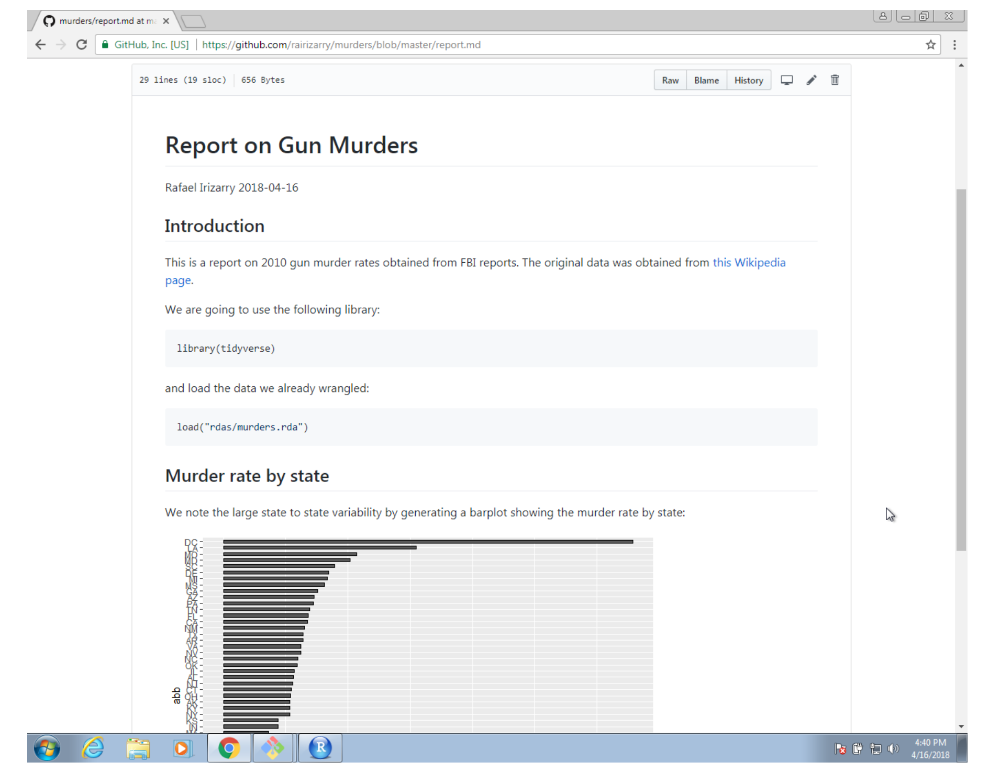
```

This is a convenient way to share your reports.

#### **More on R markdown**

There is a lot more you can do with R markdown. We highly recommend you continue learning as you gain more experience writing reports in R. There are many free resources on the internet including:

* RStudio's tutorial: [https://rmarkdown.rstudio.com](https://rmarkdown.rstudio.com)
* The cheat sheet: [https://www.rstudio.com/wp-content/uploads/2015/02/rmarkdown-cheatsheet.pdf](https://www.rstudio.com/wp-content/uploads/2015/02/rmarkdown-cheatsheet.pdf)
* The knitR book: [https://yihui.name/knitr/](https://yihui.name/knitr/)


<div class="infobox">
   
  
**Key points:** 

---


- The **knitr** package is used to compile R markdown documents.

- The first time you click the "knit" button on the editor pane a pop-up window will prompt you to install packages, but after that is completed, the button will automatically knit your document.

- github_document gives a .md file, which will give the best presentation on GitHub

**Code**

    output: html_document 
    output: pdf_document 
    output: word_document
    output: github_document

    
</div>


### 3 Comprehension Check: Reproducible Reports

Insert assessment here


## Section 4 Overview

In this section on Git and GitHub, you will learn to clone and create version-controlled GitHub repositories using the command line. 

There is a graded comprehension check at the end of the section.


### Git and GitHub


<div class="infobox">
  
**Textbook link** The content is discussed within the [textbook section - 39.1 Why use Git and GitHub?](https://rafalab.github.io/dsbook/git.html#why-use-git-and-github).  
  
</div>

#### **Why use Git and GitHub?**

There are three main reasons to use Git and GitHub.

1\. Sharing: Even if we do not take advantage of the advanced and powerful version control functionality, we can still use Git and GitHub to share our code.

2\. Collaborating: Once you set up a central repo, you can have multiple people make changes to code and keep versions synched. GitHub provides a free service for centralized repos. GitHub also has a special utility, called a _pull request_, that can be used by anybody to suggest changes to your code. You can easily either accept or deny the request.

3\. Version control: The version control capabilities of Git permit us to keep track of changes we make to our code. We can also revert back to previous versions of files. Git also permits us to create _branches_ in which we can test out ideas, then decide if we _merge_ the new branch with the original.

Here we focus on the sharing aspects of Git and GitHub and refer the reader to the links above to learn more about this powerful tool.

We have already shown how we can do this with RStudio.Here we focus on the sharing aspects of Git and GitHub,and we refer to the links we just showed to learn more about this powerful tool.To effectively permit version control and collaboration, in Git files move across four different areas shown here. But how does it all get started? There are two ways to do this. We can clone an existing repo or initialize a new one. We will try the first approach first.

#### **Additional Git and GitHub resources:**

- [Codecademy](https://www.codecademy.com/learn/learn-git)

- [GitHub Guides](https://guides.github.com/activities/hello-world/)

- [Try Git tutorial](https://try.github.io/)

- [Happy Git and GitHub for the useR](https://happygitwithr.com/)


<div class="infobox">
   
  
**Key points:** 

---


- Next, we will learn how to use Git and GitHub in the command line.

- Reasons to use Git and GitHub:

  - Version-control: Permits us to keep track of changes we made to code, to revert back to previous versions of files, to test ideas using new branches and decide if we want to merge to the original.
        
  - Collaboration: On a centralized repo, multiple people may make changes to the code and keep versions synced. A pull request allows anyone to suggest changes to your code.
    
  - Sharing code

- To effectively permit version control and collaboration, files move across four different areas: Working Directory, Staging Area, Local Repository, and Upstream Repository.

- Start your Git journey with either cloning an existing repo, or initializing a new one.

    
</div>


### Using Git at the Command Line


<div class="infobox">
  
**Textbook link** The content is discussed within the [textbook section - 39.4 Overview of Git](https://rafalab.github.io/dsbook/git.html#git-overview).   
  
</div>


The main actions in Git are to: 

1\. **pull** changes from the remote repo, in this case the GitHub repo

2\. **add** files, or as we say in the Git lingo _stage_ files

3\. **commit** changes to the local repo

4\. **push** changes to the _remote_ repo, in our case the GitHub repo

To effectively permit version control and collaboration in Git, files move across four different areas: 

```{r, echo=FALSE}
knitr::include_graphics("./images/git-layout.png")
```

But how does it all get started? There are two ways: we can clone an existing repo or initialize one. We will explore cloning first.
 
### Clone

We are going to _clone_ an existing _Upstream Repository_. You can see it on GitHub here: [https://github.com/rairizarry/murders](https://github.com/rairizarry/murders). By visiting this page, you can see multiple files and directories. This is the Upstream Repository. By clicking the green clone button, we can copy the repo's URL `https://github.com/rairizarry/murders.git`. 

But what does _clone_ mean? Rather than download all these files to your computer, we are going to actually copy the entire Git structure, which means we will add the files and directories to each of the three local stages: Working Directory, Staging Area, and Local Repository. When you clone, all three are exactly the same to start. 

You can quickly see an example of this by doing the following. Open a terminal and type:


```{r, echo=FALSE}
wd <- getwd() ##so we set back later. We are about to start switching dirs
if(file.exists("git-example")) unlink("git-example", recursive=TRUE, force = TRUE)
```


<figure>
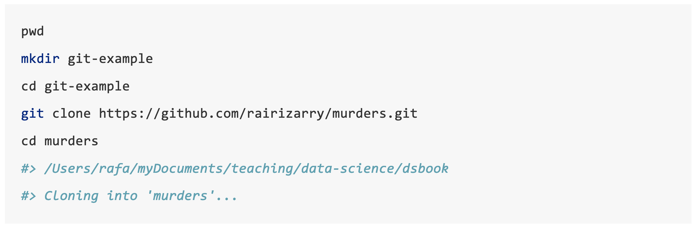
</figure> 

You now have cloned a GitHub repo and have a working Git directory, with all the files, on your system.

<figure>

</figure> 


```{r, echo=FALSE}
knitr::include_graphics("./images/git-clone.png")
```

The _Working Directory_ is the same as your Unix working directory. When you edit files using an editor such as RStudio, you change the files in this area and only in this area. Git can tell you how these files relate to the versions of the files in other areas with the command `git status`:


```{r, echo=FALSE}
knitr::include_graphics("./images/git-status.png")
```

If you check the status now, you will see that nothing has changed and you get the following message:

<figure>
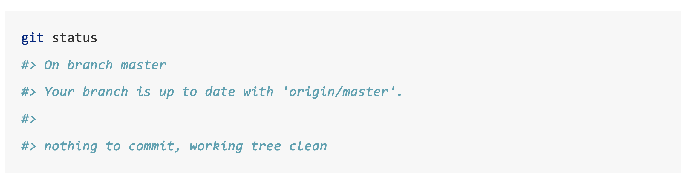
</figure> 

Now we are going to make changes to these files. Eventually, we want these new versions of the files to be tracked and synched with the upstream repo. But we don't want to keep track of every little change: we don't want to sync until we are sure these versions are final enough to share. For this reason, edits in the staging area are not kept by the version control system.

To demonstrate, we add a file to the staging area with the `git add` command. Below we create a file using the Unix `echo` command just as an example (in reality you would use RStudio):

```{bash}
echo "test" >> new-file.txt
```

We are also adding a temporary file that we do not want to track at all:

```{bash}
echo "temporary" >> tmp.txt
```

Now we can stage the file we eventually want to add to our repository:

<figure>

</figure> 

Notice what the status says now:

<figure>

</figure> 


```{r, echo=FALSE}
knitr::include_graphics("./images//git-add.png")
```

Because `new-file.txt` is staged, the current version of the file will get added to the local repository next time we commit, which we do as follows:

<figure>

</figure> 


We have now changed the local repo, which you can confirm using

```{bash, eval=FALSE}
git status
```


```{r, echo=FALSE}
knitr::include_graphics("./images/git-commit.png")
```

However, if we edit that file again, it changes only in the working directory. To add to the local repo, we need to stage it and commit the changes that are added to the local repo:

```{bash, eval=FALSE}
echo "adding a line" >> new-file.txt
git add new-file.txt
git commit -m "adding a new line to new-file"
```

Note that this step is often unnecessary in our uses of Git. We can skip the staging part if we add the file name to the commit command like this:

```{bash, eval=FALSE}
echo "adding a second line" >> new-file.txt
git commit -m "minor change to new-file" new-file.txt
```

We can keep track of all the changes we have made with: 

```{bash, eval=FALSE}
git log new-file.txt
```

To keep everything synced, the final step is to push the changes to the upstream repo. This is done with the `git push` command like this:

```{bash, eval=FALSE}
git push
```

```{r, include=FALSE}
knitr::opts_knit$set(root.dir = wd)
```

```{r, echo=FALSE}
knitr::include_graphics("./images/git-push.png")
```

However, in this particular example, you will not be able to do this because you do not have permission to edit the upstream repo. If this was your repo, you could.

If this is a collaborative project, the upstream repo may change and become different than our version. To update our local repository to be like the upstream repo, we use the command `fetch`:

```{bash, eval=FALSE}
git fetch
```


```{r, echo=FALSE}
knitr::include_graphics("./images/git-fetch.png")
```


And then to make these copies to the staging and working directory areas, we use the command:

```{bash, eval=FALSE}
git merge
```


```{r, echo=FALSE}
knitr::include_graphics("./images/git-merge.png")
```

However, we often just want to change both with one command. For this, we use: 

```{bash, eval=FALSE}
git pull
```


```{r, echo=FALSE}
knitr::include_graphics("./images/git-pull.png")
```


We have already learned in a previous Section how RStudio has buttons to do all this. The details provided here should help you understand what happens in the background.


#### **Resources link**

Explore the [repository discussed in this section](https://github.com/rairizarry/murders).


<div class="infobox">
   
  
**Key points:** 

---


Recap: there are four stages: working directory, staging area, local repository, and upstream repository
    
Clone an existing upstream repository (copy repo url from clone button, and type "git clone <url>"), and all three local stages are the same as upstream remote.

The working directory is the same as the working directory in Rstudio. When we edit files we only change the files in this place.

    git status: tells how the files in the working directory are related to the files in other stages

edits in the staging area are not tracked by the version control system by default - we add a file to the staging area by git add command
    
    git commit: to commit files from the staging area to local repository, we need to add a message stating what we are doing by git commit -m "something"

    git log: keeps track of all the changes we have made to the local repository

    git push: allows moving from the local repository to upstream repository, only if you have the permission (e.g. if it is yours)

    git fetch: update local repository to  be like the upstream repository, from upstream to local

    git merge: make the updated local sync with the working directory and staging area

To change everything in one shot (from upstream to working dir), use git pull (equivalent to combining git fetch + git merge)


**Code**

    pwd
    mkdir git-example
    cd git-example
    git clone https://github.com/rairizarry/murders.git
    cd murders
    ls
    git status
    echo "test" >> new-file.txt
    echo "temporary" >> tmp.txt
    git add new-file.txt
    git status
    git commit -m "adding a new file" 
    git status
    echo "adding a second line" >> new-file.txt
    git commit -m "minor change to new-file" new-file.txt
    git status
    git add
    git log new-file.txt
    git push
    git fetch
    git merge

    
</div>


### Creating a GitHub Repository


<div class="infobox">
  
**Textbook link** The content is discussed within the [textbook section - 39.5 Initializing a Git directory](https://rafalab.github.io/dsbook/git.html#init). 
  
</div>


Now let's learn the second way we can get started: by initializing a directory on our own computer rather than cloning.

Suppose we already have a populated local directory and we want to turn this directory into a collaborative GitHub repository. The most efficient way of achieving this is by  _initializing_ the local directory.

To demonstrate how to do this we will initialize the gun murders directory we created in a previous Section. Note that we already created a directory with several subdirectories on our computer but we do not yet have a Git local repo or GitHub upstream repo.

We start by creating a new repo on our GitHub page. We click on the _New_ button:


```{r, echo=FALSE}
knitr::include_graphics("./images/git_23.png") 
```

```{r, echo=FALSE}
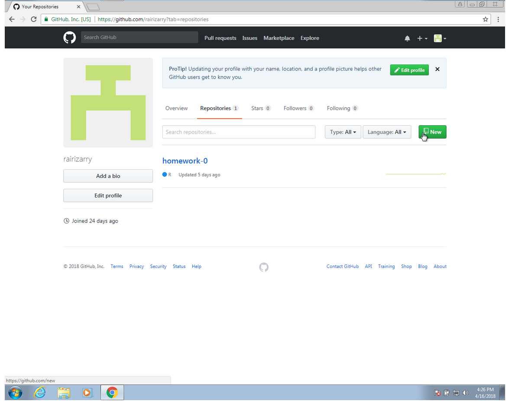 
```

We call it `murders` here to match the name of the directory on our local system. But if you are doing this for another project, please choose an appropriate name.

```{r, echo=FALSE}
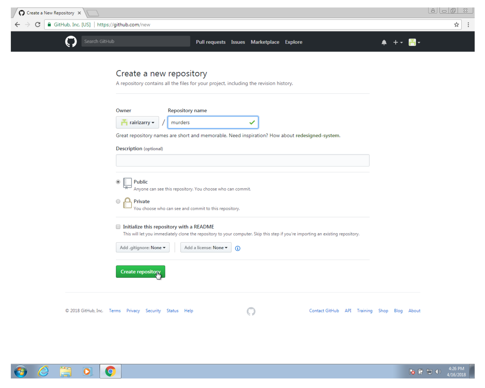 
```

We then get a series of instructions on how to get started, but we can instead use what we have learned. The main thing we need from this page is to copy the repo's URL, in this case: `https://github.com/rairizarry/murders.git`. 

At this moment, we can start a terminal and `cd` into our local projects directory. In our example, it would be:

```{bash, eval=FALSE}
cd ~/projects/murders
```

We then _intialize_ the directory. This turns the directory into a Git directory and Git starts tracking:

```{bash, eval=FALSE}
git init
```

All the files are now **only** in our working directory; no files are in our local repo or on GitHub. 

The next step is to connect the local repo with the GitHub repo. In a previous example, we had RStudio do this for us. Now we need to do it ourselves. We can by adding any of the files and committing it: 

```{bash, eval=FALSE}
git add README.txt
git commit -m "First commit. Adding README.txt file just to get started"
```

We now have a file in our local repo and can connect it to the upstream repo, which has url: `https://github.com/rairizarry/murders.git`. 

To do this, we use the command `git remote add`. 

```{bash, eval=FALSE}
git remote add origin `https://github.com/rairizarry/murders.git`
```

We can now use `git push` since there is a connection to an upstream repo:

```{bash, eval=FALSE}
git push
```

In the textbook [(Section - 40.3 Organizing a data science project)](https://rafalab.github.io/dsbook/reproducible-projects-with-rstudio-and-r-markdown.html#organizing) we continue to work with this example, as we demonstrate how we can use RStudio to work with Git and keep a project synced on GitHub.


```{r, echo=FALSE}
if(file.exists("git-example")) unlink("git-example", recursive=TRUE, force = TRUE)
```


### Using Git and GitHub in RStudio

While command line Git is a powerful and flexible tool, it can be somewhat daunting when we are getting started. RStudio provides a graphical interface that facilitates the use of Git in the context of a data analysis project. We describe how to use this RStudio feature to do this here.

Now we are ready to start an RStudio project that uses version control and stores the code on a GitHub repo. To do this, we start a project but, instead of _New Directory_, we will select _Version Control_ and then we will select _Git_ as our version control system:

```{r, echo=FALSE}
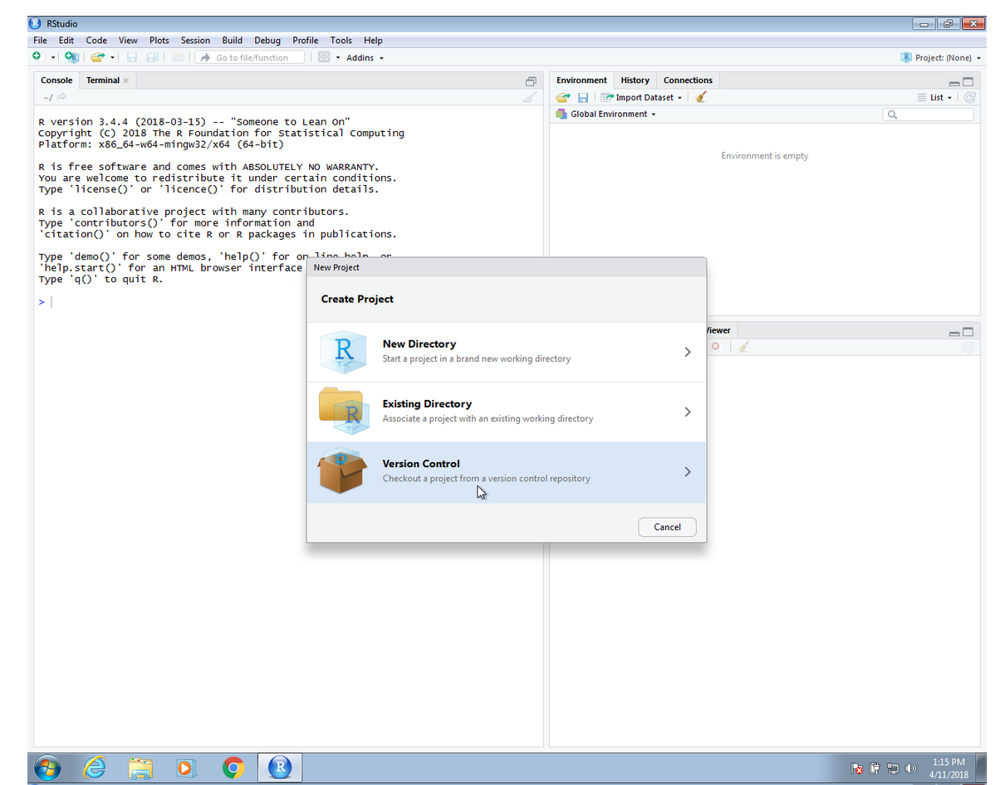 
```

```{r, echo=FALSE}
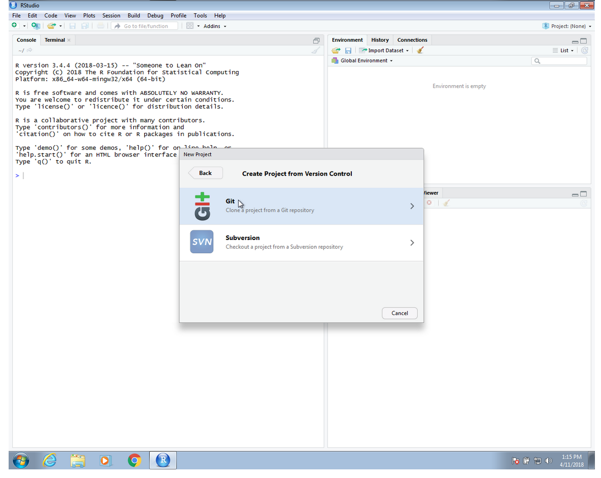 
```

The repository URL is the link you used to clone. In the textbook [(Section - 39.3 GitHub repositories)](https://rafalab.github.io/dsbook/git.html#github-repos), we used `https://github.com/username/homework-0.git` as an example. In the project directory name, you need to put the name of the folder that was generated, which in our example will be the name of the repo `homework-0`. This will create a folder called `homework-0` on your local system. Once you do this, the project is created and it is aware of the connection to a GitHub repo. You will see on the top right corner the name and type of project as well as a new tab on the upper right pane titled _Git_. 


```{r, echo=FALSE}
knitr::include_graphics("./images/git_28.png") 
```

```{r, echo=FALSE}
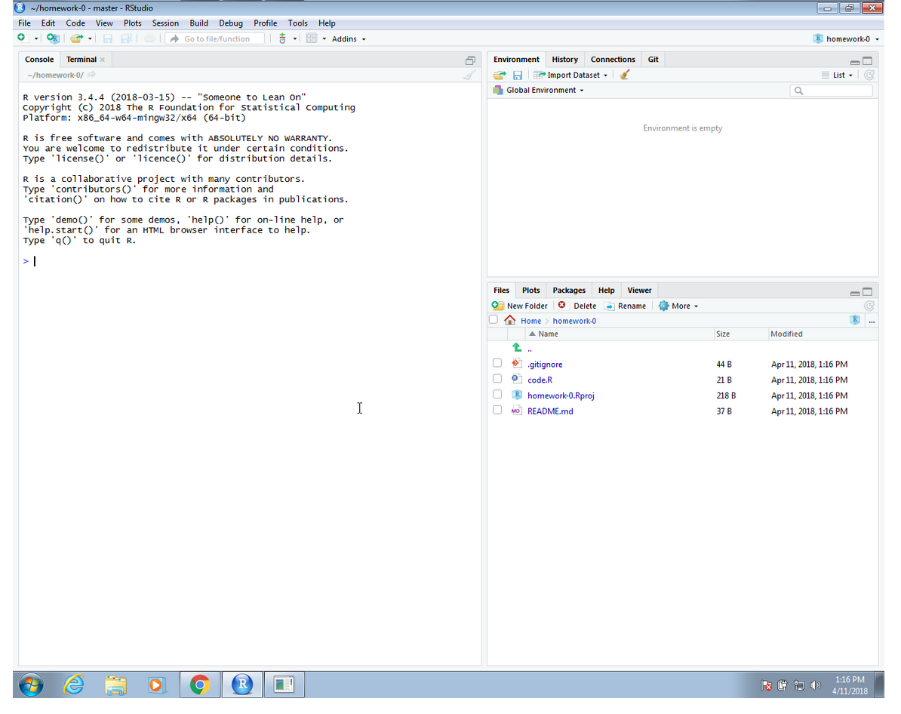 
```

If you select this tab, it will show you the files on your project with some icons that give you information about these files and their relationship to the repo. In the example below, we already added a file to the folder, called _code.R_ which you can see in the editing pane.

```{r, echo=FALSE}
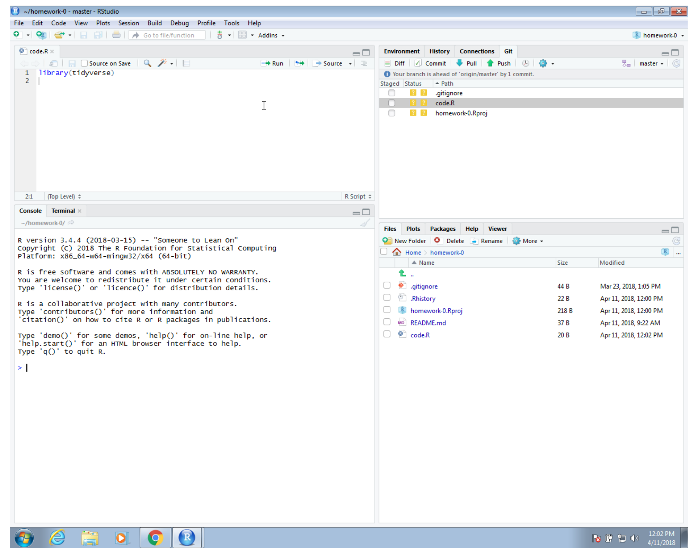 
```

We now need to pay attention to the Git pane. It is important to know that **your local files and the GitHub repo will not be synced automatically**.  As described in the textbook [(Section - 39.4 Overview of Git)](https://rafalab.github.io/dsbook/git.html#git-overview), you have to sync using git push when you are ready. We show you can do this through RStudio rather than the terminal below. 

Before we start working on a collaborative project, usually the first thing we do is _pull_ in the changes from the remote repo, in our case the one on GitHub. However, for the example shown here, since we are starting with an empty repo and we are the only ones making changes, we don't need to start by pulling.

In RStudio, the status of the file as it relates to the remote and local repos are represented in the status symbols with colors. A yellow square means that Git knows nothing about this file. To sync with the GitHub repo, we need to _add_ the file, then _commit_ the change to our local Git repo, then _push_ the change to the GitHub repo. Right now, the file is just on our computer. To add the file using RStudio, we click the _Stage_ box. You will see that the status icon now changes to a green A. 


```{r, echo=FALSE}
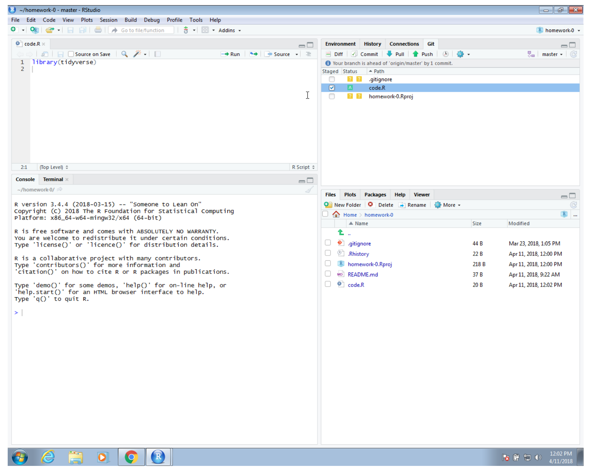 
```

Note: we are only adding the _code.R_ file. We don't necessarily need to add all the files in our local repo to the GitHub repo, only the ones we want to keep track of or the ones we want to share. If our work is producing files of a certain type that we do not want to keep track of, we can add the suffix that defines these files to the .gitignore file. More details on using .gitignore are included here: [https://git-scm.com/docs/gitignore](https://git-scm.com/docs/gitignore). These files will stop appearing in your RStudio Git pane. For the example shown here, we will only be adding _code.R_. But, in general, for an RStudio project, we recommend adding both the .gitignore and .Rproj files.

Now we are ready to commit the file to our local repo. In RStudio, we can use the _Commit_ button. This will open a new dialog window. With Git, whenever we commit a change, we are required to enter a comment describing the changes being _committed_. 

```{r, echo=FALSE}
knitr::include_graphics("./images/git_32.png") 
```

In this case, we will simply describe that we are adding a new script. In this dialog box, RStudio also gives you a summary of what you are changing to the GitHub repo. In this case, because it is a new file, the entire file is highlighted as green, which highlights the changes.

Once we hit the commit button, we should see a message from Git with a summary of the changes that were committed. Now we are ready to _push_ these changes to the GitHub repo. We can do this by clicking on the _Push_ button on the top right corner:

```{r, echo=FALSE}
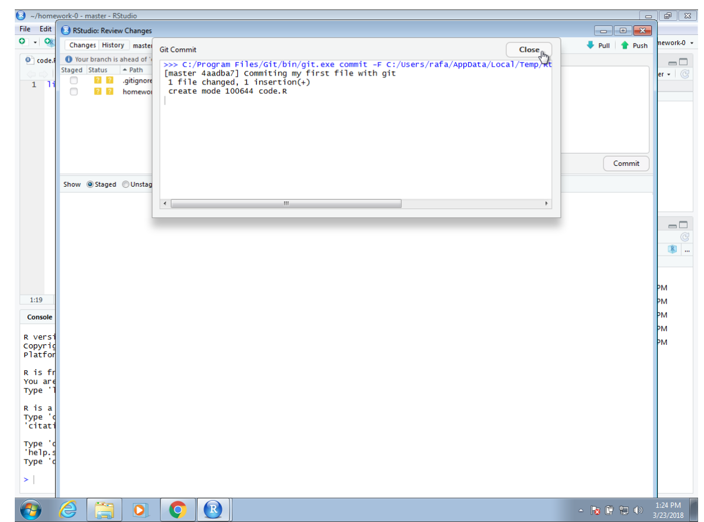 
```

```{r, echo=FALSE}
knitr::include_graphics("./images/git_34.png") 
```

We now see a message from Git letting us know that the push has succeeded.
In the pop-up window we no longer see the `code.R` file. This is because no new changes have been performed since we last pushed. We can exit this pop-up window now and continue working on our code.


```{r, echo=FALSE}
knitr::include_graphics("./images/git_35.png") 
```

```{r, echo=FALSE}
knitr::include_graphics("./images/git_36.png") 
```

If we now visit our repo on the web, we will see that it matches our local copy. 

```{r, echo=FALSE}
knitr::include_graphics("./images/git_37.png") 
```

Congratulations, you have successfully shared code on a GitHub repository!

```{r, include=FALSE}
knitr::opts_chunk$set(out.width = NULL, out.extra = NULL)
```


<div class="infobox">
   
  
**Key points:** 

---


- Recap: two ways to get started, one is cloning an existing repository, the other is initializing our own

- Create our own project on our computer (independent of Git) on our own machine

- Create an upstream repo on Github, copy repo's url

- Make a local git repository: On the local machine, in the project directory, use git init. 
- Now git starts tracking everything in the local repo.

- Now we need to start moving files into our local repo and connect local repo to the upstream remote by  git remote add origin <url>

- **Note:** The first time you push to a new repository, you may also need to use these git push options: git push --set-upstream origin master. If you need to run these arguments but forget to do so, you will get an error with a reminder.


**Code**

    cd ~/projects/murders
    git init
    git add README.txt
    git commit -m "First commit. Adding README.txt file just to get started"
    git remote add origin "https://github.com/rairizarry/murders.git"
    git push    # you may need to add these arguments the first time: --set-upstream origin master

    
</div>


### 4. Comprehension Check: Git and GitHub

Insert assessment here


## Section 5 Overview

In Section 5, you will learn additional useful Unix commands, including arguments, getting help, pipes, and wildcards that are all helpful in data science.

There is a two-part graded comprehension check at the end of the section


### Advanced Unix: Arguments


<div class="infobox">
  
**Textbook link** The content is discussed within the [textbook section -  38.8.1 Arguments](https://rafalab.github.io/dsbook/unix.html#arguments). 
  
</div>


Most Unix implementations include a large number of powerful tools and utilities. We have just learned the very basics here. We recommend that you use Unix as your main file management tool. It will take time to become comfortable with it, but as you struggle, you will find yourself learning just by looking up solutions on the internet. In this section, we superficially cover slightly more advanced topics. The main purpose of the section is to make you aware of what is available rather than explain everything in detail.

### Arguments

Most Unix commands can be run with arguments. Arguments are typically defined by using a dash `-` or two dashes `--` (depending on the command) followed by a letter or a word. An example of an argument is the `-r` behind `rm`. The `r` stands for recursive and the result is that files and directories are removed recursively, which means that if you type:

```{bash, eval=FALSE}
rm -r directory-name
```

all files, subdirectories, files in subdirectories, subdirectories in subdirectories, and so on, will be removed. This is equivalent to throwing a folder in the trash, except you can't recover it. Once you remove it, it is deleted for good.  Often, when you are removing directories, you will encounter files that are protected. In such cases, you can use the argument `-f` which stands for `force`. 

You can also combine arguments. For instance, to remove a directory regardless of protected files, you type:

```{bash, eval=FALSE}
rm -rf directory-name
```

Remember that once you remove there is no going back, so use this command very carefully.

A command that is often called with argument is `ls`. Here are some examples:

```{bash, eval=FALSE}
ls -a 
```

The `a` stands for all. This argument makes `ls` show you all files in the directory, including hidden files. In Unix, all files starting with a `.` are hidden. Many applications create hidden directories to store important information without getting in the way of your work. An example is `git` (which we cover in depth later). Once you initialize a directory as a git directory with `git init`, a hidden directory called `.git` is created. Another hidden file is the `.gitignore` file. 

Another example of using an argument is:
 
```{bash, eval=FALSE}
ls -l 
```

The `l` stands for long and the result is that more information about the files is shown.

It is often useful to see files in chronological order. For that we use:

```{bash, eval=FALSE}
ls -t 
```

and to reverse the order of how files are shown you can use:

```{bash, eval=FALSE}
ls -r 
```

We can combine all these arguments to show more information for all files in reverse chronological order:

```{bash, eval=FALSE}
ls -lart 
```

Each command has a different set of arguments. In the next section, we learn how to find out what they each do.


<div class="infobox">
   
  
**Key points:** 

---


- Arguments typically are defined using a dash (-) or two dashes (--) followed by a letter of a word.

- r: recursive. For example, rm -r <directory-name>: remove all files, subdirectories, files in subdirectories, subdirectories in subdirectories, etc.

- Combine arguments: rm -rf directory-name
    
- ls -a: Shows all files in the directories including hidden files (e.g. .git file when initializing using git init) (a for all).

- ls -l: Returns more information about the files (i.e. l for long).

- ls -t: Shows files in chronological order.

- ls -r: Reverses the order of how files are shown.

- ls -lart: Shows more information for all files in reverse chronological order.

    
</div>


### Advanced Unix: Getting Help and Pipes


<div class="infobox">
  
**Textbook link** The content is discussed within the [textbook section - 38.8.2 Getting help](https://rafalab.github.io/dsbook/unix.html#getting-help) and [textbook section - 38.8.3 Pipes](https://rafalab.github.io/dsbook/unix.html#pipes).
  
</div>


As you may have noticed, Unix uses an extreme version of abbreviations. This makes it very efficient, but hard to guess how to call commands. To make up for this weakness, Unix includes complete help files or _man pages_ (man is short for manual). In most systems, you can type `man` followed by the command name to get help. So for `ls`, we would type:

```{bash, eval=FALSE}
man ls
```

This command is not available in some of the compact implementations of Unix, such as Git Bash. An alternative way to get help that works on Git Bash is to type the command followed by `--help`. So for `ls`, it would be as follows:

```{bash, eval=FALSE}
ls --help
```

### Pipes

The help pages are typically long and if you type the commands above to see the help, it scrolls all the way to the end. It would be useful if we could save the help to a file and then use `less` to see it. The `pipe`, written like this `|`, does something similar. It _pipes_ the results of a command to the command after the `pipe`. This is similar to the pipe `%>%` that we use in R. To get more help we thus can type:

```{bash, eval=FALSE}
man ls | less
```

or in Git Bash:

```{bash, eval=FALSE}
ls --help | less 
```

This is also useful when listing files with many files. We can type:

```{bash, eval=FALSE}
ls -lart | less 
```


<div class="infobox">
   
  
**Key points:** 

---


- **Getting Help:** Use man + command name to get help (e.g. man ls). Note that it is not available for Git Bash. For Git Bash, you can use command -- help (e.g. ls --help).

- **Pipes:** Pipes the results of a command to the command after the pipe. Similar to the pipe %>% in R. For example, man ls | less (and its equivalent in Git Bash: ls --help | less). Also useful when listing files with many files (e.g ls -lart | less).

    
</div>


### Advanced Unix: Wild cards


<div class="infobox">
  
**Textbook link** The content is discussed within the [textbook section - 38.8.4 Wild cards](https://rafalab.github.io/dsbook/unix.html#wild-cards) in Unix.
  
</div>


Some of the most powerful aspects of Unix are the _wild cards_. Suppose we want to remove all the temporary html files produced while trouble shooting for a project. Imagine there are dozens of files. It would be quite painful to remove them one by one. In Unix, we can actually write an expression that means all the files that end in `.html`. To do this we type _wild card_: `*`. As discussed in the data wrangling part of this course, this character means any number of any combination of characters. Specifically, to list all html files, we would type:

```{bash, eval=FALSE}
ls *.html
```

To remove all html files in a directory, we would type:

```{r, eval=FALSE}
rm *.html
```

The other useful wild card is the `?` symbol. This means any single character. So if all the files we want to erase have the form 
`file-001.html` with the numbers going from 1 to 999, we can type:

```{bash, eval=FALSE}
rm file-???.html
```

This will only remove files with that format. 

We can combine wild cards. For example, to remove all files with the name `file-001` regardless of suffix, we can type:


```{bash, eval=FALSE}
rm file-001.* 
```

__Warning: Combining rm with the `*` wild card can be dangerous. There are combinations of these commands that will erase your entire filesystem without asking "are you sure?". Make sure you understand how it works before using this wild card with the rm command.__


<div class="infobox">
   
  
**Key points:** 

---


- ( * ) means any number of any combination of characters. Specifically, to list all html files: ls * .html and to remove all html files in a directory: rm *.html.

- ? means any single character. For example, to erase all files in the  form file-001.html with the numbers going from 1 to 999: rm file-???.html.

- Combined wild cards: rm file-001.* to remove all files of the name file-001 regardless of suffix.

- **Warning: Combining rm with the * wild card can be dangerous. There are combinations of these commands that will erase your entire file system without asking you for confirmation. Make sure you understand how it works before using this wild card with the rm command.**

    
</div>


### Advanced Unix: Environment Variables and Shells


<div class="infobox">
  
**Textbook link** The content is discussed within the [textbook section - 38.8.5 Environment variables](https://rafalab.github.io/dsbook/unix.html#environment-variables) and [textbook section - 38.8.6 Shells](https://rafalab.github.io/dsbook/unix.html#shells). 
  
</div>


Unix has settings that affect your command line _environment_. These are called environment variables. The home directory is one of them. We can actually change some of these. In Unix, variables are distinguished from other entities by adding a `$` in front. The home directory is stored in `$HOME`.

Earlier we saw that `echo` is the Unix command for print. So we can see our home directory by typing:

```{bash, eval=FALSE}
echo $HOME 
```

You can see them all by typing:

```{bash, eval=FALSE}
env
```

You can change some of these environment variables. But their names vary across different _shells_. We describe shells in the next section.

### Shells

Much of what we use in this section is part of what is called the _Unix shell_. There are actually different shells, but the differences are almost unnoticeable.  They are also important, although we do not cover those here. You can see what shell you are using by typing:

```{bash, eval=FALSE}
echo $SHELL
```

The most common one is `bash`.

Once you know the shell, you can change environmental variables. In Bash Shell, we do it using `export variable value`. To change the path, described in more detail soon, type: (**Don't actually run this command though!**)

```{bash, eval=FALSE}
export PATH = /usr/bin/
```

There is a program that is run before each terminal starts where you can edit variables so they change whenever you call the terminal. This changes in different implementations, but if using bash, you can create a file called  `.bashrc`, `.bash_profile`,`.bash_login`, or `.profile`. You might already have one. 


<div class="infobox">
   
  
**Key points:** 

---


- In Unix, variables are distinguished from other entities by adding a $ in front. For example, the home directory is stored in $HOME.
    
- See home directory: echo $HOME

- See them all: env   

- See what shell is being used: echo $SHELL (most common shell is bash)

- Change environmental variables: (Don’t actually run this command though!) export PATH = /usr/bin/

    
</div>


### Advanced Unix: Executables, Permissions, and File Types


<div class="infobox">
  
**Textbook link** The content is discussed within the [textbook section - 38.8.7 Executables](https://rafalab.github.io/dsbook/unix.html#executables) and [textbook section - 38.8.8 Permissions and file types](https://rafalab.github.io/dsbook/unix.html#permissions-and-file-types). 
  
</div>


In Unix, all programs are files. They are called executables. So `ls`, `mv` and `git` are all files. But where are these program files? You can find out using the command `which`:

```{bash}
which git
```

That directory is probably full of program files. The directory `/usr/bin` usually holds many program files. If you type:

```{bash, eval=FALSE}
ls /usr/bin
```

in your terminal, you will see several executable files.

There are other directories that usually hold program files. The Application directory in the Mac or Program Files directory in Windows are examples.

When you type `ls`, Unix knows to run a program which is an executable that is stored in some other directory. So how does Unix know where to find it? This information is included in the environmental variable `$PATH`. If you type:

```{bash, eval=FALSE}
echo $PATH
```

you will see a list of directories separated by `:`. The directory `/usr/bin` is probably one of the first ones on the list.

Unix looks for program files in those directories in that order. Although we don't teach it here, you can actually create executables yourself. However, if you put it in your working directory and this directory is not on the path, you can't run it just by typing the command. You get around this by typing the full path. So if your command is called my-ls, you can type:

```{bash, eval=FALSE}
./my-ls
```

Once you have mastered the basics of Unix, you should consider learning to write your own executables as they can help alleviate repetitive work.

### Permissions and file types

If you type: 

```{bash, eval=FALSE}
ls -l
```

At the beginning, you will see a series of symbols like this `-rw-r--r--`. This string indicates the type of file: regular file `-`, directory `d`, or executable `x`. This string also indicates the permission of the file: is it readable? writable? executable?  Can other users on the system read the file? Can other users on the system edit the file? Can other users execute if the file is executable? This is more advanced than what we cover here, but you can learn much more in a Unix reference book.


<div class="infobox">
   
  
**Key points:** 

---


-  In Unix, all programs are files. They are called executables. So, ls, mv, and git are all files.

- To find where these program files are, use which. For example, which git would return /usr/bin/git.

- Type ls /usr/bin to see several executable files. There are other directories that hold program files (e.g. Application directory for Mac or Program Files directory in Windows).

- Type echo $PATH to see a list of directories separated by ":".

- Type the full path to run the user-created executables (e.g ./my-ls).

- Regular file -, directory d, executable x. 

- This string also indicates the permission of the file: is it readable? writable? executable? Can other users on the system read the file? Can other users on the system edit the file? Can other users execute if the file is executable?

    
</div>


### Advanced Unix: Commands You Should Learn


<div class="infobox">
  
**Textbook link** The content is discussed within the [textbook section - 38.8.9 Commands you should learn](https://rafalab.github.io/dsbook/unix.html#commands-you-should-learn). 
  
</div>


There are many commands that we do not teach in this course, but we want to make you aware of them and what they do. They are: 

- open/start - On the Mac `open filename` tries to figure out the right application of the filename and open it with that application. This is a very useful command. On Git Bash, you can try `start filename`. Try opening an `R` or `Rmd` file with `open` or `start`: it should open them with RStudio.

- nano - A bare-bones text editor.

- ln - create a symbolic link. We do not recommend its use, but you should be familiar with it.

- tar - archive files and subdirectories of a directory into one file.

- ssh - connect to another computer.

- grep - search for patterns in a file.

- awk/sed - These are two very powerful commands that permit you to find specific strings in files and change them.


### File manipulation in R

We can also perform file management from within R. The key functions to learn about can be seen by looking at the help file for 
`?files`. Another useful function is `unlink`.

Although not generally recommended, note that you can run Unix commands in R using `system`.


```{r, include=FALSE}
knitr::opts_chunk$set(out.width = NULL, out.extra = NULL)
```


<div class="infobox">
   
  
**Key points:** 

---


Be aware of common commands and know what they do.

    open/start - On the mac open filename tries to figure out the right application of the filename and open it with that application. This is a very useful command. On Git Bash, you can try start filename. Try opening an R or Rmd file with open or start: it should open with RStudio.

    nano - A bare-bones text editor.

    ln - create a symbolic link. We do not recommend its use, but you should be familiar with it.

    tar - archive files and subdirectories of a directory into one file.

    ssh - connect to another computer.

    grep - search for patterns in a file.

    awk/sed - These are two very powerful commands that permit you to find specific strings in files and change them.

    
</div>


### 5 Comprehension Check Part 1: Advanced Unix

Insert assessment here


### 5 Comprehension Check Part 2 

Insert assessment here


## Acknowledgement

I am extremely grateful to [Prof Rafael Irizarry](http://rafalab.github.io/pages/about.html) for his support and encouragement to create this interactive tutorial which is based on his freely available textbook [Introduction to Data Science](https://rafalab.github.io/dsbook/). The textbook has been developed as the basis for the associated edX Course Series *HarvardX Professional Certificate in Data Science* and this tutorial follows the structure of this online course. I'm further very grateful to [Andy Field](https://profiles.sussex.ac.uk/p9846-andy-field) for his generous permission to use his `discovr` package as a basis for the development of this tutorial. Thanks to his amazing `discovr` package I also indirectly benefited from the work of [Allison Horst](https://www.allisonhorst.com/) and her very informative blog post on [styling learnr tutorials with CSS](https://education.rstudio.com/blog/2020/05/learnr-for-remote/) as well as her CSS template file which I adapted here. 


