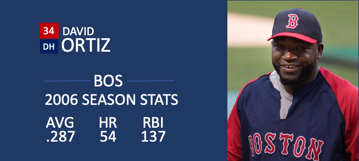

<html lang="en">

```{r setup, include=FALSE}
knitr::opts_chunk$set(
	echo = TRUE,
	message = FALSE,
	warning = FALSE
)

library(learnr) #necessary to render tutorial correctly

library(forcats)
library(ggplot2)
library(htmltools)
library(kableExtra)
library(lubridate)
library(magrittr)
library(tibble)


source("./www/datsci_helpers.R")
```

# datsci_07: Linear Regression

## Welcome to Data Science: Linear Regression!

<div class="infobox">
  
  
  **Usage:** This tutorial accompanies the textbook [Introduction to Data Science](https://rafalab.github.io/dsbook/) by [Prof Rafael Irizarry](http://rafalab.github.io/pages/about.html). It contains material from the textbook which is offered under a [Attribution-NonCommercial-ShareAlike 4.0 International (CC BY-NC-SA 4.0)](https://creativecommons.org/licenses/by-nc-sa/4.0/). 
  
</div>

### Data Science: Linear Regression!

We're excited to have you join us in this course, which is designed to teach you about linear regression, one of the most common statistical modeling approaches used in data science.

This is the **seventh** in a series of courses in the Introduction to Data Science program, a series of courses that prepare you to do data analysis in `r rproj()`, from simple computations to machine learning. We assume that you have taken the preceding six courses in the series or are already familiar with the content covered in them. 

Linear regression is commonly used to quantify the relationship between two or more variables. It is also used to adjust for confounding. In this course, we cover how to implement linear regression and adjust for confounding in practice using `r rproj()`.

In data science applications, it is very common to be interested in the relationship between two or more variables. The motivating case study we examine in this course relates to the data-driven approach used to construct baseball teams described in the book (and movie) Moneyball. We will try to determine which measured outcomes best predict baseball runs and to do this we'll use linear regression. 

We will also examine confounding, where extraneous variables affect the relationship between two or more other variables, leading to spurious associations. Linear regression is a powerful technique for removing confounders, but it is not a magical process, and it is essential to understand when it is appropriate to use. You will learn when to use it in this course. 

The class notes for this course series can be found in Professor Irizarry's freely available [Introduction to Data Science book](https://rafalab.github.io/dsbook/).

### In this course, you will learn:

- How linear regression was originally developed by Galton

- What confounding is and how to detect it

- How to examine the relationships between variables by implementing linear regression in `r rproj()`

### Course overview

There are three major sections in this course: introduction to linear regression, linear models, and confounding.

**Introduction to Linear Regression**

In this section, you'll learn the basics of linear regression through this course's motivating example, the data-driven approach used to construct baseball teams. You'll also learn about correlation, the correlation coefficient, stratification, and the variance explained.

**Linear Models**

In this section, you'll learn about linear models. You'll learn about least squares estimates, multivariate regression, and several useful features of `r rproj()`, such as tibbles, lm, do, and broom. You'll learn how to apply regression to baseball to build a better offensive metric.

**Confounding**

In the final section of the course, you'll learn about confounding and several reasons that correlation is not the same as causation, such as spurious correlation, outliers, reversing cause and effect, and confounders. You'll also learn about Simpson's Paradox.


### Course Instructor

<div class="infobox">
  

**Fatih Uenal** is currenlty a Visitng Postdoctoral Researcher at the University of Cambridge, Department of Psychology, where he conducts research on the psychology of anthropocentrism and social and ecological dominance. Prior to his current position, he has worked as a postdoc at [Harvard University](https://scholar.harvard.edu/fatih-uenal/home). Together with [Prof Rafael Irizarry](http://rafalab.github.io/pages/about.html) he programmed this interactive tutorial based on the the textbook [*Introduction to Data Science*](https://rafalab.github.io/dsbook/). This interactive tutorial is developed using the `learnr` package. It has a general social scientists audience in mind and is suited for undergrad and graduate levels of study. 

Webpage: https://scholar.harvard.edu/fatih-uenal/home

</div>

---

### Essential Course Information

#### **Course Objectives**

“Data science” is a catch-all term used to describe the practice of working with and analyzing messy data sources to draw meaningful conclusions using techniques developed by computer scientists and computational statisticians. The purpose of this course is to give students who are training as quantitative social scientists a broad introduction to this skillset via the statistical programming language, `r rproj()`. You will learn how to conduct many statistical analyses such as univariate statistics (e.g., correlation, regression) in `r rproj()` that you may have already done in SPSS, Excel, or another such program. Additionally, we will build on this foundation to explore new skillsets uncommon in the social sciences, such as natural language processing, and machine learning. 

At the end of this course you will be able to:

- To answer research questions in Social Sciences (e.g., Psychology) with data

- Understand the basics of research designs in Social Sciences, and how they relate to data-analysis strategies

- Develop an intuitive, practical, and conceptual understanding of strategies for asking and answering questions with data

- To use `r rproj()`, a free and open-source statistics software program.

- Develop a basic understanding of frequently used Data Science Techniques.

- Practice your newly acquired skills with interesting, interactive, and fun projects.

**NOTE**: The schedule and procedures described in this syllabus are subject to change depending on specific needs and requirements. You will always be notified of changes on the homepage (see “last update”).


#### **Course Structure**

This is the first module in a series of a 8 week-intensive course.  and I suggest that you devote approx 10 hours a week to learning `r rproj()`, or if you are teaching graduate students, I’d recommend adopting the schedule below, which is designed for an intense but doable semester-long course, one module per week.  It is intended to take the average graduate student roughly 10 hours per week to complete all required tasks.However, some number of students will find programming to be more challenging and may take up to 15 hours per week.  Some will breeze through the material in 5.

#### **Grading**

Each Monday, lessons will be assigned from datacamp.com. Some of these lessons will be complete DataCamp courses, and others will be specific modules of courses. This will all be managed by assigning content to your (free) DataCamp account. The amount of content assigned will vary between one and two courses of content. DataCamp considers a course to be roughly 4 hours of lessons, which includes practice time. Realistically, the time you need will depend upon how intuitive you find `r rproj()` to be. For students already familiar with other programming languages and those with previous `r rproj()` experience, “8 hours” of courses is realistically closer to 2 hours; for complete novices that also find the material difficult, 8 hours is a realistic estimate. It is strongly recommended that you stretch out DataCamp lessons across the assignment period, for example, allocating 1 hour each day. You will gain the most by treating this as a foreign language immersion course by using R every day, including for your own research.
Remember that you can always go to the **Slack Group** for help. 

#### **Passing Rate**

The passing rate is 70%. 

### Pre-Course Survey

Insert Survey Link here

*If you cannot see the survey above, click this link to access it in a new window.*


## Section 1: Data Import

In the **Introduction to Regression** section, you will learn the basics of linear regression.

After completing this section, you will be able to:

- Understand how Galton developed **linear regression**.

- Calculate and interpret the **sample correlation**.

- **Stratify** a dataset when appropriate.

- Understand what a **bivariate normal distribution** is.

- Explain what the term **variance explained** means.

- Interpret the two **regression lines**.

This section has three parts: **Baseball as a Motivating Example, Correlation**, and **Stratification and Variance Explained**. There are comprehension checks at the end of each part.

We encourage you to use `r rproj()` to interactively test out your answers and further your own learning.


### Introduction and Motivation


<div class="infobox">
  
**Textbook link** The content is discussed within the [textbook section - 18.1 Case study: Moneyball](https://rafalab.github.io/dsbook/linear-models.html#case-study-moneyball).
  
</div>


_Moneyball: The Art of Winning an Unfair Game_ is a book by Michael Lewis about the Oakland Athletics (A's) baseball team and its general manager, the person tasked with building the team, Billy Beane. 

Traditionally, baseball teams use _scouts_ to help them decide what players to hire. These scouts evaluate players by observing them perform. Scouts tend to favor athletic players with observable physical abilities. For this reason, scouts tend to agree on who the best players are and, as a result, these players tend to be in high demand. This in turn drives up their salaries. 

From 1989 to 1991, the A's had one of the highest payrolls in baseball. They were able to buy the best players and, during that time, they were one of the best teams. However, in 1995 the A's team owner changed and the new management cut the budget drastically, leaving then general manager, Sandy Alderson, with one of the lowest payrolls in baseball. He could no longer afford the most sought-after players. Alderson began using a statistical approach to find inefficiencies in the market. Alderson was a mentor to Billy Beane, who succeeded him in 1998 and fully embraced data science, as opposed to scouts, as a method for finding low-cost players that data predicted would help the team win. Today, this strategy has been adapted by most baseball teams. As we will see, regression plays a large role in this approach.

As motivation for this section, we will pretend it is 2002 and try to build a baseball team with a limited budget, just like the A's had to do. To appreciate what you are up against, note that in 2002 the Yankees' payroll of \$125,928,583 more than tripled the Oakland A's \$39,679,746: 

```{r mlb-2002-payroll, echo=FALSE, message=FALSE, warning=FALSE, fig.height = 4.5}
library(tidyverse)
library(rvest)
url <- "http://www.stevetheump.com/Payrolls.htm"
h <- read_html(url) 
i <- h %>% html_nodes(".style3") %>% html_text() %>% stringr::str_which("2002")
h %>% html_nodes("table") %>% .[[i]] %>% html_table(header = TRUE) %>%  
  mutate(Payroll = parse_number(Payroll)/10^6) %>%
  mutate(Team = reorder(Team, Payroll)) %>%
  ggplot(aes(Team, Payroll)) +
  geom_bar(stat = "identity") +
  ylab("Payroll in Millions") + 
  coord_flip()
```

### Sabermetics

Statistics have been used in baseball since its beginnings. The dataset we will be using, included in the __Lahman__ library, goes back to the 19th century. For example, a summary statistics we will describe soon, the _batting average_, has been used for decades to summarize a batter's success. Other statistics](http://mlb.mlb.com/stats/league_leaders.jsp) such as home runs (HR), runs batted in (RBI), and stolen bases (SB) are reported for each player in the [game summaries included in the sports section of newspapers, with players rewarded for high numbers. Although summary statistics such as these were widely used in baseball, data analysis per se was not. These statistics were arbitrarily decided on without much thought as to whether they actually predicted anything or were related to helping a team win.

This changed with [Bill James](https://en.wikipedia.org/wiki/Bill_James). In the late 1970s, this aspiring writer and baseball fan started publishing articles describing more in-depth analysis of baseball data. He named the approach of using data to predict what outcomes best predicted if a team would win [_sabermetrics_](https://en.wikipedia.org/wiki/Sabermetrics). Until Billy Beane made sabermetrics the center of his baseball operation, Bill James' work was mostly ignored by the baseball world. Currently, sabermetrics popularity is no longer limited to just baseball; other sports have started to use this approach as well.


In this section, to simplify the exercise, we will focus on scoring runs and ignore the two other important aspects of the game: pitching and fielding. We will see how regression analysis can help develop strategies to build a competitive baseball team with a constrained budget. The approach can be divided into two separate data analyses. In the first, we determine which recorded player-specific statistics predict runs. In the second, we examine if players were undervalued based on what our first analysis predicts. 


<div class="infobox">
   
  
**Key points:** 

---

- Bill James was the originator of the **sabermetrics**, the approach of using data to predict what outcomes best predicted if a team would win.

    
</div>


### Baseball Basics


<div class="infobox">
  
**Textbook link** The content is discussed within the [textbook section - 18.1.2 Baseball basics](https://rafalab.github.io/dsbook/linear-models.html#baseball-basics).
  
</div>


To see how regression will help us find undervalued players, we actually don't need to understand all the details about the game of baseball, which has over 100 rules. Here, we distill the sport to the basic knowledge one needs to know how to effectively attack the data science problem. 

The goal of a baseball game is to score more runs (points) than the other team. Each team has 9 batters that have an opportunity to hit a ball with a bat in a predetermined order. After the 9th batter has had their turn, the first batter bats again, then the second, and so on. Each time a batter has an opportunity to bat, we call it a plate appearance (PA). At each PA, the other team's _pitcher_ throws the ball and the batter tries to hit it. The PA ends with an binary outcome: the batter either makes an _out_ (failure) and returns to the bench or the batter doesn't (success) and can run around the bases, and potentially score a run (reach all 4 bases). Each team gets nine tries, referred to as _innings_, to score runs and each inning ends after three outs (three failures).

Here is a video showing a success: [https://www.youtube.com/watch?v=HL-XjMCPfio](https://www.youtube.com/watch?v=HL-XjMCPfio). And here is one showing a failure: [https://www.youtube.com/watch?v=NeloljCx-1g](https://www.youtube.com/watch?v=NeloljCx-1g). In these videos, we see how luck is involved in the process. When at bat, the batter wants to hit the ball hard. If the batter hits it hard enough, it is a HR, the best possible outcome as the batter gets at least one automatic run. But sometimes, due to chance, the batter hits the ball very hard and a defender catches it, resulting in an out. In contrast, sometimes the batter hits the ball softly, but it lands just in the right place. The fact that there is chance involved hints at why probability models will be involved.

Now there are several ways to succeed. Understanding this distinction will be important for our analysis. When the batter hits the ball, the batter wants to pass as many _bases_ as possible. There are four bases with the fourth one called _home plate_. Home plate is where batters start by trying to hit, so the bases form a cycle.

```{r, echo = FALSE, out.width="50%"}
## source: http://quarterlyspeedbump.com/wp-content/uploads/2012/03/Baseball_Diamond1.jpeg
knitr::include_graphics("./images/Baseball_Diamond1.png")
```
([Courtesy of Cburnett](https://en.wikipedia.org/wiki/User:Cburnett). [CC BY-SA 3.0 license](https://creativecommons.org/licenses/by-sa/3.0/deed.en).)
<!--Source: [Wikipedia Commons](https://commons.wikimedia.org/wiki/File:Baseball_diamond_simplified.svg))-->

A batter who _goes around the bases_ and arrives home, scores a run. 


We are simplifying a bit, but there are five ways a batter can succeed, that is, not make an out: 

- Bases on balls (BB) - the pitcher fails to throw the ball through a predefined area considered to be hittable (the strikezone), so the batter is permitted to go to first base.
- Single - Batter hits the ball and gets to first base.
- Double (2B) - Batter hits the ball and gets to second base.
- Triple  (3B) - Batter hits the ball and gets to third base.
- Home Run (HR) - Batter hits the ball and goes all the way home and scores a run. 

Here  is an example of a HR:
  [https://www.youtube.com/watch?v=xYxSZJ9GZ-w](https://www.youtube.com/watch?v=xYxSZJ9GZ-w).
If a batter gets to a base, the batter still has a chance of getting home and scoring a run if the next batter hits successfully. While the batter is _on base_, the batter can also try to steal a base (SB). If a batter runs fast enough, the batter can try to go from one base to the next without the other team tagging the runner. [Here] is an example of a stolen base: [https://www.youtube.com/watch?v=JSE5kfxkzfk](https://www.youtube.com/watch?v=JSE5kfxkzfk).

All these events are kept track of during the season and are available to us through the __Lahman__ package. Now we will start discussing how data analysis can help us decide how to use these statistics to evaluate players.

### No awards for BB
 
Historically, the _batting average_ has been considered the most important offensive statistic. To define this average, we define a _hit_ (H) and an _at bat_ (AB). Singles, doubles, triples, and home runs are hits. The fifth way to be successful, BB, is not a hit. An AB is the number of times you either get a hit or make an out; BBs are excluded. The batting average is simply H/AB and is considered the main measure of a success rate. Today this success rate ranges from 20% to 38%. We refer to the batting average in thousands so, for example, if your success rate is 28%, we call it _batting 280_.


```{r, echo = FALSE}

```
(Picture courtesy of [Keith Allison](https://www.flickr.com/people/27003603@N00). [CC BY-SA 2.0 license](https://creativecommons.org/licenses/by-sa/2.0).)

One of Bill James' first important insights is that the batting average ignores BB, but a BB is a success.  He proposed we use the _on base percentage_ (OBP) instead of batting average. He defined OBP as (H+BB)/(AB+BB) which is simply the proportion of plate appearances that don't result in an out, a very intuitive measure. He noted that a player that gets many more BB than the average player might not be recognized if the batter does not excel in batting average. But is this player not helping produce runs? No award is given to the player with the most BB. However, bad habits are hard to break and baseball did not immediately adopt OBP as an important statistic. In contrast, total stolen bases were considered important and an [award](http://www.baseball-almanac.com/awards/lou_brock_award.shtml) given to the player with the most. But players with high totals of SB also made more outs as they did not always succeed. Does a player with high SB total help produce runs? Can we use data science to determine if it's better to pay for players with high BB or SB? 


<div class="infobox">
   
  
**Key points:** 

---

- The goal of a baseball game is to score more runs (points) than the other team.

- Each team has 9 batters who have an opportunity to hit a ball with a bat in a predetermined order. 

- Each time a batter has an opportunity to bat, we call it a plate appearance (PA).

- The PA ends with a binary outcome: the batter either makes an out (failure) and returns to the bench or the batter doesn’t (success) and can run around the bases, and potentially score a run (reach all 4 bases).

- We are simplifying a bit, but there are five ways a batter can succeed (not make an out):

  - Bases on balls (BB): the pitcher fails to throw the ball through a predefined area considered to be hittable (the strike zone), so the batter is permitted to go to first base.
  
  - Single: the batter hits the ball and gets to first base.
  
  - Double (2B): the batter hits the ball and gets to second base.
  
  - Triple (3B): the batter hits the ball and gets to third base.
  
  - Home Run (HR): the batter hits the ball and goes all the way home and scores a run.
  
- Historically, the batting average has been considered the most important offensive statistic. To define this average, we define a hit (H) and an at bat (AB). Singles, doubles, triples and home runs are hits. The fifth way to be successful, a walk (BB), is not a hit. An AB is the number of times you either get a hit or make an out; BBs are excluded. The batting average is simply H/AB and is considered the main measure of a success rate.


</div>


### Bases on Balls or Stolen Bases?


<div class="infobox">
  
**Textbook link** The content is discussed within the [textbook section - 18.1.4 Base on balls or stolen bases?](https://rafalab.github.io/dsbook/linear-models.html#base-on-balls-or-stolen-bases). 
  
</div>


One of the challenges in this analysis is that it is not obvious how to determine if a player produces runs because so much depends on his teammates. We do keep track of the number of runs scored by a player. However, remember that if a player X bats right before someone who hits many HRs, batter X will score many runs. But these runs don't necessarily happen if we hire player X but not his HR hitting teammate.  However, we can examine team-level statistics. How do teams with many SB compare to teams with few? How about BB? We have data! Let's examine some. 

Let's start with an obvious one: HRs. Do teams that hit more home runs score more runs? We examine data from 1961 to 2001. The visualization of choice when exploring the relationship between two variables, such as HRs and wins, is a scatterplot:

```{r runs-vs-hrs, message=FALSE, warning=FALSE}
library(Lahman)

Teams %>% filter(yearID %in% 1961:2001) %>%
  mutate(HR_per_game = HR / G, R_per_game = R / G) %>%
  ggplot(aes(HR_per_game, R_per_game)) + 
  geom_point(alpha = 0.5)
```

The plot shows a strong association: teams with more HRs tend to score more runs. Now let's examine the relationship between stolen bases and runs:

```{r runs-vs-sb}
Teams %>% filter(yearID %in% 1961:2001) %>%
  mutate(SB_per_game = SB / G, R_per_game = R / G) %>%
  ggplot(aes(SB_per_game, R_per_game)) + 
  geom_point(alpha = 0.5)
```

Here the relationship is not as clear. Finally, let's examine the relationship between BB and runs:

```{r runs-vs-bb}
Teams %>% filter(yearID %in% 1961:2001) %>%
  mutate(BB_per_game = BB/G, R_per_game = R/G) %>%
  ggplot(aes(BB_per_game, R_per_game)) + 
  geom_point(alpha = 0.5)
```

Here again we see a clear association. But does this mean that increasing a team's BBs **causes** an increase in runs? One of the most important lessons you learn in this course is that **association is not causation.**

In fact, it looks like BBs and HRs are also associated:

```{r bb-vs-hrs}
Teams %>% filter(yearID %in% 1961:2001 ) %>%
  mutate(HR_per_game = HR/G, BB_per_game = BB/G) %>%
  ggplot(aes(HR_per_game, BB_per_game)) + 
  geom_point(alpha = 0.5)
```

We know that HRs cause runs because, as the name "home run" implies, when a player hits a HR they are guaranteed at least one run. Could it be that HRs also cause BB and this makes it appear as if BB cause runs? When this happens we say there is _confounding_, an important concept we will learn more about throughout this section.

Linear regression will help us parse all this out and quantify the associations. This will then help us determine what players to recruit. Specifically, we will try to predict things like how many more runs will a team score if we increase the number of BBs, but keep the HRs fixed? Regression will help us answer questions like this one.


<div class="infobox">
   
  
**Key points:** 

---

- The visualization of choice when exploring the relationship between two variables like home runs and runs is a scatterplot.


</div>


### 1.1 Assessment: Baseball as a Motivating Example

Insert assessment here


### Correlation


<div class="infobox">
  
**Textbook link** The content is discussed within the [textbook section - 17.1 Case study: is height hereditary?](https://rafalab.github.io/dsbook/regression.html#case-study-is-height-hereditary).
  
</div>


Up to this point, this course has focused mainly on single variables. However, in data science applications, it is very common to be interested in the relationship between two or more variables. For instance, in the textbook [(Section - 18 Linear models)](https://rafalab.github.io/dsbook/linear-models.html) we will use a data-driven approach that examines the relationship between player statistics and success to guide the building of a baseball team with a limited budget.  Before delving into this more complex example, we introduce necessary concepts needed to understand regression using a simpler illustration. We actually use the dataset from which regression was born.

The example is from genetics. [Francis Galton](https://en.wikipedia.org/wiki/Francis_Galton) studied the variation and heredity of human traits. Among many other traits, Galton collected and studied height data from families to try to understand heredity. While doing this, he developed the concepts of correlation and regression, as well as a connection to pairs of data that follow a normal distribution. Of course, at the time this data was collected our knowledge of genetics was quite limited compared to what we know today. A very specific question Galton tried to answer was: how well can we predict a child's height based on the parents' height? The technique he developed to answer this question, regression, can also be applied to our baseball question.  Regression can be applied in many other circumstances as well.

__Historical note__: Galton made important contributions to statistics and genetics, but he was also one of the first proponents of eugenics, a scientifically flawed philosophical movement favored by many biologists of Galton's time but with horrific historical consequences. You can read more about it here: [https://pged.org/history-eugenics-and-genetics/](https://pged.org/history-eugenics-and-genetics/).

### Case study: is height hereditary?

We have access to Galton's family height data through the __HistData__ package. This data contains heights on several dozen families: mothers, fathers, daughters, and sons. To imitate Galton's analysis, we will create a dataset with the heights of fathers and a randomly selected son of each family: 

```{r, message=FALSE, warning=FALSE}
library(tidyverse)
library(HistData)
data("GaltonFamilies")

set.seed(1983)
galton_heights <- GaltonFamilies %>%
  filter(gender == "male") %>%
  group_by(family) %>%
  sample_n(1) %>%
  ungroup() %>%
  select(father, childHeight) %>%
  rename(son = childHeight)
```

In the exercises, we will look at other relationships including mothers and daughters.

Suppose we were asked to summarize the father and son data. Since both distributions are well approximated by the normal distribution, we could use the two averages and two standard deviations as summaries:

```{r, message=FALSE, warning=FALSE}
galton_heights %>% 
  summarize(mean(father), sd(father), mean(son), sd(son))
```

However, this summary fails to describe an important characteristic of the data: the trend that the taller the father, the taller the son. 

```{r scatterplot, fig.height = 3, fig.width = 3, out.width="40%"}
galton_heights %>% ggplot(aes(father, son)) + 
  geom_point(alpha = 0.5)
```

We will learn that the correlation coefficient is an informative summary of how two variables move together and then see how this can be used to predict one variable using the other.


<div class="infobox">
   
  
**Key points:** 

---

- Galton tried to predict sons' heights based on fathers' heights.

- The mean and standard errors are insufficient for describing an important characteristic of the data: the trend that the taller the father, the taller the son.

- The correlation coefficient is an informative summary of how two variables move together that can be used to predict one variable using the other.


</div>


### Correlation Coefficient


<div class="infobox">
  
**Textbook link** The content is discussed within the [textbook section - 17 Regression](https://rafalab.github.io/dsbook/regression.html#the-correlation-coefficient). 
  
</div>


The correlation coefficient is defined for a list of pairs $(x_1, y_1), \dots, (x_n,y_n)$ as the average of the product of the standardized values:

$$
\rho = \frac{1}{n} \sum_{i=1}^n \left( \frac{x_i-\mu_x}{\sigma_x} \right)\left( \frac{y_i-\mu_y}{\sigma_y} \right)
$$
with $\mu_x, \mu_y$ the averages of $x_1,\dots, x_n$ and $y_1, \dots, y_n$, respectively, and $\sigma_x, \sigma_y$ the standard deviations. The Greek letter $\rho$ is commonly used in statistics books to denote the correlation. The Greek letter for $r$, $\rho$, because it is the first letter of regression. Soon we learn about the connection between correlation and regression. We can represent the formula above with R code using:

```{r, eval=FALSE}
rho <- mean(scale(x) * scale(y))
```

To understand why this equation does in fact summarize how two variables move together, consider the $i$-th entry of $x$ is  $\left( \frac{x_i-\mu_x}{\sigma_x} \right)$ SDs away from the average. Similarly, the $y_i$ that is paired with $x_i$, is $\left( \frac{y_1-\mu_y}{\sigma_y} \right)$ SDs away from the average $y$. If $x$ and $y$ are unrelated, the product $\left( \frac{x_i-\mu_x}{\sigma_x} \right)\left( \frac{y_i-\mu_y}{\sigma_y} \right)$ will be positive ( $+ \times +$ and $- \times -$ ) as often as negative ($+ \times -$ and $- \times +$) and will average out to about 0. This correlation is the average and therefore unrelated variables will have 0 correlation. If instead the quantities vary together, then we are averaging mostly positive products ( $+ \times +$ and $- \times -$) and we get a positive correlation. If they vary in opposite directions, we get a negative correlation. 

The correlation coefficient is always between -1 and 1. We can show this mathematically: consider that we can't have higher correlation than when we compare a list to itself (perfect correlation) and in this case the correlation is:

$$
\rho = \frac{1}{n} \sum_{i=1}^n \left( \frac{x_i-\mu_x}{\sigma_x} \right)^2 = 
\frac{1}{\sigma_x^2} \frac{1}{n} \sum_{i=1}^n \left( x_i-\mu_x \right)^2 = 
\frac{1}{\sigma_x^2} \sigma^2_x = 
1
$$

A similar derivation, but with $x$ and its exact opposite, proves the correlation has to be bigger or equal to -1.

For other pairs, the correlation is in between -1 and 1. The correlation between father and son's heights is about 0.5:

```{r}
galton_heights %>% summarize(r = cor(father, son)) %>% pull(r)
```

To see what data looks like for different values of $\rho$, here are six examples of pairs with correlations ranging from -0.9 to 0.99:

```{r what-correlation-looks-like, echo=FALSE}
n <- 250
cors <- c(-0.9,-0.5,0,0.5,0.9,0.99)
sim_data <- lapply(cors,function(r) MASS::mvrnorm(n,c(0,0), matrix(c(1,r,r,1),2,2)))
sim_data <- Reduce(rbind, sim_data)
sim_data <- cbind( rep(cors, each=n), sim_data)
colnames(sim_data) <- c("r","x","y")
as.data.frame(sim_data) %>% 
  ggplot(aes(x,y)) + 
  facet_wrap(~r) + 
  geom_point(alpha = 0.5) +
  geom_vline(xintercept = 0,lty=2) + 
  geom_hline(yintercept = 0,lty=2) 
```


<div class="infobox">
   
  
**Key points:** 

---

- The correlation coefficient is defined for a list of pairs $(x_1, y_1), \dots, (x_n,y_n)$ as the product of the standardized values: $\left( \frac{x_i-\mu_x}{\sigma_x} \right)\left( \frac{y_i-\mu_y}{\sigma_y} \right)$.

- The correlation coefficient essentially conveys how two variables move together.

- The correlation coefficient is always between -1 and 1.


</div>


### Sample Correlation is a Random Variable


<div class="infobox">
  
**Textbook link** The content is discussed within the [textbook section - 17.2.1 Sample correlation is a random variable](https://rafalab.github.io/dsbook/regression.html#sample-correlation-is-a-random-variable). 
  
</div>


Before we continue connecting correlation to regression, let's remind ourselves about random variability.

In most data science applications, we observe data that includes random variation. For example, in many cases, we do not observe data for the entire population of interest but rather for a random sample. As with the average and standard deviation, the *sample correlation* is the most commonly used estimate of the population correlation. This implies that the correlation we compute and use as a summary is a random variable.

By way of illustration, let's assume that the `r nrow(galton_heights)` pairs of fathers and sons is our entire population. A less fortunate geneticist can only afford measurements from a random sample of 25 pairs. The sample correlation can be computed with:

```{r}
R <- sample_n(galton_heights, 25, replace = TRUE) %>% 
  summarize(r = cor(father, son)) %>% pull(r)
```

`R` is a random variable. We can run a Monte Carlo simulation to see its distribution:

```{r sample-correlation-distribution}
B <- 1000
N <- 25
R <- replicate(B, {
  sample_n(galton_heights, N, replace = TRUE) %>% 
    summarize(r=cor(father, son)) %>% 
    pull(r)
})
qplot(R, geom = "histogram", binwidth = 0.05, color = I("black"))
```

We see that the expected value of `R` is the population correlation:

```{r}
mean(R)
```

and that it has a relatively high standard error relative to the range of values `R` can take:

```{r}
sd(R)
```

So, when interpreting correlations, remember that correlations derived from samples are estimates containing uncertainty.

Also, note that because the sample correlation is an average of independent draws, the central limit actually applies. Therefore, for large enough $N$, the distribution of `R` is approximately normal with expected value $\rho$. The standard deviation, which is somewhat complex to derive, is $\sqrt{\frac{1-r^2}{N-2}}$. 

In our example, $N=25$ does not seem to be large enough to make the approximation a good one:

```{r small-sample-correlation-not-normal, out.width="40%"}
ggplot(aes(sample=R), data = data.frame(R)) + 
  stat_qq() + 
  geom_abline(intercept = mean(R), slope = sqrt((1-mean(R)^2)/(N-2)))
```

If you increase $N$, you will see the distribution converging to normal.


<div class="infobox">
   
  
**Key points:** 

---

- The correlation that we compute and use as a summary is a random variable.

- When interpreting correlations, it is important to remember that correlations derived from samples are estimates containing uncertainty.

- Because the sample correlation is an average of independent draws, the central limit theorem applies. 


</div>


### 1.2 Assessment: Correlation

Insert assessment here


### Anscombe's Quartet/Stratification


<div class="infobox">
  
**Textbook link** The content is discussed within the textbook sections

- [17.2.2 Correlation is not always a useful summary](https://rafalab.github.io/dsbook/regression.html#correlation-is-not-always-a-useful-summary)

- [17.3 Conditional expectations](https://rafalab.github.io/dsbook/regression.html#conditional-expectation)

- [17.4 The regression line](https://rafalab.github.io/dsbook/regression.html#the-regression-line)
  
</div>


Correlation is not always a good summary of the relationship between two variables. The following four artificial datasets, referred to as Anscombe's quartet, famously illustrate this point. All these pairs have a correlation of 0.82:

```{r ascombe-quartet,echo=FALSE}
anscombe %>% mutate(row = seq_len(n())) %>%
  gather(name, value, -row) %>% 
  separate(name, c("axis", "group"), sep=1) %>%
  spread(axis, value) %>% select(-row) %>%
  ggplot(aes(x,y)) +
  facet_wrap(~group)  +
  geom_smooth(method="lm", fill=NA, fullrange=TRUE) + 
  geom_point()
#+  geom_point(bg="orange", color="red", cex=3, pch=21)
```

Correlation is only meaningful in a particular context. To help us understand when it is that correlation is meaningful as a summary statistic, we will return to the example of predicting a son's height using his father's height. This will help motivate and define linear regression. We start by demonstrating how correlation can be useful for prediction.

### Conditional expectations 

Suppose we are asked to guess the height of a randomly selected son and we don't know his father's height. Because the distribution of sons' heights is approximately normal, we know the average height, `r round(mean(galton_heights$son), 1)`, is the value with the highest proportion and would be the prediction with the highest chance of minimizing the error. But what if we are told that the father is taller than average, say 72 inches tall, do we still guess `r round(mean(galton_heights$son), 1)` for the son? 

It turns out that if we were able to collect data from a very large number of fathers that are 72 inches, the distribution of their sons' heights would be normally distributed. This implies that the average of the distribution computed on this subset would be our best prediction. 

In general, we call this approach _conditioning_. The general idea is that we stratify a population into groups and compute summaries in each group. Conditioning is therefore related to the concept of stratification described in the textbook [(Section - 8.13 Stratification)](https://rafalab.github.io/dsbook/distributions.html#stratification). To provide a mathematical description of conditioning, consider we have a population of pairs of values $(x_1,y_1),\dots,(x_n,y_n)$, for example all father and son heights in England. In the previous section we learned that if you take a random pair $(X,Y)$, the expected value and best predictor of $Y$ is $\mbox{E}(Y) = \mu_y$, the population average $1/n\sum_{i=1}^n y_i$. However, we are no longer interested in the general population, instead we are interested in only the subset of a population with a specific $x_i$ value, 72 inches in our example. This subset of the population, is also a population and thus the same principles and properties we have learned apply. The $y_i$ in the subpopulation have a distribution, referred to as the _conditional distribution_, and this distribution has an expected value referred to as the _conditional expectation_. In our example, the conditional expectation is the average height of all sons in England with fathers that are 72 inches. The statistical notation for the conditional expectation is

$$
\mbox{E}(Y \mid X = x)
$$

with $x$ representing the fixed value that defines that subset, for example 72 inches. Similarly, we denote the standard deviation of the strata with

$$
\mbox{SD}(Y \mid X = x) = \sqrt{\mbox{Var}(Y \mid X = x)}
$$

Because the conditional expectation $E(Y\mid X=x)$ is the best predictor for the random variable $Y$ for an individual in the strata defined by $X=x$, many data science challenges reduce to estimating this quantity. The conditional standard deviation quantifies the precision of the prediction. 

In the example we have been considering, we are interested in computing the average son height _conditioned_ on the father being 72 inches tall. We want to estimate $E(Y|X=72)$ using the sample collected by Galton. We previously learned that the sample average is the preferred approach to estimating the population average. However, a challenge when using this approach to estimating conditional expectations is that for continuous data we don't have many data points matching exactly one value in our sample. For example, we have only: 

```{r}
sum(galton_heights$father == 72)
```

fathers that are exactly 72-inches. If we change the number to 72.5, we get even fewer data points:

```{r}
sum(galton_heights$father == 72.5)
```

A practical way to improve these estimates of the conditional expectations, is to define strata of with similar values of $x$. In our example, we can round father heights to the nearest inch and assume that they are all 72 inches. If we do this, we end up with the following prediction for the son of a father that is 72 inches tall:

```{r}
conditional_avg <- galton_heights %>% 
  filter(round(father) == 72) %>%
  summarize(avg = mean(son)) %>% 
  pull(avg)
conditional_avg
```


Note that a 72-inch father is taller than average -- specifically, 72 - `r round( mean(galton_heights$father),1)`/`r round(sd(galton_heights$father),1)` =
`r round((72 -mean(galton_heights$father))/sd(galton_heights$father), 1)` standard deviations taller than the average father. Our prediction `r conditional_avg` is also taller than average, but only `r round((conditional_avg - mean(galton_heights$son)) /sd(galton_heights$son),2)` standard deviations larger than the average son. The sons of 72-inch fathers have _regressed_ some to the average height. We notice that the reduction in how many SDs taller is about 0.5, which happens to be the correlation. As we will see in a later section, this is not a coincidence.

If we want to make a prediction of any height, not just 72, we could apply the same approach to each strata. Stratification followed by boxplots lets us see the distribution of each group:

```{r boxplot-1, fig.height = 3, fig.width = 3, out.width="40%"}
galton_heights %>% mutate(father_strata = factor(round(father))) %>% 
  ggplot(aes(father_strata, son)) + 
  geom_boxplot() + 
  geom_point()
```

Not surprisingly, the centers of the groups are increasing with height. 
Furthermore, these centers appear to follow a linear relationship. Below we plot the averages of each group. If we take into account that these averages are random variables with standard errors, the data is consistent with these points following a straight line:

```{r conditional-averages-follow-line, echo=FALSE, fig.height = 3, fig.width = 3, out.width="40%"}
galton_heights %>% 
  mutate(father = round(father)) %>% 
  group_by(father) %>%
  summarize(son_conditional_avg = mean(son)) %>%
  ggplot(aes(father, son_conditional_avg)) + 
  geom_point()
```

The fact that these conditional averages follow a line is not a coincidence. In the next section, we explain that the line these averages follow is what we call the *regression line*, which  improves the precision of our estimates. However, it is not always appropriate to estimate conditional expectations with the regression line so we also describe Galton's theoretical justification for using the regression line.

### The regression line

If we are predicting a random variable $Y$ knowing the value of another $X=x$ using a regression line, then we predict that for every standard deviation, $\sigma_X$, that $x$ increases above the average $\mu_X$, $Y$ increase $\rho$ standard deviations $\sigma_Y$ above the average $\mu_Y$ with $\rho$ the correlation between $X$ and $Y$. The formula for the regression is therefore:

$$ 
\left( \frac{Y-\mu_Y}{\sigma_Y} \right) = \rho \left( \frac{x-\mu_X}{\sigma_X} \right)
$$

We can rewrite it like this:

$$ 
Y = \mu_Y + \rho \left( \frac{x-\mu_X}{\sigma_X} \right) \sigma_Y
$$

If there is perfect correlation, the regression line predicts an increase that is the same number of SDs. If there is 0 correlation, then we don't use $x$ at all for the prediction and simply predict the average $\mu_Y$.  For values between 0 and 1, the prediction is somewhere in between. If the correlation is negative, we predict a reduction instead of an increase. 


Note that if the correlation is positive and lower than 1, our prediction is closer, in standard units, to the average height than the value used to predict, $x$, is to the average of the $x$s. This is why we call it _regression_: the son regresses to the average height. In fact, the title of Galton's paper was: _Regression toward mediocrity in hereditary stature_. To add regression lines to plots, we will need the above formula in the form: 

$$
y= b + mx \mbox{ with slope } m = \rho \frac{\sigma_y}{\sigma_x} \mbox{ and intercept } b=\mu_y - m \mu_x
$$

Here we add the regression line to the original data:

```{r regression-line, fig.height = 3, fig.width = 3, out.width="40%"}
mu_x <- mean(galton_heights$father)
mu_y <- mean(galton_heights$son)
s_x <- sd(galton_heights$father)
s_y <- sd(galton_heights$son)
r <- cor(galton_heights$father, galton_heights$son)

galton_heights %>% 
  ggplot(aes(father, son)) + 
  geom_point(alpha = 0.5) +
  geom_abline(slope = r * s_y/s_x, intercept = mu_y - r * s_y/s_x * mu_x) 
```

The regression formula implies that if we first standardize the variables, that is subtract the average and divide by the standard deviation, then the regression line has intercept 0 and slope equal to the correlation $\rho$. You can make same plot, but using standard units like this:

```{r regression-line-standard-units, fig.height = 3, fig.width = 3, out.width="40%", eval=FALSE} 
galton_heights %>% 
  ggplot(aes(scale(father), scale(son))) + 
  geom_point(alpha = 0.5) +
  geom_abline(intercept = 0, slope = r) 
```


<div class="infobox">
   
  
**Key points:** 

---

- Correlation is not always a good summary of the relationship between two variables.

- The general idea of conditional expectation is that we stratify a population into groups and compute summaries in each group.

- A practical way to improve the estimates of the conditional expectations is to define strata of with similar values of x.

- If there is perfect correlation, the regression line predicts an increase that is the same number of SDs for both variables. If there is 0 correlation, then we don’t use x at all for the prediction and simply predict the average 𝜇𝑦. For values between 0 and 1, the prediction is somewhere in between. If the correlation is negative, we predict a reduction instead of an increase.


</div>


### Bivariate Normal Distribution


<div class="infobox">
  
**Textbook link** The content is discussed within the [textbook section - 17.4.2 Bivariate normal distribution (advanced)](https://rafalab.github.io/dsbook/regression.html#bivariate-normal-distribution-advanced). 
  
</div>


Correlation and the regression slope are a widely used summary statistic, but they are often misused or misinterpreted. Anscombe's examples provide over-simplified cases of dataset in which summarizing with correlation would be a mistake. But there are many more real-life examples.

The main way we motivate the use of correlation involves what is called the _bivariate normal distribution_. 

When a pair of random variables is approximated by the bivariate normal distribution, scatterplots look like ovals. As we saw in the textbook [(Section - 17.2 The correlation coefficient)](https://rafalab.github.io/dsbook/regression.html#corr-coef), they can be thin (high correlation) or circle-shaped (no correlation). 

<!--
```{r bivariate-ovals, echo=FALSE}
n <- 250
cors <- c(-0.9,-0.5,0,0.5,0.9,0.99)
sim_data <- lapply(cors,function(r) MASS::mvrnorm(n,c(0,0), matrix(c(1,r,r,1),2,2)))
sim_data <- Reduce(rbind, sim_data)
sim_data <- cbind( rep(cors, each=n), sim_data)
colnames(sim_data) <- c("r","x","y")
as.data.frame(sim_data) %>% ggplot(aes(x,y)) +facet_wrap(~r) + geom_point() +geom_vline(xintercept = 0,lty=2) + geom_hline(yintercept = 0,lty=2) 
```
-->

A more technical way to define the bivariate normal distribution is the following: if $X$ is a normally distributed random variable, $Y$ is also a normally distributed random variable, and the conditional distribution of $Y$ for any $X=x$ is approximately normal, then the pair is approximately bivariate normal. 

If we think the height data is well approximated by the bivariate normal distribution, then we should see the normal approximation hold for each strata. Here we stratify the son heights by the standardized father heights and see that the assumption appears to hold:

```{r qqnorm-of-strata}
galton_heights %>%
  mutate(z_father = round((father - mean(father)) / sd(father))) %>%
  filter(z_father %in% -2:2) %>%
  ggplot() +  
  stat_qq(aes(sample = son)) +
  facet_wrap( ~ z_father) 
```

Now we come back to defining correlation. Galton used mathematical statistics to demonstrate that, when two variables follow a bivariate normal distribution, computing the regression line is equivalent to computing conditional expectations. We don't show the derivation here, but we can show that under this assumption, for any given value of $x$, the expected value of the $Y$ in pairs for which $X=x$ is:

$$ 
\mbox{E}(Y | X=x) = \mu_Y +  \rho \frac{X-\mu_X}{\sigma_X}\sigma_Y
$$

This is the regression line, with slope $$\rho \frac{\sigma_Y}{\sigma_X}$$ and intercept $\mu_y - m\mu_X$. It is equivalent to the regression equation we showed earlier which can be written like this:


$$
\frac{\mbox{E}(Y \mid X=x)  - \mu_Y}{\sigma_Y} = \rho \frac{x-\mu_X}{\sigma_X}
$$

This implies that, if our data is approximately bivariate, the regression line gives the conditional probability. Therefore, we can obtain a much more stable estimate of the conditional expectation by finding the regression line and using it to predict.

In summary, if our data is approximately bivariate, then the conditional expectation, the best prediction of $Y$ given we know the value of $X$, is given by the regression line.


<div class="infobox">
   
  
**Key points:** 

---

- When a pair of random variables are approximated by the bivariate normal distribution, scatterplots look like ovals. They can be thin (high correlation) or circle-shaped (no correlation).

- When two variables follow a bivariate normal distribution, computing the regression line is equivalent to computing conditional expectations.

- We can obtain a much more stable estimate of the conditional expectation by finding the regression line and using it to make predictions.


</div>


### Variance Explained


<div class="infobox">
  
**Textbook link** The content is discussed within the [textbook section - 17.4.3 Variance explained](https://rafalab.github.io/dsbook/regression.html#variance-explained). 
  
</div>


The bivariate normal theory also tells us that the standard deviation of the _conditional_ distribution described above is:

$$
\mbox{SD}(Y \mid X=x ) = \sigma_Y \sqrt{1-\rho^2} 
$$

To see why this is intuitive, notice that without conditioning, $\mbox{SD}(Y) = \sigma_Y$, we are looking at the variability of all the sons. But once we condition, we are only looking at the variability of the sons with a tall, 72-inch, father. This group will all tend to be somewhat tall so the standard deviation is reduced. 

Specifically, it is reduced to $\sqrt{1-\rho^2} = \sqrt{1 - 0.25}$ = 0.87 of what it was originally. We could say that father heights "explain" 13% of the variability observed in son heights. 

The statement "$X$ explains such and such percent of the variability" is commonly used in academic papers. In this case, this percent actually refers to the variance (the SD squared). So if the data is bivariate normal, the variance is reduced by $1-\rho^2$, so we say that $X$ explains $1- (1-\rho^2)=\rho^2$ (the correlation squared) of the variance. 

But it is important to remember that the "variance explained" statement only makes sense when the data is approximated by a bivariate normal distribution.


<div class="infobox">
   
  
**Key points:** 

---


- Conditioning on a random variable X can help to reduce variance of response variable Y.

- The standard deviation of the conditional distribution is $\mbox{SD}(Y \mid X=x ) = \sigma_Y \sqrt{1-\rho^2}$, which is smaller than the standard deviation without conditioning $\sigma_Y$.

- Because variance is the standard deviation squared, the variance of the conditional distribution is $\sigma_y^2(1-\rho^2)$.

- In the statement "X explains such and such percent of the variability," the percent value refers to the variance. The variance decreases by $\rho^2$ percent.

- The “variance explained” statement only makes sense when the data is approximated by a bivariate normal distribution.


</div>


### There are Two Regression Lines


<div class="infobox">
  
**Textbook link** The content is discussed within the [textbook section - 17.4.4 Warning: there are two regression lines](https://rafalab.github.io/dsbook/regression.html#warning-there-are-two-regression-lines). 
  
</div>


We computed a regression line to predict the son's height from father's height. We used these calculations: 

```{r}
mu_x <- mean(galton_heights$father)
mu_y <- mean(galton_heights$son)
s_x <- sd(galton_heights$father)
s_y <- sd(galton_heights$son)
r <- cor(galton_heights$father, galton_heights$son)
m_1 <-  r * s_y / s_x
b_1 <- mu_y - m_1*mu_x
```

which gives us the function $\mbox{E}(Y\mid X=x) =$ `r round(b_1, 1)` + `r round(m_1, 2)` $x$. 

What if we want to predict the father's height based on the son's? It is important to know that this is not determined by computing the inverse function: 
$x = \{ \mbox{E}(Y\mid X=x) -$ `r round(b_1, 1)` $\} /$ `r round(m_1, 1)`. 

We need to compute $\mbox{E}(X \mid Y=y)$. Since the data is approximately bivariate normal, the theory described above tells us that this conditional expectation will follow a line with slope and intercept:

```{r}
m_2 <-  r * s_x / s_y
b_2 <- mu_x - m_2 * mu_y
```

So we get $\mbox{E}(X \mid Y=y) =$ `r round(b_2, 1)` + `r round(m_2, 2)`y. Again we see regression to the average: the prediction for the father is closer to the father average than the son heights $y$ is to the son average.

Here is a plot showing the two regression lines, with blue for the predicting son heights with father heights and red for predicting father heights with son heights:

```{r two-regression-lines, fig.height = 3, fig.width = 3, out.width="40%"}
galton_heights %>% 
  ggplot(aes(father, son)) + 
  geom_point(alpha = 0.5) + 
  geom_abline(intercept = b_1, slope = m_1, col = "blue") +
  geom_abline(intercept = -b_2/m_2, slope = 1/m_2, col = "red") 
```


<div class="infobox">
   
  
**Key points:** 

---

- There are two different regression lines depending on whether we are taking the expectation of Y given X or taking the expectation of X given Y.


</div>


### 1.3 Assessment: Stratification and Variance Explained, Part 1

Insert assessment here


### 1.3 Assessment: Stratification and Variance Explained, Part 2

Insert assessment here


## Section 2: Linear Models

In the **Linear Models** section, you will learn how to do linear regression.

After completing this section, you will be able to:

- Use **multivariate regression** to adjust for confounders.

- Write **linear models** to describe the relationship between two or more variables.

- Calculate the **least squares estimates** for a regression model using the `lm` function.

- Understand the differences between **tibbles** and **data frames**.

- Use the `do()` function to bridge `r rproj()` functions and the tidyverse.

- Use the `tidy()`, `glance()`, and `augment()` functions from the broom package.

- Apply linear regression to **measurement error models**.

This section has four parts: **Introduction to Linear Models, Least Squares Estimates, Tibbles, do, and broom, and Regression and Baseball**. There are comprehension checks at the end of each part, along with an assessment on linear models at the end of the whole section.

We encourage you to use `r rproj()` to interactively test out your answers and further your own learning.


### Confounding: Are BBs More Predictive?


<div class="infobox">
  
**Textbook link** The content is discussed within the [textbook section - 18.2 Confounding](https://rafalab.github.io/dsbook/linear-models.html#confounding). 
  
</div>


Previously, we noted a strong relationship between Runs and BB. If we find the regression line for predicting runs from bases on balls, we a get slope of:

```{r, warning=FALSE, message=FALSE}
library(tidyverse)
library(Lahman)
get_slope <- function(x, y) cor(x, y) * sd(y) / sd(x)

bb_slope <- Teams %>% 
  filter(yearID %in% 1961:2001 ) %>% 
  mutate(BB_per_game = BB/G, R_per_game = R/G) %>% 
  summarize(slope = get_slope(BB_per_game, R_per_game))

bb_slope 
```
So does this mean that if we go and hire low salary players with many BB, and who therefore increase the number of walks per game by 2, our team will score `r round(bb_slope*2, 1)` more runs per game? 

We are again reminded that association is not causation. The data does provide strong evidence that a team with two more BB per game than the average team, scores `r round(bb_slope*2, 1)` runs per game. But this does not mean that BB are the cause. 

Note that if we compute the regression line slope for singles we get:

```{r}
singles_slope <- Teams %>% 
  filter(yearID %in% 1961:2001 ) %>%
  mutate(Singles_per_game = (H-HR-X2B-X3B)/G, R_per_game = R/G) %>%
  summarize(slope = get_slope(Singles_per_game, R_per_game))

singles_slope 
```

which is a lower value than what we obtain for BB.

Also, notice that a single gets you to first base just like a BB. Those that know about baseball will tell you that with a single, runners on base have a better chance of scoring than with a BB. So how can BB be more predictive of runs? The reason this happen is because of confounding. Here we show the correlation between HR, BB, and singles:

```{r}
Teams %>% 
  filter(yearID %in% 1961:2001 ) %>% 
  mutate(Singles = (H-HR-X2B-X3B)/G, BB = BB/G, HR = HR/G) %>%  
  summarize(cor(BB, HR), cor(Singles, HR), cor(BB, Singles))
```

It turns out that pitchers, afraid of HRs, will sometimes avoid throwing strikes to HR hitters. As a result, HR hitters tend to have more BBs and a team with many HRs will also have more BBs. Although it may appear that BBs cause runs, it is actually the HRs that cause most of these runs. We say that BBs are _confounded_ with HRs. Nonetheless, could it be that BBs still help? To find out, we somehow have to adjust for the HR effect. Regression can help with this as well.


<div class="infobox">
   
  
**Key points:** 

---

- Association is not causation!

- Although it may appear that BB cause runs, it is actually the HR that cause most of these runs. We say that BB are **confounded** with HR.

- Regression can help us account for confounding.


</div>


### Stratification and Multivariate Regression


<div class="infobox">
  
**Textbook link** The content is discussed within the [textbook section - 18.2.1 Multivariate regression](https://rafalab.github.io/dsbook/linear-models.html#understanding-confounding-through-stratification). 
  
</div>


A first approach is to keep HRs fixed at a certain value and then examine the relationship between BB and runs. As we did when we stratified fathers by rounding to the closest inch, here we can stratify HR per game to the closest ten. We filter out the strata with few points to avoid highly variable estimates:

```{r}
dat <- Teams %>% filter(yearID %in% 1961:2001) %>%
  mutate(HR_strata = round(HR/G, 1), 
         BB_per_game = BB / G,
         R_per_game = R / G) %>%
  filter(HR_strata >= 0.4 & HR_strata <=1.2) 
```

and then make a scatterplot for each strata:

```{r runs-vs-bb-by-hr-strata, out.width="80%", fig.height=5}
dat %>% 
  ggplot(aes(BB_per_game, R_per_game)) +  
  geom_point(alpha = 0.5) +
  geom_smooth(method = "lm") +
  facet_wrap( ~ HR_strata) 
```

Remember that the regression slope for predicting runs with BB was `r round(bb_slope, 1)`. Once we stratify by HR, these slopes are substantially reduced:

```{r}
dat %>%  
  group_by(HR_strata) %>%
  summarize(slope = get_slope(BB_per_game, R_per_game))
```

The slopes are reduced, but they are not 0, which indicates that BBs are helpful for producing runs, just not as much as previously thought.
In fact, the values above are closer to the slope we obtained from singles, `r round(singles_slope, 2)`, which is more consistent with our intuition. Since both singles and BB get us to first base, they should have about the same predictive power.

Although our understanding of the application tells us that HR cause BB but not the other way around, we can still check if stratifying by BB makes the effect of BB go down. To do this, we use the same code except that we swap HR and BBs to get this plot:

```{r runs-vs-hr-by-bb-strata, out.width="100%",echo=FALSE}
dat <- Teams %>% filter(yearID %in% 1961:2001) %>%
  mutate(BB_strata = round(BB/G,1), 
         HR_per_game = HR/G,
         R_per_game = R/G) %>%
  filter(BB_strata >= 2.8 & BB_strata <= 3.9)

dat %>% 
  ggplot(aes(HR_per_game, R_per_game)) +  
  geom_point(alpha = 0.5) +
  geom_smooth(method = "lm") +
  facet_wrap( ~ BB_strata) 
```

In this case, the slopes do not change much from the original:

```{r}
dat %>% group_by(BB_strata) %>%
   summarize(slope = get_slope(HR_per_game, R_per_game))
```

They are reduced a bit, which is consistent with the fact that BB do in fact cause some runs.


```{r}
hr_slope <- Teams %>% 
  filter(yearID %in% 1961:2001 ) %>% 
  mutate(HR_per_game = HR/G, R_per_game = R/G) %>% 
  summarize(slope = get_slope(HR_per_game, R_per_game))

hr_slope
```

Regardless, it seems that if we stratify by HR, we have bivariate distributions for runs versus BB. Similarly, if we stratify by BB, we have approximate bivariate normal distributions for HR versus runs. 

###  Multivariate regression

It is somewhat complex to be computing regression lines for each strata. We are essentially fitting models like this:

$$
\mbox{E}[R \mid BB = x_1, \, HR = x_2] = \beta_0 + \beta_1(x_2) x_1 + \beta_2(x_1) x_2
$$

with the slopes for $x_1$ changing for different values of $x_2$ and vice versa. But is there an easier approach?

If we take random variability into account, the slopes in the strata don't appear to change much. If these slopes are in fact the same, this implies that $\beta_1(x_2)$ and $\beta_2(x_1)$ are constants. This in turn implies that the expectation of runs conditioned on HR and BB can be written like this:

$$
\mbox{E}[R \mid BB = x_1, \, HR = x_2] = \beta_0 + \beta_1 x_1 + \beta_2 x_2
$$

This model suggests that if the number of HR is fixed at $x_2$, we observe a linear relationship between runs and BB with an intercept of $\beta_0 + \beta_2 x_2$. Our exploratory data analysis suggested this. The model also suggests that as the number of HR grows, the intercept growth is linear as well and determined by $\beta_1 x_1$. 

In this analysis, referred to as _multivariate regression_, you will often hear people say that the BB slope $\beta_1$ is _adjusted_ for the HR effect. If the model is correct then confounding has been accounted for. But how do we estimate $\beta_1$ and $\beta_2$ from the data? For this, we learn about linear models and least squares estimates.


<div class="infobox">
   
  
**Key points:** 

---


- A first approach to check confounding is to keep HRs fixed at a certain value and then examine the relationship between BB and runs.

- The slopes of BB after stratifying on HR are reduced, but they are not 0, which indicates that BB are helpful for producing runs, just not as much as previously thought.

    
</div>


### Linear Models


<div class="infobox">
  
**Textbook link** The content is discussed within the [textbook section - 18.3 Least squares estimates](https://rafalab.github.io/dsbook/linear-models.html#lse). 
  
</div>


We have described how if data is bivariate normal then the conditional expectations follow the regression line. The fact that the conditional expectation is a line is not an extra assumption but rather a derived result. However, in practice it is common to explicitly write down a model that describes the relationship between two or more variables using a _linear model_. 

We note that "linear" here does not refer to lines exclusively, but rather to the fact that the conditional expectation is a linear combination of known quantities. In mathematics, when we multiply each variable by a constant and then add them together, we say we formed a linear combination of the variables. For example, $3x - 4y + 5z$ is a linear combination of $x$, $y$, and $z$. We can also add a constant so $2 + 3x - 4y + 5z$ is also linear combination of $x$, $y$, and $z$. 

So $\beta_0 + \beta_1 x_1 + \beta_2 x_2$, is a linear combination of $x_1$ and $x_2$. 
The simplest linear model is a constant $\beta_0$; the second simplest is a line $\beta_0 + \beta_1 x$. If we were to specify a linear model for Galton's data, we would denote the $N$ observed father heights with $x_1, \dots, x_n$, then we model the $N$ son heights we are trying to predict with: 

$$ 
Y_i = \beta_0 + \beta_1 x_i + \varepsilon_i, \, i=1,\dots,N. 
$$

Here $x_i$ is the father's height, which is fixed (not random) due to the conditioning, and $Y_i$ is the random son's height that we want to predict. We further assume that $\varepsilon_i$ are independent from each other, have expected value 0 and the standard deviation, call it $\sigma$, does not depend on $i$. 

In the above model, we know the $x_i$, but to have a useful model for prediction, we need $\beta_0$ and $\beta_1$. We estimate these from the data. Once we do this, we can predict son's heights for any father's height $x$. We show how to do this in the next section.

Note that if we further assume that the $\varepsilon$ is normally distributed, then this model is exactly the same one we derived earlier by assuming bivariate normal data. A somewhat nuanced difference is that in the first approach we assumed the data was bivariate normal and that the linear model was derived, not assumed. In practice, linear models are just assumed without necessarily assuming normality: the distribution of the $\varepsilon$s is not specified.  Nevertheless, if your data is bivariate normal, the above linear model holds. If your data is not bivariate normal, then you will need to have other ways of justifying the model.

### Interpreting linear models

One reason linear models are popular is that they are interpretable. In the case of Galton's data, we can interpret the data like this: due to inherited genes, the son's height prediction grows by $\beta_1$ for each inch we increase the father's height $x$. Because not all sons with fathers of height $x$ are of equal height, we need the term $\varepsilon$, which explains the remaining variability. This remaining variability includes the mother's genetic effect, environmental factors, and other biological randomness. 

Given how we wrote the model above, the intercept $\beta_0$ is not very interpretable as it is the predicted height of a son with a father with no height. Due to regression to the mean, the prediction will usually be a bit larger than 0. To make the slope parameter more interpretable, we can rewrite the model slightly as:

$$ 
Y_i = \beta_0 + \beta_1 (x_i - \bar{x}) + \varepsilon_i, \, i=1,\dots,N 
$$


with $\bar{x} = 1/N \sum_{i=1}^N x_i$ the average of the $x$. In this case $\beta_0$ represents the height when $x_i = \bar{x}$, which is the height of the son of an average father.


<div class="infobox">
   
  
**Key points:** 

---

- “Linear” here does not refer to lines, but rather to the fact that the conditional expectation is a linear combination of known quantities.
        
- In Galton's model, we assume $Y$ (son's height) is a linear combination of a constant and $X$ (father's height) plus random noise. We further assume that $\varepsilon_i$ are independent from each other, have expected value 0 and the standard deviation $\sigma$ which does not depend on i.

- Note that if we further assume that $\varepsilon$ is normally distributed, then the model is exactly the same one we derived earlier by assuming bivariate normal data.

-We can subtract the mean from $X$ to make $\beta_0$ more interpretable.  


    
</div>


### 2.1 Assessment: Introduction to Linear Models

Insert assessment here


### Least Squares Estimates (LSE)


<div class="infobox">
  
**Textbook link** The content is discussed within the [textbook section - 18.3 Least squares estimates](https://rafalab.github.io/dsbook/linear-models.html#lse). 
  
</div>


For linear models to be useful, we have to estimate the unknown $\beta$s. The standard approach in science is to find the values that minimize the distance of the fitted model to the data. The following is called the least squares (LS) equation and we will see it often in this section. For Galton's data, we would write:

$$ 
RSS = \sum_{i=1}^n \left\{  y_i - \left(\beta_0 + \beta_1 x_i \right)\right\}^2 
$$

This quantity is called the residual sum of squares (RSS). Once we find the values that minimize the RSS, we will call the values the least squares estimates (LSE) and denote them with $\hat{\beta}_0$ and $\hat{\beta}_1$. Let's demonstrate this with the previously defined dataset:

```{r, message=FALSE}
library(HistData)
data("GaltonFamilies")
set.seed(1983)
galton_heights <- GaltonFamilies %>%
  filter(gender == "male") %>%
  group_by(family) %>%
  sample_n(1) %>%
  ungroup() %>%
  select(father, childHeight) %>%
  rename(son = childHeight)
```

Let's write a function that computes the RSS for any pair of values $\beta_0$ and $\beta_1$.

```{r}
rss <- function(beta0, beta1, data){
  resid <- galton_heights$son - (beta0+beta1*galton_heights$father)
  return(sum(resid^2))
}
```

So for any pair of values, we get an RSS. Here is a plot of the RSS as a function of $\beta_1$ when we keep the $\beta_0$ fixed at 25. 

```{r rss-versus-estimate}
beta1 = seq(0, 1, len=nrow(galton_heights))
results <- data.frame(beta1 = beta1,
                      rss = sapply(beta1, rss, beta0 = 25))
results %>% ggplot(aes(beta1, rss)) + geom_line() + 
  geom_line(aes(beta1, rss))
```

We can see a clear minimum for $\beta_1$ at around 0.65. However, this minimum for $\beta_1$ is for when $\beta_0 = 25$, a value we arbitrarily picked. We don't know if  (25, 0.65) is the pair that minimizes the equation across all possible pairs. 

Trial and error is not going to work in this case. We could search for a minimum within a fine grid of $\beta_0$ and $\beta_1$ values, but this is unnecessarily time-consuming since we can use calculus: take the partial derivatives, set them to 0 and solve for $\beta_1$ and $\beta_2$. Of course, if we have many parameters, these equations can get rather complex. But there are functions in R that do these calculations for us. We will learn these next. To learn the mathematics behind this, you can consult a book on linear models. 


<div class="infobox">
   
  
**Key points:** 

---


- For regression, we aim to find the coefficient values that minimize the distance of the fitted model to the data.

- Residual sum of squares (RSS) measures the distance between the true value and the predicted value given by the regression line. The values that minimize the RSS are called the least squares estimates (LSE).

- We can use partial derivatives to get the values for $\beta_0$ and $\beta_1$ in Galton's data.


</div>


### The lm Function


<div class="infobox">
  
**Textbook link** The content is discussed within the [textbook section - 18.3.3 The lm function](https://rafalab.github.io/dsbook/linear-models.html#the-lm-function). 
  
</div>


In R, we can obtain the least squares estimates using the `lm` function. To fit the model:

$$
Y_i = \beta_0 + \beta_1 x_i + \varepsilon_i
$$

with $Y_i$ the son's height and $x_i$ the father's height, we can use this code to obtain the least squares estimates. 

```{r}
fit <- lm(son ~ father, data = galton_heights)
fit$coef
```

The most common way we use `lm` is by using the character `~` to let `lm` know which is the variable we are predicting (left of `~`) and which we are using to predict (right of `~`). The intercept is added automatically to the model that will be fit. 

The object `fit` includes more information about the fit. We can use the function `summary` to extract more of this information (not shown):

```{r}
summary(fit)
```

To understand some of the information included in this summary we need to remember that the LSE are random variables. Mathematical statistics gives us some ideas of the distribution of these random variables


<div class="infobox">
   
  
**Key points:** 

---

- When calling the `lm()` function, the variable that we want to predict is put to the left of the ~ symbol, and the variables that we use to predict is put to the right of the ~ symbol. The intercept is added automatically.

- LSEs are random variables.


</div>


### LSE are Random Variables


<div class="infobox">
  
**Textbook link** The content is discussed within the [textbook section - 18.3.4 LSE are random variables](https://rafalab.github.io/dsbook/linear-models.html#lse-are-random-variables). 
  
</div>


The LSE is derived from the data $y_1,\dots,y_N$, which are a realization of random variables $Y_1, \dots, Y_N$. This implies that our estimates are random variables. To see this, we can run a Monte Carlo simulation in which we assume the son and father height data defines a population, take a random sample of size $N=50$, and compute the regression slope coefficient for each one:

```{r}
B <- 1000
N <- 50
lse <- replicate(B, {
  sample_n(galton_heights, N, replace = TRUE) %>% 
    lm(son ~ father, data = .) %>% 
    .$coef 
})
lse <- data.frame(beta_0 = lse[1,], beta_1 = lse[2,]) 
```

We can see the variability of the estimates by plotting their distributions:

```{r lse-distributions, out.width="100%", fig.width=6, fig.height=3, echo=FALSE}
library(gridExtra)
p1 <- lse %>% ggplot(aes(beta_0)) + 
  geom_histogram(binwidth = 5, color = "black") 
p2 <- lse %>% ggplot(aes(beta_1)) + 
  geom_histogram(binwidth = 0.1, color = "black") 
grid.arrange(p1, p2, ncol = 2)
```

The reason these look normal is because the central limit theorem applies here as well: for large enough $N$, the least squares estimates will be approximately normal with expected value $\beta_0$ and $\beta_1$, respectively. The standard errors are a bit complicated to compute, but mathematical theory does allow us to compute them and they are included in the summary provided by the `lm` function. Here it is for one of our simulated data sets:

```{r}
 sample_n(galton_heights, N, replace = TRUE) %>% 
  lm(son ~ father, data = .) %>% 
  summary %>% .$coef
```

You can see that the standard errors estimates reported by the `summary` are close to the standard errors from the simulation:

```{r}
lse %>% summarize(se_0 = sd(beta_0), se_1 = sd(beta_1))
```

The `summary` function also reports t-statistics (`t value`) and p-values (`Pr(>|t|)`). The t-statistic is not actually based on the central limit theorem but rather on the assumption that the $\varepsilon$s follow a normal distribution. Under this assumption, mathematical theory tells us that the LSE divided by their standard error, $\hat{\beta}_0 / \hat{\mbox{SE}}(\hat{\beta}_0 )$ and $\hat{\beta}_1 / \hat{\mbox{SE}}(\hat{\beta}_1 )$, follow a t-distribution with $N-p$ degrees of freedom, with $p$ the number of parameters in our model. In the case of height $p=2$, the two p-values are testing the null hypothesis that $\beta_0 = 0$ and $\beta_1=0$, respectively. 

Remember that, as we described in the textbook [(Section - 16.10 The t-distribution)](https://rafalab.github.io/dsbook/models.html#t-dist) for large enough $N$, the CLT works and the t-distribution becomes almost the same as the normal distribution. Also, notice that we can construct confidence intervals, but we will soon learn about __broom__, an add-on package that makes this easy.

Although we do not show examples in this course, hypothesis testing with regression models is commonly used in epidemiology and economics to make statements such as "the effect of A on B was statistically significant after adjusting for X, Y, and Z". However, several assumptions have to hold for these statements to be true. 


<div class="infobox">
   
  
**Key points:** 

---


- Because they are derived from the samples, LSE are random variables.

- $\beta_0$ and $\beta_1$ appear to be normally distributed because the central limit theorem plays a role.

- The t-statistic depends on the assumption that $\varepsilon$ follows a normal distribution.


   
</div>


### Predicted Variables are Random Variables


<div class="infobox">
  
**Textbook link** The content is discussed within the [textbook section - 18.3.5 Predicted values are random variables](https://rafalab.github.io/dsbook/linear-models.html#predicted-values-are-random-variables). 
  
</div>


Once we fit our model, we can obtain prediction of $Y$ by plugging in the estimates into the regression model. For example, if the father's height is $x$, then our prediction $\hat{Y}$ for the son's height will be:

$$\hat{Y} = \hat{\beta}_0 + \hat{\beta}_1 x$$

When we plot $\hat{Y}$ versus $x$, we see the regression line.

Keep in mind that the prediction $\hat{Y}$ is also a random variable and mathematical theory tells us what the standard errors are. If we assume the errors are normal, or have a large enough sample size, we can use theory to construct confidence intervals as well. In fact, the __ggplot2__ layer `geom_smooth(method = "lm")` that we previously used plots $\hat{Y}$ and surrounds it by confidence intervals:

```{r father-son-regression}
galton_heights %>% ggplot(aes(son, father)) +
  geom_point() +
  geom_smooth(method = "lm")
```

The R function `predict` takes an `lm` object as input and returns the prediction. If requested, the standard errors and other information from which we can construct confidence intervals is provided:

```{r father-son-predictor}
fit <- galton_heights %>% lm(son ~ father, data = .) 

y_hat <- predict(fit, se.fit = TRUE)

names(y_hat)
```


<div class="infobox">
   
  
**Key points:** 

---

- The predicted value is often denoted as $\hat{Y}$, which is a random variable. Mathematical theory tells us what the standard error of the predicted value is.

- The `predict()` function in R can give us predictions directly.


</div>


### 2.1 Assessment: Least Squares Estimates, part 1

Insert assessment here


### 2.1 Assessment: Least Squares Estimates, part 2

Insert assessment here


### Advanced dplyr: Tibbles


<div class="infobox">
  
**Textbook link** The content is discussed within the [textbook section - 18.5 Linear regression in the tidyverse](https://rafalab.github.io/dsbook/linear-models.html#linear-regression-in-the-tidyverse). 
  
</div>


To see how we use the `lm` function in a more complex analysis, let's go back to the baseball example. In a previous example, we estimated regression lines to predict runs for BB in different HR strata. We first constructed a data frame similar to this:

```{r}
dat <- Teams %>% filter(yearID %in% 1961:2001) %>%
  mutate(HR = round(HR/G, 1), 
         BB = BB/G,
         R = R/G) %>%
  select(HR, BB, R) %>%
  filter(HR >= 0.4 & HR<=1.2) 
```

Since we didn't know the `lm` function, to compute the regression line in each strata, we used the formula directly like this:

```{r, eval=FALSE}
get_slope <- function(x, y) cor(x, y) * sd(y) / sd(x)
dat %>%  
  group_by(HR) %>%
  summarize(slope = get_slope(BB, R))
```

We argued that the slopes are similar and that the differences were perhaps due to random variation. To provide a more rigorous defense of the slopes being the same, which led to our multivariate model, we could compute confidence intervals for each slope. We have not learned the formula for this, but the `lm` function provides enough information to construct them. 

First, note that if we try to use the `lm` function to get the estimated slope like this:

```{r}
dat %>%  
  group_by(HR) %>%
  lm(R ~ BB, data = .) %>% .$coef
```

we don't get the result we want. The `lm` function ignores the `group_by`. This is expected because `lm` is not part of the __tidyverse__ and does not know how to handle the outcome of a grouped tibble.

Notice that there are no columns with this information. But, if you look closely at the output above, you see the line `A tibble` followd by dimensions. We can learn the class of the returned object using:

```{r, eval=FALSE}
data(murders)
murders %>% group_by(region) %>% class()
```

The `tbl`, pronounced tibble, is a special kind of data frame. The functions `group_by` and `summarize` always return this type of data frame. The `group_by` function returns a special kind of `tbl`, the `grouped_df`. We will say more about these later. For consistency, the __dplyr__ manipulation verbs (`select`, `filter`, `mutate`, and `arrange`) preserve the class of the input: if they receive a regular data frame they return a regular data frame, while if they receive a tibble they return a tibble. But tibbles are the preferred format in the tidyverse and as a result tidyverse functions that produce a data frame from scratch return a tibble. For example, in the textbook [(Section - 5 Importing data)](https://rafalab.github.io/dsbook/importing-data.html) we will see that tidyverse functions used to import data create tibbles.

Tibbles are very similar to data frames. In fact, you can think of them as a modern version of data frames. Nonetheless there are three important differences which we describe next.

<div class="infobox">
   
  
**Key points:** 

---

- Tibbles can be regarded as a modern version of data frames and are the default data structure in the tidyverse.

- Some functions that do not work properly with data frames do work with tibbles.


</div>


### Tibbles: Differences from Data Frames


<div class="infobox">
  
**Textbook link** The content is discussed within the [textbook section - 4.10 Tibbles](https://rafalab.github.io/dsbook/tidyverse.html#tibbles). 
  
</div>


The print method for tibbles is more readable than that of a data frame. To see this, compare the outputs of typing `murders` and the output of murders if we convert it to a tibble. We can do this using `as_tibble(murders)`. If using RStudio, output for a tibble adjusts to your window size. To see this, change the width of your R console and notice how more/less columns are shown.

#### **Subsets of tibbles are tibbles**

If you subset the columns of a data frame, you may get back an object that is not a data frame, such as a vector or scalar. For example:

```{r, eval=FALSE}
class(murders[,4])
```

is not a data frame. With tibbles this does not happen:

```{r, eval=FALSE}
class(as_tibble(murders)[,4])
```

This is useful in the tidyverse since functions require data frames as input. 

With tibbles, if you want to access the vector that defines a column, and not get back a data frame, you need to use the accessor `$`:

```{r, eval=FALSE}
class(as_tibble(murders)$population)
```

A related feature is that tibbles will give you a warning if you try to access a column that does not exist. If we accidentally write `Population` instead of `population` this:

```{r, eval=FALSE}
murders$Population
```

returns a `NULL` with no warning, which can make it harder to debug. In contrast, if we try this with a tibble we get an informative warning:

```{r, eval=FALSE}
as_tibble(murders)$Population
```


### Tibbles can have complex entries

While data frame columns need to be vectors of numbers, strings, or logical values, tibbles can have more complex objects, such as lists or functions. Also, we can create tibbles with functions:

```{r}
tibble(id = c(1, 2, 3), func = c(mean, median, sd))
```


### Tibbles can be grouped

The function `group_by` returns a special kind of tibble: a grouped tibble. This class stores information that lets you know which rows are in which groups. The tidyverse functions, in particular the `summarize` function, are aware of the group information. 

### Create a tibble using `tibble` instead of `data.frame`

It is sometimes useful for us to create our own data frames. To create a data frame in the tibble format, you can do this by using the `tibble` function.   

```{r}
grades <- tibble(names = c("John", "Juan", "Jean", "Yao"), 
                     exam_1 = c(95, 80, 90, 85), 
                     exam_2 = c(90, 85, 85, 90))
```

Note that base R (without packages loaded) has a function with a very similar name, `data.frame`, that can be used to create a regular data frame rather than a tibble.  One other important difference is that by default `data.frame` coerces characters into factors without providing a warning or message:

```{r}
grades <- data.frame(names = c("John", "Juan", "Jean", "Yao"), 
                     exam_1 = c(95, 80, 90, 85), 
                     exam_2 = c(90, 85, 85, 90))
class(grades$names)
```

To avoid this, we use the rather cumbersome argument `stringsAsFactors`:
```{r}
grades <- data.frame(names = c("John", "Juan", "Jean", "Yao"), 
                     exam_1 = c(95, 80, 90, 85), 
                     exam_2 = c(90, 85, 85, 90),
                     stringsAsFactors = FALSE)
class(grades$names)
```

To convert a regular data frame to a tibble, you can use the  `as_tibble` function. 

```{r}
as_tibble(grades) %>% class()
```

<div class="infobox">
   
  
**Key points:** 

---

- Tibbles are more readable than data frames.

- If you subset a data frame, you may not get a data frame. If you subset a tibble, you always get a tibble.

- Tibbles can hold more complex objects such as lists or functions.

- Tibbles can be grouped.


</div>


### do


<div class="infobox">
  
**Textbook link** The content is discussed within the [textbook section - 18.5 Linear regression in the tidyverse](https://rafalab.github.io/dsbook/linear-models.html#linear-regression-in-the-tidyverse). 
  
</div>


The __tidyverse__ functions know how to interpret grouped tibbles. Furthermore, to facilitate stringing commands through the pipe `%>%`, __tidyverse__ functions consistently return data frames, since this assures that the output of a function is accepted as the input of another. 
But most R functions do not recognize grouped tibbles nor do they return data frames. The `lm` function is an example. The `do` functions serves as a bridge between R functions, such as `lm`, and the __tidyverse__. The `do` function understands grouped tibbles and always returns a data frame.

So, let's try to use the `do` function to fit a regression line to each HR strata:

```{r}
dat %>%  
  group_by(HR) %>%
  do(fit = lm(R ~ BB, data = .))
```

Notice that we did in fact fit a regression line to each strata. The `do` function will create a data frame with the first column being the strata value and a column named `fit` (we chose the name, but it can be anything). The column will contain the result of the `lm` call. Therefore, the returned tibble has a column with `lm` objects, which is not very useful. 

Also, if we do not name a column (note above we named it `fit`), then `do` will return the actual output of `lm`, not a data frame, and this will result in an error since `do` is expecting a data frame as output.

```{r, eval=FALSE}
dat %>%  
  group_by(HR) %>%
  do(lm(R ~ BB, data = .))
```

`Error: Results 1, 2, 3, 4, 5, ... must be data frames, not lm`


For a useful data frame to be constructed, the output of the function must be a data frame too. We could build a function that returns only what we want in the form of a data frame:

```{r}
get_slope <- function(data){
  fit <- lm(R ~ BB, data = data)
  data.frame(slope = fit$coefficients[2], 
             se = summary(fit)$coefficient[2,2])
}
```

And then use `do` **without** naming the output, since we are already getting a data frame: 

```{r}
dat %>%  
  group_by(HR) %>%
  do(get_slope(.))
```

If we name the output, then we get something we do not want, a column containing  data frames:

```{r}
dat %>%  
  group_by(HR) %>%
  do(slope = get_slope(.))
```

This is not very useful, so let's cover one last feature of `do`. If the data frame being returned has more than one row, these will be concatenated appropriately. Here is an example in which we return both estimated parameters:

```{r}
get_lse <- function(data){
  fit <- lm(R ~ BB, data = data)
  data.frame(term = names(fit$coefficients),
    slope = fit$coefficients, 
    se = summary(fit)$coefficient[,2])
}

dat %>%  
  group_by(HR) %>%
  do(get_lse(.))
```

If you think this is all a bit too complicated, you are not alone. To simplify things, we introduce the __broom__ package which was designed to facilitate the use of model fitting functions, such as `lm`, with the __tidyverse__.


<div class="infobox">
   
  
**Key points:** 

---

- The `do()` function serves as a bridge between `r rproj()` functions, such as `lm()`, and the tidyverse.

- We have to specify a column when using the `do()` function, otherwise we will get an error.

- If the data frame being returned has more than one row, the rows will be concatenated appropriately.


</div>


### broom


<div class="infobox">
  
**Textbook link** The content is discussed within the [textbook section - 18.5.1 The broom package](https://rafalab.github.io/dsbook/linear-models.html#the-broom-package). 
  
</div>


Our original task was to provide an estimate and confidence interval for the slope estimates of each strata. The __broom__ package will make this quite easy.

The __broom__ package has three main functions, all of which extract information from the object returned by `lm` and return it in a __tidyverse__ friendly data frame. These functions are `tidy`, `glance`, and `augment`. The `tidy` function returns estimates and related information as a data frame:

```{r}
library(broom)
fit <- lm(R ~ BB, data = dat)
tidy(fit)
```

We can add other important summaries, such as confidence intervals:

```{r}
tidy(fit, conf.int = TRUE)
```

Because the outcome is a data frame, we can immediately use it with `do` to string together the commands that produce the table we are after. Because a data frame is returned, we can filter and select the rows and columns we want, which facilitates working with __ggplot2__:

```{r do-tidy-example} 
dat %>%  
  group_by(HR) %>%
  do(tidy(lm(R ~ BB, data = .), conf.int = TRUE)) %>%
  filter(term == "BB") %>%
  select(HR, estimate, conf.low, conf.high) %>%
  ggplot(aes(HR, y = estimate, ymin = conf.low, ymax = conf.high)) +
  geom_errorbar() +
  geom_point()
```

Now we return to discussing our original task of determining if slopes changed. The plot we just made, using `do` and `tidy`, shows that the confidence intervals overlap, which provides a nice visual confirmation that our assumption that the slope does not change is safe.

The other functions provided by __broom__, `glance`, and `augment`, relate to model-specific and observation-specific outcomes, respectively. Here, we can see the model fit summaries `glance` returns:

```{r}
glance(fit)
```

You can learn more about these summaries in any regression text book. 

We will see an example of `augment` in the next sections.


<div class="infobox">
   
  
**Key points:** 

---

- The **broom** package has three main functions, all of which extract information from the object returned by `lm` and return it in a **tidyverse** friendly data frame.

- The `tidy()` function returns estimates and related information as a data frame.

- The functions `glance()` and `augment()` relate to model specific and observation specific outcomes respectively.


</div>


### 2.3 Assessment: Tibbles, do, and broom, part 1

Insert assessment here


### 2.3 Assessment: Tibbles, do, and broom, part 2

Insert assessment here


### Building a Better Offensive Metric for Baseball


<div class="infobox">
  
**Textbook link** The content is discussed within the [textbook section - 18.7 Case study: Moneyball (continued)](https://rafalab.github.io/dsbook/linear-models.html#case-study-moneyball-continued). 
  
</div>


In trying to answer how well BBs predict runs, data exploration led us to a model:

$$
\mbox{E}[R \mid BB = x_1, HR = x_2] = \beta_0 + \beta_1 x_1 + \beta_2 x_2
$$

Here, the data is approximately normal and conditional distributions were also normal. Thus, we are justified in using a linear model:

$$
Y_i = \beta_0 + \beta_1 x_{i,1} + \beta_2 x_{i,2} + \varepsilon_i
$$

with $Y_i$ runs per game for team $i$, $x_{i,1}$ walks per game, and $x_{i,2}$. To use `lm` here, we need to let the function know we have two predictor variables. So we use the `+` symbol as follows:


```{r}
fit <- Teams %>% 
  filter(yearID %in% 1961:2001) %>% 
  mutate(BB = BB/G, HR = HR/G,  R = R/G) %>%  
  lm(R ~ BB + HR, data = .)
```

We can use `tidy` to see a nice summary:

```{r}
tidy(fit, conf.int = TRUE) 
```


When we fit the model with only one variable, the estimated slopes were `r bb_slope` and `r hr_slope` for BB and HR, respectively. Note that when fitting the multivariate model both go down, with the BB effect decreasing much more. 

Now we want to construct a metric to pick players, we need to consider singles, doubles, and triples as well. Can we build a model that predicts runs based on all these outcomes? 

We now are going to take somewhat of a "leap of faith" and assume that these five variables are jointly normal. This means that if we pick any one of them, and hold the other four fixed, the relationship with the outcome is linear and the slope does not depend on the four values held constant. If this is true, then a linear model for our data is:

$$
Y_i = \beta_0 + \beta_1 x_{i,1} + \beta_2 x_{i,2} + \beta_3 x_{i,3}+ \beta_4 x_{i,4} + \beta_5 x_{i,5} + \varepsilon_i
$$

with $x_{i,1}, x_{i,2}, x_{i,3}, x_{i,4}, x_{i,5}$ representing BB, singles, doubles, triples, and HR respectively. 

Using `lm`, we can quickly find the LSE for the parameters using:

```{r}
fit <- Teams %>% 
  filter(yearID %in% 1961:2001) %>% 
  mutate(BB = BB / G, 
         singles = (H - X2B - X3B - HR) / G, 
         doubles = X2B / G, 
         triples = X3B / G, 
         HR = HR / G,
         R = R / G) %>%  
  lm(R ~ BB + singles + doubles + triples + HR, data = .)
```

We can see the coefficients using `tidy`:

```{r}
coefs <- tidy(fit, conf.int = TRUE)

coefs
```

To see how well our metric actually predicts runs, we can predict the number of runs for each team in 2002 using the function `predict`, then make a plot:

```{r model-predicts-runs}
Teams %>% 
  filter(yearID %in% 2002) %>% 
  mutate(BB = BB/G, 
         singles = (H-X2B-X3B-HR)/G, 
         doubles = X2B/G, 
         triples =X3B/G, 
         HR=HR/G,
         R=R/G)  %>% 
  mutate(R_hat = predict(fit, newdata = .)) %>%
  ggplot(aes(R_hat, R, label = teamID)) + 
  geom_point() +
  geom_text(nudge_x=0.1, cex = 2) + 
  geom_abline()
```

Our model does quite a good job as demonstrated by the fact that points from the observed versus predicted plot fall close to the identity line.

So instead of using batting average, or just number of HR, as a measure of picking players, we can use our fitted model to form a metric that relates more directly to run production. Specifically, to define a metric for player A, we imagine a team made up of players just like player A and use our fitted regression model to predict how many runs this team would produce. The formula would look like this: 
`r coefs$estimate[1]` + 
`r coefs$estimate[2]` $\times$ BB +
`r coefs$estimate[3]` $\times$ singles +
`r coefs$estimate[4]` $\times$ doubles +
`r coefs$estimate[5]` $\times$ triples +
`r coefs$estimate[6]` $\times$ HR.

To define a player-specific metric, we have a bit more work to do. A challenge here is that we derived the metric for teams, based on team-level summary statistics. For example, the HR value that is entered into the equation is HR per game for the entire team. If we compute the HR per game for a player, it will be much lower since the total is accumulated by 9 batters. Furthermore, if a player only plays part of the game and gets fewer opportunities than average, it is still considered a game played. For players, a rate that takes into account opportunities is the per-plate-appearance rate. 

To make the per-game team rate comparable to the per-plate-appearance player rate, we compute the average number of team plate appearances per game:

```{r}
pa_per_game <- Batting %>% filter(yearID == 2002) %>% 
  group_by(teamID) %>%
  summarize(pa_per_game = sum(AB+BB)/max(G)) %>% 
  pull(pa_per_game) %>% 
  mean
```

We compute the per-plate-appearance rates for players available in 2002 on data from 1997-2001. To avoid small sample artifacts, we filter players with less than 200 plate appearances per year. Here is the entire calculation in one line:

```{r}
players <- Batting %>% filter(yearID %in% 1997:2001) %>% 
  group_by(playerID) %>%
  mutate(PA = BB + AB) %>%
  summarize(G = sum(PA)/pa_per_game,
    BB = sum(BB)/G,
    singles = sum(H-X2B-X3B-HR)/G,
    doubles = sum(X2B)/G, 
    triples = sum(X3B)/G, 
    HR = sum(HR)/G,
    AVG = sum(H)/sum(AB),
    PA = sum(PA)) %>%
  filter(PA >= 1000) %>%
  select(-G) %>%
  mutate(R_hat = predict(fit, newdata = .))
```

The player-specific predicted runs computed here can be interpreted as the number of runs we predict a team will score if all batters are exactly like that player. The distribution shows that there is wide variability across players:

```{r r-hat-hist}
qplot(R_hat, data = players, binwidth = 0.5, color = I("black"))
```

### Adding salary and position information

To actually build the team, we will need to know their salaries as well as their defensive position. For this, we join the `players` data frame we just created with the player information data frame included in some of the other Lahman data tables. We will learn more about the join function we learned in the textbook [(Section - 22.1 Joins)](https://rafalab.github.io/dsbook/joining-tables.html#joins). 

Start by adding the 2002 salary of each player:

```{r}
players <- Salaries %>% 
  filter(yearID == 2002) %>%
  select(playerID, salary) %>%
  right_join(players, by="playerID")
```

Next, we add their defensive position. This is a somewhat complicated task because players play more than one position each year. The __Lahman__ package table `Appearances` tells how many games each player played in each position, so we can pick the position that was most played using `which.max` on each row. We use `apply` to do this. However, because some players are traded, they appear more than once on the table, so we first sum their appearances across teams.
Here, we pick the one position the player most played using the `top_n` function. To make sure we only pick one position, in the case of ties, we pick the first row of the resulting data frame. We also remove the `OF` position which stands for outfielder, a generalization of three positions: left field (LF), center field (CF), and right field (RF). We also remove pitchers since they don't bat in the league in which the A's play.

```{r}
position_names <- 
  paste0("G_", c("p","c","1b","2b","3b","ss","lf","cf","rf", "dh"))

tmp <- Appearances %>% 
  filter(yearID == 2002) %>% 
  group_by(playerID) %>%
  summarize_at(position_names, sum) %>%
  ungroup()
  
pos <- tmp %>%
  select(position_names) %>%
  apply(., 1, which.max) 

players <- tibble(playerID = tmp$playerID, POS = position_names[pos]) %>%
  mutate(POS = str_to_upper(str_remove(POS, "G_"))) %>%
  filter(POS != "P") %>%
  right_join(players, by="playerID") %>%
  filter(!is.na(POS)  & !is.na(salary))
```

Finally, we add their first and last name:

```{r}
players <- Master %>%
  select(playerID, nameFirst, nameLast, debut) %>%
  mutate(debut = as.Date(debut)) %>%
  right_join(players, by="playerID")
```

If you are a baseball fan, you will recognize the top 10 players:

```{r}
players %>% select(nameFirst, nameLast, POS, salary, R_hat) %>% 
  arrange(desc(R_hat)) %>% top_n(10) 
```


### Picking nine players

On average, players with a higher metric have higher salaries:

```{r predicted-runs-vs-salary}
players %>% ggplot(aes(salary, R_hat, color = POS)) + 
  geom_point() +
  scale_x_log10()
```

Notice the very high salaries for most players. We do see some low-cost players with very high metrics. These will be great for our team. Some of these are likely young players that have not yet been able to negotiate a salary and are unavailable. 

Here we remake plot without players that debuted before 1998. We use the __lubridate__ function `year`, introduced in the textbook [(Section - 25.2 The lubridate package)](https://rafalab.github.io/dsbook/parsing-dates-and-times.html#lubridate).
```{r predicted-runs-vs-salary-no-rookies, message=FALSE, warning=FALSE}
library(lubridate)
players %>% filter(year(debut) < 1998) %>%
 ggplot(aes(salary, R_hat, color = POS)) + 
  geom_point() +
  scale_x_log10()
```

We can search for good deals by looking at players who produce many more runs than others with similar salaries. We can use this table to decide what players to pick and keep our total salary below the 40 million dollars Billy Beane had to work with. This can be done using what computer scientists call linear programming. This is not something we teach, but here are the position players selected with this approach:

```{r, message=FALSE, warning=FALSE, echo=FALSE}
library(reshape2)
library(lpSolve)

players <- players %>% filter(lubridate::year(debut) < 1998) 
constraint_matrix <- acast(players, POS ~ playerID, fun.aggregate = length)
npos <- nrow(constraint_matrix)
constraint_matrix <- rbind(constraint_matrix, salary = players$salary)
constraint_dir <- c(rep("==", npos), "<=")
constraint_limit <- c(rep(1, npos), 40*10^6)
lp_solution <- lp("max", players$R_hat,
                  constraint_matrix, constraint_dir, constraint_limit,
                  all.int = TRUE) 
our_team <- players %>%
  filter(lp_solution$solution == 1) %>%
  arrange(desc(R_hat))
tmp <- our_team %>% select(nameFirst, nameLast, POS, salary, R_hat) 
if(knitr::is_html_output()){
  knitr::kable(tmp, "html") %>%
    kableExtra::kable_styling(bootstrap_options = "striped", full_width = FALSE)
} else{
  knitr::kable(tmp, "latex", booktabs = TRUE) %>%
    kableExtra::kable_styling(font_size = 8)
}

```

We see that all these players have above average BB and most have above average HR rates, while the same is not true for singles. Here is a table with statistics standardized across players so that, for example, above average HR hitters have values above 0.

```{r, echo=FALSE}
my_scale <- function(x) (x - median(x))/mad(x)
tmp <- players %>% mutate(BB = my_scale(BB), 
                   singles = my_scale(singles),
                   doubles = my_scale(doubles),
                   triples = my_scale(triples),
                   HR = my_scale(HR),
                   AVG = my_scale(AVG),
                   R_hat = my_scale(R_hat)) %>%
  filter(playerID %in% our_team$playerID) %>%
  select(nameLast, BB, singles, doubles, triples, HR, AVG, R_hat) %>%
  arrange(desc(R_hat)) 
if(knitr::is_html_output()){
  knitr::kable(tmp, "html") %>%
    kableExtra::kable_styling(bootstrap_options = "striped", full_width = FALSE)
} else{
  knitr::kable(tmp, "latex", booktabs = TRUE) %>%
    kableExtra::kable_styling(font_size = 8)
}
```


### On Base Plus Slugging (OPS)


<div class="infobox">
  
**Textbook link** The content is discussed within the [textbook section - 18.10 Excersises](https://rafalab.github.io/dsbook/linear-models.html#exercises-36).
  
</div>


Since the 1980s, sabermetricians have used a summary statistic different from batting average to evaluate players. They realized walks were important and that doubles, triples, and HRs, should be weighed more than singles. As a result, they proposed the following metric:

$$
\frac{\mbox{BB}}{\mbox{PA}} + \frac{\mbox{Singles} + 2 \mbox{Doubles} + 3 \mbox{Triples} + 4\mbox{HR}}{\mbox{AB}}
$$

They called this on-base-percentage plus slugging percentage (OPS). Although the sabermetricians probably did not use regression, here we show how this metric is close to what one gets with regression.


### Regression Fallacy


<div class="infobox">
  
**Textbook link** The content is discussed within the [textbook section - 18.8 The regression fallacy](https://rafalab.github.io/dsbook/linear-models.html#the-regression-fallacy). 
  
</div>


Wikipedia defines the _sophomore slump_ as: 

> A sophomore slump or sophomore jinx or sophomore jitters refers to an instance in which a second, or sophomore, effort fails to live up to the standards of the first effort. It is commonly used to refer to the apathy of students (second year of high school, college or university), the performance of athletes (second season of play), singers/bands (second album), television shows (second seasons) and movies (sequels/prequels).

In Major League Baseball, the rookie of the year (ROY) award is given to the first-year player who is judged to have performed the best. The _sophmore slump_ phrase is used to describe the observation that ROY award winners don't do as well during their second year. For example, this [Fox Sports article](http://www.foxsports.com/mlb/story/kris-bryant-carlos-correa-rookies-of-year-award-matt-duffy-francisco-lindor-kang-sano-120715) asks "Will MLB's tremendous rookie class of 2015 suffer a sophomore slump?".

Does the data confirm the existence of a sophomore slump? Let's take a look. Examining the data for batting average, we see that this observation holds true for the top performing ROYs:

<!--The data is available in the Lahman library, but we have to do some work to create a table with the statistics for all the ROY. First we create a table with player ID, their names, and their most played position.-->

```{r, echo=FALSE}
library(Lahman)
playerInfo <- Fielding %>% 
  group_by(playerID) %>% 
  arrange(desc(G)) %>%
  slice(1) %>%
  ungroup %>% 
  left_join(Master, by="playerID") %>% 
  select(playerID, nameFirst, nameLast, POS)
```

<!--
Now, we will create a table with only the ROY award winners and add their batting statistics. We filter out pitchers, since pitchers are not given awards for batting and we are going to focus on offense. Specifically, we will focus on batting average since it is the summary that most pundits talk about when discussing the sophomore slump:
-->

```{r, echo=FALSE}
ROY <- AwardsPlayers %>%
  filter(awardID == "Rookie of the Year") %>% 
  left_join(playerInfo, by="playerID") %>%
  rename(rookie_year = yearID) %>%
  right_join(Batting, by="playerID") %>% 
  mutate(AVG = H/AB) %>% 
  filter(POS != "P")
```

<!--
We also will keep only the rookie and sophomore seasons and remove players that did not play sophomore seasons:
-->
```{r, echo=FALSE}
ROY <- ROY %>%  
  filter(yearID == rookie_year | yearID == rookie_year+1) %>% 
  group_by(playerID) %>% 
  mutate(rookie = ifelse(yearID == min(yearID), "rookie", "sophomore")) %>%
  filter(n() == 2) %>% 
  ungroup %>%
  select(playerID, rookie_year, rookie, nameFirst, nameLast, AVG) 
```
<!--
Finally, we will use the `spread` function to have one column for the rookie and sophomore years batting averages:
-->

```{r, echo=FALSE}
ROY <- ROY %>% spread(rookie, AVG) %>% arrange(desc(rookie)) 
tmp <- ROY %>% slice(1:5) %>%
  select(nameFirst, nameLast, rookie_year, rookie, sophomore)
if(knitr::is_html_output()){
  knitr::kable(tmp, "html") %>%
    kableExtra::kable_styling(bootstrap_options = "striped", 
                              full_width = FALSE)
} else{
  knitr::kable(tmp, "latex", booktabs = TRUE) %>%
    kableExtra::kable_styling(font_size = 8)
}
```

In fact, the proportion of players that have a lower batting average their sophomore year is `r mean(ROY$sophomore - ROY$rookie <= 0)`.

So is it "jitters" or "jinx"? To answer this question, let's turn our attention to all players that played the 2013 and 2014 seasons and batted more than 130 times (minimum to win Rookie of the Year). 

<!--We perform similar operations to what we did above: -->

```{r, echo=FALSE}
two_years <- Batting %>% 
  filter(yearID %in% 2013:2014) %>% 
  group_by(playerID, yearID) %>%  
  filter(sum(AB) >= 130) %>% 
  summarize(AVG = sum(H)/sum(AB)) %>% 
  ungroup %>% 
  spread(yearID, AVG) %>% 
  filter(!is.na(`2013`) & !is.na(`2014`)) %>%
  left_join(playerInfo, by="playerID") %>% 
  filter(POS!="P") %>% 
  select(-POS) %>%
  arrange(desc(`2013`)) %>% 
  select(nameFirst, nameLast, `2013`, `2014`)
```  

The same pattern arises when we look at the top performers: batting averages go down for most of the top performers.

```{r, echo=FALSE}
tmp <- two_years %>% slice(1:5) 
if(knitr::is_html_output()){
  knitr::kable(tmp, "html") %>%
    kableExtra::kable_styling(bootstrap_options = "striped", full_width = FALSE)
} else{
  knitr::kable(tmp, "latex", booktabs = TRUE) %>%
    kableExtra::kable_styling(font_size = 8)
}
```

But these are not rookies! Also, look at what happens to the worst performers of 2013:

```{r, echo=FALSE}
tmp <- arrange(two_years, `2013`) %>% slice(1:5)
if(knitr::is_html_output()){
  knitr::kable(tmp, "html") %>%
    kableExtra::kable_styling(bootstrap_options = "striped", full_width = FALSE)
} else{
  knitr::kable(tmp, "latex", booktabs = TRUE) %>%
    kableExtra::kable_styling(font_size = 8)
}
```

Their batting averages mostly go up! Is this some sort of reverse sophomore slump? It is not. There is no such thing as the sophomore slump. This is all explained with a simple statistical fact: the correlation for performance in two separate years is high, but not perfect:

```{r regression-fallacy, echo=FALSE, fig.height=3, fig.width=3, out.width="40%"}
qplot(`2013`, `2014`, data = two_years)
```

The correlation is `r cor(two_years$"2013",two_years$"2014")` and
the data look very much like a bivariate normal distribution, which means we predict a 2014 batting average $Y$ for any given player that had a 2013 batting average $X$ with:

$$ \frac{Y - .255}{.032} = 0.46 \left( \frac{X - .261}{.023}\right) $$

Because the correlation is not perfect, regression tells us that, on average, expect high performers from 2013 to do a bit worse in 2014. It's not a jinx; it's just due to chance. The ROY are selected from the top values of $X$ so it is expected that $Y$ will regress to the mean.


<div class="infobox">
   
  
**Key points:** 

---

- Regression can bring about errors in reasoning, especially when interpreting individual observations.

- The example showed in this section demonstrates that the **"sophomore slump"** observed in the data is caused by regressing to the mean.
    
</div>


### Measurement Error Models


<div class="infobox">
  
**Textbook link** The content is discussed within the [textbook section - 18.9 Measurement error models](https://rafalab.github.io/dsbook/linear-models.html#measurement-error-models). 
  
</div>


Up to now, all our linear regression examples have been applied to two or more random variables. We assume the pairs are bivariate normal and use this to motivate a linear model. This approach covers most real-life examples of linear regression. The other major application comes from measurement errors models. In these applications, it is common to have a non-random covariate, such as time, and randomness is introduced from measurement error rather than sampling or natural variability.

To understand these models, imagine you are Galileo in the 16th century trying to describe the velocity of a falling object. An assistant climbs the Tower of Pisa and drops a ball, while several other assistants record the position at different times. Let's simulate some data using the equations we know today and adding some measurement error. The __dslabs__ function `rfalling_object` generates these simulations:

```{r}
library(dslabs)
falling_object <- rfalling_object()
```

The assistants hand the data to Galileo and this is what he sees:

```{r gravity}
falling_object %>% 
  ggplot(aes(time, observed_distance)) + 
  geom_point() +
  ylab("Distance in meters") + 
  xlab("Time in seconds")
```

Galileo does not know the exact equation, but by looking at the plot above, he deduces that the position should follow a parabola, which we can write like this:

$$ f(x) = \beta_0 + \beta_1 x + \beta_2 x^2$$

The data does not fall exactly on a parabola. Galileo knows this is due to measurement error. His helpers make mistakes when measuring the distance. To account for this, he models the data with:

$$ Y_i = \beta_0 + \beta_1 x_i + \beta_2 x_i^2 + \varepsilon_i, i=1,\dots,n $$

with $Y_i$ representing distance in meters, $x_i$ representing time in seconds, and $\varepsilon$ accounting for measurement error. The measurement error is assumed to be random, independent from each other, and having the same distribution for each $i$. We also assume that there is no bias, which means the expected value $\mbox{E}[\varepsilon] = 0$.

Note that this is a linear model because it is a linear combination of known quantities ($x$ and $x^2$ are known) and unknown parameters (the $\beta$s are unknown parameters to Galileo). Unlike our previous examples, here $x$ is a fixed quantity; we are not conditioning.

To pose a new physical theory and start making predictions about other falling objects, Galileo needs actual numbers, rather than unknown parameters. Using LSE seems like a reasonable approach. How do we find the LSE?

LSE calculations do not require the errors to be approximately normal. The `lm` function will find the $\beta$ s that will minimize the residual sum of squares:

```{r}
fit <- falling_object %>% 
  mutate(time_sq = time^2) %>% 
  lm(observed_distance~time+time_sq, data=.)
tidy(fit)
```

Let's check if the estimated parabola fits the data. The __broom__ function `augment` lets us do this easily:

```{r falling-object-fit}
augment(fit) %>% 
  ggplot() +
  geom_point(aes(time, observed_distance)) + 
  geom_line(aes(time, .fitted), col = "blue")
```


Thanks to my high school physics teacher, I know that the equation for the trajectory of a falling object is: 

$$d = h_0 + v_0 t -  0.5 \times 9.8 t^2$$

with $h_0$ and $v_0$ the starting height and velocity, respectively. The data we simulated above followed this equation and added measurement error to simulate `n` observations for dropping the ball $(v_0=0)$ from the tower of Pisa $(h_0=55.86)$. 

These are consistent with the parameter estimates:

```{r}
tidy(fit, conf.int = TRUE)
```

The Tower of Pisa height is within the confidence interval for $\beta_0$, the initial velocity 0 is in the confidence interval for $\beta_1$ (note the p-value is larger than 0.05), and the acceleration constant is in a confidence interval for $-2 \times \beta_2$. 


<div class="infobox">
   
  
**Key points:** 

---

- Up to now, all our linear regression examples have been applied to two or more random variables. We assume the pairs are bivariate normal and use this to motivate a linear model.

- Another use for linear regression is with **measurement error models**, where it is common to have a non-random covariate (such as time). Randomness is introduced from measurement error rather than sampling or natural variability.


</div>


### 2.4 Assessment: Regression and Baseball, part 1

Insert assessment here


### 2.4 Assessment: Regression and Baseball, part 2

Insert assessment here


### 2.4 Assessment: Linear Models

Insert assessment here


## Section 3: Confounding

In the **Confounding** section, you will learn what is perhaps the most important lesson of statistics: that correlation is not causation.

After completing this section, you will be able to:

- Identify examples of **spurious correlation** and explain how **data dredging** can lead to spurious correlation.

- Explain how **outliers** can drive correlation and learn to adjust for outliers using **Spearman correlation**.

- Explain how **reversing cause and effect** can lead to associations being confused with causation.

- Understand how **confounders** can lead to the misinterpretation of associations.

- Explain and give examples of **Simpson's Paradox**.

This section has one part: **Correlation is Not Causation**. There is a comprehension checks at the end of this part, along with an assessment at the end of the section.

We encourage you to use `r rproj()` to interactively test out your answers and further your own learning.


### 3. Correlation is Not Causation: Spurious Correlation


<div class="infobox">
  
**Textbook link** The content is discussed within the [textbook section - 19.1 Spurious correlation](https://rafalab.github.io/dsbook/association-is-not-causation.html#spurious-correlation).
  
</div>


_Association is not causation_ is perhaps the most important lesson one learns in a statistics class. _Correlation is not causation_ is another way to say this. Throughout the Statistics part of the textbook, we have described tools useful for quantifying associations between variables. However, we must be careful not to over-interpret these associations. 

There are many reasons that a variable $X$ can be correlated with a variable $Y$ without having any direct effect on $Y$. Here we examine four common ways that can lead to misinterpreting data.

### Spurious correlation

The following comical example underscores that correlation is not causation. It shows a very strong correlation between divorce rates and margarine consumption. 

```{r divorce-versus-margarine, echo=FALSE, message=FALSE, warning=FALSE}
library(tidyverse)
library(dslabs)
the_title <- paste("Correlation =", 
                round(with(divorce_margarine, 
                           cor(margarine_consumption_per_capita, divorce_rate_maine)),2))
data(divorce_margarine)
divorce_margarine %>% 
  ggplot(aes(margarine_consumption_per_capita, divorce_rate_maine)) + 
  geom_point(cex=3) + 
  geom_smooth(method = "lm") + 
  ggtitle(the_title) +
  xlab("Margarine Consumption per Capita (lbs)") + 
  ylab("Divorce rate in Maine (per 1000)")
```

Does this mean that margarine causes divorces? Or do divorces cause people to eat more margarine? Of course the answer to both these questions is no. This is just an example of what we call a _spurious correlation_.

You can see many more absurd examples on the [Spurious Correlations website](http://tylervigen.com/spurious-correlations). 

The cases presented in the spurious correlation site are all instances of what is generally called _data dredging_, _data fishing_, or _data snooping_. It's basically a form of what in the US they call _cherry picking_. An example of data dredging would be if you look through many results produced by a random process and pick the one that shows a relationship that supports a theory you want to defend.

A Monte Carlo simulation can be used to show how data dredging can result in finding high correlations among uncorrelated variables. We will save the results of our simulation into a tibble: 

```{r, cache=TRUE}
N <- 25
g <- 1000000
sim_data <- tibble(group = rep(1:g, each=N), 
                   x = rnorm(N * g), 
                   y = rnorm(N * g))
```

The first column denotes group. We created `r cat(prettyNum(g, big.mark=",",scientific=FALSE))` groups and for each one we generated a pair of independent vectors, $X$ and $Y$, with `r N` observations each, stored in the second and third columns. Because we constructed the simulation, we know that $X$ and $Y$ are not correlated.

Next, we compute the correlation between `X` and `Y` for each group and look at the max:

```{r}
res <- sim_data %>% 
  group_by(group) %>% 
  summarize(r = cor(x, y)) %>% 
  arrange(desc(r))
res
```

We see a maximum correlation of `r max(res$r)` and if you just plot the data from the group achieving this correlation, it shows a convincing plot that $X$ and $Y$ are in fact correlated:

```{r dredging}
sim_data %>% filter(group == res$group[which.max(res$r)]) %>%
  ggplot(aes(x, y)) +
  geom_point() + 
  geom_smooth(method = "lm")
```

Remember that the correlation summary is a random variable. Here is the distribution generated by the Monte Carlo simulation:

```{r null-corr-hist}
res %>% ggplot(aes(x=r)) + geom_histogram(binwidth = 0.1, color = "black")
```

It's just a mathematical fact that if we observe `r cat(prettyNum(g, big.mark=",",scientific=FALSE))` random correlations that are expected to be 0, but have a standard error of `r sd(res$r)`, the largest one will be close to 1. 

If we performed regression on this group and interpreted the p-value, we would incorrectly claim this was a statistically significant relation:

```{r, message=FALSE, warning=FALSE}
library(broom)
sim_data %>% 
  filter(group == res$group[which.max(res$r)]) %>%
  do(tidy(lm(y ~ x, data = .))) %>% 
  filter(term == "x")
```

This particular form of data dredging is referred to as _p-hacking_. P-hacking is a topic of much discussion because it is a problem in scientific publications. Because publishers tend to reward statistically significant results over negative results, there is an incentive to report significant results. In epidemiology and the social sciences, for example, researchers may look for associations between an adverse outcome and several exposures and report only the one exposure that resulted in a small p-value. Furthermore, they might try fitting several different models to account for confounding and pick the one that yields the smallest p-value. In experimental disciplines, an experiment might be repeated more than once, yet only the results of the one experiment with a small p-value reported. This does not necessarily happen due to unethical behavior, but rather as a result of statistical ignorance or wishful thinking. In advanced statistics courses, you can learn methods to adjust for these multiple comparisons.


<div class="infobox">
   
  
**Key points:** 

---

- Association/correlation is not causation.

- p-hacking is a topic of much discussion because it is a problem in scientific publications. Because publishers tend to reward statistically significant results over negative results, there is an incentive to report significant results.


</div>


### Correlation is Not Causation: Outliers


<div class="infobox">
  
**Textbook link** The content is discussed within the [textbook section - 19.2 Outliers](https://rafalab.github.io/dsbook/association-is-not-causation.html#outliers-1).
  
</div>


Suppose we take measurements from two independent outcomes, $X$ and $Y$, and we standardize the measurements. However, imagine we make a mistake and forget to standardize entry 23. We can simulate such data using:

```{r}
set.seed(1985)
x <- rnorm(100,100,1)
y <- rnorm(100,84,1)
x[-23] <- scale(x[-23])
y[-23] <- scale(y[-23])
```

The data look like this:

```{r outlier}
qplot(x, y)
```

Not surprisingly, the correlation is very high:

```{r}
cor(x,y)
```

But this is driven by the one outlier. If we remove this outlier, the correlation is greatly reduced to almost 0, which is what it should be: 

```{r}
cor(x[-23], y[-23])
```

In the textbook [(Section - 11 Robust summaries)](https://rafalab.github.io/dsbook/robust-summaries.html) we described alternatives to the average and standard deviation that are robust to outliers. There is also an alternative to the sample correlation for estimating the population correlation that is robust to outliers. It is called _Spearman correlation_. The idea is simple: compute the correlation on the ranks of the values. Here is a plot of the ranks plotted against each other:

```{r scatter-plot-of-ranks}
qplot(rank(x), rank(y))
```

The outlier is no longer associated with a very large value and the correlation comes way down:

```{r}
cor(rank(x), rank(y))
```

Spearman correlation can also be calculated like this:

```{r}
cor(x, y, method = "spearman")
```

There are also methods for robust fitting of linear models which you can learn about in, for instance, this book: Robust Statistics: Edition 2 by Peter J. Huber & Elvezio M. Ronchetti. 


<div class="infobox">
   
  
**Key points:** 

---

- A Correlations can be caused by **outliers**.

- The **Spearman correlation** is calculated based on the ranks of data.
    
</div>


### Correlation is Not Causation: Reversing Cause and Effect


<div class="infobox">
  
**Textbook link** The content is discussed within the [textbook section - 19.3 Reversing cause and effect](https://rafalab.github.io/dsbook/association-is-not-causation.html#reversing-cause-and-effect). 
  
</div>


Another way association is confused with causation is when the cause and effect are reversed. An example of this is claiming that tutoring makes students perform worse because they test lower than peers that are not tutored. In this case, the tutoring is not causing the low test scores, but the other way around.  

A form of this claim actually made it into an op-ed in the New York Times titled Parental Involvement Is [Overrated](https://opinionator.blogs.nytimes.com/2014/04/12/parental-involvement-is-overrated). Consider this quote from the article:

>> When we examined whether regular help with homework had a positive impact on children’s academic performance, we were quite startled by what we found. Regardless of a family’s social class, racial or ethnic background, or a child’s grade level, consistent homework help almost never improved test scores or grades... Even more surprising to us was that when parents regularly helped with homework, kids usually performed worse.

A very likely possibility is that the children needing regular parental help, receive this help because they don't perform well in school. 


We can easily construct an example of cause and effect reversal using the father and son height data. If we fit the model:

$$X_i = \beta_0 + \beta_1 y_i + \varepsilon_i, i=1, \dots, N$$

to the father and son height data, with $X_i$ the father height and $y_i$ the son height, we do get a statistically significant result:

```{r}
library(HistData)
data("GaltonFamilies")
GaltonFamilies %>%
  filter(childNum == 1 & gender == "male") %>%
  select(father, childHeight) %>%
  rename(son = childHeight) %>% 
  do(tidy(lm(father ~ son, data = .)))
```

The model fits the data very well. If we look at the mathematical formulation of the model above, it could easily be incorrectly interpreted so as to suggest that the son being tall caused the father to be tall. But given what we know about genetics and biology, we know it's the other way around. The model is technically correct. The estimates and p-values were obtained correctly as well. What is wrong here is the interpretation.


<div class="infobox">
   
  
**Key points:** 

---

- Another way association can be confused with causation is when the **cause and effect are reversed**.

- As discussed in this section, in the Galton data, when father and son were reversed in the regression, the model was technically correct. The estimates and p-values were obtained correctly as well. What was incorrect was the **interpretation** of the model.

    
</div>


### Correlation is Not Causation: Confounders


<div class="infobox">
  
**Textbook link** The content is discussed within the [textbook section - 19.4 Confounders](https://rafalab.github.io/dsbook/association-is-not-causation.html#confounders). 
  
</div>


Confounders are perhaps the most common reason that leads to associations begin misinterpreted.  

If $X$ and $Y$ are correlated, we call $Z$ a _confounder_ if changes in $Z$ causes changes in both $X$ and $Y$. Earlier, when studying baseball data, we saw how Home Runs was a confounder that resulted in a higher correlation than expected when studying the relationship between Bases on Balls and Runs. In some cases, we can use linear models to account for confounders. However, this is not always the case.

Incorrect interpretation due to confounders is ubiquitous in the lay press and they are often hard to detect. Here, we present a widely used example related to college admissions.

### Example: UC Berkeley admissions 

Admission data from six U.C. Berkeley majors, from 1973, showed that more men were being admitted than women: 44% men were admitted compared to 30% women. PJ Bickel, EA Hammel, and JW O'Connell. Science (1975). We can load the data and 
<!--compute the percent of men and women that were accepted like this:

```{r}
data(admissions)
admissions %>% group_by(gender) %>% 
  summarize(percentage = 
              round(sum(admitted*applicants)/sum(applicants),1))
```
-->
a statistical test, which clearly rejects the hypothesis that gender and admission are independent:

```{r}
data(admissions)
admissions %>% group_by(gender) %>% 
  summarize(total_admitted = round(sum(admitted / 100 * applicants)), 
            not_admitted = sum(applicants) - sum(total_admitted)) %>%
  select(-gender) %>% 
  do(tidy(chisq.test(.))) %>% .$p.value
```

But closer inspection shows a paradoxical result. Here are the percent admissions by major:

```{r}
admissions %>% select(major, gender, admitted) %>%
  spread(gender, admitted) %>%
  mutate(women_minus_men = women - men)
```

Four out of the six majors favor women. More importantly, all the differences are much smaller than the 14.2 difference that we see when examining the totals.

The paradox is that analyzing the totals suggests a dependence between admission and gender, but when the data is grouped by major, this dependence seems to disappear.  What's going on? This actually can happen if an uncounted confounder is driving most of the variability.

So let's define three variables: $X$ is 1 for men and 0 for women, $Y$ is 1 for those admitted and 0 otherwise, and $Z$ quantifies the selectivity of the major. A gender bias claim would be based on the fact that $\mbox{Pr}(Y=1 | X = x)$ is higher for $x=1$ than $x=0$. However, $Z$ is an important confounder to consider. Clearly $Z$ is associated with  $Y$, as the more selective a major, the lower $\mbox{Pr}(Y=1 | Z = z)$. But is major selectivity $Z$ associated with gender $X$?

One way to see this is to plot the total percent admitted to a major versus the percent of women that made up the applicants:

```{r uc-berkeley-majors}
admissions %>% 
  group_by(major) %>% 
  summarize(major_selectivity = sum(admitted * applicants)/sum(applicants),
            percent_women_applicants = sum(applicants * (gender=="women")) /
                                             sum(applicants) * 100) %>%
  ggplot(aes(major_selectivity, percent_women_applicants, label = major)) +
  geom_text()
```

There seems to be association. The plot suggests that women were much more likely to apply to the two "hard" majors: gender and major's selectivity are confounded. Compare, for example, major B and major E. Major E is much harder to enter than major B and over 60% of applicants to major E were women, while less than 30% of the applicants of major B were women. 


### Confounding explained graphically

The following plot shows the number of applicants that were admitted and those that were not by:

```{r confounding, echo=FALSE}
admissions %>%
  mutate(yes = round(admitted/100*applicants), no = applicants - yes) %>%
  select(-applicants, -admitted) %>%
  gather(admission, number_of_students, -c("major", "gender")) %>%
  ggplot(aes(gender, number_of_students, fill = admission)) +
  geom_bar(stat = "identity", position = "stack") +
  facet_wrap(. ~ major)
```

<!--
```{r confounding-2}
admissions %>% 
  mutate(percent_admitted = admitted * applicants/sum(applicants)) %>%
  ggplot(aes(gender, y = percent_admitted, fill = major)) +
  geom_bar(stat = "identity", position = "stack")
```
-->
It also breaks down the acceptances by major. This breakdown allows us to see that the majority of accepted men came from two majors: A and B. It also lets us see that few women applied to these majors. 


### Average after stratifying

In this plot, we can see that if we condition or stratify by major, and then look at differences, we control for the confounder and this effect goes away:

```{r admission-by-major}
admissions %>% 
  ggplot(aes(major, admitted, col = gender, size = applicants)) +
  geom_point()
```

Now we see that major by major, there is not much difference. The size of the dot represents the number of applicants, and explains the paradox: we see large red dots and small blue dots for the easiest majors, A and B.

If we average the difference by major, we find that the percent is actually 3.5% higher for women. 

```{r}
admissions %>%  group_by(gender) %>% summarize(average = mean(admitted))
```


<div class="infobox">
   
  
**Key points:** 

---

- If X and Y are correlated, we call Z a **confounder** if changes in Z causes changes in both X and Y.

    
</div>


### Simpson's Paradox


<div class="infobox">
  
**Textbook link** The content is discussed within the [textbook section - 19.5 Simpson’s paradox](https://rafalab.github.io/dsbook/association-is-not-causation.html#simpsons-paradox).
  
</div>


The case we have just covered is an example of Simpson's paradox. It is called a paradox because we see the sign of the correlation  flip when comparing the entire publication and specific strata. As an illustrative example, suppose you have three random variables $X$, $Y$, and $Z$ and that we observe realizations of these. Here is a plot of simulated observations for $X$ and $Y$ along with the sample correlation:

```{r simpsons-paradox, echo=FALSE}
N <- 100
Sigma <- matrix(c(1,0.75,0.75, 1), 2, 2)*1.5
means <- list(c(x = 11, y = 3), 
              c(x = 9, y = 5), 
              c(x = 7, y = 7), 
              c(x = 5, y = 9), 
              c(x = 3, y = 11))
dat <- lapply(means, function(mu){
  res <- MASS::mvrnorm(N, mu, Sigma)
  colnames(res) <- c("x", "y")
  res
})

dat <- do.call(rbind, dat) %>% 
  as_tibble() %>%
  mutate(z = as.character(rep(seq_along(means), each = N)))

dat %>% ggplot(aes(x, y)) + geom_point(alpha = .5) +
  ggtitle(paste("Correlation = ", round(cor(dat$x, dat$y), 2)))
```

You can see that $X$ and $Y$ are negatively correlated. However, once we stratify by $Z$ (shown in different colors below) another pattern emerges:


```{r simpsons-paradox-explained, echo=FALSE}
means <- do.call(rbind, means) %>% 
  as_tibble() %>%
  mutate(z = as.character(seq_along(means)))
  
corrs <- dat %>% group_by(z) %>% summarize(cor = cor(x, y)) %>% pull(cor)

dat %>% ggplot(aes(x, y, color = z)) + 
  geom_point(show.legend = FALSE, alpha = 0.5) +
  ggtitle(paste("Correlations =",  paste(signif(corrs,2), collapse=" "))) +
  annotate("text", x = means$x, y = means$y, label = paste("z =", means$z), cex = 5)  
```

It is really $Z$ that is negatively correlated with $X$. If we stratify by $Z$, the $X$ and $Y$ are actually positively correlated as seen in the plot above.


<div class="infobox">
   
  
**Key points:** 

---

- Simpson’s Paradox happens when we see the sign of the correlation flip when comparing the entire dataset with specific strata. 
    
</div>


### 3.1 Assessment: Correlation is Not Causation

Insert assessment here


### 3.2 Assessment: Confounding 

Insert assessment here


## Acknowledgement

I am extremely grateful to [Prof Rafael Irizarry](http://rafalab.github.io/pages/about.html) for his support and encouragement to create this interactive tutorial which is based on his freely available textbook [Introduction to Data Science](https://rafalab.github.io/dsbook/). The textbook has been developed as the basis for the associated edX Course Series *HarvardX Professional Certificate in Data Science* and this tutorial follows the structure of this online course. I'm further very grateful to [Andy Field](https://profiles.sussex.ac.uk/p9846-andy-field) for his generous permission to use his `discovr` package as a basis for the development of this tutorial. Thanks to his amazing `discovr` package I also indirectly benefited from the work of [Allison Horst](https://www.allisonhorst.com/) and her very informative blog post on [styling learnr tutorials with CSS](https://education.rstudio.com/blog/2020/05/learnr-for-remote/) as well as her CSS template file which I adapted here. 


