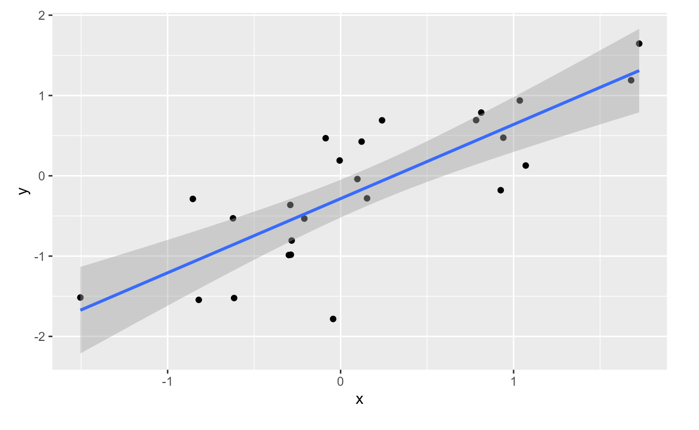
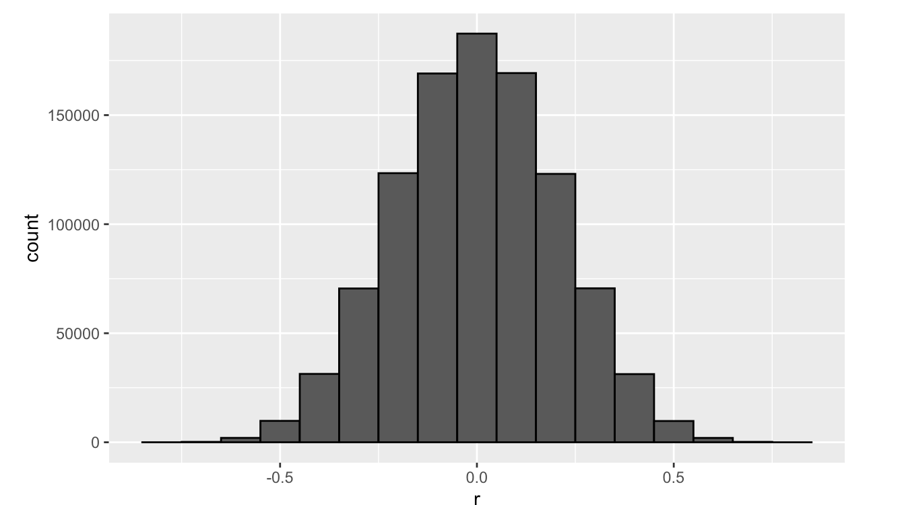

<html lang="en">

```{r setup, include=FALSE}
knitr::opts_chunk$set(
	echo = TRUE,
	message = FALSE,
	warning = FALSE
)

library(learnr) #necessary to render tutorial correctly

library(forcats)
library(ggplot2)
library(htmltools)
library(kableExtra)
library(lubridate)
library(magrittr)
library(tibble)


source("./www/datsci_helpers.R")
```

# datsci_07: Linear Regression

## Welcome to Data Science: Linear Regression!

<div class="infobox">
  
  **Usage:** This tutorial accompanies [Introduction to Data Science](https://rafalab.github.io/dsbook/) by [Prof Rafael Irizarry](http://rafalab.github.io/pages/about.html). It contains material from the textbook which is offered under a [CC BY-NC-SA 4.0](https://creativecommons.org/licenses/by-nc-sa/4.0/). 
  
</div>

### Data Science: Linear Regression!

We're excited to have you join us in this course, which is designed to teach you about linear regression, one of the most common statistical modeling approaches used in data science.

This is the **seventh** in a series of courses in the Introduction to Data Science program, a series of courses that prepare you to do data analysis in `r rproj()`, from simple computations to machine learning. We assume that you have taken the preceding six courses in the series or are already familiar with the content covered in them. 

Linear regression is commonly used to quantify the relationship between two or more variables. It is also used to adjust for confounding. In this course, we cover how to implement linear regression and adjust for confounding in practice using `r rproj()`.

In data science applications, it is very common to be interested in the relationship between two or more variables. The motivating case study we examine in this course relates to the data-driven approach used to construct baseball teams described in the book (and movie) Moneyball. We will try to determine which measured outcomes best predict baseball runs and to do this we'll use linear regression. 

We will also examine confounding, where extraneous variables affect the relationship between two or more other variables, leading to spurious associations. Linear regression is a powerful technique for removing confounders, but it is not a magical process, and it is essential to understand when it is appropriate to use. You will learn when to use it in this course. 

The class notes for this course series can be found in Professor Irizarry's freely available [Introduction to Data Science book](https://rafalab.github.io/dsbook/).

### In this course, you will learn:

- How linear regression was originally developed by Galton
- What confounding is and how to detect it
- How to examine the relationships between variables by implementing linear regression in `r rproj()`

### Course overview

There are three major sections in this course: introduction to linear regression, linear models, and confounding.

**Introduction to Linear Regression**

In this section, you'll learn the basics of linear regression through this course's motivating example, the data-driven approach used to construct baseball teams. You'll also learn about correlation, the correlation coefficient, stratification, and the variance explained.

**Linear Models**

In this section, you'll learn about linear models. You'll learn about least squares estimates, multivariate regression, and several useful features of `r rproj()`, such as tibbles, lm, do, and broom. You'll learn how to apply regression to baseball to build a better offensive metric.

**Confounding**

In the final section of the course, you'll learn about confounding and several reasons that correlation is not the same as causation, such as spurious correlation, outliers, reversing cause and effect, and confounders. You'll also learn about Simpson's Paradox.


## Introduction and Motivation


## Meet the Course Instructor

<div class="infobox">
  
  
**Rafael Irizarry** is a Professor of Biostatistics and Computational Biology at the Dana-Farber Cancer Institute and a Professor of Biostatistics at Harvard Chan School of Public Health. He has been analyzing data, from sound signals to genomic measurements, for over 20 years.

Professor Irizarry teaches a popular Data Science course at Harvard and has developed several online courses on data analysis that are offered by HarvardX. These online courses, divided into the Data Analysis for the Life Sciences series and Genomics Data Analysis series, have been completed by thousands of students and much of the material is included in a book with a [freely available online version](https://leanpub.com/dataanalysisforthelifesciences).

Webpage: http://rafalab.github.io 

</div>


## Essential Course Information

### Course Syllabus

The course syllabus contains a more comprehensive version of the information below - but if you don't read the syllabus, please read this!

### Course Structure

This is a self-paced course. You can work on it with your own timeline in mind. However, we suggest that you work on a section per week, and it will take you 2 - 4 hours per week. 

Check the course home page for important dates. If you are interested in pursuing a Verified Certificate, you will need to upgrade before the date listed on the home page and finish all assignments before course close.

### Grading

Assignments in the course allow you to practice your coding skills using the DataCamp platform. R is a flexible programming language designed partly for readability and ease of programming.

HarvardX has partnered with a platform called DataCamp to create programming assignments that you can do online. There is no need to install anything on your computer. You will be given a set of code to modify and run in your browser. You can take as many attempts as you need. When your code works correctly, you will be awarded points. You can also request hints, which will help you out, but hints decrease your point total. Remember that you can always go to the Discussion Board for help that doesn't cost points.

### Passing Rate

The passing rate is 70%. You must sign up for a Verified Certificate and earn a grade of 70% of higher in order to obtain a certificate for this course.

## Pre-Course Survey

Insert Survey Link here

*If you cannot see the survey above, click this link to access it in a new window.*

## Section 1 Overview: Data Import

In the **Introduction to Regression** section, you will learn the basics of linear regression.

After completing this section, you will be able to:

- Understand how Galton developed **linear regression**.

- Calculate and interpret the **sample correlation**.

- **Stratify** a dataset when appropriate.

- Understand what a **bivariate normal distribution** is.

- Explain what the term **variance explained** means.

- Interpret the two **regression lines**.

This section has three parts: **Baseball as a Motivating Example, Correlation**, and **Stratification and Variance Explained**. There are comprehension checks at the end of each part.

We encourage you to use `r rproj()` to interactively test out your answers and further your own learning.

## 1. Motivating Example: Moneyball


### Textbook link

The content is discussed within the [textbook section - 18.1 Case study: Moneyball](https://rafalab.github.io/dsbook/linear-models.html#case-study-moneyball).

### Key Points

- Bill James was the originator of the **sabermetrics**, the approach of using data to predict what outcomes best predicted if a team would win.


## Baseball Basics


### Textbook link

The content is discussed within the [textbook section - 18.1.2 Baseball basics](https://rafalab.github.io/dsbook/linear-models.html#baseball-basics).

### Key Points

- The goal of a baseball game is to score more runs (points) than the other team.

- Each team has 9 batters who have an opportunity to hit a ball with a bat in a predetermined order. 

- Each time a batter has an opportunity to bat, we call it a plate appearance (PA).

- The PA ends with a binary outcome: the batter either makes an out (failure) and returns to the bench or the batter doesn’t (success) and can run around the bases, and potentially score a run (reach all 4 bases).

- We are simplifying a bit, but there are five ways a batter can succeed (not make an out):

  - Bases on balls (BB): the pitcher fails to throw the ball through a predefined area considered to be hittable (the strike zone), so the batter is permitted to go to first base.
  
  - Single: the batter hits the ball and gets to first base.
  
  - Double (2B): the batter hits the ball and gets to second base.
  
  - Triple (3B): the batter hits the ball and gets to third base.
  
  - Home Run (HR): the batter hits the ball and goes all the way home and scores a run.
  
- Historically, the batting average has been considered the most important offensive statistic. To define this average, we define a hit (H) and an at bat (AB). Singles, doubles, triples and home runs are hits. The fifth way to be successful, a walk (BB), is not a hit. An AB is the number of times you either get a hit or make an out; BBs are excluded. The batting average is simply H/AB and is considered the main measure of a success rate.

- Note: The video states that if you hit AFTER someone who hits many home runs, you will score many runs, while the textbook states that if you hit BEFORE someone who hits many home runs, you will score many runs. The textbook wording is accurate.


## Bases on Balls or Stolen Bases?


### Textbook link

The content is discussed within the [textbook section - 18.1.4 Base on balls or stolen bases?](https://rafalab.github.io/dsbook/linear-models.html#base-on-balls-or-stolen-bases). 

### Key Points

- The visualization of choice when exploring the relationship between two variables like home runs and runs is a scatterplot.


### Code: Scatterplot of the relationship between HRs and wins 

```{r, eval = TRUE}
library(Lahman)
library(tidyverse)
library(dslabs)
ds_theme_set()

Teams %>% filter(yearID %in% 1961:2001) %>%
    mutate(HR_per_game = HR / G, R_per_game = R / G) %>%
    ggplot(aes(HR_per_game, R_per_game)) + 
    geom_point(alpha = 0.5)
```

### Code: Scatterplot of the relationship between stolen bases and wins

```{r, eval = TRUE}
Teams %>% filter(yearID %in% 1961:2001) %>%
    mutate(SB_per_game = SB / G, R_per_game = R / G) %>%
    ggplot(aes(SB_per_game, R_per_game)) + 
    geom_point(alpha = 0.5)
```

### Code: Scatterplot of the relationship between bases on balls and runs

```{r, eval = TRUE}
Teams %>% filter(yearID %in% 1961:2001) %>%
    mutate(BB_per_game = BB / G, R_per_game = R / G) %>%
    ggplot(aes(BB_per_game, R_per_game)) + 
    geom_point(alpha = 0.5)
```

## 1.1 Assessment: Baseball as a Motivating Example

Insert assessment here


## Correlation


### Textbook link

The content is discussed within the [textbook section - 17.1 Case study: is height hereditary?](https://rafalab.github.io/dsbook/regression.html#case-study-is-height-hereditary).

### Key Points

- Galton tried to predict sons' heights based on fathers' heights.

- The mean and standard errors are insufficient for describing an important characteristic of the data: the trend that the taller the father, the taller the son.

- The correlation coefficient is an informative summary of how two variables move together that can be used to predict one variable using the other.


### Code

```{r, eval = TRUE}
# create the dataset
library(tidyverse)
library(HistData)
data("GaltonFamilies")
set.seed(1983)
galton_heights <- GaltonFamilies %>%
  filter(gender == "male") %>%
  group_by(family) %>%
  sample_n(1) %>%
  ungroup() %>%
  select(father, childHeight) %>%
  rename(son = childHeight)

# means and standard deviations
galton_heights %>%
    summarize(mean(father), sd(father), mean(son), sd(son))

# scatterplot of father and son heights
galton_heights %>%
    ggplot(aes(father, son)) +
    geom_point(alpha = 0.5)
```


## Correlation Coefficient


### Textbook link

The content is discussed within the [textbook section - 17 Regression](https://rafalab.github.io/dsbook/regression.html#the-correlation-coefficient). 

### Key Points

<figure>

</figure> 


### Code

```{r, eval = FALSE}
rho <- mean(scale(x)*scale(y))
galton_heights %>% summarize(r = cor(father, son)) %>% pull(r)
```

## Sample Correlation is a Random Variable


### Textbook link

The content is discussed within the [textbook section - 17.2.1 Sample correlation is a random variable](https://rafalab.github.io/dsbook/regression.html#sample-correlation-is-a-random-variable). 

### Key Points

- The correlation that we compute and use as a summary is a random variable.

- When interpreting correlations, it is important to remember that correlations derived from samples are estimates containing uncertainty.

- Because the sample correlation is an average of independent draws, the central limit theorem applies. 


### Code

```{r, eval = TRUE}
# compute sample correlation
R <- sample_n(galton_heights, 25, replace = TRUE) %>%
    summarize(r = cor(father, son))
R

# Monte Carlo simulation to show distribution of sample correlation
B <- 1000
N <- 25
R <- replicate(B, {
    sample_n(galton_heights, N, replace = TRUE) %>%
    summarize(r = cor(father, son)) %>%
    pull(r)
})
qplot(R, geom = "histogram", binwidth = 0.05, color = I("black"))

# expected value and standard error
mean(R)
sd(R)

# QQ-plot to evaluate whether N is large enough
data.frame(R) %>%
    ggplot(aes(sample = R)) +
    stat_qq() +
    geom_abline(intercept = mean(R), slope = sqrt((1-mean(R)^2)/(N-2)))
```

## 1.2 Assessment: Correlation

Insert assessment here

## Anscombe's Quartet/Stratification


### Textbook link

There are three links to relevant sections of the textbook for this video:

- [17.2.2 Correlation is not always a useful summary](https://rafalab.github.io/dsbook/regression.html#correlation-is-not-always-a-useful-summary)

- [17.3 Conditional expectations](https://rafalab.github.io/dsbook/regression.html#conditional-expectation)

- [17.4 The regression line](https://rafalab.github.io/dsbook/regression.html#the-regression-line)

### Key Points

- Correlation is not always a good summary of the relationship between two variables.

- The general idea of conditional expectation is that we stratify a population into groups and compute summaries in each group.

- A practical way to improve the estimates of the conditional expectations is to define strata of with similar values of x.

- If there is perfect correlation, the regression line predicts an increase that is the same number of SDs for both variables. If there is 0 correlation, then we don’t use x at all for the prediction and simply predict the average 𝜇𝑦. For values between 0 and 1, the prediction is somewhere in between. If the correlation is negative, we predict a reduction instead of an increase.


### Code

```{r, eval = TRUE}
# number of fathers with height 72 or 72.5 inches
sum(galton_heights$father == 72)
sum(galton_heights$father == 72.5)

# predicted height of a son with a 72 inch tall father
conditional_avg <- galton_heights %>%
    filter(round(father) == 72) %>%
    summarize(avg = mean(son)) %>%
    pull(avg)
conditional_avg

# stratify fathers' heights to make a boxplot of son heights
galton_heights %>% mutate(father_strata = factor(round(father))) %>%
    ggplot(aes(father_strata, son)) +
    geom_boxplot() +
    geom_point()

# center of each boxplot
galton_heights %>%
    mutate(father = round(father)) %>%
    group_by(father) %>%
    summarize(son_conditional_avg = mean(son)) %>%
    ggplot(aes(father, son_conditional_avg)) +
    geom_point()

# calculate values to plot regression line on original data
mu_x <- mean(galton_heights$father)
mu_y <- mean(galton_heights$son)
s_x <- sd(galton_heights$father)
s_y <- sd(galton_heights$son)
r <- cor(galton_heights$father, galton_heights$son)
m <- r * s_y/s_x
b <- mu_y - m*mu_x

# add regression line to plot
galton_heights %>%
    ggplot(aes(father, son)) +
    geom_point(alpha = 0.5) +
    geom_abline(intercept = b, slope = m)
```

## Bivariate Normal Distribution


### Textbook link

The content is discussed within the [textbook section - 17.4.2 Bivariate normal distribution (advanced)](https://rafalab.github.io/dsbook/regression.html#bivariate-normal-distribution-advanced). 

### Key Points

- When a pair of random variables are approximated by the bivariate normal distribution, scatterplots look like ovals. They can be thin (high correlation) or circle-shaped (no correlation).

- When two variables follow a bivariate normal distribution, computing the regression line is equivalent to computing conditional expectations.

- We can obtain a much more stable estimate of the conditional expectation by finding the regression line and using it to make predictions.


### Code

```{r, eval = TRUE}
galton_heights %>%
  mutate(z_father = round((father - mean(father)) / sd(father))) %>%
  filter(z_father %in% -2:2) %>%
  ggplot() +  
  stat_qq(aes(sample = son)) +
  facet_wrap( ~ z_father)
```

## Variance Explained

### Correction

The equation shown at 0:10 is for the standard deviation of the conditional distribution, not the variance. The variance is the standard deviation squared. See the notes below the video for more clarification.


### Textbook link

The video corresponds to the [textbook section - 17.4.3 Variance explained](https://rafalab.github.io/dsbook/regression.html#variance-explained). 


### Key points

<figure>

</figure> 

## There are Two Regression Lines


### Textbook link

The content is discussed within the [textbook section - 17.4.4 Warning: there are two regression lines](https://rafalab.github.io/dsbook/regression.html#warning-there-are-two-regression-lines). 

### Key Points

- There are two different regression lines depending on whether we are taking the expectation of Y given X or taking the expectation of X given Y.


### Code

```{r, eval = TRUE}
# compute a regression line to predict the son's height from the father's height
mu_x <- mean(galton_heights$father)
mu_y <- mean(galton_heights$son)
s_x <- sd(galton_heights$father)
s_y <- sd(galton_heights$son)
r <- cor(galton_heights$father, galton_heights$son)
m_1 <-  r * s_y / s_x
b_1 <- mu_y - m_1*mu_x

# compute a regression line to predict the father's height from the son's height
m_2 <-  r * s_x / s_y
b_2 <- mu_x - m_2*mu_y
```

## 1.3 Assessment: Stratification and Variance Explained, Part 1

Insert assessment here

## 1.3 Assessment: Stratification and Variance Explained, Part 2

Insert assessment here

## Section 2 Overview: Linear Models

In the **Linear Models** section, you will learn how to do linear regression.

After completing this section, you will be able to:

- Use **multivariate regression** to adjust for confounders.

- Write **linear models** to describe the relationship between two or more variables.

- Calculate the **least squares estimates** for a regression model using the `lm` function.

- Understand the differences between **tibbles** and **data frames**.

- Use the `do()` function to bridge `r rproj()` functions and the tidyverse.

- Use the `tidy()`, `glance()`, and `augment()` functions from the broom package.

- Apply linear regression to **measurement error models**.

This section has four parts: **Introduction to Linear Models, Least Squares Estimates, Tibbles, do, and broom, and Regression and Baseball**. There are comprehension checks at the end of each part, along with an assessment on linear models at the end of the whole section.

We encourage you to use `r rproj()` to interactively test out your answers and further your own learning.

## Confounding: Are BBs More Predictive?


### Textbook link

The content is discussed within the [textbook section - 18.2 Confounding](https://rafalab.github.io/dsbook/linear-models.html#confounding). 

### Key Points

- Association is not causation!

- Although it may appear that BB cause runs, it is actually the HR that cause most of these runs. We say that BB are **confounded** with HR.

- Regression can help us account for confounding.


### Code

```{r, eval = FALSE}
# find regression line for predicting runs from BBs
library(tidyverse)
library(Lahman)
bb_slope <- Teams %>% 
  filter(yearID %in% 1961:2001 ) %>% 
  mutate(BB_per_game = BB/G, R_per_game = R/G) %>% 
  lm(R_per_game ~ BB_per_game, data = .) %>% 
  .$coef %>%
  .[2]
bb_slope

# compute regression line for predicting runs from singles
singles_slope <- Teams %>% 
  filter(yearID %in% 1961:2001 ) %>%
  mutate(Singles_per_game = (H-HR-X2B-X3B)/G, R_per_game = R/G) %>%
  lm(R_per_game ~ Singles_per_game, data = .) %>%
  .$coef  %>%
  .[2]
singles_slope

# calculate correlation between HR, BB and singles
Teams %>% 
  filter(yearID %in% 1961:2001 ) %>% 
  mutate(Singles = (H-HR-X2B-X3B)/G, BB = BB/G, HR = HR/G) %>%  
  summarize(cor(BB, HR), cor(Singles, HR), cor(BB,Singles))
```

## Stratification and Multivariate Regression


### Textbook link

The content is discussed within the [textbook section - 18.2.2 Multivariate regression](https://rafalab.github.io/dsbook/linear-models.html#multivariate-regression). 

### Key Points

- A first approach to check confounding is to keep HRs fixed at a certain value and then examine the relationship between BB and runs.

- The slopes of BB after stratifying on HR are reduced, but they are not 0, which indicates that BB are helpful for producing runs, just not as much as previously thought.


### Code

```{r, eval = TRUE}
# stratify HR per game to nearest 10, filter out strata with few points
dat <- Teams %>% filter(yearID %in% 1961:2001) %>%
  mutate(HR_strata = round(HR/G, 1), 
         BB_per_game = BB / G,
         R_per_game = R / G) %>%
  filter(HR_strata >= 0.4 & HR_strata <=1.2)
  
# scatterplot for each HR stratum
dat %>% 
  ggplot(aes(BB_per_game, R_per_game)) +  
  geom_point(alpha = 0.5) +
  geom_smooth(method = "lm") +
  facet_wrap( ~ HR_strata)
  
# calculate slope of regression line after stratifying by HR
dat %>%  
  group_by(HR_strata) %>%
  summarize(slope = cor(BB_per_game, R_per_game)*sd(R_per_game)/sd(BB_per_game))
  
# stratify by BB
dat <- Teams %>% filter(yearID %in% 1961:2001) %>%
  mutate(BB_strata = round(BB/G, 1), 
         HR_per_game = HR / G,
         R_per_game = R / G) %>%
  filter(BB_strata >= 2.8 & BB_strata <=3.9) 

# scatterplot for each BB stratum
dat %>% ggplot(aes(HR_per_game, R_per_game)) +  
  geom_point(alpha = 0.5) +
  geom_smooth(method = "lm") +
  facet_wrap( ~ BB_strata)
  
# slope of regression line after stratifying by BB
dat %>%  
  group_by(BB_strata) %>%
  summarize(slope = cor(HR_per_game, R_per_game)*sd(R_per_game)/sd(HR_per_game)) 
```

## Linear Models


### Textbook link

The content is discussed within the [textbook section - 18.3 Least squares estimates](https://rafalab.github.io/dsbook/linear-models.html#lse). 

### Key Points


<figure>

</figure> 


## 2.1 Assessment: Introduction to Linear Models

Insert assessment here

## Least Squares Estimates (LSE)


### Textbook link

The content is discussed within the [textbook section - 18.3 Least squares estimates](https://rafalab.github.io/dsbook/linear-models.html#lse). 

### Key Points

<figure>

</figure> 


### Code

```{r, eval = TRUE}
# compute RSS for any pair of beta0 and beta1 in Galton's data
library(HistData)
data("GaltonFamilies")
set.seed(1983)
galton_heights <- GaltonFamilies %>%
  filter(gender == "male") %>%
  group_by(family) %>%
  sample_n(1) %>%
  ungroup() %>%
  select(father, childHeight) %>%
  rename(son = childHeight)
rss <- function(beta0, beta1, data){
    resid <- galton_heights$son - (beta0+beta1*galton_heights$father)
    return(sum(resid^2))
}

# plot RSS as a function of beta1 when beta0=25
beta1 = seq(0, 1, len=nrow(galton_heights))
results <- data.frame(beta1 = beta1,
                      rss = sapply(beta1, rss, beta0 = 25))
results %>% ggplot(aes(beta1, rss)) + geom_line() + 
  geom_line(aes(beta1, rss))
```

## The lm Function


### Textbook link

The content is discussed within the [textbook section - 18.3.3 The lm function](https://rafalab.github.io/dsbook/linear-models.html#the-lm-function). 

### Key Points

- When calling the lm() function, the variable that we want to predict is put to the left of the ~ symbol, and the variables that we use to predict is put to the right of the ~ symbol. The intercept is added automatically.

- LSEs are random variables.


### Code

```{r, eval = TRUE}
# fit regression line to predict son's height from father's height
fit <- lm(son ~ father, data = galton_heights)
fit

# summary statistics
summary(fit)
```

## LSE are Random Variables


### Textbook link

The content is discussed within the [textbook section - 18.3.4 LSE are random variables](https://rafalab.github.io/dsbook/linear-models.html#lse-are-random-variables). 

### Key Points


<figure>

</figure> 


### Code

```{r, eval = TRUE}
# fit regression line to predict son's height from father's height
# Monte Carlo simulation
B <- 1000
N <- 50
lse <- replicate(B, {
  sample_n(galton_heights, N, replace = TRUE) %>% 
    lm(son ~ father, data = .) %>% 
    .$coef 
})
lse <- data.frame(beta_0 = lse[1,], beta_1 = lse[2,]) 

# Plot the distribution of beta_0 and beta_1
library(gridExtra)
p1 <- lse %>% ggplot(aes(beta_0)) + geom_histogram(binwidth = 5, color = "black") 
p2 <- lse %>% ggplot(aes(beta_1)) + geom_histogram(binwidth = 0.1, color = "black") 
grid.arrange(p1, p2, ncol = 2)

# summary statistics
sample_n(galton_heights, N, replace = TRUE) %>% 
  lm(son ~ father, data = .) %>% 
  summary %>%
  .$coef
  
lse %>% summarize(se_0 = sd(beta_0), se_1 = sd(beta_1))
```

## Advanced Note on LSE

Although interpretation is not straight-forward, it is also useful to know that the LSE can be strongly correlated, which can be seen using this code:

```{r, eval = FALSE}
lse %>% summarize(cor(beta_0, beta_1))
```


<figure>

</figure> 


```{r, eval = FALSE}
B <- 1000
N <- 50
lse <- replicate(B, {
      sample_n(galton_heights, N, replace = TRUE) %>%
      mutate(father = father - mean(father)) %>%
      lm(son ~ father, data = .) %>% .$coef 
})
```

Observe what happens to the correlation in this case:

```{r, eval = FALSE}
cor(lse[1,], lse[2,]) 
```

## 2.1 Assessment: Least Squares Estimates, part 1

Insert assessment here

## 2.1 Assessment: Least Squares Estimates, part 2

Insert assessment here


## Predicted Variables are Random Variables


### Textbook link

The content is discussed within the [textbook section - 18.3.5 Predicted values are random variables](https://rafalab.github.io/dsbook/linear-models.html#predicted-values-are-random-variables). 

### Key Points


<figure>

</figure> 


### Code

```{r, eval = TRUE}
# plot predictions and confidence intervals
galton_heights %>% ggplot(aes(son, father)) +
  geom_point() +
  geom_smooth(method = "lm")
  
# predict Y directly
fit <- galton_heights %>% lm(son ~ father, data = .) 
Y_hat <- predict(fit, se.fit = TRUE)
names(Y_hat)

# plot best fit line
galton_heights %>%
  mutate(Y_hat = predict(lm(son ~ father, data=.))) %>%
  ggplot(aes(father, Y_hat))+
  geom_line()
```

## Advanced dplyr: Tibbles


### Textbook link

The content is discussed within the [textbook section - 18.5 Linear regression in the tidyverse](https://rafalab.github.io/dsbook/linear-models.html#linear-regression-in-the-tidyverse). 

### Key Points

- Tibbles can be regarded as a modern version of data frames and are the default data structure in the tidyverse.

- Some functions that do not work properly with data frames do work with tibbles.


### Code

```{r, eval = FALSE}
# stratify by HR
dat <- Teams %>% filter(yearID %in% 1961:2001) %>%
  mutate(HR = round(HR/G, 1), 
         BB = BB/G,
         R = R/G) %>%
  select(HR, BB, R) %>%
  filter(HR >= 0.4 & HR<=1.2)
  
# calculate slope of regression lines to predict runs by BB in different HR strata
dat %>%  
  group_by(HR) %>%
  summarize(slope = cor(BB,R)*sd(R)/sd(BB))
  
# use lm to get estimated slopes - lm does not work with grouped tibbles
dat %>%  
  group_by(HR) %>%
  lm(R ~ BB, data = .) %>%
  .$coef
  
# inspect a grouped tibble
dat %>% group_by(HR) %>% head()
dat %>% group_by(HR) %>% class()
```

## Tibbles: Differences from Data Frames


### Key Points

- Tibbles are more readable than data frames.

- If you subset a data frame, you may not get a data frame. If you subset a tibble, you always get a tibble.

- Tibbles can hold more complex objects such as lists or functions.

- Tibbles can be grouped.


### Code

```{r, eval = FALSE}
# inspect data frame and tibble
Teams
as.tibble(Teams)

# subsetting a data frame sometimes generates vectors
class(Teams[,20])

# subsetting a tibble always generates tibbles
class(as.tibble(Teams[,20]))

# pulling a vector out of a tibble
class(as.tibble(Teams)$HR)

# access a non-existing column in a data frame or a tibble
Teams$hr
as.tibble(Teams)$hr

# create a tibble with complex objects
tibble(id = c(1, 2, 3), func = c(mean, median, sd))
```

## do


### Textbook link

The content is discussed within the [textbook section - 18.5 Linear regression in the tidyverse](https://rafalab.github.io/dsbook/linear-models.html#linear-regression-in-the-tidyverse). 

### Key Points

- The `do()` function serves as a bridge between `r rproj()` functions, such as `lm()`, and the tidyverse.

- We have to specify a column when using the `do()` function, otherwise we will get an error.

- If the data frame being returned has more than one row, the rows will be concatenated appropriately.


### Code

```{r, eval = FALSE}
# use do to fit a regression line to each HR stratum
dat %>%  
    group_by(HR) %>%
    do(fit = lm(R ~ BB, data = .))
    
# using do without a column name gives an error
dat %>%
    group_by(HR) %>%
    do(lm(R ~ BB, data = .))

# define a function to extract slope from lm
get_slope <- function(data){
  fit <- lm(R ~ BB, data = data)
  data.frame(slope = fit$coefficients[2], 
             se = summary(fit)$coefficient[2,2])
}

# return the desired data frame
dat %>%  
  group_by(HR) %>%
  do(get_slope(.))
  
# not the desired output: a column containing data frames
dat %>%  
  group_by(HR) %>%
  do(slope = get_slope(.))
  
# data frames with multiple rows will be concatenated appropriately
get_lse <- function(data){
  fit <- lm(R ~ BB, data = data)
  data.frame(term = names(fit$coefficients),
    slope = fit$coefficients, 
    se = summary(fit)$coefficient[,2])
}

dat %>%  
  group_by(HR) %>%
  do(get_lse(.))
```

## broom


### Textbook link

The content is discussed within the [textbook section - 18.5.1 The broom package](https://rafalab.github.io/dsbook/linear-models.html#the-broom-package). 

### Key Points

- The **broom** package has three main functions, all of which extract information from the object returned by `lm` and return it in a **tidyverse** friendly data frame.

- The `tidy()` function returns estimates and related information as a data frame.

- The functions `glance()` and `augment()` relate to model specific and observation specific outcomes respectively.


### Code

```{r, eval = FALSE}
# use tidy to return lm estimates and related information as a data frame
library(broom)
fit <- lm(R ~ BB, data = dat)
tidy(fit)

# add confidence intervals with tidy
tidy(fit, conf.int = TRUE)

# pipeline with lm, do, tidy
dat %>%  
  group_by(HR) %>%
  do(tidy(lm(R ~ BB, data = .), conf.int = TRUE)) %>%
  filter(term == "BB") %>%
  select(HR, estimate, conf.low, conf.high)
  
# make ggplots
dat %>%  
  group_by(HR) %>%
  do(tidy(lm(R ~ BB, data = .), conf.int = TRUE)) %>%
  filter(term == "BB") %>%
  select(HR, estimate, conf.low, conf.high) %>%
  ggplot(aes(HR, y = estimate, ymin = conf.low, ymax = conf.high)) +
  geom_errorbar() +
  geom_point()
  
# inspect with glance
glance(fit)
```

## 2.3 Assessment: Tibbles, do, and broom, part 1

Insert assessment here

## 2.3 Assessment: Tibbles, do, and broom, part 2

Insert assessment here

## Building a Better Offensive Metric for Baseball


### Textbook link

The content is discussed within the [textbook section - 18.7 Case study: Moneyball (continued)](https://rafalab.github.io/dsbook/linear-models.html#case-study-moneyball-continued). 

### Code

```{r, eval = FALSE}
# linear regression with two variables
fit <- Teams %>% 
  filter(yearID %in% 1961:2001) %>% 
  mutate(BB = BB/G, HR = HR/G,  R = R/G) %>%  
  lm(R ~ BB + HR, data = .)
  tidy(fit, conf.int = TRUE)
  
# regression with BB, singles, doubles, triples, HR
fit <- Teams %>% 
  filter(yearID %in% 1961:2001) %>% 
  mutate(BB = BB / G, 
         singles = (H - X2B - X3B - HR) / G, 
         doubles = X2B / G, 
         triples = X3B / G, 
         HR = HR / G,
         R = R / G) %>%  
  lm(R ~ BB + singles + doubles + triples + HR, data = .)
coefs <- tidy(fit, conf.int = TRUE)
coefs

# predict number of runs for each team in 2002 and plot
Teams %>% 
  filter(yearID %in% 2002) %>% 
  mutate(BB = BB/G, 
         singles = (H-X2B-X3B-HR)/G, 
         doubles = X2B/G, 
         triples =X3B/G, 
         HR=HR/G,
         R=R/G)  %>% 
  mutate(R_hat = predict(fit, newdata = .)) %>%
  ggplot(aes(R_hat, R, label = teamID)) + 
  geom_point() +
  geom_text(nudge_x=0.1, cex = 2) + 
  geom_abline()
  
# average number of team plate appearances per game
pa_per_game <- Batting %>% filter(yearID == 2002) %>% 
  group_by(teamID) %>%
  summarize(pa_per_game = sum(AB+BB)/max(G)) %>% 
  pull(pa_per_game) %>% 
  mean
  
# compute per-plate-appearance rates for players available in 2002 using previous data
players <- Batting %>% filter(yearID %in% 1999:2001) %>% 
  group_by(playerID) %>%
  mutate(PA = BB + AB) %>%
  summarize(G = sum(PA)/pa_per_game,
    BB = sum(BB)/G,
    singles = sum(H-X2B-X3B-HR)/G,
    doubles = sum(X2B)/G, 
    triples = sum(X3B)/G, 
    HR = sum(HR)/G,
    AVG = sum(H)/sum(AB),
    PA = sum(PA)) %>%
  filter(PA >= 300) %>%
  select(-G) %>%
  mutate(R_hat = predict(fit, newdata = .))
  
# plot player-specific predicted runs
qplot(R_hat, data = players, geom = "histogram", binwidth = 0.5, color = I("black"))

# add 2002 salary of each player
players <- Salaries %>% 
  filter(yearID == 2002) %>%
  select(playerID, salary) %>%
  right_join(players, by="playerID")
  
# add defensive position
position_names <- c("G_p","G_c","G_1b","G_2b","G_3b","G_ss","G_lf","G_cf","G_rf")
tmp_tab <- Appearances %>% 
  filter(yearID == 2002) %>% 
  group_by(playerID) %>%
  summarize_at(position_names, sum) %>%
  ungroup()  
pos <- tmp_tab %>%
  select(position_names) %>%
  apply(., 1, which.max) 
players <- data_frame(playerID = tmp_tab$playerID, POS = position_names[pos]) %>%
  mutate(POS = str_to_upper(str_remove(POS, "G_"))) %>%
  filter(POS != "P") %>%
  right_join(players, by="playerID") %>%
  filter(!is.na(POS)  & !is.na(salary))
  
# add players' first and last names
players <- Master %>%
  select(playerID, nameFirst, nameLast, debut) %>%
  mutate(debut = as.Date(debut)) %>%
  right_join(players, by="playerID")
  
# top 10 players
players %>% select(nameFirst, nameLast, POS, salary, R_hat) %>% 
  arrange(desc(R_hat)) %>% 
  top_n(10) 
  
# players with a higher metric have higher salaries
players %>% ggplot(aes(salary, R_hat, color = POS)) + 
  geom_point() +
  scale_x_log10()
  
# remake plot without players that debuted after 1998
library(lubridate)
players %>% filter(year(debut) < 1998) %>%
 ggplot(aes(salary, R_hat, color = POS)) + 
  geom_point() +
  scale_x_log10()
```

## Building a Better Offensive Metric for Baseball: Linear Programming

A way to actually pick the players for the team can be done using what computer scientists call **linear programming**. Although we don't go into this topic in detail in this course, we include the code anyway:

```{r, eval = FALSE}
library(reshape2)
library(lpSolve)

players <- players %>% filter(debut <= "1997-01-01" & debut > "1988-01-01")
constraint_matrix <- acast(players, POS ~ playerID, fun.aggregate = length)
npos <- nrow(constraint_matrix)
constraint_matrix <- rbind(constraint_matrix, salary = players$salary)
constraint_dir <- c(rep("==", npos), "<=")
constraint_limit <- c(rep(1, npos), 50*10^6)
lp_solution <- lp("max", players$R_hat,
                  constraint_matrix, constraint_dir, constraint_limit,
                  all.int = TRUE) 
```

This algorithm chooses these 9 players:


```{r, eval = FALSE}
our_team <- players %>%
  filter(lp_solution$solution == 1) %>%
  arrange(desc(R_hat))
our_team %>% select(nameFirst, nameLast, POS, salary, R_hat)
```

We note that these players all have above average BB and HR rates while the same is not true for singles.

```{r, eval = FALSE}
my_scale <- function(x) (x - median(x))/mad(x)
players %>% mutate(BB = my_scale(BB), 
                   singles = my_scale(singles),
                   doubles = my_scale(doubles),
                   triples = my_scale(triples),
                   HR = my_scale(HR),
                   AVG = my_scale(AVG),
                   R_hat = my_scale(R_hat)) %>%
    filter(playerID %in% our_team$playerID) %>%
    select(nameFirst, nameLast, BB, singles, doubles, triples, HR, AVG, R_hat) %>%
    arrange(desc(R_hat))
```

## On Base Plus Slugging (OPS)


### Key points

  <figure>
  
  </figure> 

## Regression Fallacy


### Textbook link

The content is discussed within the [textbook section - 18.8 The regression fallacy](https://rafalab.github.io/dsbook/linear-models.html#the-regression-fallacy). 

### Key points

- Regression can bring about errors in reasoning, especially when interpreting individual observations.

- The example showed in the video demonstrates that the **"sophomore slump"** observed in the data is caused by regressing to the mean.


### Code
The code to create a table with player ID, their names, and their most played position:

```{r, eval = TRUE}
library(Lahman)
playerInfo <- Fielding %>%
    group_by(playerID) %>%
    arrange(desc(G)) %>%
    slice(1) %>%
    ungroup %>%
    left_join(Master, by="playerID") %>%
    select(playerID, nameFirst, nameLast, POS)
```

### The code to create a table with only the ROY award winners and add their batting statistics:

```{r, eval = TRUE}
ROY <- AwardsPlayers %>%
    filter(awardID == "Rookie of the Year") %>%
    left_join(playerInfo, by="playerID") %>%
    rename(rookie_year = yearID) %>%
    right_join(Batting, by="playerID") %>%
    mutate(AVG = H/AB) %>%
    filter(POS != "P")
```

### The code to keep only the rookie and sophomore seasons and remove players who did not play sophomore seasons:

```{r, eval = TRUE}
ROY <- ROY %>%
    filter(yearID == rookie_year | yearID == rookie_year+1) %>%
    group_by(playerID) %>%
    mutate(rookie = ifelse(yearID == min(yearID), "rookie", "sophomore")) %>%
    filter(n() == 2) %>%
    ungroup %>%
    select(playerID, rookie_year, rookie, nameFirst, nameLast, AVG)
```

### The code to use the spread function to have one column for the rookie and sophomore years batting averages:

```{r, eval = TRUE}
ROY <- ROY %>% spread(rookie, AVG) %>% arrange(desc(rookie))
ROY
```

### The code to calculate the proportion of players who have a lower batting average their sophomore year:

```{r, eval = TRUE}
mean(ROY$sophomore - ROY$rookie <= 0)
```

### The code to do the similar analysis on all players that played the 2013 and 2014 seasons and batted more than 130 times (minimum to win Rookie of the Year):

```{r, eval = TRUE}
two_years <- Batting %>%
    filter(yearID %in% 2013:2014) %>%
    group_by(playerID, yearID) %>%
    filter(sum(AB) >= 130) %>%
    summarize(AVG = sum(H)/sum(AB)) %>%
    ungroup %>%
    spread(yearID, AVG) %>%
    filter(!is.na(`2013`) & !is.na(`2014`)) %>%
    left_join(playerInfo, by="playerID") %>%
    filter(POS!="P") %>%
    select(-POS) %>%
    arrange(desc(`2013`)) %>%
    select(nameFirst, nameLast, `2013`, `2014`)
two_years
```

### The code to see what happens to the worst performers of 2013:

```{r, eval = TRUE}
arrange(two_years, `2013`)
```

### The code to see  the correlation for performance in two separate years:

```{r, eval = TRUE}
qplot(`2013`, `2014`, data = two_years)

summarize(two_years, cor(`2013`,`2014`))
```

## Measurement Error Models


### Textbook link

The content is discussed within the [textbook section - 18.9 Measurement error models](https://rafalab.github.io/dsbook/linear-models.html#measurement-error-models). 

### Key points

- Up to now, all our linear regression examples have been applied to two or more random variables. We assume the pairs are bivariate normal and use this to motivate a linear model.

- Another use for linear regression is with **measurement error models**, where it is common to have a non-random covariate (such as time). Randomness is introduced from measurement error rather than sampling or natural variability.


### The code to use dslabs function rfalling_object to generate simulations of dropping balls:

```{r, eval = TRUE}
library(dslabs)
library(tidyverse)
library(broom)
falling_object <- rfalling_object()
```

### The code to draw the trajectory of the ball:

```{r, eval = TRUE}
falling_object %>%
    ggplot(aes(time, observed_distance)) +
    geom_point() +
    ylab("Distance in meters") +
    xlab("Time in seconds")
```

### The code to use the `lm()` function to estimate the coefficients:

```{r, eval = TRUE}
fit <- falling_object %>%
    mutate(time_sq = time^2) %>%
    lm(observed_distance~time+time_sq, data=.)

tidy(fit)
```

### The code to check if the estimated parabola fits the data:

```{r, eval = TRUE}
augment(fit) %>%
    ggplot() +
    geom_point(aes(time, observed_distance)) +
    geom_line(aes(time, .fitted), col = "blue")
```

### The code to see the summary statistic of the regression:

```{r, eval = TRUE}
tidy(fit, conf.int = TRUE)
```

## 2.4 Assessment: Regression and Baseball, part 1

Insert assessment here

## 2.4 Assessment: Regression and Baseball, part 2

Insert assessment here

## 2.4 Assessment: Linear Models

Insert assessment here

## Section 3 Overview: Confounding

In the **Confounding** section, you will learn what is perhaps the most important lesson of statistics: that correlation is not causation.

After completing this section, you will be able to:

- Identify examples of **spurious correlation** and explain how **data dredging** can lead to spurious correlation.

- Explain how **outliers** can drive correlation and learn to adjust for outliers using **Spearman correlation**.

- Explain how **reversing cause and effect** can lead to associations being confused with causation.

- Understand how **confounders** can lead to the misinterpretation of associations.

- Explain and give examples of **Simpson's Paradox**.

This section has one part: **Correlation is Not Causation**. There is a comprehension checks at the end of this part, along with an assessment at the end of the section.

We encourage you to use `r rproj()` to interactively test out your answers and further your own learning.

## 3. Correlation is Not Causation: Spurious Correlation


### Textbook link

The content is discussed within the [textbook section - 19.1 Spurious correlation](https://rafalab.github.io/dsbook/association-is-not-causation.html#spurious-correlation). 


### Key points

- Association/correlation is not causation.

- p-hacking is a topic of much discussion because it is a problem in scientific publications. Because publishers tend to reward statistically significant results over negative results, there is an incentive to report significant results.


### Code

```{r, eval = TRUE}
# generate the Monte Carlo simulation
N <- 25
g <- 1000000
sim_data <- tibble(group = rep(1:g, each = N), x = rnorm(N * g), y = rnorm(N * g))

# calculate correlation between X,Y for each group
res <- sim_data %>% 
  group_by(group) %>% 
  summarize(r = cor(x, y)) %>% 
  arrange(desc(r))
res

# plot points from the group with maximum correlation
sim_data %>% filter(group == res$group[which.max(res$r)]) %>%
  ggplot(aes(x, y)) +
  geom_point() + 
  geom_smooth(method = "lm")
  
# histogram of correlation in Monte Carlo simulations
res %>% ggplot(aes(x=r)) + geom_histogram(binwidth = 0.1, color = "black")

# linear regression on group with maximum correlation
library(broom)
sim_data %>% 
  filter(group == res$group[which.max(res$r)]) %>%
  do(tidy(lm(y ~ x, data = .)))
```

## Correlation is Not Causation: Outliers


### Textbook link

The content is discussed within the [textbook section - 19.2 Outliers](https://rafalab.github.io/dsbook/association-is-not-causation.html#outliers-1). 


### Key points

- ACorrelations can be caused by **outliers**.

- The **Spearman correlation** is calculated based on the ranks of data.


### Code

```{r, eval = TRUE}
# simulate independent X, Y and standardize all except entry 23
set.seed(1985)
x <- rnorm(100,100,1)
y <- rnorm(100,84,1)
x[-23] <- scale(x[-23])
y[-23] <- scale(y[-23])

# plot shows the outlier
qplot(x, y, alpha = 0.5)

# outlier makes it appear there is correlation
cor(x,y)
cor(x[-23], y[-23])

# use rank instead
qplot(rank(x), rank(y))
cor(rank(x), rank(y))

# Spearman correlation with cor function
cor(x, y, method = "spearman")
```

## Correlation is Not Causation: Outliers


### Textbook link

The content is discussed within the [textbook section - 19.2 Outliers](https://rafalab.github.io/dsbook/association-is-not-causation.html#outliers-1). 


### Key points

- Correlations can be caused by **outliers**.

- The **Spearman correlation** is calculated based on the ranks of data.


### Code

```{r, eval = TRUE}
# simulate independent X, Y and standardize all except entry 23
set.seed(1985)
x <- rnorm(100,100,1)
y <- rnorm(100,84,1)
x[-23] <- scale(x[-23])
y[-23] <- scale(y[-23])

# plot shows the outlier
qplot(x, y, alpha = 0.5)

# outlier makes it appear there is correlation
cor(x,y)
cor(x[-23], y[-23])

# use rank instead
qplot(rank(x), rank(y))
cor(rank(x), rank(y))

# Spearman correlation with cor function
cor(x, y, method = "spearman")
```

## Correlation is Not Causation: Reversing Cause and Effect


### Textbook link

The content is discussed within the [textbook section - 19.3 Reversing cause and effect](https://rafalab.github.io/dsbook/association-is-not-causation.html#reversing-cause-and-effect). 


### Key points

- Another way association can be confused with causation is when the **cause and effect are reversed**.

- As discussed in the video, in the Galton data, when father and son were reversed in the regression, the model was technically correct. The estimates and p-values were obtained correctly as well. What was incorrect was the **interpretation** of the model.


### Code

```{r, eval = FALSE}
# cause and effect reversal using son heights to predict father heights
library(HistData)
data("GaltonFamilies")
GaltonFamilies %>%
  filter(childNum == 1 & gender == "male") %>%
  select(father, childHeight) %>%
  rename(son = childHeight) %>% 
  do(tidy(lm(father ~ son, data = .)))
```

## Correlation is Not Causation: Confounders


### Textbook link

The content is discussed within the [textbook section - 19.4 Confounders](https://rafalab.github.io/dsbook/association-is-not-causation.html#confounders). 


### Key points

- If X and Y are correlated, we call Z a **confounder** if changes in Z causes changes in both X and Y.


### Code

```{r, eval = TRUE}
# UC-Berkeley admission data
library(dslabs)
data(admissions)
admissions

# percent men and women accepted
admissions %>% group_by(gender) %>% 
  summarize(percentage = 
              round(sum(admitted*applicants)/sum(applicants),1))
              
# test whether gender and admission are independent
admissions %>% group_by(gender) %>% 
  summarize(total_admitted = round(sum(admitted / 100 * applicants)), 
            not_admitted = sum(applicants) - sum(total_admitted)) %>%
  select(-gender) %>% 
  do(tidy(chisq.test(.)))
  
# percent admissions by major
admissions %>% select(major, gender, admitted) %>%
  spread(gender, admitted) %>%
  mutate(women_minus_men = women - men)
  
# plot total percent admitted to major versus percent women applicants
admissions %>% 
  group_by(major) %>% 
  summarize(major_selectivity = sum(admitted * applicants) / sum(applicants),
            percent_women_applicants = sum(applicants * (gender=="women")) /
                                             sum(applicants) * 100) %>%
  ggplot(aes(major_selectivity, percent_women_applicants, label = major)) +
  geom_text()
  
# plot number of applicants admitted and not
admissions %>%
  mutate(yes = round(admitted/100*applicants), no = applicants - yes) %>%
  select(-applicants, -admitted) %>%
  gather(admission, number_of_students, -c("major", "gender")) %>%
  ggplot(aes(gender, number_of_students, fill = admission)) +
  geom_bar(stat = "identity", position = "stack") +
  facet_wrap(. ~ major)

admissions %>% 
  mutate(percent_admitted = admitted * applicants/sum(applicants)) %>%
  ggplot(aes(gender, y = percent_admitted, fill = major)) +
  geom_bar(stat = "identity", position = "stack")

# condition on major and then look at differences
admissions %>% ggplot(aes(major, admitted, col = gender, size = applicants)) + geom_point()

# average difference by major
admissions %>%  group_by(gender) %>% summarize(average = mean(admitted))
```

## Simpson's Paradox


### Textbook link

The content is discussed within the [textbook section - 19.5 Simpson’s paradox](https://rafalab.github.io/dsbook/association-is-not-causation.html#simpsons-paradox). 


### Key point

- Simpson’s Paradox happens when we see the sign of the correlation flip when comparing the entire dataset with specific strata. 


## 3.1 Assessment: Correlation is Not Causation

Insert assessment here

## 3.2 Assessment: Confounding 

Insert assessment here


