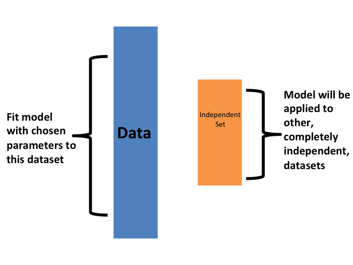

<html lang="en">

```{r setup, include=FALSE}
knitr::opts_chunk$set(
	echo = TRUE,
	message = FALSE,
	warning = FALSE
)

library(learnr) #necessary to render tutorial correctly

library(forcats)
library(ggplot2)
library(htmltools)
library(kableExtra)
library(lubridate)
library(magrittr)
library(tibble)


source("./www/datsci_helpers.R")
img_path <- "./images/" #set image path
```


# datsci_08: Machine Learning

## Welcome to Data Science: Machine Learning!

<div class="infobox">
  
  
  **Usage:** This tutorial accompanies the textbook [Introduction to Data Science](https://rafalab.github.io/dsbook/) by [Prof Rafael Irizarry](http://rafalab.github.io/pages/about.html). It contains material from the textbook which is offered under a [Attribution-NonCommercial-ShareAlike 4.0 International (CC BY-NC-SA 4.0)](https://creativecommons.org/licenses/by-nc-sa/4.0/). 
  
</div>

### Data Science: Machine Learning

We're excited to have you join us in this course, which is designed to teach you about linear regression, one of the most common statistical modeling approaches used in data science.

This is the **eighth** in a series of courses in the Introduction to Data Science program, a series of courses that prepare you to do data analysis in `r rproj()`, from simple computations to machine learning. We assume that you have taken the preceding seven courses in the series or are already familiar with the content covered in them. 

Perhaps the most popular data science methodologies come from machine learning. What distinguishes machine learning from other computer guided decision processes is that it builds prediction algorithms using data. Some of the most popular products that use machine learning include the handwriting readers implemented by the postal service, speech recognition, movie recommendation systems, and spam detectors. 

In this course, you will learn popular machine learning algorithms, principal component analysis, and regularization by building a movie recommendation system. You will learn about training data, a set of data used to discover potentially predictive relationships, and how the data can come in the form of the outcome we want to predict and features that we will use to predict this outcome. As you build the movie recommendation system, you will learn how to train algorithms using training data so you can predict the outcome for future datasets. You will also learn about overtraining and techniques to avoid it such as cross-validation. All of these skills are fundamental to machine learning.

The class notes for this course series can be found in Professor Irizarry's freely available [Introduction to Data Science book](https://rafalab.github.io/dsbook/).

### In this course, you will learn:

- The basics of machine learning

- How to perform cross-validation to avoid overtraining

- Several popular machine learning algorithms

- How to build a recommendation system

- What regularization is and why it is useful


### Course overview

There are six major sections in this course: introduction to machine learning; machine learning basics; linear regression for prediction, smoothing, and working with matrices; distance, knn, cross validation, and generative models; classification with more than two classes and the caret package; and model fitting and recommendation systems.

**Section 1: Introduction to Machine Learning**

In this section, you'll be introduced to some of the terminology and concepts you'll need going forward.

**Section 2: Machine Learning Basics**

In this section, you'll learn how to start building a machine learning algorithm using training and test data sets and the importance of conditional probabilities for machine learning.

**Section 3: Linear Regression for Prediction, Smoothing, and Working with Matrices**

In this section, you'll learn why linear regression is a useful baseline approach but is often insufficiently flexible for more complex analyses, how to smooth noisy data, and how to use matrices for machine learning.

**Section 4: Distance, Knn, Cross Validation, and Generative Models**

In this section, you'll learn different types of discriminative and generative approaches for machine learning algorithms.

**Section 5: Classification with More than Two Classes and the Caret Package**

In this section, you'll learn how to overcome the curse of dimensionality using methods that adapt to higher dimensions and how to use the **caret** package to implement many different machine learning algorithms.

**Section 6: Model Fitting and Recommendation Systems**

In this section, you'll learn how to apply the machine learning algorithms you have learned.


### Course Instructor

<div class="infobox">
  

**Fatih Uenal** is currenlty a Visitng Postdoctoral Researcher at the University of Cambridge, Department of Psychology, where he conducts research on the psychology of anthropocentrism and social and ecological dominance. Prior to his current position, he has worked as a postdoc at [Harvard University](https://scholar.harvard.edu/fatih-uenal/home). Together with [Prof Rafael Irizarry](http://rafalab.github.io/pages/about.html) he programmed this interactive tutorial based on the the textbook [*Introduction to Data Science*](https://rafalab.github.io/dsbook/). This interactive tutorial is developed using the `learnr` package. It has a general social scientists audience in mind and is suited for undergrad and graduate levels of study. 

Webpage: https://scholar.harvard.edu/fatih-uenal/home

</div>

---

### Essential Course Information

#### **Course Objectives**

“Data science” is a catch-all term used to describe the practice of working with and analyzing messy data sources to draw meaningful conclusions using techniques developed by computer scientists and computational statisticians. The purpose of this course is to give students who are training as quantitative social scientists a broad introduction to this skillset via the statistical programming language, `r rproj()`. You will learn how to conduct many statistical analyses such as univariate statistics (e.g., correlation, regression) in `r rproj()` that you may have already done in SPSS, Excel, or another such program. Additionally, we will build on this foundation to explore new skillsets uncommon in the social sciences, such as natural language processing, and machine learning. 

At the end of this course you will be able to:

- To answer research questions in Social Sciences (e.g., Psychology) with data

- Understand the basics of research designs in Social Sciences, and how they relate to data-analysis strategies

- Develop an intuitive, practical, and conceptual understanding of strategies for asking and answering questions with data

- To use `r rproj()`, a free and open-source statistics software program.

- Develop a basic understanding of frequently used Data Science Techniques.

- Practice your newly acquired skills with interesting, interactive, and fun projects.

**NOTE**: The schedule and procedures described in this syllabus are subject to change depending on specific needs and requirements. You will always be notified of changes on the homepage (see “last update”).


#### **Course Structure**

This is the first module in a series of a 8 week-intensive course.  and I suggest that you devote approx 10 hours a week to learning `r rproj()`, or if you are teaching graduate students, I’d recommend adopting the schedule below, which is designed for an intense but doable semester-long course, one module per week.  It is intended to take the average graduate student roughly 10 hours per week to complete all required tasks.However, some number of students will find programming to be more challenging and may take up to 15 hours per week.  Some will breeze through the material in 5.

#### **Grading**

Each Monday, lessons will be assigned from datacamp.com. Some of these lessons will be complete DataCamp courses, and others will be specific modules of courses. This will all be managed by assigning content to your (free) DataCamp account. The amount of content assigned will vary between one and two courses of content. DataCamp considers a course to be roughly 4 hours of lessons, which includes practice time. Realistically, the time you need will depend upon how intuitive you find `r rproj()` to be. For students already familiar with other programming languages and those with previous `r rproj()` experience, “8 hours” of courses is realistically closer to 2 hours; for complete novices that also find the material difficult, 8 hours is a realistic estimate. It is strongly recommended that you stretch out DataCamp lessons across the assignment period, for example, allocating 1 hour each day. You will gain the most by treating this as a foreign language immersion course by using R every day, including for your own research.
Remember that you can always go to the **Slack Group** for help. 

#### **Passing Rate**

The passing rate is 70%. 

### Pre-Course Survey

Insert Survey Link here

*If you cannot see the survey above, click this link to access it in a new window.*


## Section 1: Introduction to Machine Learning

In the **Introduction to Machine Learning** section, you will be introduced to machine learning.

After completing this section, you will be able to:

- Explain the difference between the **outcome** and the **features**.

- Explain when to use **classification** and when to use **prediction**.

- Explain the importance of **prevalence**.

- Explain the difference between **sensitivity** and **specificity**.

This section has one part: **introduction to machine learning**. There are comprehension checks at the end.

We encourage you to use `r rproj()` to interactively test out your answers and further your own learning.


### Introduction and Motivation


<div class="infobox">
  
**Textbook link** The content is discussed within the [textbook section - 27 Introduction to machine learning](https://rafalab.github.io/dsbook/introduction-to-machine-learning.html).
  
</div>


Perhaps the most popular data science methodologies come from the field of _machine learning_. Machine learning success stories include the handwritten zip code readers implemented by the postal service, speech recognition technology such as Apple's Siri, movie recommendation systems, spam and malware detectors, housing price predictors, and driverless cars. Although today Artificial Intelligence and machine learning are often used interchangeably, we make the following distinction: while the first artificial intelligence algorithms, such as those used by chess playing machines, implemented decision making based on programmable rules derived from theory or first principles, in machine learning decisions are based on algorithms **built with data**. 


### Notation


<div class="infobox">
  
**Textbook link** The content is discussed within the [textbook section - 27.1 Notation](https://rafalab.github.io/dsbook/introduction-to-machine-learning.html#notation-1).
  
</div>


In machine learning, data comes in the form of:

1\. the _outcome_ we want to predict and 

2\. the _features_ that we will use to predict the outcome

We want to build an algorithm that takes feature values as input and returns a prediction for the outcome when we don't know the outcome. The machine learning approach is to _train_ an algorithm using a dataset for which we do know the outcome, and then apply this algorithm in the future to make a prediction when we don't know the outcome.

Here we will use $Y$ to denote the outcome and $X_1, \dots, X_p$ to denote features. Note that features are sometimes referred to as predictors or covariates. We consider all these to be synonyms.

Prediction problems can be divided into categorical and continuous outcomes. For categorical outcomes, $Y$ can be any one of $K$ classes. The number of classes can vary greatly across applications.
For example, in the digit reader data, $K=10$ with the classes being the digits 0, 1, 2, 3, 4, 5, 6, 7, 8, and 9. In speech recognition, the outcomes are all possible words or phrases we are trying to detect. Spam detection has two outcomes: spam or not spam. In this course, we denote the $K$ categories with indexes $k=1,\dots,K$. However, for binary data we will use $k=0,1$ for mathematical conveniences that we demonstrate later.

The general setup is as follows. We have a series of features and an unknown outcome we want to predict:

```{r, echo=FALSE, message=FALSE, warning=FALSE}
library(tidyverse)
library(knitr)
library(dslabs)
tmp <- tibble(outcome="?", 
              'feature 1' = "$X_1$",
              'feature 2' = "$X_2$",
              'feature 3' = "$X_3$",
              'feature 4' = "$X_4$",
              'feature 5' = "$X_5$")
if(knitr::is_html_output()){
  knitr::kable(tmp, "html", align = "c") %>%
    kableExtra::kable_styling(bootstrap_options = "striped", full_width = FALSE)
} else{
  knitr::kable(tmp, "latex", align="c", escape = FALSE, booktabs = TRUE) %>%
    kableExtra::kable_styling(font_size = 8)
}
```

To _build a model_ that provides a prediction for any set of observed values $X_1=x_1, X_2=x_2, \dots X_5=x_5$, we collect data for which we know the outcome:

```{r, echo=FALSE}
n <- 2
tmp <- tibble(outcome = paste0("$y_{", 1:n,"}$"), 
              'feature 1' = paste0("$x_{",1:n,",1}$"),
              'feature 2' = paste0("$x_{",1:n,",2}$"),
              'feature 3' = paste0("$x_{",1:n,",3}$"),
              'feature 4' = paste0("$x_{",1:n,",4}$"),
              'feature 5' = paste0("$x_{",1:n,",5}$"))
tmp_2 <- rbind(c("$\\vdots$", "$\\vdots$", "$\\vdots$", "$\\vdots$", "$\\vdots$", "$\\vdots$"),
               c("$y_n$", "$x_{n,1}$","$x_{n,2}$","$x_{n,3}$","$x_{n,4}$","$x_{n,5}$"))
colnames(tmp_2) <- names(tmp)
tmp <- bind_rows(tmp, as_tibble(tmp_2))
if(knitr::is_html_output()){
  knitr::kable(tmp, "html") %>%
    kableExtra::kable_styling(bootstrap_options = "striped", full_width = FALSE)
} else{
  knitr::kable(tmp, "latex", escape = FALSE, booktabs = TRUE) %>%
    kableExtra::kable_styling(font_size = 8)
}
```

When the output is continuous we refer to the machine learning task as _prediction_, and the main output of the model is a function $f$ that automatically produces a prediction, denoted with $\hat{y}$, for any set of predictors: $\hat{y} = f(x_1, x_2, \dots, x_p)$.  We use the term _actual outcome_ to denote what we ended up observing. So we want the prediction $\hat{y}$ to match the actual outcome $y$ as well as possible. Because our outcome is continuous, our predictions $\hat{y}$ will not be either exactly right or wrong, but instead we will determine an _error_ defined as the difference between the prediction and the actual outcome $y - \hat{y}$.

When the outcome is categorical, we refer to the machine learning task as _classification_, and the main output of the model will be a _decision rule_ which prescribes which of the $K$ classes we should predict. In this scenario, most models provide functions of the predictors for each class $k$, $f_k(x_1, x_2, \dots, x_p)$, that are used to make this decision. When the data is binary a typical decision rules looks like this: if $f_1(x_1, x_2, \dots, x_p) > C$, predict category 1, if not the other category, with $C$ a predetermined cutoff. Because the outcomes are categorical, our predictions will be either right or wrong. 

Notice that these terms vary among courses, text books, and other publications. Often _prediction_ is used for both categorical and continuous outcomes, and the term _regression_ can be used for the continuous case. Here we avoid using _regression_ to avoid confusion with our previous use of the term _linear regression_. In most cases it will be clear if our outcomes are categorical or continuous, so we will avoid using these terms when possible. 


<div class="infobox">
   


**Key points:** 

---

- $x_1,\dots, x_p$ denote the features, $Y$ denotes the outcomes, and $\hat{Y}$ denotes the predictions.

- Machine learning prediction tasks can be divided into **categorical** and **continuous** outcomes. We refer to these as **classification** and **prediction**, respectively.

    
</div>


### An Example

<div class="infobox">
  
**Textbook link** The content is discussed within the [textbook section - 27.2 An Example](https://rafalab.github.io/dsbook/introduction-to-machine-learning.html#an-example).
  
</div>


Let's consider the zip code reader example. The first step in handling mail received in the post office is sorting letters by zip code:

```{r, echo=FALSE, out.width="40%"}
knitr::include_graphics(file.path(img_path,"how-to-write-a-address-on-an-envelope-how-to-write-the-address-on-an-envelope-write-address-on-envelope-india-finishedenvelope-x69070.png"))
```

Originally, humans had to sort these by hand. To do this, they had to read the zip codes on each letter. Today, thanks to machine learning algorithms, a computer can read zip codes and then a robot sorts the letters. In this part of the course, we will learn how to build algorithms that can read a digit.

The first step in building an algorithm is to understand 
what are the outcomes and features. Below are three images of written digits. These have already been read by a human and assigned an outcome $Y$. These are considered known and serve as the training set. 

```{r digit-images-example, echo=FALSE, cache=TRUE}
mnist <- read_mnist()
tmp <- lapply( c(1,4,5), function(i){
    expand.grid(Row=1:28, Column=1:28) %>%  
      mutate(id=i, label=mnist$train$label[i],  
             value = unlist(mnist$train$images[i,])) 
})
tmp <- Reduce(rbind, tmp)
tmp %>% ggplot(aes(Row, Column, fill=value)) + 
    geom_raster(show.legend = FALSE) + 
    scale_y_reverse() +
    scale_fill_gradient(low="white", high="black") +
    facet_grid(.~label)
```

The images are converted into $28 \times 28 = 784$ pixels and, for each pixel, we obtain a grey scale intensity between 0 (white) and 255 (black), which we consider continuous for now. The following plot shows the individual features for each image:

```{r example-images, echo=FALSE}
tmp %>% ggplot(aes(Row, Column, fill=value)) + 
    geom_point(pch=21) + 
    scale_y_reverse() +
    scale_fill_gradient(low="white", high="black") +
    facet_grid(.~label)
```

For each digitized image $i$, we have a categorical outcome $Y_i$ which can be one of 10 values ($0,1,2,3,4,5,6,7,8,9$), and features $X_{i,1}, \dots, X_{i,784}$. We use bold face $\mathbf{X}_i = (X_{i,1}, \dots, X_{i,784})$ to distinguish the vector of predictors from the individual predictors. When referring to an arbitrary set of features rather than a specific image in our dataset, we drop the index $i$ and use $Y$ and $\mathbf{X} = (X_{1}, \dots, X_{784})$. We use upper case variables because, in general, we think of the predictors as random variables. We use lower case, for example $\mathbf{X} = \mathbf{x}$, to denote observed values. When we code we stick to lower case.

The machine learning task is to build an algorithm that returns a prediction for any of the possible values of the features. Here, we will learn several approaches to building these algorithms. Although at this point it might seem impossible to achieve this, we will start with simple examples and build up our knowledge until we can attack more complex ones. In fact, we start with an artificially simple example with just one predictor and then move on to a slightly more realistic example with two predictors. Once we understand these, we will attack real-world machine learning challenges involving many predictors.


<div class="infobox">
   


**Key points:** 

---

- $Y_i$ = an outcome for observation or index i.

- We use boldface for $X_i$ to distinguish the vector of predictors from the individual predictors $X_{i,1}, \dots, X_{i,784}$.

- When referring to an arbitrary set of features and outcomes, we drop the index i and use $Y$ and bold $X$.

- Uppercase is used to refer to variables because we think of predictors as random variables.

- Lowercase is used to denote observed values. For example, $X = x$.


</div>


### 1.1 Comprehension Check: Introduction to Machine Learning

Insert assessment here


## Section 2: Machine Learning Basics 

In the **Machine Learning Basics** section, you will learn the basics of machine learning.

After completing this section, you will be able to:

- Start to use the **caret** package.

- Construct and interpret a **confusion matrix**.

- Use **conditional probabilities** in the context of machine learning.

This section has two parts: **basics of evaluating machine learning algorithms** and **conditional probabilities**. There are comprehension checks at the end of each part.

We encourage you to use `r rproj()` to interactively test out your answers and further your own learning.


### Caret package, training and test sets, and overall accuracy

<div class="infobox">
  
**Textbook link** The content is discussed within the [textbook section - 27.4 Evaluation metrics](https://rafalab.github.io/dsbook/introduction-to-machine-learning.html#evaluation-metrics).
  
</div>


Before we start describing approaches to optimize the way we build algorithms, we first need to define what we mean when we say one approach is better than another. In this section, we focus on describing ways in which machine learning algorithms are evaluated. Specifically, we need to quantify what we mean by "better".

For our first introduction to machine learning concepts, we will start with a boring and simple example: how to predict sex using height. As we explain machine learning step by step, this example will let us set down the first building block. Soon enough, we will be attacking more interesting challenges. We use the __caret__ package, which has several useful functions for building and assessing machine learning methods and we introduce in more detail in the textbook [(Section - 30 The caret package)](https://rafalab.github.io/dsbook/caret.html).

```{r, message=FALSE, warning=FALSE}
library(tidyverse)
library(caret)
```

For a first example, we use the height data in dslabs:

```{r}
library(dslabs)
data(heights)
```

We start by defining the outcome and predictors. 

```{r}
y <- heights$sex
x <- heights$height
```

In this case, we have only one predictor, height, and `y` is clearly a categorical outcome since observed values are either `Male` or `Female`.
We know that we will not be able to predict $Y$ very accurately based on $X$ because male and female average heights are not that different relative to within group variability. But can we do better than guessing? To answer this question, we need a quantitative definition of better. 

### Training and test sets

Ultimately, a machine learning algorithm is evaluated on how it performs in the real world with completely new datasets. However, when developing an algorithm, we usually have a dataset for which we know the outcomes, as we do with the heights: we know the sex of every student in our dataset. Therefore, to mimic the ultimate evaluation process, we typically split the data into two parts and act as if we don't know the outcome for one of these. We stop pretending we don't know the outcome to evaluate the algorithm, but only *after* we are done constructing it. We refer to the group for which we know the outcome, and use to develop the algorithm, as the _training_ set. We refer to the group for which we pretend we don't know the outcome as the _test_ set. 

A standard way of generating the training and test sets is by randomly splitting the data. The __caret__ package includes the function `createDataPartition` that helps us generates indexes for randomly splitting the data into training and test sets: 


```{r}
set.seed(2007)
test_index <- createDataPartition(y, times = 1, p = 0.5, list = FALSE)
```

The argument `times` is used to define how many random samples of indexes to return, the argument `p` is used to define what proportion of the data is represented by the index, and the argument `list` is used to decide if we want the indexes returned as a list or not.
We can use the result of the `createDataPartition` function call to define the training and test sets like this:

```{r}
test_set <- heights[test_index, ]
train_set <- heights[-test_index, ]
```

We will now develop an algorithm using **only** the training set. Once we are done developing the algorithm, we will _freeze_ it and evaluate it using the test set. The simplest way to evaluate the algorithm when the outcomes are categorical is by simply reporting the proportion of cases that were correctly predicted **in the test set**. This metric is usually referred to as _overall accuracy_.

### Overall accuracy

To demonstrate the use of overall accuracy, we will build two competing algorithms and compare them.

Let's start by developing the simplest possible machine algorithm: guessing the outcome.

```{r}
y_hat <- sample(c("Male", "Female"), length(test_index), replace = TRUE)
```

Note that we are completely ignoring the predictor and simply guessing the sex. 

In machine learning applications, it is useful to use factors to represent the categorical outcomes because R functions developed for machine learning, such as those in the __caret__ package, require or recommend that categorical outcomes be coded as factors. So convert `y_hat` to factors using the `factor` function:

```{r}
y_hat <- sample(c("Male", "Female"), length(test_index), replace = TRUE) %>%
  factor(levels = levels(test_set$sex))
```

The _overall accuracy_ is simply defined as the overall proportion that is predicted correctly:

```{r}
mean(y_hat == test_set$sex)
```

Not surprisingly, our accuracy is about 50%. We are guessing!

Can we do better? Exploratory data analysis suggests we can because, on average, males are slightly taller than females:

```{r}
heights %>% group_by(sex) %>% summarize(mean(height), sd(height))
```

But how do we make use of this insight? Let's try another simple approach: predict `Male` if height is within two standard deviations from the average male:

```{r}
y_hat <- ifelse(x > 62, "Male", "Female") %>% 
  factor(levels = levels(test_set$sex))
```

The accuracy goes up from 0.50 to about 0.80:

```{r}
mean(y == y_hat)
```

But can we do even better? In the example above, we used a cutoff of 62, but we can examine the accuracy obtained for other cutoffs and then pick the value that provides the best results. But remember, **it is important that we optimize the cutoff using only the training set**: the test set is only for evaluation. Although for this simplistic example it is not much of a problem, later we will learn that evaluating an algorithm on the training set can lead to _overfitting_, which often results in dangerously over-optimistic assessments. 

Here we examine the accuracy of 10 different cutoffs and pick the one yielding the best result:

```{r}
cutoff <- seq(61, 70)
accuracy <- map_dbl(cutoff, function(x){
  y_hat <- ifelse(train_set$height > x, "Male", "Female") %>% 
    factor(levels = levels(test_set$sex))
  mean(y_hat == train_set$sex)
})
```

We can make a plot showing the accuracy obtained on the training set for males and females:

```{r accuracy-vs-cutoff, echo=FALSE}
data.frame(cutoff, accuracy) %>% 
  ggplot(aes(cutoff, accuracy)) + 
  geom_point() + 
  geom_line() 
```

We see that the maximum value is:

```{r}
max(accuracy)
```

which is much higher than 0.5. The cutoff resulting in this accuracy is:

```{r}
best_cutoff <- cutoff[which.max(accuracy)]
best_cutoff
```

We can now test this cutoff on our test set to make sure our accuracy is not overly optimistic:

```{r}
y_hat <- ifelse(test_set$height > best_cutoff, "Male", "Female") %>% 
  factor(levels = levels(test_set$sex))
y_hat <- factor(y_hat)
mean(y_hat == test_set$sex)
```

We see that it is a bit lower than the accuracy observed for the training set, but it is still better than guessing. And by testing on a dataset that we did not train on, we know our result is not due to cherry-picking a good result.


<div class="infobox">
   


**Key points:** 

---

- Note: the `set.seed()` function is used to obtain reproducible results. If you have R 3.6 or later, please use the `sample.kind = "Rounding"` argument whenever you set the seed for this course.

- To mimic the ultimate evaluation process, we randomly split our data into two — a training set and a test set — and act as if we don’t know the outcome of the test set. We develop algorithms using only the training set; the test set is used only for evaluation.

- The `createDataPartition()` function from the **caret** package can be used to generate indexes for randomly splitting data.

- Note: contrary to what the documentation says, this course will use the argument p as the percentage of data that goes to testing. The indexes made from `createDataPartition()` should be used to create the test set. Indexes should be created on the outcome and not a predictor.

- The simplest evaluation metric for categorical outcomes is overall accuracy: the proportion of cases that were correctly predicted in the test set.


</div>

### 2.1 Comprehension Check: Basics of Evaluating Machine Learning Algorithms

Insert assessment here


### Confusion matrix

<div class="infobox">
  
**Textbook link** The content is discussed within the [textbook section - 27.4.3 The confusion matrix](https://rafalab.github.io/dsbook/introduction-to-machine-learning.html#the-confusion-matrix).
  
</div>


The prediction rule we developed in the previous section predicts `Male` if the student is taller than `r best_cutoff` inches. Given that the average female is about `r best_cutoff` inches, this prediction rule seems wrong. What happened? If a student is the height of the average female, shouldn't we predict `Female`? 

Generally speaking, overall accuracy can be a deceptive measure. To see this, we will start by constructing what is referred to as the _confusion matrix_, which basically tabulates each combination of prediction and actual value. We can do this in R using the function `table`:

```{r}
table(predicted = y_hat, actual = test_set$sex)
```

If we study this table closely, it reveals a problem. If we compute the accuracy separately for each sex, we get:

```{r}
test_set %>% 
  mutate(y_hat = y_hat) %>%
  group_by(sex) %>% 
  summarize(accuracy = mean(y_hat == sex))
```

There is an imbalance in the accuracy for males and females: too many females are predicted to be male. We are calling almost half of the females male! How can our overall accuracy be so high then?  This is because the _prevalence_ of males in this dataset is high. These heights were collected from three data sciences courses, two of which had more males enrolled:


```{r}
prev <- mean(y == "Male")
prev
```

So when computing overall accuracy, the high percentage of mistakes made for females is outweighed by the gains in correct calls for men. **This can actually be a big problem in machine learning.** If your training data is biased in some way, you are likely to develop algorithms that are biased as well. The fact that we used a test set does not matter because it is also derived from the original biased dataset. This is one of the reasons we look at metrics other than overall accuracy when evaluating a machine learning algorithm.

There are several metrics that we can use to evaluate an algorithm in a way that prevalence does not cloud our assessment, and these can all be derived from the confusion matrix. A general improvement to using overall accuracy is to study _sensitivity_ and _specificity_ separately. 

### Sensitivity and specificity 

To define sensitivity and specificity, we need a binary outcome. When the outcomes are categorical, we can define these terms for a specific category. In the digits example, we can ask for the specificity in the case of correctly predicting 2 as opposed to some other digit. Once we specify a category of interest, then we can talk about positive outcomes, $Y=1$, and negative outcomes, $Y=0$.

In general, _sensitivity_ is defined as the ability of an algorithm to predict a positive outcome when the actual outcome is positive: $\hat{Y}=1$ when $Y=1$. Because an algorithm that calls everything positive ($\hat{Y}=1$ no matter what) has perfect sensitivity, this metric on its own is not enough to judge an algorithm. For this reason, we also examine _specificity_, which is generally defined as the ability of an algorithm to not predict a positive $\hat{Y}=0$ when the actual outcome is not a positive $Y=0$. We can summarize in the following way:

* High sensitivity: $Y=1 \implies \hat{Y}=1$
* High specificity: $Y=0 \implies \hat{Y} = 0$

Although the above is often considered the definition of specificity, another way to think of specificity is by the proportion of positive calls that are actually positive:

* High specificity:  $\hat{Y}=1 \implies Y=1$.

To provide precise definitions, we name the four entries of the confusion matrix:

```{r, echo=FALSE}
mat <- matrix(c("True positives (TP)", "False negatives (FN)", 
                "False positives (FP)", "True negatives (TN)"), 2, 2)
colnames(mat) <- c("Actually Positive", "Actually Negative")
rownames(mat) <- c("Predicted positive", "Predicted negative")
tmp <- as.data.frame(mat)
if(knitr::is_html_output()){
  knitr::kable(tmp, "html") %>%
    kableExtra::kable_styling(bootstrap_options = "striped", full_width = FALSE)
} else{
  knitr::kable(tmp, "latex", booktabs = TRUE) %>%
    kableExtra::kable_styling(font_size = 8)
}
```

Sensitivity is typically quantified by $TP/(TP+FN)$, the proportion of actual positives (the first column = $TP+FN$) that are called positives ($TP$). This quantity is referred to as the _true positive rate_ (TPR) or _recall_. 

Specificity is defined as $TN/(TN+FP)$ or the proportion of negatives (the second column = $FP+TN$) that are called negatives ($TN$). This quantity is also called the true negative rate (TNR). There is another way of quantifying specificity which is $TP/(TP+FP)$ or the proportion of outcomes called positives (the first row or $TP+FP$) that are actually positives ($TP$). This quantity is referred to as _positive predictive value (PPV)_  and also as _precision_. Note that, unlike TPR and TNR, precision depends on prevalence since higher prevalence implies you can get higher precision even when guessing. 

The multiple names can be confusing, so we include a table to help us remember the terms. The table includes a column that shows the definition if we think of the proportions as probabilities.


| Measure of | Name 1 | Name 2 | Definition | Probability representation |
|---------|-----|----------|--------|------------------|
sensitivity | TPR | Recall | $\frac{\mbox{TP}}{\mbox{TP} + \mbox{FN}}$ | $\mbox{Pr}(\hat{Y}=1 \mid Y=1)$ |
specificity | TNR | 1-FPR | $\frac{\mbox{TN}}{\mbox{TN}+\mbox{FP}}$ | $\mbox{Pr}(\hat{Y}=0 \mid Y=0)$ |
specificity |  PPV | Precision | $\frac{\mbox{TP}}{\mbox{TP}+\mbox{FP}}$ | $\mbox{Pr}(Y=1 \mid \hat{Y}=1)$|

Here TPR is True Positive Rate, FPR is False Positive Rate, and PPV is Positive Predictive Value.
The __caret__ function `confusionMatrix` computes all these metrics for us once we define what category "positive" is. The function expects factors as input, and the first level is considered the positive outcome or $Y=1$. In our example, `Female` is the first level because it comes before `Male` alphabetically. If you type this into R you will see several metrics including accuracy, sensitivity, specificity, and PPV.

```{r}
cm <- confusionMatrix(data = y_hat, reference = test_set$sex)
```

You can acceess these directly, for example, like this:

```{r}
cm$overall["Accuracy"]
cm$byClass[c("Sensitivity","Specificity", "Prevalence")]
```

We can see that the high overall accuracy is possible despite relatively low sensitivity. As we hinted at above, the reason this happens is because of the low prevalence (0.23): the proportion of females is low. Because prevalence is low, failing to predict actual females as females (low sensitivity) does not lower the accuracy as much as failing to predict actual males as males (low specificity). This is an example of why it is important to examine sensitivity and specificity and not just accuracy. Before applying this algorithm to general datasets, we need to ask ourselves if prevalence will be the same.


<div class="infobox">
   


**Key points:** 

---


- Overall accuracy can sometimes be a deceptive measure because of unbalanced classes.

- A general improvement to using overall accuracy is to study sensitivity and specificity separately. **Sensitivity**, also known as the true positive rate or recall, is the proportion of actual positive outcomes correctly identified as such. **Specificity**, also known as the true negative rate, is the proportion of actual negative outcomes that are correctly identified as such.

- A confusion matrix tabulates each combination of prediction and actual value. You can create a confusion matrix in R using the `table()` function or the `confusionMatrix()` function from the **caret** package.


</div>


### Balanced accuracy and $F_1$ score

<div class="infobox">
  
**Textbook link** The content is discussed within the [textbook section - 27.4.5 Balanced accuracy and $F_1$ score](https://rafalab.github.io/dsbook/introduction-to-machine-learning.html#balanced-accuracy-and-f_1-score).
  
</div>


Although we usually recommend studying both specificity and sensitivity, very often it is useful to have a one-number summary, for example for optimization purposes. One metric that is preferred over overall accuracy is the average of specificity and sensitivity, referred to as _balanced accuracy_. Because specificity and sensitivity are rates, it is more appropriate to compute the _harmonic_ average. In fact, the _$F_1$-score_, a widely used one-number summary, is the harmonic average of precision and recall:

$$
\frac{1}{\frac{1}{2}\left(\frac{1}{\mbox{recall}} + 
    \frac{1}{\mbox{precision}}\right) }
$$

Because it is easier to write, you often see this harmonic average rewritten as:

$$
2 \times \frac{\mbox{precision} \cdot \mbox{recall}}
{\mbox{precision} + \mbox{recall}}
$$

when defining $F_1$. 

Remember that, depending on the context, some types of errors are more costly than others. For example, in the case of plane safety, it is much more important to maximize sensitivity over specificity: failing to predict a plane will malfunction before it crashes is a much more costly error than grounding a plane when, in fact, the plane is in perfect condition. In a capital murder criminal case, the opposite is true since a false positive can lead to executing an innocent person. The $F_1$-score can be adapted to weigh specificity and sensitivity differently. To do this, we define $\beta$ to represent how much more important sensitivity is compared to specificity and consider a weighted harmonic average:

$$
\frac{1}{\frac{\beta^2}{1+\beta^2}\frac{1}{\mbox{recall}} + 
    \frac{1}{1+\beta^2}\frac{1}{\mbox{precision}} }
$$


The `F_meas` function in the __caret__ package computes this summary with `beta` defaulting to 1.


Let's rebuild our prediction algorithm, but this time maximizing the F-score instead of overall accuracy:

```{r}
cutoff <- seq(61, 70)
F_1 <- map_dbl(cutoff, function(x){
  y_hat <- ifelse(train_set$height > x, "Male", "Female") %>% 
    factor(levels = levels(test_set$sex))
  F_meas(data = y_hat, reference = factor(train_set$sex))
})
```

As before, we can plot these $F_1$ measures versus the cutoffs:

```{r f_1-vs-cutoff, echo=FALSE}
data.frame(cutoff, F_1) %>% 
  ggplot(aes(cutoff, F_1)) + 
  geom_point() + 
  geom_line() 
```

We see that it is maximized at $F_1$ value of:

```{r}
max(F_1)
```

This maximum is achieved when we use the following cutoff:
```{r}
best_cutoff <- cutoff[which.max(F_1)]
best_cutoff
```

A cutoff of 65 makes more sense than 64. Furthermore, it balances the specificity and sensitivity of our confusion matrix:

```{r}
y_hat <- ifelse(test_set$height > best_cutoff, "Male", "Female") %>% 
  factor(levels = levels(test_set$sex))
sensitivity(data = y_hat, reference = test_set$sex)
specificity(data = y_hat, reference = test_set$sex)
```

We now see that we do much better than guessing, that both sensitivity and specificity are relatively high, and that we have built our first machine learning algorithm. It takes height as a predictor and predicts female if you are 65 inches or shorter. 


<div class="infobox">
   


**Key points:** 

---

- For optimization purposes, sometimes it is more useful to have a one number summary than studying both specificity and sensitivity. One preferred metric is **balanced accuracy**. Because specificity and sensitivity are rates, it is more appropriate to compute the *harmonic average*. In fact, the **F1-score**, a widely used one-number summary, is the harmonic average of precision and recall. 

- Depending on the context, some type of errors are more costly than others. The **F1-score** can be adapted to weigh specificity and sensitivity differently. 

- You can compute the **F1-score** using the `F_meas()` function in the **caret** package.


</div>


### Prevalence matters in practice

<div class="infobox">
  
**Textbook link** The content is discussed within the [textbook section - 27.4.6 Prevalence matters in practice](https://rafalab.github.io/dsbook/introduction-to-machine-learning.html#prevalence-matters-in-practice).
  
</div>


A machine learning algorithm with very high sensitivity and specificity may not be useful in practice when prevalence is close to either 0 or 1. To see this, consider the case of a doctor that specializes in a rare disease and is interested in developing an algorithm for predicting who has the disease. The doctor shares data with you and you then develop an algorithm with very high sensitivity. You explain that this means that if a patient has the disease, the algorithm is very likely to predict correctly. You also tell the doctor that you are also concerned because, based on the dataset you analyzed, 1/2 the patients have the disease: $\mbox{Pr}(\hat{Y}=1)$. The doctor is neither concerned nor impressed and explains that what is important is the precision of the test: $\mbox{Pr}(Y=1 | \hat{Y}=1)$. Using Bayes theorem, we can connect the two measures:

$$ \mbox{Pr}(Y = 1\mid \hat{Y}=1) = \mbox{Pr}(\hat{Y}=1 \mid Y=1) \frac{\mbox{Pr}(Y=1)}{\mbox{Pr}(\hat{Y}=1)}$$

The doctor knows that the prevalence of the disease is 5 in 1,000, which implies that $\mbox{Pr}(Y=1) \, / \,\mbox{Pr}(\hat{Y}=1) = 1/100$ and therefore the precision of your algorithm is less than 0.01. The doctor does not have much use for your algorithm.


<div class="infobox">
   


**Key points:** 

---

- A machine learning algorithm with very high sensitivity and specificity may not be useful in practice when prevalence is close to either 0 or 1. For example, if you develop an algorithm for disease diagnosis with very high sensitivity, but the prevalence of the disease is pretty low, then the precision of your algorithm is probably very low based on Bayes' theorem.


</div>


### ROC and precision-recall curves

<div class="infobox">
  
**Textbook link** The content is discussed within the [textbook section - 27.4.7 ROC and precision-recall curves](https://rafalab.github.io/dsbook/introduction-to-machine-learning.html#roc-and-precision-recall-curves).
  
</div>


When comparing the two methods (guessing versus using a height cutoff), we looked at accuracy and $F_1$. The second method clearly outperformed the first.  However, while we considered several cutoffs for the second method, for the first we only considered one approach: guessing with equal probability. Note that guessing `Male` with higher probability would give us higher accuracy due to the bias in the sample:


```{r}
p <- 0.9
n <- length(test_index)
y_hat <- sample(c("Male", "Female"), n, replace = TRUE, prob=c(p, 1-p)) %>% 
  factor(levels = levels(test_set$sex))
mean(y_hat == test_set$sex)
```

But, as described above, this would come at the cost of lower sensitivity. The curves we describe in this section will help us see this.

Remember that for each of these parameters, we can get a different sensitivity and specificity. For this reason, a very common approach to evaluating methods is to compare them graphically by plotting both.

A widely used plot that does this is the _receiver operating characteristic_ (ROC) curve. If you are wondering where this name comes from, you can consult the 
[ROC Wikipedia page](https://en.wikipedia.org/wiki/Receiver_operating_characteristic).

The ROC curve plots sensitivity (TPR) versus 1 - specificity or the false positive rate (FPR). Here we compute the TPR and FPR needed for different probabilities of guessing male:

```{r roc-1}
probs <- seq(0, 1, length.out = 10)
guessing <- map_df(probs, function(p){
  y_hat <- 
    sample(c("Male", "Female"), n, replace = TRUE, prob=c(p, 1-p)) %>% 
    factor(levels = c("Female", "Male"))
  list(method = "Guessing",
       FPR = 1 - specificity(y_hat, test_set$sex),
       TPR = sensitivity(y_hat, test_set$sex))
})
```

We can use similar code to compute these values for our our second approach. By plotting both curves together, we are able to compare sensitivity for different values of specificity:

<!--We can construct an ROC curve for the height-based approach:-->

```{r, echo=FALSE}
cutoffs <- c(50, seq(60, 75), 80)
height_cutoff <- map_df(cutoffs, function(x){
  y_hat <- ifelse(test_set$height > x, "Male", "Female") %>% 
    factor(levels = c("Female", "Male"))
   list(method = "Height cutoff",
        FPR = 1-specificity(y_hat, test_set$sex),
        TPR = sensitivity(y_hat, test_set$sex))
})
```
<!--
```{r roc-2, echo=FALSE}
bind_rows(guessing, height_cutoff) %>%
  ggplot(aes(FPR, TPR, color = method)) +
  geom_line() +
  geom_point() +
  xlab("1 - Specificity") +
  ylab("Sensitivity")
```
-->

```{r roc-3, echo=FALSE, fig.width=6, fig.height=3}
library(ggrepel)
tmp_1 <- map_df(cutoffs, function(x){
  y_hat <- ifelse(test_set$height > x, "Male", "Female") %>% 
    factor(levels = c("Female", "Male"))
   list(method = "Height cutoff",
        cutoff = x, 
        FPR = 1-specificity(y_hat, test_set$sex),
        TPR = sensitivity(y_hat, test_set$sex))
}) 
tmp_2 <- map_df(probs, function(p){
  y_hat <- 
    sample(c("Male", "Female"), n, replace = TRUE, prob=c(p, 1-p)) %>% 
    factor(levels = c("Female", "Male"))
  list(method = "Guessing",
       cutoff = round(p,1),
       FPR = 1 - specificity(y_hat, test_set$sex),
       TPR = sensitivity(y_hat, test_set$sex))
})

bind_rows(tmp_1, tmp_2) %>%
  ggplot(aes(FPR, TPR, label = cutoff, color = method)) +
  geom_line() +
  geom_point() +
  geom_text_repel(nudge_x = 0.01, nudge_y = -0.01, show.legend = FALSE)
```

We can see that we obtain higher sensitivity with this approach for all values of specificity, which implies it is in fact a better method. Note that ROC curves for guessing always fall on the identiy line. Also note that when making ROC curves, it is often nice to add the cutoff associated with each point.

The packages __pROC__ and __plotROC__ are useful for generating these plots.

ROC curves have one weakness and it is that neither of the measures plotted depends on prevalence. In cases in which prevalence matters, we may instead make a precision-recall plot. The idea is similar, but we instead plot precision against recall:


```{r precision-recall-1, warning=FALSE, message=FALSE, echo=FALSE}
guessing <- map_df(probs, function(p){
  y_hat <- sample(c("Male", "Female"), length(test_index), 
                  replace = TRUE, prob=c(p, 1-p)) %>% 
    factor(levels = c("Female", "Male"))
  list(method = "Guess",
    recall = sensitivity(y_hat, test_set$sex),
    precision = precision(y_hat, test_set$sex))
})

height_cutoff <- map_df(cutoffs, function(x){
  y_hat <- ifelse(test_set$height > x, "Male", "Female") %>% 
    factor(levels = c("Female", "Male"))
  list(method = "Height cutoff",
       recall = sensitivity(y_hat, test_set$sex),
    precision = precision(y_hat, test_set$sex))
})
tmp_1 <- bind_rows(guessing, height_cutoff) %>% mutate(Positive = "Y = 1 if Female") 

guessing <- map_df(probs, function(p){
  y_hat <- sample(c("Male", "Female"), length(test_index), replace = TRUE, 
                  prob=c(p, 1-p)) %>% 
    factor(levels = c("Male", "Female"))
  list(method = "Guess",
    recall = sensitivity(y_hat, relevel(test_set$sex, "Male", "Female")),
    precision = precision(y_hat, relevel(test_set$sex, "Male", "Female")))
})

height_cutoff <- map_df(cutoffs, function(x){
  y_hat <- ifelse(test_set$height > x, "Male", "Female") %>% 
    factor(levels = c("Male", "Female"))
  list(method = "Height cutoff",
       recall = sensitivity(y_hat, relevel(test_set$sex, "Male", "Female")),
    precision = precision(y_hat, relevel(test_set$sex, "Male", "Female")))
})
tmp_2 <- bind_rows(guessing, height_cutoff) %>% mutate(Positive = "Y = 1 if Male") 

bind_rows(tmp_1, tmp_2) %>%
  ggplot(aes(recall, precision, color = method)) +
  geom_line() +
  geom_point() +
  facet_wrap(~ Positive)
```

From this plot we immediately see that the precision of guessing is not high. This is because the prevalence is low. We also see that if we change positives to mean Male instead of Female, the ROC curve remains the same, but the precision recall plot changes.


<div class="infobox">
   


**Key points:** 

---

- A very common approach to evaluating accuracy and F1-score is to compare them graphically by plotting both. A widely used plot that does this is the **receiver operating characteristic (ROC) curve**. The ROC curve plots sensitivity (TPR) versus 1 - specificity or the false positive rate (FPR).

- However, ROC curves have one weakness and it is that neither of the measures plotted depend on prevalence. In cases in which prevalence matters, we may instead make a **precision-recall plot**, which has a similar idea with ROC curve.


</div>


### 2.1 Comprehension Check: Practice with Machine Learning, Part 1

Insert assessment here


### 2.1 Comprehension Check: Practice with Machine Learning, Part 2

Insert assessment here


### Conditional probabilities and expectations

<div class="infobox">
  
**Textbook link** The content is discussed within the [textbook section - 27.6 Conditional probabilities and expectations](https://rafalab.github.io/dsbook/introduction-to-machine-learning.html#conditional-probabilities-and-expectations).
  
</div>


In machine learning applications, we rarely can predict outcomes perfectly. For example, spam detectors often miss emails that are clearly spam, Siri often misunderstands the words we are saying, and your bank at times thinks your card was stolen when it was not. The most common reason for not being able to build perfect algorithms is that it is impossible. To see this, note that most datasets will include groups of observations with the same exact observed values for all predictors, but with different outcomes. Because our prediction rules are functions, equal inputs (the predictors) implies equal outputs (the predictions). Therefore, for a challenge in which the same predictors are associated with different outcomes across different individual observations, it is impossible to predict correctly for all these cases. We saw a simple example of this in the previous section: for any given height $x$, you will have both males and females that are $x$ inches tall.

However, none of this means that we can't build useful algorithms that are much better than guessing, and in some cases better than expert opinions. To achieve this in an optimal way, we make use of probabilistic representations of the problem based on the ideas presented in the textbook [(Section - 27.6.2 Conditional expectations)](https://rafalab.github.io/dsbook/introduction-to-machine-learning.html#conditional-expectations). Observations with the same observed values for the predictors may not all be the same, but we can assume that they all have the same probability of this class or that class. We will write this idea out mathematically for the case of categorical data. 

### Conditional probabilities

We use the notation $(X_1 = x_1,\dots,X_p=x_p)$ to represent the fact that we have observed values $x_1,\dots,x_p$ for covariates $X_1, \dots, X_p$. This does not imply that the outcome $Y$ will take a specific value. Instead, it implies a specific probability. In particular, we denote the _conditional probabilities_ for each class $k$:

$$
\mbox{Pr}(Y=k \mid X_1 = x_1,\dots,X_p=x_p), \, \mbox{for}\,k=1,\dots,K
$$

To avoid writing out all the predictors, we will use the bold letters like this: $\mathbf{X} \equiv (X_1,\dots,X_p)$ and $\mathbf{x} \equiv (x_1,\dots,x_p)$. We will also use the following notation for the conditional probability of being class $k$:

$$
p_k(\mathbf{x}) = \mbox{Pr}(Y=k \mid \mathbf{X}=\mathbf{x}), \, \mbox{for}\, k=1,\dots,K
$$

Note: We will be using the $p(x)$ notation to represent conditional probabilities as functions of the predictors. Do not confuse it with the $p$ that represents the number of predictors.

These probabilities guide the construction of an algorithm that makes the best prediction: for any given $\mathbf{x}$, we will predict the class $k$ with the largest probability among $p_1(x), p_2(x), \dots p_K(x)$. In mathematical notation, we write it like this: $\hat{Y} = \max_k p_k(\mathbf{x})$.

In machine learning, we refer to this as _Bayes' Rule_. But keep in mind that this is a theoretical rule since in practice we don't know $p_k(\mathbf{x}), k=1,\dots,K$. In fact, estimating these conditional probabilities can be thought of as the main challenge of machine learning. The better our probability estimates $\hat{p}_k(\mathbf{x})$, the better our predictor: 

$$\hat{Y} = \max_k \hat{p}_k(\mathbf{x})$$

So what we will predict depends on two things: 1) how close are the $\max_k p_k(\mathbf{x})$ to 1 or 0 (perfect certainty)
and 2) how close our estimates $\hat{p}_k(\mathbf{x})$ are to $p_k(\mathbf{x})$. We can't do anything about the first restriction as it is determined by the nature of the problem, so our energy goes into finding ways to best estimate conditional probabilities. The first restriction does imply that we have limits as to how well even the best possible algorithm can perform. You should get used to the idea that while in some challenges we will be able to achieve almost perfect accuracy, with digit readers for example, in others our success is restricted by the randomness of the process, with movie recommendations for example. 

Before we continue, it is important to remember that defining our prediction by maximizing the probability is not always optimal in practice and depends on the context. As discussed above, sensitivity and specificity may differ in importance. But even in these cases, having a good estimate of the $p_k(x), k=1,\dots,K$ will suffice for us to build optimal prediction models, since we can control the balance between specificity and sensitivity however we wish. For instance, we can simply change the cutoffs used to predict one outcome or the other. In the plane example, we may ground the plane anytime the probability of malfunction is higher than 1 in a million as opposed to the default 1/2 used when error types are equally undesired. 


<div class="infobox">
   


**Key points:** 

---

- Conditional probabilities for each class: 

$$
p_k(\mathbf{x}) = \mbox{Pr}(Y=k \mid \mathbf{X}=\mathbf{x}), \, \mbox{for}\, k=1,\dots,K
$$

- In machine learning, this is referred to as Bayes' Rule. This is a theoretical rule because in practice we don't know 𝑝(𝑥). Having a good estimate of the 𝑝(𝑥) will suffice for us to build optimal prediction models, since we can control the balance between specificity and sensitivity however we wish. In fact, estimating these conditional probabilities can be thought of as the main challenge of machine learning. 


</div>


### Conditional expectations

<div class="infobox">
  
**Textbook link** The content is discussed within the [textbook section - 27.6.2 Conditional expectations](https://rafalab.github.io/dsbook/introduction-to-machine-learning.html#conditional-expectations).
  
</div>


For binary data, you can think of the probability $\mbox{Pr}(Y=1 \mid \mathbf{X}=\mathbf{x})$ as the proportion of 1s in the stratum of the population for which $\mathbf{X}=\mathbf{x}$. Many of the algorithms we will learn can be applied to both categorical and continuous data due to the connection between _conditional probabilities_ and _conditional expectations_. 

Because the expectation is the average of values $y_1,\dots,y_n$ in the population, in the case in which the $y$s are 0 or 1, the expectation is equivalent to the probability of randomly picking a one since the average is simply the proportion of ones: 

$$
\mbox{E}(Y \mid \mathbf{X}=\mathbf{x})=\mbox{Pr}(Y=1 \mid \mathbf{X}=\mathbf{x}).
$$

As a result, we often only use the expectation to denote both the conditional probability and conditional expectation.

Just like with categorical outcomes, in most applications the same observed predictors do not guarantee the same continuous outcomes. Instead, we assume that the outcome follows the same conditional distribution. We will now explain why we use the conditional expectation to define our predictors. 

### The loss function 

Up to now we have described evaluation metrics that apply exclusively to categorical data. 
Specifically, for binary outcomes, we have described how sensitivity, specificity, accuracy, and $F_1$ can be used as quantification. However, these metrics are not useful for continuous outcomes. In this section, we describe how the general approach to defining "best" in machine learning is to define a _loss function_, which can be applied to both categorical and continuous data. 

The most commonly used loss function is the squared loss function. If $\hat{y}$ is our predictor and $y$ is the observed outcome, the squared loss function is simply:

$$
(\hat{y} - y)^2
$$

Because we often have a test set with many observations, say $N$, we use the mean squared error (MSE):

$$
\mbox{MSE} = \frac{1}{N} \mbox{RSS} = \frac{1}{N}\sum_{i=1}^N (\hat{y}_i - y_i)^2
$$

In practice, we often report the root mean squared error (RMSE), which is $\sqrt{\mbox{MSE}}$, because it is in the same units as the outcomes. But doing the math is often easier with the MSE and it is therefore more commonly used in textbooks, since these usually describe theoretical properties of algorithms.

If the outcomes are binary, both RMSE and MSE are equivalent to one minus accuracy, since $(\hat{y} - y)^2$ is 0 if the prediction was correct and 1 otherwise. In general, our goal is to build an algorithm that minimizes the loss so it is as close to 0 as possible.

Because our data is usually a random sample, we can think of the MSE as a random variable and the observed MSE can be thought of as an estimate of the expected MSE, which in mathematical notation we write like this:

$$
\mbox{E}\left\{ \frac{1}{N}\sum_{i=1}^N (\hat{Y}_i - Y_i)^2 \right\}
$$

This is a theoretical concept because in practice we only have one dataset to work with. But in theory, we think of having a very large number of random samples (call it $B$), apply our algorithm to each, obtain an MSE for each random sample, and think of the expected MSE as:

$$
\frac{1}{B} \sum_{b=1}^B \frac{1}{N}\sum_{i=1}^N \left(\hat{y}_i^b - y_i^b\right)^2 
$$

with $y_{i}^b$ denoting the $i$th observation in the $b$th random sample and $\hat{y}_i^b$ the resulting prediction obtained from applying the exact same algorithm to the $b$th random sample. Again, in practice we only observe one random sample, so the expected MSE is only theoretical. However, in the textbook [(Section - 29 Cross validation)](https://rafalab.github.io/dsbook/cross-validation.html) we describe an approach to estimating the MSE that tries to mimic this theoretical quantity.

Note that there are loss functions other than the squared loss. For example, the _Mean Absolute Error_  uses absolute values, $|\hat{Y}_i - Y_i|$ instead of squaring the errors 
$(\hat{Y}_i - Y_i)^2$. However, in this course we focus on minimizing square loss since it is the most widely used.

### Conditional expectation minimizes squared loss function

Why do we care about the conditional expectation in machine learning? This is because the expected value has an attractive mathematical property: it minimizes the MSE. Specifically, of all possible predictions $\hat{Y}$,

$$
\hat{Y} = \mbox{E}(Y \mid \mathbf{X}=\mathbf{x}) \, \mbox{ minimizes } \, \mbox{E}\{ (\hat{Y} - Y)^2  \mid  \mathbf{X}=\mathbf{x} \}
$$ 

Due to this property, a succinct description of the main task of machine learning is that we use data to estimate:

$$
f(\mathbf{x}) \equiv \mbox{E}( Y  \mid  \mathbf{X}=\mathbf{x} )
$$

for any set of features $\mathbf{x} = (x_1, \dots, x_p)$. Of course this is easier said than done, since this function can take any shape and $p$ can be very large. Consider a case in which we only have one predictor $x$. The expectation $\mbox{E}\{ Y  \mid  X=x \}$ can be any function of $x$: a line, a parabola, a sine wave, a step function, anything. It gets even more complicated when we consider instances with large $p$, in which case $f(\mathbf{x})$ is a function of a multidimensional vector $\mathbf{x}$. For example, in our digit reader example $p = 784$! **The main way in which competing machine learning algorithms differ is in their approach to estimating this expectation.**


<div class="infobox">
   


**Key points:** 

---


- Due to the connection between **conditional probabilities** and **conditional expectations**:

$$
p_k(\mathbf{x}) = \mbox{Pr}(Y=k \mid \mathbf{X}=\mathbf{x}), \, \mbox{for}\, k=1,\dots,K
$$

we often only use the expectation to denote both the conditional probability and conditional expectation.

- For continuous outcomes, we define a loss function to evaluate the model. The most commonly used one is **MSE (Mean Squared Error)**. The reason why we care about the conditional expectation in machine learning is that the expected value minimizes the MSE:

$$
\hat{Y} = \mbox{E}(Y \mid \mathbf{X}=\mathbf{x}) \, \mbox{ minimizes } \, \mbox{E}\{ (\hat{Y} - Y)^2  \mid  \mathbf{X}=\mathbf{x} \}
$$ 

Due to this property, a succinct description of the main task of machine learning is that we use data to estimate for any set of features. **The main way in which competing machine learning algorithms differ is in their approach to estimating this expectation**.


</div>


### 2.2 Comprehension Check: Conditional Probabilities Part 1

Insert assessment here

### 2.2 Comprehension Check: Conditional Probabilities Part 2

Insert assessment here


## Section 3: Linear Regression for Prediction, Smoothing, and Working with Matrices

In the **Linear Regression for Prediction, Smoothing, and Working with Matrices Overview** section, you will learn why linear regression is a useful baseline approach but is often insufficiently flexible for more complex analyses, how to smooth noisy data, and how to use matrices for machine learning.

After completing this section, you will be able to:

- Use **linear regression for prediction** as a baseline approach.

- Use **logistic regression** for categorical data.

- Detect trends in noisy data using **smoothing** (also known as **curve fitting** or **low pass filtering**).

- Convert predictors to **matrices** and outcomes to **vectors** when all predictors are numeric (or can be converted to numerics in a meaningful way).

- Perform basic **matrix algebra** calculations.

This section has three parts: **linear regression for prediction**, **smoothing**, and **working with matrices**. There are comprehension checks periodically.

We encourage you to use `r rproj()` to interactively test out your answers and further your own learning.


### Linear Regression for Prediction

```{r warning=FALSE, message=FALSE, echo=FALSE}
library(tidyverse)
library(dslabs)
library(caret)
data("mnist_27")
```

<div class="infobox">
  
**Textbook link** The content is discussed within the [textbook section - 31.1 Linear regression](https://rafalab.github.io/dsbook/examples-of-algorithms.html#linear-regression).
  
</div>


Linear regression can be considered a machine learning algorithm. In the textbook [(Section - 27.8 Case study: is it a 2 or a 7?)](https://rafalab.github.io/dsbook/introduction-to-machine-learning.html#two-or-seven) we demonstrated how linear regression can be too rigid to be useful. This is generally true, but for some challenges it works rather well. It also serves as a baseline approach: if you can't beat it with a more complex approach, you probably want to stick to linear regression. To quickly make the connection between regression and machine learning, we will reformulate Galton's study with heights, a continuous outcome.

```{r, message=FALSE, warning=FALSE}
library(HistData)

set.seed(1983)
galton_heights <- GaltonFamilies %>%
  filter(gender == "male") %>%
  group_by(family) %>%
  sample_n(1) %>%
  ungroup() %>%
  select(father, childHeight) %>%
  rename(son = childHeight)
```

Suppose you are tasked with building a machine learning algorithm that predicts the son's height $Y$ using the father's height $X$. Let's generate testing and training sets:

```{r, message=FALSE, warning=FALSE}
y <- galton_heights$son
test_index <- createDataPartition(y, times = 1, p = 0.5, list = FALSE)

train_set <- galton_heights %>% slice(-test_index)
test_set <- galton_heights %>% slice(test_index)
```

In this case, if we were just ignoring the father's height and guessing the son's height, we would guess the average height of sons.

```{r}
m <- mean(train_set$son)
m
```

Our squared loss is: 

```{r}
mean((m - test_set$son)^2)
```

Can we do better? In the regression section, we learned that if the pair $(X,Y)$ follow a bivariate normal distribution, the conditional expectation (what we want to estimate) is equivalent to the regression line:

$$
f(x) = \mbox{E}( Y  \mid  X= x ) = \beta_0 + \beta_1 x
$$

In the textbook [(Section - 18.3 Least squares estimates)](https://rafalab.github.io/dsbook/linear-models.html#lse) we introduced least squares as a method for estimating the slope $\beta_0$ and intercept $\beta_1$: 

```{r}
fit <- lm(son ~ father, data = train_set)
fit$coef
```

This gives us an estimate of the conditional expectation:

$$ \hat{f}(x) = 52 + 0.25 x $$


We can see that this does indeed provide an improvement over our guessing approach. 

```{r}
y_hat <- fit$coef[1] + fit$coef[2]*test_set$father
mean((y_hat - test_set$son)^2)
```


<div class="infobox">
   


**Key points:** 

---

- Linear regression can be considered a machine learning algorithm. Although it can be too rigid to be useful, it works rather well for some challenges. It also serves as a baseline approach: if you can’t beat it with a more complex approach, you probably want to stick to linear regression. 


</div>


### Predict Function

<div class="infobox">
  
**Textbook link** The content is discussed within the [textbook section - 31.1.1 The predict function](https://rafalab.github.io/dsbook/examples-of-algorithms.html#the-predict-function).
  
</div>


The `predict` function is very useful for machine learning applications. This function takes a fitted object from functions such as `lm` or `glm` (we learn about `glm` soon) and a data frame with the new predictors for which to predict. So in our current example, we would use `predict` like this:

```{r}
y_hat <- predict(fit, test_set)
```

Using `predict`, we can get the same results as we did previously:

```{r}
y_hat <- predict(fit, test_set)
mean((y_hat - test_set$son)^2)
```

`predict` does not always return objects of the same types; it depends on what type of object is sent to it. To learn about the specifics, you need to look at the help file specific for the type of fit object that is being used. The `predict` is actually a special type of function in R (called a _generic function_) that calls other functions depending on what kind of object it receives. So if `predict` receives an object coming out of the `lm` function, it will call `predict.lm`. If it receives an object coming out of `glm`, it calls `predict.glm`. These two functions are similar but different. You can learn more about the differences by reading the help files:

```{r, eval=FALSE}
?predict.lm
?predict.glm
```

There are many other versions of `predict` and many machine learning algorithms have a `predict` function.


<div class="infobox">
   


**Key points:** 

---


- The `predict()` function takes a fitted object from functions such as `lm()` or `glm()` and a data frame with the new predictors for which to predict. We can use predict like this:

```{r, eval=FALSE}
y_hat <- predict(fit, test_set)
```


- `predict()` is a generic function in R that calls other functions depending on what kind of object it receives. To learn about the specifics, you can read the help files using code like this: 

```{r, eval=FALSE}
?predict.lm    # or ?predict.glm
```


</div>

### 3.1 Comprehension Check: Linear Regression

Insert assessment here


### Regression for a Categorical Outcome

<div class="infobox">
  
**Textbook link** The content is discussed within the [textbook section - 31.3 Logistic regression](https://rafalab.github.io/dsbook/examples-of-algorithms.html#logistic-regression).
  
</div>


The regression approach can be extended to categorical data. In this section we first illustrate how, for binary data, one can simply assign numeric values of 0 and 1 to the outcomes $y$, and apply regression as if the data were continuous. We will then point out a limitation with this approach and introduce _logistic regression_ as a solution. Logistic regression is a specific case of a set of _generalized linear models_. To illustrate logistic regression, we will apply it to our previous predicting sex example:

```{r, echo=FALSE}
library(dslabs)
data("heights")

y <- heights$height
set.seed(2)
test_index <- createDataPartition(y, times = 1, p = 0.5, list = FALSE)
train_set <- heights %>% slice(-test_index)
test_set <- heights %>% slice(test_index)
```

If we define the outcome $Y$ as 1 for females and 0 for males, and $X$ as the height, we are interested in the conditional probability:

$$
\mbox{Pr}( Y = 1 \mid X = x)
$$

As an example, let's provide a prediction for a student that is 66 inches tall.  What is the conditional probability of being female if you are 66 inches tall? In our dataset, we can estimate this by rounding to the nearest inch and computing:

```{r}
train_set %>% 
  filter(round(height)==66) %>%
  summarize(y_hat = mean(sex=="Female"))
```

To construct a prediction algorithm, we want to estimate the proportion of the population that is female for any given height $X=x$, which we write as the conditional probability described above: $\mbox{Pr}( Y = 1 | X=x)$. Let's see what this looks like for several values of $x$ (we will remove strata of $x$ with few data points):

```{r height-and-sex-conditional-probabilities}
heights %>% 
  mutate(x = round(height)) %>%
  group_by(x) %>%
  filter(n() >= 10) %>%
  summarize(prop = mean(sex == "Female")) %>%
  ggplot(aes(x, prop)) +
  geom_point()
```

Since the results from the plot above look close to linear, and it is the only approach we currently know, we will try regression. We assume that:

$$p(x) = \mbox{Pr}( Y = 1 | X=x)  = \beta_0 + \beta_1 x$$

Note: because $p_0(x) = 1 - p_1(x)$, we will only estimate $p_1(x)$ and drop the $_1$ index.

If we convert the factors to 0s and 1s, we can estimate $\beta_0$ and $\beta_1$ with least squares. 

```{r}
lm_fit <- mutate(train_set, y = as.numeric(sex == "Female")) %>% 
  lm(y ~ height, data = .)
```


Once we have estimates $\hat{\beta}_0$ and $\hat{\beta}_1$, we can obtain an actual prediction. Our estimate of the conditional probability $p(x)$ is:

$$
\hat{p}(x) = \hat{\beta}_0+ \hat{\beta}_1 x
$$

To form a prediction, we define a _decision rule_:  predict female if $\hat{p}(x) > 0.5$. We can compare our predictions to the outcomes using:

```{r}
p_hat <- predict(lm_fit, test_set)
y_hat <- ifelse(p_hat > 0.5, "Female", "Male") %>% factor()
confusionMatrix(y_hat, test_set$sex)[["Accuracy"]]
```

We see this method does substantially better than guessing.


<div class="infobox">
   


**Key points:** 

---

- The regression approach can be extended to categorical data. For example, we can try regression to estimate the conditional probability:

$$p(x) = \mbox{Pr}( Y = 1 | X=x)  = \beta_0 + \beta_1 x$$

- Once we have estimates $\beta_0$ and  $\beta_1$, we can obtain an actual prediction $p(x)$. Then we can define a specific decision rule to form a prediction.


</div>


### Logistic Regression

<div class="infobox">
  
**Textbook link** The content is discussed within the [textbook section - 31.3.1 Generalized linear models](https://rafalab.github.io/dsbook/examples-of-algorithms.html#logistic-regression).
  
</div>


The function $\beta_0 + \beta_1 x$ can take any value including negatives and values larger than 1. In fact, the estimate $\hat{p}(x)$ computed in the linear regression section does indeed become negative at around 76 inches.

```{r regression-prediction}
heights %>% 
  mutate(x = round(height)) %>%
  group_by(x) %>%
  filter(n() >= 10) %>%
  summarize(prop = mean(sex == "Female")) %>%
  ggplot(aes(x, prop)) +
  geom_point() + 
  geom_abline(intercept = lm_fit$coef[1], slope = lm_fit$coef[2])
```

The range is:

```{r}
range(p_hat)
```

But we are estimating a probability: $\mbox{Pr}( Y = 1 \mid X = x)$ which is constrained between 0 and 1. 

The idea of generalized linear models (GLM) is to 1) define a distribution of $Y$ that is consistent with it's possible outcomes and 
2) find a function $g$ so that $g(\mbox{Pr}( Y = 1 \mid X = x))$ can be modeled as a linear combination of predictors. 
Logistic regression is the most commonly used GLM. It is an extension of linear regression that assures that the estimate of  $\mbox{Pr}( Y = 1 \mid X = x)$ is between 0 and 1. This approach makes use of the  _logistic_ transformation introduced in the textbook [(Section - 9.8.1 Logistic transformation)](https://rafalab.github.io/dsbook/gapminder.html#logit):  

$$ g(p) = \log \frac{p}{1-p}$$

This logistic transformation converts probability to log odds. As discussed in the data visualization lecture, the odds tell us how much more likely it is something will happen compared to not happening. $p=0.5$ means the odds are 1 to 1, thus the odds are 1. If $p=0.75$, the odds are 3 to 1. A nice characteristic of this transformation is that it converts probabilities to be symmetric around 0. Here is a plot of $g(p)$ versus $p$:

```{r p-versus-logistic-of-p, echo=FALSE}
p <- seq(0.01,.99,len=100)
qplot(p, log( p/(1-p) ), geom="line")
```

With _logistic regression_, we model the conditional probability directly with:

$$ 
g\left\{ \mbox{Pr}(Y = 1 \mid X=x) \right\} = \beta_0 + \beta_1 x
$$


With this model, we can no longer use least squares. Instead we compute the _maximum likelihood estimate_ (MLE). You can learn more about this concept in [a statistical theory textbook](http://www.amazon.com/Mathematical-Statistics-Analysis-Available-Enhanced/dp/0534399428). 

In R, we can fit the logistic regression model with the function `glm`: generalized linear models. This function is more general than logistic regression so we need to specify the model we want through the `family` parameter:

```{r}
glm_fit <- train_set %>% 
  mutate(y = as.numeric(sex == "Female")) %>%
  glm(y ~ height, data=., family = "binomial")
```

We can obtain prediction using the predict function:

```{r}
p_hat_logit <- predict(glm_fit, newdata = test_set, type = "response")
```

When using `predict` with a `glm` object, we have to specify that we want `type="response"` if we want the conditional probabilities, since the default is to return the logistic transformed values.

This model fits the data slightly better than the line:

```{r conditional-prob-glm-fit, echo=FALSE }
tmp <- heights %>% 
  mutate(x = round(height)) %>%
  group_by(x) %>%
  filter(n() >= 10) %>%
  summarize(prop = mean(sex == "Female")) 
logistic_curve <- data.frame(x = seq(min(tmp$x), max(tmp$x))) %>%
  mutate(p_hat = plogis(glm_fit$coef[1] + glm_fit$coef[2]*x))
tmp %>% 
  ggplot(aes(x, prop)) +
  geom_point() +
  geom_line(data = logistic_curve,
             mapping = aes(x, p_hat), lty = 2)
```

Because we have an estimate $\hat{p}(x)$, we can obtain predictions:

```{r}
y_hat_logit <- ifelse(p_hat_logit > 0.5, "Female", "Male") %>% factor
confusionMatrix(y_hat_logit, test_set$sex)[["Accuracy"]]
```

The resulting predictions are similar. This is because the two estimates of $p(x)$ are larger than 1/2 in about the same region of x:

```{r glm-prediction}
data.frame(x = seq(min(tmp$x), max(tmp$x))) %>%
  mutate(logistic = plogis(glm_fit$coef[1] + glm_fit$coef[2]*x),
         regression = lm_fit$coef[1] + lm_fit$coef[2]*x) %>%
  gather(method, p_x, -x) %>%
  ggplot(aes(x, p_x, color = method)) + 
  geom_line() +
  geom_hline(yintercept = 0.5, lty = 5)
```

Both linear and logistic regressions provide an estimate for the conditional expectation:

$$
\mbox{E}(Y \mid X=x)
$$
which in the case of binary data is equivalent to the conditional probability:

$$
\mbox{Pr}(Y = 1 \mid X = x)
$$


<div class="infobox">
   


**Key points:** 

---

- **Logistic regression** is an extension of linear regression that assures that the estimate of conditional probability $\mbox{Pr}(Y = 1 \mid X = x)$ is between 0 and 1. This approach makes use of the logistic transformation: 

$$ g(p) = \log \frac{p}{1-p}$$

- With logistic regression, we model the conditional probability directly with:

$g\left\{ \mbox{Pr}(Y = 1 \mid X=x) \right\} = \beta_0 + \beta_1 x$

- Note that with this model, we can no longer use least squares. Instead we compute the **maximum likelihood estimate (MLE)**. 

- In R, we can fit the logistic regression model with the function `glm()` (generalized linear models). If we want to compute the conditional probabilities, we want `type="response"` since the default is to return the logistic transformed values.


</div>


### Case Study: 2 or 7

<div class="infobox">
  
**Textbook link** The content is discussed within the [textbook section - 27.8 Case study: is it a 2 or a 7?](https://rafalab.github.io/dsbook/introduction-to-machine-learning.html#two-or-seven).
  
</div>


In the two simple examples above, we only had one predictor. We actually do not consider these machine learning challenges, which are characterized by cases with many predictors. Let's go back to the digits example in which we had 784 predictors. For illustrative purposes, we will start by simplifying this problem to one with two predictors and two classes. Specifically, we define the challenge as building an algorithm that can determine if a digit is a 2 or 7 from the predictors. We are not quite ready to build algorithms with 784 predictors, so we will extract two simple predictors from the 784: the proportion of dark pixels that are in the upper left quadrant ($X_1$) and the lower right quadrant ($X_2$).

We then select a random sample of 1,000 digits, 500 in the training set and 500 in the test set. We provide this dataset in the `dslabs` package:

```{r, warning=FALSE, message=FALSE}
library(tidyverse)
library(dslabs)
data("mnist_27")
```

We can explore the data by plotting the two predictors and using colors to denote the labels:

```{r two-or-seven-scatter}
mnist_27$train %>% ggplot(aes(x_1, x_2, color = y)) + geom_point()
```

We can immediately see some patterns. For example, if $X_1$ (the upper left panel) is very large, then the digit is probably a 7. Also, for smaller values of $X_1$, the 2s appear to be in the mid range values of $X_2$.

These are the images of the digits with the largest and smallest values for $X_1$:
And here are the original images corresponding to the largest and smallest value of $X_2$:

```{r two-or-seven-images-large-x1, echo=FALSE, out.width="100%", fig.height=3, fig.width=6.5}
if(!exists("mnist")) mnist <- read_mnist()
is <- mnist_27$index_train[c(which.min(mnist_27$train$x_1), which.max(mnist_27$train$x_1))]
titles <- c("smallest","largest")
tmp <- lapply(1:2, function(i){
    expand.grid(Row=1:28, Column=1:28) %>%  
      mutate(label=titles[i],  
             value = mnist$train$images[is[i],])
})
tmp <- Reduce(rbind, tmp)
p1 <- tmp %>% ggplot(aes(Row, Column, fill=value)) + 
  geom_raster(show.legend = FALSE) + 
  scale_y_reverse() +
  scale_fill_gradient(low="white", high="black") +
  facet_grid(.~label) + 
  geom_vline(xintercept = 14.5) +
  geom_hline(yintercept = 14.5) +
  ggtitle("Largest and smallest x_1")

    
 
is <- mnist_27$index_train[c(which.min(mnist_27$train$x_2), which.max(mnist_27$train$x_2))]
titles <- c("smallest","largest")
tmp <- lapply(1:2, function(i){
    expand.grid(Row=1:28, Column=1:28) %>%  
      mutate(label=titles[i],  
             value = mnist$train$images[is[i],])
})
tmp <- Reduce(rbind, tmp)
p2 <- tmp %>% ggplot(aes(Row, Column, fill=value)) + 
    geom_raster(show.legend = FALSE) + 
    scale_y_reverse() +
    scale_fill_gradient(low="white", high="black") +
    facet_grid(.~label) + 
    geom_vline(xintercept = 14.5) +
    geom_hline(yintercept = 14.5) +
  ggtitle("Largest and smallest x_2")
gridExtra::grid.arrange(p1, p2, ncol = 2)
```

We can start getting a sense for why these predictors are useful, but also why the problem will be somewhat challenging.

We haven't really learned any algorithms yet, so let's try building an algorithm using regression. The model is simply:

$$
p(x_1, x_2) = \mbox{Pr}(Y=1 \mid X_1=x_1 , X_2 = x_2) = 
\beta_0 + \beta_1 x_1 + \beta_2 x_2
$$

We fit it like this:

```{r}
fit <- mnist_27$train %>%
  mutate(y = ifelse(y==7, 1, 0)) %>%
  lm(y ~ x_1 + x_2, data = .)
```

We can now build a decision rule based on the estimate of $\hat{p}(x_1, x_2)$:

```{r}
library(caret)
p_hat <- predict(fit, newdata = mnist_27$test)
y_hat <- factor(ifelse(p_hat > 0.5, 7, 2))
confusionMatrix(y_hat, mnist_27$test$y)$overall[["Accuracy"]]
```

We get an accuracy well above 50%. Not bad for our first try. But can we do better?

Because we constructed the `mnist_27` example and we had at our disposal 60,000 digits in just the MNIST dataset, we used this to build the _true_ conditional distribution $p(x_1, x_2)$. Keep in mind that this is something we don't have access to in practice, but we include it in this example because it permits the comparison of $\hat{p}(x_1, x_2)$ to the true $p(x_1, x_2)$. This comparison teaches us the limitations of different algorithms. Let's do that here. We have stored the true $p(x_1,x_2)$ in the `mnist_27` object and can plot the image using the __ggplot2__ function `geom_raster()`.
We choose better colors and use the `stat_contour` function to draw a curve that separates pairs $(x_1,x_2)$ for which $p(x_1,x_2) > 0.5$ and pairs for which $p(x_1,x_2) < 0.5$:

```{r true-p-better-colors}
mnist_27$true_p %>% ggplot(aes(x_1, x_2, z = p, fill = p)) +
  geom_raster() +
  scale_fill_gradientn(colors=c("#F8766D", "white", "#00BFC4")) +
  stat_contour(breaks=c(0.5), color="black")
```

Above you see a plot of the true $p(x,y)$. To start understanding the limitations of logistic regression here, first note that with logistic regression $\hat{p}(x,y)$ has to be a plane, and as a result the boundary defined by the decision rule is given by: 
$\hat{p}(x,y) = 0.5$, which implies the boundary can't be anything other than a straight line:

$$
\hat{\beta}_0 + \hat{\beta}_1 x_1 + \hat{\beta}_2 x_2 = 0.5 \implies
\hat{\beta}_0 + \hat{\beta}_1 x_1 + \hat{\beta}_2 x_2 = 0.5  \implies
x_2 = (0.5-\hat{\beta}_0)/\hat{\beta}_2  -\hat{\beta}_1/\hat{\beta}_2 x_1
$$
Note that for this boundary, $x_2$ is a linear function of $x_1$. This implies that our logistic regression approach has no chance of capturing the non-linear nature of the true $p(x_1,x_2)$. Below is a visual representation of $\hat{p}(x_1, x_2)$. We used the `squish` function from the **scales** package to constrain estimates to be between 0 and 1. We can see where the mistakes were made by also showing the data and the boundary. They mainly come from low values $x_1$ that have either high or low value of $x_2$. Regression can't catch this.

```{r regression-p-hat, echo=FALSE, out.width="100%", fig.height=3, fig.width=7}
p_hat <- predict(fit, newdata = mnist_27$true_p)
p_hat <- scales::squish(p_hat, c(0, 1))
p1 <- mnist_27$true_p %>% mutate(p_hat = p_hat) %>%
  ggplot(aes(x_1, x_2,  z=p_hat, fill=p_hat)) +
  geom_raster() +
  scale_fill_gradientn(colors=c("#F8766D","white","#00BFC4")) +
  stat_contour(breaks=c(0.5), color="black") 

p2 <- mnist_27$true_p %>% mutate(p_hat = p_hat) %>%
  ggplot() +
  stat_contour(aes(x_1, x_2, z=p_hat), breaks=c(0.5), color="black") + 
  geom_point(mapping = aes(x_1, x_2, color=y), data = mnist_27$test) 
gridExtra::grid.arrange(p1, p2, ncol = 2)
```

We need something more flexible: a method that permits estimates with shapes other than a plane. 

We are going to learn a few new algorithms based on different ideas and concepts. But what they all have in common is that they permit more flexible approaches. We will start by describing nearest neighbor and kernel approaches. To introduce the concepts behinds these approaches, we will again start with a simple one-dimensional example and describe the concept of _smoothing_.

<div class="infobox">
   


**Key points:** 

---

- In this case study we apply logistic regression to classify whether a digit is two or seven. We are interested in estimating a conditional probability that depends on two variables:

$$
g\{p(x_1, x_2)\}= g\{\mbox{Pr}(Y=1 \mid X_1=x_1 , X_2 = x_2)\} = 
\beta_0 + \beta_1 x_1 + \beta_2 x_2
$$

- Through this case, we know that logistic regression forces our estimates to be a **plane** and our boundary to be a **line**. This implies that a logistic regression approach has no chance of capturing the **non-linear** nature of the true $p(x_1, x_2)$. Therefore, we need other more flexible methods that permit other shapes.


</div>


### 3.1 Comprehension Check: Logistic Regression

Insert assessment here


### Introduction to Smoothing

<div class="infobox">
  
**Textbook link** The content is discussed within the [textbook section - Chapter 28 Smoothing](https://rafalab.github.io/dsbook/smoothing.html).
  
</div>


Before continuing learning about machine learning algorithms, we introduce the important concept of _smoothing_. Smoothing is a very powerful technique used all across data analysis. Other names given to this technique are _curve fitting_ and _low pass filtering_. It is designed to detect trends in the presence of noisy data in cases in which the shape of the trend is unknown. The _smoothing_ name comes from the fact that to accomplish this feat, we assume that the trend is _smooth_, as in a smooth surface. In contrast, the noise, or deviation from the trend, is unpredictably wobbly:

```{r signal-plus-noise-example, message=FALSE, warning=FALSE, fig.height=6, echo=FALSE}
library(tidyverse)
set.seed(1)
n <- 100
x <- seq(-pi*4, pi*4, len = n)
tmp <- data.frame(x = x , f = sin(x) + x/8, e = rnorm(n, 0, 0.5)) 
p1 <- qplot(x, f, main = "smooth trend", ylim = range(tmp$f+tmp$e), data = tmp, geom = "line")
p2 <- qplot(x, e, main = "noise", ylim = range(tmp$f+tmp$e), data = tmp, geom = "line")
p3 <- qplot(x, f+e, main = "data = smooth trend + noise", ylim = range(tmp$f+tmp$e), data = tmp, geom = "line")
gridExtra::grid.arrange(p1, p2, p3)
```

Part of what we explain in this section are the assumptions that permit us to extract the trend from the noise.

**To understand why we cover this topic, remember that the concepts behind smoothing techniques are extremely useful in machine learning because conditional expectations/probabilities can be thought of as _trends_ of unknown shapes that we need to estimate in the presence of uncertainty.** 

To explain these concepts, we will focus first on a problem with just one predictor. Specifically, we try to estimate the time trend in the 2008 US popular vote poll margin (difference between Obama and McCain). 

```{r polls-2008-data, warning=FALSE, message=FALSE}
library(tidyverse)
library(dslabs)
data("polls_2008")
qplot(day, margin, data = polls_2008)
```

For the purposes of this example, do not think of it as a forecasting problem. Instead, we are simply interested in learning the shape of the trend *after* the election is over.

We assume that for any given day $x$, there is a true preference among the electorate $f(x)$, but due to the uncertainty introduced by the polling, each data point comes with an error $\varepsilon$. A mathematical model for the observed poll margin $Y_i$ is:

$$
Y_i = f(x_i) + \varepsilon_i
$$

To think of this as a machine learning problem, consider that we want to predict $Y$ given a day $x$. If we knew the conditional expectation $f(x) = \mbox{E}(Y \mid X=x)$, we would use it. But since we don't know this conditional expectation, we have to estimate it. Let's use regression, since it is the only method we have learned up to now.

```{r linear-regression-not-flexible, echo=FALSE}
resid <- ifelse(lm(margin~day, data = polls_2008)$resid > 0, "+", "-")
polls_2008 %>% 
  mutate(resid = resid) %>% 
  ggplot(aes(day, margin)) + 
  geom_smooth(method = "lm", se = FALSE, color = "black") +
  geom_point(aes(color = resid), size = 3)
```

The line we see does not appear to describe the trend very well. For example, on September 4 (day -62), the Republican Convention was held and the data suggest that it gave John McCain a boost in the polls. However, the regression line does not capture this potential trend. To see the _lack of fit_ more clearly, we note that points above the fitted line (blue) and those below (red) are not evenly distributed across days. We therefore need an alternative, more flexible approach.


<div class="infobox">
   


**Key points:** 

---

- **Smoothing** is a very powerful technique used all across data analysis. It is designed to detect trends in the presence of noisy data in cases in which the shape of the trend is unknown. 

- The concepts behind smoothing techniques are extremely useful in machine learning because **conditional expectations/probabilities** can be thought of as **trends** of unknown shapes that we need to estimate in the presence of uncertainty.


</div>


### Bin Smoothing and Kernels

<div class="infobox">
  
**Textbook link** The content is discussed within the [textbook section - 28.1 Bin smoothing](https://rafalab.github.io/dsbook/smoothing.html#bin-smoothing) and [textbook section - 28.2 Kernels](https://rafalab.github.io/dsbook/smoothing.html#kernels).
  
</div>


The general idea of smoothing is to group data points into strata in which the value of $f(x)$ can be assumed to be constant. We can make this assumption because we think $f(x)$ changes slowly and, as a result, $f(x)$ is almost constant in small windows of time. An example of this idea for the `poll_2008` data is to assume that public opinion remained approximately the same within a week's time. With this assumption in place, we have several data points with the same expected value. 

If we fix a day to be in the center of our week, call it $x_0$, then for any other day $x$ such that $|x - x_0| \leq 3.5$, we assume $f(x)$ is a constant $f(x) = \mu$. This assumption implies that: 
$$
E[Y_i | X_i = x_i ] \approx \mu \mbox{   if   }  |x_i - x_0| \leq 3.5
$$

In smoothing, we call the size of the interval satisfying $|x_i - x_0| \leq 3.5$ the _window size_, _bandwidth_ or _span_. Later we will see that we try to optimize this parameter.

This assumption implies that a good estimate for $f(x)$ is the average of the $Y_i$ values in the window. If we define $A_0$ as the set of indexes $i$ such that $|x_i - x_0| \leq 3.5$ and $N_0$ as the number of indexes in $A_0$, then our estimate is: 

$$
\hat{f}(x_0) = \frac{1}{N_0} \sum_{i \in A_0}  Y_i
$$

The idea behind _bin smoothing_ is to make this calculation with each value of $x$ as the center. In the poll example, for each day, we would compute the average of the values within a week with that day in the center. Here are two examples: $x_0 = -125$ and $x_0 = -55$. The blue segment represents the resulting average.

```{r binsmoother-expained, echo=FALSE}
span <- 3.5
tmp <- polls_2008 %>%
  crossing(center = polls_2008$day) %>%
  mutate(dist = abs(day - center)) %>%
  filter(dist <= span) 

tmp %>% filter(center %in% c(-125, -55)) %>%
  ggplot(aes(day, margin)) +   
  geom_point(data = polls_2008, size = 3, alpha = 0.5, color = "grey") +
  geom_point(size = 2) +    
  geom_smooth(aes(group = center), 
              method = "lm", formula=y~1, se = FALSE) +
  facet_wrap(~center)
```

By computing this mean for every point, we form an estimate of the underlying curve $f(x)$. Below we show the procedure happening as we move from the -155 up to 0. At each value of $x_0$, we keep the estimate $\hat{f}(x_0)$ and move on to the next point:

```{r binsmoother-animation, echo=FALSE, warning=FALSE} 
library(gganimate)
span <- 7
fit <- with(polls_2008, ksmooth(day, margin, kernel="box", x.points = day, bandwidth = span))
bin_fit <- data.frame(x = fit$x, .fitted=fit$y)
  
if(!file.exists(file.path(img_path,"binsmoother-animation.gif"))){
  p <- tmp %>% 
    ggplot() +
    geom_smooth(aes(day, margin, group = center, frame = center), method = "lm", formula=y~1, se = FALSE) +
    geom_point(aes(day, margin), data = polls_2008, size = 3, alpha = .5, color = "grey") +
    geom_point(aes(day, margin, frame = center)) +
    geom_line(aes(x=x, y = .fitted, frame = x, cumulative = TRUE), data = bin_fit, color = "red") + 
    ggtitle("x0 = ")

  gganimate(p, filename = file.path(img_path,"binsmoother-animation.gif"), interval= .1)
}
if(knitr::is_html_output()){
  knitr::include_graphics(file.path(img_path,"binsmoother-animation.gif"))
} else{
  centers <- quantile(tmp$center, seq(1,6)/6)
  tmp_bin_fit <- crossing(center=centers,bin_fit) %>%
    group_by(center) %>%
    filter(x <= center) %>%
    ungroup()
        
  tmp %>% filter(center %in% centers) %>%
    ggplot() +
    geom_smooth(aes(day, margin), method = "lm", formula=y~1, se = FALSE) +
    geom_point(aes(day, margin), data = polls_2008, size = 3, alpha = .5, color = "grey") +
    geom_point(aes(day, margin)) +
    geom_line(aes(x=x, y = .fitted), data = tmp_bin_fit, color = "red") + 
    ggtitle("x0 = ") +
    facet_wrap(~center, nrow = 2)
}
```

The final code and  resulting estimate look like this:

```{r binsmoother-final}
span <- 7 
fit <- with(polls_2008, 
            ksmooth(day, margin, kernel = "box", bandwidth = span))

polls_2008 %>% mutate(smooth = fit$y) %>%
  ggplot(aes(day, margin)) +
    geom_point(size = 3, alpha = .5, color = "grey") + 
  geom_line(aes(day, smooth), color="red")
```

### Kernels  

The final result from the bin smoother is quite wiggly. One reason for this is that each time the window moves, two points change. We can attenuate this somewhat by taking weighted averages that give the center point more weight than far away points, with the two points at the edges receiving very little weight.

You can think of the bin smoother approach as a weighted average:

$$
\hat{f}(x_0) = \sum_{i=1}^N w_0(x_i) Y_i
$$

in which each point receives a weight of either $0$ or $1/N_0$, with $N_0$ the number of points in the week. In the code above, we used the argument `kernel="box"` in our call to the function `ksmooth`. This is because the weight function looks like a box.
The `ksmooth` function provides a "smoother" option which uses the normal density to assign weights.

```{r gaussian-kernel, echo=FALSE, out.width="80%", fig.height=3, fig.width=6}
x_0 <- -125

p1 <- data.frame(x = polls_2008$day) %>% mutate(w_0 = 1*I(abs(x - x_0)<=span/2)) %>%
  mutate(w_0 = w_0/sum(w_0)) %>%
  ggplot(aes(x, w_0)) +
  geom_step() +
  ggtitle("Box")

tmp <- with(data.frame(day = seq(min(polls_2008$day), max(polls_2008$day), .25)), 
                       ksmooth(day, 1*I(day == x_0), kernel = "normal", x.points = day, bandwidth = span))
p2 <- data.frame(x = tmp$x, w_0 = tmp$y) %>%
  mutate(w_0 = w_0/sum(w_0)) %>%
  ggplot(aes(x, w_0)) +
  geom_line() +
  ggtitle("Normal")
gridExtra::grid.arrange(p1, p2, ncol = 2)
```

<!--
With this animation, we see that points on the edge get less weight (the size of the point is proportional to its weight):

```{r kernel-animation, echo=FALSE, warning=FALSE} 
tmp <- polls_2008 %>%
  crossing(center = polls_2008$day) %>%
  mutate(dist = abs(day - center)) %>%
  filter(dist <= span) %>% 
  mutate(weight =  dnorm(dist, 0, span/2.54))%>%
  mutate(weight = weight/max(weight))

span <- 7
fit <- with(polls_2008, ksmooth(day, margin, kernel="normal", x.points = day, bandwidth = span))
bin_fit <- data.frame(x = fit$x, .fitted=fit$y)

if(!file.exists(file.path(img_path,"kernel-animation.gif"))){
  p <- tmp %>%
    ggplot() +
    geom_smooth(aes(day, margin, group = center, weight = weight, frame = center), method = "lm", formula=y~1, se=FALSE) +
    geom_point(aes(day, margin), data = polls_2008, size = 3, alpha = .5, color = "grey") +
    geom_point(aes(day, margin, size = weight, frame = center), show.legend = FALSE) +   
    scale_size(range = c(0, 3)) +
    geom_line(aes(x=x, y = .fitted, frame = x, cumulative = TRUE), data = bin_fit, color = "red")
  
    gganimate(p, filename = file.path(img_path,"kernel-animation.gif"), interval= .1)
} 
if(knitr::is_html_output()){
  knitr::include_graphics(file.path(img_path,"kernel-animation.gif"))
} else{
  centers <- quantile(tmp$center, seq(1,6)/6)
  tmp_bin_fit <- crossing(center=centers,bin_fit) %>%
    group_by(center) %>%
    filter(x <= center) %>%
    ungroup()
        
  tmp %>% filter(center %in% centers) %>%
    ggplot() +
    geom_smooth(aes(day, margin), method = "lm", formula=y~1, se = FALSE) +
    geom_point(aes(day, margin, size = weight), data = polls_2008, size = 3, alpha = .5, color = "grey") +
    geom_point(aes(day, margin)) +
    geom_line(aes(x=x, y = .fitted), data = tmp_bin_fit, color = "red") + 
    facet_wrap(~center, nrow = 2)
}
```
-->

The final code and resulting plot for the normal kerenl look like this:

```{r final-ksmooth-normal-kernel}
span <- 7
fit <- with(polls_2008, 
            ksmooth(day, margin, kernel = "normal", bandwidth = span))

polls_2008 %>% mutate(smooth = fit$y) %>%
  ggplot(aes(day, margin)) +
  geom_point(size = 3, alpha = .5, color = "grey") + 
  geom_line(aes(day, smooth), color="red")
```

Notice that the final estimate now looks smoother.

There are several functions in R that implement bin smoothers. One example is `ksmooth`, shown above. In practice, however, we typically prefer methods that use slightly more complex models than fitting a constant. The final result above, for example, is still somewhat wiggly in parts we don't expect it to be (between -125 and -75, for example). Methods such as `loess`, which we explain next, improve on this.


<div class="infobox">
   


**Key points:** 

---

- The general idea of smoothing is to group data points into strata in which the value of $f(x)$  can be assumed to be constant. We can make this assumption because we think $f(x)$  changes slowly and, as a result, $f(x)$  is almost constant in small windows of time. 

- This assumption implies that a good estimate for $f(x)$ is the average of the $Y_i$ values in the window. The estimate is:

$$
\hat{f}(x_0) = \frac{1}{N_0} \sum_{i \in A_0}  Y_i
$$

- In smoothing, we call the size of the interval $|x - x_0|$ satisfying the particular condition the window size, bandwidth or span.


</div>


### Local Weighted Regression (loess)

<div class="infobox">
  
**Textbook link** The content is discussed within the [textbook section - 28.3 Local weighted regression (loess)](https://rafalab.github.io/dsbook/smoothing.html#local-weighted-regression-loess).
  
</div>


A limitation of the bin smoother approach just described is that we need small windows for the approximately constant assumptions to hold. As a result, we end up with a small number of data points to average and obtain imprecise estimates $\hat{f}(x)$. Here we describe how _local weighted regression_ (loess) permits us to consider larger window sizes. To do this, we will use a mathematical result, referred to as Taylor's theorem, which tells us that if you look closely enough at any smooth function $f(x)$, it will look like a line. To see why this makes sense, consider the curved edges gardeners make using straight-edged spades:

```{r, echo=FALSE,  out.width="80%"}
knitr::include_graphics(file.path(img_path, "garden.png"))
```

(["Downing Street garden path edge"](https://www.flickr.com/photos/49707497@N06/7361631644) by [Flckr user Number 10](https://www.flickr.com/photos/number10gov/).  [CC-BY 2.0 license](https://creativecommons.org/licenses/by/2.0/).)

Instead of assuming the function is approximately constant in a window, we assume the function is locally linear. We can consider larger window sizes with the linear assumption than with a constant. Instead of the one-week window, we consider a larger one in which the trend is approximately linear. We start with a three-week window and later consider and evaluate other options:

$$
E[Y_i | X_i = x_i ] = \beta_0 + \beta_1 (x_i-x_0) \mbox{   if   }  |x_i - x_0| \leq 21
$$

For every point $x_0$, loess defines a window and fits a line within that window. Here is an example showing the fits for $x_0=-125$ and $x_0 = -55$:

```{r loess, echo=FALSE}
span <- 21/diff(range(polls_2008$day))

tmp <- polls_2008 %>%
  crossing(center = polls_2008$day) %>%
  mutate(dist = abs(day - center)) %>%
  filter(rank(dist) / n() <= span) %>%
  mutate(weight = (1 - (dist / max(dist)) ^ 3) ^ 3)

tmp %>% 
  filter(center %in% c(-125, -55)) %>%
  ggplot(aes(day, margin)) +   
  scale_size(range = c(0, 3)) +
  geom_smooth(aes(group = center, weight = weight), 
              method = "lm", se = FALSE) +
  geom_point(data = polls_2008, size = 3, alpha = .5, color = "grey") +
  geom_point(aes(size = weight)) +
  facet_wrap(~center)
```

The fitted value at $x_0$ becomes our estimate $\hat{f}(x_0)$. Below we show the procedure happening as we move from the -155 up to 0. 

```{r loess-animation, echo=FALSE, warning=FALSE} 
library(broom)
fit <- loess(margin ~ day, degree=1, span = span, data=polls_2008)
loess_fit <- augment(fit)

if(!file.exists(file.path(img_path,"loess-animation.gif"))){
  p <- ggplot(tmp, aes(day, margin)) +
    scale_size(range = c(0, 3)) +
    geom_smooth(aes(group = center, frame = center, weight = weight), method = "lm", se = FALSE) +
    geom_point(data = polls_2008, size = 3, alpha = .5, color = "grey") +
    geom_point(aes(size = weight, frame = center)) +
    geom_line(aes(x=day, y = .fitted, frame = day, cumulative = TRUE), 
              data = loess_fit, color = "red")

  gganimate(p, filename = file.path(img_path,"loess-animation.gif"), interval= .1)
}
if(knitr::is_html_output()){
  knitr::include_graphics(file.path(img_path,"loess-animation.gif"))
} else{
  centers <- quantile(tmp$center, seq(1,6)/6)
  tmp_loess_fit <- crossing(center=centers, loess_fit) %>%
    group_by(center) %>%
    filter(day <= center) %>%
    ungroup()
        
  tmp %>% filter(center %in% centers) %>%
    ggplot() +
    geom_smooth(aes(day, margin), method = "lm", se = FALSE) +
    geom_point(aes(day, margin, size = weight), data = polls_2008, size = 3, alpha = .5, color = "grey") +
    geom_point(aes(day, margin)) +
    geom_line(aes(x=day, y = .fitted), data = tmp_loess_fit, color = "red") +
    facet_wrap(~center, nrow = 2)
}
```

The final result is a smoother fit than the bin smoother since we use larger sample sizes to estimate our local parameters:

```{r final-loess}
total_days <- diff(range(polls_2008$day))
span <- 21/total_days

fit <- loess(margin ~ day, degree=1, span = span, data=polls_2008)

polls_2008 %>% mutate(smooth = fit$fitted) %>%
  ggplot(aes(day, margin)) +
  geom_point(size = 3, alpha = .5, color = "grey") +
  geom_line(aes(day, smooth), color="red")
```

Different spans give us different estimates. We can see how different window sizes lead to different estimates:

```{r loess-multi-span-animation, echo=FALSE, warning=FALSE} 
spans <- c(.66, 0.25, 0.15, 0.10)

fits <- tibble(span = spans) %>% 
  group_by(span) %>% 
  do(broom::augment(loess(margin ~ day, degree=1, span = .$span, data=polls_2008)))

tmp <- fits %>%
  crossing(center = polls_2008$day) %>%
  mutate(dist = abs(day - center)) %>%
  filter(rank(dist) / n() <= span) %>%
  mutate(weight = (1 - (dist / max(dist)) ^ 3) ^ 3)

if(!file.exists(file.path(img_path, "loess-multi-span-animation.gif"))){
  p <- ggplot(tmp, aes(day, margin)) +
    scale_size(range = c(0, 2)) +
    geom_smooth(aes(group = center, frame = center, weight = weight), method = "lm", se = FALSE) +
    geom_point(data = polls_2008, size = 2, alpha = .5, color = "grey") +
    geom_line(aes(x=day, y = .fitted, frame = day, cumulative = TRUE), 
              data = fits, color = "red") +
    geom_point(aes(size = weight, frame = center)) +
    facet_wrap(~span)
  
  gganimate(p, filename = file.path(img_path, "loess-multi-span-animation.gif"), interval= .1)
}
if(knitr::is_html_output()){
  knitr::include_graphics(file.path(img_path,"loess-multi-span-animation.gif"))
} else{
  centers <- quantile(tmp$center, seq(1,3)/3)
  tmp_fits <- crossing(center=centers, fits) %>%
    group_by(center) %>%
    filter(day <= center) %>%
    ungroup()
        
  tmp %>% filter(center %in% centers) %>%
    ggplot() +
    geom_smooth(aes(day, margin), method = "lm", se = FALSE) +
    geom_point(aes(day, margin, size = weight), data = polls_2008, size = 3, alpha = .5, color = "grey") +
    geom_point(aes(day, margin)) +
    geom_line(aes(x=day, y = .fitted), data = tmp_fits, color = "red") +
    facet_grid(span ~ center)
}

```

Here are the final estimates:

```{r loess-final, echo=FALSE}
tmp %>% ggplot(aes(day, margin)) +
  geom_point(size = 2, alpha = .5, color = "grey") +
  geom_line(aes(day, .fitted), data = fits, color = "red") +
  facet_wrap(~span)
```

There are three other differences between `loess` and the typical bin smoother. 

1\. Rather than keeping the bin size the same, `loess` keeps the number of points used in the local fit the same. This number is controlled via the `span` argument, which expects a proportion. For example, if `N` is the number of data points and `span=0.5`, then for a given $x$, `loess` will use the `0.5 * N` closest points to $x$ for the fit. 

2\. When fitting a line locally, `loess` uses a _weighted_ approach. Basically, instead of using least squares, we minimize a weighted version:

$$
\sum_{i=1}^N w_0(x_i) \left[Y_i - \left\{\beta_0 + \beta_1 (x_i-x_0)\right\}\right]^2
$$

However, instead of the Gaussian kernel, loess uses a function called the Tukey tri-weight:

$$
W(u)= \left( 1  - |u|^3\right)^3 \mbox{ if } |u| \leq 1 \mbox{ and } W(u) = 0 \mbox{ if } |u| > 1
$$

To define the weights, we denote $2h$ as the window size and define:

$$
w_0(x_i) = W\left(\frac{x_i - x_0}{h}\right)
$$

This kernel differs from the Gaussian kernel in that more points get values closer to the max:

```{r triweight-kernel, echo=FALSE, out.width="80%", fig.height=3, fig.width=6}
x_0 <- -125

tmp <- with(data.frame(day = seq(min(polls_2008$day), max(polls_2008$day), .25)), 
                       ksmooth(day, 1*I(day == x_0), kernel = "normal", x.points = day, bandwidth = 7))
p1 <- data.frame(x = tmp$x, w_0 = tmp$y) %>%
  mutate(w_0 = w_0/sum(w_0)) %>%
  ggplot(aes(x, w_0)) +
  geom_line() +
  ggtitle("Normal")

p2 <- data.frame(x = seq(min(polls_2008$day), max(polls_2008$day), length.out = 100)) %>%
  mutate(w_0 = (1 - (abs(x-x_0)/21)^3)^3*I(abs(x-x_0)<=21)) %>%
  ggplot(aes(x, w_0)) +
  geom_line()  +
  ggtitle("Tri-weight")
gridExtra::grid.arrange(p1, p2, ncol = 2)
```

    
3\. `loess` has the option of fitting the local model _robustly_. An iterative algorithm is implemented in which, after fitting a model in one iteration, outliers are detected and down-weighted for the next iteration. To use this option, we use the argument `family="symmetric"`.

### Fitting parabolas

Taylor's theorem also tells us that if you look at any mathematical function closely enough, it looks like a parabola. The theorem also states that you don't have to look as closely when approximating with parabolas as you do when approximating with lines. This means we can make our windows even larger and fit parabolas instead of lines. 


$$
E[Y_i | X_i = x_i ] = \beta_0 + \beta_1 (x_i-x_0) + \beta_2 (x_i-x_0)^2 \mbox{   if   }  |x_i - x_0| \leq h
$$

This is actually the default procedure of the function `loess`. You may have noticed that when we showed the code for using loess, we set `degree = 1`. This tells loess to fit polynomials of degree 1, a fancy name for lines. If you read the help page for loess, you will see that the argument `degree` defaults to 2. By default, loess fits parabolas not lines. Here is a comparison of the fitting lines (red dashed) and fitting parabolas (orange solid):

```{r polls-2008-parabola-line-loess}
total_days <- diff(range(polls_2008$day))
span <- 28/total_days
fit_1 <- loess(margin ~ day, degree=1, span = span, data=polls_2008)

fit_2 <- loess(margin ~ day, span = span, data=polls_2008)


polls_2008 %>% mutate(smooth_1 = fit_1$fitted, smooth_2 = fit_2$fitted) %>%
  ggplot(aes(day, margin)) +
  geom_point(size = 3, alpha = .5, color = "grey") +
  geom_line(aes(day, smooth_1), color="red", lty = 2) +
  geom_line(aes(day, smooth_2), color="orange", lty = 1) 
```

The `degree = 2` gives us more wiggly results. We actually prefer `degree = 1` as it is less prone to this kind of noise.


### Beware of default smoothing parameters 

`ggplot` uses loess in its `geom_smooth` function: 

```{r ggplot-loess-default, warning=FALSE, message=FALSE}
polls_2008 %>% ggplot(aes(day, margin)) +
  geom_point() + 
  geom_smooth()
```

But be careful with default parameters as they are rarely optimal.
However, you can conveniently change them:

```{r ggplot-loess-degree-1, warning=FALSE, message=FALSE}
polls_2008 %>% ggplot(aes(day, margin)) +
  geom_point() + 
  geom_smooth(span = 0.15, method.args = list(degree=1))
```


<div class="infobox">
   


**Key points:** 

---


- A limitation of the bin smoothing approach is that we need small windows for the approximately constant assumptions to hold which may lead to imprecise estimates of $f(x)$. **Local weighted regression (loess)** permits us to consider larger window sizes.

- One important difference between loess and bin smoother is that we assume the smooth function is locally **linear** in a window instead of constant.

- The result of loess is a smoother fit than bin smoothing because we use larger sample sizes to estimate our local parameters.


</div>

### 3.2 Comprehension Check: Smoothing

Insert assessment here


### Matrices

<div class="infobox">
  
**Textbook link** The content is discussed within the [textbook section - 33.1 Matrix algebra](https://rafalab.github.io/dsbook/large-datasets.html#matrix-algebra).
  
</div>


In machine learning, situations in which all predictors are numeric, or can be converted to numeric in a meaningful way, are common. The digits data set is an example: every pixel records a number between 0 and 255. Let's load the data:

```{r}
library(tidyverse)
library(dslabs)
if(!exists("mnist")) mnist <- read_mnist()
```

In these cases, it is often convenient to save the predictors in a matrix and the outcome in a vector rather than using a data frame. You can see that the predictors are saved as a matrix:

```{r}
class(mnist$train$images)
```

This matrix represents 60,000 digits, so for the examples in this section, we will take a more manageable subset. We will take the first 1,000 predictors `x` and labels `y`:

```{r}
x <- mnist$train$images[1:1000,] 
y <- mnist$train$labels[1:1000]
```

The main reason for using matrices is that certain mathematical operations needed to develop efficient code can be performed using techniques from a branch of mathematics called _linear algebra_. In fact, linear algebra and matrix notation are key elements of the language used in academic papers describing machine learning techniques. We will not cover linear algebra in detail here, but will demonstrate how to use matrices in R so that you can apply the linear algebra techniques already implemented in base R or other packages.

To motivate the use of matrices, we will pose five questions/challenges:

1\. Do some digits require more ink than others? Study the distribution of the total pixel darkness and how it varies by digits.

2\. Are some pixels uninformative? Study the variation of each pixel and remove predictors (columns) associated with pixels that don't change much and thus can't provide much information for classification.

3\. Can we remove smudges?  First, look at the distribution of all pixel values. Use this to pick a cutoff to define unwritten space. Then, set anything below that cutoff to 0. 

4\. Binarize the data. First, look at the distribution of all pixel values. Use this to pick a cutoff to distinguish between writing and no writing. Then, convert all entries into either 1 or 0, respectively.

5\. Scale each of the predictors in each entry to have the same average and standard deviation.

To complete these, we will have to perform mathematical operations involving several variables. The __tidyverse__ is not developed to perform these types of mathematical operations. For this task, it is convenient to use matrices. 

Before we do this, we will introduce matrix notation and basic R code to define and operate on matrices.


<div class="infobox">
   


**Key points:** 

---

- The main reason for using matrices is that certain mathematical operations needed to develop efficient code can be performed using techniques from a branch of mathematics called linear algebra.

- Linear algebra and matrix notation are key elements of the language used in academic papers describing machine learning techniques.


</div>


### Matrix Notation

<div class="infobox">
  
**Textbook link** The content is discussed within the [textbook section - 33.1.1 Notation](https://rafalab.github.io/dsbook/large-datasets.html#notation-2).
  
</div>


In matrix algebra, we have three main types of objects: scalars, vectors, and matrices. A scalar is just one number, for example $a = 1$. To denote scalars in matrix notation, we usually use a lower case letter and do not bold.

Vectors are like the numeric vectors we define in R: they include several scalar entries. For example, the column containing the first pixel:

```{r}
length(x[,1])
```

has 1,000 entries. In matrix algebra, we use the following notation for a vector representing a feature/predictor:

$$ 
\begin{pmatrix}
x_1\\\
x_2\\\
\vdots\\\
x_N
\end{pmatrix}
$$


Similarly, we can use math notation to represent different features
mathematically by adding an index:

$$ 
\mathbf{X}_1 = \begin{pmatrix}
x_{1,1}\\
\vdots\\
x_{N,1}
\end{pmatrix} \mbox{ and }
\mathbf{X}_2 = \begin{pmatrix}
x_{1,2}\\
\vdots\\
x_{N,2}
\end{pmatrix}
$$

If we are writing out a column, such as $\mathbf{X}_1$, in a sentence we often use the notation: $\mathbf{X}_1 = ( x_{1,1}, \dots x_{N,1})^\top$ with $^\top$ the transpose operation that converts columns into rows and rows into columns.

A matrix can be defined as a series of vectors of the same size joined together as columns:

```{r}
x_1 <- 1:5
x_2 <- 6:10
cbind(x_1, x_2)
```

Mathematically, we represent them with bold upper case letters:

$$ 
\mathbf{X} = [ \mathbf{X}_1 \mathbf{X}_2 ] = \begin{pmatrix}
x_{1,1}&x_{1,2}\\
\vdots\\
x_{N,1}&x_{N,2}
\end{pmatrix}
$$

The _dimension_ of a matrix is often an important characteristic needed to assure that certain operations can be performed. The dimension is a two-number summary defined as the number of rows $\times$ the number of columns. In R, we can extract the dimension of a matrix with the function `dim`:

```{r}
dim(x)
```

Vectors can be thought of as $N\times 1$ matrices. However, in R, a vector does not have dimensions:

```{r}
dim(x_1)
```

Yet we explicitly convert a vector into a matrix using the function `as.matrix`:

```{r}
dim(as.matrix(x_1))
```

We can use this notation to denote an arbitrary number of predictors with the following $N\times p$ matrix, for example, with $p=784$:

$$
\mathbf{X} = \begin{pmatrix}
  x_{1,1}&\dots & x_{1,p} \\
  x_{2,1}&\dots & x_{2,p} \\
   & \vdots & \\
  x_{N,1}&\dots & x_{N,p} 
  \end{pmatrix}
$$

We stored this matrix in x:
```{r}
dim(x)
```


We will now learn several useful operations related to matrix algebra. We use three of the motivating questions listed above.


<div class="infobox">
   


**Key points:** 

---

- In matrix algebra, we have three main types of objects: **scalars**, **vectors**, and **matrices**.

    - **Scalar**:  
  
  $$a = 1$$
    
    - **Vector**:  
    
  $$\mathbf{X}_1 = \begin{pmatrix}x_{1,1}\\\vdots\\x_{N,1}\end{pmatrix}$$

    
    - **Matrix**: 
    
$$ 
\mathbf{X} = [ \mathbf{X}_1 \mathbf{X}_2 ] = \begin{pmatrix}
x_{1,1}&x_{1,2}\\
\vdots\\
x_{N,1}&x_{N,2}
\end{pmatrix}
$$

- In R, we can extract the dimension of a matrix with the function `dim()`. We can convert a vector into a matrix using the function `as.matrix()`.


</div>


### Converting a Vector to a Matrix

<div class="infobox">
  
**Textbook link** The content is discussed within the [textbook section - 33.1.2 Converting a vector to a matrix](https://rafalab.github.io/dsbook/large-datasets.html#converting-a-vector-to-a-matrix).
  
</div>


It is often useful to convert a vector to a matrix. For example, because the variables are pixels on a grid, we can convert the rows of pixel intensities into a matrix representing this grid. 

We can convert a vector into a matrix with the `matrix` function and specifying the number of rows and columns that the resulting matrix should have. The matrix is filled in **by column**: the first column is filled first, then the second and so on. This example helps illustrate:

```{r}
my_vector <- 1:15
mat <- matrix(my_vector, 5, 3)
mat
```

We can fill by row by using the `byrow` argument. So, for example, to _transpose_ the matrix `mat`, we can use:

```{r}
mat_t <- matrix(my_vector, 3, 5, byrow = TRUE)
mat_t
```

When we turn the columns into rows, we refer to the operations as _transposing_ the matrix. The function `t` can be used to directly transpose a matrix:

```{r}
identical(t(mat), mat_t)
```


__Warning__: The `matrix` function recycles values in the vector **without warning** if the product of columns and rows does not match the length of the vector:

```{r}
matrix(my_vector, 4, 5)
```

To put the pixel intensities of our, say, 3rd entry, which is a `r mnist$train$label[3]` into grid, we can use:

```{r}
grid <- matrix(x[3,], 28, 28)
```

To confirm that in fact we have done this correctly, we can use the function `image`, which shows an image of its third argument. The top of this plot is pixel 1, which is shown at the bottom so the image is flipped. To code below includes code showing how to flip it back:

```{r, eval=FALSE}
image(1:28, 1:28, grid)
image(1:28, 1:28, grid[, 28:1])
```

```{r matrix-image, fig.width = 8, fig.height = 4, echo=FALSE}
rafalib::mypar(1,2)
image(1:28, 1:28, grid)
image(1:28, 1:28, grid[, 28:1])
```


<div class="infobox">
   


**Key points:** 

---

- In R, we can **convert a vector** into a matrix with the `matrix()` function. The matrix is filled in by column, but we can fill by row by using the `byrow` argument. The function `t()` can be used to directly transpose a matrix. 

- Note that the matrix function **recycles values in the vector** without warning if the product of columns and rows does not match the length of the vector.


</div>


### Row and Column Summaries and Apply

<div class="infobox">
  
**Textbook link** The content is discussed within the [textbook section - 33.1.3 Row and column summaries](https://rafalab.github.io/dsbook/large-datasets.html#row-and-column-summaries).
  
</div>


For the first task, related to total pixel darkness, we want to sum the values of each row and then visualize how these values vary by digit.

The function `rowSums` takes a matrix as input and computes the desired values:

```{r}
sums <- rowSums(x)
```

We can also compute the averages with `rowMeans` if we want the values to remain between 0 and 255:

```{r}
avg <- rowMeans(x)
```

Once we have this, we can simply generate a boxplot:

```{r boxplot-of-digit-averages}
tibble(labels = as.factor(y), row_averages = avg) %>% 
  qplot(labels, row_averages, data = ., geom = "boxplot") 
```

From this plot we see that, not surprisingly, 1s use less ink than the other digits.

We can compute the column sums and averages using the function `colSums` and `colMeans`, respectively. 

The __matrixStats__ package adds functions that performs operations on each row or column very efficiently, including the functions `rowSds` and `colSds`.

### `apply`

The functions just described are performing an operation similar to what `sapply` and the __purrr__ function `map` do: apply the same function to a part of your object. In this case, the function is applied to either each row or each column. The `apply` function lets you apply any function, not just `sum` or `mean`, to a matrix. The first argument is the matrix, the second is the dimension, 1 for rows, 2 for columns, and the third is the function. So, for example, `rowMeans` can be written as:

```{r}
avgs <- apply(x, 1, mean)
```

But notice that just like with `sapply` and `map`, we can perform any function. So if we wanted the standard deviation for each column, we could write:

```{r}
sds <- apply(x, 2, sd)
```

The tradeoff for this flexibility is that these operations are not as fast as dedicated functions such as `rowMeans`. 


<div class="infobox">
   


**Key points:** 

---

- The function `rowSums()` computes the sum of each row.

- The function `rowMeans()` computes the average of each row.

- We can compute the column sums and averages using the functions `colSums()` and `colMeans()`.

- The **matrixStats** package adds functions that performs operations on each row or column very efficiently, including the functions `rowSds()` and `colSds()`.

- The `apply()` function lets you apply any function to a matrix. The first argument is the **matrix**, the second is the **dimension** (1 for rows, 2 for columns), and the third is the **function**. 


</div>


### Filtering Columns Based on Summaries

<div class="infobox">
  
**Textbook link** The content is discussed within the [textbook section - 33.1.5 Filtering columns based on summaries](https://rafalab.github.io/dsbook/large-datasets.html#filtering-columns-based-on-summaries).
  
</div>


We now turn to task 2: studying the variation of each pixel and removing columns associated with pixels that don't change much and thus do not inform the classification. Although a simplistic approach, we will quantify the variation of each pixel with its standard deviation across all entries. Since each column represents a pixel, we use the `colSds` function from the __matrixStats__ package:

```{r}
library(matrixStats)
sds <- colSds(x)
```

A quick look at the distribution of these values shows that some pixels have very low entry to entry variability:

```{r sds-histogram}
qplot(sds, bins = "30", color = I("black"))
```

This makes sense since we don't write in some parts of the box. Here is the variance plotted by location:

```{r, eval=FALSE}
image(1:28, 1:28, matrix(sds, 28, 28)[, 28:1])
```

```{r pixel-variance, fig.width = 3, fig.height = 3, echo=FALSE, out.width="50%"}
rafalib::mypar()
image(1:28, 1:28, matrix(sds, 28, 28)[, 28:1])
```

We see that there is little variation in the corners.

We could remove features that have no variation since these can't help us predict. In the textbook [(Section - 2.4.7 Matrices)](https://rafalab.github.io/dsbook/r-basics.html#matrices), we described the operations used to extract columns: 

```{r, eval=FALSE}
x[ ,c(351,352)]
```

and rows:

```{r, eval=FALSE}
x[c(2,3),]
```

We can also use logical indexes to determine which columns or rows to keep. So if we wanted to remove uninformative predictors from our matrix, we could write this one line of code:

```{r}
new_x <- x[ ,colSds(x) > 60]
dim(new_x)
```

Only the columns for which the standard deviation is above 60 are kept, which removes over half the predictors.

Here we add an important warning related to subsetting matrices: if you select one column or one row, the result is no longer a matrix but a vector. 

```{r}
class(x[,1])
dim(x[1,])
```

However, we can preserve the matrix class by using the argument `drop=FALSE`:

```{r}
class(x[ , 1, drop=FALSE])
dim(x[, 1, drop=FALSE])
```


<div class="infobox">
   


**Key points:** 

---


- The operations used to extract columns: x[,c(351,352)].

- The operations used to extract rows: x[c(2,3),].

- We can also use logical indexes to determine which columns or rows to keep:  new_x <- x[ ,colSds(x) > 60].

- **Important note**: if you select only one column or only one row, the result is no longer a matrix but a **vector**. We can **preserve the matrix class** by using the argument `drop=FALSE`. 


</div>


### Indexing with Matrices and Binarizing the Data

<div class="infobox">
  
**Textbook link** The content is discussed within the [textbook section - 33.1.6 Indexing with matrices](https://rafalab.github.io/dsbook/large-datasets.html#indexing-with-matrices) and [textbook section - 33.1.7 Binarizing the data](https://rafalab.github.io/dsbook/large-datasets.html#binarizing-the-data).
  
</div>


We can quickly make a histogram of all the values in our dataset. We saw how we can turn vectors into matrices. We can also undo this and turn matrices into vectors. The operation will happen by row:

```{r}
mat <- matrix(1:15, 5, 3)
as.vector(mat)
```

To see a histogram of all our predictor data, we can use:

```{r histogram-all-pixels}
qplot(as.vector(x), bins = 30, color = I("black"))
```

We notice a clear dichotomy which is explained as parts of the image with ink and parts without. If we think that values below, say, 50 are smudges, we can quickly make them zero using:

```{r, eval=FALSE}
new_x <- x
new_x[new_x < 50] <- 0
```

To see what this does, we look at a smaller matrix:

```{r}
mat <- matrix(1:15, 5, 3)
mat[mat < 3] <- 0
mat
```

We can also use logical operations with matrix logical:

```{r}
mat <- matrix(1:15, 5, 3)
mat[mat > 6 & mat < 12] <- 0
mat
```

### Binarizing the data

The histogram above seems to suggest that this data is mostly binary. A pixel either has ink or does not. Using what we have learned, we can binarize the data using just matrix operations:

```{r}
bin_x <- x
bin_x[bin_x < 255/2] <- 0 
bin_x[bin_x > 255/2] <- 1
```

We can also convert to a matrix of logicals and then coerce to numbers like this:

```{r}
bin_X <- (x > 255/2)*1
```
<!--
We can see that at least the entry we looked at before does not change much:

```{r binarized-image, echo=FALSE, out.width="100%", fig.width = 6, fig.height = 3.25}
rafalib::mypar(1,2)
rows <- 1:28
columns <- 1:28
image(rows, columns, matrix(-x[8,], 28, 28), main = "Original")
image(rows, columns, matrix(-bin_x[8,], 28, 28), main ="Binarized")
```
-->


<div class="infobox">
   


**Key points:** 

---


- We can use logical operations with matrices:

```{r, eval=FALSE}
mat <- matrix(1:15, 5, 3)
mat[mat > 6 & mat < 12] <- 0
mat
```

- We can also binarize the data using just matrix operations:

```{r, eval=FALSE}
bin_x <- x
bin_x[bin_x < 255/2] <- 0 
bin_x[bin_x > 255/2] <- 1
```


</div>


### Vectorization for Matrices and Matrix Algebra Operations

<div class="infobox">
  
**Textbook link** The content is discussed within the [textbook section - 33.1.8 Vectorization for matrices](https://rafalab.github.io/dsbook/large-datasets.html#vectorization-for-matrices) and [textbook section - 33.1.9 Matrix algebra operations](https://rafalab.github.io/dsbook/large-datasets.html#matrix-algebra-operations).
  
</div>


In R, if we subtract a vector from a matrix, the first element of the vector is subtracted from the first row, the second element from the second row, and so on. Using mathematical notation, we would write it as follows:

$$
 \begin{pmatrix}
  X_{1,1}&\dots & X_{1,p} \\
  X_{2,1}&\dots & X_{2,p} \\
   & \vdots & \\
  X_{N,1}&\dots & X_{N,p} 
  \end{pmatrix}
-
\begin{pmatrix}
a_1\\\
a_2\\\
\vdots\\\
a_N
\end{pmatrix}
=
\begin{pmatrix}
  X_{1,1}-a_1&\dots & X_{1,p} -a_1\\
  X_{2,1}-a_2&\dots & X_{2,p} -a_2\\
   & \vdots & \\
  X_{N,1}-a_n&\dots & X_{N,p} -a_n
  \end{pmatrix}
$$


The same holds true for other arithmetic operations. This implies that we can scale each row of a matrix like this:

```{r, eval=FALSE}
(x - rowMeans(x)) / rowSds(x)
```

If you want to scale each column, be careful since this approach does not work for columns. To perform a similar operation, we convert the columns to rows using the transpose `t`, proceed as above, and then transpose back: 

```{r, eval=FALSE}
t(t(X) - colMeans(X))
```

We can also use a function called `sweep` that works similarly to `apply`. It takes each entry of a vector and subtracts it from the corresponding row or column.

```{r, eval=FALSE}
X_mean_0 <- sweep(x, 2, colMeans(x))
```

The function `sweep` actually has another argument that lets you define the arithmetic operation. So to divide by the standard deviation, we do the following:

```{r}
x_mean_0 <- sweep(x, 2, colMeans(x))
x_standardized <- sweep(x_mean_0, 2, colSds(x), FUN = "/")
```


### Matrix algebra operations 

Finally, although we do not cover matrix algebra operations such as matrix multiplication, we share here the relevant commands for those that know the mathematics and want to learn the code:

1\. Matrix multiplication is done with `%*%`. For example, the cross product is:

```{r, eval=FALSE}
t(x) %*% x
```

2\. We can compute the cross product directly with the function:

```{r, eval=FALSE}
crossprod(x)
```

3\. To compute the inverse of a function, we use `solve`. Here it is applied to the cross product:

```{r, eval=FALSE}
solve(crossprod(x))
```

4\. The QR decomposition is readily available by using the `qr` function:

```{r, eval=FALSE}
qr(x)
```


<div class="infobox">
   


**Key points:** 

---


- We can scale each row of a matrix using this line of code:

```{r, eval=FALSE}
(x - rowMeans(x)) / rowSds(x)
```

- To scale each column of a matrix, we use this code:

```{r, eval=FALSE}
t(t(X) - colMeans(X))
```

- We can also use a function called sweep() that works similarly to apply(). It takes each entry of a vector and subtracts it from the corresponding row or column:

```{r, eval=FALSE}
X_mean_0 <- sweep(x, 2, colMeans(x))
```

- Matrix multiplication: t(x) %*% x

- The cross product: crossprod(x)

- The inverse of a function: solve(crossprod(x))

- The QR decomposition: qr(x)


</div>


### 3.3 Comprehension Check: Working with Matrices

Insert assessment here


## Section 4: Distance, Knn, Cross Validation, and Generative Models

In the **Distance, kNN, Cross Validation, and Generative Models** section, you will learn about different types of discriminative and generative approaches for machine learning algorithms.

After completing this section, you will be able to:

- Use the **k-nearest neighbors (kNN)** algorithm.

- Understand the problems of **overtraining** and **oversmoothing**.

- Use **cross-validation** to reduce the **true error** and the **apparent error**. 

- Use **generative models** such as **naive Bayes**, **quadratic discriminant analysis (qda)**, and **linear discriminant analysis (lda)** for machine learning.

This section has three parts: **nearest neighbors**, **cross-validation**, and **generative models**. There are comprehension checks periodically throughout.

We encourage you to use `r rproj()` to interactively test out your answers and further your own learning.


### Distance

<div class="infobox">
  
**Textbook link** The content is discussed within the [textbook section - 33.3 Distance](https://rafalab.github.io/dsbook/large-datasets.html#distance).
  
</div>


Many of the analyses we perform with high-dimensional data relate directly or indirectly to distance. Most clustering and machine learning techniques rely on being able to define distance between observations, using features or predictors. 

### Euclidean distance

As a review, let's define the distance between two points, $A$ and $B$, on a Cartesian plane.

```{r euclidean-distance, echo=FALSE, out.width="65%"}
rafalib::mypar()
plot(c(0,1,1),c(0,0,1),pch=16,cex=2,xaxt="n",yaxt="n",xlab="",ylab="",bty="n",xlim=c(-0.25,1.25),ylim=c(-0.25,1.25))
lines(c(0,1,1,0),c(0,0,1,0))
text(0,.2,expression(paste('(A'[x]*',A'[y]*')')),cex=1.5)
text(1,1.2,expression(paste('(B'[x]*',B'[y]*')')),cex=1.5)
text(-0.1,0,"A",cex=2)
text(1.1,1,"B",cex=2)
```

The Euclidean distance between $A$ and $B$ is simply:

$$
\mbox{dist}(A,B) = \sqrt{ (A_x-B_x)^2 + (A_y-B_y)^2}
$$

This definition applies to the case of one dimension, in which the distance between two numbers is simply the absolute value of their difference. So if our two one-dimensional numbers are $A$ and $B$, the distance is:

$$
\mbox{dist}(A,B) = \sqrt{ (A - B)^2 } = | A - B |
$$


### Distance in higher dimensions

Earlier we introduced a training dataset with feature matrix measurements for 784 features. For illustrative purposes, we will look at a random sample of 2s and 7s.

```{r, warning=FALSE, message=FALSE}
library(tidyverse)
library(dslabs)

if(!exists("mnist")) mnist <- read_mnist()

set.seed(1995)
ind <- which(mnist$train$labels %in% c(2,7)) %>% sample(500)
x <- mnist$train$images[ind,]
y <- mnist$train$labels[ind]
```

The predictors are in `x` and the labels in `y`.

For the purposes of, for example, smoothing, we are interested in describing distance between observation; in this case, digits. Later, for the purposes of selecting features, we might also be interested in finding pixels that _behave similarly_ across samples.

To define distance, we need to know what _points_ are since mathematical distance is computed between points. With high dimensional data, points are no longer on the Cartesian plane. Instead, points are in higher dimensions.  We can no longer visualize them and need to think abstractly. For example, predictors $\mathbf{X}_i$ are defined as a point in 784 dimensional space: $\mathbf{X}_i = (x_{i,1},\dots,x_{i,784})^\top$. 

Once we define points this way, the Euclidean distance is defined very similarly as it was for two dimensions. For example, the distance between the predictors for two observations, say observations $i=1$ and $i=2$, is:

$$
\mbox{dist}(1,2) = \sqrt{ \sum_{j=1}^{784} (x_{1,j}-x_{2,j })^2 }
$$

This is just one non-negative number, just as it is for two dimensions.

### Euclidean distance example

The labels for the first three observations are:

```{r}
y[1:3]
```

The vectors of predictors for each of these observations are:

```{r}
x_1 <- x[1,]
x_2 <- x[2,]
x_3 <- x[3,]
```

The first two numbers are seven and the third one is a 2. We expect the distances between the same number:

```{r}
sqrt(sum((x_1 - x_2)^2))
```

to be smaller than between different numbers:

```{r}
sqrt(sum((x_1 - x_3)^2))
sqrt(sum((x_2 - x_3)^2))
```

As expected, the 7s are closer to each other. 

A faster way to compute this is using matrix algebra:

```{r}
sqrt(crossprod(x_1 - x_2))
sqrt(crossprod(x_1 - x_3))
sqrt(crossprod(x_2 - x_3))
```

We can also compute **all** the distances at once relatively quickly using the function `dist`, which computes the distance between each row and produces an object of class `dist`:


```{r}
d <- dist(x)
class(d)
```

There are several machine learning related functions in R that take objects of class `dist` as input. To access the entries using row and column indices, we need to coerce it into a matrix. We can see the distance we calculated above like this: 

```{r}
as.matrix(d)[1:3,1:3]
```

We can quickly see an image of these distances using this code: 

```{r distance-image, fig.width = 4, fig.height = 4, eval=FALSE}
image(as.matrix(d))
```
If we order this distance by the labels, we can see that, in general, the twos are closer to each other and the sevens are closer to each other:

```{r eval=FALSE}
image(as.matrix(d)[order(y), order(y)])
```

```{r diatance-image-ordered, fig.width = 4, fig.height = 4, out.width="50%", echo=FALSE}
rafalib::mypar()
image(as.matrix(d)[order(y), order(y)])
```

One thing we notice here is that there appears to be more uniformity in how the sevens are drawn, since they appear to be closer (more red) to other sevens than twos are to other twos.

### Predictor space 

_Predictor space_ is a concept that is often used to describe machine learning algorithms. The term _space_ refers to a mathematical definition that we don't describe in detail here. Instead, we provide a simplified explanation to help understand the term predictor space when used in the context of machine learning algorithms. 

The predictor space can be thought of as the collection of all possible vectors of predictors that should be considered for the machine learning challenge in question. Each member of the space is referred to as a _point_. For example, in the 2 or 7 dataset, the predictor space consists of all pairs $(x_1, x_2)$ such that both $x_1$ and $x_2$ are within 0 and 1. This particular _space_ can be represented graphically as a square. In the MNIST dataset the predictor space consists of all 784-th dimensional vectors with each vector element an integer between 0 and 256. An essential element of a predictor space is that we need to define a function that provides the distance between any two points. In most cases we use Euclidean distance, but there are other possibilities. A particular case in which we can't simply use Euclidean distance is when we have categorical predictors.

Defining a predictor space is useful in machine learning because we do things like define neighborhoods of points, as required by many smoothing techniques. For example, we can define a neighborhood as all the points that are within 2 units away from a predefined center. If the points are two-dimensional and we use Euclidean distance, this neighborhood is graphically represented as a circle with radius 2. In three dimensions the neighborhood is a sphere. We will soon learn about algorithms that partition the space into non-overlapping regions and then make different predictions for each region using the data in the region. 


### Distance between predictors


We can also compute distances between predictors. If $N$ is the number of observations, the distance between two predictors, say 1 and 2, is:

$$
\mbox{dist}(1,2) = \sqrt{ \sum_{i=1}^{N} (x_{i,1}-x_{i,2})^2 }
$$

To compute the distance between all pairs of the 784 predictors, we can transpose the matrix first and then use `dist`: 
```{r}
d <- dist(t(x))
dim(as.matrix(d))
```

<!--
An interesting thing to note here is that if we pick a predictor (a pixel), we can see which pixels are close. That is, the pair of pixels either have ink in the same images (small distance) or they don't (large distance). The distance between, for example, and all other pixels is given by:

```{r}
d_492 <- as.matrix(d)[492,]
```
 
We can now see the spatial pattern of these distances with the following code:

```{r distnace-rows, fig.width = 4, fig.height = 4}
image(1:28, 1:28, matrix(d_492, 28, 28))
```

Not surprisingly, points physically nearby are mathematically closer.
-->


<div class="infobox">
   


**Key points:** 

---


- Most clustering and machine learning techniques rely on being able to define distance between observations, using features or predictors.

- With high dimensional data, a quick way to compute all the distances at once is to use the function `dist()`, which computes the distance between each row and produces an object of class `dist()`:

```{r, eval=FALSE}
d <- dist(x)
```

- We can also compute distances between predictors. If $N$ is the number of observations, the distance between two predictors, say 1 and 2, is:

$$
\mbox{dist}(1,2) = \sqrt{ \sum_{i=1}^{N} (x_{i,1}-x_{i,2})^2 }
$$

- To compute the distance between all pairs of the 784 predictors, we can transpose the matrix first and then use `dist()`:

```{r, eval=FALSE}
d <- dist(t(x))
```


</div>


### 4.1 Comprehension Check: Distance

Insert assessment here


### Knn

<div class="infobox">
  
**Textbook link** The content is discussed within the [textbook section - Chapter 29 Cross validation](https://rafalab.github.io/dsbook/cross-validation.html#knn-cv-intro).
  
</div>


In this section we introduce cross validation, one of the most important ideas in machine learning. Here we focus on the conceptual and mathematical aspects. We will describe how to implement cross validation in practice with the __caret__ package later, in the textbook [(Section - 30.2 Cross validation)](https://rafalab.github.io/dsbook/caret.html#caret-cv) in the next section. To motivate the concept, we will use the two predictor digits data presented in the textbook [(Section - 27.8 Case study: is it a 2 or a 7?)](https://rafalab.github.io/dsbook/introduction-to-machine-learning.html#two-or-seven) and introduce, for the first time, an actual machine learning algorithm: k-nearest neighbors (kNN).

### Motivation with k-nearest neighbors

Let's start by loading the data and showing a plot of the predictors with outcome represented with color.

```{r mnist-27-data, warning=FALSE, message=FALSE}
library(tidyverse)
library(dslabs)
data("mnist_27")
mnist_27$test%>% ggplot(aes(x_1, x_2, color = y)) +  geom_point()
```

We will use these data to estimate the conditional probability function 

$$
p(x_1, x_2) = \mbox{Pr}(Y=1 \mid X_1=x_1 , X_2 = x_2).
$$
as defined in the textbook [(Section - 28.4 Connecting smoothing to machine learning)](https://rafalab.github.io/dsbook/smoothing.html#smoothing-ml-connection). With k-nearest neighbors (kNN) we estimate $p(x_1, x_2)$ in a similar way to bin smoothing. However, as we will see, kNN is easier to adapt to multiple dimensions. First we define the distance between all observations based on the features. Then, for any point $(x_1,x_2)$ for which we want an estimate of $p(x_1, x_2)$, we look for the $k$ nearest points to $(x_1,x_2)$ and then take an average of the 0s and 1s associated with these points. We refer to the set of points used to compute the average as the _neighborhood_. Due to the connection we described earlier between conditional expectations and conditional probabilities, this gives us a $\hat{p}(x_1,x_2)$, just like the bin smoother gave us an estimate of a trend. As with bin smoothers, we can control the flexibility of our estimate, in this case through the $k$ parameter: larger $k$s result in smoother estimates, while smaller $k$s result in more flexible and more wiggly estimates. 


To implement the algorithm, we can use the `knn3` function from the __caret__ package. Looking at the help file for this package, we see that we can call it in one of two ways. We will use the first in which we specify a _formula_ and a data frame. The data frame contains all the data to be used. The formula has the form `outcome ~ predictor_1 + predictor_2 + predictor_3` and so on. Therefore, we would type `y ~ x_1 + x_2`. If we are going to use all the predictors, we can use the `.` like this `y ~ .`. The final call looks like this:


```{r, eval=FALSE}
library(caret)
knn_fit <- knn3(y ~ ., data = mnist_27$train)
```

For this function, we also need to pick a parameter: the number of neighbors to include. Let's start with the default $k=5$. 

```{r}
knn_fit <- knn3(y ~ ., data = mnist_27$train, k = 5)
```

In this case, since our dataset is balanced and we care just as much about sensitivity as we do about specificity, we will use accuracy to quantify performance.

The `predict` function for `knn` produces a probability for each class. We keep the probability of being a 7 as the estimate $\hat{p}(x_1, x_2)$

```{r}
y_hat_knn <- predict(knn_fit, mnist_27$test, type = "class")
confusionMatrix(y_hat_knn, mnist_27$test$y)$overall["Accuracy"]
```

In the textbook [(Section - 27.8 Case study: is it a 2 or a 7?)](https://rafalab.github.io/dsbook/introduction-to-machine-learning.html#two-or-seven) we used linear regression to generate an estimate. 
```{r}
fit_lm <- mnist_27$train %>% 
  mutate(y = ifelse(y == 7, 1, 0)) %>% 
  lm(y ~ x_1 + x_2, data = .)
p_hat_lm <- predict(fit_lm, mnist_27$test)
y_hat_lm <- factor(ifelse(p_hat_lm > 0.5, 7, 2))
confusionMatrix(y_hat_lm, mnist_27$test$y)$overall["Accuracy"]
```

And we see that kNN, with the default parameter, already beats regression. To see why this is the case, we will plot $\hat{p}(x_1, x_2)$ and compare it to the true conditional probability $p(x_1, x_2)$:


```{r, echo=FALSE}
# We use this function to plot the estimated conditional probabilities
plot_cond_prob <- function(p_hat=NULL){
  tmp <- mnist_27$true_p
  if(!is.null(p_hat)){
    tmp <- mutate(tmp, p=p_hat)
  }
  tmp %>% ggplot(aes(x_1, x_2, z=p, fill=p)) +
  geom_raster(show.legend = FALSE) +
  scale_fill_gradientn(colors=c("#F8766D","white","#00BFC4")) +
  stat_contour(breaks=c(0.5),color="black")
}
```


```{r knn-fit, echo=FALSE, message=FALSE, warning=FALSE, out.width="100%"}
p1 <- plot_cond_prob() + ggtitle("True conditional probability")

p2 <- plot_cond_prob(predict(knn_fit, mnist_27$true_p)[,2]) +
  ggtitle("kNN-5 estimate")
library(gridExtra)

grid.arrange(p2, p1, nrow=1)
``` 

We see that kNN better adapts to the non-linear shape of $p(x_1, x_2)$. However, our estimate has some islands of blue in the red area, which intuitively does not make much sense. This is due to what we call _over-training_. We describe over-training in detail below. Over-training is the reason that we have higher accuracy in the train set compared to the test set:

```{r}
y_hat_knn <- predict(knn_fit, mnist_27$train, type = "class")
confusionMatrix(y_hat_knn, mnist_27$train$y)$overall["Accuracy"]

y_hat_knn <- predict(knn_fit, mnist_27$test, type = "class")
confusionMatrix(y_hat_knn, mnist_27$test$y)$overall["Accuracy"]
```


<div class="infobox">
   


**Key points:** 

---


- **K-nearest neighbors (kNN)** estimates the conditional probabilities in a similar way to bin smoothing. However, kNN is easier to adapt to multiple dimensions.

- Using kNN, for any point $(x_1, x_2)$ for which we want an estimate of $p(x_1, x_2)$, we look for the **k nearest points** to $(x_1, x_2)$ and take an average of the 0s and 1s associated with these points. We refer to the set of points used to compute the average as the **neighborhood**. Larger values of k result in smoother estimates, while smaller values of k result in more flexible and more wiggly estimates. 

- To implement the algorithm, we can use the `knn3()` function from the **caret** package. There are two ways to call this function:

1\. We need to specify a formula and a data frame. The formula looks like this: outcome∼predictor1+predictor2+predictor3. The `predict()` function for knn3 produces a probability for each class.

2\. We can also call the function with the first argument being the matrix predictors and the second a vector of outcomes, like this:


```{r, eval=FALSE}
x <- as.matrix(mnist_27$train[,2:3])
y <- mnist_27$train$y
knn_fit <- knn3(x,y)
```


</div>


### Overtraining and Oversmoothing

<div class="infobox">
  
**Textbook link** The content is discussed within the [textbook section - 29.1.1 Over-training](https://rafalab.github.io/dsbook/cross-validation.html#over-training) and [textbook section - 29.1.2 Over-smoothing](https://rafalab.github.io/dsbook/cross-validation.html#over-smoothing).
  
</div>


Over-training is at its worst when we set $k=1$. With $k=1$, the estimate for each $(x_1, x_2)$ in the training set is obtained with just the $y$ corresponding to that point. In this case, if the $(x_1, x_2)$ are unique, we will obtain perfect accuracy in the training set because each point is used to predict itself. Remember that if the predictors are not unique and have different outcomes for at least one set of predictors, then it is impossible to predict perfectly. 

Here we fit a kNN model with $k=1$:

```{r}
knn_fit_1 <- knn3(y ~ ., data = mnist_27$train, k = 1)
y_hat_knn_1 <- predict(knn_fit_1, mnist_27$train, type = "class")
confusionMatrix(y_hat_knn_1, mnist_27$train$y)$overall[["Accuracy"]]
```

However, the test set accuracy is actually worse than logistic regression:

```{r}
y_hat_knn_1 <- predict(knn_fit_1, mnist_27$test, type = "class")
confusionMatrix(y_hat_knn_1, mnist_27$test$y)$overall["Accuracy"]
```

We can see the over-fitting problem in this figure. 
```{r knn-1-overfit, echo=FALSE, out.width="100%"}
p1 <- mnist_27$true_p %>% 
  mutate(knn = predict(knn_fit_1, newdata = .)[,2]) %>%
  ggplot() +
  geom_point(data = mnist_27$train, aes(x_1, x_2, color= y),
             pch=21, show.legend = FALSE) +
  scale_fill_gradientn(colors=c("#F8766D","white","#00BFC4")) +
  stat_contour(aes(x_1, x_2, z = knn), breaks=c(0.5), color="black") +
  ggtitle("Train set")

p2 <- mnist_27$true_p %>% 
  mutate(knn = predict(knn_fit_1, newdata = .)[,2]) %>%
  ggplot() +
  geom_point(data = mnist_27$test, aes(x_1, x_2, color= y), 
             pch=21, show.legend = FALSE) +
  scale_fill_gradientn(colors=c("#F8766D","white","#00BFC4")) +
  stat_contour(aes(x_1, x_2, z = knn), breaks=c(0.5), color="black") +
  ggtitle("Test set")

grid.arrange(p1, p2, nrow=1)
``` 

The black curves denote the decision rule boundaries.  

The estimate $\hat{p}(x_1, x_2)$ follows the training data too closely (left). You can see that in the training set, boundaries have been drawn to perfectly surround a single red point in a sea of blue. Because most points $(x_1, x_2)$ are unique, the prediction is either 1 or 0 and the prediction for that point is the associated label. However, once we introduce the training set (right), we see that many of these small islands now have the opposite color and we end up making several incorrect predictions.

### Over-smoothing

Although not as badly as with the previous examples, we saw that with $k=5$ we also over-trained. Hence, we should consider a larger $k$. Let's try, as an example, a much larger number: $k=401$. 

```{r}
knn_fit_401 <- knn3(y ~ ., data = mnist_27$train, k = 401)
y_hat_knn_401 <- predict(knn_fit_401, mnist_27$test, type = "class")
confusionMatrix(y_hat_knn_401, mnist_27$test$y)$overall["Accuracy"]
```

This turns out to be similar to regression:
```{r mnist-27-glm-est, echo=FALSE, out.width="100%"}
p_hat <- predict(fit_lm, newdata = mnist_27$true_p)
p_hat <- scales::squish(p_hat, c(0, 1))
p1 <- plot_cond_prob(p_hat) +
  ggtitle("Regression")

p2 <- plot_cond_prob(predict(knn_fit_401, mnist_27$true_p)[,2]) +
  ggtitle("kNN-401")
  
grid.arrange(p1, p2, nrow=1)
```

This size of $k$ is so large that it does not permit enough flexibility. We call this _over-smoothing_. 


### Picking the $k$ in kNN

So how do we pick $k$? In principle we want to pick the $k$ that maximizes accuracy, or minimizes the expected MSE as defined in the textbook [(Section - 27.4.8 The loss function)](https://rafalab.github.io/dsbook/introduction-to-machine-learning.html#loss-function). The goal of cross validation is to estimate these quantities for any given algorithm and set of tuning parameters such as $k$. To understand why we need a special method to do this let's repeat what we did above but for different values of $k$:

```{r}
ks <- seq(3, 251, 2)
```

We do this using  `map_df` function to repeat the above for each one. 

```{r, warning=FALSE, message=FALSE}
library(purrr)
accuracy <- map_df(ks, function(k){
  fit <- knn3(y ~ ., data = mnist_27$train, k = k)
  
  y_hat <- predict(fit, mnist_27$train, type = "class")
  cm_train <- confusionMatrix(y_hat, mnist_27$train$y)
  train_error <- cm_train$overall["Accuracy"]
  
  y_hat <- predict(fit, mnist_27$test, type = "class")
  cm_test <- confusionMatrix(y_hat, mnist_27$test$y)
  test_error <- cm_test$overall["Accuracy"]
  
  tibble(train = train_error, test = test_error)
})
```

Note that we estimate accuracy by using both the training set and the test set. We can now plot the accuracy estimates for each value of $k$:

```{r accuracy-vs-k-knn, echo=FALSE}
accuracy %>% mutate(k = ks) %>%
  gather(set, accuracy, -k) %>%
  mutate(set = factor(set, levels = c("train", "test"))) %>%
  ggplot(aes(k, accuracy, color = set)) + 
  geom_line() +
  geom_point() 
```

First, note that the estimate obtained on the training set is generally lower than the estimate obtained with the test set, with the difference larger for smaller values of $k$. This is due to over-training. Also note that the accuracy versus $k$ plot is quite jagged. We do not expect this because small changes in $k$ should not affect the algorithm's performance too much. The jaggedness is explained by the fact that the accuracy is computed on a sample and therefore is a random variable. This demonstrates why we prefer to minimize the expected loss rather than the loss we observe with one dataset. 

If we were to use these estimates to pick the $k$ that maximizes accuracy, we would use the estimates built on the test data:

```{r}
ks[which.max(accuracy$test)]
max(accuracy$test)
```

Another reason we need a better estimate of accuracy is that if we use the test set to pick this $k$, we should not expect the accompanying accuracy estimate to extrapolate to the real world. This is because even here we broke a golden rule of machine learning: we selected the $k$ using the test set. Cross validation also provides an estimate that takes this into account.


<div class="infobox">
   


**Key points:** 

---


- **Over-training** is the reason that we have higher accuracy in the train set compared to the test set. Over-training is at its worst when we set $k=1$. With $k=1$, the estimate for each $x_1, x_2$ in the training set is obtained with just the $y$ corresponding to that point. 

- When we try a larger $k$, the $k$ might be so large that it does not permit enough flexibility. We call this **over-smoothing**.

- Note that if we use the test set to pick this $k$, we should not expect the accompanying accuracy estimate to extrapolate to the real world. This is because even here we broke a golden rule of machine learning: **we selected the $k$ using the test set**. **Cross validation** also provides an estimate that takes this into account.


</div>


### 4.1 Comprehension Check: Nearest Neighbors

Insert assessment here


### k-fold Cross-validation

<div class="infobox">
  
**Textbook link** The content is discussed within the [textbook section - 29.2 Mathematical description of cross validation](https://rafalab.github.io/dsbook/cross-validation.html#mathematical-description-of-cross-validation) and [textbook section - 29.3 K-fold cross validation](https://rafalab.github.io/dsbook/cross-validation.html#k-fold-cross-validation).
  
</div>


In the textbook [(Section - 27.4.8 The loss function)](https://rafalab.github.io/dsbook/introduction-to-machine-learning.html#loss-function), we described that a common goal of machine learning is to find an algorithm that produces predictors $\hat{Y}$ for an outcome $Y$ that minimizes the MSE:

$$
\mbox{MSE} = \mbox{E}\left\{ \frac{1}{N}\sum_{i=1}^N (\hat{Y}_i - Y_i)^2 \right\}
$$
When all we have at our disposal is one dataset, we can estimate the MSE with the observed MSE like this:

$$
\hat{\mbox{MSE}} = \frac{1}{N}\sum_{i=1}^N (\hat{y}_i - y_i)^2
$$
These two are often referred to as the _true error_ and _apparent error_, respectively.

There are two important characteristics of the apparent error we should always keep in mind:

1\. Because our data is random, the apparent error is a random variable. For example, the dataset we have may be a random sample from a larger population. An algorithm may have a lower apparent error than another algorithm due to luck.

2\. If we train an algorithm on the same dataset that we use to compute the apparent error, we might be overtraining. In general, when we do this, the apparent error will be an underestimate of the true error. We will see an extreme example of this with k-nearest neighbors.

Cross validation is a technique that permits us to alleviate both these problems. To understand cross validation, it helps to think of the true error, a theoretical quantity, as the average of many apparent errors obtained by applying the algorithm to $B$ new random samples of the data, none of them used to train the algorithm. As shown in a previous section, we think of the true error as:


$$
\frac{1}{B} \sum_{b=1}^B \frac{1}{N}\sum_{i=1}^N \left(\hat{y}_i^b - y_i^b\right)^2 
$$
with $B$ a large number that can be thought of as practically infinite. 
As already mentioned, this is a theoretical quantity because we only have available one set of outcomes: $y_1, \dots, y_n$. Cross validation is based on the idea of imitating the theoretical setup above as best we can with the data we have. To do this, we have to generate a series of different random samples. There are several approaches we can use, but the general idea for all of them is to randomly generate smaller datasets that are not used for training, and instead used to estimate the true error.

### K-fold cross validation


```{r, include=FALSE}
if(knitr::is_html_output()){
  knitr::opts_chunk$set(out.width = "500px",
                        out.extra='style="display: block; margin-left: auto; margin-right: auto; background-color: #000; padding:3px;"')
} else{
  knitr::opts_chunk$set(out.width = "35%")
}
```

The first one we describe is _K-fold cross validation_. 
Generally speaking, a machine learning challenge starts with a dataset (blue in the image below). We need to build an algorithm using this dataset that will eventually be used in completely independent datasets (yellow).

```{r, echo=FALSE}
knitr::include_graphics("./images/cv-1.png")
```

But we don't get to see these independent datasets. 

```{r, echo=FALSE}
knitr::include_graphics("./images/cv-2.png")
```

So to imitate this situation, we carve out a piece of our dataset and pretend it is an independent dataset: we divide the dataset into a _training set_ (blue) and a _test set_ (red). We will train our algorithm exclusively on the training set and use the test set only for evaluation purposes.

We usually try to select a small piece of the dataset so that we have as much data as possible to train. However, we also want the test set to be large so that we obtain a stable estimate of the loss without fitting an impractical number of models. Typical choices are to use 10%-20% of the data for testing. 

```{r, echo=FALSE}
knitr::include_graphics("./images/cv-3.png")
```

Let's reiterate that it is indispensable that we not use the test set at all: not for filtering out rows, not for selecting features, nothing! 

Now this presents a new problem because for most machine learning algorithms we need to select parameters, for example the number of neighbors $k$ in k-nearest neighbors. Here, we will refer to the set of parameters as $\lambda$. We need to optimize algorithm parameters without using our test set and we know that if we optimize and evaluate on the same dataset, we will overtrain.  This is where cross validation is most useful.

For each set of algorithm parameters being considered, we want an estimate of the MSE and then we will choose the parameters with the smallest MSE. Cross validation provides this estimate.

First, before we start the cross validation procedure, it is important to fix all the algorithm parameters. Although we will train the algorithm on the set of training sets, the parameters $\lambda$ will be the same across all training sets. We will use $\hat{y}_i(\lambda)$ to denote the predictors obtained when we use parameters $\lambda$.

So, if we are going to imitate this definition:


$$
\mbox{MSE}(\lambda) = \frac{1}{B} \sum_{b=1}^B \frac{1}{N}\sum_{i=1}^N \left(\hat{y}_i^b(\lambda) - y_i^b\right)^2 
$$

we want to consider datasets that can be thought of as an independent random sample and we want to do this several times. With K-fold cross validation, we do it $K$ times. In the cartoons, we are showing an example that uses $K=5$. 

We will eventually end up with $K$ samples, but let's start by describing how to construct the first: we simply pick $M=N/K$ observations at random (we round if $M$ is not a round number) and think of these as a random sample $y_1^b, \dots, y_M^b$, with $b=1$. We call this the validation set:


```{r, echo=FALSE}
knitr::include_graphics("./images/cv-4.png")
```

Now we can fit the model in the training set, then compute the apparent error on the independent set:

$$
\hat{\mbox{MSE}}_b(\lambda) = \frac{1}{M}\sum_{i=1}^M \left(\hat{y}_i^b(\lambda) - y_i^b\right)^2 
$$

Note that this is just one sample and will therefore return a noisy estimate of the true error. This is why we take $K$ samples, not just one. In K-cross validation, we randomly split the observations into $K$ non-overlapping sets:


```{r, echo=FALSE}
knitr::include_graphics("./images/cv-5.png")
```


Now we repeat the calculation above for each of these sets $b=1,\dots,K$ and obtain $\hat{\mbox{MSE}}_1(\lambda),\dots, \hat{\mbox{MSE}}_K(\lambda)$. Then, for our final estimate, we compute the average:

$$
\hat{\mbox{MSE}}(\lambda) = \frac{1}{B} \sum_{b=1}^K \hat{\mbox{MSE}}_b(\lambda)
$$

and obtain an estimate of our loss. A final step would be to select the $\lambda$ that minimizes the MSE.

We have described how to use cross validation to optimize parameters. However, we now have to take into account the fact that the optimization occurred on the training data and therefore we need an estimate of our final algorithm based on data that was not used to optimize the choice. Here is where we use the test set we separated early on:


```{r, echo=FALSE}
knitr::include_graphics("./images/cv-6.png")
```

We can do cross validation again:

```{r, echo=FALSE}
knitr::include_graphics("./images/cv-7.png")
```

and obtain a final estimate of our expected loss. However, note that this means that our entire compute time gets multiplied by $K$. You will soon learn that performing this task takes time because we are performing many complex computations. As a result, we are always looking for ways to reduce this time. For the final evaluation, we often just use the one test set.

Once we are satisfied with this model and want to make it available to others, we could refit the model on the entire dataset, without changing the optimized parameters.


```{r, echo=FALSE}

```


Now how do we pick the cross validation $K$? Large values of $K$ are preferable because the training data better imitates the original dataset. However, larger values of $K$ will have much slower computation time: for example, 100-fold cross validation will be 10 times slower than 10-fold cross validation. For this reason, the choices of $K=5$ and $K=10$ are popular.

One way we can improve the variance of our final estimate is to take more samples. To do this, we would no longer require the training set to be partitioned into non-overlapping sets. Instead, we would just pick $K$ sets of some size at random.

One popular version of this technique, at each fold, picks observations at random with replacement (which means the same observation can appear twice). This approach has some advantages (not discussed here) and is generally referred to as the _bootstrap_. In fact, this is the default approach in the __caret__ package.  We describe how to implement cross validation with the __caret__ package in the next section. In the next section, we include an explanation of how the bootstrap works in general.


<div class="infobox">
   


**Key points:** 

---


- For **$k$-fold cross validation**, we divide the dataset into a training set and a test set. We train our algorithm exclusively on the training set and use the test set only for evaluation purposes. 

- For each set of algorithm parameters being considered, we want an **estimate of the MSE and then we will choose the parameters with the smallest MSE**. In $k$-fold cross validation, we randomly split the observations into $k$ non-overlapping sets, and repeat the calculation for MSE for each of these sets. Then, we compute the average MSE and obtain an estimate of our loss. Finally, we can select the optimal parameter that minimized the MSE.

- In terms of how to select $k$ for cross validation, **larger values of $k$ are preferable but they will also take much more** computational time. For this reason, the choices of $k$=5 and $k$=10 are common.


</div>


### 4.2 Comprehension Check: Cross-validation

Insert assessment here


### Bootstrap

<div class="infobox">
  
**Textbook link** The content is discussed within the [textbook section - 29.5 Bootstrap](https://rafalab.github.io/dsbook/cross-validation.html#bootstrap).
  
</div>


Suppose the income distribution of your population is as follows:

```{r income-distribution}
set.seed(1995)
n <- 10^6
income <- 10^(rnorm(n, log10(45000), log10(3)))
qplot(log10(income), bins = 30, color = I("black"))
```

The population median is: 

```{r}
m <- median(income)
m
```

Suppose we don't have access to the entire population, but want to estimate the median $m$. We take a sample of 100 and estimate the population median $m$ with the sample median $M$:

```{r}
N <- 100
X <- sample(income, N)
median(X)
```

Can we construct a confidence interval? What is the distribution of $M$ ?

Because we are simulating the data, we can use a Monte Carlo simulation to learn the distribution of $M$.

```{r median-is-normal, message=FALSE, warning=FALSE, out.width="100%", fig.width = 6, fig.height = 3}
library(gridExtra)
B <- 10^4
M <- replicate(B, {
  X <- sample(income, N)
  median(X)
})
p1 <- qplot(M, bins = 30, color = I("black"))
p2 <- qplot(sample = scale(M), xlab = "theoretical", ylab = "sample") + 
  geom_abline()
grid.arrange(p1, p2, ncol = 2)
```

If we know this distribution, we can construct a confidence interval. The problem here is that, as we have already described, in practice we do not have access to the distribution. In the past, we have used the Central Limit Theorem, but the CLT we studied applies to averages and here we are interested in the median. We can see that the 95% confidence interval based on CLT

```{r}
median(X) + 1.96 * sd(X) / sqrt(N) * c(-1, 1)
```

is quite different from the confidence interval we would generate if we know the actual distribution of $M$:

```{r}
quantile(M, c(0.025, 0.975))
```

The bootstrap permits us to approximate a Monte Carlo simulation without access to the entire distribution. The general idea is relatively simple. We act as if the observed sample is the population. We then sample (with replacement) datasets, of the same sample size as the original dataset. Then we compute the summary statistic, in this case the median, on these _bootstrap samples_. 

Theory tells us that, in many situations, the distribution of the statistics obtained with bootstrap samples approximate the distribution of our actual statistic. This is how we construct bootstrap samples and an approximate distribution:


```{r}
B <- 10^4
M_star <- replicate(B, {
  X_star <- sample(X, N, replace = TRUE)
  median(X_star)
})
```

Note a confidence interval constructed with the bootstrap is much closer to one constructed with the theoretical distribution: 

```{r}
quantile(M_star, c(0.025, 0.975))
```

For more on the Bootstrap, including corrections one can apply to improve these confidence intervals, please consult the book _An introduction to the bootstrap_ by Efron, B., & Tibshirani, R. J.


*Note that we can use ideas similar to those used in the bootstrap in cross validation: instead of dividing the data into equal partitions, we simply bootstrap many times.*


<div class="infobox">
   


**Key points:** 

---


- When we don't have access to the entire population, we can use **bootstrap** to estimate the population median  $m$.
  
- The bootstrap permits us to **approximate a Monte Carlo simulation** without access to the entire distribution. The general idea is relatively simple. We act as if the observed sample is the population. We then sample datasets (with replacement) of the same sample size as the original dataset. Then we compute the summary statistic, in this case the median, on this bootstrap sample.

- Note that we can use ideas similar to those used in the bootstrap in **cross validation**: instead of dividing the data into equal partitions, we simply bootstrap many times.


</div>


### 4.2 Comprehension Check: Bootstrap

Insert assessment here


### Generative Models

<div class="infobox">
  
**Textbook link** The content is discussed within the [textbook section - 31.7 Generative models](https://rafalab.github.io/dsbook/examples-of-algorithms.html#generative-models).
  
</div>


We have described how, when using squared loss, the conditional expectation/probabilities provide the best approach to developing a decision rule. In a binary case, the smallest true error we can achieve is determined by Bayes' rule, which is a decision rule based on the true conditional probability:

$$
p(\mathbf{x}) = \mbox{Pr}(Y=1 \mid \mathbf{X}=\mathbf{x}) 
$$

We have described several approaches to estimating $p(\mathbf{x})$. In all these approaches, we estimate the conditional probability directly and do not consider the distribution of the predictors. In machine learning, these are referred to as _discriminative_ approaches. 

However, Bayes' theorem tells us that knowing the distribution of the predictors $\mathbf{X}$ may be useful. Methods that model the joint distribution of $Y$ and $\mathbf{X}$ are referred to as _generative models_ (we model how the entire data, $\mathbf{X}$ and $Y$, are generated). We start by describing the most general generative model, Naive Bayes, and then proceed to describe two specific cases, quadratic discriminant analysis (QDA) and linear discriminant analysis (LDA).

### Naive Bayes 

Recall that Bayes rule tells us that we can rewrite $p(\mathbf{x})$ like this:

$$
p(\mathbf{x}) = \mbox{Pr}(Y=1|\mathbf{X}=\mathbf{x}) = \frac{f_{\mathbf{X}|Y=1}(\mathbf{x}) \mbox{Pr}(Y=1)}
{ f_{\mathbf{X}|Y=0}(\mathbf{x})\mbox{Pr}(Y=0)  + f_{\mathbf{X}|Y=1}(\mathbf{x})\mbox{Pr}(Y=1) }
$$


with $f_{\mathbf{X}|Y=1}$ and $f_{\mathbf{X}|Y=0}$ representing the distribution functions of the predictor $\mathbf{X}$ for the two classes $Y=1$ and $Y=0$. The formula implies that if we can estimate these conditional distributions of the predictors, we can develop a powerful decision rule. However, this is a big _if_. As we go forward, we will encounter examples in which $\mathbf{X}$ has many dimensions and we do not have much information about the distribution. In these cases, Naive Bayes will be practically impossible to implement. However, there are instances in which we have a small number of predictors (not much more than 2) and many categories in which generative models can be quite powerful. We describe two specific examples and use our previously described case studies to illustrate them.


<div class="infobox">
   


**Key points:** 

---

- **Discriminative approaches** estimate the conditional probability directly and do not consider the distribution of the predictors. 
        
- **Generative models** are methods that model the joint distribution and $X$ (we model how the entire data, $X$ and $Y$, are generated).


</div>


### Naive Bayes

<div class="infobox">
  
**Textbook link** The content is discussed within the [textbook section - 31.7 Generative models](https://rafalab.github.io/dsbook/examples-of-algorithms.html#generative-models).
  
</div>


Let's start with a very simple and uninteresting, yet illustrative, case: the example related to predicting sex from height. 

```{r, warning=FALSE, message=FALSE}
library(tidyverse)
library(caret)

library(dslabs)
data("heights")

y <- heights$height
set.seed(1995)
test_index <- createDataPartition(y, times = 1, p = 0.5, list = FALSE)
train_set <- heights %>% slice(-test_index)
test_set <- heights %>% slice(test_index)
```

In this case, the Naive Bayes approach is particularly appropriate because we know that the normal distribution is a good approximation for the conditional distributions of height given sex for both classes $Y=1$ (female) and $Y=0$ (male). This implies that we can approximate the conditional distributions $f_{X|Y=1}$ and $f_{X|Y=0}$ by simply estimating averages and standard deviations from the data:

```{r}
params <- train_set %>% 
  group_by(sex) %>% 
  summarize(avg = mean(height), sd = sd(height))
params
```

The prevalence, which we will denote with $\pi = \mbox{Pr}(Y=1)$, can be estimated from the data with: 

```{r}
pi <- train_set %>% summarize(pi=mean(sex=="Female")) %>% pull(pi)
pi
```

Now we can use our estimates of average and standard deviation to get an actual rule:

```{r}
x <- test_set$height

f0 <- dnorm(x, params$avg[2], params$sd[2])
f1 <- dnorm(x, params$avg[1], params$sd[1])

p_hat_bayes <- f1*pi / (f1*pi + f0*(1 - pi))
```

Our Naive Bayes estimate $\hat{p}(x)$ looks a lot like our logistic regression estimate:

```{r conditional-prob-glm-fit-2, echo=FALSE }
tmp <- heights %>% 
  mutate(x = round(height)) %>%
  group_by(x) %>%
  filter(n() >= 10) %>%
  summarize(prob = mean(sex == "Female")) 
naive_bayes_curve <- data.frame(x = seq(min(tmp$x), max(tmp$x))) %>%
  mutate(p_hat = dnorm(x, params$avg[1], params$sd[1])*pi/
           (dnorm(x, params$avg[1], params$sd[1])*pi +
              dnorm(x, params$avg[2], params$sd[2])*(1-pi)))
tmp %>% 
  ggplot(aes(x, prob)) +
  geom_point() +
  geom_line(data = naive_bayes_curve,
             mapping = aes(x, p_hat), lty = 3) 
```


In fact, we can show that the Naive Bayes approach is similar to the logistic regression prediction mathematically. However, we leave the demonstration to a more advanced text, such as the [Elements of Statistical Learning](https://web.stanford.edu/~hastie/Papers/ESLII.pdf). We can see that they are similar empirically by comparing the two resulting curves.


<div class="infobox">
   


**Key points:** 

---


- Bayes' rule: 

$$
p(\mathbf{x}) = \mbox{Pr}(Y=1|\mathbf{X}=\mathbf{x}) = \frac{f_{\mathbf{X}|Y=1}(\mathbf{x}) \mbox{Pr}(Y=1)}
{ f_{\mathbf{X}|Y=0}(\mathbf{x})\mbox{Pr}(Y=0)  + f_{\mathbf{X}|Y=1}(\mathbf{x})\mbox{Pr}(Y=1) }
$$

with  $f_{\mathbf{X}|Y=1}$ and $f_{\mathbf{X}|Y=0}$representing the distribution functions of the predictor $X$ for the two classes $Y=1$ and $Y=0$. 


</div>


### Controlling Prevalence

<div class="infobox">
  
**Textbook link** The content is discussed within the [textbook section - 31.7.2 Controlling prevalence](https://rafalab.github.io/dsbook/examples-of-algorithms.html#controlling-prevalence).
  
</div>


One useful feature of the Naive Bayes approach is that it includes a parameter to account for differences in prevalence. Using our sample, we estimated $f_{X|Y=1}$, $f_{X|Y=0}$ and $\pi$. If we use hats to denote the estimates, we can write $\hat{p}(x)$ as:

$$
\hat{p}(x)= \frac{\hat{f}_{X|Y=1}(x) \hat{\pi}}
{ \hat{f}_{X|Y=0}(x)(1-\hat{\pi}) + \hat{f}_{X|Y=1}(x)\hat{\pi} }
$$

As we discussed earlier, our sample has a much lower prevalence, `r signif(pi,2)`, than the general population. So if we use the rule $\hat{p}(x)>0.5$ to predict females, our accuracy will be affected due to the low sensitivity: 

```{r}
y_hat_bayes <- ifelse(p_hat_bayes > 0.5, "Female", "Male")
sensitivity(data = factor(y_hat_bayes), reference = factor(test_set$sex))
```

Again, this is because the algorithm gives more weight to specificity to account for the low prevalence:

```{r}
specificity(data = factor(y_hat_bayes), reference = factor(test_set$sex))
```

This is due mainly to the fact that $\hat{\pi}$ is substantially less than 0.5, so we tend to predict `Male` more often. It makes sense for a machine learning algorithm to do this in our sample because we do have a higher percentage of males. But if we were to extrapolate this to a general population, our overall accuracy would be affected by the low sensitivity. 

The Naive Bayes approach gives us a direct way to correct this since we can simply force $\hat{\pi}$ to be whatever value we want it to be. So to balance specificity and sensitivity, instead of changing the cutoff in the decision rule, we could simply change $\hat{\pi}$ to 0.5 like this:

```{r}
p_hat_bayes_unbiased <- f1 * 0.5 / (f1 * 0.5 + f0 * (1 - 0.5)) 
y_hat_bayes_unbiased <- ifelse(p_hat_bayes_unbiased> 0.5, "Female", "Male")
```

Note the difference in sensitivity with a better balance:

```{r}
sensitivity(factor(y_hat_bayes_unbiased), factor(test_set$sex))
specificity(factor(y_hat_bayes_unbiased), factor(test_set$sex))
```

The new rule also gives us a very intuitive cutoff between 66-67, which is about the middle of the female and male average heights:

```{r naive-with-good-prevalence}
qplot(x, p_hat_bayes_unbiased, geom = "line") + 
  geom_hline(yintercept = 0.5, lty = 2) + 
  geom_vline(xintercept = 67, lty = 2)
```


<div class="infobox">
   


**Key points:** 

---


- The Naive Bayes approach includes a parameter to account for differences in prevalence $\pi=\mbox{Pr}(Y=1)$. If we use hats to denote the estimates, we can write $\hat{p}(x)$ as: 

$$
\hat{p}(x)=\mbox{Pr}(Y=1|\mathbf{X}=\mathbf{x}) = \frac{\hat{f}_{X|Y=1}(x) \hat{\pi}}
{ \hat{f}_{X|Y=0}(x)(1-\hat{\pi}) + \hat{f}_{X|Y=1}(x)\mbox{Pr}(Y=1) }
$$

- The Naive Bayes approach gives us a direct way to correct the imbalance between sensitivity and specificity by simply forcing $\hat{\pi}$  to be whatever value we want it to be in order to better balance specificity and sensitivity. 


</div>


### qda and lda

<div class="infobox">
  
**Textbook link** The content is discussed within the [textbook section - 31.7.3 Quadratic discriminant analysis](https://rafalab.github.io/dsbook/examples-of-algorithms.html#quadratic-discriminant-analysis) and [textbook section - 31.7.4 Linear discriminant analysis](https://rafalab.github.io/dsbook/examples-of-algorithms.html#linear-discriminant-analysis).
  
</div>


Quadratic Discriminant Analysis (QDA) is a version of Naive Bayes in which we assume that the distributions $p_{\mathbf{X}|Y=1}(x)$ and $p_{\mathbf{X}|Y=0}(\mathbf{x})$ are multivariate normal. The simple example we described in the previous section is actually QDA. Let's now look at a slightly more complicated case: the 2 or 7 example.

```{r}
data("mnist_27")
```

In this case, we have two predictors so we assume each one is bivariate normal. This implies that we need to estimate two averages, two standard deviations, and a correlation for each case $Y=1$ and $Y=0$. Once we have these, we can approximate the distributions $f_{X_1,X_2|Y=1}$ and $f_{X_1, X_2|Y=0}$. We can easily estimate parameters from the data:

```{r}
params <- mnist_27$train %>% 
  group_by(y) %>% 
  summarize(avg_1 = mean(x_1), avg_2 = mean(x_2), 
            sd_1= sd(x_1), sd_2 = sd(x_2), 
            r = cor(x_1, x_2))
params
```

Here we provide a visual way of showing the approach. We plot the data and use contour plots to give an idea of what the two estimated normal densities look like (we show the curve representing a region that includes 95% of the points):

```{r qda-explained}
mnist_27$train %>% mutate(y = factor(y)) %>% 
  ggplot(aes(x_1, x_2, fill = y, color=y)) + 
  geom_point(show.legend = FALSE) + 
  stat_ellipse(type="norm", lwd = 1.5)
```

This defines the following estimate of $f(x_1, x_2)$.

We can use the `train` function from the __caret__ package to fit the model and obtain predictors:       

```{r}
library(caret)
train_qda <- train(y ~ ., method = "qda", data = mnist_27$train)
```

We see that we obtain relatively good accuracy:

```{r}
y_hat <- predict(train_qda, mnist_27$test)
confusionMatrix(y_hat, mnist_27$test$y)$overall["Accuracy"]
```

The estimated conditional probability looks relatively good, although it does not fit as well as the kernel smoothers:

```{r, echo=FALSE}
plot_cond_prob <- function(p_hat=NULL){
  tmp <- mnist_27$true_p
  if(!is.null(p_hat)){
    tmp <- mutate(tmp, p=p_hat)
  }
  tmp %>% ggplot(aes(x_1, x_2, z=p, fill=p)) +
  geom_raster(show.legend = FALSE) +
  scale_fill_gradientn(colors=c("#F8766D","white","#00BFC4")) +
  stat_contour(breaks=c(0.5),color="black")
}
```

```{r qda-estimate, echo=FALSE, out.width="100%", warning=FALSE, message=FALSE}
library(gridExtra)
p1 <- plot_cond_prob() + ggtitle("True conditional probability")

p2 <- plot_cond_prob(predict(train_qda, newdata = mnist_27$true_p, type="prob")[,2]) +
  ggtitle("QDA")

grid.arrange(p2, p1, nrow = 1)
```

One reason QDA does not work as well as the kernel methods is perhaps because the assumption of normality does not quite hold. Although for the 2s it seems reasonable, for the 7s it does seem to be off. Notice the slight curvature in the points for the 7s:

```{r qda-does-not-fit, out.width="100%"}
mnist_27$train %>% mutate(y = factor(y)) %>% 
  ggplot(aes(x_1, x_2, fill = y, color=y)) + 
  geom_point(show.legend = FALSE) + 
  stat_ellipse(type="norm") +
  facet_wrap(~y)
```


QDA can work well here, but it becomes harder to use as the number of predictors increases. Here we have 2 predictors and had to compute 4 means, 4 SDs, and 2 correlations. How many parameters would we have if instead of 2 predictors, we had 10? 
The main problem comes from estimating correlations for 10 predictors. With 10, we have 45 correlations for each class. In general, the formula is $K\times p(p-1)/2$, which gets big fast. Once the number of parameters approaches the size of our data, the method becomes impractical due to overfitting.


### Linear discriminant analysis

A relatively simple solution to the problem of having too many parameters is to assume that the correlation structure is the same for all classes, which reduces the number of parameters we need to estimate.  

In this case, we would compute just one pair of standard deviations and one correlation, 
<!--so the parameters would look something like this:

```{r}
params <- mnist_27$train %>% 
  group_by(y) %>% 
  summarize(avg_1 = mean(x_1), avg_2 = mean(x_2), 
            sd_1= sd(x_1), sd_2 = sd(x_2), 
            r = cor(x_1,x_2))

params <- params %>% mutate(sd_1 = mean(sd_1), sd_2=mean(sd_2), r=mean(r))
params 
```
-->
and the distributions looks like this:

```{r lda-explaine1, echo=FALSE}
tmp <- lapply(1:2, function(i){
  with(params[i,], MASS::mvrnorm(1000, mu = c(avg_1, avg_2), Sigma = matrix(c(sd_1^2, sd_1*sd_2*r, sd_1*sd_2*r, sd_2^2), 2, 2))) %>%
    as.data.frame() %>% 
    setNames(c("x_1", "x_2")) %>% 
    mutate(y  = factor(c(2,7)[i]))
})
tmp <- do.call(rbind, tmp)
mnist_27$train %>% mutate(y = factor(y)) %>% 
  ggplot() + 
  geom_point(aes(x_1, x_2, color=y), show.legend = FALSE) + 
  stat_ellipse(aes(x_1, x_2, color = y), data = tmp, type="norm", lwd = 1.5)
```

Now the size of the ellipses as well as the angle are the same. This is because they have the same standard deviations and correlations.

We can fit the LDA model using __caret__:

```{r}
train_lda <- train(y ~ ., method = "lda", data = mnist_27$train)
y_hat <- predict(train_lda, mnist_27$test)
confusionMatrix(y_hat, mnist_27$test$y)$overall["Accuracy"]
```

When we force this assumption, we can show mathematically that the boundary is a line, just as with logistic regression. For this reason, we call the method _linear_ discriminant analysis (LDA). Similarly, for QDA, we can show that the boundary must be a quadratic function.

```{r lda-estimate, echo=FALSE, out.width="100%"}
train_lda <- train(y ~ ., method = "lda", data = mnist_27$train)

p1 <- plot_cond_prob() + ggtitle("True conditional probability")

p2 <- plot_cond_prob(predict(train_lda, newdata = mnist_27$true_p, type="prob")[,2]) +
  ggtitle("LDA")

grid.arrange(p2, p1, nrow=1)
```

In the case of LDA, the lack of flexibility does not permit us to capture the non-linearity in the true conditional probability function. 


### Connection to distance

The normal density is:

$$
p(x) = \frac{1}{\sqrt{2\pi} \sigma} \exp\left\{ - \frac{(x-\mu)^2}{\sigma^2}\right\}
$$

If we remove the constant $1/(\sqrt{2\pi} \sigma)$ and then take the log, we get:

$$
- \frac{(x-\mu)^2}{\sigma^2}
$$

which is the negative of a distance squared scaled by the standard deviation. For higher dimensions, the same is true except the scaling is more complex and involves correlations.


<div class="infobox">
   


**Key points:** 

---


- **Quadratic discriminant analysis (QDA)** is a version of Naive Bayes in which we assume that the distributions $p_{\mathbf{X}|Y=1}(x)$ and $p_{\mathbf{X}|Y=0}(\mathbf{x})$ are multivariate normal. 
        
- QDA can work well with a few predictors, but it becomes **harder to use as the number of predictors increases**. Once the number of parameters approaches the size of our data, the method becomes impractical due to overfitting.

- Forcing the assumption that all predictors share the same standard deviations and correlations, the boundary will be a line, just as with logistic regression. For this reason, we call the method **linear discriminant analysis (LDA)**.

- In the case of LDA, the lack of flexibility **does not permit us to capture the non-linearity** in the true conditional probability function.


</div>


### Case Study: More than Three Classes

<div class="infobox">
  
**Textbook link** The content is discussed within the [textbook section - 31.8 Case study: more than three classes](https://rafalab.github.io/dsbook/examples-of-algorithms.html#case-study-more-than-three-classes).
  
</div>


We can generate an example with three categories like this:
```{r}
if(!exists("mnist")) mnist <- read_mnist()
set.seed(3456)
index_127 <- sample(which(mnist$train$labels %in% c(1,2,7)), 2000)
y <- mnist$train$labels[index_127] 
x <- mnist$train$images[index_127,]
index_train <- createDataPartition(y, p=0.8, list = FALSE)
## get the quadrants
row_column <- expand.grid(row=1:28, col=1:28) 
upper_left_ind <- which(row_column$col <= 14 & row_column$row <= 14)
lower_right_ind <- which(row_column$col > 14 & row_column$row > 14)
## binarize the values. Above 200 is ink, below is no ink
x <- x > 200 
## proportion of pixels in lower right quadrant
x <- cbind(rowSums(x[ ,upper_left_ind])/rowSums(x), 
           rowSums(x[ ,lower_right_ind])/rowSums(x)) 
##save data
train_set <- data.frame(y = factor(y[index_train]),
                        x_1 = x[index_train,1], x_2 = x[index_train,2])
test_set <- data.frame(y = factor(y[-index_train]),
                       x_1 = x[-index_train,1], x_2 = x[-index_train,2])
```

Here is the training data:

```{r mnist-27-training-data}
train_set %>% ggplot(aes(x_1, x_2, color=y)) + geom_point()
```

We can use the __caret__ package to train the QDA model:

```{r}
train_qda <- train(y ~ ., method = "qda", data = train_set)
```

Now we estimate three conditional probabilities (although they have to add to 1):

```{r}
predict(train_qda, test_set, type = "prob") %>% head()
```

Our predictions are one of the three classes:

```{r}
predict(train_qda, test_set) %>% head()
```

The confusion matrix is therefore a 3 by 3 table:

```{r}
confusionMatrix(predict(train_qda, test_set), test_set$y)$table
```

The accuracy is `r caret::confusionMatrix(predict(train_qda, test_set), test_set$y)$overall["Accuracy"]`

Note that for sensitivity and specificity, we have a pair of values for **each** class. To define these terms, we need a binary outcome. We therefore have three columns: one for each class as the positives and the other two as the negatives.

To visualize what parts of the region are called 1, 2, and 7 we now need three colors:

```{r three-classes-plot, echo=FALSE}
GS <- 150
new_x <- expand.grid(x_1 = seq(min(train_set$x_1), max(train_set$x_1), len=GS),
                     x_2 = seq(min(train_set$x_2), max(train_set$x_2), len=GS))
new_x %>% mutate(y_hat = predict(train_qda, new_x)) %>%
  ggplot(aes(x_1, x_2, color = y_hat, z = as.numeric(y_hat))) +
  geom_point(size = 0.5, pch = 16) + 
  stat_contour(breaks=c(1.5, 2.5),color="black") + 
  guides(colour = guide_legend(override.aes = list(size=2)))
```


```{r, echo=FALSE}
train_lda <- train(y ~ ., method = "lda", data = train_set)
```

The accuracy for LDA,
`r caret::confusionMatrix(predict(train_lda, test_set), test_set$y)$overall["Accuracy"]`,
is much worse because the model is more rigid. This is what the decision rule looks like:

```{r lda-too-rigid, echo=FALSE}
new_x %>% mutate(y_hat = predict(train_lda, new_x)) %>%
  ggplot(aes(x_1, x_2, color = y_hat, z = as.numeric(y_hat))) +
  geom_point(size = 0.5, pch = 16) + 
  stat_contour(breaks=c(1.5, 2.5),color="black") + 
  guides(colour = guide_legend(override.aes = list(size=2)))
```

The results for kNN 

```{r}
train_knn <- train(y ~ ., method = "knn", data = train_set,
                   tuneGrid = data.frame(k = seq(15, 51, 2)))
```

are much better with an accuracy of 
`r caret::confusionMatrix(predict(train_knn, test_set), test_set$y)$overall["Accuracy"]`. The decision rule looks like this:

```{r three-classes-knn-better, echo=FALSE}
new_x %>% mutate(y_hat = predict(train_knn, new_x)) %>%
  ggplot(aes(x_1, x_2, color = y_hat, z = as.numeric(y_hat))) +
  geom_point(size = 0.5, pch = 16) + 
  stat_contour(breaks=c(1.5, 2.5),color="black") + 
  guides(colour = guide_legend(override.aes = list(size=2)))
```

Note that one of the limitations of generative models here is due to the lack of fit of the normal assumption, in particular for class 1.

```{r three-classes-lack-of-fit}
train_set %>% mutate(y = factor(y)) %>% 
  ggplot(aes(x_1, x_2, fill = y, color=y)) + 
  geom_point(show.legend = FALSE) + 
  stat_ellipse(type="norm") 
```

Generative models can be very powerful, but only when we are able to successfully approximate the joint distribution of predictors conditioned on each class. 


<div class="infobox">
   


**Key points:** 

---


- In this case study, we will briefly give a slightly more complex example: one with **3 classes instead of 2**. Then we will fit QDA, LDA, and KNN models for prediction.

- Generative models can be very powerful, but only when we are able to **successfully approximate the joint distribution** of predictors conditioned on each class.


</div>


### 4.3 Comprehension Check: Generative Models

Insert assessment here


## Section 5: Classification with More than Two Classes and the Caret Package

In the **Classification with More than Two Classes and the Caret Package** section, you will learn how to overcome the curse of dimensionality using methods that adapt to higher dimensions and how to use the caret package to implement many different machine learning algorithms.

After completing this section, you will be able to:

- Use **classification and regression trees**.

- Use **classification (decision) trees**.

- Apply **random forests** to address the shortcomings of decision trees. 

- Use the **caret** package to implement a variety of machine learning algorithms.

This section has three parts: **classification with more than two classes**, **caret package**, and a **set of exercises**. There are comprehension checks after the first two parts and an assessment in the third part.

We encourage you to use `r rproj()` to interactively test out your answers and further your own learning.


### Trees Motivation

<div class="infobox">
  
**Textbook link** The content is discussed within the [textbook section - 31.10.1 The curse of dimensionality](https://rafalab.github.io/dsbook/examples-of-algorithms.html#the-curse-of-dimensionality).
  
</div>


### The curse of dimensionality

We described how methods such as LDA and QDA are not meant to be used with many predictors $p$ because the number of parameters that we need to estimate becomes too large. For example, with the digits example $p=784$, we would have over 600,000 parameters with LDA, and we would multiply that by the number of classes for QDA. Kernel methods such as kNN or local regression do not have model parameters to estimate. However, they also face a challenge when multiple predictors are used due to what is referred to as the _curse of dimensionality_. The _dimension_ here refers to the fact that when we have $p$ predictors, the distance between two observations is computed in $p$-dimensional space.

A useful way of understanding the curse of dimensionality is by considering how large we have to make a span/neighborhood/window to include a given percentage of the data. Remember that with larger neighborhoods, our methods lose flexibility. 

For example, suppose we have one continuous predictor with equally spaced points in the [0,1] interval and we want to create windows that include 1/10th of data. Then it's easy to see that our windows have to be of size 0.1:

```{r curse-of-dim, echo=FALSE, out.width="50%", fig.height=1.5}
rafalib::mypar()
x <- seq(0,1,len=100)
y <- rep(1, 100)
plot(x,y, xlab="",ylab="", cex=0.25, yaxt="n", xaxt="n",type="n")
lines(x[c(15,35)], y[c(15,35)], col="blue",lwd=3)
points(x,y, cex = 0.25)
points(x[25],y[25],col="blue", cex = 0.5, pch=4)
text(x[c(15,35)], y[c(15,35)], c("[","]"))
```

Now, for two predictors, if we decide to keep the neighborhood just as small, 10% for each dimension, we include only 1 point. If we want to include 10% of the data, then we need to increase the size of each side of the square to $\sqrt{.10} \approx .316$:

```{r curse-of-dim-2, echo=FALSE, fig.width=7, fig.height=3.5, out.width="50%",}
rafalib::mypar(1,2)
tmp <- expand.grid(1:10, 1:10)
x <- tmp[,1]
y <- tmp[,2]
plot(x,y, xlab="",ylab="", cex=0.25, yaxt="n", xaxt="n",type="n")
polygon(c(x[25]-0.5, x[25]-0.5, x[25]+0.5, x[25]+0.5),
        c(y[25]-0.5, y[25]+0.5, y[25]+0.5, y[25]-0.5), col="blue")
points(x,y, cex = 0.25)
points(x[25],y[25], cex = 0.5, pch=4)

plot(x,y, xlab="",ylab="", cex=0.25, yaxt="n", xaxt="n",type="n")
polygon(c(x[25]-sqrt(10)/2, x[25]-sqrt(10)/2, x[25]+sqrt(10)/2, x[25]+sqrt(10)/2),
        c(y[25]-sqrt(10)/2, y[25]+sqrt(10)/2, y[25]+sqrt(10)/2, y[25]-sqrt(10)/2),
        col="blue")
points(x,y, cex = 0.25)
points(x[25],y[25], cex = 0.5, pch=4)
```

Using the same logic, if we want to include 10% of the data in a three-dimensional space, then the side of each cube is  $\sqrt[3]{.10} \approx 0.464$.
In general, to include 10% of the data in a case with $p$ dimensions, we need an interval with each side of size $\sqrt[p]{.10}$ of the total. This proportion gets close to 1 quickly, and if the proportion is 1 it means we include all the data and are no longer smoothing.

```{r curse-of-dim-4, message=FALSE, message=FALSE}
library(tidyverse)
p <- 1:100
qplot(p, .1^(1/p), ylim = c(0,1))
```

By the time we reach 100 predictors, the neighborhood is no longer very local, as each side covers almost the entire dataset.

Here we look at a set of elegant and versatile methods that adapt to higher dimensions and also allow these regions to take more complex shapes while still producing models that are interpretable. These are very popular, well-known and studied methods. We will concentrate on regression and decision trees and their extension to random forests.


<div class="infobox">
   


**Key points:** 

---


- LDA and QDA are **not meant to be used with many predictors $p$** because the number of parameters needed to be estimated becomes too large.

- **Curse of dimensionality**: For kernel methods such as kNN or local regression, when they have multiple predictors used,  the span/neighborhood/window made to include a given percentage of the data become large. With larger neighborhoods, our methods lose flexibility. The dimension here refers to the fact that when we have $p$ predictors, the distance between two observations is computed in $p$-dimensional space.


</div>


### Classification and Regression Trees (CART)

<div class="infobox">
  
**Textbook link** The content is discussed within the [textbook section - 31.10.2 CART motivation](https://rafalab.github.io/dsbook/examples-of-algorithms.html#cart-motivation).
  
</div>


To motivate this section, we will use a new dataset 
that includes the breakdown of the composition of olive oil into 8 fatty acids:

```{r}
library(tidyverse)
library(dslabs)
data("olive")
names(olive)
```

For illustrative purposes, we will try to predict the region using the fatty acid composition values as predictors.

```{r}
table(olive$region)
```

We remove the `area` column because we won't use it as a predictor.

```{r}
olive <- select(olive, -area)
```

Let's very quickly try to predict the region using kNN:

```{r olive-knn, warning=FALSE, message=FALSE}
library(caret)
fit <- train(region ~ .,  method = "knn", 
             tuneGrid = data.frame(k = seq(1, 15, 2)), 
             data = olive)
ggplot(fit)
```

We see that using just one neighbor, we can predict relatively well. However, a bit of data exploration reveals that we should be able to do even better. For example, if we look at the distribution of each predictor stratified by region we see that eicosenoic is only present in Southern Italy and that linoleic separates Northern Italy from Sardinia.

```{r olive-eda, fig.height=3, fig.width=6}
olive %>% gather(fatty_acid, percentage, -region) %>%
  ggplot(aes(region, percentage, fill = region)) +
  geom_boxplot() +
  facet_wrap(~fatty_acid, scales = "free", ncol = 4) +
  theme(axis.text.x = element_blank(), legend.position="bottom")
```

This implies that we should be able to build an algorithm that predicts perfectly! We can see this clearly by plotting the values for eicosenoic and linoleic.

```{r olive-two-predictors}
olive %>% 
  ggplot(aes(eicosenoic, linoleic, color = region)) + 
  geom_point() +
  geom_vline(xintercept = 0.065, lty = 2) + 
  geom_segment(x = -0.2, y = 10.54, xend = 0.065, yend = 10.54, 
               color = "black", lty = 2)
```

In the textbook [(Section - 33.3.4 Predictor space)](https://rafalab.github.io/dsbook/large-datasets.html#predictor-space) we define predictor spaces. The predictor space here consists of eight-dimensional points with values between 0 and 100. In the plot above, we show the space defined by the two predictors eicosenoic and linoleic, and, by eye, 
we can construct a prediction rule that partitions the predictor space so that each partition contains only outcomes of a one category. This in turn can be used to define an algorithm with perfect accuracy. Specifically, we define the following decision rule. If eicosenoic is larger than 0.065, predict Southern Italy. If not, then if linoleic is larger than $10.535$, predict Sardinia, and if lower, predict Northern Italy. We can draw this decision tree like this:

```{r olive-tree, echo=FALSE, warning=FALSE, message=FALSE, fig.height=4.5, out.width="50%"}
library(caret)
library(rpart)
rafalib::mypar()
train_rpart <- train(region ~ ., method = "rpart", data = olive)

plot(train_rpart$finalModel, margin = 0.1)
text(train_rpart$finalModel, cex = 0.75)
```

Decision trees like this are often used in practice. For example, to decide on a person's risk of poor outcome after having a heart attack, doctors use the following:

```{r, echo=FALSE, out.width="50%"}
# source https://www.researchgate.net/profile/Douglas_Walton/publication/228297479/figure/fig1/AS:301828123185152@1448972840090/Decision-Tree-for-Heart-Attack-Victim-adapted-from-Gigerenzer-et-al-1999-4.png
knitr::include_graphics(file.path(img_path,"Decision-Tree-for-Heart-Attack-Victim-adapted-from-Gigerenzer-et-al-1999-4.png"))
```

(Source: [Walton 2010 Informal Logic, Vol. 30, No. 2, pp. 159-184](https://papers.ssrn.com/sol3/Delivery.cfm/SSRN_ID1759289_code1486039.pdf?abstractid=1759289&mirid=1&type=2).)

A tree is basically a flow chart of yes or no questions. The general idea of the methods we are describing is to define an algorithm that uses data to create these trees with predictions at the ends, referred to as _nodes_.
Regression and decision trees operate by predicting an outcome variable $Y$ by partitioning the predictors.


### Regression trees

When the outcome is continuous, we call the method a _regression_ tree. To introduce regression trees, we will use the 2008 poll data used in previous sections to describe the basic idea of how we build these algorithms. As with other machine learning algorithms, we will try to estimate the conditional expectation $f(x) = \mbox{E}(Y | X = x)$ with $Y$ the poll margin and $x$ the day. 

```{r polls-2008-again}
data("polls_2008")
qplot(day, margin, data = polls_2008)
```

The general idea here is to build a decision tree and, at the end of each _node_, obtain a predictor $\hat{y}$. A mathematical way to describe this is to say that we are partitioning the predictor space into $J$ non-overlapping regions, $R_1, R_2, \ldots, R_J$, and then for any predictor $x$ that falls within region $R_j$, estimate $f(x)$ with the average of the training observations $y_i$ for which the associated predictor $x_i$ is also in $R_j$.

But how do we decide on the partition  $R_1, R_2, \ldots, R_J$ and how do we choose $J$? Here is where the algorithm gets a bit complicated.

Regression trees create partitions recursively. We start the algorithm with one partition, the entire predictor space. In our simple first example, this space is the interval [-155, 1]. But after the first step we will have two partitions. After the second step we will split one of these partitions into two and will have three partitions, then four, then five, and so on. We describe how we pick the partition to further partition, and when to stop, later.

Once we select a partition $\mathbf{x}$ to split in order to create the new partitions, we find a predictor $j$ and value $s$ that define two new partitions, which we will call $R_1(j,s)$ and $R_2(j,s)$, that split our observations in the current partition by asking if $x_j$ is bigger than $s$:

$$
R_1(j,s) = \{\mathbf{x} \mid x_j < s\} \mbox{  and  } R_2(j,s) = \{\mathbf{x} \mid x_j \geq s\}
$$

In our current example we only have one predictor, so we will always choose $j=1$, but in general this will not be the case. Now, after we define the new partitions $R_1$ and $R_2$, and we decide to stop the partitioning, we compute predictors by taking the average of all the observations $y$ for which the associated $\mathbf{x}$ is in $R_1$ and $R_2$. We refer to these two as $\hat{y}_{R_1}$ and $\hat{y}_{R_2}$ respectively. 

But how do we pick $j$ and $s$? Basically we find the pair that minimizes the residual sum of square (RSS):
$$
\sum_{i:\, x_i \in R_1(j,s)} (y_i - \hat{y}_{R_1})^2 +
\sum_{i:\, x_i \in R_2(j,s)} (y_i - \hat{y}_{R_2})^2
$$


This is then applied recursively to the new regions $R_1$ and $R_2$. We describe how we stop later, but once we are done partitioning the predictor space into regions, in each region a prediction is made using the observations in that region. 

Let's take a look at what this algorithm does on the 2008 presidential election poll data. We will use the `rpart` function in the __rpart__ package.

```{r}
library(rpart)
fit <- rpart(margin ~ ., data = polls_2008)
```

Here, there is only one predictor. Thus we do not have to decide which predictor $j$ to split by, we simply have to decide what value $s$ we use to split. We can visually see where the splits were made:


```{r, eval=FALSE}
plot(fit, margin = 0.1)
text(fit, cex = 0.75)
```

```{r polls-2008-tree, fig.height=5, out.width="60%", echo=FALSE}
rafalib::mypar()
plot(fit, margin = 0.1)
text(fit, cex = 0.75)
```

The first split is made on day 39.5. One of those regions is then split at day 86.5. The two resulting new partitions are split on days 49.5 and 117.5, respectively, and so on. We end up with 8 partitions. The final estimate $\hat{f}(x)$ looks like this:

```{r polls-2008-tree-fit}
polls_2008 %>% 
  mutate(y_hat = predict(fit)) %>% 
  ggplot() +
  geom_point(aes(day, margin)) +
  geom_step(aes(day, y_hat), col="red")
```

Note that the algorithm stopped partitioning at 8. Now we explain how this decision is made. 

First we need to define the term _complexity parameter_ (cp).  Every time we split and define two new partitions, our training set RSS decreases. This is because with more partitions, our model has more flexibility to adapt to the training data. In fact, if you split until every point is its own partition, then RSS goes all the way down to 0 since the average of one value is that same value. To avoid this, the algorithm sets a minimum for how much the RSS must improve for another partition to be added. This parameter is referred to as the _complexity parameter_ (cp). The RSS must improve by a factor of cp for the new partition to be added. Large values of cp will therefore force the algorithm to stop earlier which results in fewer nodes. 

However, cp is not the only parameter used to decide if we should partition a current partition or not. Another common parameter is the minimum number of observations required in a partition before partitioning it further. The argument used in the `rpart` function is `minsplit` and the default is 20. The `rpart` implementation of regression trees also permits users to determine a minimum number of observations in each node. The argument is `minbucket` and defaults to `round(minsplit/3)`. 

As expected, if we set `cp = 0` and `minsplit = 2`, then our prediction is as flexible as possible and our predictor is our original data:

```{r polls-2008-tree-over-fit}
fit <- rpart(margin ~ ., data = polls_2008, 
             control = rpart.control(cp = 0, minsplit = 2))
polls_2008 %>% 
  mutate(y_hat = predict(fit)) %>% 
  ggplot() +
  geom_point(aes(day, margin)) +
  geom_step(aes(day, y_hat), col="red")
```

Intuitively we know that this is not a good approach as it will generally result in over-training. These `cp`, `minsplit`, and `minbucket`, three parameters can be used to control the variability of the final predictors. The larger these values are the more data is averaged to compute a predictor and thus reduce variability. The drawback is that it restricts flexibility. 

So how do we pick these parameters? We can use cross validation, described in the textbook [(Section - 29 Cross validation)](https://rafalab.github.io/dsbook/cross-validation.html), just like with any tuning parameter. Here is an example of using cross validation to chose cp.

```{r polls-2008-tree-train}
library(caret)
train_rpart <- train(margin ~ ., 
                     method = "rpart",
                     tuneGrid = data.frame(cp = seq(0, 0.05, len = 25)),
                     data = polls_2008)
ggplot(train_rpart)
```

To see the resulting tree, we access the `finalModel` and plot it:


```{r, eval=FALSE}
plot(train_rpart$finalModel, margin = 0.1)
text(train_rpart$finalModel, cex = 0.75)
```

```{r polls-2008-final-model, fig.height=5, out.width="80%", echo=FALSE}
rafalib::mypar()
plot(train_rpart$finalModel, margin = 0.1)
text(train_rpart$finalModel, cex = 0.75)
```

And because we only have one predictor, we can actually plot $\hat{f}(x)$:

```{r polls-2008-final-fit}
polls_2008 %>% 
  mutate(y_hat = predict(train_rpart)) %>% 
  ggplot() +
  geom_point(aes(day, margin)) +
  geom_step(aes(day, y_hat), col="red")
```

Note that if we already have a tree and want to apply a higher cp value, we can use the `prune` function. We call this _pruning_ a tree because we are snipping off partitions that do not meet a `cp` criterion. We previously created a tree that used a `cp = 0` and saved it to `fit`. We can prune it like this:

```{r polls-2008-prune}
pruned_fit <- prune(fit, cp = 0.01)
```


<div class="infobox">
   


**Key points:** 

---


- A tree is basically a **flow chart of yes or no questions**. The general idea of the methods we are describing is to define an algorithm that uses data to create these trees with predictions at the ends, referred to as nodes.

- When the outcome is continuous, we call the decision tree method a **regression tree**.

- Regression and decision trees operate by predicting an outcome variable $Y$ by **partitioning the predictors**.

- The general idea here is to **build a decision tree** and, at end of each node, obtain a predictor $\hat{y}$. Mathematically, we are **partitioning the predictor space** into $J$ non-overlapping regions,  $R_1, R_2, \ldots, R_J$ and then for any predictor $x$ that falls within region $R_j$, estimate $f(x)$ with the average of the training observations $y_i$ for which the associated predictor $x_j$ in also in $R_j$.

- To pick $j$ and its value $j$, we find the pair that **minimizes the residual sum of squares (RSS)**:

$$
\sum_{i:\, x_i \ R_1(j,s)} (y_i - \hat{y}_{R_1})^2 +
\sum_{i:\, x_i \ R_2(j,s)} (y_i - \hat{y}_{R_2})^2
$$
- To fit the regression tree model, we can use the `rpart()` function in the rpart package.

- Two common parameters used for partition decision are the **complexity parameter** (cp) and the **minimum number of observations required in a partition** before partitioning it further (`minsplit` in the **rpart** package). 

- If we already have a tree and want to apply a higher cp value, we can use the `prune()` function. We call this pruning a tree because we are snipping off partitions that do not meet a cp criterion. 


</div>


### Classification (Decision) Trees

<div class="infobox">
  
**Textbook link** The content is discussed within the [textbook section - 31.10.4 Classification (decision) trees](https://rafalab.github.io/dsbook/examples-of-algorithms.html#classification-decision-trees).
  
</div>


Classification trees, or decision trees, are used in prediction problems where the outcome is categorical. We use the same partitioning principle with some differences to account for the fact that we are now working with a categorical outcome. 

The first difference is that we form predictions by calculating which class is the most common among the training set observations within the partition, rather than taking the average in each partition (as we can't take the average of categories).

The second is that we can no longer use RSS to choose the partition. While we could use the naive approach of looking for partitions that minimize training error, better performing approaches use more sophisticated metrics. Two of the more popular ones are the _Gini Index_ and _Entropy_.   

In a perfect scenario, the outcomes in each of our partitions are all of the same category since this will permit perfect accuracy. The _Gini Index_ is going to be 0 in this scenario, and become larger the more we deviate from this scenario. To define the Gini Index, we define $\hat{p}_{j,k}$ as the proportion of observations in partition $j$ that are of class $k$. The Gini Index is defined as 

$$
\mbox{Gini}(j) = \sum_{k=1}^K \hat{p}_{j,k}(1-\hat{p}_{j,k})
$$

If you study the formula carefully you will see that it is in fact 0 in the perfect scenario described above. 

_Entropy_ is a very similar quantity, defined as

$$
\mbox{entropy}(j) = -\sum_{k=1}^K \hat{p}_{j,k}\log(\hat{p}_{j,k}), \mbox{ with } 0 \times \log(0) \mbox{ defined as }0
$$

Let us look at how a classification tree performs on the digits example we examined before:

```{r, echo=FALSE}
library(dslabs)
data("mnist_27")
```

```{r, echo=FALSE}
plot_cond_prob <- function(p_hat=NULL){
  tmp <- mnist_27$true_p
  if(!is.null(p_hat)){
    tmp <- mutate(tmp, p=p_hat)
  }
  tmp %>% ggplot(aes(x_1, x_2, z=p, fill=p)) +
  geom_raster(show.legend = FALSE) +
  scale_fill_gradientn(colors=c("#F8766D","white","#00BFC4")) +
  stat_contour(breaks=c(0.5),color="black")
}
```

We can use this code to run the algorithm and plot the resulting tree:
```{r mnist-27-tree}
train_rpart <- train(y ~ .,
                     method = "rpart",
                     tuneGrid = data.frame(cp = seq(0.0, 0.1, len = 25)),
                     data = mnist_27$train)
plot(train_rpart)
```

The accuracy achieved by this approach is better than what we got with regression, but is not as good as what we achieved with kernel methods:

```{r}
y_hat <- predict(train_rpart, mnist_27$test)
confusionMatrix(y_hat, mnist_27$test$y)$overall["Accuracy"]
```

The plot of the estimated conditional probability shows us the limitations of classification trees:

```{r rf-cond-prob, echo=FALSE, out.width="100%", warning=FALSE, message=FALSE}
library(gridExtra)
p1 <- plot_cond_prob() + ggtitle("True conditional probability")

p2 <- plot_cond_prob(predict(train_rpart, newdata = mnist_27$true_p, type = "prob")[,2]) +
  ggtitle("Decision Tree")

grid.arrange(p2, p1, nrow=1)
```

Note that with decision trees, it is difficult to make the boundaries smooth since each partition creates a discontinuity. 

Classification trees have certain advantages that make them very useful. They are highly interpretable, even more so than linear models. They are easy to visualize (if small enough).  Finally, they can model human decision processes and don't require use of dummy predictors for categorical variables. On the other hand, the approach via recursive partitioning can easily over-train and is therefore a bit harder to train than, for example, linear regression or kNN. Furthermore, in terms of accuracy, it is rarely the best performing method since it is not very flexible and is highly unstable to changes in training data. Random forests, explained next, improve on several of these shortcomings.


<div class="infobox">
   


**Key points:** 

---


- **Classification trees**, or decision trees, are used in prediction problems where the **outcome is categorical**. 

- Decision trees form predictions by calculating **which class is the most common** among the training set observations within the partition, rather than taking the average in each partition.

- Two of the more popular metrics to choose the partitions are the **Gini index** and **entropy**.

$$
\mbox{Gini}(j) = \sum_{k=1}^K \hat{p}_{j,k}(1-\hat{p}_{j,k})
$$


$$
\mbox{entropy}(j) = -\sum_{k=1}^K \hat{p}_{j,k}\log(\hat{p}_{j,k}), \mbox{ with } 0 \times \log(0) \mbox{ defined as }0
$$

- Pros: Classification trees are highly interpretable and easy to visualize.They can model human decision processes and don’t require use of dummy predictors for categorical variables.
        
- Cons: The approach via recursive partitioning can easily over-train and is therefore a bit harder to train than. Furthermore, in terms of accuracy, it is rarely the best performing method since it is not very flexible and is highly unstable to changes in training data. 


</div>


### Random Forests

<div class="infobox">
  
**Textbook link** The content is discussed within the [textbook section - 31.11 Random forests](https://rafalab.github.io/dsbook/examples-of-algorithms.html#random-forests).
  
</div>


Random forests are a **very popular** machine learning approach that addresses the shortcomings of decision trees using a clever idea. The goal is to improve prediction performance and reduce instability by _averaging_ multiple decision trees (a forest of trees constructed with randomness). It has two features that help accomplish this.

The first step is _bootstrap aggregation_ or _bagging_. The general idea is to generate many predictors, each using regression or classification trees, and then forming a final prediction based on the average prediction of all these trees. To assure that the individual trees are not the same, we use the bootstrap to induce randomness. These two features combined explain the name: the bootstrap makes the individual trees **randomly** different, and the combination of trees is the **forest**. The specific steps are as follows.

1\. Build $B$ decision trees using the training set. We refer to the fitted models as $T_1, T_2, \dots, T_B$. We later explain how we ensure they are different.

2\. For every observation in the test set, form a prediction $\hat{y}_j$ using tree $T_j$.

3\. For continuous outcomes, form a final prediction with the average $\hat{y} = \frac{1}{B} \sum_{j=1}^B \hat{y}_j$. For categorical data classification, predict $\hat{y}$ with majority vote (most frequent class among $\hat{y}_1, \dots, \hat{y}_T$).
     
So how do we get different decision trees from a single training set? For this, we use randomness in two ways which we explain in the steps below. Let $N$ be the number of observations in the training set. To create $T_j, \, j=1,\ldots,B$ from the training set we do the following:

1\. Create a bootstrap training set by sampling $N$ observations from the training set **with replacement**. This is the first way to induce randomness. 
    
2\. A large number of features is typical in machine learning challenges. Often, many features can be informative but including them all in the model may result in overfitting. The second way random forests induce randomness is by randomly selecting features to be included in the building of each tree. A different random subset is selected for each tree. This reduces correlation between trees in the forest, thereby improving prediction accuracy. 

To illustrate how the first steps can result in smoother estimates we will demonstrate by fitting a random forest to 
the 2008 polls data.  We will use the `randomForest` function in the __randomForest__ package:

```{r polls-2008-rf, message=FALSE, warning=FALSE}
library(randomForest)
fit <- randomForest(margin~., data = polls_2008) 
```

Note that if we apply the function `plot` to the resulting object, stored in `fit`, we see how the error rate of our algorithm changes as we add trees. 

```{r, eval=FALSE}
rafalib::mypar()
plot(fit)
```

```{r more-trees-better-fit, echo=FALSE}
rafalib::mypar()
plot(fit)
```

We can see that in this case, the accuracy improves as we add more trees until about 30 trees where accuracy stabilizes.

The resulting estimate for this random forest can be seen like this:

```{r polls-2008-rf-fit}
polls_2008 %>%
  mutate(y_hat = predict(fit, newdata = polls_2008)) %>% 
  ggplot() +
  geom_point(aes(day, margin)) +
  geom_line(aes(day, y_hat), col="red")
```

Notice that the random forest estimate is much smoother than what we achieved with the regression tree in the previous section. This is possible because the average of many step functions can be smooth. We can see this by visually examining how the estimate changes as we add more trees. In the following figure you see each of the bootstrap samples for several values of $b$ and for each one we see the tree that is fitted in grey, the previous trees that were fitted in lighter grey, and the result of averaging all the trees estimated up to that point.

```{r rf-animation, echo=FALSE, out.width="100%"}
library(rafalib)
set.seed(1)
ntrees <- 50
XLIM <- range(polls_2008$day)
YLIM <- range(polls_2008$margin)

if(!file.exists(file.path(img_path,"rf.gif"))){
  sum <- rep(0,nrow(polls_2008))
  res <- vector("list", ntrees)
  animation::saveGIF({
    for(i in 0:ntrees){
      mypar(1,1)
      if(i==0){
        with(polls_2008, plot(day, margin, pch = 1, main = "Data", xlim=XLIM,
                              ylim=YLIM,
                              xlab = "Days", ylab="Obama - McCain"))
      } else{
        ind <- sort(sample(1:nrow(polls_2008), replace = TRUE))
        tmp <- polls_2008[ind,]
        fit <- rpart(margin~day, data = tmp)
        pred <- predict(fit, newdata = tmp)
        res[[i]] <- tibble(day = tmp$day, margin=pred)
        pred <- predict(fit, newdata = polls_2008)
        sum <- sum+pred
        avg <- sum/i
        with(tmp, plot(day,margin, pch=1, xlim=XLIM, ylim=YLIM, type="n",
                       xlab = "Days", ylab="Obama - McCain",
                       main=ifelse(i==1, paste(i, "tree"),paste(i, "trees"))))
        for(j in 1:i){
          with(res[[j]], lines(day, margin, type="s", col="grey", lty=2))
        }
        with(tmp, points(day,margin, pch=1))
        with(res[[i]], lines(day, margin, type="s",col="azure4",lwd=2))
        lines(polls_2008$day, avg, lwd=3, col="blue")
      }
    }
    for(i in 1:5){
      mypar(1,1)
      with(polls_2008, plot(day, margin, pch = 1, main="Final", xlim=XLIM, ylim=YLIM,
                            xlab = "Days", ylab="Obama - McCain"))
      lines(polls_2008$day, avg, lwd=3, col="blue")
    }
  }, movie.name = "ml/img/rf.gif", ani.loop=0, ani.delay =50)
}  

if(knitr::is_html_output()){
  knitr::include_graphics(file.path(img_path,"rf.gif"))
} else {
  sum <- rep(0,nrow(polls_2008))
  res <- vector("list", ntrees)

  mypar(2,3)
  show <- c(1, 5, 25, 50) 
  for(i in 0:ntrees){
      if(i==0){
        with(polls_2008, plot(day, margin, pch = 1, main = "Data", xlim=XLIM,
                              ylim=YLIM,
                              xlab = "Days", ylab="Obama - McCain"))
      } else{
        ind <- sort(sample(1:nrow(polls_2008), replace = TRUE))
        tmp <- polls_2008[ind,]
        fit <- rpart(margin~day, data = tmp)
        pred <- predict(fit, newdata = tmp)
        res[[i]] <- tibble(day = tmp$day, margin=pred)
        pred <- predict(fit, newdata = polls_2008)
        sum <- sum+pred
        avg <- sum/i
        if(i %in% show){
          with(tmp, plot(day,margin, pch=1, xlim=XLIM, ylim=YLIM, type="n",
                         xlab = "Days", ylab="Obama - McCain",
                         main=ifelse(i==1, paste(i, "tree"),paste(i, "trees"))))
          for(j in 1:i){
            with(res[[j]], lines(day, margin, type="s", col="grey", lty=2))
          }
          with(tmp, points(day,margin, pch=1))
          with(res[[i]], lines(day, margin, type="s",col="azure4",lwd=2))
          lines(polls_2008$day, avg, lwd=3, col="blue")
        }
      }
  }
  with(polls_2008, plot(day, margin, pch = 1, main="Final", xlim=XLIM, ylim=YLIM,
                        xlab = "Days", ylab="Obama - McCain"))
  lines(polls_2008$day, avg, lwd=3, col="blue")
}
```


Here is the random forest fit for our digits example based on two predictors:

```{r mnits-27-rf-fit}
library(randomForest)
train_rf <- randomForest(y ~ ., data=mnist_27$train)

confusionMatrix(predict(train_rf, mnist_27$test),
                mnist_27$test$y)$overall["Accuracy"]
```

Here is what the conditional probabilities look like:

```{r cond-prob-rf, echo = FALSE, out.width="100%"}
p1 <- plot_cond_prob() + ggtitle("True conditional probability")

p2 <- plot_cond_prob(predict(train_rf, newdata = mnist_27$true_p, type = "prob")[,2]) +
  ggtitle("Random Forest")

grid.arrange(p2, p1, nrow=1)
```

Visualizing the estimate shows that, although we obtain high accuracy, it appears that there is room for improvement by making the estimate smoother. This could be achieved by changing the parameter that controls the minimum number of data points in the nodes of the tree. The larger this minimum, the smoother the final estimate will be. We can train the parameters of the random forest. Below, we use the __caret__ package to optimize over the minimum node size. Because, this is not one of the parameters that the __caret__ package optimizes by default we will write our own code:

```{r acc-versus-nodesize, cache=TRUE}
nodesize <- seq(1, 51, 10)
acc <- sapply(nodesize, function(ns){
  train(y ~ ., method = "rf", data = mnist_27$train,
               tuneGrid = data.frame(mtry = 2),
               nodesize = ns)$results$Accuracy
})
qplot(nodesize, acc)
```

We can now fit the random forest with the optimized minimun node size to the entire training data and evaluate performance on the test data.

```{r}
train_rf_2 <- randomForest(y ~ ., data=mnist_27$train,
                           nodesize = nodesize[which.max(acc)])

confusionMatrix(predict(train_rf_2, mnist_27$test),
                mnist_27$test$y)$overall["Accuracy"]
```

The selected model improves accuracy and provides a smoother estimate.

```{r cond-prob-final-rf, echo=FALSE, out.width="100%"}
p1 <- plot_cond_prob() + ggtitle("True conditional probability")

p2 <- plot_cond_prob(predict(train_rf_2, newdata = mnist_27$true_p, type="prob")[,2]) +
  ggtitle("Random Forest")

grid.arrange(p2, p1, nrow=1)
```


Note that we can avoid writing our own code by using other random forest implementations as described in the [__caret__ manual](http://topepo.github.io/caret/available-models.html).


Random forest performs better in all the examples we have considered. However, a disadvantage of random forests is that we lose interpretability. An approach that helps with interpretability is to examine _variable importance_.
To define _variable importance_ we count how often a predictor is used in the individual trees. You can learn more about _variable importance_ in an [advanced machine learning book](https://web.stanford.edu/~hastie/Papers/ESLII.pdf). The __caret__ package includes the function `varImp` that extracts variable importance from any model in which the calculation is implemented. We give an example on how we use variable importance in the next section.


<div class="infobox">
   


**Key points:** 

---

- **Random forests** are a very popular machine learning approach that addresses the shortcomings of decision trees. The goal is to improve prediction performance and reduce instability by **averaging multiple decision trees** (a forest of trees constructed with randomness).

- The general idea of random forests is to generate many predictors, each using regression or classification trees, and then **forming a final prediction based on the average prediction of all these tree**s. To assure that the individual trees are not the same, we use the **bootstrap to induce randomness**. 

- A **disadvantage** of random forests is that we **lose interpretability**.

- An approach that helps with interpretability is to examine **variable importance**. To define variable importance we **count how often a predictor is used in the individual trees**. The **caret** package includes the function **varImp** that extracts variable importance from any model in which the calculation is implemented. 


</div>


### 5.1 Comprehension Check: Trees and Random Forests

Insert assessment here


### Caret Package

<div class="infobox">
  
**Textbook link** The content is discussed within the [textbook section - Chapter 30 The caret package](https://rafalab.github.io/dsbook/caret.html).
  
</div>


We have already learned about regression and kNN as machine learning algorithms. In later sections, we learn several others, and this is just a small subset of all the algorithms out there. Many of these algorithms are implemented in R. However, they are distributed via different packages, developed by different authors, and often use different syntax. The __caret__ package tries to consolidate these differences and provide consistency. It currently includes 237 different methods which are summarized in the [__caret__ package manual](https://topepo.github.io/caret/available-models.html). Keep in mind that __caret__ does not include the needed packages and, to implement a package through __caret__, you still need to install the library. The required packages for each method are described in the package manual.

The __caret__ package also provides a function that performs cross validation for us. Here we provide some examples showing how we use this incredibly helpful package. We will use the 2 or 7 example to illustrate:

```{r, message=FALSE, warning=FALSE}
library(tidyverse)
library(dslabs)
data("mnist_27")
```


### The caret `train` functon 

The __caret__ `train` function lets us train different algorithms using similar syntax. So, for example, we can type:

```{r}
library(caret)
train_glm <- train(y ~ ., method = "glm", data = mnist_27$train)
train_knn <- train(y ~ ., method = "knn", data = mnist_27$train)
```

To make predictions, we can use the output of this function directly without needing to look at the specifics of `predict.glm` and `predict.knn`. Instead, we can learn how to obtain predictions from `predict.train`.

The code looks the same for both methods:
```{r}
y_hat_glm <- predict(train_glm, mnist_27$test, type = "raw")
y_hat_knn <- predict(train_knn, mnist_27$test, type = "raw")
```

This permits us to quickly compare the algorithms. For example, we can compare the accuracy like this:

```{r}
confusionMatrix(y_hat_glm, mnist_27$test$y)$overall[["Accuracy"]]
confusionMatrix(y_hat_knn, mnist_27$test$y)$overall[["Accuracy"]]
```


<div class="infobox">
   


**Key points:** 

---

- The caret package helps provides a uniform interface and standardized syntax for the many different machine learning packages in R. Note that caret does not automatically install the packages needed.

**Caret package links:**

[External link](http://topepo.github.io/caret/available-models.htm) 

[External link](http://topepo.github.io/caret/train-models-by-tag.html)

</div>


### Tuning Parameters with Caret

<div class="infobox">
  
**Textbook link** The content is discussed within the [textbook section - 30.2 Cross validation](https://rafalab.github.io/dsbook/caret.html#caret-cv).
  
</div>


When an algorithm includes a tuning parameter, `train` automatically uses cross validation to decide among a few default values. To find out what parameter or parameters are optimized, you can [read the manual](http://topepo.github.io/caret/available-models.html) or study the output of: 

```{r, eval=FALSE}
getModelInfo("knn")
```

We can also use a quick lookup like this:

```{r, eval=FALSE}
modelLookup("knn")
```

If we run it with default values: 

```{r}
train_knn <- train(y ~ ., method = "knn", data = mnist_27$train)
```

you can quickly see the results of the cross validation using the `ggplot` function. The argument `highlight` highlights the max:

```{r caret-highlight}
ggplot(train_knn, highlight = TRUE)
```

By default, the cross validation is performed by taking 25 bootstrap samples comprised of 25% of the observations. For the `kNN` method, the default is to try $k=5,7,9$. We change this using the `tuneGrid` parameter. The grid of values must be supplied by a data frame with the parameter names as specified in the `modelLookup` output. 

Here, we present an example where we try out 30 values between 9 and 67. To do this with __caret__, we need to define a column named `k`, so we use this: 
`data.frame(k = seq(9, 67, 2))`.

Note that when running this code, we are fitting 30 versions of kNN to 25 bootstrapped samples. Since we are fitting $30 \times 25 = 750$ kNN models, running this code will take several seconds. We set the seed because cross validation is a random procedure and we want to make sure the result here is reproducible.

```{r train-knn-plot}
set.seed(2008)
train_knn <- train(y ~ ., method = "knn", 
                   data = mnist_27$train,
                   tuneGrid = data.frame(k = seq(9, 71, 2)))
ggplot(train_knn, highlight = TRUE)
```

To access the parameter that maximized the accuracy, you can use this:

```{r}
train_knn$bestTune
```

and the best performing model like this:

```{r}
train_knn$finalModel
```

The function `predict` will use this best performing model. Here is the accuracy of the best model when applied to the test set, which we have not used at all yet because the cross validation was done on the training set:

```{r}
confusionMatrix(predict(train_knn, mnist_27$test, type = "raw"),
                mnist_27$test$y)$overall["Accuracy"]
```

If we want to change how we perform cross validation, we can use the `trainControl` function. We can make the code above go a bit faster by using, for example, 10-fold cross validation. This means we have 10 samples using 10% of the observations each. We accomplish this using the following code:

```{r cv-10-fold-accuracy-estimate}
control <- trainControl(method = "cv", number = 10, p = .9)
train_knn_cv <- train(y ~ ., method = "knn", 
                   data = mnist_27$train,
                   tuneGrid = data.frame(k = seq(9, 71, 2)),
                   trControl = control)
ggplot(train_knn_cv, highlight = TRUE)
```

We notice that the accuracy estimates are more variable, which is expected since we changed the number of samples used to estimate accuracy.

Note that `results` component of the `train` output includes several summary statistics related to the variability of the cross validation estimates:

```{r}
names(train_knn$results)
```

<!--We can also see the standard deviation bars obtained from the cross validation samples:

```{r accuracy-with-sd-bars}
train_knn$results %>% 
  ggplot(aes(x = k, y = Accuracy)) +
  geom_line() +
  geom_point() +
  geom_errorbar(aes(x = k, 
                    ymin = Accuracy - AccuracySD, 
                    ymax = Accuracy + AccuracySD))
```
-->

### Example: fitting with loess

```{r, echo=FALSE}
plot_cond_prob <- function(p_hat=NULL){
  tmp <- mnist_27$true_p
  if(!is.null(p_hat)){
    tmp <- mutate(tmp, p=p_hat)
  }
  tmp %>% ggplot(aes(x_1, x_2, z=p, fill=p)) +
  geom_raster(show.legend = FALSE) +
  scale_fill_gradientn(colors=c("#F8766D","white","#00BFC4")) +
  stat_contour(breaks=c(0.5),color="black")
}
```

The best fitting kNN model approximates the true conditional probability:
```{r mnist27-optimal-knn-fit, echo=FALSE}
plot_cond_prob(predict(train_knn, mnist_27$true_p, type = "prob")[,2])
```

However, we do see that the boundary is somewhat wiggly. This is because kNN, like the basic bin smoother, does not use a kernel. To improve this we could try loess. By reading through the available models part of the [manual](https://topepo.github.io/caret/available-models.html) we see that we can use the `gamLoess` method. 
In the [manual](https://topepo.github.io/caret/train-models-by-tag.html) we also see that we need to install the __gam__ package if we have not done so already:

```{r, eval=FALSE}
install.packages("gam")
```

Then we see that we have two parameters to optimize:

```{r}
modelLookup("gamLoess")
```

We will stick to a degree of 1. But to try out different values for the span, we still have to include a column in the table with the name `degree` so we can do this:

```{r}
grid <- expand.grid(span = seq(0.15, 0.65, len = 10), degree = 1)
```

We will use the default cross validation control parameters.

```{r loess-accuracy, warning=FALSE, message=FALSE}
train_loess <- train(y ~ ., 
                   method = "gamLoess", 
                   tuneGrid=grid,
                   data = mnist_27$train)
ggplot(train_loess, highlight = TRUE)
```

We can see that the method performs similar to kNN:

```{r}
confusionMatrix(data = predict(train_loess, mnist_27$test), 
                reference = mnist_27$test$y)$overall["Accuracy"]
```

and produces a smoother estimate of the conditional probability:

```{r gam-smooth, warning=FALSE, echo=FALSE, out.width="100%"}
p1 <- plot_cond_prob() + ggtitle("True conditional probability")

p2 <- plot_cond_prob(predict(train_loess, mnist_27$true_p, type = "prob")[,2]) + 
  ggtitle("GAM Loess estimate")

gridExtra::grid.arrange(p2, p1, nrow=1)
```


<div class="infobox">
   


**Key points:** 

---


- The `train()` function automatically uses cross-validation to decide among a few default values of a tuning parameter.
        
- The `getModelInfo()` and `modelLookup()` functions can be used to learn more about a model and the parameters that can be optimized.
        
- We can use the `tunegrid()` parameter in the `train()` function to select a grid of values to be compared.

- The trControl parameter and `trainControl()` function can be used to change the way cross-validation is performed.

-Note that **not all parameters in machine learning algorithms are tuned**. We use the `train()` function to only optimize parameters that are tunable.

**Caret package links:**

[External link](https://topepo.github.io/caret/available-models.html) 

[External link](http://topepo.github.io/caret/train-models-by-tag.html)

</div>


### 5.2 Comprehension Check: Caret Package

Insert assessment here


### 5.3 Assessment: Exercises Part 1

Insert assessment here

### 5.3 Assessment: Exercises Part 2

Insert assessment here


## Section 6: Model Fitting and Recommendation Systems

In the **Model Fitting and Recommendation Systems** section, you will learn how to apply the machine learning algorithms you have learned.

After completing this section, you will be able to:

- Apply the methods we have learned to an example, the **MNIST digits**.

- Build a **movie recommendation system** using machine learning.

- Penalize large estimates that come from small sample sizes using **regularization**.

This section has three parts: **case study: MNIST**, **recommendation systems**, and **regularization**. There are comprehension checks throughout.

We encourage you to use `r rproj()` to interactively test out your answers and further your own learning.


### Case Study: MNIST

<div class="infobox">
  
**Textbook link** The content is discussed within the [textbook section - Chapter 32 Machine learning in practice](https://rafalab.github.io/dsbook/machine-learning-in-practice.html).
  
</div>


Now that we have learned several methods and explored them with illustrative examples, we are going to try them out on a real example: the MNIST digits. 

We can load this data using the following __dslabs__ package:

```{r, message=FALSE, warning=FALSE}
library(tidyverse)
library(dslabs)
mnist <- read_mnist()
```

The dataset includes two components, a training set and test set:

```{r}
names(mnist)
```

Each of these components includes a matrix with features in the columns:

```{r}
dim(mnist$train$images)
```

and vector with the classes as integers:

```{r}
class(mnist$train$labels)
table(mnist$train$labels)
```

Because we want this example to run on a small laptop and in less than one hour, we will consider a subset of the dataset. We will sample 10,000 random rows from the training set and 1,000 random rows from the test set:

```{r}
set.seed(1990)
index <- sample(nrow(mnist$train$images), 10000)
x <- mnist$train$images[index,]
y <- factor(mnist$train$labels[index])

index <- sample(nrow(mnist$test$images), 1000)
x_test <- mnist$test$images[index,]
y_test <- factor(mnist$test$labels[index])
```


<div class="infobox">
   


**Key points:** 

---


- We will apply what we have learned in the course on the Modified National Institute of Standards and Technology database (MNIST) digits, a popular dataset used in machine learning competitions. 


</div>


### Preprocessing MNIST Data

<div class="infobox">
  
**Textbook link** The content is discussed within the [textbook section - 32.1 Preprocessing](https://rafalab.github.io/dsbook/machine-learning-in-practice.html#preprocessing).
  
</div>


In machine learning, we often transform predictors before running the machine algorithm. We also remove predictors that are clearly not useful. We call these steps _preprocessing_. 

Examples of preprocessing include standardizing the predictors, taking the log transform of some predictors, removing predictors that are highly correlated with others, and removing predictors with very few non-unique values or close to zero variation. We show an example below.

We can run the `nearZero` function from the __caret__ package to see that several features do not vary much from observation to observation. We can see that there is a large number of features with 0 variability:

```{r pixel-sds, message=FALSE, warning=FALSE}
library(matrixStats)
sds <- colSds(x)
qplot(sds, bins = 256)
```

This is expected because there are parts of the image that rarely contain writing (dark pixels). 

The __caret__ packages includes a function that recommends features to be removed due to _near zero variance_:

```{r, message=FALSE, warning=FALSE}
library(caret)
nzv <- nearZeroVar(x)
```

We can see the columns recommended for removal:

```{r, eval=FALSE}
image(matrix(1:784 %in% nzv, 28, 28))
```

```{r near-zero-image, fig.width = 4, fig.height = 4, out.width="50%"}
rafalib::mypar()
image(matrix(1:784 %in% nzv, 28, 28))
```

So we end up keeping this number of columns:

```{r}
col_index <- setdiff(1:ncol(x), nzv)
length(col_index)
```

Now we are ready to fit some models. Before we start, we need to add column names to the feature matrices as these are required by __caret__:

```{r}
colnames(x) <- 1:ncol(mnist$train$images)
colnames(x_test) <- colnames(x)
```


<div class="infobox">
   


**Key points:** 

---


- Common preprocessing steps include:

    - standardizing or transforming predictors and
            
    - removing predictors that are not useful, are highly correlated with others, have very few non-unique values, or have close to zero variation. 


</div>


### Model Fitting for MNIST Data

<div class="infobox">
  
**Textbook link** The content is discussed within the [textbook section - 32.2 k-nearest neighbor and random forest](https://rafalab.github.io/dsbook/machine-learning-in-practice.html#k-nearest-neighbor-and-random-forest).
  
</div>


Let's start with kNN. The first step is to optimize for $k$. Keep in mind that when we run the algorithm, we will have to compute a distance between each observation in the test set and each observation in the training set. There are a lot of computations. We will therefore use k-fold cross validation to improve speed.

If we run the following code, the computing time on a standard laptop will be several minutes. 

```{r mnist-knn-fit, eval=FALSE}
control <- trainControl(method = "cv", number = 10, p = .9)
train_knn <- train(x[ ,col_index], y, 
                   method = "knn", 
                   tuneGrid = data.frame(k = c(3,5,7)),
                   trControl = control)
train_knn
```

In general, it is a good idea to try a test run with a subset of the data to get an idea of timing before we start running code that might take hours to complete. We can do this as follows:

```{r, eval = FALSE}
n <- 1000
b <- 2
index <- sample(nrow(x), n)
control <- trainControl(method = "cv", number = b, p = .9)
train_knn <- train(x[index, col_index], y[index], 
                   method = "knn", 
                   tuneGrid = data.frame(k = c(3,5,7)),
                   trControl = control)
```

We can then increase `n` and `b` and try to establish a pattern of how they affect computing time 
to get an idea of how long the fitting process will take for larger values of `n` and `b`. You want to know if a function is going to take hours, or even days, before you run it.

Once we optimize our algorithm, we can fit it to the entire dataset:

```{r}
fit_knn <- knn3(x[, col_index], y,  k = 3)
```

The accuracy is almost 0.95!
```{r}
y_hat_knn <- predict(fit_knn, x_test[, col_index], type="class")
cm <- confusionMatrix(y_hat_knn, factor(y_test))
cm$overall["Accuracy"]
```

We now achieve an accuracy of about 0.95. From the specificity and sensitivity, we also see that 8s are the hardest to detect and the most commonly incorrectly predicted digit is 7.

```{r}
cm$byClass[,1:2]
```

Now let's see if we can do even better with the random forest algorithm. 

With random forest, computation time is a challenge. For each forest, we need to build hundreds of trees. We also have several parameters we can tune. 

Because with random forest the fitting is the slowest part of the procedure rather than the predicting (as with kNN), we will use only five-fold cross validation. We will also reduce the number of trees that are fit since we are not yet building our final model. 

Finally, to compute on a smaller dataset, we will take a random sample of the observations when constructing each tree. We can change this number with the `nSamp` argument.


```{r mnist-rf, message=FALSE, warning=FALSE, cache=TRUE}
library(randomForest)
control <- trainControl(method="cv", number = 5)
grid <- data.frame(mtry = c(1, 5, 10, 25, 50, 100))

train_rf <-  train(x[, col_index], y, 
                   method = "rf", 
                   ntree = 150,
                   trControl = control,
                   tuneGrid = grid,
                   nSamp = 5000)

ggplot(train_rf)
train_rf$bestTune
```

Now that we have optimized our algorithm, we are ready to fit our final model:

```{r, cache=TRUE}
fit_rf <- randomForest(x[, col_index], y, 
                       minNode = train_rf$bestTune$mtry)
```

To check that we ran enough trees we can use the plot function:

```{r, eval=FALSE}
plot(fit_rf)
```


We see that we achieve high accuracy:

```{r}
y_hat_rf <- predict(fit_rf, x_test[ ,col_index])
cm <- confusionMatrix(y_hat_rf, y_test)
cm$overall["Accuracy"]
```
<!--
Here are some examples of the original images and our calls:
```{r mnist-examples-of-calls, echo=FALSE, out.width="100%"}
rafalib::mypar(3,4)
for(i in 1:12){
  image(matrix(x_test[i,], 28, 28)[, 28:1], 
        main = paste("Our prediction:", y_hat_rf[i]),
        xaxt="n", yaxt="n")
}
```
-->

With some further tuning, we can get even higher accuracy.


<div class="infobox">
   


**Key points:** 

---

- The caret package requires that we add column names to the feature matrices.
  
- In general, it is a good idea to test out a small subset of the data first to get an idea of how long your code will take to run.


</div>


### Variable Importance

<div class="infobox">
  
**Textbook link** The content is discussed within the [textbook section - 32.3 Variable importance](https://rafalab.github.io/dsbook/machine-learning-in-practice.html#variable-importance) and [textbook section - 32.4 Visual assessments](https://rafalab.github.io/dsbook/machine-learning-in-practice.html#visual-assessments).
  
</div>


The following function computes the importance of each feature:

```{r}
imp <- importance(fit_rf)
```

We can see which features are being used most by plotting an image:


```{r eval=FALSE}
mat <- rep(0, ncol(x))
mat[col_index] <- imp
image(matrix(mat, 28, 28))
```

```{r importance-image, fig.width = 4, fig.height = 4, out.width="50%"}
rafalib::mypar()
mat <- rep(0, ncol(x))
mat[col_index] <- imp
image(matrix(mat, 28, 28))
```

### Visual assessments

An important part of data analysis is visualizing results to determine why we are failing. How we do this depends on the application. Below we show the images of digits for which we made an incorrect prediction.
We can compare what we get with kNN to random forest.

<!--Here are some errors for kNN:

```{r knn-images, echo=FALSE, out.width="100%", fig.width=6, fig.height=1.65}
p_max <- predict(fit_knn, x_test[,col_index])
p_max <- apply(p_max, 1, max)
ind  <- which(y_hat_knn != y_test)
ind <- ind[order(p_max[ind], decreasing = TRUE)]

rafalib::mypar(1,4)
for(i in ind[1:4]){
  image(matrix(x_test[i,], 28, 28)[, 28:1], 
        main = paste0("Pr(",y_hat_knn[i],")=",round(p_max[i], 2)," but is a ",y_test[i]),
        xaxt="n", yaxt="n")
}
```
 
And -->

Here are some errors for the random forest:

```{r rf-images,, echo=FALSE, out.width="100%", fig.width=6, fig.height=1.65}
p_max <- predict(fit_rf, x_test[,col_index], type = "prob") 
p_max <- p_max / rowSums(p_max)
p_max <- apply(p_max, 1, max)

ind  <- which(y_hat_rf != y_test)
ind <- ind[order(p_max[ind], decreasing = TRUE)]

rafalib::mypar(1,4)
for(i in ind[1:4]){
  image(matrix(x_test[i,], 28, 28)[, 28:1], 
        main = paste0("Pr(",y_hat_rf[i],")=",round(p_max[i], 2), " but is a ",y_test[i]),
        xaxt="n", yaxt="n")
}
```

By examining errors like this we often find specific weaknesses to algorithms or parameter choices and can try to correct them.


<div class="infobox">
   


**Key points:** 

---

- The **Rborist** package does not currently support variable importance calculations, but the **randomForest** package does.
        
- An important part of data science is visualizing results to determine why we are failing.


</div>


### Ensembles

<div class="infobox">
  
**Textbook link** The content is discussed within the [textbook section - 32.5 Ensembles](https://rafalab.github.io/dsbook/machine-learning-in-practice.html#ensembles).
  
</div>


The idea of an ensemble is similar to the idea of combining data from different pollsters to obtain a better estimate of the true support for each candidate. 

In machine learning, one can usually greatly improve the final results by combining the results of different algorithms. 

Here is a simple example where we compute new class probabilities by taking the average of random forest and kNN. We can see that the accuracy improves to 0.96:

```{r}
p_rf <- predict(fit_rf, x_test[,col_index], type = "prob")  
p_rf<- p_rf / rowSums(p_rf)
p_knn  <- predict(fit_knn, x_test[,col_index])
p <- (p_rf + p_knn)/2
y_pred <- factor(apply(p, 1, which.max)-1)
confusionMatrix(y_pred, y_test)$overall["Accuracy"]
```


<div class="infobox">
   


**Key points:** 

---

- **Ensembles** combine multiple machine learning algorithms into one model to improve predictions.


</div>


### 6.1 Comprehension Check: Ensembles

Insert assessment here


### Recommendation Systems


<div class="infobox">
  
**Textbook link** The content is discussed within the [textbook section - 33.7 Recommendation systems](https://rafalab.github.io/dsbook/large-datasets.html#recommendation-systems).
  
</div>


Recommendation systems use ratings that _users_ have given _items_ to make specific recommendations. Companies that sell many products to many customers and permit these customers to rate their products, like Amazon, are able to collect massive datasets that can be used to predict what rating a particular user will give a specific item. Items for which a high rating is predicted for a given user are then recommended to that user. 

Netflix uses a recommendation system to predict how many _stars_ a user will give a specific movie. One star suggests it is not a good movie, whereas five stars suggests it is an excellent movie. Here, we provide the basics of how these recommendations are made, motivated by some of the approaches taken by the winners of the  _Netflix challenges_.  

In October 2006, Netflix offered a challenge to the data science community: improve our recommendation algorithm by 10% and win a million dollars. In September 2009, [the winners were announced](http://bits.blogs.nytimes.com/2009/09/21/netflix-awards-1-million-prize-and-starts-a-new-contest/). You can read a good summary of how the winning algorithm was put together here: [http://blog.echen.me/2011/10/24/winning-the-netflix-prize-a-summary/](http://blog.echen.me/2011/10/24/winning-the-netflix-prize-a-summary/) 
and a more detailed explanation here: 
[http://www.netflixprize.com/assets/GrandPrize2009_BPC_BellKor.pdf](http://www.netflixprize.com/assets/GrandPrize2009_BPC_BellKor.pdf).  We will now show you some of the data analysis strategies used by the winning team.

### Movielens data

The Netflix data is not publicly available, but the [GroupLens research lab](https://grouplens.org/) generated their own database with over 20 million ratings for over 27,000 movies by more than 138,000 users. We make a small subset of this data available via the __dslabs__ package:

```{r, warning=FALSE, message=FALSE}
library(tidyverse)
library(dslabs)
data("movielens")
```

We can see this table is in tidy format with thousands of rows:

```{r}
movielens %>% as_tibble()
```

Each row represents a rating given by one user to one movie. 

We can see the number of unique users that provided ratings and how many unique movies were rated:


```{r}
movielens %>% 
  summarize(n_users = n_distinct(userId),
            n_movies = n_distinct(movieId))
```

If we multiply those two numbers, we get a number larger than 5 million, yet our data table has about 100,000 rows. This implies that not every user rated every movie. So we can think of these data as a very large matrix, with users on the rows and movies on the columns, with many empty cells. The `gather` function permits us to convert it to this format, but if we try it for the entire matrix, it will crash R. Let's show the matrix for seven users and four movies.

```{r, echo=FALSE, eval=FALSE}
keep <- movielens %>% 
  count(movieId) %>% 
  top_n(4, n) %>% 
  pull(movieId)

tab <- movielens %>% 
  filter(movieId%in%keep) %>% 
  filter(userId %in% c(13:20)) %>% 
  select(userId, title, rating) %>% 
  mutate(title = str_remove(title, ", The"),
         title = str_remove(title, ":.*")) %>%
  spread(title, rating)

if(knitr::is_html_output()){
  knitr::kable(tab, "html") %>%
    kableExtra::kable_styling(bootstrap_options = "striped", full_width = FALSE)
} else{
  knitr::kable(tab, "latex", booktabs = TRUE) %>%
    kableExtra::kable_styling(font_size = 8)
}
```

You can think of the task of a recommendation system as filling in the `NA`s in the table above. To see how _sparse_ the matrix is, here is the matrix for a random sample of 100 movies and 100 users with yellow indicating a user/movie combination for which we have a rating.

```{r sparsity-of-movie-recs, echo=FALSE, fig.width=3, fig.height=3, out.width="40%"}
users <- sample(unique(movielens$userId), 100)
rafalib::mypar()
movielens %>% filter(userId %in% users) %>% 
  select(userId, movieId, rating) %>%
  mutate(rating = 1) %>%
  spread(movieId, rating) %>% select(sample(ncol(.), 100)) %>% 
  as.matrix() %>% t(.) %>%
  image(1:100, 1:100,. , xlab="Movies", ylab="Users")
```

This machine learning challenge is more complicated than what we have studied up to now because each outcome $Y$ has a different set of predictors. To see this, note that if we are predicting the rating for movie $i$ by user $u$, in principle, all other ratings related to movie $i$ and by user $u$ may be used as predictors, but different users rate different movies and a different number of movies. Furthermore, we may be able to use information from other movies that we have determined are similar to movie $i$ or from users determined to be similar to user $u$. In essence, the entire matrix can be used as predictors for each cell. 

Let's look at some of the general properties of the data to better understand the challenges.

The first thing we notice is that some movies get rated more than others. Below is the distribution. This should not surprise us given that there are blockbuster movies watched by millions and artsy, independent movies watched by just a few. Our second observation is that some users are more active than others at rating movies:

```{r movie-id-and-user-hists, echo=FALSE, fig.width=6, fig.height=3, eval=FALSE}
p1 <- movielens %>% 
  count(movieId) %>% 
  ggplot(aes(n)) + 
  geom_histogram(bins = 30, color = "black") + 
  scale_x_log10() + 
  ggtitle("Movies")

p2 <- movielens %>% 
  count(userId) %>% 
  ggplot(aes(n)) + 
  geom_histogram(bins = 30, color = "black") + 
  scale_x_log10() + 
  ggtitle("Users")
gridExtra::grid.arrange(p1, p2, ncol = 2)
```


### Recommendation systems as a machine learning challenge

To see how this is a type of machine learning, notice that we need to build an algorithm with data we have collected that will then be applied outside our control, as users look for movie recommendations. So let's create a test set to assess the accuracy of the models we implement.

```{r, message=FALSE, warning=FALSE}
library(caret)
set.seed(755)
test_index <- createDataPartition(y = movielens$rating, times = 1, p = 0.2, 
                                  list = FALSE)
train_set <- movielens[-test_index,]
test_set <- movielens[test_index,]
```

To make sure we don't include users and movies in the test set that do not appear in the training set, we remove these entries using the `semi_join` function:

```{r}
test_set <- test_set %>% 
  semi_join(train_set, by = "movieId") %>%
  semi_join(train_set, by = "userId")
```


### Loss function 

The Netflix challenge used the typical error loss: they decided on a winner based on the residual mean squared error (RMSE) on a test set. We define $y_{u,i}$ as the rating for movie $i$ by user $u$ and denote our prediction with $\hat{y}_{u,i}$. The RMSE is then defined as: 

$$
\mbox{RMSE} = \sqrt{\frac{1}{N} \sum_{u,i}^{} \left( \hat{y}_{u,i} - y_{u,i} \right)^2 }
$$
with $N$ being the number of user/movie combinations and the sum occurring over all these combinations.

Remember that we can interpret the RMSE similarly to a standard deviation: it is the typical error we make when predicting a movie rating. If this number is larger than 1, it means our typical error is larger than one star, which is not good.

Let's write a function that computes the RMSE for vectors of ratings and their corresponding predictors:

```{r}
RMSE <- function(true_ratings, predicted_ratings){
    sqrt(mean((true_ratings - predicted_ratings)^2))
  }
```


<div class="infobox">
   


**Key points:** 

---

- **Recommendation systems** are more complicated machine learning challenges because each outcome has a different set of predictors. For example, different users rate a different number of movies and rate different movies.

- To compare different models or to see how well we’re doing compared to a baseline, we will use **root mean squared error (RMSE) as our loss function**. We can interpret RMSE similar to standard deviation.

- If $N$ is the number of user-movie combinations, $y_{u,i}$ is the rating for movie $i$ by user $u$, and $\hat{y}_{u,i}$ is our prediction, then **RMSE is defined as follows**: 

$$
\sqrt{\frac{1}{N} \sum_{u,i}^{} \left( \hat{y}_{u,i} - y_{u,i} \right)^2 }
$$

**Netflix Challenge links:**

For more information about the "Netflix Challenge," you can check out these sites:

- [Link](https://bits.blogs.nytimes.com/2009/09/21/netflix-awards-1-million-prize-and-starts-a-new-contest/)

- [Link](http://blog.echen.me/2011/10/24/winning-the-netflix-prize-a-summary/) 

- [Link](https://www.netflixprize.com/assets/GrandPrize2009_BPC_BellKor.pdf)

</div>


### Building the Recommendation System

<div class="infobox">
  
**Textbook link** **Textbook link** The content is discussed within the [textbook section - 33.7.4 A first model](https://rafalab.github.io/dsbook/large-datasets.html#a-first-model),  [textbook section - 33.7.5 Modeling movie effects](https://rafalab.github.io/dsbook/large-datasets.html#modeling-movie-effects), and [textbook section - 33.7.6 User effects](https://rafalab.github.io/dsbook/large-datasets.html#user-effects).
  
</div>


Let's start by building the simplest possible recommendation system: we predict the same rating for all movies regardless of user. What number should this prediction be? We can use a model based approach to answer this. A model that assumes the same rating for all movies and users with all the differences explained by random variation would look like this:


$$
Y_{u,i} = \mu + \varepsilon_{u,i}
$$

with $\varepsilon_{i,u}$ independent errors sampled from the same distribution centered at 0 and $\mu$ the "true" rating for all movies. We know that the estimate that minimizes the RMSE is the least squares estimate of $\mu$ and, in this case, is the average of all ratings:

```{r}
mu_hat <- mean(train_set$rating)
mu_hat
```

If we predict all unknown ratings with $\hat{\mu}$ we obtain the following RMSE: 

```{r}
naive_rmse <- RMSE(test_set$rating, mu_hat)
naive_rmse
```

Keep in mind that if you plug in any other number, you get a higher RMSE. For example:

```{r}
predictions <- rep(3, nrow(test_set))
RMSE(test_set$rating, predictions)
```


From looking at the distribution of ratings, we can visualize that this is the standard deviation of that distribution. We get a RMSE of about 1. To win the grand prize of $1,000,000, a participating team had to get an RMSE of about 0.857. So we can definitely do better! 

As we go along, we will be comparing different approaches. Let's start by creating a results table with this naive approach:

```{r}
rmse_results <- tibble(method = "Just the average", RMSE = naive_rmse)
```

### Modeling movie effects

We know from experience that some movies are just generally rated higher than others. This
intuition, that different movies are rated differently, is confirmed by data. We can augment our previous model by adding the term $b_i$ to represent average ranking for movie $i$: 

$$
Y_{u,i} = \mu + b_i + \varepsilon_{u,i}
$$

Statistics textbooks refer to the $b$s as effects. However, in the Netflix challenge papers, they refer to them as "bias", thus the $b$ notation.

We can again use least squares to estimate the $b_i$ in the following way:

```{r, eval=FALSE}
fit <- lm(rating ~ as.factor(movieId), data = movielens)
```

Because there are thousands of $b_i$ as each movie gets one, the `lm()` function will be very slow here. We therefore don't recommend running the code above. But in this particular situation, we know that the least squares estimate $\hat{b}_i$ is just the average of $Y_{u,i} - \hat{\mu}$ for each movie $i$. So we can compute them this way (we will drop the `hat` notation in the code to represent estimates going forward):

```{r}
mu <- mean(train_set$rating) 
movie_avgs <- train_set %>% 
  group_by(movieId) %>% 
  summarize(b_i = mean(rating - mu))
```

We can see that these estimates vary substantially:

```{r movie-effects}
qplot(b_i, data = movie_avgs, bins = 10, color = I("black"))
```

Remember $\hat{\mu}=3.5$ so a $b_i = 1.5$ implies a perfect five star rating.

Let's see how much our prediction improves once we use $\hat{y}_{u,i} = \hat{\mu} + \hat{b}_i$:

```{r}
predicted_ratings <- mu + test_set %>% 
  left_join(movie_avgs, by='movieId') %>%
  pull(b_i)
RMSE(predicted_ratings, test_set$rating)
```

```{r echo=FALSE}
model_1_rmse <- RMSE(predicted_ratings, test_set$rating)
rmse_results <- bind_rows(rmse_results,
                          tibble(method="Movie Effect Model",  
                                 RMSE = model_1_rmse))
```

We already see an improvement. But can we make it better?

### User effects

Let's compute the average rating for user $u$ for those that have rated over 100 movies: 

```{r user-effect-hist}
train_set %>% 
  group_by(userId) %>% 
  summarize(b_u = mean(rating)) %>% 
  filter(n()>=100) %>%
  ggplot(aes(b_u)) + 
  geom_histogram(bins = 30, color = "black")
```

Notice that there is substantial variability across users 
as well: some users are very cranky and others love every movie.
This implies that a further improvement to our model may be:

$$ 
Y_{u,i} = \mu + b_i + b_u + \varepsilon_{u,i}
$$

where $b_u$ is a user-specific effect. Now if a cranky user (negative $b_u$) rates a great movie (positive $b_i$), the effects counter each other and we may be able to correctly predict that this user gave this great movie a 3 rather than a 5. 

To fit this model, we could again use `lm` like this:

```{r, eval = FALSE}
lm(rating ~ as.factor(movieId) + as.factor(userId))
```

but, for the reasons described earlier, we won't. Instead, we will compute an approximation by computing $\hat{\mu}$ and $\hat{b}_i$ and estimating $\hat{b}_u$ as the average of $y_{u,i} - \hat{\mu} - \hat{b}_i$:

```{r}
user_avgs <- train_set %>% 
  left_join(movie_avgs, by='movieId') %>%
  group_by(userId) %>%
  summarize(b_u = mean(rating - mu - b_i))
```

We can now construct predictors and see how much the RMSE improves:

```{r}
predicted_ratings <- test_set %>% 
  left_join(movie_avgs, by='movieId') %>%
  left_join(user_avgs, by='userId') %>%
  mutate(pred = mu + b_i + b_u) %>%
  pull(pred)
RMSE(predicted_ratings, test_set$rating)
```

```{r echo=FALSE}
model_2_rmse <- RMSE(predicted_ratings, test_set$rating)
rmse_results <- bind_rows(rmse_results,
                          tibble(method="Movie + User Effects Model",  
                                 RMSE = model_2_rmse))
```


<div class="infobox">
   


**Key points:** 

---


- We start with a model that **assumes the same rating for all movies and all users**, with all the differences explained by random variation: If $\mu$ represents the true rating for all movies and users and $\varepsilon$ represents independent errors sampled from the same distribution centered at zero, then: 
       
$$ 
Y_{u,i} = \mu +  \varepsilon_{u,i}
$$
       
- In this case, the **least squares estimate of $\mu$** — the estimate that minimizes the root mean squared error — is the average rating of all movies across all users.

- We can improve our model by adding a term, $b_i$, that represents the **average rating for movie $i$**:

$$ 
Y_{u,i} = \mu + b_i +  \varepsilon_{u,i}
$$

$b_i$ is the average of $Y_{u,i}$ minus the overall mean for each movie $i$.

- We can further improve our model by adding $b_u$, the **user-specific effect**:
  
$$ 
Y_{u,i} = \mu + b_i + b_u + \varepsilon_{u,i}
$$

- Note that because there are thousands of $b$'s, the `lm()` function will be very slow or cause R to crash, so **we don’t recommend using linear regression to calculate these effects**.


</div>


### 6.2 Comprehension Check: Recommendation Systems

Insert assessment here


### Regularization

<div class="infobox">
  
**Textbook link** The content is discussed within the [textbook section - 33.9 Regularization](https://rafalab.github.io/dsbook/large-datasets.html#regularization).
  
</div>


###' **Motivation**

Despite the large movie to movie variation, our improvement in RMSE was only about 5%. Let's explore where we made mistakes in our first model, using only movie effects $b_i$. Here are the 10 largest mistakes:


```{r}
test_set %>% 
  left_join(movie_avgs, by='movieId') %>%
  mutate(residual = rating - (mu + b_i)) %>%
  arrange(desc(abs(residual))) %>%  
  slice(1:10) %>% 
  pull(title)
```

These all seem like obscure movies. Many of them have large predictions. Let's look at the top 10 worst and best movies based on $\hat{b}_i$. First, let's create a database that connects `movieId` to movie title:

```{r}
movie_titles <- movielens %>% 
  select(movieId, title) %>%
  distinct()
```

Here are the 10 best movies according to our estimate:

```{r}
movie_avgs %>% left_join(movie_titles, by="movieId") %>%
  arrange(desc(b_i)) %>% 
  slice(1:10)  %>% 
  pull(title)
```

And here are the 10 worst:

```{r}
movie_avgs %>% left_join(movie_titles, by="movieId") %>%
  arrange(b_i) %>% 
  slice(1:10)  %>% 
  pull(title)
```

They all seem to be quite obscure. Let's look at how often they are rated.

```{r, eval=FALSE}
train_set %>% count(movieId) %>% 
  left_join(movie_avgs, by="movieId") %>%
  left_join(movie_titles, by="movieId") %>%
  arrange(desc(b_i)) %>% 
  slice(1:10) %>% 
  pull(n)
 
train_set %>% count(movieId) %>% 
  left_join(movie_avgs) %>%
  left_join(movie_titles, by="movieId") %>%
  arrange(b_i) %>% 
  slice(1:10) %>% 
  pull(n)
```

The supposed "best" and "worst" movies were rated by very few users, in most cases just 1. These movies were mostly obscure ones. This is because with just a few users, we have more uncertainty. Therefore, larger estimates of $b_i$, negative or positive, are more likely. 

These are noisy estimates that we should not trust, 
especially when it comes to prediction. Large errors can 
increase our RMSE, so we would rather be conservative
when unsure.

In previous sections, we computed standard error and constructed confidence intervals to account for different levels of uncertainty. However, when making predictions, we need one number, one prediction, not an interval. For this, we introduce the concept of regularization.

Regularization permits us to penalize large estimates that 
are formed using small sample sizes. It has commonalities with the 
Bayesian approach that shrunk predictions described in the textbook [(Section - 16.4 Bayesian statistics)](https://rafalab.github.io/dsbook/models.html#bayesian-statistics). 

### Penalized least squares

The general idea behind regularization is to constrain the total variability of the effect sizes. Why does this help? Consider a case in which we have movie $i=1$ with 100 user ratings and 4 movies $i=2,3,4,5$ with just one user rating. We intend to fit the  model

$$
Y_{u,i} = \mu + b_i + \varepsilon_{u,i}
$$

Suppose we know the average rating is, say, $\mu = 3$. If we use least squares, the estimate for the first movie effect $b_1$ is the average of the 100 user ratings, $1/100 \sum_{i=1}^{100} (Y_{i,1} - \mu)$, which we expect to be a quite precise. However, the estimate for movies 2, 3, 4, and 5 will simply be the observed deviation from the average rating $\hat{b}_i = Y_{u,i} - \hat{\mu}$ which is an estimate based on just one number so it won't be precise at all. Note these estimates  make the error $Y_{u,i} - \mu + \hat{b}_i$ equal to 0 for $i=2,3,4,5$, but this is a case of over-training. In fact, ignoring the one user and guessing that movies 2,3,4, and 5 are just average movies ($b_i = 0$) might provide a better prediction. The general idea of penalized regression is to control the total variability of the movie effects: $\sum_{i=1}^5 b_i^2$. Specifically, instead of minimizing the least squares equation, we minimize an equation that adds a penalty:

$$\frac{1}{N} \sum_{u,i} \left(y_{u,i} - \mu - b_i\right)^2 + \lambda \sum_{i} b_i^2$$
The first term is just least squares and the second is a penalty that gets larger when many $b_i$ are large. Using calculus we can actually show that the values of $b_i$ that minimize this equation are:

$$
\hat{b}_i(\lambda) = \frac{1}{\lambda + n_i} \sum_{u=1}^{n_i} \left(Y_{u,i} - \hat{\mu}\right)
$$

where $n_i$ is the number of ratings made for movie $i$. This approach will have our desired effect: when our sample size $n_i$ is very large, a case which will give us a stable estimate, then the penalty $\lambda$ is effectively ignored since $n_i+\lambda \approx n_i$. However, when the $n_i$ is small, then the estimate $\hat{b}_i(\lambda)$ is shrunken towards 0. The larger $\lambda$, the more we shrink.

Let's compute these regularized estimates of $b_i$ using 
$\lambda=3$. Later, we will see why we picked 3. 

```{r}
lambda <- 3
mu <- mean(train_set$rating)
movie_reg_avgs <- train_set %>% 
  group_by(movieId) %>% 
  summarize(b_i = sum(rating - mu)/(n()+lambda), n_i = n()) 
```

To see how the estimates shrink, let's make a plot of the regularized estimates versus the least squares estimates.

```{r regularization-shrinkage}
tibble(original = movie_avgs$b_i, 
       regularlized = movie_reg_avgs$b_i, 
       n = movie_reg_avgs$n_i) %>%
  ggplot(aes(original, regularlized, size=sqrt(n))) + 
  geom_point(shape=1, alpha=0.5)
```

Now, let's look at the top 10 best movies based on the penalized estimates $\hat{b}_i(\lambda)$:

```{r, eval=FALSE}
train_set %>%
  count(movieId) %>% 
  left_join(movie_reg_avgs, by = "movieId") %>%
  left_join(movie_titles, by = "movieId") %>%
  arrange(desc(b_i)) %>% 
  slice(1:10) %>% 
  pull(title)
```

These make much more sense! These movies are watched more and have more ratings. Here are the top 10 worst movies:

```{r, eval=FALSE}
train_set %>%
  count(movieId) %>% 
  left_join(movie_reg_avgs, by = "movieId") %>%
  left_join(movie_titles, by="movieId") %>%
  arrange(b_i) %>% 
  select(title, b_i, n) %>% 
  slice(1:10) %>% 
  pull(title)
```

Do we improve our results?

```{r, eval=FALSE}
predicted_ratings <- test_set %>% 
  left_join(movie_reg_avgs, by = "movieId") %>%
  mutate(pred = mu + b_i) %>%
  pull(pred)
RMSE(predicted_ratings, test_set$rating)
```

```{r echo=FALSE, eval=FALSE}
model_3_rmse <- RMSE(predicted_ratings, test_set$rating)
rmse_results <- bind_rows(rmse_results,
                          tibble(method="Regularized Movie Effect Model",  
                                 RMSE = model_3_rmse))
rmse_results 
```

The penalized estimates provide a large improvement over the least squares estimates.

### Choosing the penalty terms

Note that $\lambda$ is a tuning parameter. We can use cross-validation to choose it.

```{r best-penalty}
lambdas <- seq(0, 10, 0.25)

mu <- mean(train_set$rating)
just_the_sum <- train_set %>% 
  group_by(movieId) %>% 
  summarize(s = sum(rating - mu), n_i = n())

rmses <- sapply(lambdas, function(l){
  predicted_ratings <- test_set %>% 
    left_join(just_the_sum, by='movieId') %>% 
    mutate(b_i = s/(n_i+l)) %>%
    mutate(pred = mu + b_i) %>%
    pull(pred)
  return(RMSE(predicted_ratings, test_set$rating))
})
qplot(lambdas, rmses)  
lambdas[which.min(rmses)]
```

However, while we show this as an illustration, in practice we should be using full cross-validation just on the train set, without using the test set until the final assessment. The test set should never be used for tuning.

We can use regularization for the estimate user effects as well. We are minimizing:

$$
\frac{1}{N} \sum_{u,i} \left(y_{u,i} - \mu - b_i - b_u \right)^2 + 
\lambda \left(\sum_{i} b_i^2 + \sum_{u} b_u^2\right)
$$

The estimates that minimize this can be found similarly to what we did above. Here we use cross-validation to pick a $\lambda$:

```{r best-lambdas}
lambdas <- seq(0, 10, 0.25)

rmses <- sapply(lambdas, function(l){

  mu <- mean(train_set$rating)
  
  b_i <- train_set %>% 
    group_by(movieId) %>%
    summarize(b_i = sum(rating - mu)/(n()+l))
  
  b_u <- train_set %>% 
    left_join(b_i, by="movieId") %>%
    group_by(userId) %>%
    summarize(b_u = sum(rating - b_i - mu)/(n()+l))

  predicted_ratings <- 
    test_set %>% 
    left_join(b_i, by = "movieId") %>%
    left_join(b_u, by = "userId") %>%
    mutate(pred = mu + b_i + b_u) %>%
    pull(pred)
  
    return(RMSE(predicted_ratings, test_set$rating))
})

qplot(lambdas, rmses)  
```

For the full model, the optimal $\lambda$ is:

```{r}
lambda <- lambdas[which.min(rmses)]
lambda
```


```{r, echo=FALSE}
rmse_results <- bind_rows(
  rmse_results,
  tibble(method="Regularized Movie + User Effect Model",  
         RMSE = min(rmses)))
if(knitr::is_html_output()){
  knitr::kable(rmse_results, "html") %>%
    kableExtra::kable_styling(bootstrap_options = "striped", full_width = FALSE)
} else{
  knitr::kable(rmse_results, "latex", booktabs = TRUE) %>%
    kableExtra::kable_styling(font_size = 8)
}
```


<div class="infobox">
   


**Key points:** 

---

- To improve our results, we will use **regularization**. Regularization constrains the total variability of the effect sizes by penalizing large estimates that come from small sample sizes.

- To estimate the $b$’s, we will now **minimize this equation**, which contains a penalty term:

$$\frac{1}{N} \sum_{u,i} \left(y_{u,i} - \mu - b_i\right)^2 + \lambda \sum_{i} b_i^2$$


- The first term is the mean squared error and the second is a penalty term that gets larger when many $b$’s are large.

The values of $b$ that minimize this equation are given by:


$$
\hat{b}_i(\lambda) = \frac{1}{\lambda + n_i} \sum_{u=1}^{n_i} \left(Y_{u,i} - \hat{\mu}\right)
$$

where $n_i$ is a number of ratings $b$ for movie $i$.

- The **larger $\lambda$ is, the more we shrink**. $\lambda$ is a tuning parameter, so we can use cross-validation to choose it. We should be using full cross-validation on just the training set, without using the test set until the final assessment.

- We can also use regularization to estimate the **user effect**. We will now minimize this equation:

$$
\frac{1}{N} \sum_{u,i} \left(y_{u,i} - \mu - b_i - b_u \right)^2 + 
\lambda \left(\sum_{i} b_i^2 + \sum_{u} b_u^2\right)
$$
        
        
</div>


### 6.3 Comprehension Check: Regularization

Insert assessment here


### Matrix Factorization

<div class="infobox">
  
**Textbook link** The content is discussed within the [textbook section - 33.11 Matrix factorization](https://rafalab.github.io/dsbook/large-datasets.html#matrix-factorization).
  
</div>


Matrix factorization is a widely used concept in machine learning. It is very much related to factor analysis, singular value decomposition (SVD), and principal component analysis (PCA). Here we describe the concept in the context of movie recommendation systems.

We have described how the model:

$$ 
Y_{u,i} = \mu + b_i + b_u + \varepsilon_{u,i}
$$

accounts for movie to movie differences through the $b_i$ and user to user differences through the $b_u$. But this model leaves out an important source of variation related to the fact that groups of movies have similar rating patterns and groups of users have similar rating patterns as well. We will discover these patterns by studying the residuals:

$$
r_{u,i} = y_{u,i} - \hat{b}_i - \hat{b}_u
$$

To see this, we will convert the data into a matrix so that each user gets a row, each movie gets a column, and $y_{u,i}$ is the entry in row $u$ and column $i$. For illustrative purposes, we will only consider a small subset of movies with many ratings and users that have rated many movies. We also keep Scent of a Woman (`movieId == 3252`) because we use it for a specific example:

```{r}
train_small <- movielens %>% 
  group_by(movieId) %>%
  filter(n() >= 50 | movieId == 3252) %>% ungroup() %>% 
  group_by(userId) %>%
  filter(n() >= 50) %>% ungroup()

y <- train_small %>% 
  select(userId, movieId, rating) %>%
  spread(movieId, rating) %>%
  as.matrix()
```

We add row names and column names:

```{r}
rownames(y)<- y[,1]
y <- y[,-1]

movie_titles <- movielens %>% 
  select(movieId, title) %>%
  distinct()

colnames(y) <- with(movie_titles, title[match(colnames(y), movieId)])
```

and convert them to residuals by removing the column and row effects:

```{r}
y <- sweep(y, 2, colMeans(y, na.rm=TRUE))
y <- sweep(y, 1, rowMeans(y, na.rm=TRUE))
```

If the model above explains all the signals, and the $\varepsilon$ are just noise, then the residuals for different movies should be independent from each other. But they are not. Here are some examples:

```{r movie-cor, warning=FALSE, message=FALSE, out.width="100%", fig.width=9, fig.height=3}
m_1 <- "Godfather, The"
m_2 <- "Godfather: Part II, The"
p1 <- qplot(y[ ,m_1], y[,m_2], xlab = m_1, ylab = m_2)

m_1 <- "Godfather, The"
m_3 <- "Goodfellas"
p2 <- qplot(y[ ,m_1], y[,m_3], xlab = m_1, ylab = m_3)

m_4 <- "You've Got Mail" 
m_5 <- "Sleepless in Seattle" 
p3 <- qplot(y[ ,m_4], y[,m_5], xlab = m_4, ylab = m_5)

gridExtra::grid.arrange(p1, p2 ,p3, ncol = 3)
```

This plot says that users that liked The Godfather more than what the model expects them to, based on the movie and user effects, also liked The Godfather II more than expected. A similar relationship is seen when comparing The Godfather and Goodfellas. Although not as strong, there is still correlation. We see correlations between You've Got Mail and Sleepless in Seattle as well

By looking at the correlation between movies, we can see a pattern (we rename the columns to save print space):

```{r}
x <- y[, c(m_1, m_2, m_3, m_4, m_5)]
short_names <- c("Godfather", "Godfather2", "Goodfellas",
                 "You've Got", "Sleepless")
colnames(x) <- short_names
cor(x, use="pairwise.complete")
```

There seems to be people that like romantic comedies more than expected, while others that like gangster movies more than expected.

These results tell us that there is structure in the data. But how can we model this?

### Factors analysis

Here is an illustration, using a simulation, of how we can use some structure to predict the $r_{u,i}$. Suppose our residuals `r` look like this:

```{r, echo=FALSE}
q <- matrix(c(1 , 1, 1, -1, -1), ncol = 1)
rownames(q) <- short_names
p <- matrix(rep(c(2, 0, -2), c(3, 5, 4)), ncol = 1)
rownames(p) <- 1:nrow(p)

set.seed(1988)
r <- jitter(p %*% t(q))
```

```{r}
round(r, 1)
```

There seems to be a pattern here. In fact, we can see very strong correlation patterns:

```{r}
cor(r) 
``` 

We can create vectors `q` and `p`, that can explain much of the structure we see. The `q` would look like this:

```{r}
t(q) 
```

and it narrows down movies to two groups: gangster (coded with 1) and romance (coded with -1). We can also reduce the users to three groups: 

```{r}
t(p)
```

those that like gangster movies and dislike romance movies (coded as 2), those that like romance movies and dislike gangster movies (coded as -2), and those that don't care (coded as 0). The main point here is that we can almost reconstruct $r$, which has 60 values, with a couple of vectors totaling 17 values. If $r$ contains the residuals for users $u=1,\dots,12$ for movies $i=1,\dots,5$ we can write the following mathematical formula for our residuals $r_{u,i}$.


$$
r_{u,i} \approx p_u q_i 
$$

This implies that we can explain more variability by modifying our previous model for movie recommendations to:

$$
Y_{u,i} = \mu + b_i + b_u + p_u q_i + \varepsilon_{u,i}
$$


However, we motivated the need for the $p_u q_i$ term with a simple simulation. The structure found in data is usually more complex. For example, in this first simulation we assumed there were was just one factor $p_u$ that determined which of the two genres movie $u$ belongs to. But the structure in our movie data seems to be much more complicated than gangster movie versus romance. We may have many other factors. Here we present a slightly more complex simulation. We now add a sixth movie.


```{r, echo=FALSE}
set.seed(1988)
m_6 <- "Scent of a Woman"
q <- cbind(c(1 , 1, 1, -1, -1, -1), 
           c(1 , 1, -1, -1, -1, 1))
rownames(q) <- c(short_names, "Scent")
p <- cbind(rep(c(2,0,-2), c(3,5,4)), 
          c(-1,1,1,0,0,1,1,1,0,-1,-1,-1))/2
rownames(p) <- 1:nrow(p)

r <- jitter(p %*% t(q), factor=1)
```

```{r}
round(r, 1)
```

By exploring the correlation structure of this new dataset
```{r}
colnames(r)[4:6] <- c("YGM", "SS", "SW")
cor(r)
```
We note that we perhaps need a second factor to account for the fact that some users like Al Pacino, while others dislike him or don't care. Notice that the overall structure of the correlation obtained from the simulated data is not that far off the real correlation:

```{r}
six_movies <- c(m_1, m_2, m_3, m_4, m_5, m_6)
x <- y[, six_movies]
colnames(x) <- colnames(r)
cor(x, use="pairwise.complete")
```

To explain this more complicated structure, we need two factors. For example something like this:

```{r}
t(q) 
```

With the first factor (the first row) used to code the gangster versus romance groups and a second factor (the second row) to explain the Al Pacino versus no Al Pacino groups. We will also need two sets of coefficients to explain the variability introduced by the $3\times 3$ types of groups:

```{r}
t(p)
```

The model with two factors has 36 parameters that can be used to explain much of the variability in the 72 ratings:

$$
Y_{u,i} = \mu + b_i + b_u + p_{u,1} q_{1,i} + p_{u,2} q_{2,i} + \varepsilon_{u,i}
$$

Note that in an actual data application, we need to fit this model to data. To explain the complex correlation we observe in real data, we usually permit the entries of $p$ and $q$ to be continuous values, rather than discrete ones as we used in the simulation. For example, rather than dividing movies into gangster or romance, we define a continuum. Also note that this is not a linear model and to fit it we need to use an algorithm other than the one used by `lm` to find the parameters that minimize the least squares. The winning algorithms for the Netflix challenge fit a model similar to the above and used regularization to penalize for large values of $p$ and $q$, rather than using least squares. Implementing this 
approach is beyond the scope of this course


<div class="infobox">
   


**Key points:** 

---

- Our earlier models fail to account for an important source of variation related to the fact that groups of movies and groups of users have similar rating patterns. We can observe these patterns by studying the residuals and **converting our data into a matrix where each user gets a row and each movie gets a column**:

$$
r_{u,i} = y_{u,i} - \hat{b}_i - \hat{b}_u
$$
        
where $y_{u,i}$ is the entry in row $u$ and column $i$.

- We can **factorize the matrix of residuals $r$** into a vector $p$ and vector $q,r_{u,i} \approx p_u q_i $, allowing us to explain more of the variance using a model like this:
        
$$
Y_{u,i} = \mu + b_i + b_u + p_u q_i +  \varepsilon_{i,j}
$$

- Because our example is more complicated, we can use **two factors to explain the structure and two sets of coefficients to describe users**:
  
$$
Y_{u,i} = \mu + b_i + b_u + p_{u,1} q_{1,i} + p_{u,2} q_{2,i} + \varepsilon_{u,j}
$$
  
- To estimate factors using our data instead of constructing them ourselves, we can use **principal component analysis (PCA) or singular value decomposition (SVD)**.


</div>


### SVD and PCA

<div class="infobox">
  
**Textbook link** The content is discussed within the [textbook section - 33.11.2 Connection to SVD and PCA](https://rafalab.github.io/dsbook/large-datasets.html#connection-to-svd-and-pca).
  
</div>


The decomposition:

$$
r_{u,i} \approx p_{u,1} q_{1,i} + p_{u,2} q_{2,i}
$$

is very much related to SVD and PCA. SVD and PCA are complicated concepts, but one way to understand them is that SVD is an algorithm that finds the vectors $p$ and $q$ that permit us to rewrite the matrix $\mbox{r}$ with $m$ rows and $n$ columns as:

$$
r_{u,i} = p_{u,1} q_{1,i} + p_{u,2} q_{2,i} + \dots + p_{u,m} q_{m,i} 
$$

with the variability of each term decreasing and with the $p$s uncorrelated. The algorithm also computes this variability so that we can know how much of the matrices, total variability is explained as we add new terms. This may permit us to see that, with just a few terms, we can explain most of the variability.

Let's see an example with the movie data. To compute the decomposition, we will make the residuals with NAs equal to 0:

```{r}
y[is.na(y)] <- 0
pca <- prcomp(y)
```

The $q$ vectors are called the principal components and they are stored in this matrix:

```{r}
dim(pca$rotation)
```

While the $p$, or the user effects, are here:

```{r}
dim(pca$x)
```

We can see the variability of each of the vectors:

```{r, pca-sds}
qplot(1:nrow(x), pca$sdev, xlab = "PC")
```

<!--
and see that just the first few already explain a large percent:

```{r var-expained-pca}
var_explained <- cumsum(pca$sdev^2 / sum(pca$sdev^2))
qplot(1:nrow(x), var_explained, xlab = "PC")
```
-->

We also notice that the first two principal components are related to the structure in opinions about movies:

```{r movies-pca, echo=FALSE}
library(ggrepel)

pcs <- data.frame(pca$rotation, name = str_trunc(colnames(y), 30), 
                  stringsAsFactors = FALSE)

highlight <- filter(pcs, PC1 < -0.1 | PC1 > 0.1 | PC2 < -0.075 | PC2 > 0.1)

pcs %>%  ggplot(aes(PC1, PC2)) + geom_point() + 
  geom_text_repel(aes(PC1, PC2, label=name),
                  data = highlight, size = 2)
```

Just by looking at the top 10 in each direction, we see a meaningful pattern. The first PC shows the difference between critically acclaimed movies on one side:

```{r, echo=FALSE}
pcs %>% select(name, PC1) %>% arrange(PC1) %>% slice(1:10) %>% pull(name)
```

and Hollywood blockbusters on the other:

```{r, echo=FALSE}
pcs %>% select(name, PC1) %>% arrange(desc(PC1)) %>% slice(1:10)  %>% pull(name)
```

While the second PC seems to go from artsy, independent films:

```{r, echo=FALSE}
pcs %>% select(name, PC2) %>% arrange(PC2) %>% slice(1:10) %>% pull(name)
```

to nerd favorites:

```{r, echo=FALSE}
pcs %>% select(name, PC2) %>% arrange(desc(PC2)) %>% slice(1:10) %>% pull(name)
```

Fitting a model that incorporates these estimates is complicated. For those interested in implementing an approach that incorporates these ideas, we recommend trying the __recommenderlab__ package. The details are beyond the scope of this course.


<div class="infobox">
   


**Key points:** 

---


- You can think of **singular value decomposition (SVD)** as an algorithm that finds the vectors $p$ and $q$ that permit us to write the matrix of residuals $r$ with $n$ rows and $n$ columns in the following way:

$$
r_{u,i} = p_{u,1} q_{1,i} + p_{u,2} q_{2,i} + \dots + p_{u,m} q_{m,i} 
$$
            
with the variability of these terms decreasing and the $p$’s uncorrelated to each other.
            
- **SVD also computes the variabilities** so that we can know how much of the matrix’s total variability is explained as we add new terms.
            
- The **vectors $q$ are called the principal components** and the **vectors $p$ are the user effects**. By using principal components analysis (PCA), matrix factorization can capture structure in the data determined by user opinions about movies.


</div>


### 6.3 Comprehension Check: Matrix Factorization

Insert assessment here


### 6.3 Comprehension Check: Dimension Reduction

Insert assessment here


### 6.3 Comprehension Check: Clustering

Insert assessment here


### 7.1 Project Part 1

Insert assessment here


### 7.1 Project Part 2

Insert assessment here


### 7.1 Project Part 3

Insert assessment here


### 7.1 Project Part 4

Insert assessment here


## Acknowledgement

I am extremely grateful to [Prof Rafael Irizarry](http://rafalab.github.io/pages/about.html) for his support and encouragement to create this interactive tutorial which is based on his freely available textbook [Introduction to Data Science](https://rafalab.github.io/dsbook/). The textbook has been developed as the basis for the associated edX Course Series *HarvardX Professional Certificate in Data Science* and this tutorial follows the structure of this online course. I'm further very grateful to [Andy Field](https://profiles.sussex.ac.uk/p9846-andy-field) for his generous permission to use his `discovr` package as a basis for the development of this tutorial. Thanks to his amazing `discovr` package I also indirectly benefited from the work of [Allison Horst](https://www.allisonhorst.com/) and her very informative blog post on [styling learnr tutorials with CSS](https://education.rstudio.com/blog/2020/05/learnr-for-remote/) as well as her CSS template file which I adapted here. 


